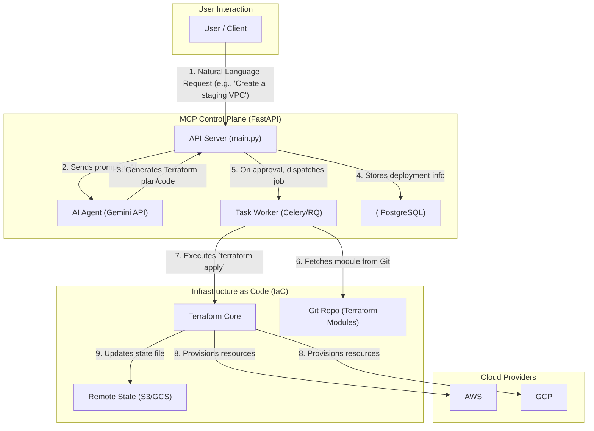

# MCP (Model Context Protocol) Architecture Diagram

이 다이어그램은 AI 에이전트(Gemini)를 활용한 멀티클라우드 관리 플랫폼의 전체 아키텍처와 데이터 흐름을 보여줍니다.

### Components

*   **User / Client**: 시스템과 상호작용하는 사용자 또는 외부 시스템입니다.
*   **MCP Control Plane**:
    *   **API Server (FastAPI)**: 모든 요청의 진입점입니다. 사용자 인증, 요청 검증, AI 에이전트 및 워커 오케스트레이션을 담당합니다.
    *   **AI Agent (Gemini API)**: 사용자의 자연어 요청을 해석하여 실행 가능한 Terraform 계획을 생성하거나 코드 변경을 제안합니다.
    *   **Task Worker**: `terraform apply`, `plan` 등 시간이 오래 걸리는 작업을 비동기적으로 실행합니다.
    *   **PostgreSQL DB**: 배포 이력, 리소스 템플릿, 사용자 정보 등 시스템의 상태 데이터를 저장합니다.
*   **Infrastructure as Code (IaC)**:
    *   **Terraform Core**: IaC 정의를 실행하여 클라우드 리소스를 생성/관리합니다.
    *   **Remote State (S3/GCS)**: Terraform이 관리하는 인프라의 상태를 저장하여 상태 잠금 및 협업을 지원합니다.
    *   **Git Repo**: 재사용 가능한 Terraform 모듈을 저장하고 버전 관리합니다.
*   **Cloud Providers**:
    *   **AWS / GCP**: Terraform에 의해 실제 리소스가 프로비저닝되는 대상 클라우드입니다.
