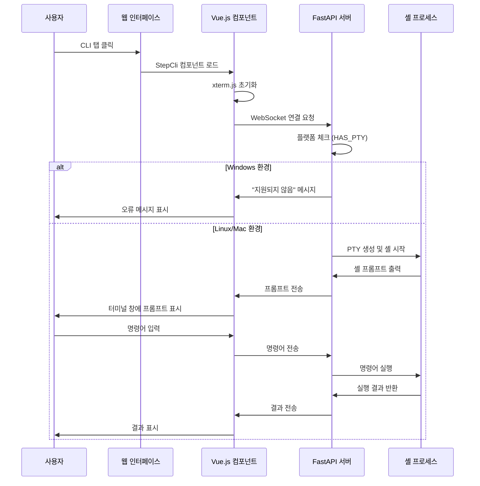
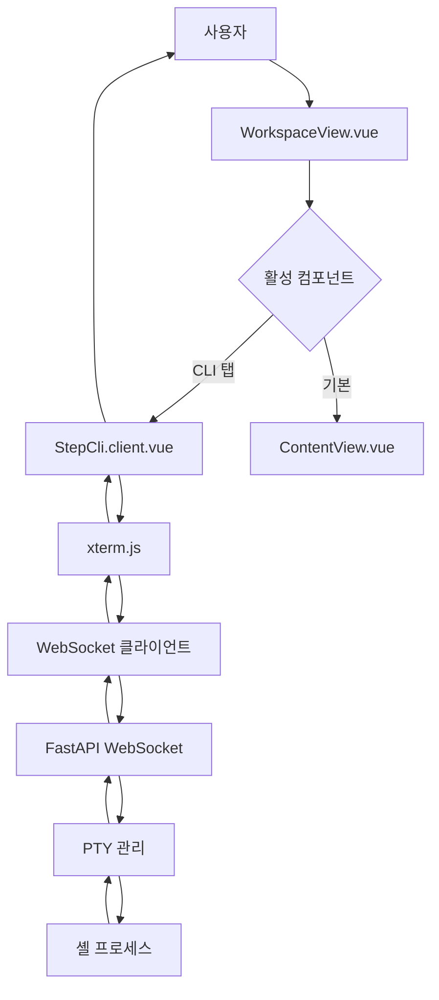
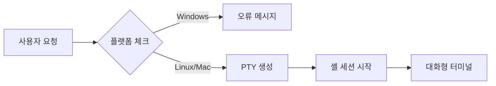

# CLI 창 팝업 사용자 시나리오 및 흐름도

## 1. 개요

MCP Cloud 플랫폼의 CLI(Command Line Interface) 기능은 사용자가 웹 브라우저에서 직접 클라우드 명령어를 실행할 수 있도록 제공하는 대화형 터미널 기능입니다.

### 주요 특징
- **웹 기반 터미널**: xterm.js를 사용한 브라우저 내 터미널
- **실시간 대화형**: WebSocket을 통한 실시간 양방향 통신
- **플랫폼 제한**: Windows에서는 지원되지 않음 (PTY 제한)
- **보안 격리**: 백엔드에서 셸 프로세스 격리 실행

## 2. 사용자 시나리오

### 2.1 기본 사용 흐름



### 2.2 상세 사용 시나리오

#### 시나리오 1: CLI 탭 접근
1. **시작**: 사용자가 웹 인터페이스의 "CLI" 탭 클릭
2. **로딩**: StepCli 컴포넌트가 동적으로 로드됨
3. **초기화**: xterm.js 터미널이 초기화되고 WebSocket 연결 시도
4. **연결**: 백엔드와 WebSocket 연결 수립
5. **결과**: 
   - Windows: "Interactive shell is not supported on this platform." 메시지
   - Linux/Mac: 실제 셸 프롬프트 표시

#### 시나리오 2: 명령어 실행 (Linux/Mac)
1. **입력**: 사용자가 터미널에 명령어 입력 (예: `ls -la`)
2. **전송**: 입력된 명령어가 WebSocket을 통해 백엔드로 전송
3. **실행**: 백엔드에서 PTY를 통해 셸 프로세스에 명령어 전달
4. **처리**: 셸에서 명령어 실행 및 결과 생성
5. **반환**: 실행 결과가 WebSocket을 통해 프론트엔드로 전송
6. **표시**: 터미널에 결과 출력

#### 시나리오 3: 세션 종료
1. **종료 요청**: 사용자가 브라우저 탭 닫기 또는 페이지 새로고침
2. **연결 해제**: WebSocket 연결 종료
3. **프로세스 정리**: 백엔드에서 셸 프로세스 종료 및 PTY 정리
4. **리소스 해제**: xterm.js 인스턴스 정리

## 3. 기술적 아키텍처

### 3.1 프론트엔드 구조

```
WorkspaceView.vue
├── ContentView.vue (기본 콘텐츠 뷰)
└── StepCli.client.vue (CLI 컴포넌트)
    ├── xterm.js 터미널
    ├── WebSocket 클라이언트
    └── 이벤트 핸들러
```

### 3.2 백엔드 구조

```
FastAPI 서버
├── WebSocket 엔드포인트 (/ws/v1/cli/interactive)
├── PTY 관리 (Linux/Mac)
├── 셸 프로세스 관리
└── 보안 검증
```

### 3.3 컴포넌트 상호작용



## 4. 데이터 흐름도

### 4.1 WebSocket 통신 흐름

```
[사용자 입력] → [xterm.js] → [WebSocket] → [FastAPI] → [PTY] → [셸]
                                                                    ↓
[사용자 출력] ← [xterm.js] ← [WebSocket] ← [FastAPI] ← [PTY] ← [셸 결과]
```

### 4.2 상세 데이터 흐름

#### 입력 흐름
1. **키보드 이벤트**: 사용자가 키 입력
2. **xterm.js 처리**: 터미널에서 키 이벤트 처리
3. **WebSocket 전송**: `term.onData()` → `ws.send(data)`
4. **백엔드 수신**: `websocket.receive_text()`
5. **PTY 전달**: `os.write(master_fd, data.encode())`
6. **셸 실행**: 셸 프로세스에서 명령어 처리

#### 출력 흐름
1. **셸 출력**: 셸 프로세스에서 결과 생성
2. **PTY 읽기**: `os.read(master_fd, 1024)`
3. **백엔드 전송**: `websocket.send_text(output.decode())`
4. **프론트엔드 수신**: `ws.onmessage` 이벤트
5. **터미널 표시**: `term.write(event.data)`

## 5. 플랫폼별 동작

### 5.1 Windows 환경
- **지원 상태**: ❌ 지원되지 않음
- **제한 사유**: PTY (Pseudo Terminal) 지원 부족
- **사용자 경험**: 오류 메시지 표시
- **개선 방안**: Docker 컨테이너 내 실행 또는 WSL2 활용

### 5.2 Linux/Mac 환경
- **지원 상태**: ✅ 완전 지원
- **기능**: 실시간 대화형 셸
- **보안**: 프로세스 격리 실행
- **성능**: 네이티브 PTY 사용으로 최적 성능

### 5.3 크로스 플랫폼 호환성



## 6. 보안 고려사항

### 6.1 현재 구현의 보안 한계
- **프로세스 격리**: 기본적인 프로세스 격리만 제공
- **명령어 제한**: 사용자가 모든 셸 명령어 실행 가능
- **권한 관리**: 백엔드 프로세스 권한으로 실행
- **세션 관리**: 단순한 WebSocket 연결 기반

### 6.2 권장 보안 개선사항
1. **Docker 컨테이너 격리**: 각 세션을 별도 컨테이너에서 실행
2. **명령어 화이트리스트**: 허용된 명령어만 실행 가능하도록 제한
3. **사용자 권한 제한**: 최소 권한 원칙 적용
4. **세션 타임아웃**: 자동 세션 종료 기능
5. **감사 로그**: 모든 명령어 실행 로그 기록

## 7. 개선 방안

### 7.1 단기 개선사항
- [ ] Windows 지원을 위한 Docker 컨테이너 기반 실행
- [ ] 명령어 실행 제한 및 화이트리스트 구현
- [ ] 세션 타임아웃 및 자동 정리 기능
- [ ] 에러 처리 및 사용자 피드백 개선

### 7.2 중기 개선사항
- [ ] 멀티 사용자 세션 관리
- [ ] 명령어 히스토리 및 자동완성 기능
- [ ] 파일 업로드/다운로드 기능
- [ ] 터미널 테마 및 설정 커스터마이징

### 7.3 장기 개선사항
- [ ] 클라우드 네이티브 터미널 (Kubernetes Pod 내 실행)
- [ ] AI 기반 명령어 추천 및 자동화
- [ ] 협업 기능 (멀티 사용자 동시 접속)
- [ ] 고급 보안 기능 (RBAC, 암호화 등)

## 8. 구현 세부사항

### 8.1 프론트엔드 구현
```javascript
// StepCli.client.vue 주요 코드
const wsUrl = 'ws://localhost:8000/ws/v1/cli/interactive';
ws = new WebSocket(wsUrl);

term.onData((data) => {
  if (ws.readyState === WebSocket.OPEN) {
    ws.send(data);
  }
});

ws.onmessage = (event) => {
  term.write(event.data);
};
```

### 8.2 백엔드 구현
```python
# main.py WebSocket 엔드포인트
@app.websocket("/ws/v1/cli/interactive")
async def websocket_interactive_cli(websocket: WebSocket):
    await websocket.accept()
    
    if not HAS_PTY:
        await websocket.send_text("Interactive shell is not supported on this platform.")
        await websocket.close()
        return
    
    master_fd, slave_fd = pty.openpty()
    shell_process = await asyncio.create_subprocess_shell(
        'sh', stdin=slave_fd, stdout=slave_fd, stderr=slave_fd
    )
```

## 9. 테스트 시나리오

### 9.1 기능 테스트
- [ ] CLI 탭 클릭 시 컴포넌트 로드
- [ ] WebSocket 연결 성공/실패 처리
- [ ] 명령어 입력 및 실행
- [ ] 출력 결과 표시
- [ ] 세션 종료 및 정리

### 9.2 플랫폼 테스트
- [ ] Windows 환경에서 오류 메시지 표시
- [ ] Linux/Mac 환경에서 정상 동작
- [ ] 크로스 브라우저 호환성

### 9.3 보안 테스트
- [ ] 명령어 실행 권한 검증
- [ ] 세션 격리 확인
- [ ] 리소스 정리 검증

## 10. 결론

CLI 창 팝업 기능은 MCP Cloud 플랫폼의 핵심 기능 중 하나로, 사용자가 웹 브라우저에서 직접 클라우드 명령어를 실행할 수 있게 해줍니다. 현재는 Linux/Mac 환경에서만 완전히 지원되지만, 향후 Docker 기반 구현을 통해 Windows 지원도 가능할 것으로 예상됩니다.

보안과 사용성의 균형을 맞추기 위해 단계적인 개선이 필요하며, 특히 프로덕션 환경에서는 강화된 보안 조치가 필수적입니다.
