좋습니다 👍
말씀하신 **외부 MCP 서버(K8s, GitHub)**와 내부 MCP 서버(FastAPI + RAG + Neo4j + Postgres) 간 연동 구조를 상세히 풀어드릴게요.

---

# 🔹 외부 MCP 서버 연동 구조

## 1. 전체 아키텍처 개요

```
[사용자]
   ↓
[AI Agent (LLM)]
   - Persona 주입 (DevOps / Security / SRE)
   - 규정 주입 (보안/정책 Guardrail)
   - Tool 선택 (Terraform / K8s / GitHub)
   ↓
[Internal MCP]
   - FastAPI (오케스트레이터)
   - RAG Layer (LlamaIndex + Neo4j)
   - Postgres (이력/상태 저장)
   - Terraform Generator + Validator
   ↓
┌───────────────────────────────┐
│        External MCP Layer      │
│                                │
│  • Kubernetes MCP (K8s API,    │
│    ArgoCD, Crossplane, FluxCD) │
│  • GitHub MCP (Actions, API,   │
│    Repo, PR)                   │
└───────────────────────────────┘
   ↓
[실제 멀티클라우드 인프라 + K8s Cluster + GitOps Repo]
```

---

## 2. Kubernetes MCP 연동 구조

### 🔹 흐름

1. **LLM 요청**

   > "AWS EKS 클러스터에 Nginx 배포하고 ArgoCD로 관리해줘."

2. **Internal MCP 처리** (FastAPI 기반)

   * FastAPI → Terraform 코드로 EKS/GKE/AKS 클러스터 정의
   * Neo4j → 기존 네트워크/보안 규칙 탐색
   * 보안 Persona → PodSecurityPolicy, RBAC 검증
   * Postgres → 실행 이력 기록

3. **외부 MCP (K8s 관련)**

   * ArgoCD: GitOps Repo에서 Manifest 동기화
   * Crossplane: K8s CRD 기반으로 AWS/GCP/Azure 리소스 관리
   * K8s API: 직접 `kubectl apply` or Operator 방식 실행

4. **실행 결과**

   * 클러스터 내부 배포 상태를 Neo4j 그래프에 업데이트
   * FastAPI가 “배포 성공, Pod 3개 Running 중” 같은 피드백 제공

---

## 3. GitHub MCP 연동 구조

### 🔹 흐름

1. **LLM 요청**

   > "Terraform 코드 리뷰 후 GitHub Actions로 배포 실행해줘."

2. **Internal MCP 처리** (FastAPI 기반)

   * Terraform 코드 생성 (RAG + Neo4j 기반)
   * Policy Validator (OPA/Regula) 실행
   * Security Persona → 코드 리뷰 가이드라인 적용
   * Postgres → 이력 저장

3. **외부 MCP (GitHub)**

   * GitHub API: PR 생성 (`POST /repos/:owner/:repo/pulls`)
   * GitHub Actions: 워크플로우 실행 (`POST /repos/:owner/:repo/actions/workflows/:id/dispatches`)
   * 리뷰어 승인 시 Apply 단계 진행

4. **실행 결과**

   * GitHub Actions 로그를 Internal MCP(FastAPI)로 가져와 요약
   * Neo4j에 배포 상태 업데이트
   * Postgres에 최종 성공/실패 기록

---

## 4. Internal MCP ↔ External MCP 인터페이스

| 구분             | 인터페이스                                                   | 사용 기술                                 |
| -------------- | ------------------------------------------------------- | ------------------------------------- |
| **K8s MCP**    | REST (K8s API Server), gRPC(ArgoCD API), GitOps Repo 연계 | `kubectl`, `argo-cd CLI`, GitOps push |
| **GitHub MCP** | REST API, GraphQL API                                   | GitHub REST API, GraphQL, Webhook     |

---

## 5. AI Agent(LLM) 역할

* **Persona**에 따라 다른 MCP 사용 전략 선택

  * DevOps Persona → Terraform + K8s MCP 조합 (배포 자동화)
  * Security Persona → Policy 검증 후 GitHub PR 리뷰 요청
  * SRE Persona → 실행 로그/모니터링 데이터 요약

* **규정(Guardrail)**을 FastAPI 내 모듈/서비스 레벨에서 주입

  * 예: “퍼블릭 S3 금지” → Terraform Validator 단계에서 차단
  * 예: “Root 권한 Pod 금지” → K8s MCP 호출 전 검사

---

## 6. 장점

1. **내부 MCP = 두뇌 (FastAPI + Neo4j + Postgres + 정책 검증)**
2. **외부 MCP = 손발 (실제 배포/운영 수행)**
3. **K8s + GitHub 결합**으로 IaC + GitOps + CI/CD를 완성
4. **Neo4j 그래프**로 멀티클라우드 + K8s + GitOps 상태를 통합 관리

---

✅ 즉, 외부 MCP(K8s, GitHub)는 **실행 주체**이고, 내부 MCP는 **지능형 지휘본부**입니다. LangChain은 프로토타입 검증용으로만 사용하며, 프로덕션은 **FastAPI 중심 구조**가 권장됩니다.

---

# 🔹 외부 MCP(K8s, GitHub) 연동 시퀀스 다이어그램

```mermaid
sequenceDiagram
    autonumber
    participant User as 사용자
    participant LLM as AI Agent (LLM)
    participant IMCP as Internal MCP (FastAPI+Neo4j+Postgres)
    participant KMCP as K8s MCP (API/ArgoCD)
    participant GMCP as GitHub MCP (API/Actions)
    participant Infra as Multi-Cloud Infra & K8s Cluster

    User->>LLM: "EKS 클러스터에 앱 배포해줘"
    LLM->>IMCP: 요청 전달 (Persona + 규정 적용)
    IMCP->>IMCP: RAG 검색 + Neo4j 참조 (보안/인프라 상태 확인)
    IMCP->>IMCP: Terraform 코드 생성 & 검증
    IMCP->>GMCP: GitHub PR 생성 (코드 푸시)
    GMCP->>GMCP: GitHub Actions 실행
    GMCP->>KMCP: K8s 배포 요청 (ArgoCD/Flux)
    KMCP->>Infra: K8s API 호출 → 배포 실행
    Infra-->>KMCP: 배포 상태 (Pod Running 등)
    KMCP-->>IMCP: 실행 결과 전달
    GMCP-->>IMCP: CI/CD 로그 전달
    IMCP-->>LLM: 배포 요약 보고 (상태/로그/보안 준수 여부)
    LLM-->>User: "배포 완료, Pod 3개 Running"
```



---

# 🔹 흐름 요약

1. **사용자 요청** → LLM (Persona & Guardrail 적용)
2. **Internal MCP (FastAPI)** → RAG + Neo4j에서 맥락 검색 후 Terraform 코드 생성
3. **GitHub MCP** → 코드 PR & Actions 실행
4. **K8s MCP** → GitOps 방식(ArgoCD/Flux)으로 클러스터에 배포
5. **Infra** → 실제 멀티클라우드 + K8s 실행
6. **피드백 루프** → Neo4j에 기록 + Postgres 로그 저장 + 사용자 보고

---

## 🔹 로컬 실행 가이드 (docker-compose)

### 준비물
- Docker Desktop, Docker Compose
- Windows PowerShell 기준 경로: `C:\Users\JIH\githubs\mcp_cloud`

### 환경 변수 파일 생성
- Neo4j 전용 (.neo4j.env)
```powershell
New-Item -ItemType Directory -Force backend/env
Copy-Item backend\env\.neo4j.env.example backend\env\.neo4j.env
# 편집: backend\env\.neo4j.env 에서 NEO4J_AUTH=neo4j/<강력한패스워드>
```
- 백엔드/DB 등 (.env)
```powershell
Copy-Item docs\env.example backend\env\.env
# 편집: POSTGRES_PASSWORD, DATABASE_URL 등 실제 값으로 수정
```

### 기동/상태 확인/중지
```bash
docker compose up -d
docker compose ps
docker compose logs -f mcp_backend
# 중지
docker compose down
```

### 서비스 포트
- Backend(FastAPI): http://localhost:8000
- Frontend: http://localhost:3000
- Postgres: localhost:5432
- Redis: localhost:6379
- Neo4j Browser: http://localhost:7474 (Bolt: 7687)

### 트러블슈팅
- Neo4j “Unrecognized setting: PASSWORD” → `NEO4J_PASSWORD` 등 개별 변수 제거, `NEO4J_AUTH`만 사용(이미 `.neo4j.env`로 분리)
- env 파일 누락 → `.env`, `.neo4j.env` 두 파일 존재 확인 후 재기동
- 인증 실패 경고 → `NEO4J_AUTH` 값과 백엔드 접속 설정 일치 여부 확인
- 포트 충돌 → 해당 포트 점유 프로세스 종료 후 재기동

---

## 🔹 옵션: 설정 키/값의 Postgres 중앙관리
- 장점: 환경/서비스/테넌트별 오버라이드, 버전/감사, 동적 적용
- 스키마(요약)
```sql
CREATE TABLE config_items (
  id BIGSERIAL PRIMARY KEY,
  scope_env TEXT, scope_service TEXT, scope_tenant TEXT NULL,
  key TEXT NOT NULL,
  value_plain TEXT NULL, value_json JSONB NULL,
  is_secret BOOLEAN NOT NULL DEFAULT FALSE,
  secret_ciphertext BYTEA NULL, secret_key_id TEXT NULL,
  version INT NOT NULL DEFAULT 1, enabled BOOLEAN NOT NULL DEFAULT TRUE,
  updated_by TEXT, updated_at TIMESTAMPTZ NOT NULL DEFAULT now()
);
CREATE TABLE config_audit (
  id BIGSERIAL PRIMARY KEY, item_id BIGINT REFERENCES config_items(id),
  action TEXT NOT NULL, diff JSONB, actor TEXT, created_at TIMESTAMPTZ DEFAULT now()
);
```
- 암호화: Vault Transit 또는 Cloud KMS 권장(서버 내부에서만 복호화)
- API 초안: GET /api/v1/config/resolve, POST/PATCH /api/v1/config, /{id}/rotate, /{id}/audit
- 캐시: Redis Read-through + Pub/Sub 무효화

---

## 🔹 개발 작업계획 (최종 상세)
- 주차 1: 로컬 실행 완성 — compose 기동, env 정리, 헬스체크, 트러블슈팅 문서 반영
- 주차 2: 백엔드 API 스캐폴드 — FastAPI CRUD, Alembic, OpenAPI 노출
- 주차 3: 프론트 최소 UI — 배포 요청/상태/로그 뷰어
- 주차 4: Terraform 연동 — plan/apply 워커, 로그 수집, 승인 스텁
- 주차 5: 보안/정책 — 시크릿 정책, RBAC 초안, tfsec/checkov
- 주차 6: 설정 중앙관리(옵션) — 테이블/DAO/캐시/라우터, 비밀 암호화 어댑터

### 완료 기준
- docker-compose만으로 풀스택 기동 가능
- Neo4j/DB/Redis/Backend/Frontend 정상 동작
- 기본 배포 플로우 시연(스텁 포함), 문서/가이드 최신화

