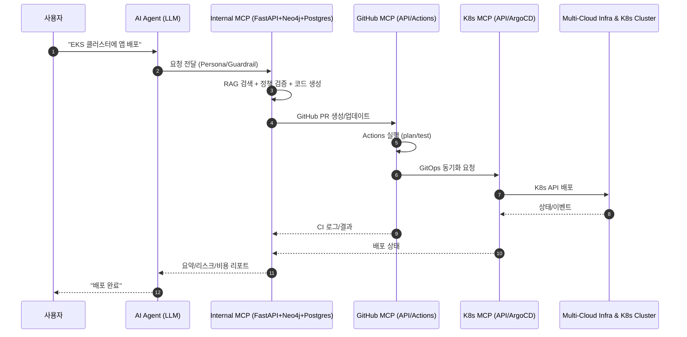

# RAG + 외부 MCP + FastAPI (Production Architecture)

- 목적: 프로토타입(LangChain 중심)에서 프로덕션(FastAPI 중심 오케스트레이션)으로 전환
- 대상 문서: [RAG+외부MCP.md](mdc:docs/RAG+외부MCP.md) → 본 문서로 대체/확장
- 변경 계획: [아키텍트변경작업게획.md](mdc:docs/아키텍트변경작업게획.md)

---

## 왜 LangChain에서 FastAPI 중심으로 전환하나

**프로덕션 환경 이슈(요약)**
- 체인/에이전트의 암묵적 상태 관리로 재현성/트레이싱 난이도 증가
- 내부 재시도/캐시/툴 호출이 프레임워크 내부에 숨겨져 관측성(로그/메트릭) 취약
- 장시간 동기 실행 경향 → 웹서버 워커 점유, 타임아웃·스케일링 이슈
- 메모리 사용량 증가 및 누수 리스크(세션 컨텍스트 누적)
- 서드파티 의존 커넥터 락인 위험, 버전 호환성 문제
- 엔터프라이즈 표준(의존성 주입, 명시적 API 계약, 모듈 경계) 부합도 낮음

**개선 목표**
- FastAPI 중심의 명시적 서비스 계층(입·출력 Pydantic 모델, 의존성 주입)
- 비동기 I/O + 워커 분리(Celery/K8s Job)로 `plan/apply/test` 분산 실행
- OpenTelemetry 기반 분산추적/로그/메트릭 표준화
- Policy-as-code(OPA/Regula), 보안 스캔(tfsec/checkov) 일급 통합
- GitOps/K8s MCP/GitHub MCP와 느슨한 결합 인터페이스 명시

---

## 전체 아키텍처 개요

```
[사용자]
  ↓
[AI Agent (LLM)]
  - Persona 주입, Guardrail
  - Tool 선택 (Terraform / K8s / GitHub)
  ↓
[Internal MCP — FastAPI]
  - Orchestrator(API) + RAG(LlamaIndex+Neo4j)
  - Postgres(메타/상태), Redis(Queue)
  - Workers: terraform plan/apply/test
  - Policy/Validation, Cost Estimator, Observability
  ↓
┌───────────────────────────────┐
│        External MCP Layer      │
│  • Kubernetes MCP (ArgoCD/Flux, K8s API)
│  • GitHub MCP (API/Actions/PR)
└───────────────────────────────┘
  ↓
[멀티클라우드 인프라 + K8s Cluster + GitOps Repo]
```

---

## 시퀀스 다이어그램



---

## LangChain(프로토타입) vs FastAPI(프로덕션)

| 항목 | LangChain 기반 | FastAPI 중심 |
|---|---|---|
| 실행 모델 | 체인/에이전트 내부 상태 | 명시적 서비스/워크플로(API+Worker) |
| 신뢰성/재현성 | 비결정적 흐름 가능 | 계약 기반(Pydantic) + 단계 로그 |
| 스케일링 | 동기 호출 중심 | Async I/O + 워커 분리 |
| 관측성 | 제한적 | OTel 트레이싱/메트릭/로그 일원화 |
| 보안/정책 | 체인 훅 | OPA/Regula, tfsec/checkov 내장 |
| 락인 위험 | 상대적으로 큼 | 느슨한 인터페이스, 교체 용이 |

---

## 핵심 API 초안 (v1)

- POST `/api/v1/deployments` — 템플릿+vars로 배포 요청
- GET `/api/v1/deployments/{id}/plan` — plan 결과 조회
- POST `/api/v1/deployments/{id}/approve` — 승인
- POST `/api/v1/deployments/{id}/apply` — apply 트리거
- GET `/api/v1/deployments/{id}/status` — 상태/이벤트 조회
- GET `/api/v1/config/resolve` — 환경별 구성 값

Pydantic 모델과 OpenAPI는 FastAPI에서 자동 노출.

---

## 운영·테스트 표준

- Pre-apply 자동 검사: tfsec/checkov, 정책 위반 차단
- 비용 추정: 변경 리소스 기준 사전 비용 리포트
- 통합 로깅/트레이싱: OpenTelemetry + Grafana/Loki/Tempo
- Queue 분리: `plan/apply/test` 워커 격리, 재시도/백오프 정책
- GitOps: PR 리뷰/승인 없이는 `apply` 불가(정책)

---

## 워커 전략: Celery 확정

- 런타임: Celery + Redis 브로커(로컬), 프로덕션은 Redis/RabbitMQ 선택지
- 태스크 큐 분리: `plan`, `apply`, `test` 전용 큐 및 동시성 제한
- 재시도/백오프: 지수 백오프, 최대 재시도 횟수, idempotency 키 적용
- 장기 작업: 하트비트/소프트타임리밋/하드타임리밋 설정, 진행률 이벤트(emitter)
- 관측성: OTel Celery 인스트루멘테이션으로 트레이스 연계

예시 큐 구성(개념):
```text
celery -A app.worker worker -Q plan -c 2
celery -A app.worker worker -Q apply -c 1
celery -A app.worker worker -Q test -c 2
```

---

## OpenTelemetry(OTel) 적용 가이드

### 목표
- FastAPI, Celery, DB(Postgres), Redis, HTTP 외부 호출, GitHub/K8s API에 대한 단일 트레이스 컨텍스트 수집
- 로그-트레이스 연계(TraceID 필드), 메트릭(요청/지연/에러) 표준화

### 구성 요소
- Tracer/Logger/Metrics SDK: opentelemetry-sdk
- Exporter: OTLP gRPC/HTTP → Tempo/OTel Collector
- FastAPI 자동계측: opentelemetry-instrumentation-fastapi, asgi
- Celery 자동계측: opentelemetry-instrumentation-celery
- DB/Redis/HTTP: psycopg2/asyncpg, redis, requests/httpx 인스트루먼트

### 적용 순서(요약)
1) 의존성 추가: `opentelemetry-sdk`, `opentelemetry-exporter-otlp`, `opentelemetry-instrumentation-{fastapi,asgi,celery,requests,psycopg2,redis}`
2) 환경변수 설정:
   - `OTEL_SERVICE_NAME=mcp-backend`
   - `OTEL_EXPORTER_OTLP_ENDPOINT=http://otel-collector:4317`
   - `OTEL_RESOURCE_ATTRIBUTES=deployment.environment=dev`
3) FastAPI 기동 스크립트에서 초기화:
   - 리소스/TracerProvider 설정 → OTLPExporter 등록 → BatchSpanProcessor 추가
   - FastAPI/ASGI 자동계측 활성화
4) Celery 워커 시작 스크립트에서 초기화:
   - Celery 인스트루멘테이션 enable, 작업별 Span 생성
5) 컨텍스트 전파:
   - HTTP 헤더(W3C Trace Context) → FastAPI → Celery 메시지 헤더로 propagate
6) 대시보드: Tempo/Grafana에서 서비스간 호출 트레이스 확인

### 샘플 초기화 스니펫(개념)
```python
from opentelemetry.sdk.resources import Resource
from opentelemetry.sdk.trace import TracerProvider
from opentelemetry.sdk.trace.export import BatchSpanProcessor
from opentelemetry.exporter.otlp.proto.grpc.trace_exporter import OTLPSpanExporter
from opentelemetry import trace

resource = Resource.create({"service.name": "mcp-backend"})
provider = TracerProvider(resource=resource)
processor = BatchSpanProcessor(OTLPSpanExporter(endpoint="http://otel-collector:4317", insecure=True))
provider.add_span_processor(processor)
trace.set_tracer_provider(provider)
```

로그 연계는 로거 포맷에 `trace_id`, `span_id` 주입하여 수집 시스템(ELK/Grafana Loki)과 상관관계가 가능하도록 합니다.

## 로컬 실행 가이드 (docker-compose)

- 백엔드(FastAPI): `http://localhost:8000`
- 프론트엔드: `http://localhost:3000`
- Postgres: `localhost:5432`, Redis: `localhost:6379`, Neo4j: `http://localhost:7474`
- 환경 변수 예시는 [env.example](mdc:docs/env.example)

```bash
# 기동
docker compose up -d
# 로그
docker compose logs -f mcp_backend
```

---

## 참고/연계 문서
- 기존: [RAG+외부MCP.md](mdc:docs/RAG+외부MCP.md)
- 작업계획: [아키텍트변경작업게획.md](mdc:docs/아키텍트변경작업게획.md)
