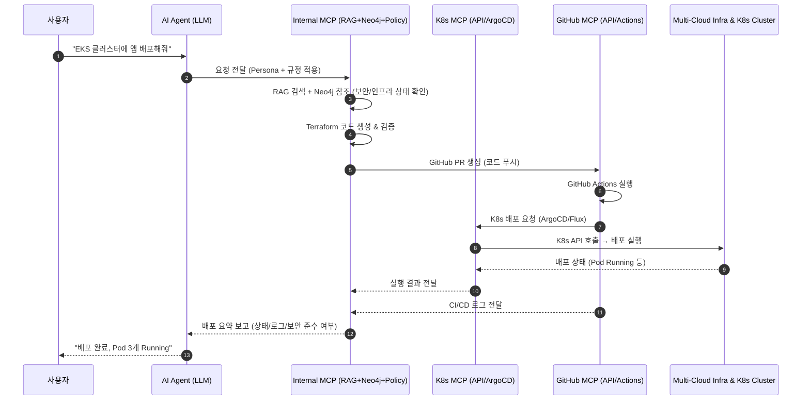

좋습니다 👍
말씀하신 \*\*외부 MCP 서버(K8s, GitHub)\*\*와 내부 MCP 서버(LangChain + RAG + Terraform) 간 연동 구조를 상세히 풀어드릴게요.

---

# 🔹 외부 MCP 서버 연동 구조

## 1. 전체 아키텍처 개요

```
[사용자] 
   ↓
[AI Agent (LLM)]
   - Persona 주입 (DevOps / Security / SRE)
   - 규정 주입 (보안/정책 Guardrail)
   - Tool 선택 (Terraform / K8s / GitHub)
   ↓
[Internal MCP]
   - RAG Layer (LlamaIndex + Neo4j)
   - Terraform Generator + Validator
   ↓
┌───────────────────────────────┐
│        External MCP Layer      │
│                                │
│  • Kubernetes MCP (K8s API,    │
│    ArgoCD, Crossplane, FluxCD) │
│  • GitHub MCP (Actions, API,   │
│    Repo, PR)                   │
└───────────────────────────────┘
   ↓
[실제 멀티클라우드 인프라 + K8s Cluster + GitOps Repo]
```

---

## 2. Kubernetes MCP 연동 구조

### 🔹 흐름

1. **LLM 요청**

   > "AWS EKS 클러스터에 Nginx 배포하고 ArgoCD로 관리해줘."

2. **Internal MCP 처리**

   * LLM → Terraform 코드로 EKS/GKE/AKS 클러스터 정의
   * RAG(Neo4j) → 기존 네트워크/보안 규칙 탐색
   * 보안 Persona → PodSecurityPolicy, RBAC 검증

3. **외부 MCP (K8s 관련)**

   * ArgoCD: GitOps Repo에서 Manifest 동기화
   * Crossplane: K8s CRD 기반으로 AWS/GCP/Azure 리소스 관리
   * K8s API: 직접 `kubectl apply` or Operator 방식 실행

4. **실행 결과**

   * 클러스터 내부 배포 상태를 Neo4j 그래프에 업데이트
   * LLM이 “배포 성공, Pod 3개 Running 중” 같은 피드백 제공

---

## 3. GitHub MCP 연동 구조

### 🔹 흐름

1. **LLM 요청**

   > "Terraform 코드 리뷰 후 GitHub Actions로 배포 실행해줘."

2. **Internal MCP 처리**

   * Terraform 코드 생성 (RAG + Neo4j 기반)
   * Policy Validator (OPA/Regula) 실행
   * Security Persona → 코드 리뷰 가이드라인 적용

3. **외부 MCP (GitHub)**

   * GitHub API: PR 생성 (`POST /repos/:owner/:repo/pulls`)
   * GitHub Actions: 워크플로우 실행 (`POST /repos/:owner/:repo/actions/workflows/:id/dispatches`)
   * 리뷰어 승인 시 Apply 단계 진행

4. **실행 결과**

   * GitHub Actions 로그를 Internal MCP로 가져와 요약
   * Neo4j에 배포 상태 업데이트

---

## 4. Internal MCP ↔ External MCP 인터페이스

| 구분             | 인터페이스                                                   | 사용 기술                                 |
| -------------- | ------------------------------------------------------- | ------------------------------------- |
| **K8s MCP**    | REST (K8s API Server), gRPC(ArgoCD API), GitOps Repo 연계 | `kubectl`, `argo-cd CLI`, GitOps push |
| **GitHub MCP** | REST API, GraphQL API                                   | GitHub REST API, GraphQL, Webhook     |

---

## 5. AI Agent(LLM) 역할

* **Persona**에 따라 다른 MCP 사용 전략 선택

  * DevOps Persona → Terraform + K8s MCP 조합 (배포 자동화)
  * Security Persona → Policy 검증 후 GitHub PR 리뷰 요청
  * SRE Persona → 실행 로그/모니터링 데이터 요약

* \*\*규정(Guardrail)\*\*을 LangChain Chain/Tool 레벨에서 주입

  * 예: “퍼블릭 S3 금지” → Terraform Validator 단계에서 차단
  * 예: “Root 권한 Pod 금지” → K8s MCP 호출 전 검사

---

## 6. 장점

1. **내부 MCP = 두뇌 (LLM + RAG + 정책 검증)**
2. **외부 MCP = 손발 (실제 배포/운영 수행)**
3. **K8s + GitHub 결합**으로 IaC + GitOps + CI/CD를 완성
4. **Neo4j 그래프**로 멀티클라우드 + K8s + GitOps 상태를 통합 관리

---

✅ 즉, 외부 MCP(K8s, GitHub)는 **실행 주체**이고, 내부 MCP는 **지능형 지휘본부**라고 보시면 됩니다.

---

**시퀀스 다이어그램**


---

# 🔹 외부 MCP(K8s, GitHub) 연동 시퀀스 다이어그램



---

# 🔹 흐름 요약

1. **사용자 요청** → LLM (Persona & Guardrail 적용)
2. **Internal MCP** → RAG + Neo4j에서 맥락 검색 후 Terraform 코드 생성
3. **GitHub MCP** → 코드 PR & Actions 실행
4. **K8s MCP** → GitOps 방식(ArgoCD/Flux)으로 클러스터에 배포
5. **Infra** → 실제 멀티클라우드 + K8s 실행
6. **피드백 루프** → Neo4j에 기록 + 요약 리포트 사용자 전달

---

👉 이 방식이면 \*\*GitHub(MCP)\*\*가 **CI/CD 허브**, **K8s MCP**가 **실행 엔진**, 그리고 **Internal MCP**가 **두뇌(RAG + 정책)** 역할을 하게 됩니다.


