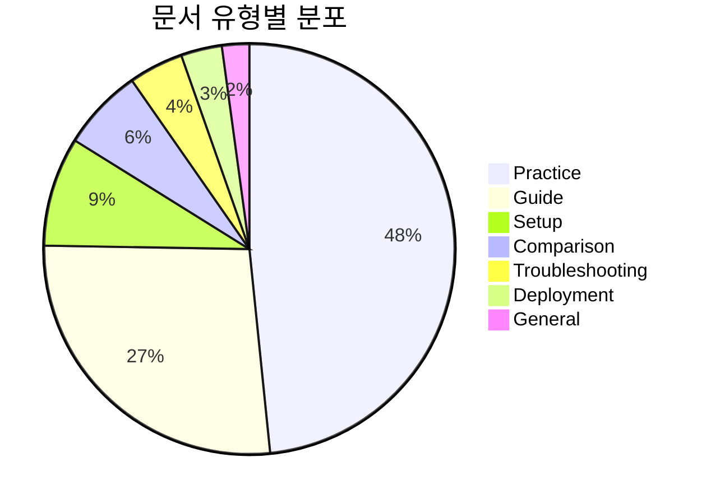

# 문서 관계 시각화 다이어그램

## 📊 전체 구조 다이어그램

```mermaid
graph TD
    A[🏠 통합 인덱스<br/>index.md] --> B[📚 전체 커리큘럼<br/>curriculum.md]
    
    A --> C[☁️ Cloud Basic<br/>README.md]
    A --> D[🚀 Cloud Master<br/>README.md]
    A --> E[🐳 Cloud Container<br/>README.md]
    
    C --> C1[📅 Day1<br/>README.md]
    C --> C2[📅 Day2<br/>README.md]
    
    D --> D1[📅 Day1<br/>README.md]
    D --> D2[📅 Day2<br/>README.md]
    D --> D3[📅 Day3<br/>README.md]
    
    E --> E1[📅 Day1<br/>README.md]
    E --> E2[📅 Day2<br/>README.md]
    
    C1 --> C1A[💻 AWS/GCP 계정 설정<br/>aws-gcp-account-setup.md]
    C1 --> C1B[🔐 IAM 기초 가이드<br/>iam-basics-guide.md]
    C1 --> C1C[💾 스토리지 서비스 가이드<br/>storage-services-guide.md]
    C1 --> C1D[🖥️ VM 서비스 가이드<br/>vm-services-guide.md]
    C1 --> C1E[🔧 문제해결 가이드<br/>troubleshooting-guide.md]
    C1 --> C1F[📝 실습 가이드들<br/>practice/*.md]
    
    C2 --> C2A[⚖️ 컴퓨팅 비교<br/>compute_comparison.md]
    C2 --> C2B[🗄️ 데이터베이스 비교<br/>database_comparison.md]
    C2 --> C2C[🌐 네트워킹 비교<br/>network_comparison.md]
    C2 --> C2D[💾 스토리지 비교<br/>storage_comparison.md]
    C2 --> C2E[🔗 기본→마스터 연결<br/>basic-to-master-bridge.md]
    
    D1 --> D1A[🐳 Docker 기초 가이드<br/>docker-basic-guide.md]
    D1 --> D1B[🐳 Docker 고급 가이드<br/>docker-advanced-guide.md]
    D1 --> D1C[🔧 Docker Compose 가이드<br/>docker-compose-guide.md]
    D1 --> D1D[🚀 GitHub Actions 가이드<br/>github-actions-guide.md]
    D1 --> D1E[☁️ 클라우드 배포 가이드<br/>cloud-deployment-guide.md]
    D1 --> D1F[📝 실습 가이드들<br/>practice/*.md]
    
    D2 --> D2A[💰 비용 최적화 가이드<br/>cost-optimization-guide.md]
    D2 --> D2B[📊 모니터링 가이드<br/>monitoring-guide.md]
    D2 --> D2C[🔧 종합 실습 가이드<br/>comprehensive-practice-guide.md]
    D2 --> D2D[📈 비용 구조 가이드<br/>cost-structure-guide.md]
    D2 --> D2E[🔧 문제해결 가이드<br/>troubleshooting-guide.md]
    
    D3 --> D3A[📈 자동 스케일링 가이드<br/>auto-scaling-guide.md]
    D3 --> D3B[⚖️ 로드 밸런싱 가이드<br/>load-balancing-guide.md]
    D3 --> D3C[🔄 재해 복구 가이드<br/>disaster-recovery-guide.md]
    D3 --> D3D[🔗 통합 가이드<br/>integration-guide.md]
    D3 --> D3E[📊 모니터링 설정 가이드<br/>monitoring-setup-guide.md]
    D3 --> D3F[🔧 문제해결 가이드<br/>troubleshooting-guide.md]
    
    E1 --> E1A[🐳 컨테이너 오케스트레이션<br/>container-orchestration-guide.md]
    E1 --> E1B[☸️ Kubernetes 고급 가이드<br/>kubernetes-advanced-guide.md]
    E1 --> E1C[💰 비용 최적화 가이드<br/>cost-optimization-guide.md]
    E1 --> E1D[🔒 보안 정책 가이드<br/>security-policies-guide.md]
    E1 --> E1E[🔄 자동 복구 가이드<br/>auto-recovery-guide.md]
    E1 --> E1F[📝 실습 가이드들<br/>practice/*.md]
    
    E2 --> E2A[🏗️ 고가용성 아키텍처<br/>high-availability-architecture.md]
    E2 --> E2B[📊 모니터링 설정<br/>monitoring-setup.md]
    E2 --> E2C[⚖️ 고급 로드 밸런싱<br/>advanced-load-balancing.md]
    E2 --> E2D[🔧 종합 프로젝트<br/>comprehensive-project.md]
    E2 --> E2E[📝 실습 가이드들<br/>practice/*.md]
    
    classDef course fill:#e1f5fe,stroke:#01579b,stroke-width:2px
    classDef day fill:#f3e5f5,stroke:#4a148c,stroke-width:2px
    classDef document fill:#e8f5e8,stroke:#1b5e20,stroke-width:1px
    classDef practice fill:#fff3e0,stroke:#e65100,stroke-width:1px
    classDef guide fill:#fce4ec,stroke:#880e4f,stroke-width:1px
    
    class A,B course
    class C,D,E course
    class C1,C2,D1,D2,D3,E1,E2 day
    class C1A,C1B,C1C,C1D,C1E,C2A,C2B,C2C,C2D,C2E document
    class D1A,D1B,D1C,D1D,D1E,D2A,D2B,D2C,D2D,D2E,D3A,D3B,D3C,D3D,D3E document
    class E1A,E1B,E1C,E1D,E1E,E2A,E2B,E2C,E2D document
    class C1F,D1F,D2E,D3F,E1F,E2E practice
```

## 🔗 링크 관계 분석

### Cloud Basic 과정
- **Day1**: 8개 문서 (주로 practice 유형)
- **Day2**: 6개 문서 (주로 comparison 유형)
- **총 링크**: 77개

### Cloud Master 과정
- **Day1**: 15개 문서 (Docker, GitHub Actions 중심)
- **Day2**: 5개 문서 (비용 최적화, 모니터링 중심)
- **Day3**: 9개 문서 (고급 아키텍처 중심)
- **총 링크**: 115개

### Cloud Container 과정
- **Day1**: 9개 문서 (Kubernetes, 컨테이너 중심)
- **Day2**: 7개 문서 (고가용성, 모니터링 중심)
- **총 링크**: 78개

## 📈 문서 유형별 분포

## 🎯 주요 발견사항

### 1. 구조적 특징
- **계층적 구조**: 과정 → Day → 문서의 3단계 구조
- **일관된 네이밍**: 모든 문서가 명확한 역할을 나타내는 이름 사용
- **링크 밀도**: 평균 20-40개 링크로 풍부한 상호 참조

### 2. 과정별 특성
- **Cloud Basic**: 기초 개념과 비교 분석 중심
- **Cloud Master**: 실무 도구와 고급 기술 중심
- **Cloud Container**: 오케스트레이션과 고가용성 중심

### 3. 문서간 관계
- **README 중심**: 각 Day의 README가 해당 Day의 모든 문서를 링크
- **상호 참조**: 문서들 간의 풍부한 링크로 학습 경로 제공
- **실습 중심**: practice 유형 문서가 전체의 50% 이상

## 🔧 개선 권장사항

### 1. 링크 일관성
- 모든 링크가 절대 경로로 통일되어야 함
- 링크 텍스트가 실제 문서 제목과 일치해야 함

### 2. 문서 분류
- practice, guide, troubleshooting 등 유형별 명확한 분류
- 각 유형별 표준 템플릿 적용

### 3. 학습 경로
- 각 Day 내에서 문서 간 학습 순서 명시
- 선수 학습 요구사항 명확화

### 4. 네비게이션
- 각 문서에서 상위/하위 문서로의 명확한 네비게이션
- 과정 간 연결점 명시
