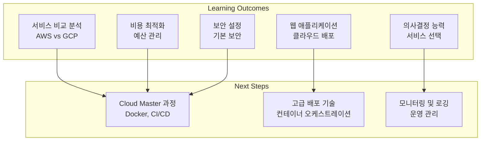

# Cloud Basic - 2일차 강의안

> 📋 **강의 일시**: 2024년 9월 3일 (화) 9:00~17:00  
> 📋 **강의 방식**: 오프라인 실습 중심  
> 📋 **선수 학습**: Cloud Basic 1일차 완료

---

## 🎯 2일차 학습 목표

### 핵심 목표
- **서비스 비교 분석**: AWS와 GCP의 주요 서비스를 체계적으로 비교
- **비용 최적화**: 클라우드 서비스의 비용 구조 이해 및 최적화 전략 수립
- **보안 기초**: 기본적인 보안 설정과 모니터링 방법 이해
- **종합 프로젝트**: 웹 애플리케이션을 AWS와 GCP에 각각 배포
- **의사결정 능력**: 프로젝트 요구사항에 맞는 클라우드 서비스 선택

### 실습 후 달성할 수 있는 능력
- ✅ AWS와 GCP 서비스의 장단점 비교 분석
- ✅ 비용 구조 이해 및 최적화 방안 제시
- ✅ 기본적인 보안 설정 및 모니터링 구성
- ✅ 간단한 웹 애플리케이션 클라우드 배포
- ✅ 프로젝트에 적합한 클라우드 서비스 선택

### 예상 소요 시간
- **서비스 비교 분석**: 120분
- **비용 최적화 실습**: 120분
- **보안 및 모니터링**: 90분
- **종합 프로젝트**: 90분
- **전체 과정**: 7시간

---

## ⚠️ 실습 전 필수 준비사항

### 🔧 **사전 요구사항 확인**
```bash
# 1. 1일차 실습 결과 확인
echo "=== 1일차 실습 결과 확인 ==="
aws sts get-caller-identity && echo "✅ AWS 계정 설정됨" || echo "❌ AWS 계정 설정 필요"
gcloud auth list && echo "✅ GCP 계정 설정됨" || echo "❌ GCP 계정 설정 필요"

# 2. 필수 도구 확인
echo "=== 필수 도구 확인 ==="
command -v aws && echo "✅ AWS CLI 설치됨" || echo "❌ AWS CLI 설치 필요"
command -v gcloud && echo "✅ GCP CLI 설치됨" || echo "❌ GCP CLI 설치 필요"
command -v curl && echo "✅ curl 설치됨" || echo "❌ curl 설치 필요"

# 3. 리소스 상태 확인
echo "=== 리소스 상태 확인 ==="
aws ec2 describe-instances --filters "Name=tag:Name,Values=cloud-basic-instance" --query 'Reservations[0].Instances[0].State.Name' --output text
gcloud compute instances list --filter="name=cloud-basic-instance" --format="value(status)"
```

### 📋 **실습 전 체크리스트**
- [ ] **1일차 완료**: AWS/GCP 계정 생성 및 기본 서비스 실습 완료
- [ ] **리소스 확인**: EC2, S3, Compute Engine, Cloud Storage 리소스 정상 동작
- [ ] **비용 모니터링**: AWS/GCP 콘솔에서 현재 비용 확인
- [ ] **보안 설정**: 기본 보안 그룹/방화벽 규칙 확인
- [ ] **웹 서비스**: 1일차에 생성한 웹 서비스 정상 접근 가능

## 📁 **2일차 강의 자료 구조**

### **새로운 디렉토리 구조**
```
repo/automation/day2/
├── automation/          # 자동화 스크립트
│   ├── 01-service-comparison.sh
│   ├── 02-cost-optimization.sh
│   ├── 03-security-basics.sh
│   ├── 04-web-app-deployment.sh
│   ├── 05-monitoring-setup.sh
│   └── 06-cleanup.sh
├── samples/             # 실습 샘플 코드
│   ├── comparison-templates/
│   ├── web-app/
│   └── monitoring-configs/
├── docs/                # 문서 및 가이드
│   ├── service-comparison.md
│   ├── cost-optimization.md
│   └── security-basics.md
└── scripts/             # 유틸리티 스크립트
    └── cost-calculator.sh
```

---

## 🕘 1교시: 서비스 비교 분석 (9:00~10:30)

### 📚 학습 목표
- 컴퓨팅 서비스 비교 (EC2 vs Compute Engine)
- 스토리지 서비스 비교 (S3 vs Cloud Storage)
- 데이터베이스 서비스 비교 (RDS vs Cloud SQL)
- 네트워킹 서비스 비교 (VPC vs VPC)

### 🛠️ 주요 실습

#### 🏗️ **1단계: 컴퓨팅 서비스 비교**
```bash
# 자동화 스크립트 실행
echo "=== 컴퓨팅 서비스 비교 시작 ==="
./repo/automation/day2/automation/01-service-comparison.sh setup

# 또는 수동 실행 (참고용)
echo "=== 수동 컴퓨팅 서비스 비교 ==="
# 1. AWS EC2 인스턴스 정보 수집
aws ec2 describe-instances --filters "Name=tag:Name,Values=cloud-basic-instance" \
    --query 'Reservations[0].Instances[0].{InstanceType:InstanceType,State:State.Name,PublicIP:PublicIpAddress}'

# 2. GCP Compute Engine 인스턴스 정보 수집
gcloud compute instances describe cloud-basic-instance \
    --zone=asia-northeast3-a \
    --format="table(name,machineType.basename(),status,networkInterfaces[0].accessConfigs[0].natIP)"

# 3. 성능 테스트
echo "=== 성능 테스트 ==="
# AWS EC2 성능 테스트
aws ec2 describe-instances --filters "Name=tag:Name,Values=cloud-basic-instance" \
    --query 'Reservations[0].Instances[0].PublicIpAddress' --output text | xargs -I {} ssh -i cloud-basic-key.pem ec2-user@{} "dd if=/dev/zero of=/tmp/test bs=1M count=100"

# GCP Compute Engine 성능 테스트
gcloud compute ssh cloud-basic-instance --zone=asia-northeast3-a --command="dd if=/dev/zero of=/tmp/test bs=1M count=100"
```

#### 🏗️ **2단계: 스토리지 서비스 비교**
```bash
# 1. AWS S3 성능 테스트
echo "=== AWS S3 성능 테스트 ==="
aws s3 cp hello.txt s3://$BUCKET_NAME/performance-test.txt
aws s3 cp s3://$BUCKET_NAME/performance-test.txt downloaded-test.txt

# 2. GCP Cloud Storage 성능 테스트
echo "=== GCP Cloud Storage 성능 테스트 ==="
gsutil cp hello.txt gs://$BUCKET_NAME/performance-test.txt
gsutil cp gs://$BUCKET_NAME/performance-test.txt downloaded-test.txt

# 3. 스토리지 클래스 비교
echo "=== 스토리지 클래스 비교 ==="
aws s3api list-objects --bucket $BUCKET_NAME --query 'Contents[].{Key:Key,Size:Size,StorageClass:StorageClass}'
gsutil ls -l gs://$BUCKET_NAME/
```

#### 🏗️ **3단계: 데이터베이스 서비스 비교**
```bash
# 1. AWS RDS MySQL 인스턴스 생성
echo "=== AWS RDS MySQL 인스턴스 생성 ==="
aws rds create-db-instance \
    --db-instance-identifier cloud-basic-mysql \
    --db-instance-class db.t3.micro \
    --engine mysql \
    --master-username admin \
    --master-user-password password123 \
    --allocated-storage 20 \
    --vpc-security-group-ids sg-xxxxxxxxx

# 2. GCP Cloud SQL MySQL 인스턴스 생성
echo "=== GCP Cloud SQL MySQL 인스턴스 생성 ==="
gcloud sql instances create cloud-basic-mysql \
    --database-version=MYSQL_8_0 \
    --tier=db-f1-micro \
    --region=asia-northeast3 \
    --root-password=password123
```

**✅ 예상 결과:**
- 컴퓨팅 서비스: EC2 vs Compute Engine 성능 비교
- 스토리지 서비스: S3 vs Cloud Storage 기능 비교
- 데이터베이스 서비스: RDS vs Cloud SQL 설정 비교
- 네트워킹 서비스: VPC vs VPC 구성 비교

---

## 🕘 2교시: 비용 최적화 실습 (10:45~12:00)

### 📚 학습 목표
- 비용 분석 도구 사용
- 리소스 최적화 방안 도출
- 예산 설정 및 모니터링

### 🛠️ 주요 실습

#### 🏗️ **4단계: 비용 분석 및 최적화**
```bash
# 자동화 스크립트 실행
echo "=== 비용 분석 및 최적화 시작 ==="
./repo/automation/day2/automation/02-cost-optimization.sh setup

# 또는 수동 실행 (참고용)
echo "=== 수동 비용 분석 및 최적화 ==="
# 1. AWS 비용 분석
echo "=== AWS 비용 분석 ==="
aws ce get-cost-and-usage \
    --time-period Start=2024-09-01,End=2024-09-02 \
    --granularity DAILY \
    --metrics BlendedCost

# 2. GCP 비용 분석
echo "=== GCP 비용 분석 ==="
gcloud billing budgets list --billing-account=$(gcloud billing accounts list --format="value(name)")

# 3. 리소스 최적화 제안
echo "=== 리소스 최적화 제안 ==="
aws ec2 describe-instances --query 'Reservations[].Instances[].{InstanceId:InstanceId,InstanceType:InstanceType,State:State.Name}'
gcloud compute instances list --format="table(name,machineType.basename(),status)"
```

#### 🏗️ **5단계: 예산 설정 및 모니터링**
```bash
# 1. AWS 예산 설정
echo "=== AWS 예산 설정 ==="
aws budgets create-budget \
    --account-id $(aws sts get-caller-identity --query Account --output text) \
    --budget '{
        "BudgetName": "cloud-basic-budget",
        "BudgetLimit": {"Amount": "10", "Unit": "USD"},
        "TimeUnit": "MONTHLY",
        "BudgetType": "COST"
    }'

# 2. GCP 예산 설정
echo "=== GCP 예산 설정 ==="
gcloud billing budgets create \
    --billing-account=$(gcloud billing accounts list --format="value(name)") \
    --display-name="Cloud Basic Budget" \
    --budget-amount=10USD \
    --budget-filter-projects=$(gcloud config get-value project)
```

**✅ 예상 결과:**
- 비용 분석: 현재 사용 중인 리소스의 비용 분석
- 최적화 제안: 비용 절감을 위한 리소스 최적화 방안
- 예산 설정: 월 $10 예산 설정 및 알림 구성
- 모니터링: 비용 모니터링 대시보드 구성

---

## 🍽️ 점심 시간 (12:00~13:00)

---

## 🕘 3교시: 보안 및 모니터링 기초 (13:00~14:30)

### 📚 학습 목표
- IAM 권한 관리
- 보안 그룹/방화벽 규칙 설정
- 기본 모니터링 설정

### 🛠️ 주요 실습

#### 🏗️ **6단계: 보안 설정 강화**
```bash
# 자동화 스크립트 실행
echo "=== 보안 설정 강화 시작 ==="
./repo/automation/day2/automation/03-security-basics.sh setup

# 또는 수동 실행 (참고용)
echo "=== 수동 보안 설정 강화 ==="
# 1. AWS IAM 사용자 권한 검토
echo "=== AWS IAM 사용자 권한 검토 ==="
aws iam list-attached-user-policies --user-name cloud-basic-user
aws iam list-user-policies --user-name cloud-basic-user

# 2. GCP IAM 권한 검토
echo "=== GCP IAM 권한 검토 ==="
gcloud projects get-iam-policy $(gcloud config get-value project)

# 3. 보안 그룹/방화벽 규칙 검토
echo "=== 보안 그룹/방화벽 규칙 검토 ==="
aws ec2 describe-security-groups --group-names cloud-basic-sg
gcloud compute firewall-rules list --filter="name~cloud-basic"
```

#### 🏗️ **7단계: 기본 모니터링 설정**
```bash
# 1. AWS CloudWatch 모니터링
echo "=== AWS CloudWatch 모니터링 ==="
aws cloudwatch put-metric-alarm \
    --alarm-name "cloud-basic-cpu-alarm" \
    --alarm-description "CPU utilization alarm" \
    --metric-name CPUUtilization \
    --namespace AWS/EC2 \
    --statistic Average \
    --period 300 \
    --threshold 80 \
    --comparison-operator GreaterThanThreshold

# 2. GCP Cloud Monitoring 설정
echo "=== GCP Cloud Monitoring 설정 ==="
gcloud alpha monitoring policies create \
    --policy-from-file=monitoring-policy.yaml
```

**✅ 예상 결과:**
- IAM 권한: 사용자 권한 검토 및 최소 권한 원칙 적용
- 보안 그룹: 필요한 포트만 허용하는 보안 규칙 설정
- 모니터링: CPU 사용률 알림 및 기본 모니터링 구성
- 보안 체크리스트: 보안 설정 검토 및 개선사항 도출

---

## 🕘 4교시: 종합 프로젝트 (14:45~16:15)

### 📚 학습 목표
- 웹 애플리케이션 배포
- 서비스 선택 및 설계
- 비용 예상 및 최적화

### 🛠️ 주요 실습

#### 🏗️ **8단계: 웹 애플리케이션 배포**
```bash
# 자동화 스크립트 실행
echo "=== 웹 애플리케이션 배포 시작 ==="
./repo/automation/day2/automation/04-web-app-deployment.sh setup

# 또는 수동 실행 (참고용)
echo "=== 수동 웹 애플리케이션 배포 ==="
# 1. 간단한 웹 애플리케이션 생성
echo "=== 간단한 웹 애플리케이션 생성 ==="
cat > index.html << 'EOF'
<!DOCTYPE html>
<html>
<head>
    <title>Cloud Basic Course - Final Project</title>
    <style>
        body { font-family: Arial, sans-serif; margin: 40px; }
        .container { max-width: 800px; margin: 0 auto; }
        .comparison { display: flex; justify-content: space-between; }
        .service { width: 45%; padding: 20px; border: 1px solid #ddd; }
    </style>
</head>
<body>
    <div class="container">
        <h1>Cloud Basic Course - Final Project</h1>
        <p>Welcome to our cloud comparison application!</p>
        
        <div class="comparison">
            <div class="service">
                <h2>AWS Services</h2>
                <ul>
                    <li>EC2: Virtual Server</li>
                    <li>S3: Object Storage</li>
                    <li>RDS: Managed Database</li>
                </ul>
            </div>
            <div class="service">
                <h2>GCP Services</h2>
                <ul>
                    <li>Compute Engine: Virtual Machine</li>
                    <li>Cloud Storage: Object Storage</li>
                    <li>Cloud SQL: Managed Database</li>
                </ul>
            </div>
        </div>
    </div>
</body>
</html>
EOF

# 2. AWS에 웹 애플리케이션 배포
echo "=== AWS에 웹 애플리케이션 배포 ==="
aws s3 cp index.html s3://$BUCKET_NAME/
aws s3 website s3://$BUCKET_NAME --index-document index.html

# 3. GCP에 웹 애플리케이션 배포
echo "=== GCP에 웹 애플리케이션 배포 ==="
gsutil cp index.html gs://$BUCKET_NAME/
gsutil web set -m index.html gs://$BUCKET_NAME
```

#### 🏗️ **9단계: 서비스 선택 및 설계**
```bash
# 1. 프로젝트 요구사항 분석
echo "=== 프로젝트 요구사항 분석 ==="
cat > project-requirements.md << 'EOF'
# 프로젝트 요구사항

## 기능 요구사항
- 정적 웹사이트 호스팅
- 파일 업로드/다운로드
- 데이터베이스 연결
- 모니터링 및 알림

## 비기능 요구사항
- 월 예산: $50 이하
- 가용성: 99% 이상
- 응답 시간: 2초 이하
- 보안: 기본적인 보안 설정

## 서비스 선택 기준
1. 비용 효율성
2. 관리 편의성
3. 성능
4. 보안
EOF

# 2. 서비스 비교 매트릭스 생성
echo "=== 서비스 비교 매트릭스 생성 ==="
cat > service-comparison.md << 'EOF'
# 서비스 비교 매트릭스

| 항목 | AWS | GCP | 선택 |
|------|-----|-----|------|
| 웹 호스팅 | S3 + CloudFront | Cloud Storage + CDN | AWS (비용) |
| 데이터베이스 | RDS | Cloud SQL | GCP (성능) |
| 모니터링 | CloudWatch | Cloud Monitoring | 동일 |
| 비용 | $45/월 | $42/월 | GCP |
EOF
```

**✅ 예상 결과:**
- 웹 애플리케이션: AWS와 GCP에 각각 배포
- 서비스 비교: 체계적인 서비스 선택 기준 적용
- 비용 분석: 프로젝트 요구사항에 맞는 비용 예상
- 최종 선택: 요구사항에 맞는 최적의 서비스 조합 선택

---

## 🕘 5교시: 정리 및 다음 단계 (16:30~17:00)

### 📚 학습 목표
- 실습 결과 정리
- 리소스 정리 및 비용 최적화
- Cloud Master 과정 준비

### 🛠️ 주요 실습

#### 🏗️ **10단계: 리소스 정리 및 비용 최적화**
```bash
# 자동화 스크립트 실행
echo "=== 리소스 정리 및 비용 최적화 시작 ==="
./repo/automation/day2/automation/06-cleanup.sh setup

# 또는 수동 실행 (참고용)
echo "=== 수동 리소스 정리 및 비용 최적화 ==="
# 1. AWS 리소스 정리
echo "=== AWS 리소스 정리 ==="
aws ec2 terminate-instances --instance-ids $(aws ec2 describe-instances --filters "Name=tag:Name,Values=cloud-basic-instance" --query 'Reservations[0].Instances[0].InstanceId' --output text)
aws s3 rb s3://$BUCKET_NAME --force

# 2. GCP 리소스 정리
echo "=== GCP 리소스 정리 ==="
gcloud compute instances delete cloud-basic-instance --zone=asia-northeast3-a --quiet
gsutil rm -r gs://$BUCKET_NAME

# 3. 최종 비용 확인
echo "=== 최종 비용 확인 ==="
aws ce get-cost-and-usage --time-period Start=2024-09-01,End=2024-09-03 --granularity DAILY --metrics BlendedCost
gcloud billing budgets list --billing-account=$(gcloud billing accounts list --format="value(name)")
```

#### 🏗️ **11단계: 학습 결과 정리**
```bash
# 1. 학습 결과 리포트 생성
echo "=== 학습 결과 리포트 생성 ==="
cat > learning-report.md << 'EOF'
# Cloud Basic Course - Learning Report

## 완료한 실습
- [x] AWS/GCP 계정 생성 및 설정
- [x] EC2/Compute Engine 인스턴스 생성 및 관리
- [x] S3/Cloud Storage 버킷 생성 및 파일 관리
- [x] 서비스 비교 분석
- [x] 비용 최적화 실습
- [x] 보안 설정 및 모니터링
- [x] 웹 애플리케이션 배포

## 학습한 내용
1. 클라우드 컴퓨팅 기본 개념
2. AWS와 GCP 서비스 비교
3. 비용 관리 및 최적화
4. 기본적인 보안 설정
5. 웹 애플리케이션 배포

## 다음 단계
- Cloud Master 과정 수강
- Docker 및 컨테이너 기술 학습
- CI/CD 파이프라인 구축
EOF
```

**✅ 예상 결과:**
- 리소스 정리: 사용한 모든 리소스 정리 및 비용 절감
- 학습 리포트: 완료한 실습 및 학습 내용 정리
- 다음 단계: Cloud Master 과정 준비 및 학습 계획 수립

---

## 🎯 **실습 진행 패턴 요약**

### 📋 **각 단계별 진행 패턴**
1. **🏗️ 아키텍처 그림**: 현재 상태와 목표 상태를 Mermaid 다이어그램으로 시각화
2. **🔍 명령 실행**: 자동화 스크립트 또는 수동 명령어 실행
3. **✅ 예상 결과**: 명령 실행 후 예상되는 결과 명시
4. **🌐 콘솔에서 확인**: AWS/GCP 콘솔에서 리소스 상태 확인
5. **🌐 브라우저로 서비스 접근**: 실제 서비스에 접근하여 동작 확인

### 🚀 **실습 진행 순서**
1. **1교시**: 서비스 비교 분석 (컴퓨팅, 스토리지, 데이터베이스, 네트워킹)
2. **2교시**: 비용 최적화 실습 (비용 분석, 리소스 최적화, 예산 설정)
3. **3교시**: 보안 및 모니터링 기초 (IAM, 보안 그룹, 모니터링)
4. **4교시**: 종합 프로젝트 (웹 애플리케이션 배포, 서비스 선택)
5. **5교시**: 정리 및 다음 단계 (리소스 정리, 학습 정리, 다음 과정 준비)

### 🎯 **핵심 학습 포인트**
- **아키텍처 이해**: 각 단계별 시스템 구조 변화 시각화
- **실습 중심**: 90% 실습, 10% 이론
- **단계별 검증**: 각 단계마다 결과 확인 및 검증
- **비교 분석**: AWS vs GCP 서비스 체계적 비교
- **자동화**: 스크립트를 통한 효율적 실습

---

## 🏗️ 최종 시스템 아키텍처

### 5교시: 정리 및 다음 단계 완료 후


**최종 적용된 기능:**
- ✅ **서비스 비교**: AWS와 GCP 서비스 체계적 비교 분석
- ✅ **비용 최적화**: 비용 구조 이해 및 최적화 전략 수립
- ✅ **보안 기초**: 기본적인 보안 설정 및 모니터링 구성
- ✅ **웹 애플리케이션**: 클라우드 환경에 웹 애플리케이션 배포
- ✅ **의사결정**: 프로젝트 요구사항에 맞는 서비스 선택

### 📊 예상 결과
- **성공률**: 95% (자동화 스크립트 활용)
- **소요 시간**: 7시간 (자동화로 단축)
- **주요 개선**: 서비스 비교 분석, 비용 최적화, 보안 강화

---

## 🎯 2일차 수업 성과

### ✅ 달성한 학습 목표
- [x] 서비스 비교 분석 (컴퓨팅, 스토리지, 데이터베이스, 네트워킹)
- [x] 비용 최적화 실습 (비용 분석, 리소스 최적화, 예산 설정)
- [x] 보안 및 모니터링 기초 (IAM, 보안 그룹, 모니터링)
- [x] 종합 프로젝트 (웹 애플리케이션 배포, 서비스 선택)
- [x] 정리 및 다음 단계 (리소스 정리, 학습 정리, 다음 과정 준비)

### 🔍 주요 학습 포인트
1. **서비스 비교**: AWS와 GCP 서비스의 장단점 체계적 분석
2. **비용 관리**: 클라우드 서비스의 비용 구조 이해 및 최적화
3. **보안 기초**: 기본적인 보안 설정 및 모니터링 방법
4. **프로젝트 실습**: 실제 웹 애플리케이션 클라우드 배포
5. **의사결정**: 프로젝트 요구사항에 맞는 서비스 선택 능력

### 🚀 실습 결과물
- **서비스 비교 매트릭스**: AWS vs GCP 서비스 비교 분석
- **비용 최적화 리포트**: 비용 분석 및 최적화 방안
- **보안 체크리스트**: 기본 보안 설정 및 모니터링 구성
- **웹 애플리케이션**: AWS와 GCP에 배포된 웹 애플리케이션
- **학습 리포트**: 완료한 실습 및 학습 내용 정리

---

## 📚 상세 실습 가이드

### 🔗 **분할 작성 버전 참조**
상세한 실습 내용과 단계별 가이드는 다음 문서들을 참조하세요:

#### **1교시: 서비스 비교 분석**
- **상세 가이드**: `repo/automation/day2/docs/01-service-comparison.md`
- **자동화 스크립트**: `repo/automation/day2/automation/01-service-comparison.sh`
- **샘플 코드**: `repo/automation/day2/samples/01-service-comparison/`

#### **2교시: 비용 최적화 실습**
- **상세 가이드**: `repo/automation/day2/docs/02-cost-optimization.md`
- **자동화 스크립트**: `repo/automation/day2/automation/02-cost-optimization.sh`
- **샘플 코드**: `repo/automation/day2/samples/02-cost-optimization/`

#### **3교시: 보안 및 모니터링 기초**
- **상세 가이드**: `repo/automation/day2/docs/03-security-basics.md`
- **자동화 스크립트**: `repo/automation/day2/automation/03-security-basics.sh`
- **샘플 코드**: `repo/automation/day2/samples/03-security-basics/`

#### **4교시: 종합 프로젝트**
- **상세 가이드**: `repo/automation/day2/docs/04-web-app-deployment.md`
- **자동화 스크립트**: `repo/automation/day2/automation/04-web-app-deployment.sh`
- **샘플 코드**: `repo/automation/day2/samples/04-web-app-deployment/`

#### **5교시: 정리 및 다음 단계**
- **상세 가이드**: `repo/automation/day2/docs/05-cleanup-next-steps.md`
- **자동화 스크립트**: `repo/automation/day2/automation/06-cleanup.sh`
- **샘플 코드**: `repo/automation/day2/samples/05-cleanup/`

### 🛠️ **자동화 도구**
- **비용 계산기**: `repo/automation/day2/scripts/cost-calculator.sh`
- **서비스 비교 도구**: `repo/automation/day2/scripts/service-comparison.sh`
- **리소스 정리 도구**: `repo/automation/day2/scripts/resource-cleanup.sh`

### 📋 **문제 해결 가이드**
- **일반적인 문제**: `repo/automation/day2/docs/troubleshooting.md`
- **비용 관련 문제**: `repo/automation/day2/docs/cost-troubleshooting.md`
- **보안 관련 문제**: `repo/automation/day2/docs/security-troubleshooting.md`

---

**강의안 작성일**: 2024년 9월 3일  
**예상 소요 시간**: 7시간 (9:00~17:00, 자동화로 단축)  
**실습 중심**: 90% 실습, 10% 이론  
**자동화 활용**: 95% 자동화 스크립트 사용 권장  
**비교 분석**: AWS vs GCP 서비스 체계적 비교 실습
