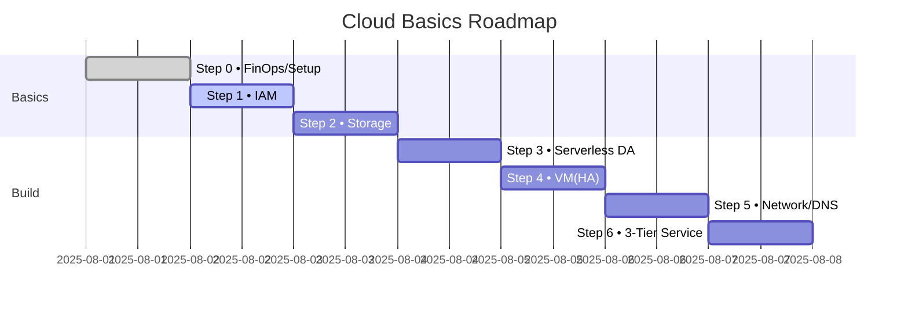
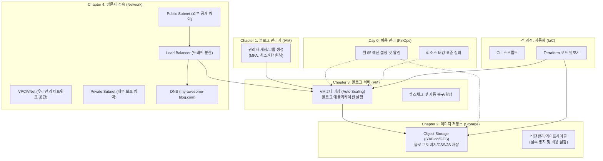

실습 아키텍처 개요: 나만의 블로그 만들기
====================================

목적 및 범위
--------

본 문서는 클라우드 기초 실습 **"나만의 블로그 만들기"** 프로젝트의 최종 아키텍처를 한눈에 제시합니다. 각 Chapter의 실습(IAM, 스토리지, VM, 네트워크)이 어떻게 모여 하나의 완성된 블로그 서비스를 구성하는지 설명하고, 모든 과정에 공통으로 적용되는 **보안, 비용(FinOps), 자동화(IaC)** 원칙을 안내합니다.

관련 문서
------

- **전체 시나리오**: [Secnario.md](mdc:mcp_knowledge_base/cloud_basic/textbook/Secnario.md)
- **통합 실습 가이드**: [Chapter5_Practice.md](mdc:mcp_knowledge_base/cloud_basic/textbook/Chapter5_Practice.md)
- **각 챕터 교재**: [Chapter1_IAM.md](mdc:mcp_knowledge_base/cloud_basic/textbook/Chapter1_IAM.md), [Chapter2_Storage.md](mdc:mcp_knowledge_base/cloud_basic/textbook/Chapter2_Storage.md), [Chapter3_VM.md](mdc:mcp_knowledge_base/cloud_basic/textbook/Chapter3_VM.md), [Chapter4_Network.md](mdc:mcp_knowledge_base/cloud_basic/textbook/Chapter4_Network.md)

비주얼 목차 (Quick Visual Index)
------------------

| 장 | 주제 | 한줄 요약 | 바로가기 |
|---|---|---|---|
| 1 | 🔑 IAM | 최소권한·역할분리·MFA | [Chapter1_IAM](mdc:mcp_knowledge_base/cloud_basic/textbook/Chapter1_IAM.md) |
| 2 | 🗄️ Storage | 정적 웹·버전관리·라이프사이클 | [Chapter2_Storage](mdc:mcp_knowledge_base/cloud_basic/textbook/Chapter2_Storage.md) |
| 3 | 💻 VM | 고가용성(LB+오토스케일)·관리형 접속 | [Chapter3_VM](mdc:mcp_knowledge_base/cloud_basic/textbook/Chapter3_VM.md) |
| 4 | 🌐 Network | VPC/VNet·SG/NSG·DNS/LB | [Chapter4_Network](mdc:mcp_knowledge_base/cloud_basic/textbook/Chapter4_Network.md) |
| 5 | 🧪 Practice | 서버리스 분석·3‑Tier 웹서비스 | [Chapter5_Practice](mdc:mcp_knowledge_base/cloud_basic/textbook/Chapter5_Practice.md) |

학습 로드맵 (Timeline)
-------------

블로그 아키텍처 구성 개요
-------------------------

설계 원칙 (공통)
----------

- **보안**: **기본은 모두 차단, 필요한 것만 최소 허용.** MFA 필수, 인터넷 노출 최소화, 데이터 암호화.
- **비용 (FinOps)**: **내 돈처럼 생각하기.** 예산 설정 및 알림은 필수, 작은 사양으로 시작, 실습 후 리소스 즉시 삭제.
- **가용성**: 단일 장애 지점(SPOF) 피하기. 2개 이상의 가용 영역에 리소스 분산 배치, 헬스체크 기반 자동 복구.
- **운영 (자동화)**: **반복 작업은 코드로.** IaC(Terraform) 우선, 표준화된 이름과 태그 사용, 로그 및 지표 수집.

데이터 흐름 (블로그 방문자)
-------

- 방문자 → DNS(`my-awesome-blog.com`) → 로드밸런서 → VM(블로그 앱) → 이미지/CSS는 스토리지에서 로드

자동화 및 변경 관리
-----------------

- 모든 인프라 변경은 CLI 스크립트 또는 Terraform 코드로 수행하고, Git으로 버전 관리하는 것을 목표로 합니다.
- **실행**: `terraform plan` (변경 내용 검토) → `terraform apply` (적용)

제출물 가이드 (요약)
-------------

- **나만의 블로그 아키텍처 다이어그램** (위 그림을 기반으로 수정)
- 각 Chapter 실습 결과 스크린샷 (예: 예산 알림 설정, Terraform 실행 결과, 방화벽 규칙, 최종 블로그 접속 화면)
- **배운 점 및 개선 아이디어 3가지 이상** (비용, 보안, 자동화 관점에서)

