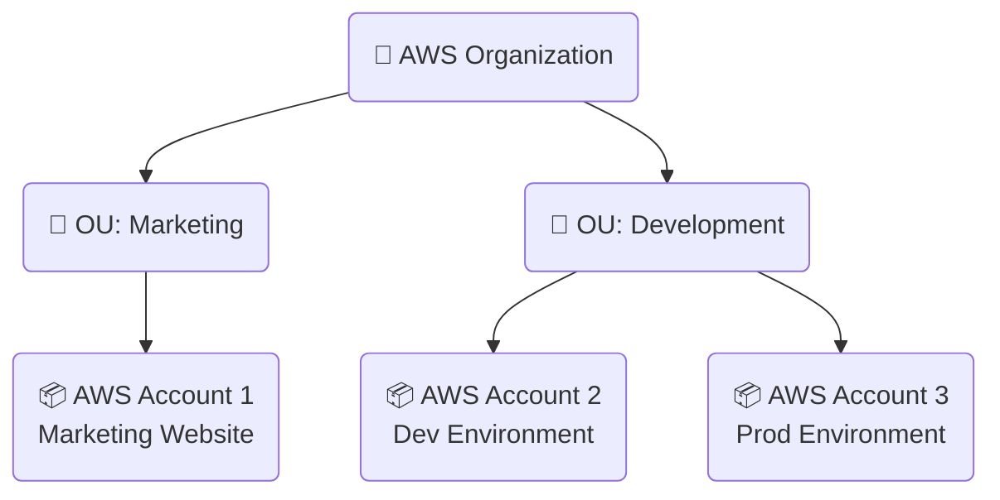
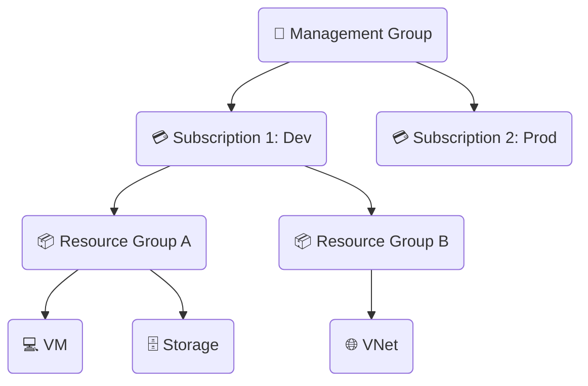
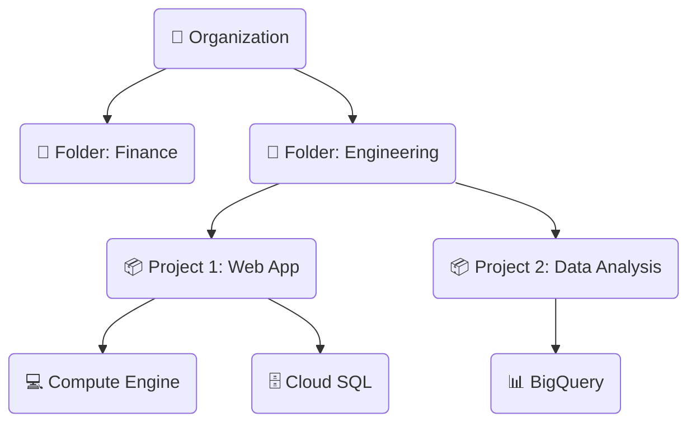
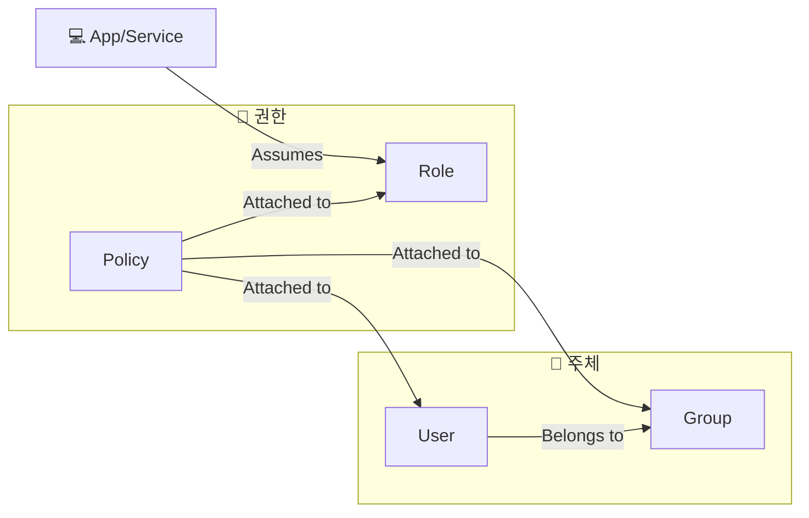
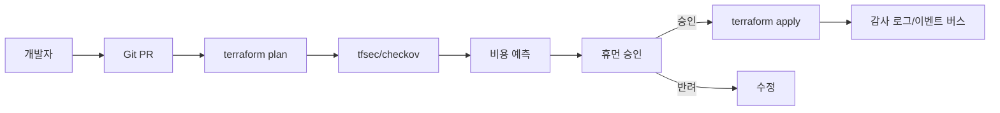

# **1장. ☁️ 클라우드 시작 및 🔑 계정/IAM 관리**

---

## **학습 목표**

1.  **클라우드 구조**: 주요 3사(AWS, Azure, GCP)의 기본 구조를 이해한다.
2.  **리소스 계층**: 각 클라우드의 리소스 관리 계층을 비교할 수 있다.
3.  **IAM 개념**: IAM(Identity and Access Management)의 핵심 개념을 설명할 수 있다.
4.  **IAM 구성요소**: 사용자, 그룹, 역할, 정책의 차이를 이해하고 기본 권한을 설정한다.
5.  **관리 도구**: 각 클라우드의 기본 관리 도구(콘솔, CLI) 사용법을 익힌다.

---

### 비주얼 요약 (Quick Visual Cards)

| 핵심 | 내용 | 체크 |
|---|---|---|
| 🔑 최소권한 | 사용자·그룹·역할·정책으로 권한을 체계화 | [ ] |
| 🛡️ 보안 | MFA·권한경계·조건부정책 필수 | [ ] |
| 🧰 도구 | 콘솔·CLI·SDK를 목적별로 사용 | [ ] |

<details>
<summary>더 알아보기: 역할 위임과 애플리케이션 권한</summary>

- 키 하드코딩 금지, 역할/Managed Identity/Service Account 사용
- 임시 자격증명(STS/OIDC)로 최소기간 권한 부여

</details>

### **운영 목표 & 승인 포인트**

- 최소권한·역할분리 준수, 승인 대상: 권한 상승/공개 리소스/비용 영향 변경
- GitOps: PR → plan → 보안스캔/비용 → 승인 → apply → 감사 로깅
- 태그/라벨 표준, MFA/조건부 접근, 키 하드코딩 금지(역할 기반 자격증명)

---

<!-- _class: lead -->

## **Part 1. 🏢 클라우드 플랫폼 구조**

---

### **AWS 리소스 계층 구조**

**AWS 계정(Account)** 이 모든 리소스의 기본 단위이자 경계입니다.



- **AWS Organization**: 여러 AWS 계정을 중앙에서 관리, 통합 결제, 정책 제어.
- **OU (Organizational Unit)**: 계정들을 그룹화하는 논리적 단위.
- **AWS Account**: 리소스가 생성되는 가장 기본적인 컨테이너. 보안, 네트워크, 비용의 경계.

---

### **AWS: 👑 Root User vs. 👷 IAM User**

- **👑 루트 사용자 (Root User)**
    - 계정 생성 시 사용한 이메일. **계정의 모든 권한 보유.**
    - 계정 폐쇄, 결제 정보 변경 등 민감한 작업 수행.
    - **🚨 일상적인 작업에 절대 사용 금지. MFA 설정 필수!**

- **👷 IAM 사용자 (IAM User)**
    - 계정 내에서 생성하는 일반 사용자.
    - 관리자가 부여한 특정 권한(Policy)만 가짐.
    - **👍 모든 일상적인 작업(리소스 생성, 관리 등)은 IAM 사용자로 수행.**

---

### **Azure 리소스 계층 구조**

**구독(Subscription)** 이 청구 단위이며, **리소스 그룹(Resource Group)** 이 리소스 관리의 핵심입니다.



- **관리 그룹**: 여러 구독에 걸쳐 정책과 접근 제어를 적용.
- **구독**: 청구 및 관리의 기본 단위.
- **리소스 그룹**: 관련된 리소스들을 담는 컨테이너. **생명주기를 공유.**

---

### **GCP 리소스 계층 구조**

**프로젝트(Project)** 가 모든 리소스 생성, 관리, 결제의 기본 단위입니다.



- **조직**: 회사의 최상위 노드. 모든 GCP 리소스를 소유.
- **폴더**: 프로젝트들을 그룹화. 부서별, 팀별 정책 적용에 사용.
- **프로젝트**: 리소스 생성/사용, IAM, 결제의 기본 단위.

---

### **[비교] 🏛️ AWS vs Azure vs GCP 계층 구조**

| 구분 | AWS | Azure | GCP |
| :--- | :--- | :--- | :--- |
| **최상위** | 🏢 Organization | 🏢 Management Group | 🏢 Organization |
| **중간 계층** | 📂 OU | 💳 Subscription | 📂 Folder |
| **기본 단위** | 📦 **Account** | 📦 **Resource Group** | 📦 **Project** |

**Key Takeaway**: 리소스 관리의 핵심 단위가 **AWS는 Account, Azure는 Resource Group, GCP는 Project** 라는 점을 기억하는 것이 중요합니다.

---

<!-- _class: lead -->

## **Part 2. 🔑 IAM (Identity and Access Management)**

---

### **IAM의 구성 요소**


- **👤 사용자 (User)**: 사람 또는 애플리케이션.
- **👥 그룹 (Group)**: 사용자들의 집합. 그룹에 권한을 부여하여 관리 단순화.
- **🎭 역할 (Role)**: 특정 권한들을 묶어놓은 **임시 자격 증명**. 서비스나 다른 사용자에게 권한 위임.
- **📜 정책 (Policy)**: **권한 자체를 정의하는 문서(JSON)**. "무엇을" 할 수 있는지 명시.

---

<!-- _class: lead -->

## **사전 준비: CLI 설치 및 로그인**

---

### **필수 도구 설치 및 인증**

- CLI: `az`, `aws`, `gcloud` (선택: `terraform`)
- 로그인:

```bash
# Azure
az login

# AWS (SSO 권장)
aws configure sso  # 또는 aws configure

# GCP
gcloud auth login
```

### **환경 변수(예시)**

```bash
export AWS_PROFILE=default
export AWS_REGION=ap-northeast-2
export PROJECT_ID=<GCP_PROJECT_ID>
export SUB_ID=<AZURE_SUBSCRIPTION_ID>
```

---

## **실습: 👤 읽기 전용 사용자 생성하기**

---

### **실습 1/3: 🖱️ AWS IAM Portal + ⌨️ CLI**

<style scoped>.columns { display: grid; grid-template-columns: repeat(2, 1fr); gap: 1rem; }</style>
<div class="columns">
<div>

**🖱️ Portal Guide**
- **Link**: [AWS IAM 사용자 생성](https://console.aws.amazon.com/iamv2/home#/users/create)
- **Menu**: `IAM` > `Users` > `Create user`

1.  **User name**: `readonly-user` 입력
2.  **Provide user access to the AWS Management Console** 선택
3.  **Permissions options**: `Attach policies directly` 선택
4.  검색창에 `ReadOnlyAccess` 검색 후 체크
5.  사용자 생성 완료 후 암호 등 로그인 정보 확인

</div>
<div>

**⌨️ CLI Guide**

```bash
# 1. IAM 사용자 생성
aws iam create-user --user-name readonly-user

# 2. 읽기 전용 정책(AWS 관리형) 연결
aws iam attach-user-policy \
    --user-name readonly-user \
    --policy-arn arn:aws:iam::aws:policy/ReadOnlyAccess

# 3. 콘솔 로그인을 위한 프로파일 생성 (암호는 직접 설정)
aws iam create-login-profile \
    --user-name readonly-user \
    --password-reset-required \
    --password YourSecurePassword
```

</div>
</div>

---

### **실습 2/3: 🖱️ Azure Portal + ⌨️ CLI**

<div class="columns">
<div>

**🖱️ Portal Guide**
- **Link**: [Azure Active Directory](https://portal.azure.com/#view/Microsoft_AAD_UsersAndTenants/UserManagementMenuBlade/~/AllUsers)
- **Menu**: `Microsoft Entra ID` > `Users` > `New user`

1.  `readonly-user` 라는 이름으로 새 사용자 생성
2.  **Subscription** 또는 **Resource Group**으로 이동
3.  `Access control (IAM)` 메뉴 > `Add` > `Add role assignment`
4.  **Role** 탭에서 `Reader` 역할 선택
5.  **Members** 탭에서 위에서 생성한 `readonly-user` 선택 후 할당

</div>
<div>

**⌨️ CLI Guide**

```bash
# 1. Entra ID 사용자 생성 (UPN, Password 등 필요)
USER_PRINCIPAL_NAME="readonly-user@yourdomain.onmicrosoft.com"
PASSWORD="YourSecurePassword"
az ad user create --display-name "ReadOnly User" \
    --user-principal-name $USER_PRINCIPAL_NAME --password $PASSWORD

# 2. 특정 리소스 그룹에 Reader 역할 할당
RG_ID=$(az group show --name my-resource-group --query id --output tsv)
az role assignment create --assignee $USER_PRINCIPAL_NAME \
    --role "Reader" --scope $RG_ID
```

</div>
</div>

---

### **실습 3/3: 🖱️ GCP Console + ⌨️ CLI**

<div class="columns">
<div>

**🖱️ Portal Guide**
- **Link**: [GCP IAM & Admin](https://console.cloud.google.com/iam-admin/iam)
- **Menu**: `IAM & Admin` > `IAM` > `GRANT ACCESS`

1.  **New principals**: `readonly-user@gmail.com` 등 사용자의 구글 계정 이메일 입력
2.  **Select a role**: `Browser` 또는 `Viewer` 역할 선택 (`Viewer`가 더 포괄적인 읽기 권한)
3.  `Save` 클릭

(GCP는 별도의 사용자 생성 없이, 기존 Google 계정에 프로젝트별로 역할을 부여하는 방식이 일반적입니다.)

</div>
<div>

**⌨️ CLI Guide**

```bash
# 프로젝트 ID
PROJECT_ID="your-gcp-project-id"
# 역할을 부여할 사용자 이메일
USER_EMAIL="readonly-user@gmail.com"

# 1. 프로젝트에 Viewer 역할 부여
gcloud projects add-iam-policy-binding $PROJECT_ID \
    --member="user:$USER_EMAIL" \
    --role="roles/viewer"
```

</div>
</div>

---

### **보너스 실습: 🤖 서비스 계정/권한 경계/조건부 정책**

<style scoped>.columns { display: grid; grid-template-columns: repeat(3, 1fr); gap: 1rem; }</style>
<div class="columns">
<div>

**AWS (권한 경계 + 최소권한 역할)**

```bash
# 1) 권한 경계 정책 생성 (예: S3 읽기 전용)
aws iam create-policy --policy-name BoundaryS3ReadOnly \
  --policy-document '{
    "Version":"2012-10-17",
    "Statement":[{
      "Effect":"Allow",
      "Action":["s3:Get*","s3:List*"],
      "Resource":"*"
    }]
  }'

# 2) 사용자에 권한 경계 부여
aws iam put-user-permissions-boundary \
  --user-name dev-user \
  --permissions-boundary arn:aws:iam::<ACCOUNT_ID>:policy/BoundaryS3ReadOnly

# 3) 특정 버킷만 허용하는 인라인 정책 부여(선택)
aws iam put-user-policy --user-name dev-user --policy-name BucketViewOnly \
  --policy-document '{
    "Version":"2012-10-17",
    "Statement":[{
      "Effect":"Allow",
      "Action":["s3:GetObject","s3:ListBucket"],
      "Resource":[
        "arn:aws:s3:::my-bucket",
        "arn:aws:s3:::my-bucket/*"
      ]
    }]
  }'
```

</div>
<div>

**Azure (서비스 주체 + 범위 제한 역할)**

```bash
# 1) 서비스 주체 생성
az ad sp create-for-rbac -n sp-dev --skip-assignment

# 2) 특정 리소스 그룹 범위에 Reader 역할만 부여
RG_ID=$(az group show --name my-resource-group --query id --output tsv)
az role assignment create \
  --assignee http://sp-dev \
  --role "Reader" \
  --scope $RG_ID

# (참고) 조건부 접근/ MFA 정책은 Entra ID 포털에서 구성 권장
```

</div>
<div>

**GCP (서비스 계정 + 최소권한 역할)**

```bash
# 1) 서비스 계정 생성
gcloud iam service-accounts create sa-dev --display-name "Dev SA"

# 2) 프로젝트 Viewer 역할(또는 더 좁은 범위) 부여
gcloud projects add-iam-policy-binding $PROJECT_ID \
  --member="serviceAccount:sa-dev@${PROJECT_ID}.iam.gserviceaccount.com" \
  --role="roles/viewer"

# (선택) 특정 버킷만 읽기 허용
gcloud storage buckets add-iam-policy-binding gs://my-bucket \
  --member="serviceAccount:sa-dev@${PROJECT_ID}.iam.gserviceaccount.com" \
  --role="roles/storage.objectViewer"
```

</div>
</div>

---

### **자동화 실행 경로 (문서/예제 코드 참조)**

- CLI: `cloud_basic/automation/cli/aws/ch1_iam.sh`, `cloud_basic/automation/cli/azure/ch1_iam.sh`, `cloud_basic/automation/cli/gcp/ch1_iam.sh`
- Terraform: `cloud_basic/automation/terraform/aws/ch1_iam`, `cloud_basic/automation/terraform/azure/ch1_iam`, `cloud_basic/automation/terraform/gcp/ch1_iam`

---

### **검증 체크리스트**

- 최소권한 적용: 의도한 리소스/스코프에서만 동작하는지 확인
- MFA/승격: 관리자 작업은 MFA·시간제 승격 기반으로 수행
- 분리 원칙: 비용관리자/운영자 권한이 교차되지 않는지 점검
- 감사 로깅: IAM 변경 이벤트 수집 및 정기 리뷰

---

<!-- _class: lead -->

## **Part 3. 🛠️ 관리 도구**

---

### **관리 도구 삼총사**

- **🖱️ 관리 콘솔 (Management Console / Portal)**
    - **장점**: 직관적이고 사용하기 쉬움. 시각적 확인 가능.
    - **단점**: 반복 작업, 자동화에 비효율적.
    - **용도**: 클라우드 입문, 현황 파악, 간단한 작업.

- **⌨️ CLI (Command-Line Interface)**
    - **장점**: 스크립팅/자동화, 일관성, 속도.
    - **단점**: 명령어 학습 필요.
    - **용도**: **DevOps 엔지니어의 필수품**, 자동화 스크립트.

- **🤖 SDK (Software Development Kit)**
    - **장점**: 애플리케이션과 클라우드 서비스의 완벽한 통합.
    - **단점**: 프로그래밍 지식 필요.
    - **용도**: 클라우드 기반 애플리케이션 개발.

---

### **Policy-as-Code & 승인 워크플로**


- PR 기반으로 변경 검토 → 자동 보안 스캔/비용 점검 → 휴먼 승인 후 적용.
- 모든 단계 이벤트는 감사 로깅 및 알림으로 연계.

---

### **비용관리자 vs IT 운영자 권한 분리 (요약)**

- 비용관리자: 예산/비용 대시보드/알림 권한, 리소스 변경 금지.
- IT 운영자: 리소스 생성/변경 권한, 청구/비용 권한 없음.
- 클라우드 매핑: AWS(aws-portal/* vs PowerUser/서비스 한정), Azure(Billing/CMA vs RG/구독 Contributor), GCP(Billing Account Viewer vs 프로젝트 Editor/서비스 역할).

---

### **Audit & Alerting / 보안 운영**

- IAM 변경 이벤트 수집: CloudTrail/Activity Logs/Cloud Audit Logs
- 알림: 권한 상승/공개 리소스/정책 위반 탐지 룰
- 주기 검토: 접근 권한 재인증(Recertification), 비활성 사용자 정리

---

### **컴플라이언스 체크리스트**

- MFA/조건부 접근 필수, 키 하드코딩 금지(역할 기반 자격증명)
- 최소권한, 권한 경계/정책 조건 적극 사용
- 감사 로깅/보존, 태그·라벨 표준, PR 보호 규칙

---

### **참고/교차 문서**

- 준비: `cloud_basic/prerequisite/1_공통사항.md`, `2_계정등록.md`, `3_역할분담.md`
- 자동화: `cloud_basic/automation/cli/*/ch1_iam.sh`, `cloud_basic/automation/terraform/*/ch1_iam`
- 본문(자세한 설명): `cloud_basic/textbook/Chapter1_IAM.md`

---

### **1장 요약**

- **클라우드 구조**: 🏢 AWS는 **Account**, Azure는 **Resource Group**, GCP는 **Project**가 핵심 관리 단위이다.
- **IAM**: 🔑 **인증(Who)**과 **권한 부여(What)**를 통해 접근을 제어한다. **최소 권한 원칙**이 중요하다.
- **IAM 핵심 요소**: 👤**사용자/그룹**은 대상을, 📜**정책**은 권한 내용을, 🎭**역할**은 권한 위임을 담당한다.
- **애플리케이션 권한**: 코드에 키를 하드코딩하지 말고, **IAM Role, Managed Identity, Service Account**를 사용하자.
- **관리 도구**: 🖱️**콘솔**은 입문용, ⌨️**CLI**는 자동화, 🤖**SDK**는 코드 통합에 사용된다.

```