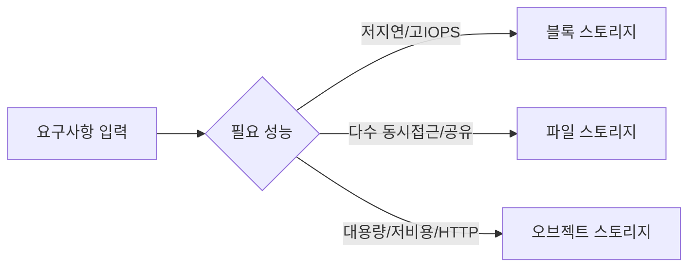
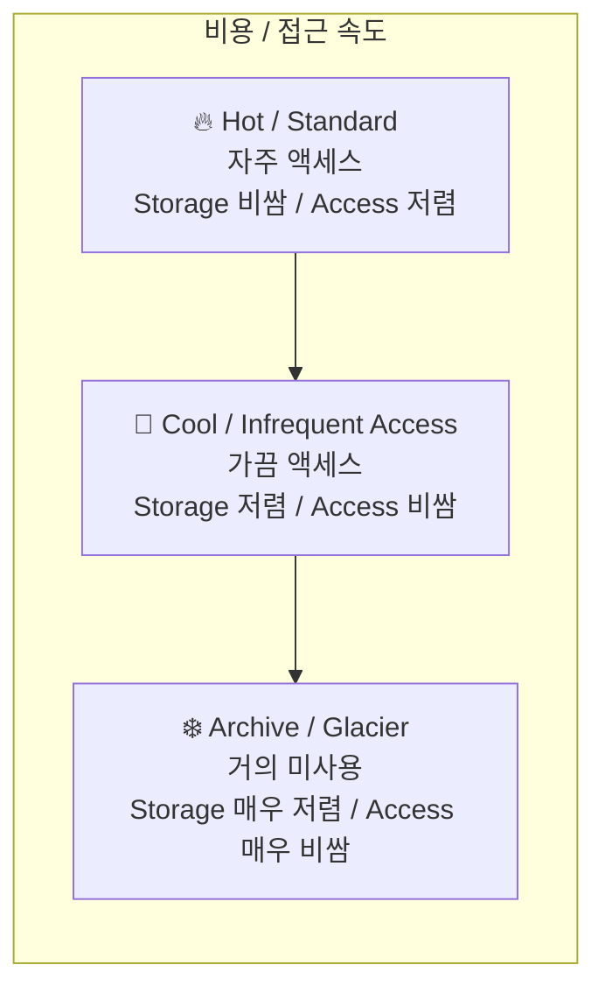
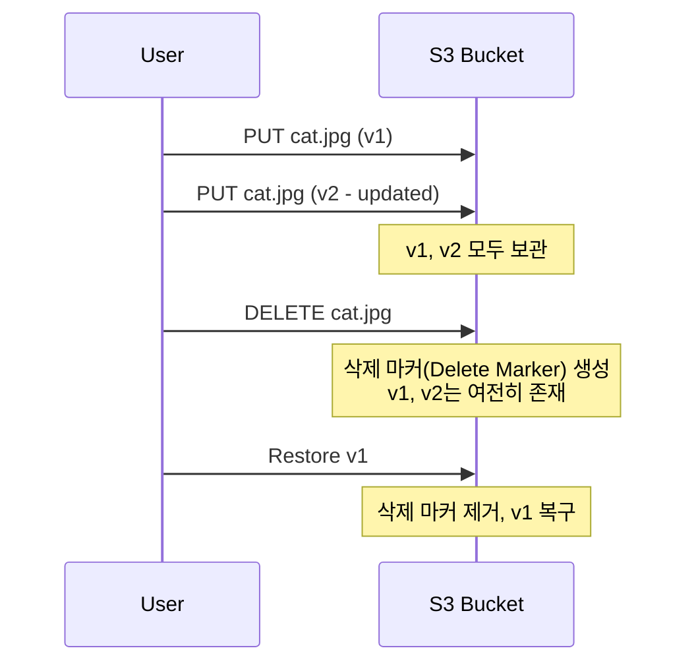
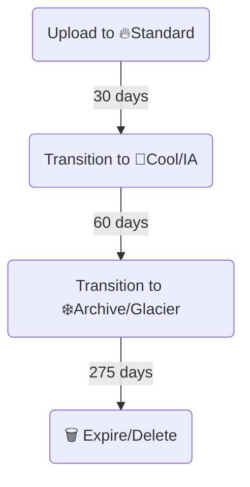

# **2장. 🗄️ 스토리지 서비스**

---

## **학습 목표**

1.  **스토리지 유형**: 📦오브젝트, 💾블록, 📁파일 스토리지의 차이점을 설명한다.
2.  **오브젝트 스토리지**: S3, Blob Storage, Cloud Storage의 특징과 개념을 비교한다.
3.  **비용 최적화**: 💰스토리지 클래스(계층)를 활용한 데이터 비용 관리법을 이해한다.
4.  **데이터 관리**: Versioning, Lifecycle 등 주요 데이터 관리 기능의 사용 사례를 학습한다.
5.  **정적 웹 호스팅**: 🌐오브젝트 스토리지를 이용한 서버리스 웹사이트 호스팅을 이해한다.

---

### 비주얼 요약 (스토리지 선택 가이드)



| 사용 사례 | 권장 스토리지 | 이유 |
|---|---|---|
| VM 부팅/DB | 블록 | 저지연·고IOPS |
| 공유 폴더 | 파일 | 다수 VM 공유 |
| 정적 웹·백업 | 오브젝트 | 확장성·비용 |

### **운영 목표 & 승인 포인트**

- 운영 목표: 공개 최소화, 데이터 보호·복구 가능성 확보, 비용 최적화
- 승인 포인트: 공개 정책/버킷 정책 변경, 라이프사이클/버전관리 정책 변경, 키/KMS·보존 설정 변경
- GitOps: PR → 정책 검토/보안스캔 → 승인 → 적용 → 로그/알림 연계

---

<!-- _class: lead -->

## **Part 1. 📚 클라우드 스토리지 유형**

---

### **핵심 스토리지 유형: Object vs Block vs File**

| 구분 | 📦 **Object Storage** | 💾 **Block Storage** | 📁 **File Storage** |
| :--- | :--- | :--- | :--- |
| **구조** | 평면 구조 (Flat) | 고정 크기 블록 (Raw) | 계층 구조 (Hierarchical) |
| **데이터 단위** | 객체 (Object) | 블록 (Block) | 파일 (File) |
| **액세스 방법**| HTTP/S API | SCSI/iSCSI | NFS/SMB 프로토콜 |
| **연결 대상** | 인터넷 전체 | **단일 VM** | **다수 VM** |
| **주요 특징** | 무한한 확장성, 메타데이터 | 빠른 속도(Low Latency) | 동시 액세스, 공유 |
| **대표 서비스** | S3, Blob, Cloud Storage | EBS, Managed Disk, PD | EFS, Azure Files, Filestore |
| **주요 사용처** | 백업, 빅데이터, 미디어 | **VM 부팅 디스크, DB** | 콘텐츠 관리, 공유 폴더 |

---

<!-- _class: lead -->

## **Part 2. 💰 비용 최적화: 스토리지 클래스**

---

### **스토리지 클래스 (Storage Class / Access Tier)**

데이터의 **접근 빈도**와 **보관 기간**에 따라 다른 스토리지 비용을 적용하여 비용을 최적화하는 기능입니다.



---

<!-- _class: lead -->

## **Part 3. 🛠️ 데이터 관리 기능**

---

### **버전 관리 (Versioning)**

실수로 객체를 덮어쓰거나 삭제하는 것을 방지하기 위해 **객체의 모든 버전을 보관**하는 기능입니다.


- **사용자 실수에 대한 강력한 보호 장치이므로 운영 환경에서는 활성화를 강력히 권장합니다.**

---

### **생명주기 관리 (Lifecycle Management)**

미리 정의된 규칙에 따라 **객체를 자동으로 다른 스토리지 클래스로 이동시키거나 삭제**하는 기능입니다. 비용 관리에 필수적입니다.


- **규칙 예시**: 생성 후 30일이 지나면 Cool 계층으로, 90일 후 Archive, 365일 후 자동 삭제.

---

<!-- _class: lead -->

## **실습: 🌐 정적 웹사이트 호스팅하기**

---

### **사전 준비: `index.html` 파일 생성**

실습을 위해, 아래 내용으로 간단한 `index.html` 파일을 하나 만들어 주세요.

```html
<!DOCTYPE html>
<html>
<head>
  <title>My Static Website</title>
</head>
<body>
  <h1>Hello from Cloud Storage!</h1>
</body>
</html>
```

---

### **실습 1/3: 🖱️ AWS S3 Portal + ⌨️ CLI**

<style scoped>.columns { display: grid; grid-template-columns: repeat(2, 1fr); gap: 1rem; }</style>
<div class="columns">
<div>

**🖱️ Portal Guide**
- **Link**: [S3 콘솔](https://s3.console.aws.amazon.com/s3/home)
- **Menu**: `S3` > `Buckets` > `Create bucket`

1.  **Bucket name**: 전 세계적으로 고유한 이름 입력
2.  **Object Ownership**: `ACLs enabled` 선택
3.  **Block Public Access**: `Block all public access` **체크 해제** 후 경고 확인
4.  버킷 생성 후, `Properties` 탭 > `Static website hosting` > `Enable` 선택 및 `index.html` 입력
5.  `Permissions` 탭 > `Bucket policy` > 아래 JSON 붙여넣기 (Bucket-Name 부분 수정)

</div>
<div>

**⌨️ CLI Guide**

```bash
# 1. 고유한 버킷 생성
aws s3 mb s3://your-unique-bucket-name

# 2. index.html 파일 업로드
aws s3 cp index.html s3://your-unique-bucket-name/

# 3. 정적 웹사이트 호스팅 활성화
aws s3 website s3://your-unique-bucket-name/ --index-document index.html

# 4. 퍼블릭 읽기 정책 적용 (policy.json 파일 필요)
aws s3api put-bucket-policy --bucket your-unique-bucket-name --policy file://policy.json
```

**policy.json 내용:**
```json
{
  "Version":"2012-10-17",
  "Statement":[{
    "Sid":"PublicReadGetObject",
    "Effect":"Allow",
    "Principal": "*",
    "Action":["s3:GetObject"],
    "Resource":["arn:aws:s3:::your-unique-bucket-name/*"]
  }]
}
```

</div>
</div>

---

### **실습 2/3: 🖱️ Azure Portal + ⌨️ CLI**

<div class="columns">
<div>

**🖱️ Portal Guide**
- **Link**: [Azure 스토리지 계정](https://portal.azure.com/#blade/HubsExtension/BrowseResource/resourceType/Microsoft.Storage%2FStorageAccounts)
- **Menu**: `Storage accounts` > (계정 선택) > `Data management` > `Static website`

1.  **Static website** 기능 `Enabled` 로 변경
2.  **Index document name**: `index.html` 입력 후 저장
3.  나타나는 **Primary endpoint** 주소 확인
4.  `Containers` 메뉴 > **`$web`** 컨테이너 클릭
5.  `Upload` 버튼으로 `index.html` 파일 업로드

</div>
<div>

**⌨️ CLI Guide**

```bash
# 스토리지 계정 이름
ACCOUNT_NAME="yourstorageaccount"

# 1. 정적 웹사이트 기능 활성화
az storage blob service-properties update \
    --account-name $ACCOUNT_NAME \
    --static-website --index-document index.html

# 2. $web 컨테이너에 index.html 업로드
az storage blob upload --account-name $ACCOUNT_NAME \
    --container-name \$web --file index.html --name index.html
```

</div>
</div>

---

### **실습 3/3: 🖱️ GCP Console + ⌨️ CLI**

<div class="columns">
<div>

**🖱️ Portal Guide**
- **Link**: [GCP Cloud Storage 브라우저](https://console.cloud.google.com/storage/browser)
- **Menu**: `Cloud Storage` > `Buckets` > `CREATE`

1.  **Name**: 전 세계적으로 고유한 이름 입력
2.  **Location type**: `Region` 선택
3.  **`Enforce public access prevention` 체크 해제**
4.  **Access control**: `Uniform` 선택 후 생성
5.  버킷 생성 후, `Permissions` 탭 > `GRANT ACCESS`
6.  **New principals**: `allUsers` 입력
7.  **Role**: `Storage Object Viewer` 선택 후 저장

</div>
<div>

**⌨️ CLI Guide**

```bash
# 고유한 버킷 이름
BUCKET_NAME="gs://your-unique-bucket-name"

# 1. 버킷 생성
gcloud storage buckets create $BUCKET_NAME --uniform-bucket-level-access

# 2. index.html 업로드
gcloud storage objects upload index.html --bucket=$BUCKET_NAME

# 3. 전체 사용자에게 공개 읽기 권한 부여
gcloud storage buckets add-iam-policy-binding $BUCKET_NAME \
    --member=allUsers --role=roles/storage.objectViewer

# 4. 웹사이트 설정
gcloud storage buckets update $BUCKET_NAME --web-main-page-suffix=index.html
```

</div>
</div>

--- 

### **IaC 맛보기: 🤖 Terraform으로 버킷 만들기**

지금까지 콘솔과 CLI로 버킷을 만들었습니다. 이번에는 **코드로 인프라를 관리하는(IaC)** 방식을 경험해봅시다. 아래 코드를 `main.tf` 파일로 저장하고 `terraform apply` 명령을 실행해보세요.

<style scoped>.columns { display: grid; grid-template-columns: repeat(3, 1fr); gap: 1rem; }</style>
<div class="columns">
<div>

**AWS (S3)**
```terraform
# main.tf
variable "bucket_name" {
  description = "Unique S3 bucket name"
  default     = "my-tf-blog-bucket-unique"
}

resource "aws_s3_bucket" "blog_bucket" {
  bucket = var.bucket_name
}
```
**실행:**
```bash
terraform init
terraform apply
```

</div>
<div>

**Azure (Storage Account)**
```terraform
# main.tf
variable "storage_account_name" {
  description = "Unique storage account name"
  default     = "mytfblogstorageunique"
}

resource "azurerm_resource_group" "blog_rg" {
  name     = "blog-rg"
  location                 = "Korea Central"
}

resource "azurerm_storage_account" "blog_storage" {
  name                     = var.storage_account_name
  resource_group_name      = azurerm_resource_group.blog_rg.name
  location                 = azurerm_resource_group.blog_rg.location
  account_tier             = "Standard"
  account_replication_type = "LRS"
}
```

</div>
<div>

**GCP (Cloud Storage)**
```terraform
# main.tf
variable "bucket_name" {
  description = "Unique GCS bucket name"
  default     = "my-tf-blog-bucket-unique"
}

resource "google_storage_bucket" "blog_bucket" {
  name          = var.bucket_name
  location      = "ASIA-NORTHEAST3"
  force_destroy = true
}
```

</div>
</div>

**Key Takeaway**: 코드를 사용하면 어떤 리소스가 어떤 설정으로 만들어지는지 명확히 알 수 있고, 재사용하기도 편리합니다.

--- 

### **보안/공개 최소화 원칙**

```

- 기본은 비공개, 공개가 필요할 때 CDN+WAF 앞단 적용
- 버킷 정책/정책 조건(Referer/IP/시간) 활용, 서명 URL 우선
- 액세스 로그/KMS 암호화/전송 암호화 활성화

#### 프로덕션 권고: 퍼블릭 버킷 지양 + CDN/OAC
- AWS: S3 Block Public Access 활성화, CloudFront + Origin Access Control(OAC) 사용. 버킷 정책은 CloudFront OAC만 허용. 비공개 객체는 서명 URL/쿠키 사용.
- Azure: Azure CDN 앞단 구성, Static website는 CDN 원본 전용으로 제한. 사설 엔드포인트/프라이빗 링크 또는 SAS 토큰 활용.
- GCP: Uniform bucket-level access(UBLA) 적용, Cloud CDN + Cloud Storage 조합. `allUsers` 권한 지양, 필요 시 Signed URL 우선.

---

### **팀 역할 기반 실습 가이드**

- 재무팀: 클래스/리전/버킷별 비용 대시보드, 라이프사이클 절감 리포트
- IT 운영/DevOps: 정적 웹/버킷/정책 IaC 모듈화, 퍼블릭 접근 예외 승인 프로세스
- 개발팀: 빌드 산출물 자동 배포, 서명 URL/사전 서명 정책 활용
- SRE: 가용성/오류율 SLI/SLO, 공개 객체/권한 변경 이상 탐지 알림

---

### **자동화 실행 경로**

- CLI: `cloud_basic/automation/cli/aws/ch3_storage.sh`, `cloud_basic/automation/cli/azure/ch3_storage.sh`, `cloud_basic/automation/cli/gcp/ch3_storage.sh`
- Terraform: `cloud_basic/automation/terraform/aws/ch3_storage`, `cloud_basic/automation/terraform/azure/ch3_storage`, `cloud_basic/automation/terraform/gcp/ch3_storage`

---

### **검증 체크리스트**

- 공개 범위: 필요한 객체만 공개, 정책/ACL/UBLA 설정 일관성
- 데이터 관리: 버전관리 동작, 라이프사이클 전환/만료 규칙 적용 확인
- 접근 로그: 다운로드/오류 로그 유무 및 경보 연계

---

### **2장 요약**

- **스토리지 유형**: 워크로드에 따라 💾**Block**(VM용), 📁**File**(공유용), 📦**Object**(대용량 데이터용)를 선택해야 한다.
- **Object Storage**: AWS **S3**, Azure **Blob**, GCP **Cloud Storage**가 대표적이며, **버킷**과 **객체**가 핵심 개념이다.
- **비용 최적화**: 💰데이터 접근 빈도에 따라 **스토리지 클래스**를 변경하고, **생명주기 관리**를 통해 이를 자동화하는 것이 필수적이다.
- **데이터 보호**: 🛡️**버전 관리**는 사용자 실수를 방지하고, 🗺️**복제**는 재해 상황에 대비한다.
- **활용**: 🌐**정적 웹사이트 호스팅**은 서버 없이 저렴하고 안정적으로 웹 서비스를 제공하는 좋은 방법이다.

---

### **교차 문서/자동화 링크**

- 본문: `cloud_basic/textbook/Chapter2_Storage.md`
- 자동화(CLI): `cloud_basic/automation/cli/*/ch3_storage.sh`
- 자동화(Terraform): `cloud_basic/automation/terraform/*/ch3_storage`
