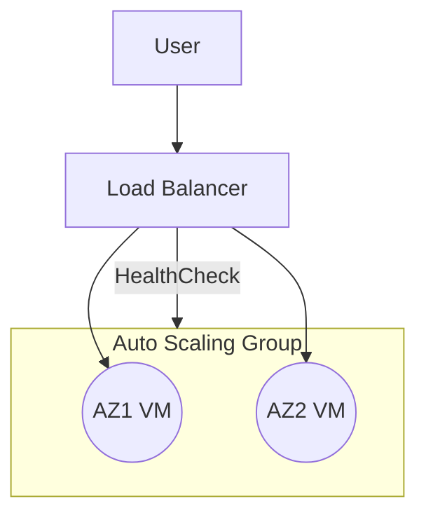
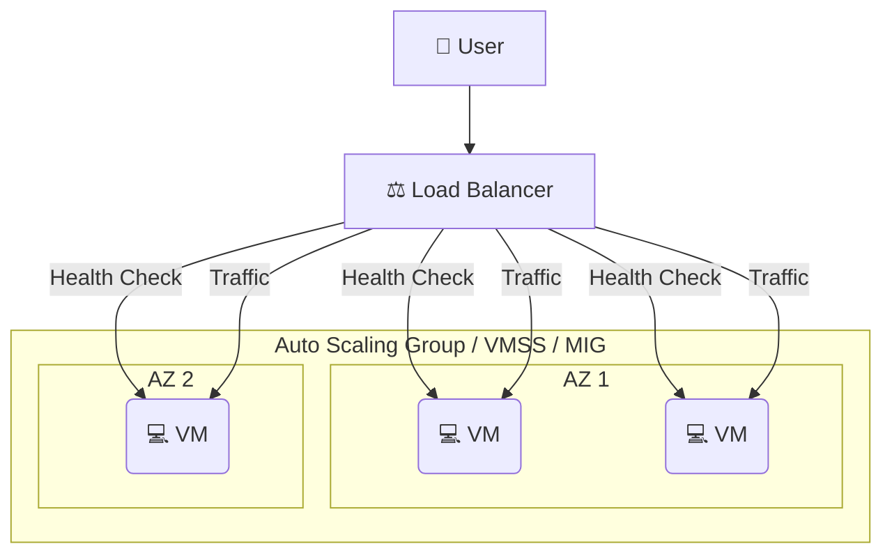

# **3장. 💻 가상머신 서비스**

---

## **학습 목표**

1.  **VM 개념**: 클라우드의 핵심 컴퓨팅 서비스인 가상머신(VM)의 개념을 이해한다.
2.  **3사 비교**: AWS EC2, Azure VM, GCP GCE의 특징과 용어를 비교할 수 있다.
3.  **사양 선택**: 사용 사례에 맞는 VM 타입/크기를 선택하는 기준을 학습한다.
4.  **생성 및 연결**: VM 생성 및 원격 연결 방법을 익힌다.
5.  **고가용성**: 로드밸런싱과 오토스케일링을 통한 고가용성(HA) 구성 원리를 이해한다.

---

### 비주얼 요약 (HA 패턴)



| 체크 | 항목 |
|---|---|
| [ ] | 헬스체크 경로/응답코드 설정 |
| [ ] | 최소/최대/희망 용량 정의 |
| [ ] | 관리형 접속(SSM/Bastion/IAP) 적용 |

### **운영 목표 & 승인 포인트**

- 운영 목표: 안전한 접속, 표준 템플릿 기반 배포, 가용성/비용 균형
- 승인 포인트: 퍼블릭 노출/보안그룹 변경, 스케일 정책/용량 증액, 비용 영향 변경
- GitOps: PR → plan/보안스캔 → 승인 → apply → 관측/알림 연계

---

<!-- _class: lead -->

## **Part 1. ⚙️ 가상머신 서비스 개요**

---

### **가상머신(VM)이란?**

클라우드 데이터 센터에서 실행되는 **가상화된 컴퓨터(서버)** 입니다.
물리적 하드웨어(CPU, Memory, Storage)를 소프트웨어적으로 에뮬레이션하여, 실제 컴퓨터처럼 독립된 OS와 앱을 실행할 수 있습니다.

- **On-Demand (주문형)**: ⏱️ 필요할 때 몇 분 만에 생성 및 삭제.
- **Scalability (확장성)**: ↔️ 워크로드에 따라 사양(크기)을 유연하게 조절.
- **Pay-as-you-go (종량제)**: 💵 사용한 만큼만 비용 지불.

---

### **AWS EC2: 인스턴스 타입 패밀리**

`t3.micro` → **[패밀리][세대].[크기]**

- **T (Burstable)**: ⚡ 평소엔 CPU를 적게 쓰다 순간적으로 성능이 필요할 때 (웹서버, 개발 환경)
- **M (General Purpose)**: ⚖️ CPU와 메모리가 균형 잡힌 범용 (대부분의 애플리케이션)
- **C (Compute Optimized)**: 🧠 CPU 성능이 중요한 작업 (배치 처리, 인코딩)
- **R (Memory Optimized)**: 📚 메모리가 많이 필요한 작업 (데이터베이스, 인메모리 캐시)

---

### **Azure VM: 크기(Size) 시리즈**

`D2s_v3` → **[패밀리][vCPU 수][추가기능]_[버전]**

- **B (Burstable)**: ⚡ 버스터블 성능 (개발/테스트)
- **D (General-purpose)**: ⚖️ 범용 (대부분의 애플리케이션)
- **F (Compute-optimized)**: 🧠 컴퓨팅 최적화
- **E (Memory-optimized)**: 📚 메모리 최적화

---

### **GCP GCE: 머신 타입 시리즈**

`e2-medium` → **[시리즈]-[타입]**

- **E2 (Efficient)**: ⚖️ 범용 (비용 효율성)
- **N2 (General-Purpose)**: ⚖️ 범용 (성능)
- **C2 (Compute-Optimized)**: 🧠 컴퓨팅 최적화
- **M2 (Memory-Optimized)**: 📚 메모리 최적화
- **✨ Custom**: 원하는 vCPU와 메모리를 직접 조합 가능!

---

### **VM 생성 시 공통 고려사항**

1.  **📍 리전 및 가용 영역**: Latency 및 장애 복구(HA) 고려.
2.  **🌐 네트워크 (VPC/VNet)**: VM이 위치할 가상 네트워크와 서브넷 지정.
3.  **🛡️ 보안 그룹 / 방화벽**: VM의 Inbound/Outbound 트래픽 제어.
4.  **🔑 인증 (Authentication)**: Linux는 SSH Key Pair, Windows는 암호 설정.
5.  **📜 부팅 스크립트**: VM 첫 시작 시 자동으로 실행할 초기 설정 스크립트.

---

<!-- _class: lead -->

## **실습: 기본 웹 서버 VM 생성하기**

---

### **실습 1/3: 🖱️ AWS Portal + ⌨️ CLI**

<style scoped>
.columns { display: grid; grid-template-columns: repeat(2, 1fr); gap: 1rem; }
</style>

<div class="columns">
<div>

**🖱️ Portal Guide**

- **Link**: [EC2 인스턴스 생성](https://console.aws.amazon.com/ec2/v2/home#LaunchInstanceWizard:)
- **Menu**: `EC2` > `Instances` > `Launch instances`

1.  **Name**: `my-web-server`
2.  **AMI**: `Amazon Linux 2` (Free tier)
3.  **Instance Type**: `t2.micro` (Free tier)
4.  **Key pair**: 기존 키를 선택하거나 새로 생성
5.  **Network**: `Allow HTTP traffic from the internet` 체크
6.  **Advanced details** > **User data**: 웹서버 설치 스크립트 붙여넣기

</div>
<div>

**⌨️ CLI Guide**

```bash
# Amazon Linux 2 AMI ID (서울 리전 기준)
AMI_ID="ami-0c9c942bd7bf113a2"
# 사용할 키페어 이름
KEY_NAME="your-key-pair-name"
# 보안 그룹 ID (HTTP, SSH 허용)
SG_ID="sg-xxxxxxxx"
# 서브넷 ID
SUBNET_ID="subnet-xxxxxxxx"

aws ec2 run-instances \
    --image-id $AMI_ID \
    --instance-type t2.micro \
    --key-name $KEY_NAME \
    --security-group-ids $SG_ID \
    --subnet-id $SUBNET_ID \
    --user-data file://web-server-script.sh \
    --tag-specifications 'ResourceType=instance,Tags=[{Key=Name,Value=my-web-server}]'
```

</div>
</div>

---

### **실습 2/3: 🖱️ Azure Portal + ⌨️ CLI**

<div class="columns">
<div>

**🖱️ Portal Guide**

- **Link**: [Azure VM 생성](https://portal.azure.com/#create/Microsoft.VirtualMachine-ARM)
- **Menu**: `Virtual machines` > `Create` > `Azure virtual machine`

1.  **Resource group**: 새로 만들거나 기존 그룹 선택
2.  **VM name**: `my-web-server`
3.  **Image**: `Ubuntu Server 22.04 LTS`
4.  **Size**: `Standard_B1s` (Free tier)
5.  **Authentication**: `SSH public key` 선택 후 키 제공
6.  **Inbound port rules**: `HTTP (80)`, `SSH (22)` 허용
7.  **Advanced** > **Custom data**: 웹서버 설치 스크립트 붙여넣기

</div>
<div>

**⌨️ CLI Guide**

```bash
# 리소스 그룹 이름
RG_NAME="my-resource-group"
# VM 이름
VM_NAME="my-web-server"

az vm create \
    --resource-group $RG_NAME \
    --name $VM_NAME \
    --image Ubuntu2204 \
    --size Standard_B1s \
    --admin-username azureuser \
    --generate-ssh-keys \
    --custom-data web-server-script.sh

# 80번 포트 개방
az vm open-port --port 80 --resource-group $RG_NAME --name $VM_NAME
```

</div>
</div>

---

### **실습 3/3: 🖱️ GCP Console + ⌨️ CLI**

<div class="columns">
<div>

**🖱️ Portal Guide**

- **Link**: [GCP VM 인스턴스 생성](https://console.cloud.google.com/compute/instancesAdd)
- **Menu**: `Compute Engine` > `VM instances` > `CREATE INSTANCE`

1.  **Name**: `my-web-server`
2.  **Machine type**: `e2-micro`
3.  **Boot disk**: `Debian GNU/Linux 11`
4.  **Firewall**: `Allow HTTP traffic` 체크
5.  **Management** > **Automation** > **Startup script**: 웹서버 설치 스크립트 붙여넣기

</div>
<div>

**⌨️ CLI Guide**

```bash
# VM 이름
INSTANCE_NAME="my-web-server"

gcloud compute instances create $INSTANCE_NAME \
    --machine-type=e2-micro \
    --image-family=debian-11 \
    --image-project=debian-cloud \
    --tags=http-server \
    --metadata-from-file startup-script=web-server-script.sh
```

</div>
</div>

---

### **더 안전한 연결 방법 (Managed Access)**

SSH/RDP 포트를 인터넷에 직접 노출하는 것은 보안 위협이 될 수 있습니다. **IAM 권한**을 통해 더 안전하게 접속하는 방법입니다.

```mermaid
graph TD
    User[👤 User] -- IAM Auth --> ManagedService[🛡️ AWS SSM / Azure Bastion / GCP IAP]
    subgraph VPC
        subgraph PrivateSubnet
            ManagedService -- Secure Tunnel --> VM[💻 VM]
        end
    end
    Internet[🌐 Internet] --X Blocked;
    linkStyle 2 stroke:red,stroke-width:2px,stroke-dasharray: 3 3;
    Internet -.-> VM
```
- **인터넷에 포트를 노출할 필요 없이, Private IP를 가진 VM에 안전하게 접속 가능합니다.**

---

<!-- _class: lead -->

## **Part 3. ⚖️ 고가용성 (High Availability)**

---

### **고가용성(HA)이란?**

단일 컴포넌트(e.g., VM 한 대)의 장애가 전체 서비스의 중단으로 이어지지 않도록 시스템을 설계하는 것. 클라우드에서는 **여러 대의 VM**과 **트래픽 분산**을 통해 구현합니다.

- **❤️ Health Check**: VM이 정상인지 주기적으로 확인.
- **➕ Redundancy**: 여러 가용 영역(AZ)에 VM을 중복 배치.
- **⚖️ Load Balancing**: 트래픽을 여러 VM으로 자동 분산.
- **📈 Auto Scaling**: 트래픽 양에 따라 VM 수를 자동 조절.

---

### **고가용성 아키텍처**


- **로드밸런서**가 트래픽을 받고, **Health Check**를 통해 정상 VM에게만 전달합니다.
- **오토스케일링 그룹**은 VM에 장애가 발생하면 자동으로 교체하고, 트래픽이 증가하면 VM을 추가합니다.

---

### **[비교] 고가용성(HA) 구성 요소**

| 구분 | AWS | Azure | GCP |
| :--- | :--- | :--- | :--- |
| **⚖️ 트래픽 분산** | Elastic Load Balancer (ELB) | Azure Load Balancer | Cloud Load Balancing |
| **➕ VM 그룹 관리** | Auto Scaling Group (ASG) | VM Scale Sets (VMSS) | Managed Instance Group (MIG) |
| **❤️ 자동 복구** | ASG Health Check | VMSS Health Probe | MIG Autohealing |
| **📈 자동 확장** | Auto Scaling | Autoscale | Autoscaling |

**Key Takeaway**: 용어는 다르지만, **로드밸런서**로 트래픽을 분산하고 **VM 그룹**으로 VM의 수와 상태를 관리하는 기본 원리는 모두 동일합니다.

---

### **실습: 💔 장애 시나리오 경험하기 (Health Check)**

이론만으로는 부족합니다. 헬스체크의 중요성을 직접 경험해봅시다.

1.  **준비**: 2대 이상의 VM을 생성하고 로드밸런서에 연결합니다. (이전 고가용성 아키텍처 실습을 활용)
2.  **정상 상태 확인**: 로드밸런서의 주소로 여러 번 접속하여 트래픽이 두 VM에 골고루 분산되는 것을 확인합니다.
3.  **장애 상황 연출**: VM 한 대에 SSH로 접속하여 웹 서버 프로세스를 강제로 종료합니다. (예: `sudo systemctl stop nginx`)
4.  **결과 관찰**: 잠시 후(헬스체크 주기 이후), 로드밸런서 주소로 다시 접속해보세요. 이제 트래픽은 **정상적인 VM으로만** 전달됩니다. 로드밸런서의 헬스체크 상태에서도 장애가 발생한 VM이 `Unhealthy`로 표시되는 것을 볼 수 있습니다.
5.  **복구**: 웹 서버를 다시 시작하면(`sudo systemctl start nginx`), 잠시 후 VM이 `Healthy` 상태로 돌아오고 다시 트래픽을 받기 시작합니다.

**Key Takeaway**: 헬스체크는 장애가 발생한 시스템을 자동으로 격리하여 서비스 전체의 안정성을 지키는 핵심 기능입니다.

---

### **운영 체크리스트**

- 보안: SSH 소스 제한, 키/패치 관리, 관리형 접속(SSM/Bastion/IAP) 우선
- 가용성: 멀티 AZ/존 분산, 헬스체크 정상, 장애 자동복구
- 비용: 소형 타입, 스팟/예약/스케줄 중지, 데이터 전송 비용 확인
- 관측성: 지표/로그/추적, 경보 규칙 구성 및 테스트

---

### **팀 역할 기반 실습 가이드**

- 재무팀: Compute/LB/NAT 비용 대시보드, 비업무시간 중지 정책
- IT 운영/DevOps: VM/ASG/VMSS/MIG/LB 모듈화, CI 파이프라인(Plan→스캔→승인→Apply)
- 개발팀: 템플릿 변수만으로 배포, 헬스체크 엔드포인트 제공, 부하 테스트
- SRE: 오토스케일 정책 튜닝(CPU/응답시간/큐 길이), 장애 런북, 카나리/블루-그린 초안

---

### **자동화 실행 경로**

- CLI: `cloud_basic/automation/cli/aws/ch2_vm.sh`, `cloud_basic/automation/cli/azure/ch2_vm.sh`, `cloud_basic/automation/cli/gcp/ch2_vm.sh`
- Terraform: `cloud_basic/automation/terraform/aws/ch2_vm`, `cloud_basic/automation/terraform/azure/ch2_vm`, `cloud_basic/automation/terraform/gcp/ch2_vm`

---

### **Checkpoint**

#### 1) 퀴즈 (자동 채점)
- Q1. 다중 AZ 배치의 목적은? (A) 비용 절감 (B) 가용성 향상 (C) 성능 저하
- Q2. 공개 포트를 최소화하는 안전한 접속 방식은? (A) SSH 0.0.0.0/0 (B) SSM/Bastion/IAP (C) 임의 포트 개방
- Q3. 헬스체크가 실패한 인스턴스는? (A) 계속 트래픽 수신 (B) 제외됨 (C) 무관

정답: B, B, B

#### 2) 실습 증빙 체크리스트
- [ ] LB 헬스체크 그린 상태 캡처
- [ ] 오토스케일 정책/이벤트 스크린샷
- [ ] SG/NSG에서 최소 허용 규칙 목록 캡처

#### 3) 한 줄 회고
- 오늘 배운 점 / 막힌 점 / 다음 액션(각 1줄)

---

### **비용 최적화 팁**

- 개발/테스트: 스팟/프리엠티브/스케줄 중지, 이미지 최적화
- 운영: 예약/세이빙 플랜, 자동 스케일인/오토힐링 튜닝, 로그 보존기한 관리

---

### **3장 요약**

- **VM 서비스**: 💻 AWS **EC2**, Azure **VM**, GCP **Compute Engine**은 클라우드의 기본 컴퓨팅 서비스이다.
- **VM 타입/크기**: ⚙️ 각 클라우드는 워크로드(범용, 컴퓨팅/메모리 최적화 등)에 따라 다양한 사양의 VM을 제공한다.
- **VM 관리**: 📜 **부팅 스크립트**로 초기 설정을 자동화하고, 🛡️ **관리형 연결 서비스**로 안전하게 접속할 수 있다.
- **고가용성**: ⚖️ **로드밸런서**와 📈 **오토스케일링 그룹**의 조합은 트래픽 변화와 장애에 대응하는 탄력적인 아키텍처의 핵심이다.

---

### **교차 문서/자동화 링크**

- 본문: `cloud_basic/textbook/Chapter3_VM.md`
- 자동화(CLI): `cloud_basic/automation/cli/*/ch2_vm.sh`
- 자동화(Terraform): `cloud_basic/automation/terraform/*/ch2_vm`
