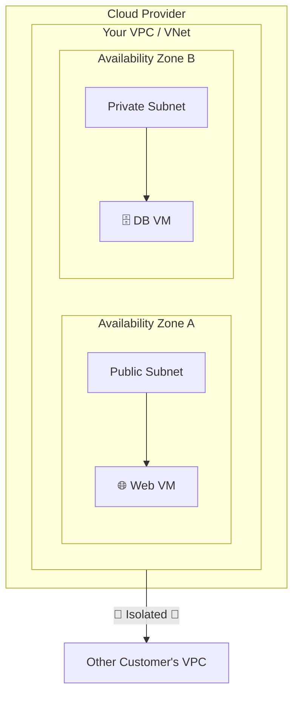
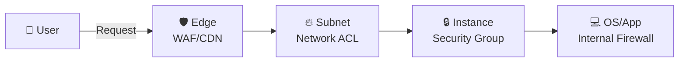

# **4장. 🌐 네트워크 및 🛡️ 보안**

---

## **학습 목표**

1.  **VPC/VNet**: 클라우드의 가상 사설 네트워크 개념과 중요성을 이해한다.
2.  **네트워크 구성**: 서브넷, 라우팅, 게이트웨이 등 핵심 구성 요소를 설명할 수 있다.
3.  **네트워크 설계**: Public/Private 서브넷의 차이를 이해하고 용도에 맞게 설계한다.
4.  **방화벽**: SG, NACL, NSG 등 핵심 보안 요소를 비교하고 트래픽 흐름을 제어한다.
5.  **트래픽 관리**: 클라우드 DNS와 로드밸런서의 역할을 이해하고 설명할 수 있다.

### **운영 목표 & 승인 포인트**

- 운영 목표: 퍼블릭/프라이빗 분리, 최소 개방, 관측/알림 일원화
- 승인 포인트: 방화벽/보안그룹 변경, 인터넷 노출/경로 변경, DNS/레코드 변경
- GitOps: 네트워크 변경 PR → 검증/테스트 → 승인 → 적용 → 로그/알림 연계

---

<!-- _class: lead -->

## **Part 1. 🏗️ 가상 네트워크 (Virtual Network)**

---

### **VPC / VNet 이란?**

**V**irtual **P**rivate **C**loud / **V**irtual **Net**work

클라우드 내에 논리적으로 격리된 **나만의 개인 네트워크 공간**입니다. 이 가상 네트워크 안에서 IP 주소 범위를 직접 제어하고, 서브넷을 생성하며, 라우팅 테이블과 네트워크 게이트웨이를 구성할 수 있습니다.

**모든 클라우드 서비스의 가장 기본이 되는 인프라입니다.**



---

### **실습: 🔒 Private VM 패치하기 (NAT 게이트웨이의 필요성)**

Private Subnet의 VM은 외부에서 직접 접근할 수 없어 안전합니다. 하지만 OS 업데이트나 패키지 설치를 위해 VM이 외부 인터넷에 접속해야 할 때는 어떻게 해야 할까요? NAT 게이트웨이의 필요성을 직접 경험해봅시다.

1.  **준비**: Public Subnet과 Private Subnet을 만듭니다. Private Subnet의 라우팅 테이블에는 인터넷 게이트웨이(IGW)로 향하는 경로가 **없어야** 합니다. 그리고 Private Subnet 안에 VM을 한 대 생성합니다.
    *(접속을 위해 Bastion Host 또는 AWS SSM과 같은 관리형 접속 서비스가 필요합니다.)*
2.  **실패 확인**: Private VM에 접속하여 OS 업데이트 명령을 실행합니다.
    ```bash
    # Ubuntu/Debian 계열
    sudo apt-get update
    ```
    명령어가 응답 없이 멈추거나, 저장소에 연결할 수 없다는 오류가 발생할 것입니다. VM이 인터넷으로 나갈 길이 없기 때문입니다.
3.  **해결책 (NAT 게이트웨이)**: **Public Subnet**에 **NAT 게이트웨이**를 생성합니다.
4.  **라우팅 설정**: **Private Subnet**의 라우팅 테이블에, 목적지가 `0.0.0.0/0`(모든 외부 트래픽)인 트래픽을 방금 생성한 **NAT 게이트웨이로 보내는 규칙**을 추가합니다.
5.  **성공 확인**: 다시 Private VM에서 OS 업데이트 명령을 실행하면, 이번에는 성공적으로 패키지 목록을 받아오는 것을 확인할 수 있습니다.

**Key Takeaway**: NAT 게이트웨이는 Private Subnet의 리소스가 외부의 공격은 받지 않으면서, 필요할 때만 안전하게 외부 인터넷으로 나갈 수 있도록 하는 핵심 통로입니다.

---

<!-- _class: lead -->

## **Part 2. 🛡️ 네트워크 보안**

---

### **계층적 방어 (Defense in Depth)**

단일 보안 조치에 의존하지 않고, 여러 계층의 보안 장치를 두어 전체 시스템의 보안을 강화하는 전략입니다.


- **패킷이 사용자로부터 애플리케이션까지 도달하는 동안 여러 겹의 방화벽을 거치게 됩니다.**

---

### **트래픽 흐름으로 보는 SG와 NACL**

인터넷의 요청이 EC2 인스턴스에 도달하기까지의 과정입니다.

```mermaid
graph TD
    Internet[🌐 Internet] --> RT[VPC Route Table]
    RT --> NACL[🔥 NACL Check <br> (Subnet-level)]
    subgraph Subnet
        NACL -- Allowed? --> SG[🔒 SG Check <br> (Instance-level)]
        SG -- Allowed? --> EC2[💻 EC2 Instance]
    end
```
1.  **NACL (여권 심사)**: 서브넷에 들어오기 전, IP 기반으로 1차 검문.
2.  **SG (방문증 확인)**: 인스턴스에 들어가기 직전, 포트/프로토콜 기반으로 2차 검문.

---

<!-- _class: lead -->

## **실습: 🛡️ 웹 서버용 방화벽 설정하기**

---

### **실습 1/3: 🖱️ AWS Security Group Portal + ⌨️ CLI**

<style scoped>.columns { display: grid; grid-template-columns: repeat(2, 1fr); gap: 1rem; }</style>
<div class="columns">
<div>

**🖱️ Portal Guide**
- **Link**: [EC2 Security Groups](https://console.aws.amazon.com/ec2/v2/home#SecurityGroups:)
- **Menu**: `EC2` > `Network & Security` > `Security Groups` > `Create security group`

1.  **Name**: `web-server-sg` 입력
2.  **VPC**: 현재 사용중인 VPC 선택
3.  **Inbound rules** > `Add rule`:
    - **Rule 1**: Type `HTTP`, Source `Anywhere (0.0.0.0/0)`
    - **Rule 2**: Type `SSH`, Source `My IP` (자동으로 내 IP 주소 입력됨)
4.  `Create security group` 클릭

</div>
<div>

**⌨️ CLI Guide**

```bash
# 1. 보안 그룹 생성 (VPC ID 필요)
SG_ID=$(aws ec2 create-security-group \
    --group-name web-server-sg \
    --description "Allow HTTP and SSH" \
    --vpc-id vpc-xxxxxxxx \
    --query 'GroupId' --output text)

# 2. HTTP (80) Inbound 규칙 추가
aws ec2 authorize-security-group-ingress \
    --group-id $SG_ID --protocol tcp --port 80 --cidr 0.0.0.0/0

# 3. SSH (22) Inbound 규칙 추가 (자신의 IP 사용!)
aws ec2 authorize-security-group-ingress \
    --group-id $SG_ID --protocol tcp --port 22 --cidr YOUR_IP_ADDRESS/32
```

</div>
</div>

---

### **실습 2/3: 🖱️ Azure NSG Portal + ⌨️ CLI**

<div class="columns">
<div>

**🖱️ Portal Guide**
- **Link**: [Azure Network Security Groups](https://portal.azure.com/#blade/HubsExtension/BrowseResource/resourceType/Microsoft.Network%2FnetworkSecurityGroups)
- **Menu**: `Network security groups` > `Create`

1.  **Resource group**, **Name** (`web-server-nsg`) 입력 후 생성
2.  생성된 NSG 리소스 > `Settings` > `Inbound security rules` > `Add`
3.  **Rule 1 (HTTP)**: Source `Any`, Port `80`, Protocol `TCP`, Action `Allow`, Priority `100`
4.  **Rule 2 (SSH)**: Source `My IP address`, Port `22`, Protocol `TCP`, Action `Allow`, Priority `110`

</div>
<div>

**⌨️ CLI Guide**

```bash
RG_NAME="my-resource-group"
NSG_NAME="web-server-nsg"

# 1. NSG 생성
az network nsg create --resource-group $RG_NAME --name $NSG_NAME

# 2. HTTP (80) Inbound 규칙 추가
az network nsg rule create --resource-group $RG_NAME --nsg-name $NSG_NAME \
    --name Allow-HTTP --priority 100 --protocol Tcp --destination-port-range 80

# 3. SSH (22) Inbound 규칙 추가 (자신의 IP 사용!)
az network nsg rule create --resource-group $RG_NAME --nsg-name $NSG_NAME \
    --name Allow-SSH --priority 110 --protocol Tcp --destination-port-range 22 \
    --source-address-prefixes YOUR_IP_ADDRESS
```

</div>
</div>

---

### **실습 3/3: 🖱️ GCP Firewall Rules Console + ⌨️ CLI**

<div class="columns">
<div>

**🖱️ Portal Guide**
- **Link**: [GCP Firewall Rules](https://console.cloud.google.com/vpc/firewalls)
- **Menu**: `VPC network` > `Firewall` > `CREATE FIREWALL RULE`

1.  **Rule 1 (HTTP)**: Name `allow-http`, **Targets** `Specified target tags`, **Target tags** `http-server`, **Source IPv4 ranges** `0.0.0.0/0`, **Protocols and ports** `tcp:80`
2.  **Rule 2 (SSH)**: Name `allow-ssh`, **Target tags** `ssh-server`, **Source IPv4 ranges** `YOUR_IP_ADDRESS/32`, **Protocols and ports** `tcp:22`

(GCP는 VM 생성 시 `http-server`, `ssh-server` 같은 네트워크 태그를 지정하여 규칙을 적용합니다)

</div>
<div>

**⌨️ CLI Guide**

```bash
# 1. HTTP (80) 방화벽 규칙 생성
gcloud compute firewall-rules create allow-http \
    --allow tcp:80 \
    --source-ranges=0.0.0.0/0 \
    --target-tags=http-server

# 2. SSH (22) 방화벽 규칙 생성 (자신의 IP 사용!)
gcloud compute firewall-rules create allow-ssh \
    --allow tcp:22 \
    --source-ranges=YOUR_IP_ADDRESS/32 \
    --target-tags=ssh-server
```

</div>
</div>

---

### **실습: 💧 일부러 실수하고 해결하기 (방화벽)**

실무에서는 실수로 방화벽 규칙을 잘못 설정하여 접속이 안 되는 경우가 매우 흔합니다. 직접 경험하고 해결해봅시다.

1.  **장애 상황 연출**: 위 실습에서 SSH 접속 규칙(Port 22)을 만들 때, `Source IP`에 자신의 진짜 IP 대신 **엉뚱한 IP 주소**(예: `1.2.3.4/32`)를 입력하고 저장합니다.
2.  **실패 확인**: VM에 SSH로 접속을 시도합니다. 접속이 거부되거나 타임아웃이 발생할 것입니다.
3.  **원인 분석 (Troubleshooting)**:
    *   **가설 1: VM이 꺼져있나?** → 콘솔에서 VM 상태가 `Running`인지 확인합니다.
    *   **가설 2: 방화벽이 막고 있나?** → 보안 그룹/방화벽 규칙을 다시 확인합니다. SSH 규칙의 `Source IP`가 내 현재 IP와 다른 것을 발견할 수 있습니다.
4.  **해결**: 규칙을 편집하여 `Source IP`를 **현재 나의 공인 IP 주소**로 올바르게 수정하고 저장합니다.
5.  **성공 확인**: 다시 SSH 접속을 시도하면 성공적으로 연결됩니다.

**Key Takeaway**: 네트워크 문제 발생 시, **방화벽 → 라우팅 → VM 상태** 순으로 차근차근 점검하는 것이 기본적인 트러블슈팅 방법입니다.

---

<!-- _class: lead -->

## **Part 3. 🗺️ DNS 및 트래픽 관리**

---

### **로드밸런서 유형: L7 vs. L4**

- **L7 (Application) Load Balancer**
    - **콘텐츠 기반 라우팅**: URL 경로, 헤더 등을 보고 트래픽을 분배합니다.
    ```mermaid
graph TD
    User --> L7_LB[L7 Load Balancer]
    subgraph Backend
        ApiPool[API Servers]
        ImgPool[Image Servers]
    end
    L7_LB -- /api/* --> ApiPool
    L7_LB -- /images/* --> ImgPool
```

- **L4 (Network) Load Balancer**
    - **단순 TCP/UDP 전달**: IP와 포트만 보고 빠르게 트래픽을 전달합니다.
    ```mermaid
graph TD
    User --> L4_LB[L4 Load Balancer]
    subgraph Backend
        Pool[Game/Streaming Servers]
    end
    L4_LB -- TCP/UDP Passthrough --> Pool
```

---

### **보안 모범사례 (Network)**

- 최소 개방: 인바운드 소스 제한, 아웃바운드 제어, 프라이빗 우선 설계
- 로깅: 플로우 로그/방화벽 로그/로드밸런서 접근 로그 수집
- 접근: Bastion/IAP/SSM 등 관리형 터널, 공개 IP 최소화

---

### **팀 역할 기반 실습 가이드**

- 재무팀: NAT GW/LB/데이터 전송 비용 시각화, 비업무시간 절감 정책
- IT 운영/DevOps: VPC/VNet·서브넷·보안 정책 IaC 표준화, 변경 PR 리뷰/테스트 자동화
- 개발팀: 도메인 연결 요구사항/레코드 테스트, 최소 포트 원칙 준수
- SRE: 장애 주도 설계(단일 장애점 제거), 네트워크 SLI/SLO, 런북(포트 차단/라우팅/DNS)

---

### **자동화 실행 경로**

- CLI: `cloud_basic/automation/cli/aws/ch4_network.sh`, `cloud_basic/automation/cli/azure/ch4_network.sh`, `cloud_basic/automation/cli/gcp/ch4_network.sh`
- Terraform: `cloud_basic/automation/terraform/aws/ch4_network`, `cloud_basic/automation/terraform/azure/ch4_network`, `cloud_basic/automation/terraform/gcp/ch4_network`

---

### **트러블슈팅 체크리스트**

- 연결 불가: 방화벽/SG/NSG → 라우팅/게이트웨이 → 헬스체크/백엔드 순
- DNS: 레코드/TTL/대상 확인, 사설/공용 DNS 경로 충돌 점검
- LB: 리스너/백엔드 포트 매칭, 헬스체크 경로/응답코드, 대상 태그/어태치 상태

---

### **4장 요약**

- **VPC/VNet**: 🏗️ 클라우드 인프라의 기초가 되는 격리된 나만의 네트워크 공간.
- **서브넷**: 🚪 Public은 외부 통신, Private은 내부 리소스 보호에 사용.
- **네트워크 보안**: 🔒 **Stateful**한 **SG/NSG**는 인스턴스를, ↔️ **Stateless**한 **NACL**은 서브넷을 보호.
- **DNS/로드밸런서**: 🗺️ DNS는 이름으로 서비스를 찾게 해주고, ⚖️ 로드밸런서는 트래픽을 분산하여 안정성을 높임.

---

### **교차 문서/자동화 링크**
- 본문: `cloud_basic/textbook/Chapter4_Network.md`
- 자동화(CLI): `cloud_basic/automation/cli/*/ch4_network.sh`
- 자동화(Terraform): `cloud_basic/automation/terraform/*/ch4_network`

---

<!-- _class: lead -->

## **수고하셨습니다!**

**Q&A**
