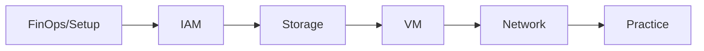

# 클라우드 기초 교육 시나리오: 나만의 블로그 만들기

## 1. 시나리오 개요 (Overview)

본 시나리오는 클라우드 입문자가 **'나만의 블로그 만들기'**라는 하나의 통합된 목표를 통해 클라우드 핵심 서비스를 배우는 과정입니다. AWS, Azure, GCP의 공통 서비스(IAM, 스토리지, VM, 네트워크)를 이용해 블로그를 직접 구축하며, **비용 관리(FinOps), 인프라 자동화(IaC), 장애 대응**이라는 실무 개념까지 함께 경험하는 것을 목표로 합니다.

- **최종 목표**: 클라우드 위에 나만의 블로그를 만들고 운영하기
- **대상**: 클라우드 입문자, 학생, IT 기획자, 개발자
- **학습 목표**:
    1.  **(구축)** IAM, 스토리지, VM, 네트워크를 이용해 기본적인 웹 서비스를 구축할 수 있다.
    2.  ** (비용)** 예산 및 알림을 설정하고, 서비스 비용을 예측하며, 실습 후 리소스를 정리할 수 있다.
    3.  **(자동화)** 간단한 IaC(Terraform) 코드를 이해하고 수정하여 인프라를 배포할 수 있다.
    4.  **(장애 대응)** 의도된 장애 상황(방화벽 오류, 헬스체크 실패)을 해결하는 경험을 할 수 있다.
- **예상 소요 시간**: 4시간

## 2. 교육 진행 순서: "나만의 블로그 만들기"

### 비주얼 개요

| 단계 | 블로그 구축 과정 | 주요 학습 내용 | 핵심 활동 (실습) | 관련 교재 |
| :--- | :--- | :--- | :--- | :--- |
| 0 | **프로젝트 준비 및 예산 설정** | - FinOps 기초: 예산, 알림 - 개발 환경 준비 | - **월 $5 예산 및 알림 설정하기** - 실습 후 리소스 정리의 중요성 인지 | [Chapter5_Practice.md](Chapter5_Practice.md) |
| 1 | **블로그 관리자 계정 만들기** | - IAM: 사용자, 그룹, 역할, 정책 - 최소 권한 원칙 | - 블로그 관리자(IAM User) 생성 - '콘텐츠 관리자' 그룹에 소속시켜 권한 부여 | [Chapter1_IAM.md](Chapter1_IAM.md) |
| 2 | **이미지/미디어 파일 저장소 만들기** | - 오브젝트 스토리지 - 정적 웹 호스팅 - 데이터 보호 및 비용 최적화 | - 블로그 이미지/CSS를 저장할 버킷 생성 - **(IaC 맛보기)** Terraform 코드로 버킷 만들기 | [Chapter2_Storage.md](Chapter2_Storage.md) |
| 3 | **블로그 애플리케이션 서버 만들기** | - 가상머신(VM) 개념 및 종류 - 고가용성: 로드밸런서, 오토스케일링 | - 블로그 앱을 실행할 VM 생성 - **(장애 대응)** 헬스체크 실패 시나리오 경험하기 | [Chapter3_VM.md](Chapter3_VM.md) |
| 4 | **외부 방문자 길 열어주기** | - 가상 네트워크(VPC/VNet) - Public/Private 서브넷 - 방화벽(보안 그룹) | - 블로그 방문자용 방화벽 규칙 설정 - **(장애 대응)** 잘못된 IP로 규칙 설정 후 접속 실패 해결하기 | [Chapter4_Network.md](Chapter4_Network.md) |
| 5 | **블로그 완성 및 운영** | - 전체 아키텍처 리뷰 - 3-Tier 아키텍처, 서버리스 개념 | - (종합) 각자 만든 블로그 아키텍처 그려보기 - 생성된 모든 리소스 삭제하며 비용 확인 | [Chapter5_Practice.md](Chapter5_Practice.md) |

## 3. AI 멘토 상호작용 예시 (AI Mentor Interaction Examples)

**학생 질문 1:** "Terraform 코드로 버킷을 만드는 게 콘솔에서 클릭하는 것보다 더 복잡해 보이는데, 왜 코드를 쓰나요?"

**AI 멘토 답변:** "좋은 지적입니다! 버킷 하나만 만들 때는 클릭이 더 빠를 수 있습니다. 하지만 블로그가 커져서 개발용, 테스트용, 운영용 버킷 3개가 필요하고, 각 버킷마다 동일한 보안 설정을 적용해야 한다면 어떨까요? 코드를 사용하면, 변수 하나만 바꿔서 동일한 구성의 인프라를 몇 초 만에 복제할 수 있고, 모든 설정이 코드로 명확하게 관리되어 실수를 줄일 수 있습니다. 이것이 바로 '코드로서의 인프라(IaC)'의 강력함입니다."

**학생 질문 2:** "실습하다가 VM을 삭제하는 걸 잊어버리면 어떻게 되나요?"

**AI 멘토 답변:** "매우 중요한 질문입니다. VM을 삭제하지 않으면 계속 요금이 부과됩니다. 그래서 저희가 0단계에서 **'예산 및 알림 설정'**을 먼저 한 것입니다. 만약 설정한 예산의 80%가 소진되면 즉시 이메일 알림이 와서 의도치 않은 요금을 막을 수 있습니다. 모든 실습 후에는 '리소스 정리' 단계를 통해 생성한 자원을 깨끗하게 삭제하는 습관을 들이는 것이 클라우드를 잘 사용하는 첫걸음입니다."

**학생 질문 3:** "방화벽에서 제 IP를 실수로 잘못 입력해서 VM에 접속이 안 돼요. 어떻게 해결해야 하나요?"

**AI 멘토 답변:** "실무에서 정말 자주 겪는 상황입니다! 당황하지 마세요. 이것이 바로 저희가 '장애 대응' 시나리오를 넣은 이유입니다. 먼저, 클라우드 콘솔의 '보안 그룹' 또는 '방화벽 규칙' 메뉴로 다시 돌아가세요. 그리고 방금 추가한 규칙의 '소스 IP'가 현재 내 컴퓨터의 IP 주소와 일치하는지 확인하고, 다르다면 올바른 IP로 수정해주면 됩니다. 이렇게 문제를 직접 해결하는 경험이 최고의 학습입니다."

## 4. 개선 및 확장 제안 (Suggestions for Improvement)

1.  **시나리오 고도화**:
    *   **3-Tier 아키텍처 실습**: 현재의 단일 VM 웹 서버 구성을 Web Tier, App Tier, DB Tier로 분리하는 심화 실습을 추가합니다. (Web: Public Subnet, App/DB: Private Subnet)
    *   **서버리스(Serverless) 맛보기**: 간단한 Lambda/Functions를 이용해 S3에 파일이 업로드되면 자동으로 알림을 보내는 실습을 추가하여 서버리스 개념을 소개합니다.

2.  **콘텐츠 보강**:
    *   **비용 관리(FinOps) 챕터 추가**: 각 서비스의 비용 구조를 설명하고, 예산 설정 및 알림(Budget & Alert) 실습을 추가하여 비용 관리의 중요성을 강조합니다.
    *   **IaC(Infrastructure as Code) 소개**: Terraform이나 CloudFormation을 이용해 위 실습들을 코드로 정의하고 배포하는 방법을 간략하게 소개하여 자동화의 개념을 제시합니다.

3.  **학습 경험 개선**:
    *   **사전/사후 퀴즈**: 각 챕터 시작 전 간단한 퀴즈로 사전 지식을 점검하고, 종료 후 퀴즈로 학습 내용을 복습하게 합니다.
    *   **실습 환경 자동화**: 사용자가 직접 계정을 설정하는 대신, 클릭 한 번으로 실습에 필요한 최소한의 IAM 역할과 리소스가 준비되는 스크립트를 제공하여 학습에만 집중할 수 있도록 돕습니다.
    *   **시각 자료 강화**: Mermaid.js 외에 실제 클라우드 콘솔 화면을 캡처한 이미지나 짧은 GIF를 추가하여 CLI 명령어와 콘솔操作을 시각적으로 연결해줍니다.
