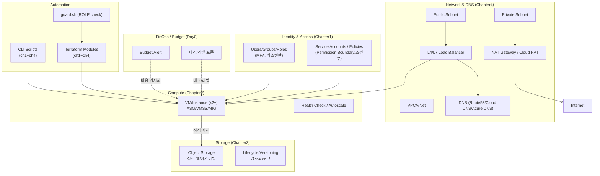
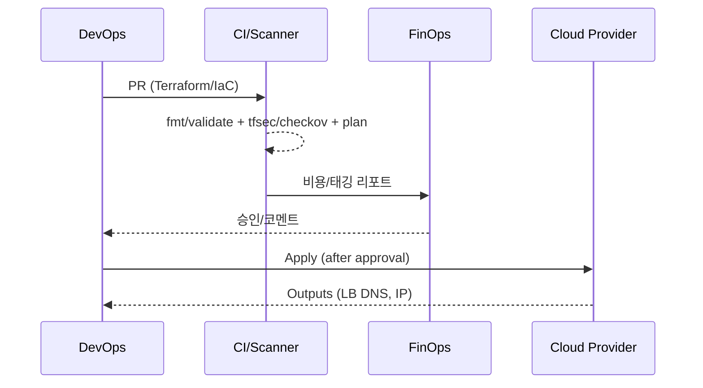

실습 아키텍처 개요 (cloud_basic)
=====================

목적 및 범위
--------

본 문서는 클라우드실무력 강화(기초) 실습의 표준 아키텍처를 한눈에 제시합니다. Day 0(사전준비)부터 Chapter 1~4(IAM → VM → Storage → Network/DNS) 실습 간의 관계를 설명하고, 공통 보안/운영 원칙과 자동화 흐름을 정리합니다.

관련 문서
------

- 사전준비 공통: [2_공통사항.md](mdc:mcp_knowledge_base/cloud_basic/prerequisite/2_공통사항.md)
- 계정 등록: [1_계정등록.md](mdc:mcp_knowledge_base/cloud_basic/prerequisite/1_계정등록.md)
- 자동화 안내: [4_생산성툴.md](mdc:mcp_knowledge_base/cloud_basic/prerequisite/4_생산성툴.md)
- 실습 흐름: [실습_시나리오.md](mdc:mcp_knowledge_base/cloud_basic/실습_시나리오.md)
- Chapter 문서: [Chapter1_IAM.md](mdc:mcp_knowledge_base/cloud_basic/Chapter1_IAM.md), [Chapter2_VM.md](mdc:mcp_knowledge_base/cloud_basic/Chapter2_VM.md), [Chapter3_Storage.md](mdc:mcp_knowledge_base/cloud_basic/Chapter3_Storage.md), [Chapter4_Network_DNS.md](mdc:mcp_knowledge_base/cloud_basic/Chapter4_Network_DNS.md)

상위 구성 개요
---------



참고 아키텍처 매핑(요지)
----------------

- Azure: VNet/Subnet/NSG, VMSS + LB(Standard), Storage Account(static website), Azure DNS, Cost Management/Budget
- AWS: VPC/Subnet/SG/NACL, EC2 + ASG + ALB, S3(static), Route53, AWS Budgets
- GCP: VPC/Subnet/Firewall, GCE + MIG + HTTP(S) LB, Cloud Storage(static), Cloud DNS, Billing Budget

설계 원칙(공통)
----------

- 보안: MFA 필수, 최소권한(RBAC/IAM), 인바운드 최소/소스 제한, 데이터 암호화/KMS, 비밀관리 표준
- 가용성: 다중 AZ/존, 헬스체크 기반 오토스케일, 상태 점검/알림
- 비용: 예산/알림, 작은 타입/스케줄/수명주기, 태그/라벨 준수
- 운영: IaC(Terraform) 우선, 표준 네이밍/태깅, 관측성(로그/지표/알림)

네트워크 토폴로지(기본 패턴)
------------------

- 퍼블릭 서브넷: LB, Jumpbox/Bastion(선택), 제한적 인바운드(80/443/22 최소)
- 프라이빗 서브넷: 애플리케이션 VM, 아웃바운드는 NAT 경유
- DNS: 도메인/서브도메인 → LB 엔드포인트(A/AAAA/CNAME)

데이터 흐름
-------

- 사용자 → DNS → LB → VM → 정적 자산은 Object Storage에서 제공(선택)
- 백엔드 업데이트는 IaC/CLI로 변경 → Plan/Review → Apply → 모니터링

역할 분리 & 승인 흐름(요약)
-----------------

- 비용관리자: 예산/비용/태깅 준수 점검(리소스 변경 권한 없음)
- IT 관리자(DevOps/운영): 인프라 생성/변경(IaC/CLI), Billing 권한 없음
- 승인: PR → Plan(보안스캔) → 비용 검토 → 승인 → Apply

자동화 실행 포인트
-----------

- CLI: `cloud_basic/automation/cli/*/ch{1..4}_*.sh`
- Terraform: `cloud_basic/automation/terraform/{aws,azure,gcp}/ch{1..4}_*`
- 가드: [`guard.sh`](mdc:mcp_knowledge_base/cloud_basic/automation/terraform/guard.sh) 로 `ROLE=cost-manager` 실행 차단
- 예산 스크립트: `automation/cli/budget/{aws,azure,gcp}_budget.sh`

제출물 가이드(요약)
-------------

- 본 개요를 반영한 아키텍처 다이어그램(수정 가능)
- 각 Chapter 결과 스크린샷 및 실행 명령 요약
- 역할 분리/예산 설정 증빙 및 개선 포인트 3가지 이상


플랫폼별 참조 아키텍처(요약)
------------------

```mermaid
flowchart LR
  subgraph AWS
    A[VPC 10.0.0.0/16]
    A --> A1[Public Subnet]
    A --> A2[Private Subnet]
    A1 --> ALB[ALB]
    A2 --> ASG[EC2 ASG x2]
    A2 --> NAT[NAT GW]
  end
  subgraph Azure
    Z[VNet 10.1.0.0/16]
    Z --> Z1[Public Subnet]
    Z --> Z2[Private Subnet]
    Z1 --> LBAZ[LB(Standard)]
    Z2 --> VMSS[VMSS x2]
  end
  subgraph GCP
    G[VPC custom]
    G --> G1[Public Subnet]
    G --> G2[Private Subnet]
    G1 --> GLB[HTTP(S) LB]
    G2 --> MIG[MIG x2]
    G2 --> CNAT[Cloud NAT]
  end
```

기본 파라미터 표(권장 값)
----------------

| 구분 | 권장 값 |
|---|---|
| CIDR(AWS) | 10.0.0.0/16 (Public 10.0.1.0/24, Private 10.0.2.0/24) |
| CIDR(Azure) | 10.1.0.0/16 (Public 10.1.1.0/24, Private 10.1.2.0/24) |
| CIDR(GCP) | 10.2.0.0/16 (Public 10.2.1.0/24, Private 10.2.2.0/24) |
| 헬스체크 경로 | HTTP /healthz (200 OK) |
| 오토스케일 기준 | CPU 70% (down 30%) |
| DNS 레코드 | A/AAAA 혹은 CNAME → LB 엔드포인트 |

보안 규칙 표(최소 허용 예)
----------------

| 영역 | 프로토콜:포트 | From → To | 비고 |
|---|---|---|---|
| Public | TCP:80/443 | Internet → LB | 웹 트래픽 |
| Public | TCP:22 | Bastion → Public/Private | 필요 시, 소스 제한 |
| Private | TCP:80/443 | LB → VM | 백엔드 서비스 |
| Outbound | ANY | Private → Internet(NAT) | 패키지 업데이트 등 |

비용/예산 기준(예시)
--------------

- 예산: 월 10 USD(랩) – 임계치 80%, 100% 알림
- 태깅: project, department, env, owner, cost-center 필수
- 절감 팁: 근무시간 외 VM 정지, 작은 타입, 정적 자산은 Object Storage 활용

관측성 & 운영
---------

- 로그/지표: LB 헬스, VM CPU/메모리, 네트워크 플로우 로그
- 알림: 헬스체크 실패, 예산 임계치, 공개 객체/보안 정책 위반
- IaC 정책: PR → Plan(tfsec/checkov) → 승인 → Apply 고정

배포 워크플로(시퀀스)
----------------



위험요소 및 완화
-----------

- 과도한 공개(버킷/포트): 퍼블릭 차단 기본, 예외 승인
- 비용 폭증: 예산/알림, 태깅 없는 리소스 탐지
- 권한 오류: RBAC 최소권한, Permission Boundary/조건부 정책 적용
- 드리프트: 정기 Plan/Drift 탐지, 자동 복구(옵션)

확장/선택 과제
----------

- CDN/WAF 연동으로 보안/성능 강화
- 컨테이너화(EKS/GKE/AKS) 및 Ingress 실습 확장
- 비공개 정적 웹(서명 URL/프라이빗 엔드포인트)


