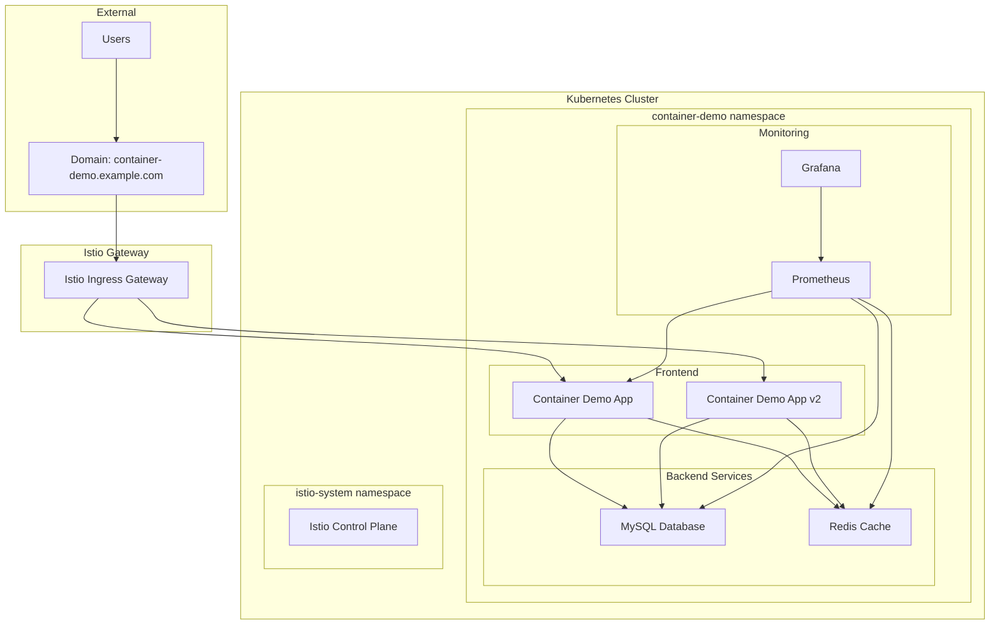

<div align="center">

## 🏠 최상위 네비게이션
[🏠 홈](/mcp_knowledge_base/index.md) | [📚 전체 커리큘럼](/mcp_knowledge_base/curriculum.md) | [🔗 학습 경로](/mcp_knowledge_base/cloud_container/learning-path.md)

## 📖 현재 위치
**Cloud Container** > **1일차** > **Container 과정 종합 실습 가이드**

## ⬅️ 이전/다음 네비게이션
[← 이전: Cloud Container 메인](/mcp_knowledge_base/cloud_container/README.md) | [다음: Cloud Container 1일차 →](/mcp_knowledge_base/cloud_container/textbook/Day1/README.md)

</div>

# Container 과정 종합 실습 가이드

<div align="center">

[← 이전: Cloud Container 메인](/mcp_knowledge_base/cloud_master/README.md) | [📚 전체 커리큘럼](/mcp_knowledge_base/curriculum.md) | [🏠 학습 경로로 돌아가기](/mcp_knowledge_base/index.md) | [📋 학습 경로](/mcp_knowledge_base/cloud_master/learning-path.md)

</div>

## 🎯 실습 개요

이 가이드는 Container 과정의 모든 학습 내용을 통합하여 **실제 운영 환경과 유사한 시나리오**를 구현하는 종합 실습입니다.

### 📋 실습 목표
- Master 과정의 actions-demo 프로젝트를 기반으로 한 고급 컨테이너 배포
- Kubernetes, Helm, Istio를 활용한 마이크로서비스 아키텍처 구현
- 고가용성, 확장성, 보안을 고려한 운영 환경 구축
- 모니터링, 로깅, 알림 시스템을 통한 운영 자동화

---

## 🏗️ 아키텍처 설계

### 전체 아키텍처


### 서비스 구성
- **Frontend**: Container Demo Application (Node.js)
- **Backend**: MySQL Database + Redis Cache
- **Gateway**: Istio Ingress Gateway
- **Monitoring**: Prometheus + Grafana
- **Security**: Network Policy + Pod Security Policy

---

## 🚀 실습 환경 준비

### 1단계: 사전 요구사항 확인

#### 필요한 도구
```bash
# Kubernetes 클러스터 확인
kubectl cluster-info

# Helm 설치 확인
helm version

# Istio CLI 설치 확인
istioctl version

# Docker 이미지 빌드 및 푸시
docker build -t gcr.io/PROJECT_ID/container-demo:latest .
docker push gcr.io/PROJECT_ID/container-demo:latest
```

#### 환경 변수 설정
```bash
export GCP_PROJECT_ID="your-project-id"
export IMAGE_TAG="latest"
export NAMESPACE="container-demo"
```

### 2단계: 프로젝트 구조 확인
```
container-demo/
├── helm-chart-templates/          # Helm 차트
│   ├── Chart.yaml
│   ├── values.yaml
│   └── templates/
├── istio-config/                  # Istio 설정
│   └── gateway.yaml
├── monitoring-advanced/           # 모니터링 설정
│   └── prometheus-config.yaml
├── scripts/                       # 배포 스크립트
│   └── deploy-advanced.sh
└── k8s/                          # Kubernetes 매니페스트
    ├── aws-ecs/
    └── gcp-gke/
```

---

## 📚 실습 단계별 가이드

### Day 1: 컨테이너 기술 심화

#### 1교시: Docker 최적화 (60분)

##### 실습 1-1: 멀티스테이지 빌드 적용
```bash
# 기존 Dockerfile과 비교
docker build -f Dockerfile -t container-demo:basic .
docker build -f Dockerfile.container -t container-demo:optimized .

# 이미지 크기 비교
docker images | grep container-demo
```

##### 실습 1-2: 보안 강화
```bash
# 보안 스캔 실행
docker run --rm -v /var/run/docker.sock:/var/run/docker.sock \
  aquasec/trivy image container-demo:optimized
```

#### 2교시: GitHub Actions 고급 기능 (60분)

##### 실습 2-1: 매트릭스 빌드 설정
```yaml
# .github/workflows/advanced-ci.yml
name: Advanced CI/CD Pipeline
on:
  push:
    branches: [main, develop]
  pull_request:
    branches: [main]

jobs:
  test:
    runs-on: ubuntu-latest
    strategy:
      matrix:
        node-version: [18, 20]
        os: [ubuntu-latest, windows-latest]
    steps:
      - uses: actions/checkout@v4
      - name: Use Node.js ${{ matrix.node-version }}
        uses: actions/setup-node@v4
        with:
          node-version: ${{ matrix.node-version }}
      - name: Install dependencies
        run: npm ci
      - name: Run tests
        run: npm test
      - name: Run security scan
        run: npm audit --audit-level moderate
```

##### 실습 2-2: 보안 스캔 통합
```yaml
  security-scan:
    runs-on: ubuntu-latest
    steps:
      - uses: actions/checkout@v4
      - name: Run Trivy vulnerability scanner
        uses: aquasecurity/trivy-action@master
        with:
          scan-type: 'fs'
          scan-ref: '.'
          format: 'sarif'
          output: 'trivy-results.sarif'
      - name: Upload Trivy scan results
        uses: github/codeql-action/upload-sarif@v2
        with:
          sarif_file: 'trivy-results.sarif'
```

#### 3교시: 클라우드 컨테이너 서비스 (90분)

##### 실습 3-1: AWS ECS 배포
```bash
# ECR 리포지토리 생성
aws ecr create-repository --repository-name container-demo

# 이미지 푸시
aws ecr get-login-password --region ap-northeast-2 | \
  docker login --username AWS --password-stdin \
  ACCOUNT_ID.dkr.ecr.ap-northeast-2.amazonaws.com

docker tag container-demo:latest \
  ACCOUNT_ID.dkr.ecr.ap-northeast-2.amazonaws.com/container-demo:latest

docker push ACCOUNT_ID.dkr.ecr.ap-northeast-2.amazonaws.com/container-demo:latest

# ECS 클러스터 생성 및 서비스 배포
aws ecs create-cluster --cluster-name container-demo-cluster
aws ecs register-task-definition --cli-input-json file://k8s/aws-ecs/task-definition.json
aws ecs create-service --cluster container-demo-cluster --service-name container-demo-service \
  --task-definition container-demo-task --desired-count 2
```

##### 실습 3-2: GCP GKE 배포
```bash
# GKE 클러스터 생성
gcloud container clusters create container-demo-cluster \
  --zone asia-northeast3-a \
  --num-nodes 3 \
  --machine-type e2-medium \
  --enable-autoscaling \
  --min-nodes 1 \
  --max-nodes 5

# 클러스터 인증
gcloud container clusters get-credentials container-demo-cluster \
  --zone asia-northeast3-a

# 애플리케이션 배포
kubectl apply -f k8s/gcp-gke/deployment.yaml
```

#### 4교시: 자동화된 배포 전략 (90분)

##### 실습 4-1: Blue-Green 배포
```bash
# Blue 환경 배포
kubectl apply -f k8s/gcp-gke/deployment-blue.yaml

# Green 환경 배포
kubectl apply -f k8s/gcp-gke/deployment-green.yaml

# 트래픽 전환 (Istio VirtualService 수정)
kubectl patch virtualservice container-demo-vs -n container-demo --type='merge' -p='
spec:
  http:
  - route:
    - destination:
        host: container-demo-service
        subset: green
      weight: 100
    - destination:
        host: container-demo-service
        subset: blue
      weight: 0'
```

##### 실습 4-2: 롤백 테스트
```bash
# 문제 발생 시 Blue 환경으로 롤백
kubectl patch virtualservice container-demo-vs -n container-demo --type='merge' -p='
spec:
  http:
  - route:
    - destination:
        host: container-demo-service
        subset: blue
      weight: 100
    - destination:
        host: container-demo-service
        subset: green
      weight: 0'
```

### Day 2: 고가용성 아키텍처

#### 1교시: 고가용성 아키텍처 설계 (90분)

##### 실습 1-1: Multi-AZ 구성
```bash
# GKE 클러스터를 여러 존에 배포
gcloud container clusters create container-demo-ha \
  --zone asia-northeast3-a \
  --additional-zones asia-northeast3-b,asia-northeast3-c \
  --num-nodes 2 \
  --machine-type e2-medium

# Pod를 여러 존에 분산 배포
kubectl apply -f - <<EOF
apiVersion: apps/v1
kind: Deployment
metadata:
  name: container-demo-ha
spec:
  replicas: 6
  selector:
    matchLabels:
      app: container-demo
  template:
    metadata:
      labels:
        app: container-demo
    spec:
      affinity:
        podAntiAffinity:
          preferredDuringSchedulingIgnoredDuringExecution:
          - weight: 100
            podAffinityTerm:
              labelSelector:
                matchExpressions:
                - key: app
                  operator: In
                  values:
                  - container-demo
              topologyKey: kubernetes.io/hostname
      containers:
      - name: container-demo
        image: gcr.io/PROJECT_ID/container-demo:latest
        ports:
        - containerPort: 3000
EOF
```

##### 실습 1-2: 로드 밸런싱 설정
```bash
# GCP Load Balancer 설정
gcloud compute addresses create container-demo-ip --global

# Backend Service 생성
gcloud compute backend-services create container-demo-backend \
  --protocol HTTP \
  --health-checks container-demo-health-check \
  --global

# URL Map 생성
gcloud compute url-maps create container-demo-map \
  --default-service container-demo-backend

# Target Proxy 생성
gcloud compute target-http-proxies create container-demo-proxy \
  --url-map container-demo-map

# Forwarding Rule 생성
gcloud compute forwarding-rules create container-demo-rule \
  --global \
  --target-http-proxy container-demo-proxy \
  --address container-demo-ip \
  --ports 80
```

#### 2교시: 모니터링 및 로깅 (90분)

##### 실습 2-1: Prometheus 설정
```bash
# Prometheus 배포
kubectl apply -f monitoring-advanced/prometheus-config.yaml

# Prometheus 서비스 생성
kubectl apply -f - <<EOF
apiVersion: v1
kind: Service
metadata:
  name: prometheus-service
  namespace: container-demo
spec:
  selector:
    app: prometheus
  ports:
  - port: 9090
    targetPort: 9090
  type: ClusterIP
EOF

# Prometheus 접속
kubectl port-forward svc/prometheus-service 9090:9090 -n container-demo
```

##### 실습 2-2: Grafana 대시보드 구성
```bash
# Grafana 배포
kubectl apply -f - <<EOF
apiVersion: apps/v1
kind: Deployment
metadata:
  name: grafana
  namespace: container-demo
spec:
  replicas: 1
  selector:
    matchLabels:
      app: grafana
  template:
    metadata:
      labels:
        app: grafana
    spec:
      containers:
      - name: grafana
        image: grafana/grafana:latest
        ports:
        - containerPort: 3000
        env:
        - name: GF_SECURITY_ADMIN_PASSWORD
          value: "admin123"
        volumeMounts:
        - name: grafana-storage
          mountPath: /var/lib/grafana
      volumes:
      - name: grafana-storage
        emptyDir: {}
---
apiVersion: v1
kind: Service
metadata:
  name: grafana-service
  namespace: container-demo
spec:
  selector:
    app: grafana
  ports:
  - port: 3000
    targetPort: 3000
  type: ClusterIP
EOF

# Grafana 접속
kubectl port-forward svc/grafana-service 3000:3000 -n container-demo
```

#### 3교시: 운영 자동화 (90분)

##### 실습 3-1: 자동 복구 시나리오
```bash
# Pod 장애 시뮬레이션
kubectl delete pod -l app=container-demo -n container-demo

# 자동 복구 확인
kubectl get pods -l app=container-demo -n container-demo -w

# HPA 테스트
kubectl run -i --tty load-generator --rm --image=busybox --restart=Never -- /bin/sh
# load-generator pod 내에서
while true; do wget -q -O- http://container-demo-service:80; done
```

##### 실습 3-2: 알림 시스템 구성
```bash
# AlertManager 설정
kubectl apply -f - <<EOF
apiVersion: v1
kind: ConfigMap
metadata:
  name: alertmanager-config
  namespace: container-demo
data:
  alertmanager.yml: |
    global:
      smtp_smarthost: 'smtp.gmail.com:587'
      smtp_from: 'alerts@example.com'
    route:
      group_by: ['alertname']
      group_wait: 10s
      group_interval: 10s
      repeat_interval: 1h
      receiver: 'web.hook'
    receivers:
    - name: 'web.hook'
      webhook_configs:
      - url: 'http://webhook.example.com/'
EOF
```

---

## 🔧 고급 실습 시나리오

### 시나리오 1: 장애 복구 테스트
```bash
# 1. Pod 삭제로 장애 시뮬레이션
kubectl delete pod -l app=container-demo -n container-demo

# 2. 자동 복구 확인 (약 30초 내)
kubectl get pods -l app=container-demo -n container-demo

# 3. 서비스 연속성 확인
curl http://container-demo-service:80/health
```

### 시나리오 2: 부하 테스트
```bash
# 1. 부하 생성기 실행
kubectl run -i --tty load-generator --rm --image=busybox --restart=Never -- /bin/sh

# 2. 부하 생성 (load-generator pod 내에서)
while true; do wget -q -O- http://container-demo-service:80; done

# 3. HPA 동작 확인
kubectl get hpa -n container-demo -w
```

### 시나리오 3: 보안 테스트
```bash
# 1. Network Policy 테스트
kubectl run -i --tty test-pod --rm --image=busybox --restart=Never -- /bin/sh

# 2. 허용되지 않은 접근 시도 (test-pod 내에서)
wget -q -O- http://container-demo-service:80

# 3. 허용된 접근 확인
wget -q -O- http://mysql-service:3306
```

---

## 📊 성과 측정

### 성능 지표
- **응답 시간**: 95th percentile < 500ms
- **가용성**: 99.9% 이상
- **처리량**: 초당 1000 요청 처리
- **복구 시간**: 장애 발생 시 30초 내 복구

### 모니터링 지표
- **CPU 사용률**: 평균 70% 이하
- **메모리 사용률**: 평균 80% 이하
- **에러율**: 0.1% 이하
- **응답 시간**: 평균 200ms 이하

---

## ✅ 실습 체크리스트

### Day 1 체크리스트
- [ ] Docker 멀티스테이지 빌드 적용
- [ ] 보안 스캔 통합
- [ ] GitHub Actions 고급 워크플로우 설정
- [ ] AWS ECS 배포 성공
- [ ] GCP GKE 배포 성공
- [ ] Blue-Green 배포 테스트
- [ ] 롤백 시나리오 테스트

### Day 2 체크리스트
- [ ] Multi-AZ 아키텍처 구성
- [ ] 로드 밸런싱 설정 완료
- [ ] Auto Scaling 테스트
- [ ] Prometheus 모니터링 설정
- [ ] Grafana 대시보드 구성
- [ ] 알림 시스템 설정
- [ ] 자동 복구 시나리오 테스트
- [ ] 보안 정책 적용

---

## 🐛 문제 해결

### 자주 발생하는 문제

#### 1. Pod 시작 실패
```bash
# 해결방법: Pod 로그 확인
kubectl logs -f deployment/container-demo -n container-demo

# 이벤트 확인
kubectl get events -n container-demo --sort-by='.lastTimestamp'
```

#### 2. 서비스 연결 실패
```bash
# 해결방법: 서비스 엔드포인트 확인
kubectl get endpoints -n container-demo

# DNS 확인
kubectl run -i --tty debug --rm --image=busybox --restart=Never -- nslookup container-demo-service
```

#### 3. 모니터링 데이터 수집 실패
```bash
# 해결방법: Prometheus 설정 확인
kubectl get configmap prometheus-config -n container-demo -o yaml

# 메트릭 엔드포인트 확인
kubectl port-forward svc/container-demo-service 8080:80 -n container-demo
curl http://localhost:8080/metrics
```

---

## 📚 참고 자료

### 공식 문서
- [Kubernetes 공식 문서](https://kubernetes.io/docs/)
- [Helm 공식 문서](https://helm.sh/docs/)
- [Istio 공식 문서](https://istio.io/latest/docs/)
- [Prometheus 공식 문서](https://prometheus.io/docs/)
- [Grafana 공식 문서](https://grafana.com/docs/)

### 추가 학습 자료
- [Kubernetes 고급 가이드](/mcp_knowledge_base/cloud_container/textbook/Day1/kubernetes-advanced-guide.md)
- [Master 과정 연계 가이드](/mcp_knowledge_base/cloud_container/textbook/Day1/master-integration-guide.md)
- [Container 오케스트레이션 가이드](/mcp_knowledge_base/cloud_container/textbook/Day1/container-orchestration-guide.md)

---

**💡 팁**: 이 종합 실습을 통해 실제 운영 환경에서 필요한 모든 기술을 통합적으로 학습할 수 있습니다. 각 단계를 차근차근 따라하면서 클라우드 네이티브 애플리케이션 운영의 전 과정을 경험해보세요!


---

<div align="center">

## 🔗 관련 과정 및 네비게이션
[🏠 홈](/mcp_knowledge_base/index.md) | [📚 전체 커리큘럼](/mcp_knowledge_base/curriculum.md) | [🔗 학습 경로](/mcp_knowledge_base/cloud_container/learning-path.md)

## 📖 현재 위치
**Cloud Container** > **1일차** > **Container 과정 종합 실습 가이드**

## ⬅️ 이전/다음 네비게이션
[← 이전: Cloud Container 메인](/mcp_knowledge_base/cloud_container/README.md) | [다음: Cloud Container 1일차 →](/mcp_knowledge_base/cloud_container/textbook/Day1/README.md)

## 🔗 관련 과정
[Cloud Master 3일차](/mcp_knowledge_base/cloud_master/textbook/Day3/README.md) | [Cloud Basic 1일차](/mcp_knowledge_base/cloud_basic/textbook/Day1/README.md)

</div>