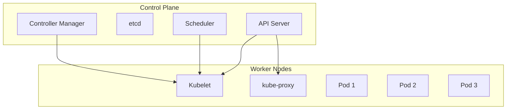

# Kubernetes 기초 실습 가이드

<details>
<summary>📋 목차</summary>

1. [🎯 학습 목표](#-학습-목표)
2. [📚 실습 개요](#-실습-개요)
3. [🔧 실습 환경 준비](#-실습-환경-준비)
4. [☸️ Kubernetes 기본 개념](#️-kubernetes-기본-개념)
5. [🚀 GKE 클러스터 생성 및 관리](#-gke-클러스터-생성-및-관리)
6. [📦 Pod, Service, Deployment 실습](#-pod-service-deployment-실습)
7. [🔐 ConfigMap, Secret, PersistentVolume 관리](#-configmap-secret-persistentvolume-관리)
8. [📚 문제 해결 및 참고 자료](#-문제-해결-및-참고-자료)

</details>

---

## 🎯 학습 목표

<details>
<summary>📖 이번 실습에서 배우게 될 내용</summary>

### 핵심 학습 목표
- **Kubernetes 아키텍처** 이해 및 핵심 개념 습득
- **GKE 클러스터** 생성 및 기본 관리
- **Pod, Service, Deployment** 기본 사용법
- **마이크로서비스 아키텍처** 기초 구성

### 실습 후 달성할 수 있는 능력
- ✅ Kubernetes 클러스터 생성 및 관리
- ✅ Pod, Service, Deployment 기본 사용법
- ✅ ConfigMap, Secret, PersistentVolume 관리
- ✅ 마이크로서비스 아키텍처 기초 구성

### 예상 소요 시간
- **Kubernetes 기초**: 60-90분
- **GKE 클러스터**: 45-60분
- **Pod/Service/Deployment**: 90-120분
- **ConfigMap/Secret/PV**: 60-90분
- **전체 과정**: 4-6시간

</details>

---

## 📚 실습 개요

<details>
<summary>📖 실습 개요</summary>

### 실습 목적
**Cloud Master 과정을 수료한 학습자를 위한 Kubernetes 기초 실습**

### 실습 범위
- Kubernetes 기본 개념 및 아키텍처
- GKE 클러스터 생성 및 관리
- Pod, Service, Deployment 기본 사용법
- ConfigMap, Secret, PersistentVolume 관리

### 실습 환경
- **GCP 계정**: GKE 클러스터 생성용
- **kubectl**: Kubernetes CLI 도구
- **Docker**: 컨테이너 이미지 빌드
- **로컬 환경**: VS Code, 터미널

### 실습 결과물
- GKE 클러스터
- Kubernetes 리소스 (Pod, Service, Deployment)
- ConfigMap, Secret, PersistentVolume
- 마이크로서비스 아키텍처

</details>

---

## 🔧 실습 환경 준비

<details>
<summary>📋 필수 요구사항</summary>

### 필수 계정
- **GCP 계정**: GKE 클러스터 생성용 (Cloud Basic 과정 완료)
- **Docker Hub 계정**: 컨테이너 이미지 저장소
- **GitHub 계정**: 코드 저장소 (선택사항)

### 필수 도구
- **kubectl**: Kubernetes CLI 도구
- **Docker**: 컨테이너 이미지 빌드
- **gcloud CLI**: GCP CLI 도구
- **VS Code**: 코드 편집 (선택사항)

### 도구 설치
```bash
# kubectl 설치
# Windows
winget install Kubernetes.kubectl

# macOS
brew install kubectl

# Ubuntu
curl -LO "https://dl.k8s.io/release/$(curl -L -s https://dl.k8s.io/release/stable.txt)/bin/linux/amd64/kubectl"

# gcloud CLI 설치
# Windows
winget install Google.CloudSDK

# macOS
brew install google-cloud-sdk

# Ubuntu
curl https://sdk.cloud.google.com | bash
```

</details>

<details>
<summary>📋 실습 전 체크리스트</summary>

### 환경 확인
- [ ] GCP 계정이 설정되어 있는가?
- [ ] kubectl이 설치되어 있는가?
- [ ] Docker가 설치되어 있는가?
- [ ] gcloud CLI가 설치되어 있는가?

### 계정 준비
- [ ] GCP 프로젝트가 생성되어 있는가?
- [ ] GKE API가 활성화되어 있는가?
- [ ] Docker Hub 로그인이 완료되었는가?
- [ ] gcloud CLI 인증이 완료되었는가?

</details>

---

## ☸️ Kubernetes 기본 개념

### 1. Kubernetes 아키텍처



### 2. 핵심 리소스

| 리소스 | 설명 | 용도 |
|--------|------|------|
| **Pod** | 최소 실행 단위 | 컨테이너 실행 |
| **Service** | 네트워크 엔드포인트 | 로드 밸런싱 |
| **Deployment** | 배포 관리 | 롤링 업데이트 |
| **ConfigMap** | 설정 데이터 | 환경 변수 |
| **Secret** | 민감한 데이터 | 비밀번호, 키 |
| **PersistentVolume** | 영구 저장소 | 데이터 저장 |

---

## 🏗️ GKE 클러스터 생성

### 1. GKE 클러스터 생성

#### 🌐 웹콘솔 방식
```markdown
1. GCP Console → "Kubernetes Engine" → "클러스터" 클릭
2. "클러스터 만들기" 클릭
3. 클러스터 정보:
   - 이름: "cloud-container-cluster"
   - 위치: "asia-northeast3 (서울)"
   - 노드 풀: "default-pool"
   - 머신 유형: "e2-medium"
   - 노드 수: 3
4. "만들기" 클릭
```

#### 💻 CLI 방식
```bash
# GKE 클러스터 생성
gcloud container clusters create cloud-container-cluster \
  --zone=asia-northeast3-a \
  --num-nodes=3 \
  --machine-type=e2-medium \
  --enable-autoscaling \
  --min-nodes=1 \
  --max-nodes=5

# 클러스터 인증
gcloud container clusters get-credentials cloud-container-cluster \
  --zone=asia-northeast3-a

# 클러스터 확인
kubectl get nodes
```

### 2. 클러스터 연결 확인

```bash
# 클러스터 정보 확인
kubectl cluster-info

# 노드 상태 확인
kubectl get nodes -o wide

# 네임스페이스 확인
kubectl get namespaces
```

---

## 🚀 기본 애플리케이션 배포

### 1. 간단한 Pod 생성

```yaml
# simple-pod.yaml
apiVersion: v1
kind: Pod
metadata:
  name: simple-web-pod
  labels:
    app: simple-web
spec:
  containers:
  - name: web-container
    image: nginx:alpine
    ports:
    - containerPort: 80
    resources:
      requests:
        memory: "64Mi"
        cpu: "250m"
      limits:
        memory: "128Mi"
        cpu: "500m"
```

```bash
# Pod 생성
kubectl apply -f simple-pod.yaml

# Pod 상태 확인
kubectl get pods

# Pod 상세 정보
kubectl describe pod simple-web-pod

# Pod 로그 확인
kubectl logs simple-web-pod
```

### 2. Service 생성

```yaml
# simple-service.yaml
apiVersion: v1
kind: Service
metadata:
  name: simple-web-service
spec:
  selector:
    app: simple-web
  ports:
  - protocol: TCP
    port: 80
    targetPort: 80
  type: LoadBalancer
```

```bash
# Service 생성
kubectl apply -f simple-service.yaml

# Service 상태 확인
kubectl get services

# 외부 IP 확인
kubectl get service simple-web-service
```

### 3. Deployment 생성

```yaml
# simple-deployment.yaml
apiVersion: apps/v1
kind: Deployment
metadata:
  name: simple-web-deployment
  labels:
    app: simple-web
spec:
  replicas: 3
  selector:
    matchLabels:
      app: simple-web
  template:
    metadata:
      labels:
        app: simple-web
    spec:
      containers:
      - name: web-container
        image: nginx:alpine
        ports:
        - containerPort: 80
        resources:
          requests:
            memory: "64Mi"
            cpu: "250m"
          limits:
            memory: "128Mi"
            cpu: "500m"
```

```bash
# Deployment 생성
kubectl apply -f simple-deployment.yaml

# Deployment 상태 확인
kubectl get deployments

# Pod 상태 확인
kubectl get pods -l app=simple-web

# 스케일링
kubectl scale deployment simple-web-deployment --replicas=5
```

---

## 🔧 고급 설정 관리

### 1. ConfigMap 생성 및 사용

```yaml
# configmap.yaml
apiVersion: v1
kind: ConfigMap
metadata:
  name: app-config
data:
  app.properties: |
    server.port=3000
    logging.level=INFO
    database.host=localhost
  nginx.conf: |
    server {
        listen 80;
        location / {
            proxy_pass http://backend;
        }
    }
```

```yaml
# deployment-with-configmap.yaml
apiVersion: apps/v1
kind: Deployment
metadata:
  name: app-with-config
spec:
  replicas: 2
  selector:
    matchLabels:
      app: app-with-config
  template:
    metadata:
      labels:
        app: app-with-config
    spec:
      containers:
      - name: app-container
        image: nginx:alpine
        volumeMounts:
        - name: config-volume
          mountPath: /etc/config
      volumes:
      - name: config-volume
        configMap:
          name: app-config
```

### 2. Secret 생성 및 사용

```bash
# Secret 생성
kubectl create secret generic app-secret \
  --from-literal=username=admin \
  --from-literal=password=secret123

# Secret 확인
kubectl get secrets
kubectl describe secret app-secret
```

```yaml
# deployment-with-secret.yaml
apiVersion: apps/v1
kind: Deployment
metadata:
  name: app-with-secret
spec:
  replicas: 2
  selector:
    matchLabels:
      app: app-with-secret
  template:
    metadata:
      labels:
        app: app-with-secret
    spec:
      containers:
      - name: app-container
        image: nginx:alpine
        env:
        - name: DB_USERNAME
          valueFrom:
            secretKeyRef:
              name: app-secret
              key: username
        - name: DB_PASSWORD
          valueFrom:
            secretKeyRef:
              name: app-secret
              key: password
```

### 3. PersistentVolume 및 PersistentVolumeClaim

```yaml
# pv.yaml
apiVersion: v1
kind: PersistentVolume
metadata:
  name: app-pv
spec:
  capacity:
    storage: 10Gi
  accessModes:
    - ReadWriteOnce
  gcePersistentDisk:
    pdName: app-disk
    fsType: ext4
```

```yaml
# pvc.yaml
apiVersion: v1
kind: PersistentVolumeClaim
metadata:
  name: app-pvc
spec:
  accessModes:
    - ReadWriteOnce
  resources:
    requests:
      storage: 10Gi
```

```yaml
# deployment-with-pvc.yaml
apiVersion: apps/v1
kind: Deployment
metadata:
  name: app-with-storage
spec:
  replicas: 1
  selector:
    matchLabels:
      app: app-with-storage
  template:
    metadata:
      labels:
        app: app-with-storage
    spec:
      containers:
      - name: app-container
        image: nginx:alpine
        volumeMounts:
        - name: storage-volume
          mountPath: /var/www/html
      volumes:
      - name: storage-volume
        persistentVolumeClaim:
          claimName: app-pvc
```

---

## 🌐 Ingress 설정

### 1. Ingress Controller 설치

```bash
# Nginx Ingress Controller 설치
kubectl apply -f https://raw.githubusercontent.com/kubernetes/ingress-nginx/controller-v1.8.1/deploy/static/provider/cloud/deploy.yaml

# Ingress Controller 상태 확인
kubectl get pods -n ingress-nginx
```

### 2. Ingress 리소스 생성

```yaml
# ingress.yaml
apiVersion: networking.k8s.io/v1
kind: Ingress
metadata:
  name: app-ingress
  annotations:
    nginx.ingress.kubernetes.io/rewrite-target: /
spec:
  rules:
  - host: app.example.com
    http:
      paths:
      - path: /
        pathType: Prefix
        backend:
          service:
            name: simple-web-service
            port:
              number: 80
```

```bash
# Ingress 생성
kubectl apply -f ingress.yaml

# Ingress 상태 확인
kubectl get ingress
```

---

## 🧪 실습 테스트

### 1. 애플리케이션 접속 테스트

```bash
# Pod 내부에서 테스트
kubectl exec -it simple-web-pod -- curl localhost

# Service를 통한 접속 테스트
kubectl port-forward service/simple-web-service 8080:80

# 브라우저에서 http://localhost:8080 접속
```

### 2. 로그 및 모니터링

```bash
# Pod 로그 확인
kubectl logs simple-web-pod

# 실시간 로그 확인
kubectl logs -f simple-web-pod

# 이벤트 확인
kubectl get events

# 리소스 사용량 확인
kubectl top pods
kubectl top nodes
```

---

## 🧹 리소스 정리

```bash
# 모든 리소스 삭제
kubectl delete deployment simple-web-deployment
kubectl delete service simple-web-service
kubectl delete pod simple-web-pod
kubectl delete configmap app-config
kubectl delete secret app-secret
kubectl delete pvc app-pvc
kubectl delete pv app-pv
kubectl delete ingress app-ingress

# 클러스터 삭제
gcloud container clusters delete cloud-container-cluster \
  --zone=asia-northeast3-a
```

---

## ✅ 실습 완료 체크리스트

- [ ] GKE 클러스터 생성 및 연결
- [ ] Pod, Service, Deployment 기본 사용법
- [ ] ConfigMap, Secret, PersistentVolume 관리
- [ ] Ingress 설정 및 외부 접속
- [ ] 로그 및 모니터링 기본 사용법
- [ ] 리소스 정리 완료

---

## 🚀 다음 단계

Kubernetes 기초를 완료했다면 다음 고급 주제로 진행하세요:

### 고급 주제
- **Helm**: 패키지 관리자
- **Istio**: 서비스 메시
- **Prometheus**: 모니터링
- **ArgoCD**: GitOps 배포

### 실무 적용
- **마이크로서비스 아키텍처** 구성
- **CI/CD 파이프라인** 구축
- **모니터링 및 로깅** 시스템 구축
- **보안 정책** 적용

---

## 📚 문제 해결 및 참고 자료

<details>
<summary>🐛 자주 발생하는 문제</summary>

### GKE 클러스터 관련 문제
<details>
<summary>❌ 클러스터 생성 실패</summary>

**원인**: 
- GKE API 미활성화
- 권한 부족
- 할당량 초과

**해결방법**:
```bash
# 1. GKE API 활성화
gcloud services enable container.googleapis.com

# 2. 권한 확인
gcloud auth list

# 3. 할당량 확인
gcloud compute project-info describe
```

</details>

<details>
<summary>❌ kubectl 연결 실패</summary>

**원인**:
- 클러스터 인증 정보 누락
- 네트워크 연결 문제
- 클러스터 상태 문제

**해결방법**:
```bash
# 1. 클러스터 인증 정보 가져오기
gcloud container clusters get-credentials cloud-container-cluster \
  --zone=asia-northeast3-a

# 2. 연결 테스트
kubectl cluster-info

# 3. 클러스터 상태 확인
gcloud container clusters describe cloud-container-cluster \
  --zone=asia-northeast3-a
```

</details>

### Pod 관련 문제
<details>
<summary>❌ Pod 시작 실패</summary>

**원인**:
- 이미지 풀 실패
- 리소스 부족
- 설정 오류

**해결방법**:
```bash
# 1. Pod 상태 확인
kubectl get pods

# 2. Pod 상세 정보 확인
kubectl describe pod <pod-name>

# 3. Pod 로그 확인
kubectl logs <pod-name>
```

</details>

<details>
<summary>❌ Service 연결 실패</summary>

**원인**:
- Service 설정 오류
- Pod 라벨 불일치
- 네트워크 정책 문제

**해결방법**:
```bash
# 1. Service 상태 확인
kubectl get services

# 2. Service 상세 정보 확인
kubectl describe service <service-name>

# 3. Endpoints 확인
kubectl get endpoints
```

</details>

### ConfigMap/Secret 관련 문제
<details>
<summary>❌ ConfigMap/Secret 마운트 실패</summary>

**원인**:
- ConfigMap/Secret 존재하지 않음
- 마운트 경로 오류
- 권한 문제

**해결방법**:
```bash
# 1. ConfigMap/Secret 확인
kubectl get configmaps
kubectl get secrets

# 2. 상세 정보 확인
kubectl describe configmap <configmap-name>
kubectl describe secret <secret-name>

# 3. Pod에서 마운트 확인
kubectl exec -it <pod-name> -- ls /etc/config
```

</details>

</details>

<details>
<summary>📖 추가 학습 자료</summary>

### 공식 문서
- [Kubernetes 공식 문서](https://kubernetes.io/docs/)
- [GKE 공식 문서](https://cloud.google.com/kubernetes-engine/docs)
- [Kubernetes 실습 환경](https://kubernetes.io/docs/tutorials/)
- [Kubernetes 대시보드](https://kubernetes.io/docs/tasks/access-application-cluster/web-ui-dashboard/)

### 유용한 리소스
- [Kubernetes Playground](https://www.katacoda.com/courses/kubernetes)
- [Kubernetes Examples](https://github.com/kubernetes/examples)
- [GKE Workshop](https://cloud.google.com/kubernetes-engine/docs/tutorials)
- [Kubernetes Best Practices](https://kubernetes.io/docs/concepts/configuration/overview/)

### 관련 프로젝트
- [Kubernetes 샘플](https://github.com/kubernetes/examples)
- [GKE 샘플](https://github.com/GoogleCloudPlatform/kubernetes-engine-samples)
- [Kubernetes Helm Charts](https://github.com/helm/charts)
- [Istio 샘플](https://github.com/istio/istio)

</details>

<details>
<summary>🚀 다음 단계</summary>

### Cloud Container 과정 계속
1. **고급 Kubernetes**: Helm, Istio, 서비스 메시
2. **ECS/Fargate**: AWS 컨테이너 서비스
3. **고가용성 아키텍처**: Multi-AZ, Auto Scaling
4. **모니터링**: Prometheus, Grafana

### 실무 적용
1. **마이크로서비스 아키텍처**: 서비스 분리 및 통신
2. **CI/CD 파이프라인**: GitOps, ArgoCD
3. **보안**: Network Policy, Pod Security Policy
4. **성능 최적화**: 리소스 관리, 스케일링

</details>

---

## 🎉 실습 완료!

축하합니다! Kubernetes 기초 실습을 완료했습니다.

### 📚 학습 요약

이번 실습을 통해 다음을 배웠습니다:

1. **☸️ Kubernetes**: 클러스터 생성 및 관리
2. **📦 Pod/Service/Deployment**: 기본 리소스 사용법
3. **🔐 ConfigMap/Secret/PV**: 설정 및 저장소 관리
4. **🌐 Ingress**: 외부 접속 설정

### 🚀 다음 단계

- **고급 Kubernetes**: Helm, Istio, 서비스 메시
- **ECS/Fargate**: AWS 컨테이너 서비스
- **고가용성 아키텍처**: Multi-AZ, Auto Scaling

### 💡 추가 학습 아이디어

1. **Helm**: 패키지 관리자
2. **Istio**: 서비스 메시
3. **Prometheus**: 모니터링
4. **ArgoCD**: GitOps 배포

---

**🎯 이제 Kubernetes의 기본기를 갖추었습니다! 고급 컨테이너 오케스트레이션으로 진행하세요.**
