# ☁️ 클라우드 중급 과정 - Day 1 강의 시나리오

## 📋 강의 개요

### 🎯 강의 목표
- **Docker 고급 활용**: 멀티스테이지 빌드, 이미지 최적화 기법을 이해하고 적용
- **Kubernetes 기초**: Pod, Service, Deployment 등 Kubernetes 핵심 리소스를 이해하고 관리
- **클라우드 컨테이너 서비스**: AWS ECS, GCP Cloud Run을 활용하여 클라우드 환경에 컨테이너 애플리케이션 배포
- **통합 모니터링 허브**: AWS VM 기반 Prometheus + Grafana를 구축하여 모니터링 인프라 준비
- **외부 접속 및 보안**: AWS 보안 그룹 자동 설정 및 외부 접속 테스트를 통한 실습 환경 검증

### ⏰ 강의 시간
- **총 강의 시간**: 8시간 (480분)
- **1교시**: Docker 고급 활용 (90분)
- **2교시**: Kubernetes 기초 (120분)
- **3교시**: 클라우드 컨테이너 서비스 (90분)
- **4교시**: 통합 모니터링 허브 (90분)
- **점심 시간**: 60분
- **실습 정리 및 외부 접속 테스트**: 30분

### 👥 대상 수강생
- **선수 학습**: Docker 기초, 컨테이너 개념 이해
- **수강생 수**: 20-30명
- **실습 환경**: 개인별 클라우드 환경 (AWS/GCP)

---

## 🕘 1교시: Docker 고급 활용 (09:00-10:30)

### 📚 강의 내용 (30분)

#### Docker 고급 개념 소개
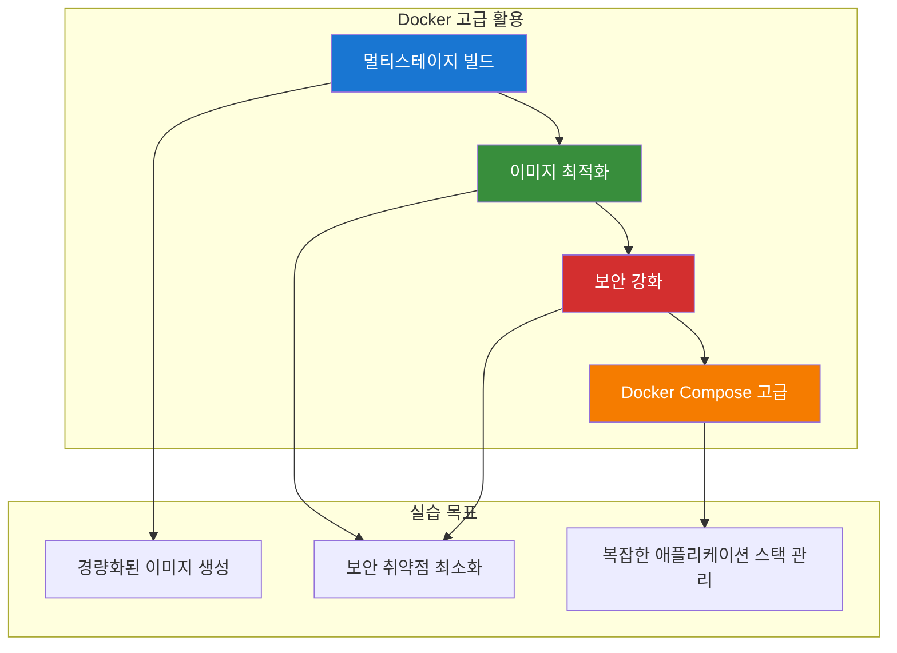

#### 핵심 개념 설명
- **멀티스테이지 빌드**: 빌드 도구와 런타임 환경 분리
- **이미지 최적화**: 레이어 최적화, 불필요한 파일 제거
- **보안 강화**: non-root 사용자, 최소 권한 원칙
- **Docker Compose**: 복잡한 애플리케이션 스택 관리

### 🛠️ 실습 진행 (60분)

#### 실습 1: 멀티스테이지 빌드 (20분)

**변경 전 시스템 아키텍처**:
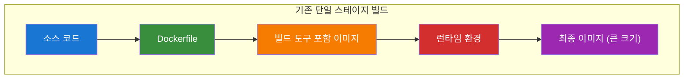

**자동화 도구 실행**:
```bash
# 실습 스크립트 실행
cd /home/ec2-user/mcp-cloud-workspace/mcp_cloud/cloud_intermediate/repo/automation/day1
./day1-practice.sh

# 메뉴 선택: 1. Docker 고급 활용
# 1. 멀티스테이지 빌드 실습

# 자동화 도구: ./tools/cloud/docker-helper.sh --action multistage-build
```

**변경 후 시스템 아키텍처**:
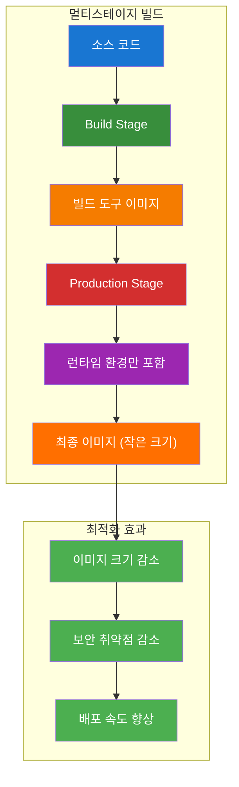

**실습 내용**:
- Node.js 애플리케이션 멀티스테이지 빌드
- 빌드 도구와 런타임 환경 분리
- 이미지 크기 비교 (단일 스테이지 vs 멀티스테이지)

#### 실습 2: 이미지 최적화 (20분)

**변경 전 시스템 아키텍처**:
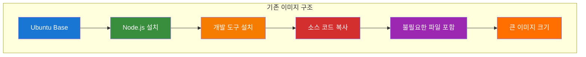

**자동화 도구 실행**:
```bash
# 2. 이미지 최적화 실습

# 자동화 도구: ./tools/cloud/docker-helper.sh --action optimize-image
```

**변경 후 시스템 아키텍처**:
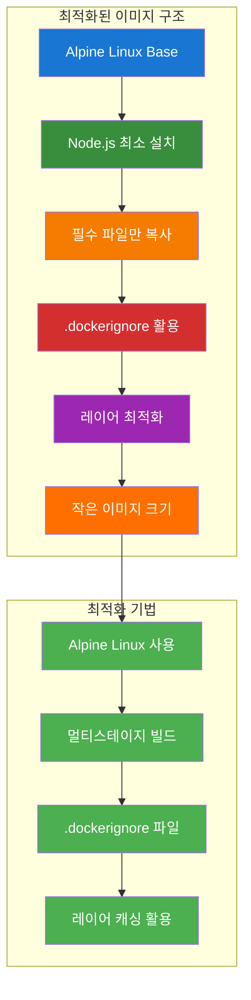

**실습 내용**:
- Alpine Linux 기반 경량 이미지 생성
- 불필요한 패키지 제거
- 레이어 최적화

#### 실습 3: 보안 강화 (20분)

**변경 전 시스템 아키텍처**:
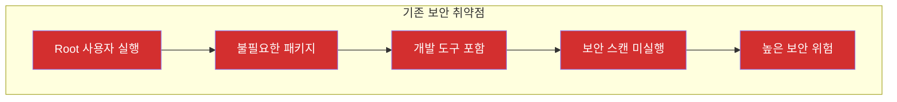

**자동화 도구 실행**:
```bash
# 3. 보안 강화 실습

# 자동화 도구: ./tools/cloud/docker-helper.sh --action security-scan
```

**변경 후 시스템 아키텍처**:
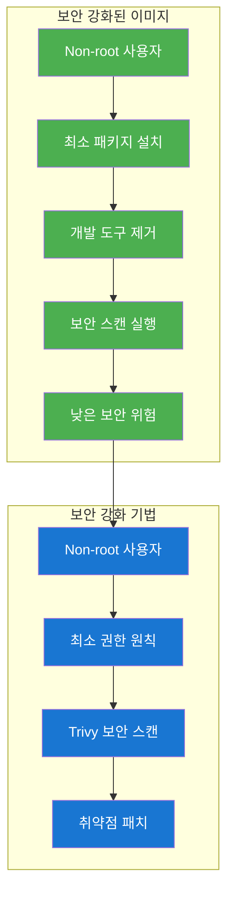

**실습 내용**:
- non-root 사용자 설정
- 최소 권한 원칙 적용
- 보안 스캔 도구 활용

### 📊 실습 결과 확인
- [ ] 멀티스테이지 빌드 성공
- [ ] 이미지 크기 최적화 확인
- [ ] 보안 취약점 최소화
- [ ] Docker Compose 스택 관리

---

## 🕘 2교시: Kubernetes 기초 (10:45-12:45)

### 📚 강의 내용 (30분)

#### Kubernetes 핵심 개념 소개
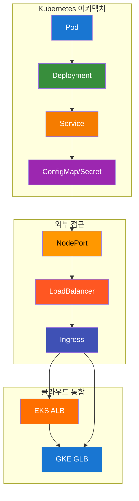

#### 핵심 개념 설명
- **Pod**: Kubernetes의 최소 배포 단위
- **Deployment**: Pod의 선언적 관리
- **Service**: Pod 그룹에 대한 네트워크 접근
- **ConfigMap/Secret**: 설정 및 보안 정보 관리
- **LoadBalancer**: 외부 접근을 위한 로드 밸런서

### 🛠️ 실습 진행 (90분)

#### 실습 1: 클러스터 Context 구성 (15분)

**변경 전 시스템 아키텍처**:
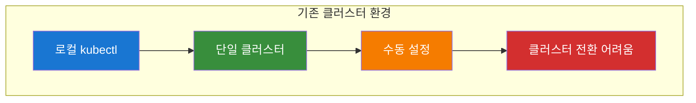

**자동화 도구 실행**:
```bash
# 실습 스크립트 실행
./day1-practice.sh

# 메뉴 선택: 2. Kubernetes 기초 실습
# 1. K8s 클러스터 컨텍스트 구성 및 체크
# 2. 클러스터 전환 (EKS ↔ GKE)

# 자동화 도구: ./tools/cloud/k8s-helper.sh --action setup-context
```

**변경 후 시스템 아키텍처**:
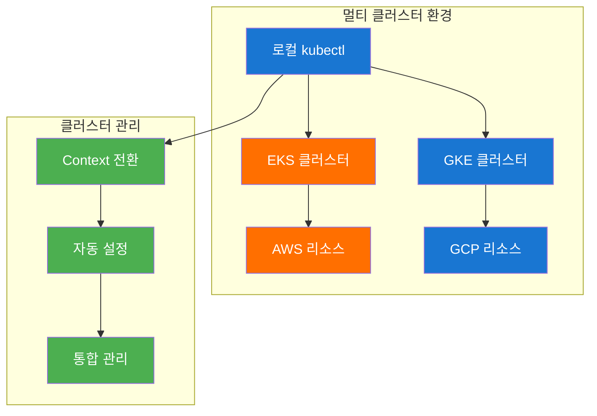

**실습 내용**:
- AWS EKS 클러스터 연결
- GCP GKE 클러스터 연결
- 클러스터 간 전환

#### 실습 2: Workload 배포 (30분)

**변경 전 시스템 아키텍처**:
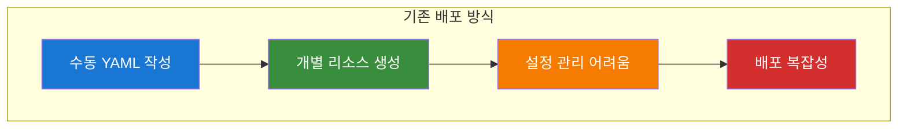

**자동화 도구 실행**:
```bash
# 3. Pod 생성 및 관리
# 4. Deployment 생성 및 관리
# 5. Service 생성 및 관리
# 6. ConfigMap 및 Secret 관리
# 7. 전체 K8s 리소스 배포

# 자동화 도구: ./tools/cloud/k8s-helper.sh --action deploy-workload
```

**변경 후 시스템 아키텍처**:
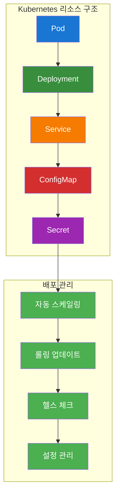

**실습 내용**:
- Pod, Deployment, Service 생성
- ConfigMap과 Secret을 활용한 설정 관리
- 리소스 상태 모니터링

#### 실습 3: 외부 접근 구성 (30분)

**변경 전 시스템 아키텍처**:
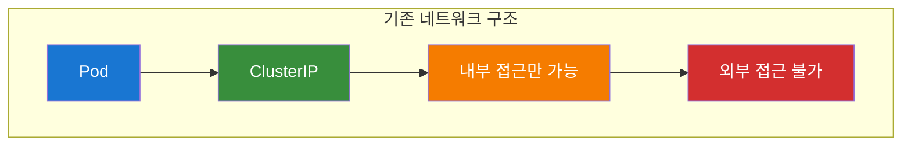

**자동화 도구 실행**:
```bash
# 8. LoadBalancer 서비스 배포 (EKS ALB / GKE GLB)
# 9. NodePort 서비스 배포
# 10. Ingress 설정
# 11. 포트 포워딩 테스트

# 자동화 도구: ./tools/cloud/k8s-helper.sh --action setup-external-access
```

**변경 후 시스템 아키텍처**:
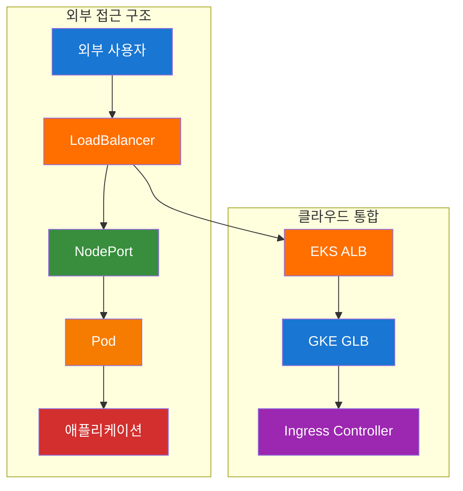

**실습 내용**:
- NodePort를 통한 외부 접근
- EKS ALB LoadBalancer 배포
- GKE GLB LoadBalancer 배포
- Ingress를 통한 고급 라우팅

#### 실습 4: 문제 해결 (15분)

**변경 전 시스템 아키텍처**:
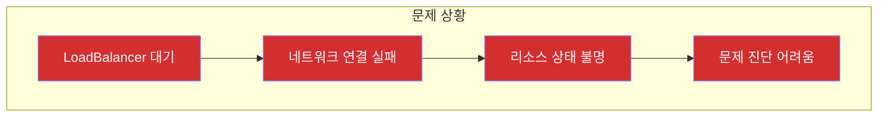

**자동화 도구 실행**:
```bash
# 12. 리소스 상태 확인

# 자동화 도구: ./tools/cloud/k8s-helper.sh --action troubleshoot
```

**변경 후 시스템 아키텍처**:
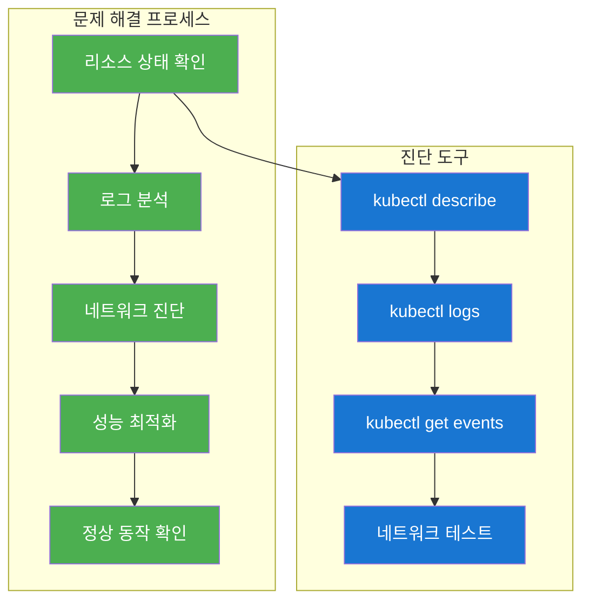

**실습 내용**:
- LoadBalancer 문제 진단
- 네트워크 연결 테스트
- 성능 최적화

### 📊 실습 결과 확인
- [ ] Kubernetes 클러스터 Context 구성 완료
- [ ] Pod, Deployment, Service 배포 성공
- [ ] ConfigMap과 Secret 설정 완료
- [ ] LoadBalancer 외부 접근 구성 완료
- [ ] 문제 해결 및 최적화 완료

---

## 🕘 점심 시간 (12:45-13:45)

### 🍽️ 점심 및 휴식
- **시간**: 60분
- **활동**: 점심 식사, 개인 휴식
- **준비사항**: 실습 환경 유지

---

## 🕘 3교시: 클라우드 컨테이너 서비스 (13:45-15:15)

### 📚 강의 내용 (30분)

#### 클라우드 컨테이너 서비스 소개
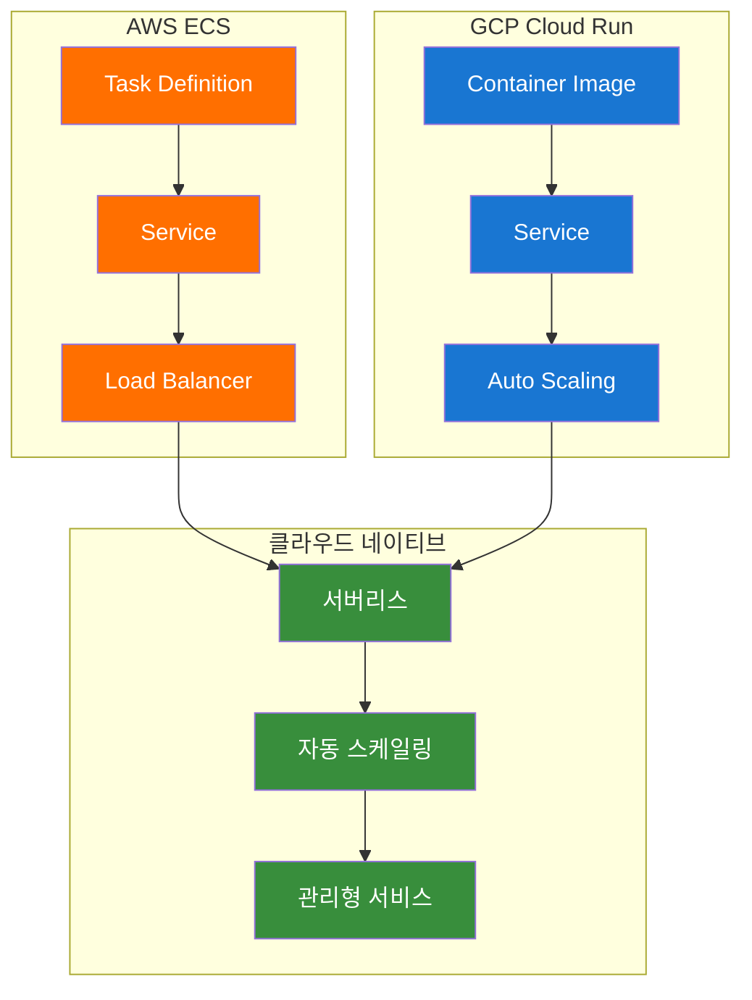

#### 핵심 개념 설명
- **AWS ECS**: 컨테이너 오케스트레이션 서비스
- **GCP Cloud Run**: 서버리스 컨테이너 플랫폼
- **클라우드 네이티브**: 클라우드 환경에 최적화된 배포 전략

### 🛠️ 실습 진행 (60분)

#### 실습 1: AWS ECS 배포 (30분)

**변경 전 시스템 아키텍처**:
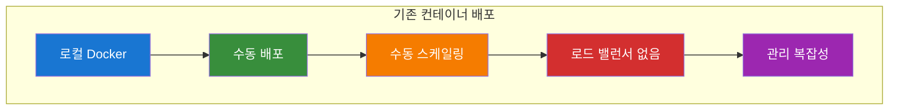

**자동화 도구 실행**:
```bash
# 실습 스크립트 실행
./day1-practice.sh

# 메뉴 선택: 3. 클라우드 컨테이너 서비스
# 1. AWS ECS 태스크 정의 및 서비스 생성

# 자동화 도구: ./tools/cloud/aws-ecs-helper.sh --action cluster-create
```

**변경 후 시스템 아키텍처**:
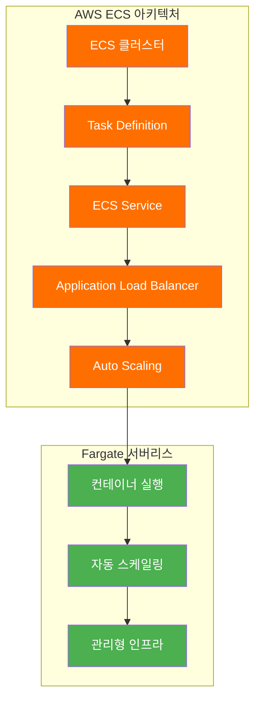

**실습 내용**:
- ECS 태스크 정의 생성
- ECS 서비스 생성
- Application Load Balancer 연결
- 자동 스케일링 설정

#### 실습 2: GCP Cloud Run 배포 (30분)

**변경 전 시스템 아키텍처**:
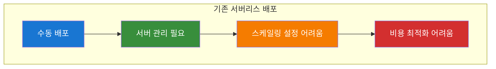

**자동화 도구 실행**:
```bash
# 2. GCP Cloud Run 서비스 배포

# 자동화 도구: ./tools/cloud/gcp-cloudrun-helper.sh --action deploy-service
```

**변경 후 시스템 아키텍처**:
```mermaid
flowchart TD
    subgraph "GCP Cloud Run 아키텍처"
        A["Container Image"] --> B["Cloud Run Service"]
        B --> C["Auto Scaling"]
        C --> D["Traffic Management"]
        D --> E["Security Settings"]
    end
    
    subgraph "서버리스 이점"
        F["Zero Server Management"] --> G["Pay per Use"]
        G --> H["Automatic Scaling"]
        H --> I["Global Distribution"]
    end
    
    E --> F
    
    style A fill:#1976d2,color:#ffffff
    style B fill:#1976d2,color:#ffffff
    style C fill:#1976d2,color:#ffffff
    style D fill:#1976d2,color:#ffffff
    style E fill:#1976d2,color:#ffffff
    style F fill:#4caf50,color:#ffffff
    style G fill:#4caf50,color:#ffffff
    style H fill:#4caf50,color:#ffffff
    style I fill:#4caf50,color:#ffffff
```

**실습 내용**:
- Cloud Run 서비스 배포
- 자동 스케일링 설정
- 트래픽 관리
- 보안 설정

### 📊 실습 결과 확인
- [ ] AWS ECS 컨테이너 서비스 배포 완료
- [ ] GCP Cloud Run 서버리스 배포 완료
- [ ] 자동 스케일링 설정 완료
- [ ] 로드 밸런서 연결 완료

---

## 🕘 4교시: 통합 모니터링 허브 (15:30-17:00)

### 📚 강의 내용 (30분)

#### 모니터링 시스템 소개
```mermaid
flowchart TD
    subgraph "모니터링 스택"
        A["Prometheus"] --> B["Grafana"]
        C["Node Exporter"] --> A
        D["Push Gateway"] --> A
    end
    
    subgraph "알림 시스템"
        E["AlertManager"] --> F["Slack/Email"]
    end
    
    subgraph "데이터 수집"
        G["메트릭 수집"] --> H["데이터 저장"]
        H --> I["시각화"]
    end
    
    A --> E
    B --> I
    C --> G
    D --> G
    
    style A fill:#d32f2f,color:#ffffff
    style B fill:#1976d2,color:#ffffff
    style C fill:#388e3c,color:#ffffff
    style D fill:#f57c00,color:#ffffff
    style E fill:#9c27b0,color:#ffffff
    style F fill:#ff9800,color:#000000
```

#### 핵심 개념 설명
- **Prometheus**: 메트릭 수집 및 저장
- **Grafana**: 데이터 시각화 및 대시보드
- **Node Exporter**: 시스템 메트릭 수집
- **AlertManager**: 알림 관리

### 🛠️ 실습 진행 (60분)

#### 실습 1: Prometheus 설치 (20분)

**변경 전 시스템 아키텍처**:
```mermaid
flowchart TD
    subgraph "기존 모니터링 환경"
        A["애플리케이션"] --> B["로그 파일"]
        B --> C["수동 모니터링"]
        C --> D["알림 없음"]
        D --> E["문제 발견 지연"]
    end
    
    style A fill:#1976d2,color:#ffffff
    style B fill:#388e3c,color:#ffffff
    style C fill:#f57c00,color:#ffffff
    style D fill:#d32f2f,color:#ffffff
    style E fill:#9c27b0,color:#ffffff
```

**자동화 도구 실행**:
```bash
# 실습 스크립트 실행
./day1-practice.sh

# 메뉴 선택: 4. 통합 모니터링 허브
# 1. Prometheus 설치 및 설정

# 자동화 도구: ./tools/cloud/monitoring-helper.sh --action install-prometheus
```

**변경 후 시스템 아키텍처**:
```mermaid
flowchart TD
    subgraph "Prometheus 모니터링 스택"
        A["애플리케이션"] --> B["메트릭 수집"]
        B --> C["Prometheus Server"]
        C --> D["메트릭 저장"]
        D --> E["쿼리 엔진"]
    end
    
    subgraph "모니터링 기능"
        F["실시간 메트릭"] --> G["알림 규칙"]
        G --> H["자동 알림"]
        H --> I["문제 조기 발견"]
    end
    
    E --> F
    
    style A fill:#1976d2,color:#ffffff
    style B fill:#388e3c,color:#ffffff
    style C fill:#d32f2f,color:#ffffff
    style D fill:#d32f2f,color:#ffffff
    style E fill:#d32f2f,color:#ffffff
    style F fill:#4caf50,color:#ffffff
    style G fill:#4caf50,color:#ffffff
    style H fill:#4caf50,color:#ffffff
    style I fill:#4caf50,color:#ffffff
```

**실습 내용**:
- Prometheus 서버 설치
- 설정 파일 구성
- 서비스 시작 및 확인

#### 실습 2: Grafana 설치 (20분)

**변경 전 시스템 아키텍처**:
```mermaid
flowchart TD
    subgraph "기존 데이터 시각화"
        A["Prometheus 데이터"] --> B["텍스트 기반 확인"]
        B --> C["수동 분석"]
        C --> D["시각화 부족"]
    end
    
    style A fill:#1976d2,color:#ffffff
    style B fill:#388e3c,color:#ffffff
    style C fill:#f57c00,color:#ffffff
    style D fill:#d32f2f,color:#ffffff
```

**자동화 도구 실행**:
```bash
# 2. Grafana 설치 및 설정

# 자동화 도구: ./tools/cloud/monitoring-helper.sh --action install-grafana
```

**변경 후 시스템 아키텍처**:
```mermaid
flowchart TD
    subgraph "Grafana 시각화 스택"
        A["Prometheus"] --> B["Grafana Server"]
        B --> C["대시보드"]
        C --> D["차트 및 그래프"]
        D --> E["실시간 모니터링"]
    end
    
    subgraph "시각화 기능"
        F["대시보드 템플릿"] --> G["알림 설정"]
        G --> H["사용자 권한 관리"]
        H --> I["데이터 소스 통합"]
    end
    
    E --> F
    
    style A fill:#d32f2f,color:#ffffff
    style B fill:#1976d2,color:#ffffff
    style C fill:#1976d2,color:#ffffff
    style D fill:#1976d2,color:#ffffff
    style E fill:#1976d2,color:#ffffff
    style F fill:#4caf50,color:#ffffff
    style G fill:#4caf50,color:#ffffff
    style H fill:#4caf50,color:#ffffff
    style I fill:#4caf50,color:#ffffff
```

**실습 내용**:
- Grafana 서버 설치
- Prometheus 데이터 소스 연결
- 기본 대시보드 생성

#### 실습 3: Node Exporter 설정 (20분)

**변경 전 시스템 아키텍처**:
```mermaid
flowchart TD
    subgraph "기존 시스템 모니터링"
        A["시스템 리소스"] --> B["수동 확인"]
        B --> C["로그 기반 모니터링"]
        C --> D["통합 모니터링 부족"]
    end
    
    style A fill:#1976d2,color:#ffffff
    style B fill:#388e3c,color:#ffffff
    style C fill:#f57c00,color:#ffffff
    style D fill:#d32f2f,color:#ffffff
```

**자동화 도구 실행**:
```bash
# 3. Node Exporter 및 Push Gateway 설정

# 자동화 도구: ./tools/cloud/monitoring-helper.sh --action install-node-exporter
```

**변경 후 시스템 아키텍처**:
```mermaid
flowchart TD
    subgraph "통합 모니터링 시스템"
        A["Node Exporter"] --> B["시스템 메트릭"]
        B --> C["Prometheus"]
        C --> D["Grafana"]
        D --> E["통합 대시보드"]
    end
    
    subgraph "모니터링 범위"
        F["CPU/메모리"] --> G["디스크/네트워크"]
        G --> H["애플리케이션 메트릭"]
        H --> I["인프라 메트릭"]
    end
    
    E --> F
    
    style A fill:#388e3c,color:#ffffff
    style B fill:#388e3c,color:#ffffff
    style C fill:#d32f2f,color:#ffffff
    style D fill:#1976d2,color:#ffffff
    style E fill:#1976d2,color:#ffffff
    style F fill:#4caf50,color:#ffffff
    style G fill:#4caf50,color:#ffffff
    style H fill:#4caf50,color:#ffffff
    style I fill:#4caf50,color:#ffffff
```

**실습 내용**:
- Node Exporter 설치
- Push Gateway 설정
- 메트릭 수집 확인

### 📊 실습 결과 확인
- [ ] Prometheus 서버 정상 작동
- [ ] Grafana 대시보드 접근 가능
- [ ] Node Exporter 메트릭 수집 확인
- [ ] AlertManager 알림 설정 완료

---

## 🕘 실습 정리 (17:00-17:30)

### 🧹 실습 정리 (30분)

#### 자동 정리 실행
```bash
# Day1 실습 자동 정리
./day1-practice.sh

# 메뉴에서 "정리" 옵션 선택
```

#### 정리 내용
- [ ] Docker 이미지 정리
- [ ] Kubernetes 리소스 정리
- [ ] 클라우드 리소스 정리
- [ ] 모니터링 스택 정리

#### 외부 접속 테스트 및 검증
- [ ] AWS 보안 그룹 자동 설정 확인
- [ ] 외부 IP 주소 확인 및 접속 URL 생성
- [ ] AWS ECS 앱 외부 접속 테스트 (포트 3000)
- [ ] GCP Cloud Run 앱 외부 접속 테스트 (포트 8080)
- [ ] Prometheus 외부 접속 테스트 (포트 9090)
- [ ] Grafana 외부 접속 테스트 (포트 3000)
- [ ] AlertManager 외부 접속 테스트 (포트 9093)
- [ ] Node Exporter 외부 접속 테스트 (포트 9100)
- [ ] 외부 접속 URL 정보 출력 및 공유

### 📊 학습 성과 확인

#### 실습 완료 체크리스트
- [ ] Docker 멀티스테이지 빌드 실습 완료
- [ ] Kubernetes 기본 리소스 생성 및 관리 완료
- [ ] AWS ECS 컨테이너 서비스 배포 완료
- [ ] GCP Cloud Run 서버리스 배포 완료
- [ ] Prometheus + Grafana 모니터링 시스템 구축 완료
- [ ] AWS 보안 그룹 자동 설정 완료
- [ ] 외부 접속 테스트 및 검증 완료
- [ ] 실습 결과 외부 공유 가능

#### 다음 단계 안내
- **Day 2 실습**으로 진행: CI/CD 및 고급 클라우드 배포
- **통합 강의 시나리오** 확인
- **통합 모니터링 시나리오** 확인

---

## 📋 강의 진행 체크리스트

### ✅ 강의 준비
- [ ] 실습 환경 설정 완료
- [ ] 강의 자료 준비 완료
- [ ] 실습 스크립트 테스트 완료
- [ ] 클라우드 리소스 준비 완료

### ✅ 강의 진행
- [ ] 1교시: Docker 고급 활용 (90분)
- [ ] 2교시: Kubernetes 기초 (120분)
- [ ] 점심 시간 (60분)
- [ ] 3교시: 클라우드 컨테이너 서비스 (90분)
- [ ] 4교시: 통합 모니터링 허브 (90분)
- [ ] 실습 정리 (30분)

### ✅ 강의 마무리
- [ ] 학습 성과 확인
- [ ] 다음 단계 안내
- [ ] 질문 및 답변
- [ ] 피드백 수집

---

## 🎯 강의 성공 지표

### 📊 정량적 지표
- **실습 완료율**: 95% 이상
- **환경 설정 성공률**: 90% 이상
- **LoadBalancer 접근 성공률**: 85% 이상
- **모니터링 시스템 구축 성공률**: 90% 이상

### 📊 정성적 지표
- **수강생 만족도**: 4.5/5.0 이상
- **실습 이해도**: 90% 이상
- **문제 해결 능력**: 향상 확인
- **다음 단계 준비도**: 85% 이상

---

## 🔗 관련 문서

- [Day 1 강의안](../Day1_강의안.md)
- [학습 경로](../learning-path.md)
- [과정 개요](../README.md)
- [통합 강의 시나리오](../통합강의시나리오.md)
- [통합 모니터링 시나리오](../통합모니터링시나리오.md)

---

**💡 강의 진행 중 문제가 발생하면 실시간으로 지원해드리겠습니다!**  
**수강생의 학습 성과를 최대화하기 위해 지속적으로 모니터링하겠습니다.**

