# ☁️ 클라우드 중급 과정 - Day 1: 컨테이너 기초 및 클라우드 컨테이너 서비스

## 🎯 학습 목표

### 핵심 학습 목표
- **Docker 고급 활용** 멀티스테이지 빌드, 이미지 최적화 기법을 이해하고 적용합니다.
- **Kubernetes 기초** Pod, Service, Deployment 등 Kubernetes 핵심 리소스를 이해하고 관리합니다.
- **AWS ECS 기초** 클러스터 생성, 태스크 정의, 서비스 배포를 통해 컨테이너 애플리케이션을 배포합니다.
- **통합 모니터링 허브** AWS VM 기반 Prometheus + Grafana를 구축하여 모니터링 인프라를 준비합니다.

### 실습 후 달성할 수 있는 능력
- ✅ Docker 멀티스테이지 빌드를 활용한 경량화된 이미지 생성
- ✅ Kubernetes 기본 리소스(Pod, Service, Deployment) 배포 및 관리
- ✅ AWS ECS를 활용한 컨테이너 애플리케이션 배포
- ✅ Prometheus + Grafana 기반 모니터링 시스템 구축

### 예상 소요 시간
- **Docker 고급 활용**: 90-120분
- **Kubernetes 기초**: 90-120분
- **AWS ECS 기초**: 60-90분
- **통합 모니터링 허브**: 60-90분
- **전체 과정**: 5-7시간

---

## 🛠️ 실습 학습

### 📁 실습 코드 및 자동화 (새로운 repo 구조)
- **실습 샘플 코드**: `/cloud_intermediate/repo/examples/day1/`
- **자동화 스크립트**: `/cloud_intermediate/repo/automation/day1/`
- **클라우드 도구**: `/cloud_intermediate/repo/tools/cloud/`

<details>
<summary>🚀 실습 환경 준비</summary>

#### 필수 도구
- **Docker**: 컨테이너 런타임 환경
- **kubectl**: Kubernetes 클러스터 관리 도구
- **AWS CLI**: AWS 서비스 관리 도구
- **WSL**: Windows Subsystem for Linux (Windows 사용자)

#### 환경 설정
```bash
# Docker 설치 확인
docker --version

# kubectl 설치 확인
kubectl version --client

# AWS CLI 설정 확인
aws configure list
```

</details>

<details>
<summary>🔧 1교시: Docker 고급 활용</summary>

#### 멀티스테이지 빌드 실습

**변경 전 시스템 아키텍처**:


**자동화 도구 실행**:
```bash
# 자동화 도구: ./tools/cloud/docker-helper.sh --action multistage-build
```

**변경 후 시스템 아키텍처**:
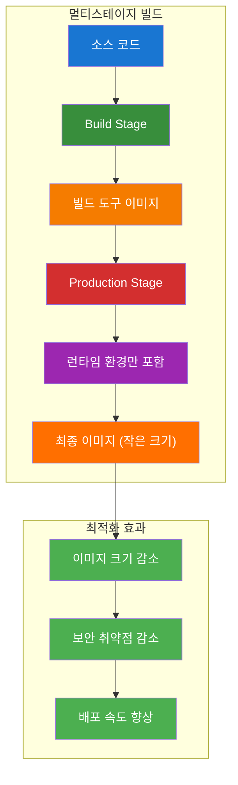

**실습 명령어**:
```bash
# 멀티스테이지 빌드 Dockerfile 생성
cat > Dockerfile.multistage << 'EOF'
# Build stage
FROM node:18-alpine AS builder
WORKDIR /app
COPY package*.json ./
RUN npm ci --only=production

# Production stage
FROM node:18-alpine AS production
WORKDIR /app
COPY --from=builder /app/node_modules ./node_modules
COPY . .
EXPOSE 3000
CMD ["node", "server.js"]
EOF

# 멀티스테이지 빌드 실행
docker build -f Dockerfile.multistage -t myapp:multistage .

# 이미지 크기 비교
docker images | grep myapp
```

#### 이미지 최적화 실습

**변경 전 시스템 아키텍처**:
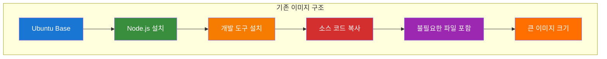

**자동화 도구 실행**:
```bash
# 자동화 도구: ./tools/cloud/docker-helper.sh --action optimize-image
```

**변경 후 시스템 아키텍처**:
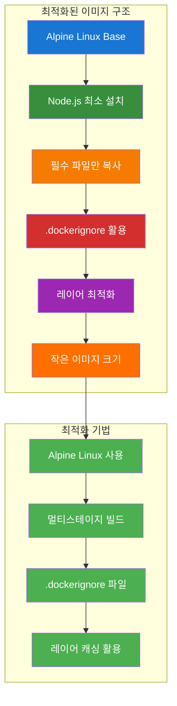

**실습 명령어**:
```bash
# .dockerignore 파일 생성
cat > .dockerignore << 'EOF'
node_modules
npm-debug.log
.git
.gitignore
README.md
.env
.nyc_output
coverage
.nyc_output
.coverage
EOF

# 최적화된 이미지 빌드
docker build -t myapp:optimized .

# 이미지 레이어 분석
docker history myapp:optimized
```

</details>

<details>
<summary>🔧 2교시: Kubernetes 기초</summary>

#### Pod 생성 및 관리

**변경 전 시스템 아키텍처**:
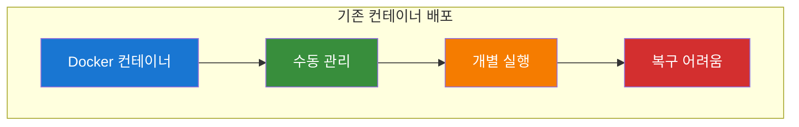

**자동화 도구 실행**:
```bash
# 자동화 도구: ./tools/cloud/k8s-helper.sh --action create-pod
```

**변경 후 시스템 아키텍처**:
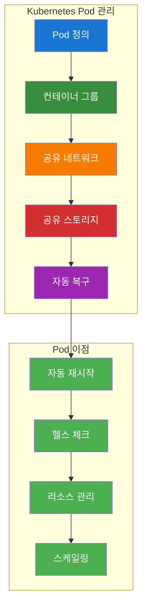

**실습 명령어**:
```bash
# Pod 매니페스트 생성
cat > pod-example.yaml << 'EOF'
apiVersion: v1
kind: Pod
metadata:
  name: nginx-pod
      labels:
        app: nginx
    spec:
      containers:
      - name: nginx
        image: nginx:1.21
        ports:
        - containerPort: 80
EOF

# Pod 생성
kubectl apply -f pod-example.yaml

# Pod 상태 확인
kubectl get pods
kubectl describe pod nginx-pod
```

#### Service 생성

**변경 전 시스템 아키텍처**:


**자동화 도구 실행**:
```bash
# 자동화 도구: ./tools/cloud/k8s-helper.sh --action create-service
```

**변경 후 시스템 아키텍처**:
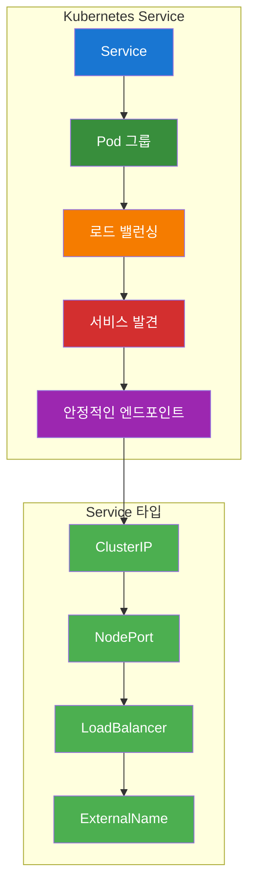

**실습 명령어**:
```bash
# Service 매니페스트 생성
cat > service-example.yaml << 'EOF'
apiVersion: v1
kind: Service
metadata:
  name: nginx-service
spec:
  selector:
    app: nginx
  ports:
  - port: 80
      targetPort: 80
  type: LoadBalancer
EOF

# Service 생성
kubectl apply -f service-example.yaml

# Service 상태 확인
kubectl get services
```

#### Deployment 생성

**변경 전 시스템 아키텍처**:


**자동화 도구 실행**:
```bash
# 자동화 도구: ./tools/cloud/k8s-helper.sh --action create-deployment
```

**변경 후 시스템 아키텍처**:
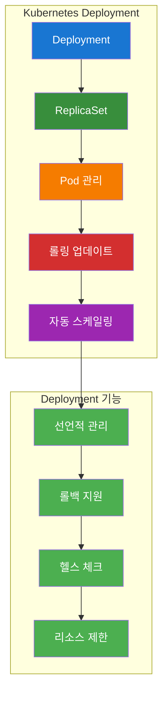

**실습 명령어**:
```bash
# Deployment 매니페스트 생성
cat > deployment-example.yaml << 'EOF'
apiVersion: apps/v1
kind: Deployment
metadata:
  name: nginx-deployment
spec:
  replicas: 3
  selector:
    matchLabels:
      app: nginx
  template:
    metadata:
      labels:
        app: nginx
    spec:
      containers:
      - name: nginx
        image: nginx:1.21
        ports:
        - containerPort: 80
EOF

# Deployment 생성
kubectl apply -f deployment-example.yaml

# Deployment 상태 확인
kubectl get deployments
kubectl get pods -l app=nginx
```

</details>

<details>
<summary>🔧 3교시: AWS ECS 기초</summary>

#### ECS 클러스터 생성

**변경 전 시스템 아키텍처**:


**자동화 도구 실행**:
```bash
# 자동화 도구: ./tools/cloud/aws-ecs-helper.sh --action cluster-create
```

**변경 후 시스템 아키텍처**:
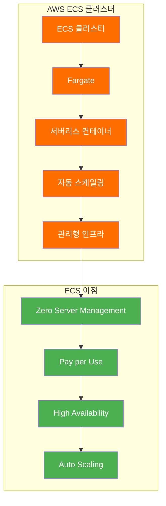

**실습 명령어**:
```bash
# ECS 클러스터 생성
aws ecs create-cluster \
    --cluster-name my-cluster \
    --capacity-providers FARGATE \
  --default-capacity-provider-strategy capacityProvider=FARGATE,weight=1

# 클러스터 상태 확인
aws ecs describe-clusters --clusters my-cluster
```

#### 태스크 정의 생성

**변경 전 시스템 아키텍처**:
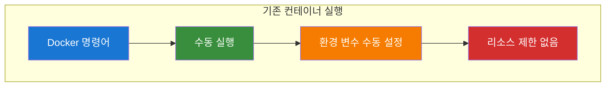

**자동화 도구 실행**:
```bash
# 자동화 도구: ./tools/cloud/aws-ecs-helper.sh --action task-definition-create
```

**변경 후 시스템 아키텍처**:
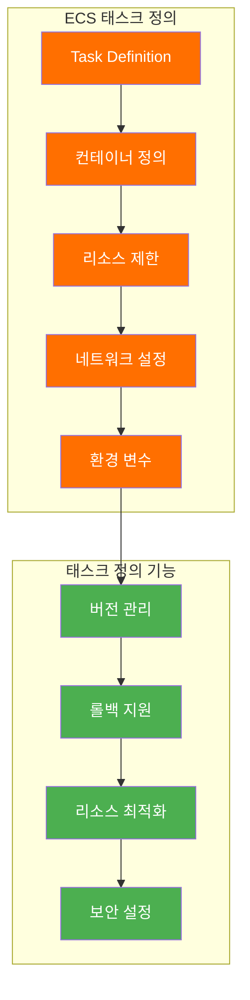

**실습 명령어**:
```bash
# 태스크 정의 JSON 생성
cat > task-definition.json << 'EOF'
{
  "family": "my-app",
  "networkMode": "awsvpc",
  "requiresCompatibilities": ["FARGATE"],
  "cpu": "256",
  "memory": "512",
  "executionRoleArn": "arn:aws:iam::ACCOUNT:role/ecsTaskExecutionRole",
  "containerDefinitions": [
    {
      "name": "my-app",
      "image": "nginx:1.21",
      "portMappings": [
        {
          "containerPort": 80,
          "protocol": "tcp"
        }
      ],
      "essential": true
    }
  ]
}
EOF

# 태스크 정의 등록
aws ecs register-task-definition --cli-input-json file://task-definition.json
```

#### ECS 서비스 배포

**변경 전 시스템 아키텍처**:


**자동화 도구 실행**:
```bash
# 자동화 도구: ./tools/cloud/aws-ecs-helper.sh --action service-create
```

**변경 후 시스템 아키텍처**:
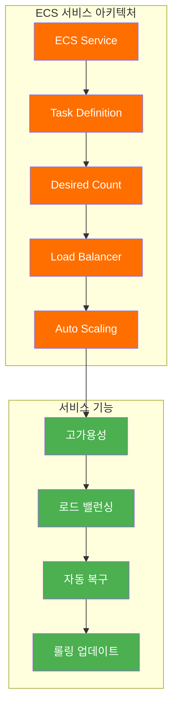

**실습 명령어**:
```bash
# ECS 서비스 생성
aws ecs create-service \
    --cluster my-cluster \
    --service-name my-service \
    --task-definition my-app:1 \
    --desired-count 1 \
  --launch-type FARGATE \
    --network-configuration "awsvpcConfiguration={subnets=[subnet-12345],securityGroups=[sg-12345],assignPublicIp=ENABLED}"

# 서비스 상태 확인
aws ecs describe-services --cluster my-cluster --services my-service
```

</details>

<details>
<summary>🔧 4교시: 통합 모니터링 허브 구축</summary>

#### AWS EC2 인스턴스 생성

**변경 전 시스템 아키텍처**:


**자동화 도구 실행**:
```bash
# 자동화 도구: ./tools/cloud/aws-ec2-helper.sh --action create-monitoring-instance
```

**변경 후 시스템 아키텍처**:
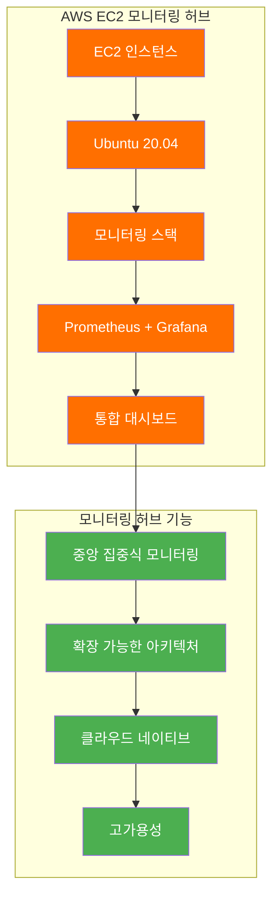

**실습 명령어**:
```bash
# EC2 인스턴스 생성 (Ubuntu 20.04)
aws ec2 run-instances \
    --image-id ami-0c02fb55956c7d316 \
    --instance-type t3.medium \
    --key-name my-key \
    --security-group-ids sg-12345 \
    --subnet-id subnet-12345 \
    --tag-specifications 'ResourceType=instance,Tags=[{Key=Name,Value=monitoring-hub}]'

# 인스턴스 상태 확인
aws ec2 describe-instances --filters "Name=tag:Name,Values=monitoring-hub"
```

#### Prometheus 설치 및 설정

**변경 전 시스템 아키텍처**:


**자동화 도구 실행**:
```bash
# 자동화 도구: ./tools/cloud/monitoring-helper.sh --action install-prometheus
```

**변경 후 시스템 아키텍처**:
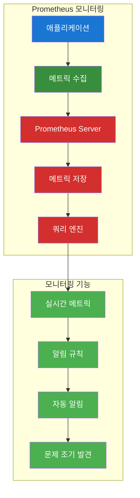

**실습 명령어**:
```bash
# Prometheus 설치
wget https://github.com/prometheus/prometheus/releases/download/v2.40.0/prometheus-2.40.0.linux-amd64.tar.gz
tar xzf prometheus-2.40.0.linux-amd64.tar.gz
sudo mv prometheus-2.40.0.linux-amd64 /opt/prometheus

# Prometheus 설정 파일 생성
cat > /opt/prometheus/prometheus.yml << 'EOF'
global:
  scrape_interval: 15s

scrape_configs:
  - job_name: 'prometheus'
    static_configs:
      - targets: ['localhost:9090']

  - job_name: 'node-exporter'
    static_configs:
      - targets: ['localhost:9100']
EOF

# Prometheus 서비스 시작
sudo systemctl start prometheus
sudo systemctl enable prometheus
```

#### Grafana 설치 및 설정

**변경 전 시스템 아키텍처**:
```mermaid
flowchart TD
    subgraph "기존 데이터 시각화"
        A["Prometheus 데이터"] --> B["텍스트 기반 확인"]
        B --> C["수동 분석"]
        C --> D["시각화 부족"]
    end
    
    style A fill:#1976d2,color:#ffffff
    style B fill:#388e3c,color:#ffffff
    style C fill:#f57c00,color:#ffffff
    style D fill:#d32f2f,color:#ffffff
```

**자동화 도구 실행**:
```bash
# 자동화 도구: ./tools/cloud/monitoring-helper.sh --action install-grafana
```

**변경 후 시스템 아키텍처**:
```mermaid
flowchart TD
    subgraph "Grafana 시각화"
        A["Prometheus"] --> B["Grafana Server"]
        B --> C["대시보드"]
        C --> D["차트 및 그래프"]
        D --> E["실시간 모니터링"]
    end
    
    subgraph "시각화 기능"
        F["대시보드 템플릿"] --> G["알림 설정"]
        G --> H["사용자 권한 관리"]
        H --> I["데이터 소스 통합"]
    end
    
    E --> F
    
    style A fill:#d32f2f,color:#ffffff
    style B fill:#1976d2,color:#ffffff
    style C fill:#1976d2,color:#ffffff
    style D fill:#1976d2,color:#ffffff
    style E fill:#1976d2,color:#ffffff
    style F fill:#4caf50,color:#ffffff
    style G fill:#4caf50,color:#ffffff
    style H fill:#4caf50,color:#ffffff
    style I fill:#4caf50,color:#ffffff
```

**실습 명령어**:
```bash
# Grafana 설치
wget https://dl.grafana.com/oss/release/grafana-9.3.0.linux-amd64.tar.gz
tar xzf grafana-9.3.0.linux-amd64.tar.gz
sudo mv grafana-9.3.0 /opt/grafana

# Grafana 서비스 시작
sudo systemctl start grafana-server
sudo systemctl enable grafana-server

# Grafana 접속 확인
curl http://localhost:3000
```

#### Node Exporter 설치

**변경 전 시스템 아키텍처**:
```mermaid
flowchart TD
    subgraph "기존 시스템 모니터링"
        A["시스템 리소스"] --> B["수동 확인"]
        B --> C["로그 기반 모니터링"]
        C --> D["통합 모니터링 부족"]
    end
    
    style A fill:#1976d2,color:#ffffff
    style B fill:#388e3c,color:#ffffff
    style C fill:#f57c00,color:#ffffff
    style D fill:#d32f2f,color:#ffffff
```

**자동화 도구 실행**:
```bash
# 자동화 도구: ./tools/cloud/monitoring-helper.sh --action install-node-exporter
```

**변경 후 시스템 아키텍처**:
```mermaid
flowchart TD
    subgraph "통합 모니터링 시스템"
        A["Node Exporter"] --> B["시스템 메트릭"]
        B --> C["Prometheus"]
        C --> D["Grafana"]
        D --> E["통합 대시보드"]
    end
    
    subgraph "모니터링 범위"
        F["CPU/메모리"] --> G["디스크/네트워크"]
        G --> H["애플리케이션 메트릭"]
        H --> I["인프라 메트릭"]
    end
    
    E --> F
    
    style A fill:#388e3c,color:#ffffff
    style B fill:#388e3c,color:#ffffff
    style C fill:#d32f2f,color:#ffffff
    style D fill:#1976d2,color:#ffffff
    style E fill:#1976d2,color:#ffffff
    style F fill:#4caf50,color:#ffffff
    style G fill:#4caf50,color:#ffffff
    style H fill:#4caf50,color:#ffffff
    style I fill:#4caf50,color:#ffffff
```

**실습 명령어**:
```bash
# Node Exporter 설치
wget https://github.com/prometheus/node_exporter/releases/download/v1.5.0/node_exporter-1.5.0.linux-amd64.tar.gz
tar xzf node_exporter-1.5.0.linux-amd64.tar.gz
sudo mv node_exporter-1.5.0.linux-amd64/node_exporter /usr/local/bin/

# Node Exporter 서비스 시작
sudo systemctl start node_exporter
sudo systemctl enable node_exporter
```

</details>

---

## 📚 참고 자료

### 유용한 명령어
```bash
# Docker 관리
docker ps -a
docker logs <container_id>
docker exec -it <container_id> /bin/bash

# Kubernetes 관리
kubectl get all
kubectl logs <pod_name>
kubectl exec -it <pod_name> -- /bin/bash

# AWS ECS 관리
aws ecs list-clusters
aws ecs list-services --cluster <cluster_name>
aws ecs describe-tasks --cluster <cluster_name> --tasks <task_arn>
```

### 문제 해결
1. **Docker 이미지 빌드 실패**
   - Dockerfile 문법 확인
   - 베이스 이미지 존재 여부 확인
   - 네트워크 연결 상태 확인

2. **Kubernetes Pod 시작 실패**
   - 이미지 풀 정책 확인
   - 리소스 제한 확인
   - 네트워크 정책 확인

3. **AWS ECS 태스크 시작 실패**
   - IAM 역할 권한 확인
   - 서브넷 및 보안 그룹 설정 확인
   - 태스크 정의 문법 확인

---

## 🧹 실습 정리

### 자동 정리
```bash
# Day1 실습 자동 정리
./cloud_intermediate/repo/automation/day1/cleanup.sh
```

### 수동 정리
```bash
# Docker 리소스 정리
docker system prune -a

# Kubernetes 리소스 정리
kubectl delete all --all

# AWS ECS 리소스 정리
aws ecs delete-service --cluster my-cluster --service my-service
aws ecs delete-cluster --cluster my-cluster
```

### 정리 확인
- [ ] Docker 이미지 및 컨테이너 정리 완료
- [ ] Kubernetes 리소스 정리 완료
- [ ] AWS ECS 리소스 정리 완료
- [ ] 모니터링 허브 정상 동작 확인

---

## 🔗 관련 문서

- [학습 경로 (Learning Path)](./learning-path.md)
- [2일차 강의안 (Day2_강의안)](./Day2_강의안.md)
- [통합 강의 시나리오 (Integrated Lecture Scenario)](./통합강의시나리오.md)
- [통합 모니터링 시나리오 (Integrated Monitoring Scenario)](./통합모니터링시나리오.md)

---

**💡 궁금한 점이 있으시면 언제든 문의해주세요!**  
**문제가 발생하거나 도움이 필요하시면 실시간으로 지원해드리겠습니다.**