# ☁️ 클라우드 중급 과정 - Day 1 통합 강의안 (오전)

## 📋 강의 개요

### 🎯 강의 목표
- **Docker 고급 활용**: 멀티스테이지 빌드, 이미지 최적화 기법을 이해하고 적용
- **Kubernetes 기초**: Pod, Service, Deployment 등 Kubernetes 핵심 리소스를 이해하고 관리
- **클라우드 컨테이너 서비스**: AWS ECS, GCP Cloud Run을 활용하여 클라우드 환경에 컨테이너 애플리케이션 배포
- **통합 모니터링 허브**: AWS VM 기반 Prometheus + Grafana를 구축하여 모니터링 인프라 준비
- **외부 접속 및 보안**: AWS 보안 그룹 자동 설정 및 외부 접속 테스트를 통한 실습 환경 검증

### ⏰ 강의 시간표
| 시간 | 교시 | 내용 | 시간 |
|------|------|------|------|
| 09:00-10:30 | 1교시 | Docker 고급 활용 | 90분 |
| 10:45-12:45 | 2교시 | Kubernetes 기초 | 120분 |
| 12:45-13:45 | 점심 | 점심 시간 | 60분 |
| 13:45-15:15 | 3교시 | 클라우드 컨테이너 서비스 | 90분 |
| 15:30-17:00 | 4교시 | 통합 모니터링 허브 | 90분 |
| 17:00-17:30 | 정리 | 실습 정리 | 30분 |

### 👥 대상 수강생
- **선수 학습**: Docker 기초, 컨테이너 개념 이해
- **수강생 수**: 20-30명
- **실습 환경**: 개인별 클라우드 환경 (AWS/GCP)

---

## 🛠️ 실습 학습

### 📁 실습 코드 및 자동화 (새로운 repo 구조)
- **실습 샘플 코드**: `./examples/day1/`
- **자동화 스크립트**: `./automation/day1/`
- **클라우드 도구**: `./tools/cloud/`

<details>
<summary>🚀 실습 환경 준비</summary>

#### 필수 도구
- **Docker**: 컨테이너 런타임 환경
- **kubectl**: Kubernetes 클러스터 관리 도구
- **AWS CLI**: AWS 서비스 관리 도구
- **WSL**: Windows Subsystem for Linux (Windows 사용자)

#### 환경 설정
```bash
# Docker 설치 확인
docker --version

# kubectl 설치 확인
kubectl version --client

# AWS CLI 설정 확인
aws sts get-caller-identity

# GCP CLI 설정 확인
gcloud auth list
```

#### 실습 환경 체크
```bash
# 실습 환경 자동 체크
./tools/cloud/environment-check.sh

# 환경 설정 자동화
./tools/cloud/setup-environment.sh
```

</details>

---

## 🕘 1교시: Docker 고급 활용 (09:00-10:30)

### 📚 강의 내용 (30분)

#### Docker 고급 개념 소개
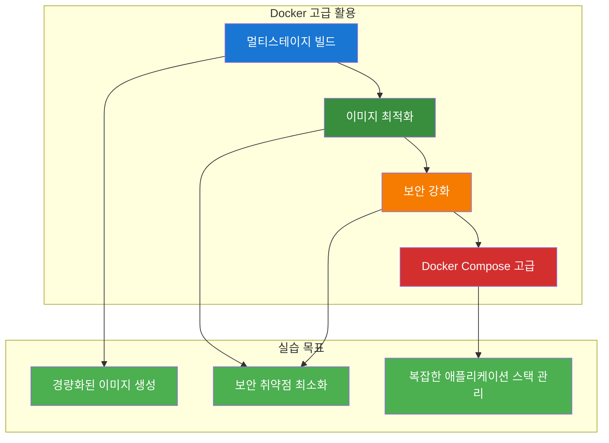

#### 핵심 개념
- **멀티스테이지 빌드**: 빌드 도구와 런타임 환경 분리
- **이미지 최적화**: 레이어 최적화, 불필요한 파일 제거
- **보안 강화**: non-root 사용자, 최소 권한 원칙
- **Docker Compose**: 복잡한 애플리케이션 스택 관리

### 🛠️ 실습 진행 (60분)

#### 실습 1: 멀티스테이지 빌드 (20분)

**변경 전 시스템 아키텍처**:
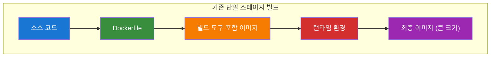

**자동화 도구 실행**:
```bash
# 실습 스크립트 실행
./day1-practice.sh
# 메뉴 선택: 1. Docker 고급 활용

# 자동화 도구: ./tools/cloud/docker-helper.sh --action multistage-build
```

**변경 후 시스템 아키텍처**:
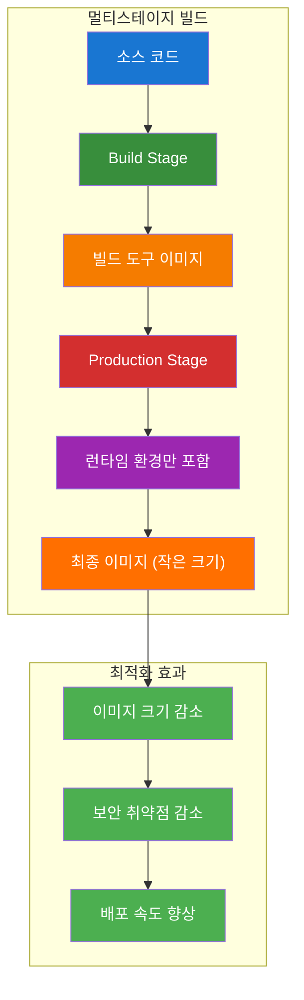

**실습 명령어**:
```bash
# 멀티스테이지 빌드 Dockerfile 생성
cat > Dockerfile.multistage << 'EOF'
# Build stage
FROM node:18-alpine AS builder
WORKDIR /app
COPY package*.json ./
RUN npm ci --only=production

# Production stage
FROM node:18-alpine AS production
WORKDIR /app
COPY --from=builder /app/node_modules ./node_modules
COPY . .
EXPOSE 3000
CMD ["node", "server.js"]
EOF

# 멀티스테이지 빌드 실행
docker build -f Dockerfile.multistage -t myapp:multistage .

# 이미지 크기 비교
docker images | grep myapp
```

**실습 내용**:
- Node.js 애플리케이션 멀티스테이지 빌드
- 이미지 크기 비교

#### 실습 2: 이미지 최적화 (20분)

**변경 전 시스템 아키텍처**:
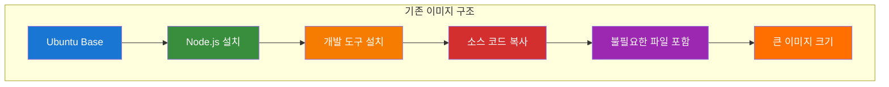

**자동화 도구 실행**:
```bash
# 자동화 도구: ./tools/cloud/docker-helper.sh --action optimize-image
```

**변경 후 시스템 아키텍처**:
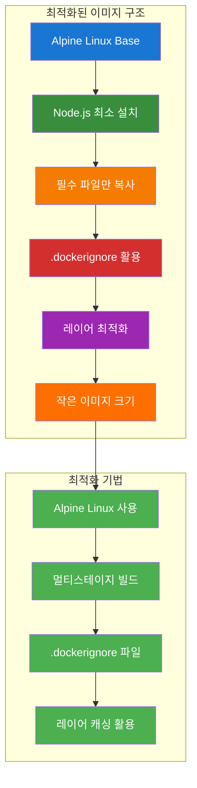

**실습 명령어**:
```bash
# .dockerignore 파일 생성
cat > .dockerignore << 'EOF'
node_modules
npm-debug.log
.git
.gitignore
README.md
.env
.nyc_output
coverage
.nyc_output
.coverage
EOF

# Alpine 기반 최적화된 Dockerfile
cat > Dockerfile.optimized << 'EOF'
FROM node:18-alpine
WORKDIR /app
COPY package*.json ./
RUN npm ci --only=production && npm cache clean --force
COPY . .
RUN addgroup -g 1001 -S nodejs && adduser -S nextjs -u 1001
USER nextjs
EXPOSE 3000
CMD ["node", "server.js"]
EOF

# 최적화된 이미지 빌드
docker build -f Dockerfile.optimized -t myapp:optimized .
```

**실습 내용**:
- Alpine Linux 기반 경량 이미지
- 레이어 최적화

#### 실습 3: 보안 강화 (20분)

**변경 전 시스템 아키텍처**:
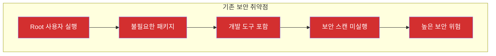

**자동화 도구 실행**:
```bash
# 자동화 도구: ./tools/cloud/docker-helper.sh --action security-scan
```

**변경 후 시스템 아키텍처**:
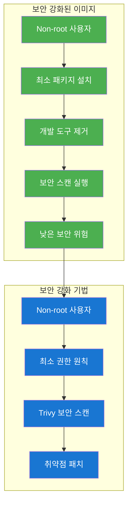

**실습 명령어**:
```bash
# 보안 강화된 Dockerfile 생성
cat > Dockerfile.secure << 'EOF'
FROM node:18-alpine
WORKDIR /app

# 보안 강화: non-root 사용자 생성
RUN addgroup -g 1001 -S nodejs && adduser -S nextjs -u 1001

# 패키지 설치 및 정리
COPY package*.json ./
RUN npm ci --only=production && npm cache clean --force

# 소스 코드 복사 및 권한 설정
COPY --chown=nextjs:nodejs . .
USER nextjs

EXPOSE 3000
CMD ["node", "server.js"]
EOF

# 보안 스캔 도구 설치 및 실행
docker run --rm -v /var/run/docker.sock:/var/run/docker.sock \
  aquasec/trivy image myapp:secure

# 취약점 수정 후 재빌드
docker build -f Dockerfile.secure -t myapp:secure .
```

**실습 내용**:
- non-root 사용자 설정
- 보안 스캔 도구 활용

### 📊 실습 결과
- [ ] 멀티스테이지 빌드 성공
- [ ] 이미지 크기 최적화 확인
- [ ] 보안 취약점 최소화
- [ ] Docker Compose 스택 관리

---

## 🕘 2교시: Kubernetes 기초 (10:45-12:45)

### 📚 강의 내용 (30분)

#### Kubernetes 핵심 개념
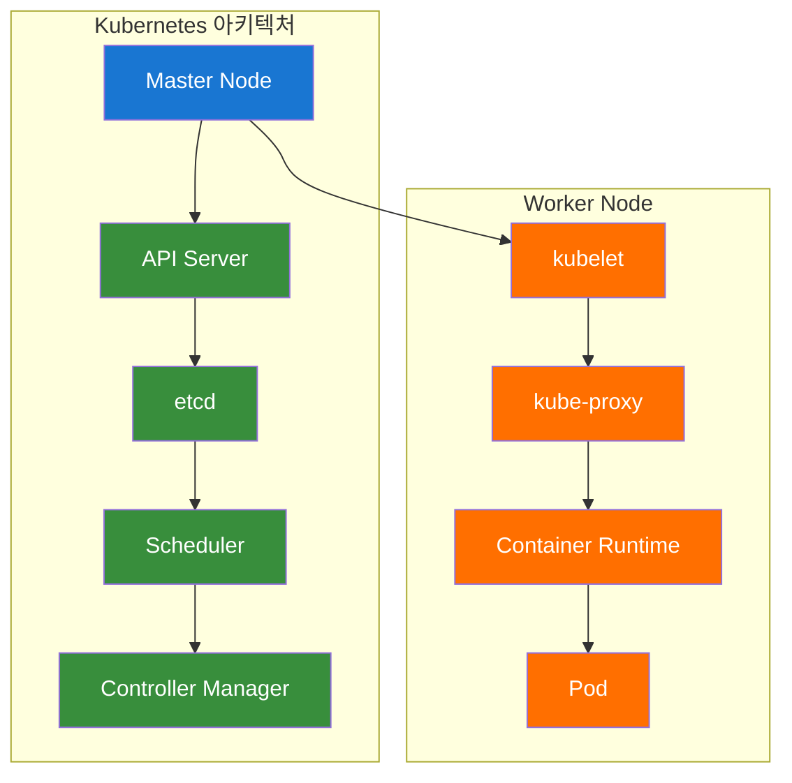

#### 핵심 리소스
- **Pod**: Kubernetes의 최소 배포 단위
- **Deployment**: Pod의 선언적 관리
- **Service**: Pod 그룹에 대한 네트워크 접근
- **LoadBalancer**: 외부 접근을 위한 로드 밸런서

### 🛠️ 실습 진행 (90분)

#### 실습 1: 클러스터 Context 구성 (15분)

**변경 전 시스템 아키텍처**:
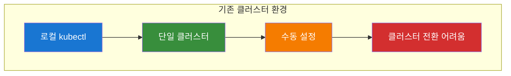

**자동화 도구 실행**:
```bash
# 실습 스크립트 실행
./day1-practice.sh
# 메뉴 선택: 2. Kubernetes 기초 실습

# 자동화 도구: ./tools/cloud/k8s-helper.sh --action setup-context
```

**변경 후 시스템 아키텍처**:
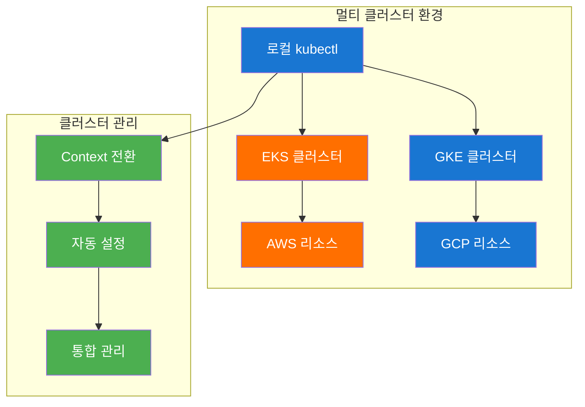

**실습 명령어**:
```bash
# AWS EKS 클러스터 연결
aws eks update-kubeconfig --region us-west-2 --name my-cluster

# GCP GKE 클러스터 연결
gcloud container clusters get-credentials my-cluster --zone us-central1-a

# 클러스터 Context 확인
kubectl config get-contexts

# Context 전환
kubectl config use-context arn:aws:eks:us-west-2:123456789012:cluster/my-cluster
```

**실습 내용**:
- AWS EKS 클러스터 연결
- GCP GKE 클러스터 연결
- 클러스터 간 전환

#### 실습 2: Workload 배포 (30분)

**변경 전 시스템 아키텍처**:
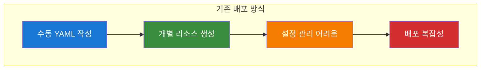

**자동화 도구 실행**:
```bash
# 자동화 도구: ./tools/cloud/k8s-helper.sh --action deploy-workload
```

**변경 후 시스템 아키텍처**:
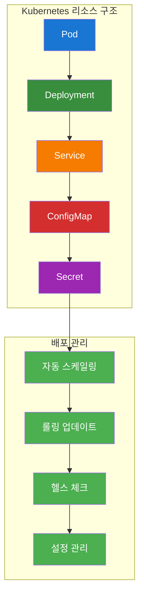

**실습 명령어**:
```bash
# Pod 생성
cat > nginx-pod.yaml << 'EOF'
apiVersion: v1
kind: Pod
metadata:
  name: nginx-pod
  labels:
    app: nginx
spec:
  containers:
  - name: nginx
    image: nginx:1.21
    ports:
    - containerPort: 80
EOF

kubectl apply -f nginx-pod.yaml

# Deployment 생성
cat > nginx-deployment.yaml << 'EOF'
apiVersion: apps/v1
kind: Deployment
metadata:
  name: nginx-deployment
spec:
  replicas: 3
  selector:
    matchLabels:
      app: nginx
  template:
    metadata:
      labels:
        app: nginx
    spec:
      containers:
      - name: nginx
        image: nginx:1.21
        ports:
        - containerPort: 80
EOF

kubectl apply -f nginx-deployment.yaml

# Service 생성
cat > nginx-service.yaml << 'EOF'
apiVersion: v1
kind: Service
metadata:
  name: nginx-service
spec:
  selector:
    app: nginx
  ports:
  - port: 80
    targetPort: 80
  type: ClusterIP
EOF

kubectl apply -f nginx-service.yaml
```

**실습 내용**:
- Pod, Deployment, Service 생성
- ConfigMap과 Secret 관리
- 리소스 상태 모니터링

#### 실습 3: 외부 접근 구성 (30분)

**변경 전 시스템 아키텍처**:
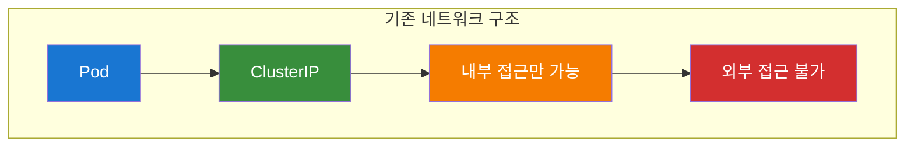

**자동화 도구 실행**:
```bash
# 자동화 도구: ./tools/cloud/k8s-helper.sh --action setup-external-access
```

**변경 후 시스템 아키텍처**:
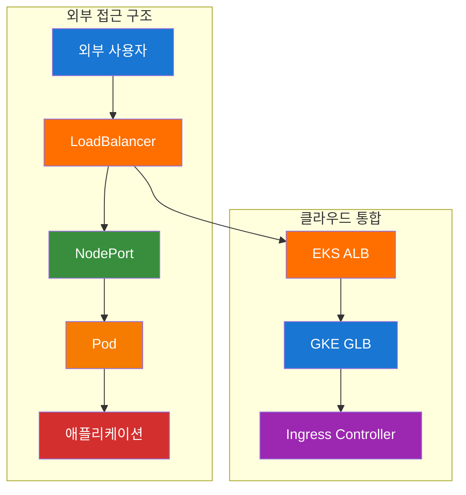

**실습 명령어**:
```bash
# LoadBalancer Service 생성
cat > nginx-loadbalancer.yaml << 'EOF'
apiVersion: v1
kind: Service
metadata:
  name: nginx-loadbalancer
spec:
  selector:
    app: nginx
  ports:
  - port: 80
    targetPort: 80
  type: LoadBalancer
EOF

kubectl apply -f nginx-loadbalancer.yaml

# 외부 IP 확인
kubectl get services nginx-loadbalancer

# 접속 테스트
curl http://EXTERNAL-IP
```

**실습 내용**:
- NodePort를 통한 외부 접근
- EKS ALB LoadBalancer 배포
- GKE GLB LoadBalancer 배포
- Ingress를 통한 고급 라우팅

#### 실습 4: 문제 해결 (15분)

**변경 전 시스템 아키텍처**:
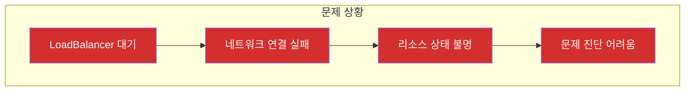

**자동화 도구 실행**:
```bash
# 자동화 도구: ./tools/cloud/k8s-helper.sh --action troubleshoot
```

**변경 후 시스템 아키텍처**:
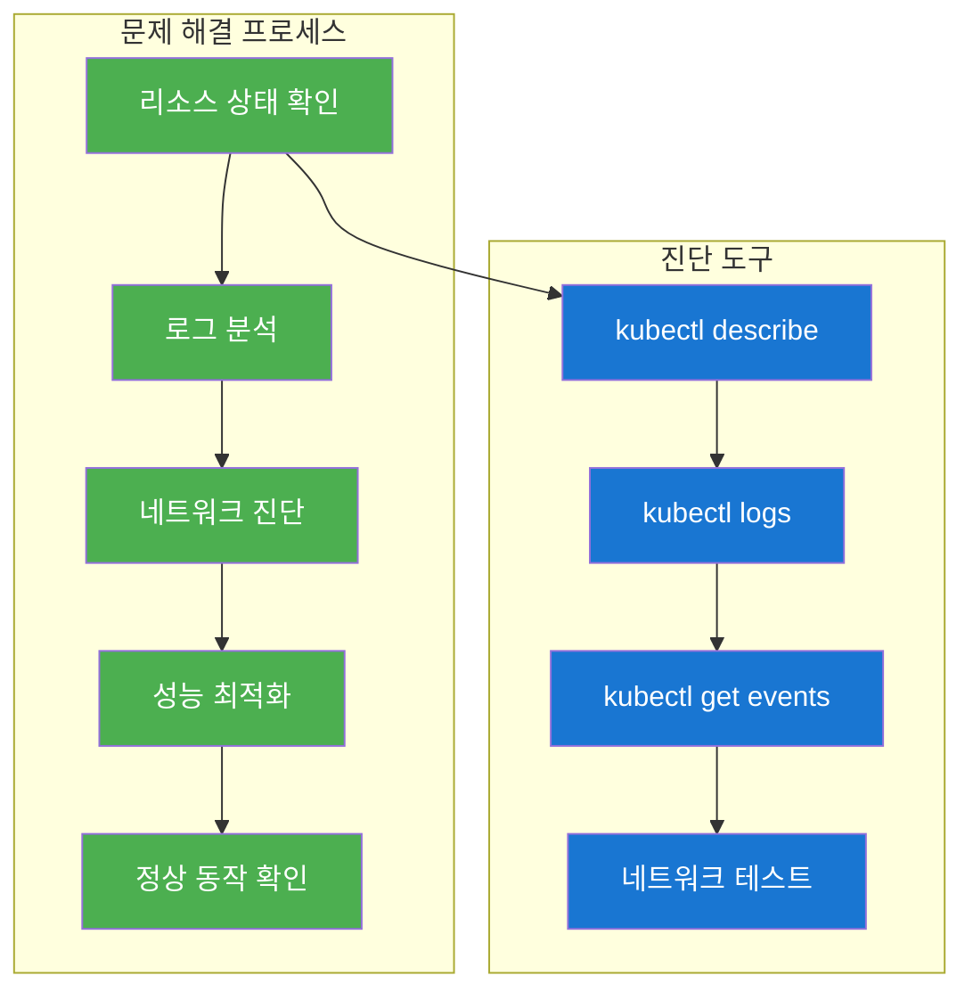

**실습 명령어**:
```bash
# 리소스 상태 확인
kubectl get pods
kubectl get services
kubectl get deployments

# 상세 정보 확인
kubectl describe pod nginx-pod
kubectl describe service nginx-service

# 로그 확인
kubectl logs nginx-pod

# 이벤트 확인
kubectl get events --sort-by=.metadata.creationTimestamp

# 네트워크 테스트
kubectl run test-pod --image=busybox --rm -it -- wget -qO- nginx-service
```

**실습 내용**:
- LoadBalancer 문제 진단
- 네트워크 연결 테스트
- 성능 최적화

### 📊 실습 결과
- [ ] Kubernetes 클러스터 Context 구성 완료
- [ ] Pod, Deployment, Service 배포 성공
- [ ] ConfigMap과 Secret 설정 완료
- [ ] LoadBalancer 외부 접근 구성 완료
- [ ] 문제 해결 및 최적화 완료

---

## 🧹 실습 정리 (12:30-12:45)

### 자동 정리 실행
```bash
# Day1 오전 실습 자동 정리
./day1-practice.sh
# 메뉴에서 "정리" 옵션 선택
```

### 정리 내용
- [ ] Docker 이미지 정리
- [ ] Kubernetes 리소스 정리
- [ ] 클러스터 Context 정리

---

## 📊 오전 학습 성과 확인

### 실습 완료 체크리스트
- [ ] Docker 멀티스테이지 빌드 실습 완료
- [ ] Docker 이미지 최적화 실습 완료
- [ ] Docker 보안 강화 실습 완료
- [ ] Kubernetes 기본 리소스 생성 및 관리 완료
- [ ] Kubernetes 외부 접근 구성 완료

### 다음 단계
- **오후 실습**으로 진행: 클라우드 컨테이너 서비스 및 통합 모니터링
- **점심 시간**: 12:45-13:45

---

## 🎯 오전 강의 성공 지표

### 정량적 지표
- **실습 완료율**: 95% 이상
- **환경 설정 성공률**: 90% 이상
- **Docker 이미지 최적화 성공률**: 90% 이상
- **Kubernetes 리소스 배포 성공률**: 90% 이상

### 정성적 지표
- **수강생 만족도**: 4.5/5.0 이상
- **실습 이해도**: 90% 이상
- **문제 해결 능력**: 향상 확인
- **오후 실습 준비도**: 85% 이상

---

**💡 오전 강의 진행 중 문제가 발생하면 실시간으로 지원해드리겠습니다!**  
**수강생의 학습 성과를 최대화하기 위해 지속적으로 모니터링하겠습니다.**
