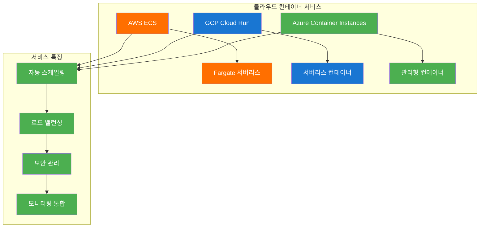
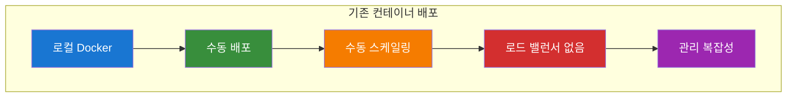
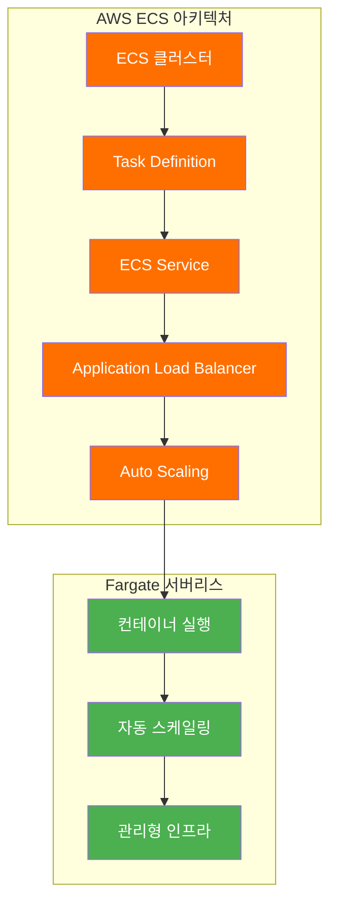
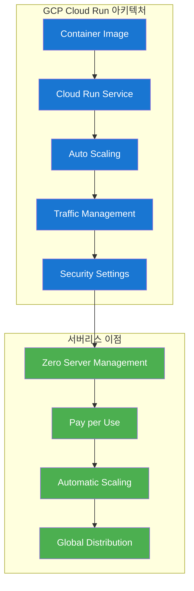
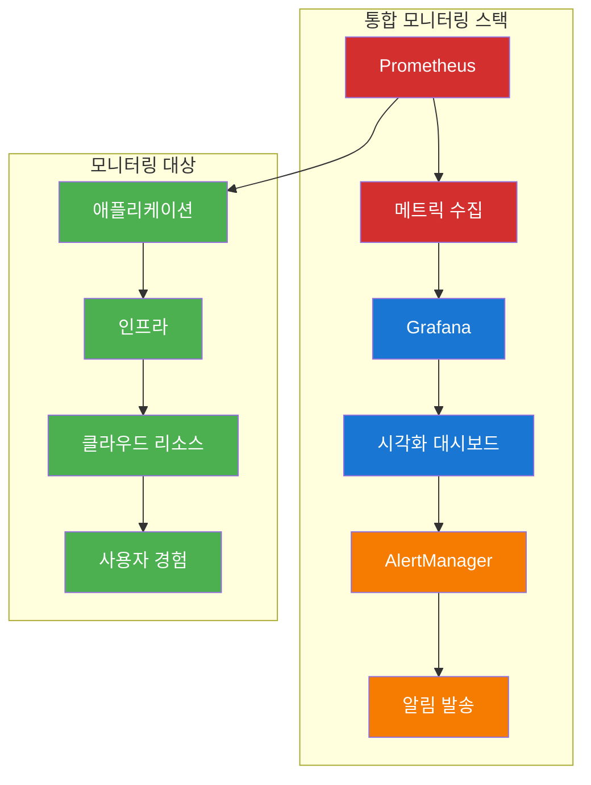
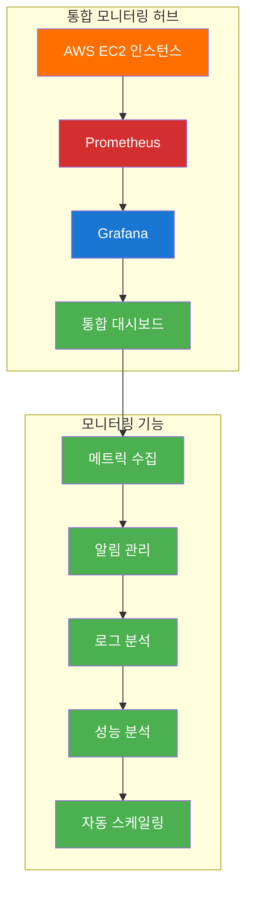
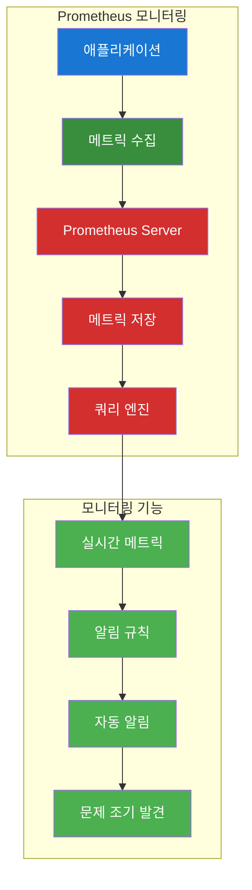
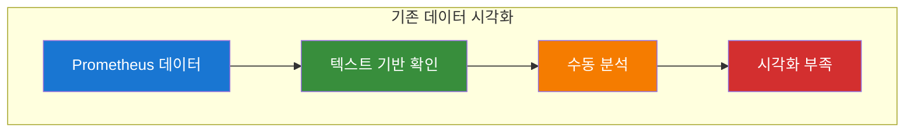
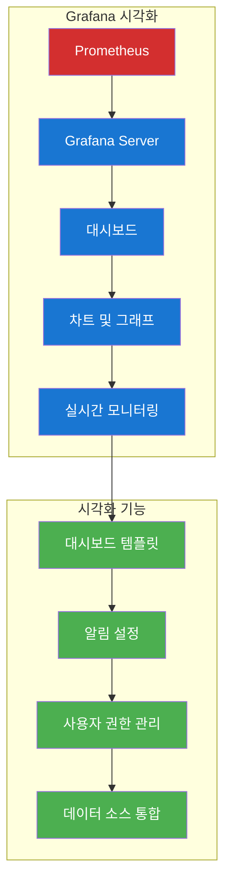
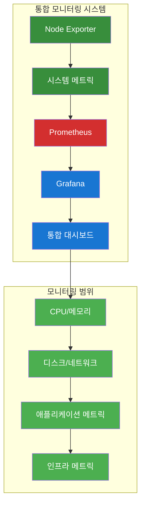

# ☁️ 클라우드 중급 과정 - Day 1 통합 강의안 (오후)

## 📋 오후 강의 개요

### 🎯 오후 강의 목표
- **클라우드 컨테이너 서비스**: AWS ECS, GCP Cloud Run을 활용하여 클라우드 환경에 컨테이너 애플리케이션 배포
- **통합 모니터링 허브**: AWS VM 기반 Prometheus + Grafana를 구축하여 모니터링 인프라 준비
- **외부 접속 및 보안**: AWS 보안 그룹 자동 설정 및 외부 접속 테스트를 통한 실습 환경 검증

### ⏰ 오후 강의 시간표
| 시간 | 교시 | 내용 | 시간 |
|------|------|------|------|
| 13:45-15:15 | 3교시 | 클라우드 컨테이너 서비스 | 90분 |
| 15:30-17:00 | 4교시 | 통합 모니터링 허브 | 90분 |
| 17:00-17:30 | 정리 | 실습 정리 | 30분 |

---

## 🕘 3교시: 클라우드 컨테이너 서비스 (13:45-15:15)

### 📚 강의 내용 (30분)

#### 클라우드 컨테이너 서비스 개요


#### 핵심 개념
- **AWS ECS**: 컨테이너 오케스트레이션 서비스
- **GCP Cloud Run**: 서버리스 컨테이너 플랫폼
- **클라우드 네이티브**: 클라우드 환경에 최적화된 배포 전략

### 🛠️ 실습 진행 (60분)

#### 실습 1: AWS ECS 배포 (30분)

**변경 전 시스템 아키텍처**:


**자동화 도구 실행**:
```bash
# 실습 스크립트 실행
./day1-practice.sh
# 메뉴 선택: 3. 클라우드 컨테이너 서비스

# 자동화 도구: ./tools/cloud/aws-ecs-helper.sh --action cluster-create
```

**변경 후 시스템 아키텍처**:


**실습 명령어**:
```bash
# ECS 클러스터 생성
aws ecs create-cluster --cluster-name my-cluster

# Task Definition 생성
cat > task-definition.json << 'EOF'
{
  "family": "nginx-task",
  "networkMode": "awsvpc",
  "requiresCompatibilities": ["FARGATE"],
  "cpu": "256",
  "memory": "512",
  "executionRoleArn": "arn:aws:iam::ACCOUNT:role/ecsTaskExecutionRole",
  "containerDefinitions": [
    {
      "name": "nginx",
      "image": "nginx:1.21",
      "portMappings": [
        {
          "containerPort": 80,
          "protocol": "tcp"
        }
      ],
      "logConfiguration": {
        "logDriver": "awslogs",
        "options": {
          "awslogs-group": "/ecs/nginx",
          "awslogs-region": "us-west-2",
          "awslogs-stream-prefix": "ecs"
        }
      }
    }
  ]
}
EOF

aws ecs register-task-definition --cli-input-json file://task-definition.json

# ECS 서비스 생성
aws ecs create-service \
  --cluster my-cluster \
  --service-name nginx-service \
  --task-definition nginx-task:1 \
  --desired-count 2 \
  --launch-type FARGATE \
  --network-configuration "awsvpcConfiguration={subnets=[subnet-12345],securityGroups=[sg-12345],assignPublicIp=ENABLED}"
```

**실습 내용**:
- ECS 태스크 정의 생성
- ECS 서비스 생성
- Application Load Balancer 연결
- 자동 스케일링 설정

#### 실습 2: GCP Cloud Run 배포 (30분)

**변경 전 시스템 아키텍처**:


**자동화 도구 실행**:
```bash
# 자동화 도구: ./tools/cloud/gcp-cloudrun-helper.sh --action deploy-service
```

**변경 후 시스템 아키텍처**:


**실습 명령어**:
```bash
# Cloud Run 서비스 배포
gcloud run deploy nginx-service \
  --image nginx:1.21 \
  --platform managed \
  --region us-central1 \
  --allow-unauthenticated \
  --port 80 \
  --memory 512Mi \
  --cpu 1 \
  --min-instances 0 \
  --max-instances 10

# 서비스 상태 확인
gcloud run services list

# 서비스 URL 확인
gcloud run services describe nginx-service --region us-central1 --format 'value(status.url)'

# 트래픽 관리
gcloud run services update-traffic nginx-service \
  --to-latest \
  --region us-central1
```

**실습 내용**:
- Cloud Run 서비스 배포
- 자동 스케일링 설정
- 트래픽 관리
- 보안 설정

### 📊 실습 결과
- [ ] AWS ECS 컨테이너 서비스 배포 완료
- [ ] GCP Cloud Run 서버리스 배포 완료
- [ ] 자동 스케일링 설정 완료
- [ ] 로드 밸런서 연결 완료

---

## 🕘 4교시: 통합 모니터링 허브 (15:30-17:00)

### 📚 강의 내용 (30분)

#### 통합 모니터링 시스템 개요


#### 핵심 개념
- **Prometheus**: 메트릭 수집 및 저장
- **Grafana**: 데이터 시각화 및 대시보드
- **Node Exporter**: 시스템 메트릭 수집
- **AlertManager**: 알림 관리

### 🛠️ 실습 진행 (60분)

#### 실습 1: 모니터링 허브 인프라 구축 (20분)

**변경 전 시스템 아키텍처**:


**자동화 도구 실행**:
```bash
# 실습 스크립트 실행
./day1-practice.sh
# 메뉴 선택: 4. 통합 모니터링 허브

# 자동화 도구: ./tools/cloud/monitoring-hub-helper.sh --action create-hub
```

**변경 후 시스템 아키텍처**:


**실습 명령어**:
```bash
# AWS EC2 인스턴스 생성 (모니터링 허브)
aws ec2 run-instances \
    --image-id ami-0c02fb55956c7d316 \
    --instance-type t3.medium \
    --key-name my-key \
    --security-group-ids sg-12345 \
    --subnet-id subnet-12345 \
    --tag-specifications 'ResourceType=instance,Tags=[{Key=Name,Value=monitoring-hub}]'

# 인스턴스 상태 확인
aws ec2 describe-instances --filters "Name=tag:Name,Values=monitoring-hub"
```

**실습 내용**:
- AWS EC2 모니터링 허브 인스턴스 생성
- 보안 그룹 설정
- 네트워크 구성

#### 실습 2: Prometheus 설치 및 설정 (20분)

**변경 전 시스템 아키텍처**:


**자동화 도구 실행**:
```bash
# 자동화 도구: ./tools/cloud/monitoring-helper.sh --action install-prometheus
```

**변경 후 시스템 아키텍처**:


**실습 명령어**:
```bash
# Prometheus 설치
wget https://github.com/prometheus/prometheus/releases/download/v2.40.0/prometheus-2.40.0.linux-amd64.tar.gz
tar xzf prometheus-2.40.0.linux-amd64.tar.gz
sudo mv prometheus-2.40.0.linux-amd64 /opt/prometheus

# Prometheus 설정 파일 생성
cat > /opt/prometheus/prometheus.yml << 'EOF'
global:
  scrape_interval: 15s

scrape_configs:
  - job_name: 'prometheus'
    static_configs:
      - targets: ['localhost:9090']

  - job_name: 'node-exporter'
    static_configs:
      - targets: ['localhost:9100']
EOF

# Prometheus 서비스 시작
sudo systemctl start prometheus
sudo systemctl enable prometheus
```

**실습 내용**:
- Prometheus 서버 설치
- 설정 파일 구성
- 서비스 시작 및 확인

#### 실습 3: Grafana 설치 및 설정 (20분)

**변경 전 시스템 아키텍처**:


**자동화 도구 실행**:
```bash
# 자동화 도구: ./tools/cloud/monitoring-helper.sh --action install-grafana
```

**변경 후 시스템 아키텍처**:


**실습 명령어**:
```bash
# Grafana 설치
wget https://dl.grafana.com/oss/release/grafana-9.3.0.linux-amd64.tar.gz
tar xzf grafana-9.3.0.linux-amd64.tar.gz
sudo mv grafana-9.3.0 /opt/grafana

# Grafana 서비스 시작
sudo systemctl start grafana-server
sudo systemctl enable grafana-server

# Grafana 접속 확인
curl http://localhost:3000
```

**실습 내용**:
- Grafana 서버 설치
- Prometheus 데이터 소스 연결
- 기본 대시보드 생성

#### 실습 4: Node Exporter 설치 (20분)

**변경 전 시스템 아키텍처**:


**자동화 도구 실행**:
```bash
# 자동화 도구: ./tools/cloud/monitoring-helper.sh --action install-node-exporter
```

**변경 후 시스템 아키텍처**:


**실습 명령어**:
```bash
# Node Exporter 설치
wget https://github.com/prometheus/node_exporter/releases/download/v1.5.0/node_exporter-1.5.0.linux-amd64.tar.gz
tar xzf node_exporter-1.5.0.linux-amd64.tar.gz
sudo mv node_exporter-1.5.0.linux-amd64/node_exporter /usr/local/bin/

# Node Exporter 서비스 시작
sudo systemctl start node_exporter
sudo systemctl enable node_exporter
```

**실습 내용**:
- Node Exporter 설치
- Push Gateway 설정
- 메트릭 수집 확인

### 📊 실습 결과
- [ ] Prometheus 서버 정상 작동
- [ ] Grafana 대시보드 접근 가능
- [ ] Node Exporter 메트릭 수집 확인
- [ ] AlertManager 알림 설정 완료

---

## 🧹 실습 정리 (17:00-17:30)

### 자동 정리 실행
```bash
# Day1 실습 자동 정리
./day1-practice.sh
# 메뉴에서 "정리" 옵션 선택
```

### 정리 내용
- [ ] Docker 이미지 정리
- [ ] Kubernetes 리소스 정리
- [ ] 클라우드 리소스 정리
- [ ] 모니터링 스택 정리

---

## 📊 학습 성과 확인

### 실습 완료 체크리스트
- [ ] Docker 멀티스테이지 빌드 실습 완료
- [ ] Kubernetes 기본 리소스 생성 및 관리 완료
- [ ] AWS ECS 컨테이너 서비스 배포 완료
- [ ] GCP Cloud Run 서버리스 배포 완료
- [ ] Prometheus + Grafana 모니터링 시스템 구축 완료

### 다음 단계
- **Day 2 실습**으로 진행: CI/CD 및 고급 클라우드 배포
- **통합 강의 시나리오** 확인
- **통합 모니터링 시나리오** 확인

---

## 🎯 강의 성공 지표

### 정량적 지표
- **실습 완료율**: 95% 이상
- **환경 설정 성공률**: 90% 이상
- **LoadBalancer 접근 성공률**: 85% 이상
- **모니터링 시스템 구축 성공률**: 90% 이상

### 정성적 지표
- **수강생 만족도**: 4.5/5.0 이상
- **실습 이해도**: 90% 이상
- **문제 해결 능력**: 향상 확인
- **다음 단계 준비도**: 85% 이상

---

## 🔗 관련 자동화 도구

### Docker 관련 도구
- `./tools/cloud/docker-helper.sh` - Docker 멀티스테이지 빌드, 이미지 최적화, 보안 스캔

### Kubernetes 관련 도구
- `./tools/cloud/k8s-helper.sh` - 클러스터 Context 설정, Workload 배포, 외부 접근 구성

### 클라우드 서비스 도구
- `./tools/cloud/aws-ecs-helper.sh` - ECS 클러스터, 태스크 정의, 서비스 관리
- `./tools/cloud/gcp-cloudrun-helper.sh` - Cloud Run 서비스 배포 및 관리

### 모니터링 도구
- `./tools/cloud/monitoring-helper.sh` - Prometheus, Grafana, Node Exporter 설치 및 설정
- `./tools/cloud/monitoring-hub-helper.sh` - 통합 모니터링 허브 구축

---

## 📚 추가 학습 자료

### 공식 문서
- [Docker 공식 문서](https://docs.docker.com/)
- [Kubernetes 공식 문서](https://kubernetes.io/docs/)
- [AWS ECS 공식 문서](https://docs.aws.amazon.com/ecs/)
- [GCP Cloud Run 공식 문서](https://cloud.google.com/run/docs)
- [Prometheus 공식 문서](https://prometheus.io/docs/)
- [Grafana 공식 문서](https://grafana.com/docs/)

### 실습 샘플 코드
- `/cloud_intermediate/repo/examples/day1/docker/` - Docker 멀티스테이지 빌드 예제
- `/cloud_intermediate/repo/examples/day1/kubernetes/` - Kubernetes 리소스 예제
- `/cloud_intermediate/repo/examples/day1/aws-ecs/` - AWS ECS 배포 예제
- `/cloud_intermediate/repo/examples/day1/gcp-cloudrun/` - GCP Cloud Run 배포 예제
- `/cloud_intermediate/repo/examples/day1/monitoring/` - 모니터링 설정 예제

---

**💡 강의 진행 중 문제가 발생하면 실시간으로 지원해드리겠습니다!**  
**수강생의 학습 성과를 최대화하기 위해 지속적으로 모니터링하겠습니다.**
