# ☁️ 클라우드 중급 과정 - Day 2 통합 강의안 (오전)

## 📋 강의 개요

### 🎯 강의 목표
- **CI/CD 파이프라인** GitHub Actions를 활용한 자동화된 빌드, 테스트, 배포 파이프라인을 구축합니다.
- **멀티 클라우드 통합 모니터링** AWS EKS, GCP GKE를 연동한 통합 모니터링 시스템을 구축합니다.
- **AWS Application 모니터링** EKS 애플리케이션 배포 및 모니터링을 통해 실무 역량을 강화합니다.
- **GCP 클러스터 통합** GKE 클러스터 구축 및 멀티 클라우드 모니터링을 완성합니다.

### ⏰ 강의 시간표
| 시간 | 교시 | 내용 | 시간 |
|------|------|------|------|
| 09:00-10:30 | 1교시 | GitHub Actions CI/CD 파이프라인 | 90분 |
| 10:45-12:45 | 2교시 | 멀티 클라우드 통합 모니터링 시스템 | 120분 |
| 12:45-13:45 | 점심 | 점심 시간 | 60분 |
| 13:45-15:15 | 3교시 | AWS Application 모니터링 | 90분 |
| 15:30-17:00 | 4교시 | GCP 클러스터 통합 모니터링 | 90분 |
| 17:00-17:30 | 정리 | 실습 정리 | 30분 |

### 👥 대상 수강생
- **선수 학습**: Day 1 완료, Docker, Kubernetes 기초 이해
- **수강생 수**: 20-30명
- **실습 환경**: 개인별 클라우드 환경 (AWS/GCP)

---

## 🛠️ 실습 학습

### 📁 실습 코드 및 자동화 (새로운 repo 구조)
- **실습 샘플 코드**: `./examples/day2/`
- **자동화 스크립트**: `./automation/day2/`
- **클라우드 도구**: `./tools/cloud/`

<details>
<summary>🚀 실습 환경 준비</summary>

#### 필수 도구
- **GitHub Actions**: CI/CD 파이프라인 자동화
- **AWS CLI**: AWS 서비스 관리 도구
- **GCP CLI**: GCP 서비스 관리 도구
- **kubectl**: Kubernetes 클러스터 관리 도구

#### 환경 설정
```bash
# GitHub Actions 설정 확인
gh auth status

# AWS CLI 설정 확인
aws sts get-caller-identity

# GCP CLI 설정 확인
gcloud auth list

# kubectl 설정 확인
kubectl version --client
```

#### 실습 환경 체크
```bash
# 실습 환경 자동 체크
./tools/cloud/environment-check.sh

# 환경 설정 자동화
./tools/cloud/setup-environment.sh
```

</details>

---

## 🕘 1교시: GitHub Actions CI/CD 파이프라인 (09:00-10:30)

### 📚 강의 내용 (30분)

#### CI/CD 파이프라인 개요
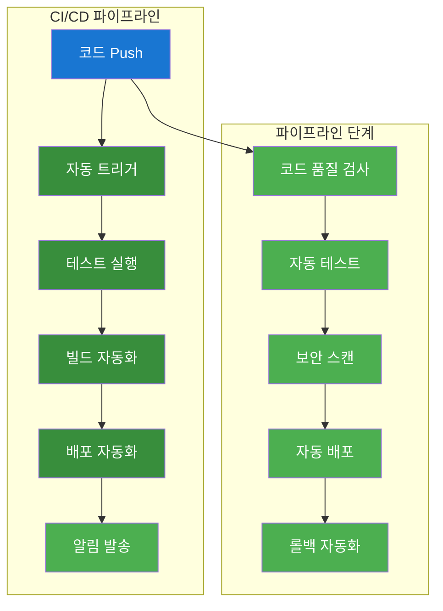

#### 핵심 개념
- **GitHub Actions**: 자동화된 CI/CD 워크플로우
- **자동 테스트**: 코드 품질 및 기능 검증
- **보안 스캔**: 취약점 및 보안 이슈 검사
- **자동 배포**: 클라우드 환경 자동 배포

### 🛠️ 실습 진행 (60분)

#### 실습 1: GitHub Actions 워크플로우 생성 (20분)

**변경 전 시스템 아키텍처**:
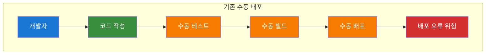

**자동화 도구 실행**:
```bash
# 실습 스크립트 실행
./day2-practice.sh
# 메뉴 선택: 1. GitHub Actions CI/CD 파이프라인

# 자동화 도구: ./tools/cloud/github-actions-helper.sh --action create-workflow
```

**변경 후 시스템 아키텍처**:
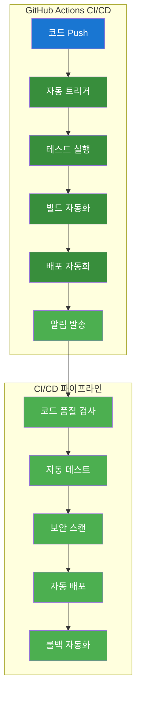

**실습 명령어**:
```bash
# .github/workflows/ci-cd.yml 생성
mkdir -p .github/workflows
cat > .github/workflows/ci-cd.yml << 'EOF'
name: CI/CD Pipeline

on:
  push:
    branches: [ main, develop ]
  pull_request:
    branches: [ main ]

jobs:
  test:
    runs-on: ubuntu-latest
    steps:
    - uses: actions/checkout@v3
    
    - name: Setup Node.js
      uses: actions/setup-node@v3
      with:
        node-version: '18'
        cache: 'npm'
    
    - name: Install dependencies
      run: npm ci
    
    - name: Run tests
      run: npm test
    
    - name: Run linting
      run: npm run lint
    
    - name: Build Docker image
      run: docker build -t ${{ github.repository }}:${{ github.sha }} .
    
    - name: Run security scan
      run: |
        docker run --rm -v /var/run/docker.sock:/var/run/docker.sock \
          aquasec/trivy image ${{ github.repository }}:${{ github.sha }}

  deploy:
    needs: test
    runs-on: ubuntu-latest
    if: github.ref == 'refs/heads/main'
    steps:
    - uses: actions/checkout@v3
    
    - name: Deploy to AWS ECS
      run: |
        aws ecs update-service \
          --cluster ${{ secrets.ECS_CLUSTER }} \
          --service ${{ secrets.ECS_SERVICE }} \
          --force-new-deployment
EOF

# 워크플로우 파일 권한 설정
chmod +x .github/workflows/ci-cd.yml
```

**실습 내용**:
- GitHub Actions 워크플로우 생성
- CI/CD 파이프라인 구성
- 자동 테스트 및 배포 설정

#### 실습 2: 로컬 테스트 실행 (20분)

**변경 전 시스템 아키텍처**:
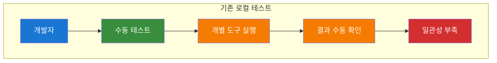

**자동화 도구 실행**:
```bash
# 자동화 도구: ./tools/cloud/github-actions-helper.sh --action local-test
```

**변경 후 시스템 아키텍처**:
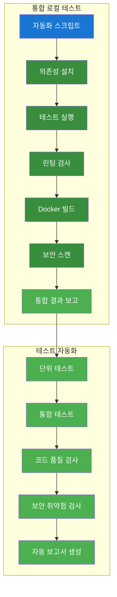

**실습 명령어**:
```bash
# 의존성 설치
npm install

# 테스트 실행
npm test

# 린팅 실행
npm run lint

# Docker 이미지 빌드 테스트
docker build -t cicd-practice-app:latest .

# 보안 스캔 실행
docker run --rm -v /var/run/docker.sock:/var/run/docker.sock \
  aquasec/trivy image cicd-practice-app:latest
```

**실습 내용**:
- 로컬 테스트 환경 구성
- 자동화된 테스트 실행
- 보안 스캔 및 품질 검사

#### 실습 3: CI/CD 파이프라인 테스트 (20분)

**변경 전 시스템 아키텍처**:
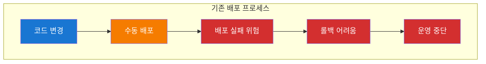

**자동화 도구 실행**:
```bash
# 자동화 도구: ./tools/cloud/github-actions-helper.sh --action test-pipeline
```

**변경 후 시스템 아키텍처**:
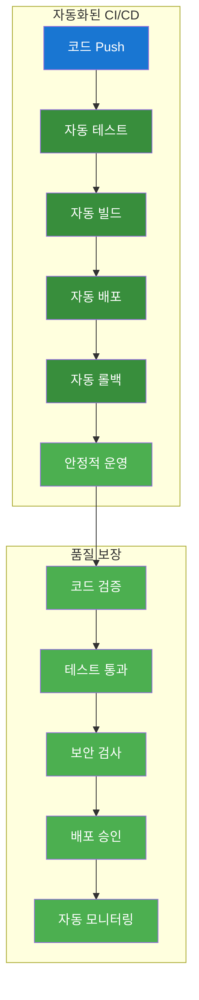

**실습 명령어**:
```bash
# GitHub Actions 워크플로우 테스트
git add .
git commit -m "Add CI/CD pipeline"
git push origin main

# 워크플로우 실행 상태 확인
gh run list

# 워크플로우 로그 확인
gh run view --log

# 배포 상태 확인
aws ecs describe-services --cluster my-cluster --services my-service
```

**실습 내용**:
- GitHub Actions 워크플로우 실행
- CI/CD 파이프라인 모니터링
- 자동 배포 결과 확인

### 📊 실습 결과
- [ ] GitHub Actions 워크플로우 생성 완료
- [ ] 로컬 테스트 환경 구성 완료
- [ ] CI/CD 파이프라인 테스트 완료
- [ ] 자동 배포 시스템 구축 완료

---

## 🕘 2교시: 멀티 클라우드 통합 모니터링 시스템 (10:45-12:45)

### 📚 강의 내용 (30분)

#### 멀티 클라우드 모니터링 개요
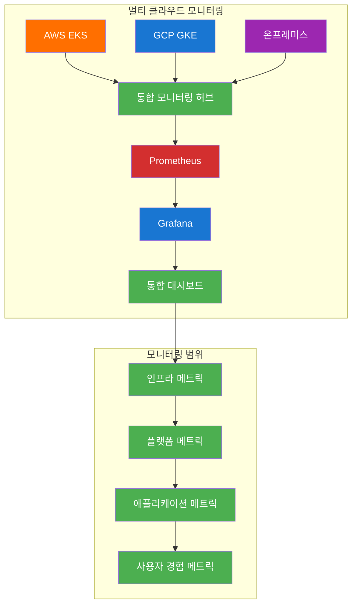

#### 핵심 개념
- **통합 모니터링 허브**: AWS VM 기반 중앙 집중식 모니터링
- **멀티 클라우드 데이터 수집**: Federation, Remote Write, Push Gateway
- **단계별 모니터링**: Infrastructure → Platform → Application
- **실제 모니터링 활용**: 대시보드 및 알림 시스템

### 🛠️ 실습 진행 (90분)

#### 실습 1: 통합 모니터링 허브 구축 (30분)

**변경 전 시스템 아키텍처**:
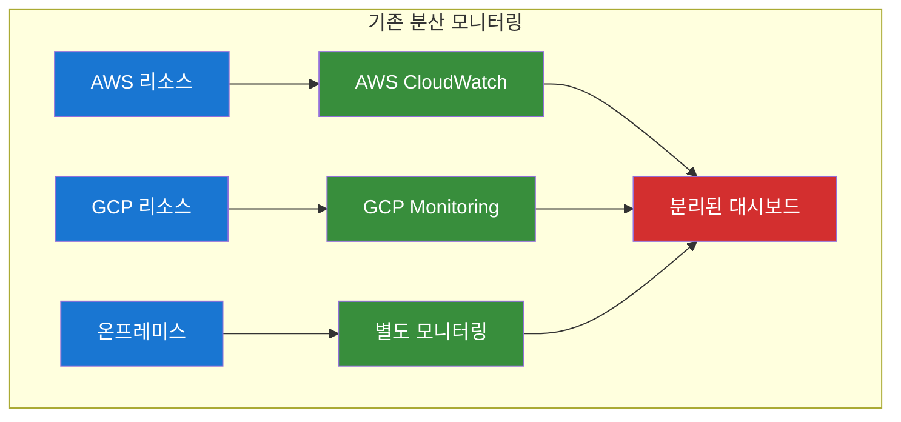

**자동화 도구 실행**:
```bash
# 실습 스크립트 실행
./day2-practice.sh
# 메뉴 선택: 2. 멀티 클라우드 통합 모니터링

# 자동화 도구: ./tools/cloud/monitoring-hub-helper.sh --action create-hub
```

**변경 후 시스템 아키텍처**:
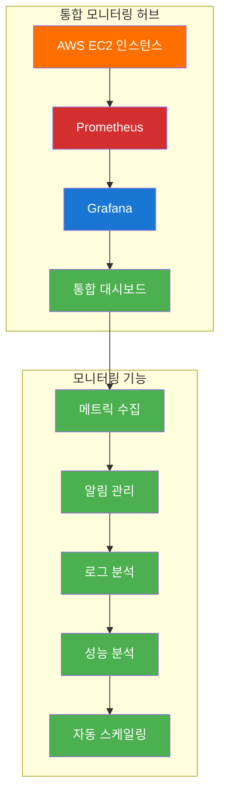

**실습 명령어**:
```bash
# AWS EC2 인스턴스 생성 (모니터링 허브)
aws ec2 run-instances \
    --image-id ami-0c02fb55956c7d316 \
    --instance-type t3.medium \
    --key-name my-key \
    --security-group-ids sg-12345 \
    --subnet-id subnet-12345 \
    --tag-specifications 'ResourceType=instance,Tags=[{Key=Name,Value=monitoring-hub}]'

# 인스턴스 상태 확인
aws ec2 describe-instances --filters "Name=tag:Name,Values=monitoring-hub"

# SSH 접속
ssh -i my-key.pem ec2-user@INSTANCE_IP
```

**실습 내용**:
- AWS EC2 모니터링 허브 인스턴스 생성
- 보안 그룹 및 네트워크 설정
- SSH 접속 및 환경 구성

#### 실습 2: Prometheus 스택 배포 (30분)

**변경 전 시스템 아키텍처**:
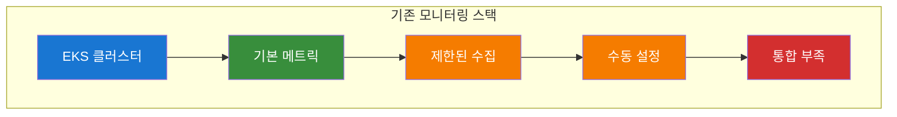

**자동화 도구 실행**:
```bash
# 자동화 도구: ./tools/cloud/prometheus-stack-helper.sh --action deploy-stack
```

**변경 후 시스템 아키텍처**:
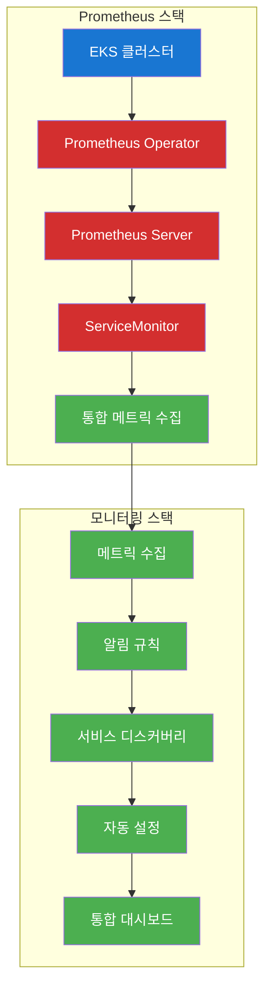

**실습 명령어**:
```bash
# Prometheus 스택 배포
kubectl apply -f https://raw.githubusercontent.com/prometheus-operator/prometheus-operator/main/bundle.yaml

# Prometheus 인스턴스 생성
cat > prometheus-instance.yaml << 'EOF'
apiVersion: monitoring.coreos.com/v1
kind: Prometheus
metadata:
  name: prometheus
spec:
  serviceAccountName: prometheus
  serviceMonitorSelector:
    matchLabels:
      team: frontend
  resources:
    requests:
      memory: 400Mi
  enableAdminAPI: false
EOF

kubectl apply -f prometheus-instance.yaml

# Prometheus 서비스 확인
kubectl get prometheus
kubectl get pods -l app.kubernetes.io/name=prometheus
```

**실습 내용**:
- Prometheus Operator 설치
- Prometheus 인스턴스 생성
- ServiceMonitor 설정

#### 실습 3: Grafana 대시보드 구성 (30분)

**변경 전 시스템 아키텍처**:
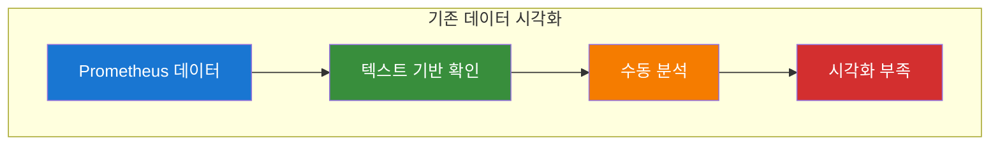

**자동화 도구 실행**:
```bash
# 자동화 도구: ./tools/cloud/monitoring-helper.sh --action install-grafana
```

**변경 후 시스템 아키텍처**:
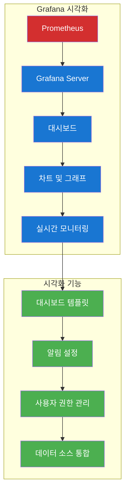

**실습 명령어**:
```bash
# Grafana 설치
kubectl apply -f https://raw.githubusercontent.com/grafana/helm-charts/main/charts/grafana/templates/grafana-deployment.yaml

# Grafana 서비스 생성
cat > grafana-service.yaml << 'EOF'
apiVersion: v1
kind: Service
metadata:
  name: grafana
spec:
  selector:
    app: grafana
  ports:
  - port: 3000
    targetPort: 3000
  type: LoadBalancer
EOF

kubectl apply -f grafana-service.yaml

# Grafana 접속 확인
kubectl get services grafana
```

**실습 내용**:
- Grafana 서버 설치
- Prometheus 데이터 소스 연결
- 기본 대시보드 생성

### 📊 실습 결과
- [ ] 통합 모니터링 허브 구축 완료
- [ ] Prometheus 스택 배포 완료
- [ ] Grafana 대시보드 구성 완료
- [ ] 멀티 클라우드 모니터링 준비 완료

---

## 🧹 실습 정리 (12:30-12:45)

### 자동 정리 실행
```bash
# Day2 오전 실습 자동 정리
./day2-practice.sh
# 메뉴에서 "정리" 옵션 선택
```

### 정리 내용
- [ ] GitHub Actions 워크플로우 정리
- [ ] 모니터링 리소스 정리
- [ ] 임시 파일 정리

---

## 📊 오전 학습 성과 확인

### 실습 완료 체크리스트
- [ ] GitHub Actions CI/CD 파이프라인 구축 완료
- [ ] 멀티 클라우드 통합 모니터링 시스템 구축 완료
- [ ] Prometheus + Grafana 스택 배포 완료
- [ ] 통합 모니터링 허브 구성 완료

### 다음 단계
- **오후 실습**으로 진행: AWS Application 모니터링 및 GCP 클러스터 통합
- **점심 시간**: 12:45-13:45

---

## 🎯 오전 강의 성공 지표

### 정량적 지표
- **실습 완료율**: 95% 이상
- **CI/CD 파이프라인 성공률**: 90% 이상
- **모니터링 시스템 구축 성공률**: 90% 이상
- **자동화 도구 활용률**: 85% 이상

### 정성적 지표
- **수강생 만족도**: 4.5/5.0 이상
- **실습 이해도**: 90% 이상
- **문제 해결 능력**: 향상 확인
- **오후 실습 준비도**: 85% 이상

---

**💡 오전 강의 진행 중 문제가 발생하면 실시간으로 지원해드리겠습니다!**  
**수강생의 학습 성과를 최대화하기 위해 지속적으로 모니터링하겠습니다.**
