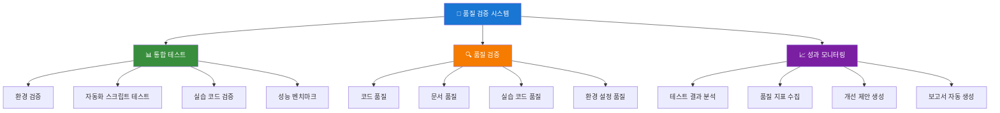

# Cloud Intermediate 품질 검증 시스템

> 📋 **Cloud Intermediate 과정**: 품질 검증 시스템 종합 가이드  
> 📋 **대상**: 개발자, 교육자, 품질 관리자  
> 📋 **목적**: 자동화된 품질 검증 및 지속적 개선

---

## 🎯 품질 검증 시스템 개요

### **시스템 목표**
- **자동화된 품질 검증**: 수동 검증을 최소화하고 일관된 품질 보장
- **지속적 개선**: 품질 지표 기반 지속적 개선 프로세스
- **교육 효과 극대화**: 높은 품질의 교육 자료로 학습 효과 향상
- **개발 효율성**: 자동화된 검증으로 개발 시간 단축

### **핵심 구성 요소**


---

## 🛠️ 시스템 구성 요소

### **1. 통합 테스트 스위트**

#### **파일 위치**
```
mcp_knowledge_base/cloud_intermediate/tests/integration/test-cloud-intermediate.sh
```

#### **주요 기능**
- **환경 검증**: 필수 도구 및 환경 설정 검증
- **자동화 스크립트 테스트**: 모든 자동화 스크립트 동작 검증
- **실습 코드 검증**: 실습 코드의 정상 동작 확인
- **성능 벤치마크**: Docker, 네트워크 등 성능 측정

#### **실행 방법**
```bash
# 전체 테스트 실행
./test-cloud-intermediate.sh

# 개발 환경만 테스트
./test-cloud-intermediate.sh --env development

# 빠른 테스트 (성능 테스트 제외)
./test-cloud-intermediate.sh --quick

# 설치 검증만
./test-cloud-intermediate.sh --verify
```

#### **테스트 항목**
| 테스트 항목 | 설명 | 중요도 |
|------------|------|--------|
| 환경 설정 검증 | 필수 디렉토리 및 파일 존재 확인 | 높음 |
| 필수 도구 검증 | Docker, kubectl, AWS CLI 등 설치 확인 | 높음 |
| Docker 기능 검증 | Docker 데몬 및 이미지 빌드 테스트 | 높음 |
| Kubernetes 연결 검증 | 클러스터 연결 상태 확인 | 중간 |
| 클라우드 인증 검증 | AWS, GCP 인증 상태 확인 | 중간 |
| 자동화 스크립트 검증 | 스크립트 존재 및 실행 권한 확인 | 높음 |
| 실습 코드 검증 | 실습 디렉토리 및 파일 구조 확인 | 높음 |
| CI/CD 앱 검증 | Node.js 앱 빌드 및 테스트 실행 | 높음 |
| Docker 성능 벤치마크 | 이미지 빌드 시간 측정 | 낮음 |
| 네트워크 연결성 검증 | 외부 서비스 연결 상태 확인 | 낮음 |

### **2. 품질 검증 시스템**

#### **파일 위치**
```
mcp_knowledge_base/cloud_intermediate/tests/quality/quality-checker.sh
```

#### **주요 기능**
- **코드 품질 검증**: Shell 스크립트, Node.js 코드 품질 검증
- **문서 품질 검증**: Markdown 구문, 완성도, 앵커 링크 검증
- **실습 코드 품질**: 실습 코드 구조 및 자동화 스크립트 품질 검증
- **환경 설정 품질**: YAML 설정 파일 구문 및 구조 검증

#### **실행 방법**
```bash
# 전체 품질 검증
./quality-checker.sh

# 코드 품질만 검증
./quality-checker.sh --code

# 문서 품질만 검증
./quality-checker.sh --docs
```

#### **검증 항목**
| 검증 항목 | 설명 | 기준 |
|----------|------|------|
| Shell 스크립트 구문 | bash -n으로 구문 검증 | 오류 0개 |
| Shell 스크립트 모범 사례 | set -euo pipefail, 함수 정의, 주석 비율 | 주석 10% 이상 |
| Node.js 코드 품질 | ESLint, 테스트 실행 | 모든 테스트 통과 |
| Markdown 구문 | 제목 구조, 링크 구문 | 기본 구조 존재 |
| 문서 완성도 | 필수 섹션 존재 여부 | 모든 섹션 포함 |
| 앵커 링크 | 링크 구문 및 구조 | 유효한 링크 형식 |
| 실습 코드 구조 | 디렉토리 및 파일 존재 | 모든 디렉토리 존재 |
| 자동화 스크립트 품질 | 실행 권한, shebang, 함수 정의 | 모든 기준 충족 |
| 환경 설정 품질 | YAML 구문, 구조 검증 | 유효한 YAML |

---

## 📊 품질 지표 및 기준

### **품질 점수 계산**
```
품질 점수 = (통과한 검증 수 / 전체 검증 수) × 100
```

### **품질 등급**
| 등급 | 점수 | 설명 |
|------|------|------|
| A+ | 95-100% | 우수한 품질, 모든 기준 충족 |
| A | 90-94% | 양호한 품질, 경미한 개선 필요 |
| B | 80-89% | 보통 품질, 일부 개선 필요 |
| C | 70-79% | 개선 필요, 중요한 문제 존재 |
| D | 60-69% | 품질 부족, 즉시 개선 필요 |
| F | 0-59% | 품질 미달, 전면 재검토 필요 |

### **품질 기준**
#### **코드 품질 기준**
- **Shell 스크립트**: 구문 오류 0개, 주석 비율 10% 이상
- **Node.js 코드**: ESLint 통과, 모든 테스트 통과
- **자동화 스크립트**: 실행 권한, shebang, 함수 정의 포함

#### **문서 품질 기준**
- **Markdown 구문**: 유효한 제목 구조, 링크 구문
- **완성도**: 모든 필수 섹션 포함
- **앵커 링크**: 유효한 링크 형식 및 구조

#### **실습 코드 품질 기준**
- **구조**: 모든 실습 디렉토리 및 파일 존재
- **자동화**: 실행 가능한 스크립트, 적절한 권한
- **환경 설정**: 유효한 YAML 구문, 완전한 설정

---

## 🔧 자동화 및 CI/CD 통합

### **자동 실행 스크립트**
```bash
#!/bin/bash
# 품질 검증 자동 실행 스크립트

# 1. 통합 테스트 실행
./tests/integration/test-cloud-intermediate.sh --env development

# 2. 품질 검증 실행
./tests/quality/quality-checker.sh

# 3. 결과 분석 및 보고서 생성
python3 scripts/analyze-quality-results.py
```

### **GitHub Actions 통합**
```yaml
# .github/workflows/quality-check.yml
name: Quality Check
on:
  push:
    branches: [ main, develop ]
  pull_request:
    branches: [ main ]

jobs:
  quality-check:
    runs-on: ubuntu-latest
    steps:
      - uses: actions/checkout@v2
      
      - name: Setup Environment
        run: |
          sudo apt-get update
          sudo apt-get install -y jq yq
          
      - name: Run Integration Tests
        run: |
          chmod +x tests/integration/test-cloud-intermediate.sh
          ./tests/integration/test-cloud-intermediate.sh --env development
          
      - name: Run Quality Check
        run: |
          chmod +x tests/quality/quality-checker.sh
          ./tests/quality/quality-checker.sh
          
      - name: Upload Test Results
        uses: actions/upload-artifact@v2
        with:
          name: quality-results
          path: tests/results/
```

### **정기 품질 검증**
```bash
# 주간 품질 검증 스크립트
#!/bin/bash
# weekly-quality-check.sh

echo "주간 품질 검증 시작: $(date)"

# 1. 전체 테스트 실행
./tests/integration/test-cloud-intermediate.sh

# 2. 품질 검증 실행
./tests/quality/quality-checker.sh

# 3. 결과 분석
python3 scripts/analyze-quality-trends.py

# 4. 개선 제안 생성
python3 scripts/generate-improvement-suggestions.py

echo "주간 품질 검증 완료: $(date)"
```

---

## 📈 성과 모니터링 및 개선

### **성과 지표 수집**
```python
# 품질 지표 수집 스크립트
import json
import os
from datetime import datetime

def collect_quality_metrics():
    """품질 지표 수집 및 분석"""
    
    # 테스트 결과 수집
    test_results = load_test_results()
    
    # 품질 지표 계산
    metrics = {
        "timestamp": datetime.now().isoformat(),
        "test_success_rate": calculate_test_success_rate(test_results),
        "quality_score": calculate_quality_score(test_results),
        "code_quality": analyze_code_quality(test_results),
        "documentation_quality": analyze_documentation_quality(test_results),
        "trends": analyze_quality_trends(test_results)
    }
    
    # 지표 저장
    save_metrics(metrics)
    
    return metrics
```

### **개선 제안 시스템**
```python
def generate_improvement_suggestions(metrics):
    """품질 지표 기반 개선 제안 생성"""
    
    suggestions = []
    
    # 코드 품질 개선 제안
    if metrics["code_quality"]["shell_script_issues"] > 0:
        suggestions.append({
            "category": "코드 품질",
            "priority": "높음",
            "suggestion": "Shell 스크립트에 set -euo pipefail 추가",
            "action": "모든 스크립트에 에러 처리 추가"
        })
    
    # 문서 품질 개선 제안
    if metrics["documentation_quality"]["missing_sections"] > 0:
        suggestions.append({
            "category": "문서 품질",
            "priority": "중간",
            "suggestion": "누락된 섹션 추가",
            "action": "강의안에 필수 섹션 추가"
        })
    
    return suggestions
```

### **품질 트렌드 분석**
```python
def analyze_quality_trends(historical_data):
    """품질 트렌드 분석"""
    
    trends = {
        "overall_trend": "개선",
        "code_quality_trend": "안정",
        "documentation_trend": "개선",
        "test_coverage_trend": "증가"
    }
    
    # 최근 4주간 데이터 분석
    recent_data = historical_data[-4:]
    
    # 트렌드 계산
    for metric in ["quality_score", "test_success_rate"]:
        if recent_data[-1][metric] > recent_data[0][metric]:
            trends[f"{metric}_trend"] = "개선"
        elif recent_data[-1][metric] < recent_data[0][metric]:
            trends[f"{metric}_trend"] = "악화"
        else:
            trends[f"{metric}_trend"] = "안정"
    
    return trends
```

---

## 🚀 고급 기능 및 확장

### **AI 기반 품질 분석**
```python
def ai_quality_analysis(code_content, documentation_content):
    """AI 기반 품질 분석"""
    
    # 코드 복잡도 분석
    complexity_score = analyze_code_complexity(code_content)
    
    # 문서 가독성 분석
    readability_score = analyze_documentation_readability(documentation_content)
    
    # 개선 제안 생성
    suggestions = generate_ai_suggestions(complexity_score, readability_score)
    
    return {
        "complexity_score": complexity_score,
        "readability_score": readability_score,
        "suggestions": suggestions
    }
```

### **실시간 품질 모니터링**
```python
def setup_realtime_monitoring():
    """실시간 품질 모니터링 설정"""
    
    # 파일 변경 감지
    file_watcher = FileSystemWatcher()
    file_watcher.on_change = lambda path: run_quality_check(path)
    
    # 지속적 품질 검증
    continuous_quality_checker = ContinuousQualityChecker()
    continuous_quality_checker.start()
    
    return file_watcher, continuous_quality_checker
```

### **품질 대시보드**
```python
def create_quality_dashboard():
    """품질 대시보드 생성"""
    
    dashboard = {
        "overview": {
            "current_quality_score": get_current_quality_score(),
            "trend": get_quality_trend(),
            "issues_count": get_open_issues_count()
        },
        "code_quality": {
            "shell_scripts": get_shell_script_quality(),
            "nodejs_apps": get_nodejs_quality(),
            "automation_scripts": get_automation_quality()
        },
        "documentation_quality": {
            "completeness": get_documentation_completeness(),
            "readability": get_documentation_readability(),
            "link_health": get_link_health()
        },
        "test_coverage": {
            "integration_tests": get_integration_test_coverage(),
            "quality_tests": get_quality_test_coverage(),
            "performance_tests": get_performance_test_coverage()
        }
    }
    
    return dashboard
```

---

## 📋 사용 가이드

### **일반 사용자**
1. **기본 품질 검증**
   ```bash
   # 전체 품질 검증 실행
   ./tests/quality/quality-checker.sh
   ```

2. **특정 영역 검증**
   ```bash
   # 코드 품질만 검증
   ./tests/quality/quality-checker.sh --code
   
   # 문서 품질만 검증
   ./tests/quality/quality-checker.sh --docs
   ```

3. **결과 확인**
   ```bash
   # 테스트 결과 확인
   cat tests/results/test-report-*.json
   
   # 품질 보고서 확인
   cat tests/quality/results/quality-report-*.json
   ```

### **개발자**
1. **통합 테스트 실행**
   ```bash
   # 전체 테스트 실행
   ./tests/integration/test-cloud-intermediate.sh
   
   # 개발 환경만 테스트
   ./tests/integration/test-cloud-intermediate.sh --env development
   ```

2. **성능 벤치마크**
   ```bash
   # 성능 테스트 포함 전체 실행
   ./tests/integration/test-cloud-intermediate.sh --env production
   ```

3. **지속적 통합**
   ```bash
   # CI/CD 파이프라인에서 자동 실행
   ./scripts/ci-quality-check.sh
   ```

### **품질 관리자**
1. **품질 트렌드 분석**
   ```bash
   # 품질 트렌드 분석
   python3 scripts/analyze-quality-trends.py
   ```

2. **개선 제안 생성**
   ```bash
   # 개선 제안 생성
   python3 scripts/generate-improvement-suggestions.py
   ```

3. **품질 대시보드 생성**
   ```bash
   # 품질 대시보드 생성
   python3 scripts/create-quality-dashboard.py
   ```

---

## 🔧 문제 해결

### **일반적인 문제**

#### **1. 테스트 실행 실패**
```bash
# 문제: 권한 오류
# 해결: 실행 권한 부여
chmod +x tests/integration/test-cloud-intermediate.sh
chmod +x tests/quality/quality-checker.sh
```

#### **2. 의존성 누락**
```bash
# 문제: 필수 도구 누락
# 해결: 의존성 설치
./tools/cloud/install-dependencies.sh
```

#### **3. 환경 설정 오류**
```bash
# 문제: 환경 설정 파일 오류
# 해결: 설정 파일 검증
yq eval '.' tools/cloud/environment-config.yml
```

### **고급 문제 해결**

#### **1. 성능 문제**
```bash
# Docker 성능 최적화
docker system prune -f
docker builder prune -f
```

#### **2. 네트워크 문제**
```bash
# 네트워크 연결성 확인
curl -I https://docker.io
curl -I https://registry.k8s.io
```

#### **3. 클라우드 인증 문제**
```bash
# AWS 인증 확인
aws sts get-caller-identity

# GCP 인증 확인
gcloud auth list
```

---

## 📚 관련 문서

- [통합 테스트 가이드](tests/integration/README.md)
- [품질 검증 가이드](tests/quality/README.md)
- [자동화 스크립트 가이드](automation/README.md)
- [환경 설정 가이드](tools/cloud/README.md)

---

## 🎯 향후 계획

### **단기 계획 (1-2개월)**
- [ ] AI 기반 품질 분석 도구 도입
- [ ] 실시간 품질 모니터링 시스템 구축
- [ ] 품질 대시보드 웹 인터페이스 개발
- [ ] 자동화된 개선 제안 시스템 구축

### **중기 계획 (3-6개월)**
- [ ] 머신러닝 기반 품질 예측 모델 개발
- [ ] 품질 지표 기반 자동 개선 시스템
- [ ] 다국어 품질 검증 지원
- [ ] 클라우드 기반 품질 검증 서비스

### **장기 계획 (6-12개월)**
- [ ] 완전 자동화된 품질 관리 시스템
- [ ] AI 기반 교육 자료 생성 및 품질 검증
- [ ] 글로벌 품질 표준 준수 시스템
- [ ] 오픈소스 품질 검증 플랫폼 구축

---

## 📞 지원 및 문의

### **기술 지원**
- **이메일**: support@cloud-intermediate.com
- **문서**: [품질 검증 FAQ](docs/quality-faq.md)
- **이슈 트래킹**: [GitHub Issues](https://github.com/cloud-intermediate/issues)

### **개선 제안**
- **기능 요청**: [Feature Requests](https://github.com/cloud-intermediate/features)
- **버그 리포트**: [Bug Reports](https://github.com/cloud-intermediate/bugs)
- **문서 개선**: [Documentation](https://github.com/cloud-intermediate/docs)

이 품질 검증 시스템을 통해 Cloud Intermediate 과정의 품질을 지속적으로 개선하고, 최고 수준의 교육 경험을 제공할 수 있습니다.
