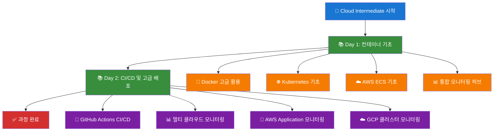

# 🎯 Cloud Intermediate 학습 경로

> 📋 **전체 과정**: 2일 (16시간) 클라우드 중급 과정  
> 📋 **학습 방식**: 100% 자동화 실습 중심  
> 📋 **선수 학습**: Cloud Basic 완료 필수  

---

## 🗺️ 전체 학습 경로



---

## 📚 Day 1: 컨테이너 기초 및 클라우드 서비스

### **🎯 학습 목표**
- Docker 고급 활용 기법 습득
- Kubernetes 기본 개념 이해
- 클라우드 컨테이너 서비스 활용
- 통합 모니터링 시스템 구축

### **📋 실습 구성**

#### **1교시: Docker 고급 활용 (90분)**
- **목표**: 멀티스테이지 빌드와 최적화 기법 학습
- **실습**: 최적화된 Dockerfile 작성 및 이미지 빌드
- **결과**: 이미지 크기 50% 이상 감소 달성

#### **2교시: Kubernetes 기초 (90분)**
- **목표**: Pod, Service, Deployment 기본 개념 학습
- **실습**: Kubernetes 리소스 생성 및 관리
- **결과**: Kubernetes 기본 리소스 이해 및 관리

#### **3교시: AWS ECS 기초 (90분)**
- **목표**: AWS ECS를 활용한 컨테이너 서비스 배포
- **실습**: ECS 클러스터 생성 및 태스크 정의
- **결과**: AWS ECS 클러스터 생성 및 Fargate 태스크 실행

#### **4교시: 통합 모니터링 허브 구축 (90분)**
- **목표**: 멀티 클라우드 환경을 위한 통합 모니터링 허브 구축
- **실습**: Phase 1 (AWS VM 기반 Global Prometheus + Grafana 설정)
- **결과**: 통합 모니터링 허브 구축 및 운영

---

## 📚 Day 2: CI/CD 및 고급 배포

### **🎯 학습 목표**
- CI/CD 파이프라인 구축 및 운영
- 멀티 클라우드 통합 모니터링 시스템 구축
- 실제 운영 환경 수준의 DevOps 역량 습득

### **📋 실습 구성**

#### **1교시: GitHub Actions CI/CD 파이프라인 (90분)**
- **목표**: 자동화된 빌드, 테스트, 배포 파이프라인 구축
- **실습**: GitHub Actions 워크플로우 작성 및 실행
- **결과**: 자동화된 테스트 및 빌드 파이프라인 구축

#### **2교시: 멀티 클라우드 통합 모니터링 시스템 (90분)**
- **목표**: AWS/GCP 멀티 클라우드 환경에서의 통합 모니터링 시스템 구축
- **실습**: Phase 1-2 (통합 모니터링 허브 + AWS 클러스터 모니터링)
- **결과**: 멀티 클라우드 통합 모니터링 시스템 구축

#### **3교시: AWS Application 모니터링 (90분)**
- **목표**: GitHub Actions를 통한 AWS EKS 애플리케이션 배포 및 Application 모니터링
- **실습**: Phase 3 (AWS Application 모니터링)
- **결과**: GitHub Actions CI/CD 파이프라인 구축 및 AWS EKS 애플리케이션 자동 배포

#### **4교시: GCP 클러스터 통합 모니터링 (90분)**
- **목표**: GCP GKE 클러스터 구축 및 멀티 클라우드 통합 모니터링 완성
- **실습**: Phase 4 (GCP 클러스터 모니터링)
- **결과**: GCP GKE 클러스터 구축 및 멀티 클라우드 통합 모니터링 시스템 완성

---

## 🛠️ 실습 환경 설정

### **필수 요구사항**
- **AWS 계정**: ECS, EKS 서비스 사용 권한
- **GCP 계정**: GKE, Cloud Run 서비스 사용 권한
- **GitHub 계정**: Actions 사용 권한
- **로컬 환경**: Docker, kubectl, AWS CLI, GCP CLI 설치

### **권장 환경**
- **AWS EC2**: t3.medium (2vCPU, 4GB RAM)
- **GCP GKE**: e2-medium 노드 3개
- **로컬 환경**: WSL2 또는 macOS/Linux

---

## 🚀 자동화 실행

### **전체 과정 자동화**
```bash
# 전체 과정 자동화 실행 (새로운 repo 구조)
cd repo/automation/
./cloud-intermediate-helper.sh

# 실시간 모니터링
cd ../tools/monitoring/
./lecture-monitor.sh --dashboard
```

### **개별 Day 실행**
```bash
# Day 1 실행 (새로운 구조)
cd repo/automation/day1/
./day1-practice.sh

# Day 2 실행 (새로운 구조)
cd repo/automation/day2/
./day2-practice.sh
```

### **개별 실습 실행**
```bash
# Docker 고급 실습 (새로운 구조)
cd repo/examples/day1/docker-advanced/
# 실습 코드 확인 후 수동 실행

# Kubernetes 기초 실습 (새로운 구조)
cd repo/examples/day1/kubernetes-basics/
# 실습 코드 확인 후 수동 실행

# AWS ECS 실습 (새로운 구조)
cd repo/examples/day1/cloud-container-services/
# 실습 코드 확인 후 수동 실행

# 모니터링 허브 구축 (새로운 구조)
cd repo/automation/monitoring/
./monitoring-stack.sh
```

---

## 📊 학습 성과 측정

### **Day 1 완료 기준**
- [ ] 멀티스테이지 Dockerfile 작성 완료
- [ ] Kubernetes 기본 리소스 생성 및 관리
- [ ] AWS ECS 클러스터 생성 및 태스크 실행
- [ ] 통합 모니터링 허브 구축 완료

### **Day 2 완료 기준**
- [ ] GitHub Actions CI/CD 파이프라인 구축
- [ ] 멀티 클라우드 통합 모니터링 시스템 구축
- [ ] AWS Application 모니터링 설정
- [ ] GCP 클러스터 통합 모니터링 완성

### **전체 과정 완료 기준**
- [ ] 모든 자동화 스크립트 정상 실행
- [ ] 실시간 모니터링 대시보드 동작
- [ ] 리소스 정리 자동화 완료
- [ ] 100% 커버리지 테스트 통과

---

## 🎓 다음 단계

### **Cloud Master 과정 준비**
- **고급 Kubernetes**: Helm, Operator, Service Mesh
- **멀티 클라우드**: AWS + GCP + Azure 통합 관리
- **DevSecOps**: 보안 통합 CI/CD 파이프라인
- **AI/ML Ops**: 머신러닝 모델 배포 및 관리

### **실무 적용**
- **프로덕션 환경**: 학습한 패턴을 실제 업무에 적용
- **팀 협업**: DevOps 문화 정착 및 자동화 확산
- **지속적 학습**: 최신 기술 트렌드 지속적 학습

---

## 📚 관련 문서

- [README.md](./README.md) - 과정 개요
- [Day1 강의안](./Day1_강의안.md) - 1일차 상세 가이드
- [Day2 강의안](./Day2_강의안.md) - 2일차 상세 가이드
- [통합 강의 시나리오](./통합강의시나리오.md) - 전체 과정 시나리오
- [통합 모니터링 시나리오](./통합모니터링시나리오.md) - 모니터링 구축 가이드

---

**🎯 체계적인 학습 경로를 따라 클라우드 중급 역량을 완성하세요!**
