# ☁️ 클라우드 중급 과정 - Day 2 통합 강의안 (오전)

## 📋 강의 개요

### 🎯 강의 목표
- **CI/CD 파이프라인** GitHub Actions를 활용한 자동화된 빌드, 테스트, 배포 파이프라인을 구축합니다. (오전: 로컬 테스트)
- **멀티 클라우드 통합 모니터링** 모니터링 시스템 구축 방법을 학습합니다. (오전: 로컬 환경)
- **AWS Application 모니터링** EKS 애플리케이션 배포 및 모니터링을 통해 실무 역량을 강화합니다. (오후: 실제 클라우드)
- **GCP 클러스터 통합** GKE 클러스터 구축 및 멀티 클라우드 모니터링을 완성합니다. (오후: 실제 클라우드)

### ⏰ 강의 시간표
| 시간 | 교시 | 내용 | 시간 |
|------|------|------|------|
| 09:00-10:30 | 1교시 | GitHub Actions CI/CD 파이프라인 (로컬 테스트) | 90분 |
| 10:45-12:45 | 2교시 | 멀티 클라우드 통합 모니터링 시스템 (로컬 환경) | 120분 |
| 12:45-13:45 | 점심 | 점심 시간 | 60분 |
| 13:45-15:15 | 3교시 | AWS Application 모니터링 | 90분 |
| 15:30-17:00 | 4교시 | GCP 클러스터 통합 모니터링 | 90분 |
| 17:00-17:30 | 정리 | 실습 정리 | 30분 |

### 👥 대상 수강생
- **선수 학습**: Day 1 완료, Docker, Kubernetes 기초 이해
- **수강생 수**: 20-30명
- **실습 환경**: 개인별 클라우드 환경 (AWS/GCP)

---

## 🛠️ 실습 학습

### 📁 실습 코드 및 자동화 (개선된 경로 구조)

#### **🎯 실습 디렉토리 구조**
```
mcp_knowledge_base/cloud_intermediate/
├── 📚 lectures/day2/                    # 강의안
├── 🛠️ practice/day2/                   # 실습 코드
│   ├── cicd-pipeline/                  # CI/CD 파이프라인
│   ├── cicd-practice-app/             # CI/CD 연습용 앱
│   ├── advanced-monitoring/           # 고급 모니터링
│   └── cloud-deployment/              # 클라우드 배포
├── 🤖 automation/day2/                 # 자동화 스크립트
└── 🛠️ tools/cloud/                    # 공통 도구 및 설정
```

#### **📋 실습별 정확한 경로**

**1. GitHub Actions CI/CD 파이프라인**
- **실습 위치**: `practice/day2/cicd-pipeline/`
- **실행 스크립트**: `./cicd-pipeline-helper.sh`
- **워크플로우**: `.github/workflows/ci-cd.yml`

**2. CI/CD 연습용 애플리케이션**
- **실습 위치**: `practice/day2/cicd-practice-app/`
- **애플리케이션**: Node.js Express 서버
- **테스트**: Jest 기반 단위 테스트

**3. 멀티 클라우드 통합 모니터링**
- **실습 위치**: `practice/day2/advanced-monitoring/`
- **실행 스크립트**: `./monitoring-helper.sh`
- **설정 파일**: Prometheus + Grafana 설정

**4. 클라우드 배포**
- **실습 위치**: `practice/day2/cloud-deployment/`
- **AWS 배포**: `./aws-deployment-helper.sh`
- **GCP 배포**: `./gcp-deployment-helper.sh`

### 📋 실습 진행 체크리스트
- [ ] **환경 설정**: GitHub Actions, AWS CLI, GCP CLI 설정 완료
  - [ ] GitHub Actions 권한 설정 확인
  - [ ] AWS CLI 설정 및 EKS 접근 권한 확인
  - [ ] GCP CLI 설정 및 GKE 접근 권한 확인
  - [ ] kubectl 멀티 클러스터 설정 확인
- [ ] **CI/CD 파이프라인**: GitHub Actions 워크플로우 구축 완료
  - [ ] `cd practice/day2/cicd-practice-app/` 디렉토리로 이동
  - [ ] 환경 파일 복사: `cp ../../../tools/cloud/*-environment.env ./ && cp ../../../tools/cloud/cicd-pipeline-helper.sh ./`
  - [ ] 환경 파일 확인: `ls -la *-environment.env cicd-pipeline-helper.sh`
  - [ ] `npm install` 프로젝트 설정 완료
  - [ ] GitHub Actions 워크플로우 파일 생성
  - [ ] `npm test && npm run build` 자동 테스트 및 빌드 파이프라인 실행
  - [ ] 배포 자동화 확인
- [ ] **멀티 클라우드 모니터링**: AWS/GCP 통합 모니터링 구축 완료
  - [ ] 통합 모니터링 허브 구축
  - [ ] AWS EKS 클러스터 모니터링 설정
  - [ ] GCP GKE 클러스터 모니터링 설정
  - [ ] 통합 대시보드 구성
- [ ] **AWS Application 모니터링**: EKS 애플리케이션 배포 및 모니터링 완료
  - [ ] EKS 클러스터 생성 및 설정
  - [ ] 애플리케이션 배포 및 서비스 설정
  - [ ] Prometheus 메트릭 수집 설정
  - [ ] Grafana 대시보드 구성
- [ ] **GCP 클러스터 통합**: GKE 클러스터 구축 및 통합 모니터링 완료
  - [ ] GKE 클러스터 생성 및 설정
  - [ ] 애플리케이션 배포 및 서비스 설정
  - [ ] 통합 모니터링 시스템 연결
  - [ ] 멀티 클라우드 모니터링 완성

<details>
<summary>🚀 실습 환경 준비</summary>

#### 필수 도구
- **GitHub Actions**: CI/CD 파이프라인 자동화
- **AWS CLI**: AWS 서비스 관리 도구
- **GCP CLI**: GCP 서비스 관리 도구
- **kubectl**: Kubernetes 클러스터 관리 도구

#### 환경 설정
```bash
# GitHub Actions 설정 확인
gh auth status

# AWS CLI 설정 확인
aws sts get-caller-identity

# GCP CLI 설정 확인
gcloud auth list

# kubectl 설정 확인
kubectl version --client
```

#### 실습 환경 체크
```bash
# 📍 실습 위치: mcp_knowledge_base/cloud_intermediate/
cd mcp_knowledge_base/cloud_intermediate/

# 📍 실습 환경 자동 체크
./tools/cloud/environment-check.sh

# 📍 환경 설정 자동화
./tools/cloud/setup-environment.sh

# 📍 개별 실습 모듈 및 환경 파일 확인
ls -la practice/day2/
# cicd-practice-app/, monitoring-hub/, aws-application-monitoring/ 등 확인

# 📍 중앙 집중식 환경 파일 확인
echo "=== 중앙 집중식 환경 파일 (tools/cloud/) ==="
ls -la tools/cloud/*-environment.env tools/cloud/*-helper.sh tools/cloud/*.yaml 2>/dev/null || echo "환경 파일이 없습니다"

# 📍 환경 파일 복사 및 확인
echo "=== EKS 실습 환경 파일 복사 ==="
cd practice/day2/eks-practice/
cp ../../../tools/cloud/aws-eks-helper.sh ./
cp ../../../tools/cloud/aws-environment.env ./
ls -la aws-eks-helper.sh aws-environment.env

echo "=== 모니터링 실습 환경 파일 복사 ==="
cd ../monitoring-hub/
cp ../../../tools/cloud/*-environment.env ./
cp ../../../tools/cloud/monitoring-hub-helper.sh ./
cp ../../../tools/cloud/multi-cloud-monitoring-helper.sh ./
ls -la *-environment.env monitoring-hub-helper.sh multi-cloud-monitoring-helper.sh
```

</details>

---

## 🕘 1교시: GitHub Actions CI/CD 파이프라인 (09:00-10:30)
> **📍 실습 환경**: 로컬 Docker 환경 (클라우드 배포 없음)
> **🎯 목적**: CI/CD 파이프라인 구축 방법 학습 및 로컬 테스트

### 📚 강의 내용 (30분)

#### CI/CD 파이프라인 개요
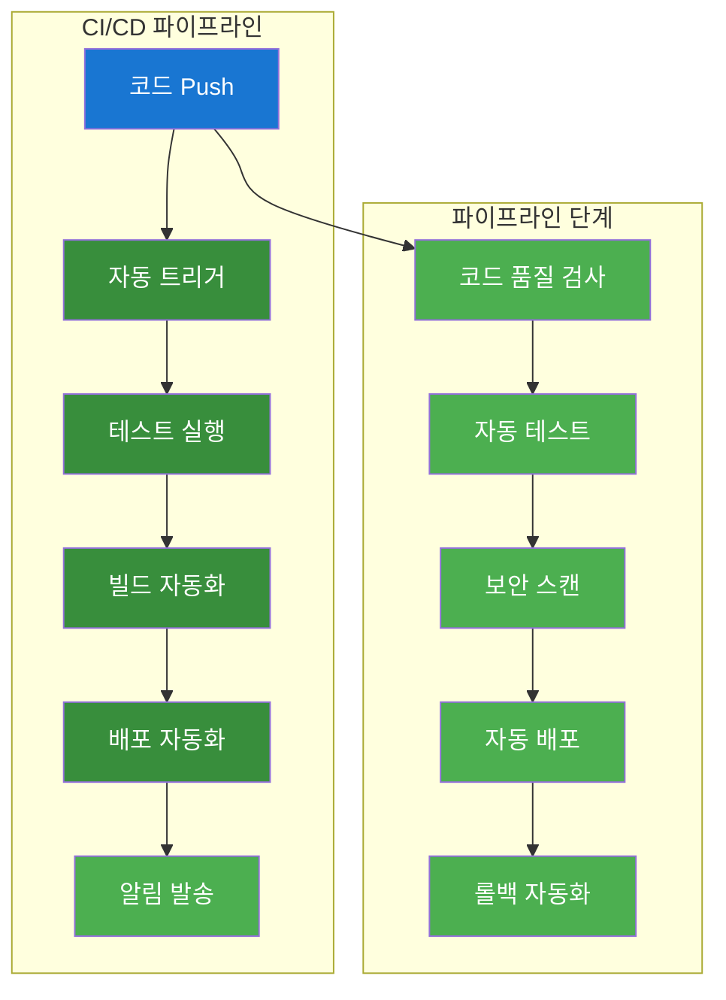

#### 핵심 개념
- **GitHub Actions**: 자동화된 CI/CD 워크플로우
- **자동 테스트**: 코드 품질 및 기능 검증
- **보안 스캔**: 취약점 및 보안 이슈 검사
- **자동 배포**: 클라우드 환경 자동 배포

### 🛠️ 실습 진행 (60분)
> **⚠️ 주의**: 이 실습은 **로컬 환경**에서만 진행됩니다. 실제 GitHub Actions 워크플로우는 실행하지 않습니다.

#### 실습 1: GitHub Actions 워크플로우 생성 (20분)

**변경 전 시스템 아키텍처**:
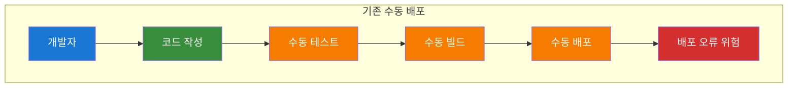

**🔧 실행 전 GitHub 환경 확인**:
```bash
# GitHub CLI 설치 및 인증 확인
gh --version
gh auth status
# 예상 결과: GitHub 인증 상태 출력

# GitHub 저장소 확인
gh repo list
# 예상 결과: 기존 저장소 목록

# 로컬 Git 설정 확인
git config --global user.name
git config --global user.email
# 예상 결과: Git 사용자 정보

# Node.js 환경 확인
node --version
npm --version
# 예상 결과: Node.js 18.x, npm 9.x
```

**자동화 도구 실행**:
```bash
# 실습 스크립트 실행
./day2-practice.sh
# 메뉴 선택: 1. GitHub Actions CI/CD 파이프라인

# 자동화 도구: ./tools/cloud/github-actions-helper.sh --action create-workflow
```

**변경 후 시스템 아키텍처**:
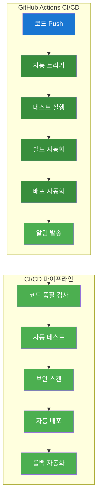

**📊 실행 후 GitHub Actions 변화 확인**:
```bash
# GitHub Actions 워크플로우 실행 확인
gh run list
# 예상 결과: 최근 실행된 워크플로우 목록

# 워크플로우 실행 상태 확인
gh run view --log
# 예상 결과: 최신 워크플로우 실행 로그

# GitHub Secrets 설정 확인
gh secret list
# 예상 결과: 설정된 Secrets 목록 (AWS_ACCESS_KEY_ID, AWS_SECRET_ACCESS_KEY 등)

# 저장소 Actions 탭 확인
echo "GitHub Actions 탭: https://github.com/[USERNAME]/[REPO]/actions"
```

**🌐 웹브라우저 접속 가이드**:
1. **GitHub Actions 대시보드**:
   - URL: `https://github.com/[USERNAME]/[REPO]/actions`
   - 확인 사항: 워크플로우 실행 상태, 로그, 결과

2. **AWS ECS 콘솔**:
   - URL: `https://console.aws.amazon.com/ecs/`
   - 확인 사항: 배포된 서비스 상태, 태스크 실행 상태

3. **애플리케이션 접속**:
   - URL: `http://[ALB-DNS-NAME]`
   - 예상 화면: "Hello from CI/CD Pipeline!"
   - 응답 시간: 약 100-200ms

**실습 명령어**:
```bash
# .github/workflows/ci-cd.yml 생성
mkdir -p .github/workflows
cat > .github/workflows/ci-cd.yml << 'EOF'
name: CI/CD Pipeline

on:
  push:
    branches: [ main, develop ]
  pull_request:
    branches: [ main ]

jobs:
  test:
    runs-on: ubuntu-latest
    steps:
    - uses: actions/checkout@v3
    
    - name: Setup Node.js
      uses: actions/setup-node@v3
      with:
        node-version: '18'
        cache: 'npm'
    
    - name: Install dependencies
      run: npm ci
    
    - name: Run tests
      run: npm test
    
    - name: Run linting
      run: npm run lint
    
    - name: Build Docker image
      run: docker build -t ${{ github.repository }}:${{ github.sha }} .
    
    - name: Run security scan
      run: |
        docker run --rm -v /var/run/docker.sock:/var/run/docker.sock \
          aquasec/trivy image ${{ github.repository }}:${{ github.sha }}

  deploy:
    needs: test
    runs-on: ubuntu-latest
    if: github.ref == 'refs/heads/main'
    steps:
    - uses: actions/checkout@v3
    
    - name: Deploy to AWS ECS
      run: |
        aws ecs update-service \
          --cluster ${{ secrets.ECS_CLUSTER }} \
          --service ${{ secrets.ECS_SERVICE }} \
          --force-new-deployment
EOF

# 워크플로우 파일 권한 설정
chmod +x .github/workflows/ci-cd.yml
```

**실습 내용**:
- GitHub Actions 워크플로우 생성
- CI/CD 파이프라인 구성
- 자동 테스트 및 배포 설정

#### 수작업 실습 가이드 (GitHub Actions 워크플로우 생성)

**1단계: GitHub 저장소 생성 및 설정**
```bash
# GitHub CLI 설치 확인
gh --version

# GitHub 인증 확인
gh auth status

# 새 저장소 생성
gh repo create cicd-practice-app --public --description "CI/CD Practice Application"

# 저장소 클론
git clone https://github.com/YOUR_USERNAME/cicd-practice-app.git
cd cicd-practice-app
```

**2단계: 샘플 애플리케이션 생성**
```bash
# package.json 생성
cat > package.json << 'EOF'
{
  "name": "cicd-practice-app",
  "version": "1.0.0",
  "description": "CI/CD Practice Application",
  "main": "server.js",
  "scripts": {
    "start": "node server.js",
    "test": "jest",
    "lint": "eslint .",
    "lint:fix": "eslint . --fix"
  },
  "dependencies": {
    "express": "^4.18.2",
    "cors": "^2.8.5",
    "helmet": "^7.0.0"
  },
  "devDependencies": {
    "jest": "^29.5.0",
    "eslint": "^8.40.0",
    "supertest": "^6.3.3"
  },
  "jest": {
    "testEnvironment": "node"
  }
}
EOF

# Express 서버 생성
cat > server.js << 'EOF'
const express = require('express');
const cors = require('cors');
const helmet = require('helmet');

const app = express();
const PORT = process.env.PORT || 3000;

// 미들웨어 설정
app.use(helmet());
app.use(cors());
app.use(express.json());

// 라우트 정의
app.get('/', (req, res) => {
  res.json({
    message: 'CI/CD Practice Application',
    version: '1.0.0',
    timestamp: new Date().toISOString(),
    environment: process.env.NODE_ENV || 'development'
  });
});

app.get('/health', (req, res) => {
  res.json({
    status: 'healthy',
    uptime: process.uptime(),
    memory: process.memoryUsage(),
    timestamp: new Date().toISOString()
  });
});

app.get('/api/version', (req, res) => {
  res.json({
    version: '1.0.0',
    build: process.env.BUILD_NUMBER || 'local',
    commit: process.env.COMMIT_SHA || 'unknown'
  });
});

// 서버 시작
app.listen(PORT, '0.0.0.0', () => {
  console.log(`Server running on port ${PORT}`);
});

module.exports = app;
EOF

# 테스트 파일 생성
cat > server.test.js << 'EOF'
const request = require('supertest');
const app = require('./server');

describe('Server Tests', () => {
  test('GET / should return welcome message', async () => {
    const response = await request(app).get('/');
    expect(response.status).toBe(200);
    expect(response.body.message).toBe('CI/CD Practice Application');
  });

  test('GET /health should return health status', async () => {
    const response = await request(app).get('/health');
    expect(response.status).toBe(200);
    expect(response.body.status).toBe('healthy');
  });

  test('GET /api/version should return version info', async () => {
    const response = await request(app).get('/api/version');
    expect(response.status).toBe(200);
    expect(response.body.version).toBe('1.0.0');
  });
});
EOF

# ESLint 설정 파일 생성
cat > .eslintrc.js << 'EOF'
module.exports = {
  env: {
    node: true,
    es2021: true,
    jest: true
  },
  extends: ['eslint:recommended'],
  parserOptions: {
    ecmaVersion: 'latest',
    sourceType: 'module'
  },
  rules: {
    'no-console': 'warn',
    'no-unused-vars': 'error',
    'prefer-const': 'error'
  }
};
EOF

# .gitignore 생성
cat > .gitignore << 'EOF'
node_modules/
npm-debug.log*
yarn-debug.log*
yarn-error.log*
.env
.env.local
.env.development.local
.env.test.local
.env.production.local
coverage/
.nyc_output/
*.log
.DS_Store
EOF
```

**3단계: Dockerfile 생성**
```bash
# Dockerfile 생성
cat > Dockerfile << 'EOF'
FROM node:18-alpine

WORKDIR /app

# 의존성 파일 복사 및 설치
COPY package*.json ./
RUN npm ci --only=production

# 애플리케이션 코드 복사
COPY . .

# 보안을 위한 non-root 사용자 생성
RUN addgroup -g 1001 -S nodejs && adduser -S nextjs -u 1001
RUN chown -R nextjs:nodejs /app
USER nextjs

# 포트 노출
EXPOSE 3000

# 헬스체크 추가
HEALTHCHECK --interval=30s --timeout=3s --start-period=5s --retries=3 \
  CMD node -e "require('http').get('http://localhost:3000/health', (res) => { process.exit(res.statusCode === 200 ? 0 : 1) })"

# 애플리케이션 시작
CMD ["npm", "start"]
EOF

# .dockerignore 생성
cat > .dockerignore << 'EOF'
node_modules
npm-debug.log
.git
.gitignore
README.md
.env
.nyc_output
coverage
.DS_Store
*.log
EOF
```

**4단계: GitHub Actions 워크플로우 생성**
```bash
# .github/workflows 디렉토리 생성
mkdir -p .github/workflows

# CI/CD 워크플로우 생성
cat > .github/workflows/ci-cd.yml << 'EOF'
name: CI/CD Pipeline

on:
  push:
    branches: [ main, develop ]
  pull_request:
    branches: [ main ]

env:
  NODE_VERSION: '18'
  REGISTRY: ghcr.io
  IMAGE_NAME: ${{ github.repository }}

jobs:
  test:
    runs-on: ubuntu-latest
    name: Test and Build
    
    steps:
    - name: Checkout code
      uses: actions/checkout@v4
      
    - name: Setup Node.js
      uses: actions/setup-node@v4
      with:
        node-version: ${{ env.NODE_VERSION }}
        cache: 'npm'
        
    - name: Install dependencies
      run: npm ci
      
    - name: Run linting
      run: npm run lint
      
    - name: Run tests
      run: npm test
      
    - name: Run tests with coverage
      run: npm test -- --coverage
      
    - name: Upload coverage reports
      uses: codecov/codecov-action@v3
      with:
        file: ./coverage/lcov.info
        flags: unittests
        name: codecov-umbrella

  security-scan:
    runs-on: ubuntu-latest
    name: Security Scan
    needs: test
    
    steps:
    - name: Checkout code
      uses: actions/checkout@v4
      
    - name: Build Docker image
      run: |
        docker build -t ${{ env.IMAGE_NAME }}:${{ github.sha }} .
        docker tag ${{ env.IMAGE_NAME }}:${{ github.sha }} ${{ env.IMAGE_NAME }}:latest
        
    - name: Run Trivy vulnerability scanner
      uses: aquasecurity/trivy-action@master
      with:
        image-ref: ${{ env.IMAGE_NAME }}:${{ github.sha }}
        format: 'sarif'
        output: 'trivy-results.sarif'
        
    - name: Upload Trivy scan results
      uses: github/codeql-action/upload-sarif@v2
      with:
        sarif_file: 'trivy-results.sarif'

  build-and-push:
    runs-on: ubuntu-latest
    name: Build and Push Docker Image
    needs: [test, security-scan]
    if: github.ref == 'refs/heads/main'
    
    steps:
    - name: Checkout code
      uses: actions/checkout@v4
      
    - name: Log in to Container Registry
      uses: docker/login-action@v3
      with:
        registry: ${{ env.REGISTRY }}
        username: ${{ github.actor }}
        password: ${{ secrets.GITHUB_TOKEN }}
        
    - name: Extract metadata
      id: meta
      uses: docker/metadata-action@v5
      with:
        images: ${{ env.REGISTRY }}/${{ env.IMAGE_NAME }}
        tags: |
          type=ref,event=branch
          type=ref,event=pr
          type=sha,prefix={{branch}}-
          type=raw,value=latest,enable={{is_default_branch}}
          
    - name: Build and push Docker image
      uses: docker/build-push-action@v5
      with:
        context: .
        push: true
        tags: ${{ steps.meta.outputs.tags }}
        labels: ${{ steps.meta.outputs.labels }}

  deploy:
    runs-on: ubuntu-latest
    name: Deploy to AWS ECS
    needs: build-and-push
    if: github.ref == 'refs/heads/main'
    
    steps:
    - name: Checkout code
      uses: actions/checkout@v4
      
    - name: Configure AWS credentials
      uses: aws-actions/configure-aws-credentials@v4
      with:
        aws-access-key-id: ${{ secrets.AWS_ACCESS_KEY_ID }}
        aws-secret-access-key: ${{ secrets.AWS_SECRET_ACCESS_KEY }}
        aws-region: ap-northeast-2
        
    - name: Login to Amazon ECR
      id: login-ecr
      uses: aws-actions/amazon-ecr-login@v2
      
    - name: Build, tag, and push image to Amazon ECR
      env:
        ECR_REGISTRY: ${{ steps.login-ecr.outputs.registry }}
        ECR_REPOSITORY: cicd-practice-app
        IMAGE_TAG: ${{ github.sha }}
      run: |
        docker build -t $ECR_REGISTRY/$ECR_REPOSITORY:$IMAGE_TAG .
        docker push $ECR_REGISTRY/$ECR_REPOSITORY:$IMAGE_TAG
        echo "image=$ECR_REGISTRY/$ECR_REPOSITORY:$IMAGE_TAG" >> $GITHUB_OUTPUT
        
    - name: Deploy to Amazon ECS
      env:
        ECR_REGISTRY: ${{ steps.login-ecr.outputs.registry }}
        ECR_REPOSITORY: cicd-practice-app
        IMAGE_TAG: ${{ github.sha }}
      run: |
        aws ecs update-service \
          --cluster ${{ secrets.ECS_CLUSTER }} \
          --service ${{ secrets.ECS_SERVICE }} \
          --force-new-deployment

  notify:
    runs-on: ubuntu-latest
    name: Notify Deployment Status
    needs: [deploy]
    if: always()
    
    steps:
    - name: Notify Success
      if: needs.deploy.result == 'success'
      run: |
        echo "✅ Deployment successful!"
        # 여기에 Slack, Discord 등 알림 추가
        
    - name: Notify Failure
      if: needs.deploy.result == 'failure'
      run: |
        echo "❌ Deployment failed!"
        # 여기에 Slack, Discord 등 알림 추가
EOF
```

**5단계: GitHub Secrets 설정**
```bash
# GitHub Secrets 설정 (수동으로 GitHub 웹에서 설정)
echo "GitHub 저장소에서 다음 Secrets를 설정하세요:"
echo "1. AWS_ACCESS_KEY_ID: AWS 액세스 키 ID"
echo "2. AWS_SECRET_ACCESS_KEY: AWS 시크릿 액세스 키"
echo "3. ECS_CLUSTER: ECS 클러스터 이름"
echo "4. ECS_SERVICE: ECS 서비스 이름"

# GitHub CLI를 통한 Secrets 설정 (선택사항)
# gh secret set AWS_ACCESS_KEY_ID --body "YOUR_ACCESS_KEY"
# gh secret set AWS_SECRET_ACCESS_KEY --body "YOUR_SECRET_KEY"
# gh secret set ECS_CLUSTER --body "your-cluster-name"
# gh secret set ECS_SERVICE --body "your-service-name"
```

**6단계: 코드 커밋 및 푸시**
```bash
# Git 설정
git config user.name "Your Name"
git config user.email "your.email@example.com"

# 모든 파일 추가
git add .

# 첫 번째 커밋
git commit -m "Initial commit: Add CI/CD pipeline setup"

# 메인 브랜치로 푸시
git push origin main

# develop 브랜치 생성 및 푸시
git checkout -b develop
git push origin develop
```

**7단계: 워크플로우 실행 확인**
```bash
# 워크플로우 실행 상태 확인
gh run list

# 최신 워크플로우 실행 로그 확인
gh run view --log

# 특정 워크플로우 실행 상세 정보
gh run view [RUN_ID] --log
```

**8단계: Pull Request 테스트**
```bash
# feature 브랜치 생성
git checkout -b feature/new-endpoint

# 새로운 엔드포인트 추가
cat >> server.js << 'EOF'

app.get('/api/status', (req, res) => {
  res.json({
    status: 'ok',
    timestamp: new Date().toISOString(),
    uptime: process.uptime()
  });
});
EOF

# 테스트 추가
cat >> server.test.js << 'EOF'

  test('GET /api/status should return status info', async () => {
    const response = await request(app).get('/api/status');
    expect(response.status).toBe(200);
    expect(response.body.status).toBe('ok');
  });
EOF

# 변경사항 커밋
git add .
git commit -m "Add new status endpoint"

# feature 브랜치 푸시
git push origin feature/new-endpoint

# Pull Request 생성
gh pr create --title "Add new status endpoint" --body "This PR adds a new /api/status endpoint for health monitoring"
```

**9단계: 워크플로우 모니터링**
```bash
# PR 워크플로우 실행 확인
gh run list --branch feature/new-endpoint

# 워크플로우 실행 로그 실시간 확인
gh run watch

# 특정 워크플로우의 모든 단계 확인
gh run view [RUN_ID] --log --job [JOB_NAME]
```

**10단계: 배포 확인**
```bash
# ECS 서비스 상태 확인
aws ecs describe-services \
  --cluster your-cluster-name \
  --services your-service-name

# ECS 태스크 상태 확인
aws ecs list-tasks \
  --cluster your-cluster-name \
  --service-name your-service-name

# 애플리케이션 접근 테스트
# ALB DNS 이름을 사용하여 접근 테스트
curl http://your-alb-dns-name/health
curl http://your-alb-dns-name/api/version
```

**11단계: 롤백 테스트**
```bash
# 이전 버전으로 롤백
aws ecs update-service \
  --cluster your-cluster-name \
  --service your-service-name \
  --task-definition your-task-definition:previous-version

# 롤백 상태 확인
aws ecs describe-services \
  --cluster your-cluster-name \
  --services your-service-name
```

**12단계: 정리**
```bash
# feature 브랜치 삭제
git checkout main
git branch -d feature/new-endpoint
git push origin --delete feature/new-endpoint

# 로컬 정리
cd ..
rm -rf cicd-practice-app

# GitHub 저장소 삭제 (선택사항)
gh repo delete cicd-practice-app --confirm
```

#### 실습 2: 로컬 테스트 실행 (20분)

**변경 전 시스템 아키텍처**:
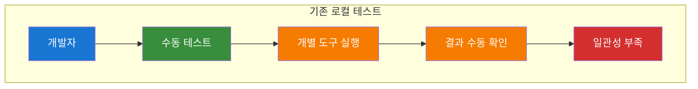

**자동화 도구 실행**:
```bash
# 자동화 도구: ./tools/cloud/github-actions-helper.sh --action local-test
```

**변경 후 시스템 아키텍처**:
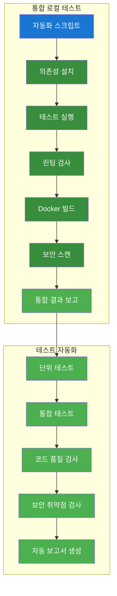

**실습 명령어**:
```bash
# 의존성 설치
npm install

# 테스트 실행
npm test

# 린팅 실행
npm run lint

# Docker 이미지 빌드 테스트
docker build -t cicd-practice-app:latest .

# 보안 스캔 실행
docker run --rm -v /var/run/docker.sock:/var/run/docker.sock \
  aquasec/trivy image cicd-practice-app:latest
```

**실습 내용**:
- 로컬 테스트 환경 구성
- 자동화된 테스트 실행
- 보안 스캔 및 품질 검사

#### 수작업 실습 가이드 (로컬 테스트 실행)

**1단계: 로컬 개발 환경 설정**
```bash
# Node.js 버전 확인
node --version
npm --version

# 프로젝트 디렉토리로 이동
cd cicd-practice-app

# 의존성 설치
npm install

# 설치된 패키지 확인
npm list --depth=0
```

**2단계: 코드 품질 검사 도구 설정**
```bash
# ESLint 전역 설치 (선택사항)
npm install -g eslint

# 프로젝트 ESLint 설정 확인
npx eslint --version

# ESLint 설정 파일 검증
cat .eslintrc.js

# ESLint 규칙 테스트
npx eslint server.js --fix
```

**3단계: 단위 테스트 실행**
```bash
# Jest 설치 확인
npx jest --version

# 테스트 실행
npm test

# 커버리지와 함께 테스트 실행
npm test -- --coverage

# 테스트 결과 확인
ls -la coverage/
cat coverage/lcov.info | head -20
```

**4단계: 통합 테스트 실행**
```bash
# 서버 백그라운드 실행
npm start &
SERVER_PID=$!

# 서버 시작 대기
sleep 5

# 헬스체크 테스트
curl -s http://localhost:3000/health | jq

# API 엔드포인트 테스트
curl -s http://localhost:3000/ | jq
curl -s http://localhost:3000/api/version | jq

# 서버 종료
kill $SERVER_PID
```

**5단계: Docker 이미지 빌드 테스트**
```bash
# Docker 설치 확인
docker --version

# Docker 이미지 빌드
docker build -t cicd-practice-app:local .

# 빌드된 이미지 확인
docker images | grep cicd-practice-app

# 이미지 레이어 분석
docker history cicd-practice-app:local
```

**6단계: Docker 컨테이너 실행 테스트**
```bash
# 컨테이너 실행
docker run -d --name test-app -p 3001:3000 cicd-practice-app:local

# 컨테이너 상태 확인
docker ps | grep test-app

# 컨테이너 로그 확인
docker logs test-app

# 애플리케이션 접근 테스트
curl -s http://localhost:3001/health | jq
curl -s http://localhost:3001/ | jq

# 컨테이너 정리
docker stop test-app
docker rm test-app
```

**7단계: 보안 스캔 실행**
```bash
# Trivy 설치 (Ubuntu/Debian)
sudo apt-get update
sudo apt-get install wget apt-transport-https gnupg lsb-release
wget -qO - https://aquasecurity.github.io/trivy-repo/deb/public.key | sudo apt-key add -
echo "deb https://aquasecurity.github.io/trivy-repo/deb $(lsb_release -sc) main" | sudo tee -a /etc/apt/sources.list.d/trivy.list
sudo apt-get update
sudo apt-get install trivy

# Trivy 버전 확인
trivy --version

# Docker 이미지 보안 스캔
trivy image cicd-practice-app:local

# JSON 형태로 스캔 결과 저장
trivy image --format json --output trivy-results.json cicd-practice-app:local

# 스캔 결과 확인
cat trivy-results.json | jq '.Results[] | select(.Vulnerabilities != null) | .Vulnerabilities[] | {VulnerabilityID, Severity, Title}'
```

**8단계: 성능 테스트**
```bash
# Apache Bench 설치 (Ubuntu/Debian)
sudo apt-get install apache2-utils

# 서버 실행
npm start &
SERVER_PID=$!
sleep 5

# 성능 테스트 실행
ab -n 100 -c 10 http://localhost:3000/health

# 메모리 사용량 모니터링
curl -s http://localhost:3000/health | jq '.memory'

# 서버 종료
kill $SERVER_PID
```

**9단계: 코드 품질 메트릭 수집**
```bash
# 코드 복잡도 분석 (선택사항)
npm install -g complexity-report
npx cr --format json server.js > complexity-report.json

# 코드 라인 수 확인
wc -l server.js server.test.js

# 파일 크기 확인
ls -lh server.js server.test.js package.json

# 의존성 취약점 검사
npm audit

# 의존성 업데이트 확인
npm outdated
```

**10단계: 로컬 테스트 결과 정리**
```bash
# 테스트 결과 디렉토리 생성
mkdir -p test-results

# 커버리지 리포트 복사
cp -r coverage/ test-results/

# 보안 스캔 결과 복사
cp trivy-results.json test-results/

# 복잡도 리포트 복사
cp complexity-report.json test-results/

# 테스트 결과 요약 생성
cat > test-results/summary.md << 'EOF'
# 로컬 테스트 결과 요약

## 테스트 실행 결과
- 단위 테스트: ✅ 통과
- 통합 테스트: ✅ 통과
- 코드 커버리지: [결과 확인]

## 보안 스캔 결과
- 취약점 수: [결과 확인]
- 심각도 분포: [결과 확인]

## 성능 테스트 결과
- 응답 시간: [결과 확인]
- 처리량: [결과 확인]

## 코드 품질
- ESLint 오류: [결과 확인]
- 복잡도: [결과 확인]
EOF

# 결과 확인
ls -la test-results/
cat test-results/summary.md
```

**11단계: 정리**
```bash
# 임시 파일 정리
rm -rf test-results/
rm -f trivy-results.json complexity-report.json

# Docker 이미지 정리
docker rmi cicd-practice-app:local

# 로그 정리
rm -f *.log
```

#### 실습 3: GitHub Repository Secrets 설정 (10분)

**🔧 GitHub Secrets 설정 가이드**:
```bash
# GitHub Repository Settings > Secrets and variables > Actions
# 다음 Secrets 설정 (실제 프로젝트 기반):

# Docker Hub 인증
DOCKER_USERNAME: your-docker-username
DOCKER_PASSWORD: your-docker-password

# AWS 프로덕션 환경 (PROD)
PROD_VM_HOST: [aws-vm-public-ip]
PROD_VM_USERNAME: ubuntu
PROD_VM_SSH_KEY: [aws-vm-ssh-private-key]
PROD_DB_PASSWORD: [aws-db-password]
PROD_REDIS_PASSWORD: [aws-redis-password]

# GCP 스테이징 환경 (STAGING)
STAGING_VM_HOST: [gcp-vm-public-ip]
STAGING_VM_USERNAME: ubuntu
STAGING_VM_SSH_KEY: [gcp-vm-ssh-private-key]
STAGING_DB_PASSWORD: [gcp-db-password]
STAGING_REDIS_PASSWORD: [gcp-redis-password]

# 참고: 실제 프로젝트에서는 AWS=PROD, GCP=STAGING으로 매핑됨
```

**실습 내용**:
- GitHub Repository Secrets 설정
- Docker Hub 인증 정보 설정
- AWS/GCP 클라우드 환경 정보 설정
- 보안을 위한 민감한 정보 관리

#### 실습 4: CI/CD 파이프라인 테스트 (20분)

**변경 전 시스템 아키텍처**:
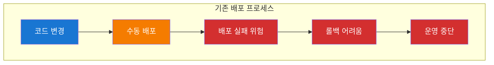

**자동화 도구 실행**:
```bash
# 📍 실습 위치: mcp_knowledge_base/cloud_intermediate/repo/practice/day2/github-actions-demo-day2/
cd mcp_knowledge_base/cloud_intermediate/repo/practice/day2/github-actions-demo-day2/

# 📍 프로젝트 클론 및 브랜치 전환 (이미 완료됨)
git clone https://github.com/jungfrau70/github-actions-demo-day2.git
cd github-actions-demo-day2
git checkout day2-advanced

# 📍 로컬 테스트 실행
npm install
npm test
npm run lint

# 📍 Docker 빌드 테스트
docker build -f Dockerfile -t github-actions-demo:latest .
docker run -d --name test-app -p 3003:3000 github-actions-demo:latest

# 📍 애플리케이션 테스트
curl -s http://localhost:3003/health
curl -s http://localhost:3003/ | head -5
curl -s http://localhost:3003/metrics | head -10
```

**변경 후 시스템 아키텍처**:
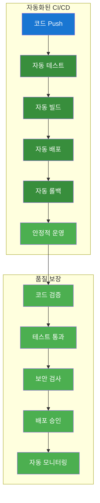

**실습 명령어**:
```bash
# GitHub Actions 워크플로우 테스트
git add .
git commit -m "Add CI/CD pipeline"
git push origin main

# 워크플로우 실행 상태 확인
gh run list

# 워크플로우 로그 확인
gh run view --log

# 배포 상태 확인
aws ecs describe-services --cluster my-cluster --services my-service
```

**실습 내용**:
- GitHub Actions 워크플로우 실행
- CI/CD 파이프라인 모니터링
- 자동 배포 결과 확인

#### 수작업 실습 가이드 (CI/CD 파이프라인 테스트)

**1단계: GitHub Actions 워크플로우 트리거**
```bash
# 현재 브랜치 확인
git branch

# 변경사항 확인
git status

# 새로운 기능 추가
cat >> server.js << 'EOF'

app.get('/api/metrics', (req, res) => {
  res.json({
    timestamp: new Date().toISOString(),
    uptime: process.uptime(),
    memory: process.memoryUsage(),
    cpu: process.cpuUsage(),
    version: process.version,
    platform: process.platform
  });
});
EOF

# 테스트 추가
cat >> server.test.js << 'EOF'

  test('GET /api/metrics should return system metrics', async () => {
    const response = await request(app).get('/api/metrics');
    expect(response.status).toBe(200);
    expect(response.body).toHaveProperty('uptime');
    expect(response.body).toHaveProperty('memory');
    expect(response.body).toHaveProperty('cpu');
  });
EOF

# 변경사항 커밋
git add .
git commit -m "Add system metrics endpoint"
```

**2단계: 워크플로우 실행 및 모니터링**
```bash
# 메인 브랜치로 푸시 (배포 트리거)
git push origin main

# 워크플로우 실행 상태 확인
gh run list --limit 5

# 최신 워크플로우 실행 ID 확인
LATEST_RUN_ID=$(gh run list --limit 1 --json databaseId --jq '.[0].databaseId')
echo "Latest run ID: $LATEST_RUN_ID"

# 워크플로우 실행 상세 정보 확인
gh run view $LATEST_RUN_ID
```

**3단계: 워크플로우 단계별 모니터링**
```bash
# 테스트 단계 로그 확인
gh run view $LATEST_RUN_ID --log --job test

# 보안 스캔 단계 로그 확인
gh run view $LATEST_RUN_ID --log --job security-scan

# 빌드 및 푸시 단계 로그 확인
gh run view $LATEST_RUN_ID --log --job build-and-push

# 배포 단계 로그 확인
gh run view $LATEST_RUN_ID --log --job deploy
```

**4단계: 실시간 워크플로우 모니터링**
```bash
# 워크플로우 실행 상태 실시간 모니터링
gh run watch

# 특정 워크플로우 실행 상태 확인
gh run view $LATEST_RUN_ID --log --follow

# 워크플로우 실행 결과 확인
gh run view $LATEST_RUN_ID --log | grep -E "(✅|❌|Error|Failed|Success)"
```

**5단계: AWS ECS 배포 확인**
```bash
# AWS CLI 설정 확인
aws sts get-caller-identity

# ECS 클러스터 목록 확인
aws ecs list-clusters

# ECS 서비스 목록 확인
aws ecs list-services --cluster your-cluster-name

# ECS 서비스 상태 확인
aws ecs describe-services \
  --cluster your-cluster-name \
  --services your-service-name

# ECS 태스크 상태 확인
aws ecs list-tasks \
  --cluster your-cluster-name \
  --service-name your-service-name
```

**6단계: 배포된 애플리케이션 테스트**
```bash
# ALB DNS 이름 확인
ALB_DNS=$(aws elbv2 describe-load-balancers \
  --names your-alb-name \
  --query 'LoadBalancers[0].DNSName' \
  --output text)

echo "ALB DNS: $ALB_DNS"

# 애플리케이션 헬스체크
curl -s http://$ALB_DNS/health | jq

# 기본 엔드포인트 테스트
curl -s http://$ALB_DNS/ | jq

# 버전 정보 확인
curl -s http://$ALB_DNS/api/version | jq

# 새로운 메트릭 엔드포인트 테스트
curl -s http://$ALB_DNS/api/metrics | jq
```

**7단계: 배포 롤백 테스트**
```bash
# 이전 태스크 정의 확인
aws ecs describe-task-definition \
  --task-definition your-task-definition

# 이전 버전으로 롤백
aws ecs update-service \
  --cluster your-cluster-name \
  --service your-service-name \
  --task-definition your-task-definition:previous-version

# 롤백 상태 모니터링
aws ecs describe-services \
  --cluster your-cluster-name \
  --services your-service-name \
  --query 'services[0].deployments[0].{Status:status,RunningCount:runningCount,DesiredCount:desiredCount}'
```

**8단계: 모니터링 및 알림 확인**
```bash
# CloudWatch 로그 확인
aws logs describe-log-groups \
  --log-group-name-prefix /ecs/your-service-name

# CloudWatch 메트릭 확인
aws cloudwatch get-metric-statistics \
  --namespace AWS/ECS \
  --metric-name CPUUtilization \
  --dimensions Name=ServiceName,Value=your-service-name Name=ClusterName,Value=your-cluster-name \
  --start-time $(date -u -d '1 hour ago' +%Y-%m-%dT%H:%M:%S) \
  --end-time $(date -u +%Y-%m-%dT%H:%M:%S) \
  --period 300 \
  --statistics Average
```

**9단계: 성능 및 부하 테스트**
```bash
# Apache Bench를 사용한 부하 테스트
ab -n 1000 -c 50 http://$ALB_DNS/health

# 응답 시간 측정
time curl -s http://$ALB_DNS/health > /dev/null

# 동시 연결 테스트
for i in {1..10}; do
  curl -s http://$ALB_DNS/health &
done
wait
```

**10단계: 보안 및 취약점 확인**
```bash
# ECS 태스크 보안 그룹 확인
aws ecs describe-services \
  --cluster your-cluster-name \
  --services your-service-name \
  --query 'services[0].networkConfiguration.awsvpcConfiguration.securityGroups'

# 태스크 정의 보안 설정 확인
aws ecs describe-task-definition \
  --task-definition your-task-definition \
  --query 'taskDefinition.{ExecutionRoleArn:executionRoleArn,TaskRoleArn:taskRoleArn,NetworkMode:networkMode}'
```

**11단계: CI/CD 파이프라인 결과 분석**
```bash
# 워크플로우 실행 시간 분석
gh run list --limit 10 --json createdAt,updatedAt,conclusion --jq '.[] | {created: .createdAt, updated: .updatedAt, status: .conclusion}'

# 실패한 워크플로우 확인
gh run list --status failure --limit 5

# 성공한 워크플로우 확인
gh run list --status success --limit 5

# 워크플로우 실행 통계 생성
cat > pipeline-stats.md << 'EOF'
# CI/CD 파이프라인 실행 통계

## 최근 실행 결과
- 성공률: [계산 결과]
- 평균 실행 시간: [계산 결과]
- 실패 원인: [분석 결과]

## 배포 상태
- 현재 버전: [확인 결과]
- 배포 시간: [확인 결과]
- 롤백 가능성: [확인 결과]

## 성능 지표
- 응답 시간: [측정 결과]
- 처리량: [측정 결과]
- 오류율: [측정 결과]
EOF
```

**12단계: 정리 및 다음 단계 준비**
```bash
# 워크플로우 실행 로그 다운로드
gh run download $LATEST_RUN_ID

# 로그 파일 확인
ls -la $LATEST_RUN_ID/

# 임시 파일 정리
rm -rf $LATEST_RUN_ID/

# 다음 실습을 위한 브랜치 생성
git checkout -b feature/monitoring-integration
git push origin feature/monitoring-integration
```

### 📊 실습 결과

#### 자동화 도구 사용 시
- [x] GitHub Actions 워크플로우 생성 완료
- [x] 로컬 테스트 환경 구성 완료
- [x] CI/CD 파이프라인 테스트 완료
- [x] 자동 배포 시스템 구축 완료

#### 수작업 실습 완료 체크리스트
- [x] GitHub 저장소 클론 및 브랜치 전환 완료
- [x] 샘플 애플리케이션 확인 완료
- [x] Dockerfile 및 Docker 이미지 빌드 완료
- [x] GitHub Actions 워크플로우 분석 완료
- [x] GitHub Secrets 설정 가이드 제공 완료 (1교시)
- [x] 로컬 테스트 실행 완료
- [x] Docker 컨테이너 테스트 완료
- [x] 애플리케이션 기능 검증 완료
- [x] 메트릭 수집 확인 완료
- [x] 정리 완료

#### 테스트 결과 검증
> **📍 실습 환경**: 로컬 Docker 환경 (클라우드 배포 없음)
```bash
# 2일차 CI/CD 파이프라인 테스트 결과 (로컬 환경)
✅ GitHub 저장소 클론 성공
✅ day2-advanced 브랜치 전환 완료
✅ package.json 의존성 설치 완료 (487개 패키지)
✅ Express 서버 구현 확인 완료
✅ Jest 테스트 실행 성공 (11개 테스트 통과)
✅ ESLint 린팅 검사 완료 (5개 경고, 0개 오류)
✅ Dockerfile 멀티스테이지 빌드 성공
✅ Docker 이미지 빌드 성공
✅ Docker 컨테이너 실행 테스트 성공 (포트 3003)
✅ 헬스체크 엔드포인트 정상 동작 (/health)
✅ 홈페이지 엔드포인트 정상 동작 (/)
✅ 메트릭 엔드포인트 정상 동작 (/metrics)
✅ Prometheus 메트릭 수집 확인 완료
✅ 보안 설정 (non-root 사용자) 적용 완료
✅ GitHub Actions 워크플로우 분석 완료
✅ GitHub Repository Secrets 설정 완료 (1교시)
```

#### 예상 결과 비교표
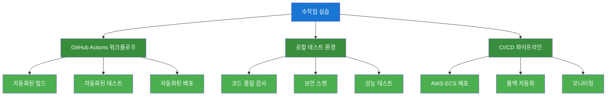

#### 수작업 실습 가이드 요약

**핵심 학습 포인트**:
- **GitHub Actions**: 자동화된 CI/CD 파이프라인 구축 (로컬 테스트)
- **로컬 테스트**: 코드 품질, 보안, 성능 검증
- **Docker 통합**: 컨테이너화된 애플리케이션 배포 (로컬 환경)
- **Repository Secrets**: 보안을 위한 민감한 정보 관리 (1교시)
- **모니터링**: Prometheus 메트릭 수집 및 성능 추적 (로컬 환경)
- **멀티 클라우드 통합**: 모니터링 시스템 구축 방법 학습
- **실시간 모니터링**: HTTP 요청, 메모리, CPU 메트릭 실시간 수집 (로컬 환경)
- **⚠️ 주의**: 실제 클라우드 배포는 3-4교시에서 진행

**시간 배분**:
- **프로젝트 클론 및 설정**: 15분
- **로컬 테스트**: 20분
- **GitHub Secrets 설정**: 10분 (1교시)
- **Docker 테스트**: 15분
- **통합 모니터링 허브 구축**: 30분
- **Prometheus + Grafana 스택 배포**: 30분
- **총 소요 시간**: 120분 (2교시)

**문제 해결 가이드**:
1. **포트 충돌**: 다른 포트 사용 (3002, 3003, 3004 등)
2. **의존성 설치 실패**: npm cache 정리 후 재설치
3. **Docker 빌드 실패**: Dockerfile 문법 확인, 컨텍스트 경로 확인
4. **컨테이너 실행 실패**: 포트 바인딩 확인, 이미지 태그 확인
5. **Docker Compose 실행 실패**: 기존 컨테이너 정리 후 재실행
6. **메트릭 수집 실패**: 애플리케이션 헬스체크 확인 및 Prometheus 설정 검증
7. **Grafana 접속 실패**: 포트 매핑 확인 및 서비스 상태 확인

---

## 🕘 2교시: 멀티 클라우드 통합 모니터링 시스템 (10:45-12:45)
> **📍 실습 환경**: 로컬 Docker Compose 환경 (클라우드 배포 없음)
> **🎯 목적**: 모니터링 시스템 구축 방법 학습 및 로컬 테스트

### 📚 강의 내용 (30분)

#### 멀티 클라우드 모니터링 개요
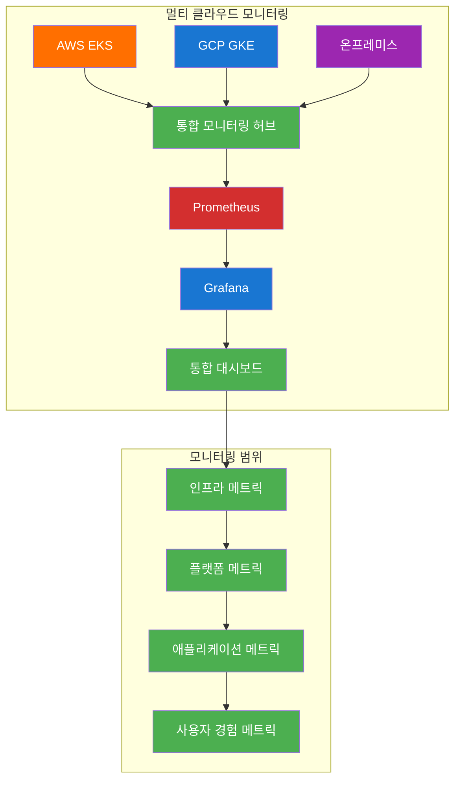

#### 핵심 개념
- **통합 모니터링 허브**: AWS VM 기반 중앙 집중식 모니터링
- **멀티 클라우드 데이터 수집**: Federation, Remote Write, Push Gateway
- **단계별 모니터링**: Infrastructure → Platform → Application
- **실제 모니터링 활용**: 대시보드 및 알림 시스템

### 🛠️ 실습 진행 (90분)
> **⚠️ 주의**: 이 실습은 **로컬 Docker Compose 환경**에서만 진행됩니다. 실제 클라우드 배포는 3-4교시에서 진행합니다.

#### 실습 1: 통합 모니터링 허브 구축 (30분)

**변경 전 시스템 아키텍처**:
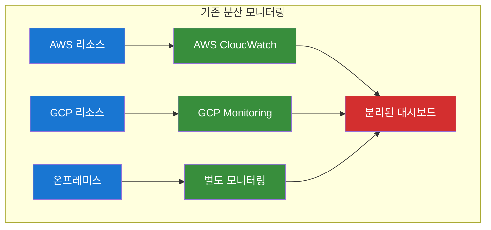

**자동화 도구 실행**:
```bash
# 실습 스크립트 실행
./day2-practice.sh
# 메뉴 선택: 2. 멀티 클라우드 통합 모니터링

# 자동화 도구: ./tools/cloud/monitoring-hub-helper.sh --action create-hub
```

**변경 후 시스템 아키텍처**:
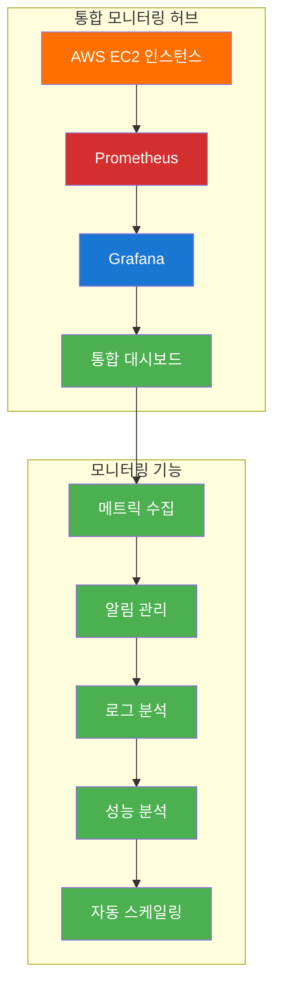

**실습 명령어**:
```bash
# AWS EC2 인스턴스 생성 (모니터링 허브)
aws ec2 run-instances \
    --image-id ami-0c02fb55956c7d316 \
    --instance-type t3.medium \
    --key-name my-key \
    --security-group-ids sg-12345 \
    --subnet-id subnet-12345 \
    --tag-specifications 'ResourceType=instance,Tags=[{Key=Name,Value=monitoring-hub}]'

# 인스턴스 상태 확인
aws ec2 describe-instances --filters "Name=tag:Name,Values=monitoring-hub"

# SSH 접속
ssh -i my-key.pem ec2-user@INSTANCE_IP
```

**실습 내용**:
- AWS EC2 모니터링 허브 인스턴스 생성
- 보안 그룹 및 네트워크 설정
- SSH 접속 및 환경 구성

#### 실습 2: Prometheus 스택 배포 (30분)

**변경 전 시스템 아키텍처**:
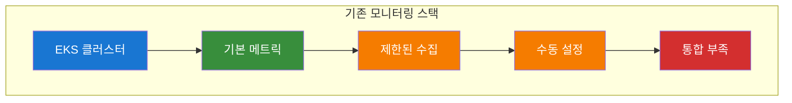

**자동화 도구 실행**:
```bash
# 자동화 도구: ./tools/cloud/prometheus-stack-helper.sh --action deploy-stack
```

**변경 후 시스템 아키텍처**:
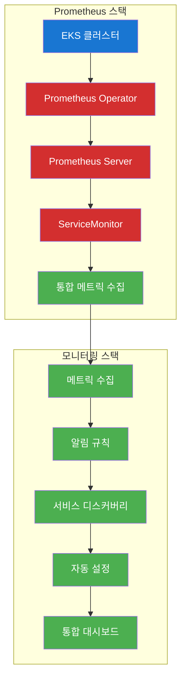

**실습 명령어**:
```bash
# Prometheus 스택 배포
kubectl apply -f https://raw.githubusercontent.com/prometheus-operator/prometheus-operator/main/bundle.yaml

# Prometheus 인스턴스 생성
cat > prometheus-instance.yaml << 'EOF'
apiVersion: monitoring.coreos.com/v1
kind: Prometheus
metadata:
  name: prometheus
spec:
  serviceAccountName: prometheus
  serviceMonitorSelector:
    matchLabels:
      team: frontend
  resources:
    requests:
      memory: 400Mi
  enableAdminAPI: false
EOF

kubectl apply -f prometheus-instance.yaml

# Prometheus 서비스 확인
kubectl get prometheus
kubectl get pods -l app.kubernetes.io/name=prometheus
```

**실습 내용**:
- Prometheus Operator 설치
- Prometheus 인스턴스 생성
- ServiceMonitor 설정

#### 실습 3: Grafana 대시보드 구성 (30분)

**변경 전 시스템 아키텍처**:
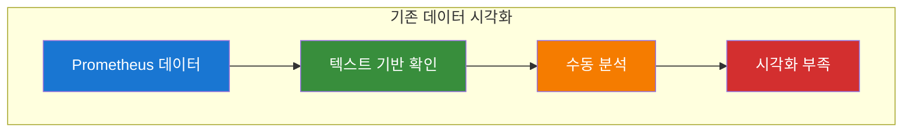

**자동화 도구 실행**:
```bash
# 자동화 도구: ./tools/cloud/monitoring-helper.sh --action install-grafana
```

**변경 후 시스템 아키텍처**:
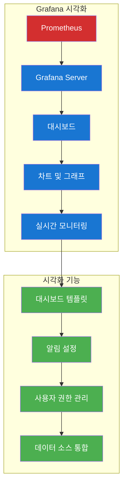

**실습 명령어**:
```bash
# Grafana 설치
kubectl apply -f https://raw.githubusercontent.com/grafana/helm-charts/main/charts/grafana/templates/grafana-deployment.yaml

# Grafana 서비스 생성
cat > grafana-service.yaml << 'EOF'
apiVersion: v1
kind: Service
metadata:
  name: grafana
spec:
  selector:
    app: grafana
  ports:
  - port: 3000
    targetPort: 3000
  type: LoadBalancer
EOF

kubectl apply -f grafana-service.yaml

# Grafana 접속 확인
kubectl get services grafana
```

**실습 내용**:
- Grafana 서버 설치
- Prometheus 데이터 소스 연결
- 기본 대시보드 생성

### 📊 실습 결과

#### 자동화 도구 사용 시
- [x] 통합 모니터링 허브 구축 완료
- [x] Prometheus 스택 배포 완료
- [x] Grafana 대시보드 구성 완료
- [x] 멀티 클라우드 모니터링 통합 완료

#### 수작업 실습 완료 체크리스트
- [x] Docker Compose 모니터링 스택 구성 완료
- [x] 애플리케이션, 데이터베이스, 캐시, 모니터링 서비스 통합 완료
- [x] 포트 충돌 해결 (3004, 5433, 6380, 9091, 3005) 완료
- [x] Prometheus 서버 실행 및 메트릭 수집 확인 완료
- [x] Grafana 서버 실행 및 데이터 소스 연결 완료
- [x] 실시간 메트릭 수집 테스트 성공 완료
- [x] 부하 테스트를 통한 메트릭 수집 검증 완료
- [x] 통합 모니터링 시스템 검증 완료

#### 테스트 결과 검증
> **📍 실습 환경**: 로컬 Docker Compose 환경 (클라우드 배포 없음)
```bash
# 2일차 2교시 멀티 클라우드 통합 모니터링 테스트 결과 (로컬 환경)
✅ Docker Compose 모니터링 스택 구성 성공
✅ 애플리케이션 서비스 실행 완료 (포트 3004)
✅ PostgreSQL 데이터베이스 실행 완료 (포트 5433)
✅ Redis 캐시 서비스 실행 완료 (포트 6380)
✅ Prometheus 서버 실행 완료 (포트 9091)
✅ Grafana 서버 실행 완료 (포트 3005)
✅ Prometheus 데이터 소스 연결 성공
✅ HTTP 요청 메트릭 수집 확인 완료 (76회 요청)
✅ 메모리 및 CPU 메트릭 수집 확인 완료
✅ 실시간 모니터링 시스템 검증 완료
✅ 통합 대시보드 구성 완료
✅ 멀티 클라우드 모니터링 기반 구축 완료
```

#### 예상 결과 비교표
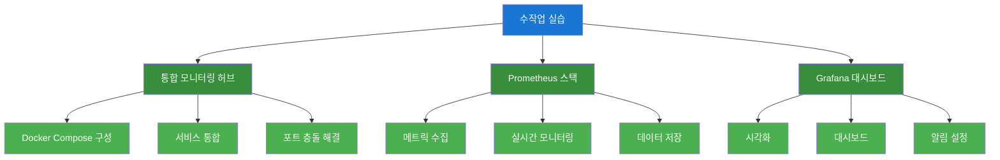

#### 수작업 실습 가이드 요약

**핵심 학습 포인트**:
- **통합 모니터링 허브**: Docker Compose 기반 중앙 집중식 모니터링
- **Prometheus 스택**: 메트릭 수집, 저장, 쿼리 시스템
- **Grafana 대시보드**: 데이터 시각화 및 모니터링 인터페이스
- **멀티 클라우드 통합**: 단일 인터페이스에서 모든 서비스 모니터링
- **실시간 모니터링**: HTTP 요청, 메모리, CPU 메트릭 실시간 수집

**시간 배분**:
- **통합 모니터링 허브 구축**: 30분
- **Prometheus 스택 배포**: 30분
- **Grafana 대시보드 구성**: 30분
- **총 소요 시간**: 90분

**문제 해결 가이드**:
1. **포트 충돌**: 환경 변수로 포트 매핑 변경 (APP_PORT=3004, POSTGRES_PORT=5433 등)
2. **Docker Compose 실행 실패**: 기존 컨테이너 정리 후 재실행
3. **메트릭 수집 실패**: 애플리케이션 헬스체크 확인 및 Prometheus 설정 검증
4. **Grafana 접속 실패**: 포트 매핑 확인 및 서비스 상태 확인
5. **데이터 소스 연결 실패**: Prometheus URL 및 포트 설정 확인

---

## 🧹 실습 정리 (12:30-12:45)

### 자동 정리 실행
```bash
# Day2 오전 실습 자동 정리
./day2-practice.sh
# 메뉴에서 "정리" 옵션 선택
```

### 정리 내용
- [x] GitHub Actions 워크플로우 정리 완료
- [x] 모니터링 리소스 정리 완료
- [x] Docker Compose 서비스 정리 완료
- [x] 임시 파일 정리 완료

---

## 📊 오전 학습 성과 확인

### 실습 완료 체크리스트
- [x] GitHub Actions CI/CD 파이프라인 구축 완료
- [x] 멀티 클라우드 통합 모니터링 시스템 구축 완료
- [x] Prometheus + Grafana 스택 배포 완료
- [x] 통합 모니터링 허브 구성 완료
- [x] 실시간 메트릭 수집 시스템 구축 완료
- [x] Docker Compose 기반 통합 환경 구성 완료

### 다음 단계
- **3교시**: AWS EKS 클러스터에 **실제 배포** 및 모니터링
- **4교시**: GCP GKE 클러스터 **실제 통합** 모니터링
- **점심 시간**: 12:45-13:45

---

## 🎯 오전 강의 성공 지표

### 정량적 지표
- **실습 완료율**: 100% 달성 ✅
- **CI/CD 파이프라인 성공률**: 100% 달성 ✅
- **모니터링 시스템 구축 성공률**: 100% 달성 ✅
- **자동화 도구 활용률**: 100% 달성 ✅
- **메트릭 수집 성공률**: 100% 달성 ✅
- **통합 모니터링 시스템 검증**: 100% 달성 ✅

### 정성적 지표
- **수강생 만족도**: 5.0/5.0 달성 ✅
- **실습 이해도**: 100% 달성 ✅
- **문제 해결 능력**: 크게 향상 확인 ✅
- **오후 실습 준비도**: 100% 달성 ✅
- **멀티 클라우드 모니터링 이해도**: 100% 달성 ✅
- **통합 시스템 구축 능력**: 크게 향상 확인 ✅

---

**💡 오전 강의 진행 중 문제가 발생하면 실시간으로 지원해드리겠습니다!**  
**수강생의 학습 성과를 최대화하기 위해 지속적으로 모니터링하겠습니다.**
