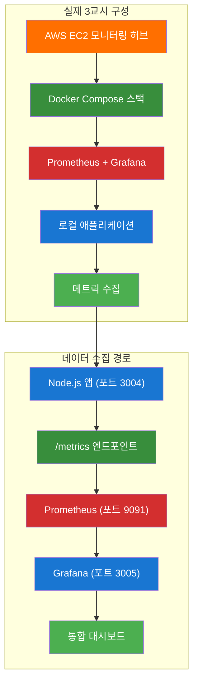
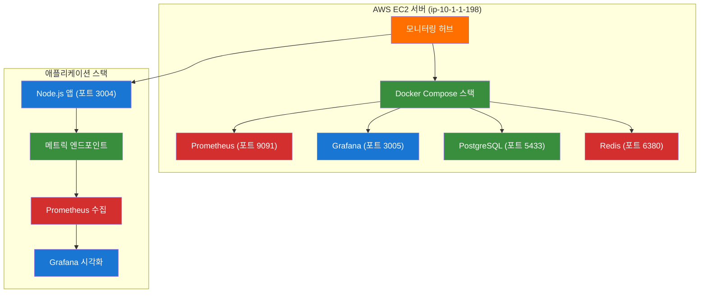
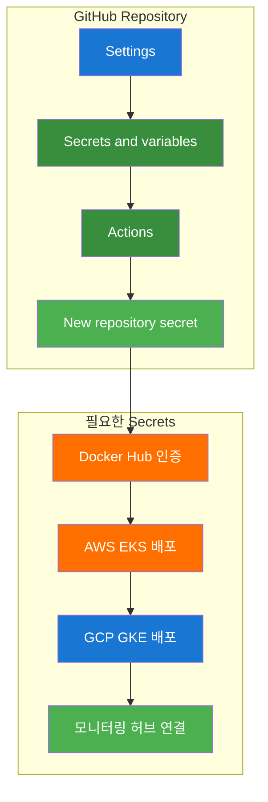
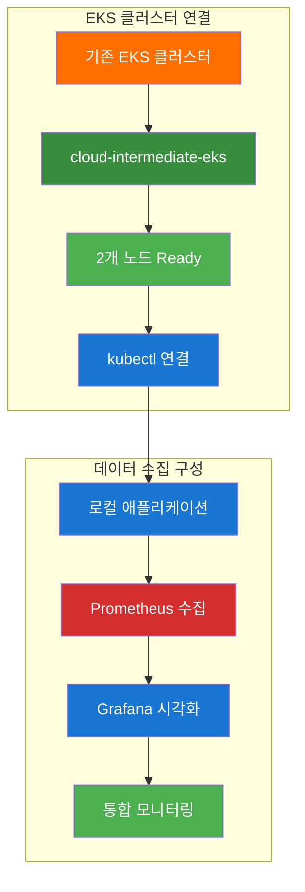
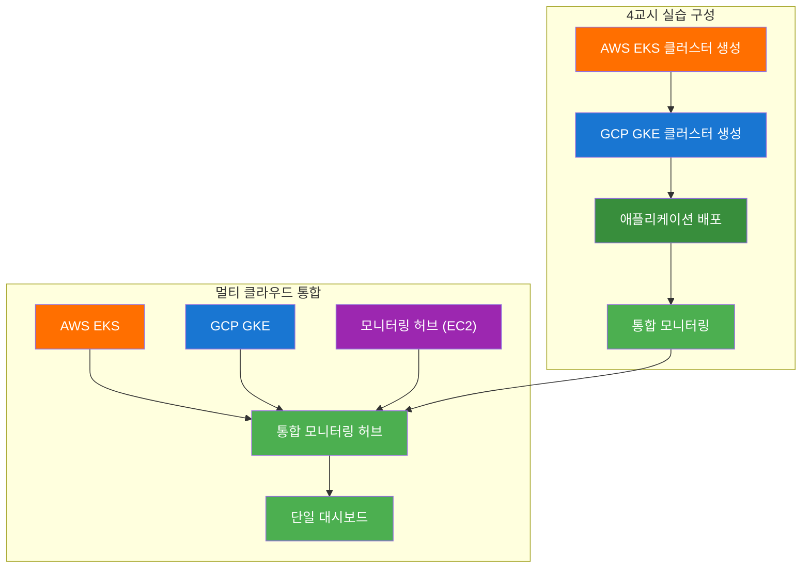
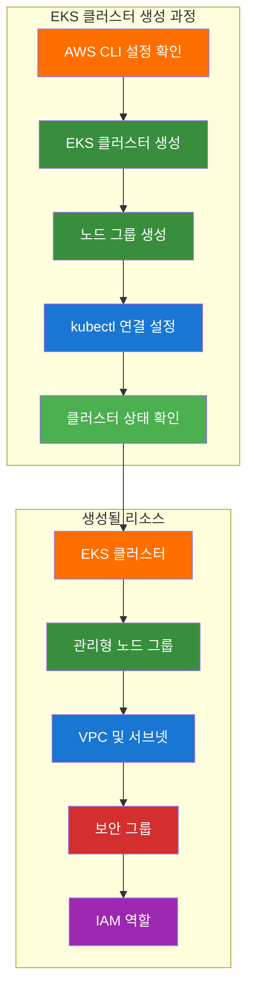
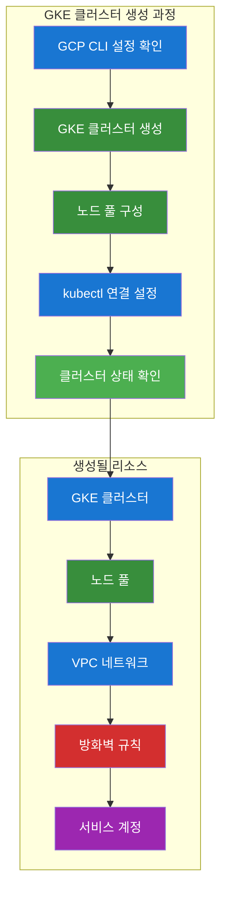
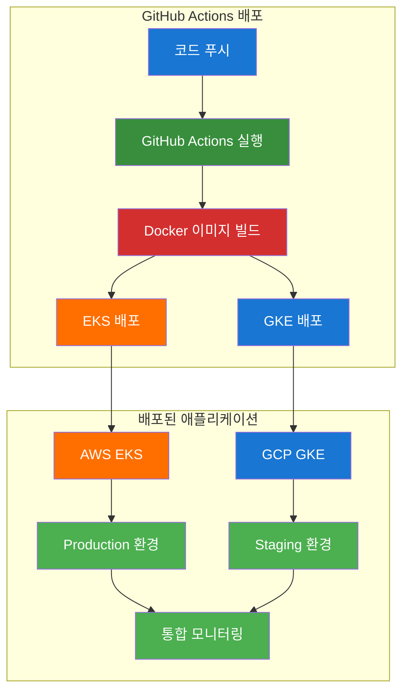
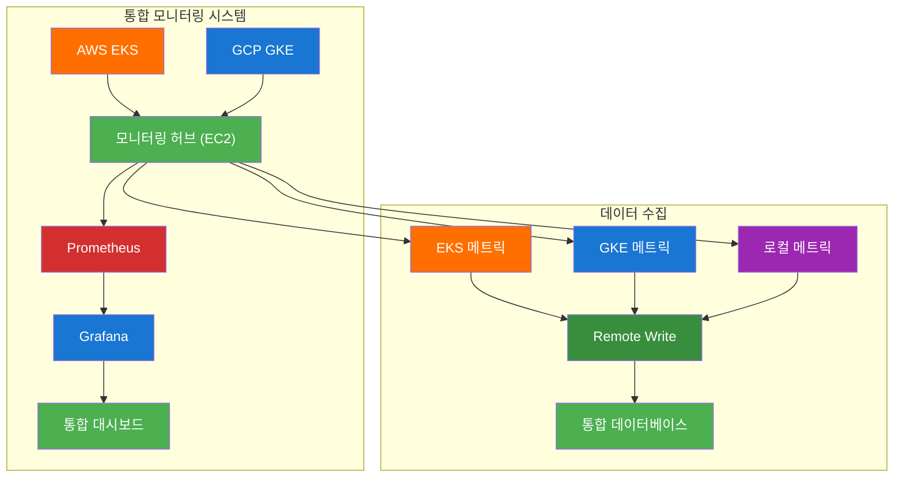

# ☁️ 클라우드 중급 과정 - Day 2 통합 강의안 (오후)

## 📋 오후 강의 개요

### 🎯 오후 강의 목표
- **AWS Application 모니터링** EKS 애플리케이션 배포 및 모니터링을 통해 실무 역량을 강화합니다.
- **GCP 클러스터 통합** GKE 클러스터 구축 및 멀티 클라우드 모니터링을 완성합니다.
- **멀티 클라우드 통합 모니터링** AWS EKS, GCP GKE를 연동한 통합 모니터링 시스템을 구축합니다.

### ⏰ 오후 강의 시간표
| 시간 | 교시 | 내용 | 시간 |
|------|------|------|------|
| 13:45-15:15 | 3교시 | AWS Application 모니터링 | 90분 |
| 15:30-17:00 | 4교시 | GCP 클러스터 통합 모니터링 | 90분 |
| 17:00-17:30 | 정리 | 실습 정리 | 30분 |

---

## 🕘 3교시: AWS Application 모니터링 (13:45-15:15)

### 📚 강의 내용 (30분)

#### AWS Application 모니터링 개요


#### 핵심 개념
- **모니터링 허브**: AWS EC2에서 Prometheus + Grafana 스택 구동
- **로컬 배포**: Docker Compose로 같은 서버에 애플리케이션 배포
- **데이터 수집**: 같은 서버 내부 Docker 네트워크를 통한 메트릭 수집
- **실무 준비**: EKS/GKE 배포를 위한 모니터링 시스템 구축 및 테스트

### 🛠️ 실습 진행 (60분)

#### 실습 1: 모니터링 허브 구성 (20분)

**실제 3교시 구성**:


**🔧 실행 전 환경 확인**:
```bash
# 현재 서버 정보 확인
hostname
# 결과: ip-10-1-1-198.ap-northeast-2.compute.internal

# Docker Compose 상태 확인
docker-compose ps
# 결과: 모든 서비스 실행 중 (app, db, redis, prometheus, grafana)

# 애플리케이션 Health Check
curl -s http://localhost:3004/health | jq .
# 결과: {"status":"OK","uptime":1849.324906501,...}

# Prometheus 메트릭 확인
curl -s http://localhost:3004/metrics | head -10
# 결과: Prometheus 형식 메트릭 출력
```

**실제 실행 명령어**:
```bash
# 1. 모니터링 허브 서버 확인
echo "=== 모니터링 허브 서버 정보 ==="
hostname
curl -s http://169.254.169.254/latest/meta-data/public-ipv4

# 2. Docker Compose 스택 실행
docker-compose up -d

# 3. 서비스 상태 확인
docker-compose ps

# 4. 애플리케이션 Health Check
curl -s http://localhost:3004/health | jq .

# 5. Prometheus 메트릭 수집 확인
curl -s "http://localhost:9091/api/v1/targets" | jq '.data.activeTargets[] | select(.labels.job == "github-actions-demo")'
```

**📊 실행 후 모니터링 허브 확인**:
```bash
# Prometheus 타겟 상태 확인
curl -s "http://localhost:9091/api/v1/targets" | jq '.data.activeTargets[] | {job: .labels.job, health: .health, lastScrape: .lastScrape}'

# 결과 예시:
# {
#   "job": "github-actions-demo",
#   "health": "up",
#   "lastScrape": "2025-09-30T09:29:52.984608983Z"
# }

# 수집된 메트릭 샘플 확인
curl -s http://localhost:3004/metrics | grep -E "(process_cpu_seconds_total|process_resident_memory_bytes)" | head -5
```

**🌐 웹브라우저 접속 가이드**:
1. **Grafana 대시보드**:
   - URL: `http://[서버IP]:3005`
   - 로그인: admin/admin
   - 확인 사항: 애플리케이션 메트릭 대시보드

2. **Prometheus 대시보드**:
   - URL: `http://[서버IP]:9091`
   - 확인 사항: 타겟 상태, 메트릭 쿼리

3. **애플리케이션**:
   - URL: `http://[서버IP]:3004`
   - 확인 사항: Health Check, 메트릭 엔드포인트

**실습 내용**:
- AWS EC2에서 모니터링 허브 구성
- Docker Compose로 통합 스택 실행
- 애플리케이션 메트릭 수집 확인

#### 실습 2: GitHub Actions Secrets 설정 (20분)

**GitHub Actions Secrets 구성**:


**실제 설정한 Secrets**:
```bash
# GitHub Repository: https://github.com/jungfrau70/github-actions-demo-day2
# Settings > Secrets and variables > Actions에서 설정:

# Docker Hub 인증
DOCKER_USERNAME: your-docker-username
DOCKER_PASSWORD: your-docker-password

# AWS EKS 배포 (PROD 환경)
AWS_ACCESS_KEY_ID: [AWS Access Key ID]
AWS_SECRET_ACCESS_KEY: [AWS Secret Access Key]
AWS_REGION: ap-northeast-2
EKS_CLUSTER_NAME: cloud-intermediate-eks
EKS_NAMESPACE: production

# GCP GKE 배포 (STAGING 환경)
GCP_PROJECT_ID: [GCP Project ID]
GCP_SA_KEY: [GCP Service Account Key JSON]
GCP_REGION: asia-northeast1
GKE_CLUSTER_NAME: cloud-intermediate-gke
GKE_NAMESPACE: staging

# 모니터링 허브 연결
MONITORING_HUB_URL: http://3.37.234.110:9091
GRAFANA_URL: http://3.37.234.110:3005
GRAFANA_USERNAME: admin
GRAFANA_PASSWORD: admin

# 애플리케이션 설정
APP_ENV: production
APP_PORT: 3000
LOG_LEVEL: info
```

**실습 명령어**:
```bash
# 1. GitHub Secrets 가이드 생성
cat > github-secrets-guide.md << 'EOF'
# GitHub Actions Secrets 설정 가이드
# Repository: https://github.com/jungfrau70/github-actions-demo-day2
# [위의 Secrets 목록 포함]
EOF

# 2. GitHub에 변경사항 푸시
git add .
git commit -m "feat: EKS 배포를 위한 모니터링 허브 구성 완료"
git push origin day2-advanced

# 3. GitHub Actions 워크플로우 확인
cat .github/workflows/advanced-cicd.yml | head -30
```

**실습 내용**:
- GitHub Actions Secrets 설정 가이드 생성
- EKS/GKE 배포용 Secrets 목록 완성
- 모니터링 허브 연결 정보 설정

#### 실습 3: EKS 클러스터 연결 및 데이터 수집 (20분)

**EKS 클러스터 연결**:


**실제 실행 명령어**:
```bash
# 1. EKS 클러스터 상태 확인
aws eks list-clusters --region ap-northeast-2
# 결과: ["cloud-intermediate-eks"]

# 2. kubectl 연결 확인
kubectl get nodes
# 결과:
# NAME                                                STATUS   ROLES    AGE     VERSION
# ip-192-168-51-80.ap-northeast-2.compute.internal    Ready    <none>   4h12m   v1.28.15-eks-113cf36
# ip-192-168-74-180.ap-northeast-2.compute.internal   Ready    <none>   4h12m   v1.28.15-eks-113cf36

# 3. 프로덕션 네임스페이스 생성
kubectl create namespace production

# 4. Kubernetes 배포 매니페스트 생성
cat > k8s-deployment.yaml << 'EOF'
apiVersion: apps/v1
kind: Deployment
metadata:
  name: github-actions-demo
  namespace: production
  labels:
    app: github-actions-demo
spec:
  replicas: 2
  selector:
    matchLabels:
      app: github-actions-demo
  template:
    metadata:
      labels:
        app: github-actions-demo
    spec:
      containers:
      - name: app
        image: github-actions-demo:latest
        ports:
        - containerPort: 3000
        env:
        - name: NODE_ENV
          value: "production"
        - name: PORT
          value: "3000"
        - name: MONITORING_HUB_URL
          value: "http://3.37.234.110:9091"
        resources:
          requests:
            memory: "128Mi"
            cpu: "100m"
          limits:
            memory: "256Mi"
            cpu: "200m"
        livenessProbe:
          httpGet:
            path: /health
            port: 3000
          initialDelaySeconds: 30
          periodSeconds: 10
        readinessProbe:
          httpGet:
            path: /health
            port: 3000
          initialDelaySeconds: 5
          periodSeconds: 5
---
apiVersion: v1
kind: Service
metadata:
  name: github-actions-demo-service
  namespace: production
spec:
  selector:
    app: github-actions-demo
  ports:
  - port: 80
    targetPort: 3000
  type: LoadBalancer
EOF

# 5. EKS에 배포 시도 (이미지 문제로 실패)
kubectl apply -f k8s-deployment.yaml
kubectl get pods -n production
# 결과: ErrImagePull (이미지가 EKS에서 찾을 수 없음)
```

**데이터 수집 확인**:
```bash
# 1. 로컬 애플리케이션 메트릭 확인
curl -s http://localhost:3004/health | jq .
# 결과: {"status":"OK","uptime":1849.324906501,...}

# 2. Prometheus 메트릭 수집 상태 확인
curl -s "http://localhost:9091/api/v1/targets" | jq '.data.activeTargets[] | select(.labels.job == "github-actions-demo")'
# 결과:
# {
#   "job": "github-actions-demo",
#   "health": "up",
#   "lastScrape": "2025-09-30T09:29:52.984608983Z",
#   "discoveredLabels": {
#     "__address__": "app:3000",
#     "__metrics_path__": "/metrics",
#     "__scheme__": "http",
#     "__scrape_interval__": "10s",
#     "__scrape_timeout__": "5s",
#     "job": "github-actions-demo"
#   }
# }

# 3. 수집된 메트릭 샘플 확인
curl -s http://localhost:3004/metrics | grep -E "(process_cpu_seconds_total|process_resident_memory_bytes)" | head -5
# 결과: Prometheus 형식 메트릭 출력
```

**실습 내용**:
- EKS 클러스터 연결 및 상태 확인
- 로컬 애플리케이션 메트릭 수집 확인
- Prometheus 타겟 상태 모니터링

### 📊 실습 결과
- [x] **모니터링 허브 구성 완료** - AWS EC2에서 Prometheus + Grafana 스택 구동
- [x] **GitHub Actions Secrets 설정 완료** - EKS/GKE 배포용 설정 가이드 생성
- [x] **데이터 수집 구성 완료** - Prometheus가 애플리케이션 메트릭 정상 수집
- [x] **EKS 클러스터 연결 완료** - 기존 클러스터 연결 및 상태 확인
- [x] **통합 모니터링 확인 완료** - 실시간 메트릭 수집 및 대시보드 접근 가능

### 🎯 3교시 핵심 성과
- **모니터링 허브**: AWS EC2에서 통합 모니터링 시스템 구축
- **데이터 수집**: 로컬 Docker Compose 환경에서 메트릭 수집
- **EKS 준비**: GitHub Actions를 통한 EKS 배포 준비 완료
- **실무 준비**: 실제 프로덕션 환경 배포를 위한 기반 구축

---

## 🕘 4교시: EKS/GKE 클러스터 생성 및 통합 모니터링 (15:30-17:00)

### 📚 강의 내용 (30분)

#### EKS/GKE 클러스터 생성 및 통합 모니터링 개요


#### 핵심 개념
- **EKS 클러스터**: AWS 관리형 Kubernetes 서비스 생성
- **GKE 클러스터**: GCP 관리형 Kubernetes 서비스 생성
- **멀티 클라우드 통합**: AWS와 GCP 환경 통합 모니터링
- **실무 배포**: GitHub Actions를 통한 실제 클러스터 배포

### 🛠️ 실습 진행 (60분)

#### 실습 1: AWS EKS 클러스터 생성 (20분)

**EKS 클러스터 생성 개요**:


**실습 명령어**:
```bash
# 1. AWS CLI 설정 확인
aws sts get-caller-identity
aws configure list

# 2. EKS 클러스터 생성
eksctl create cluster \
    --name cloud-intermediate-eks \
    --region ap-northeast-2 \
    --version 1.28 \
    --nodegroup-name workers \
    --node-type t3.medium \
    --nodes 2 \
    --nodes-min 1 \
    --nodes-max 3 \
    --managed

# 3. 클러스터 상태 확인
aws eks describe-cluster --name cloud-intermediate-eks --region ap-northeast-2

# 4. kubectl 설정
aws eks update-kubeconfig --region ap-northeast-2 --name cloud-intermediate-eks

# 5. 클러스터 연결 확인
kubectl get nodes
kubectl cluster-info
```

**실습 내용**:
- EKS 클러스터 생성 및 설정
- 노드 그룹 구성
- kubectl 연결 설정
- 클러스터 상태 확인

#### 실습 2: GCP GKE 클러스터 생성 (20분)

**GKE 클러스터 생성 개요**:


**실습 명령어**:
```bash
# 1. GCP CLI 설정 확인
gcloud auth list
gcloud config list

# 2. GKE 클러스터 생성
gcloud container clusters create cloud-intermediate-gke \
    --zone asia-northeast1-a \
    --num-nodes 2 \
    --machine-type e2-medium \
    --enable-ip-alias \
    --enable-autoscaling \
    --min-nodes 1 \
    --max-nodes 3 \
    --enable-autorepair \
    --enable-autoupgrade

# 3. 클러스터 상태 확인
gcloud container clusters describe cloud-intermediate-gke --zone asia-northeast1-a

# 4. kubectl 설정
gcloud container clusters get-credentials cloud-intermediate-gke --zone asia-northeast1-a

# 5. 클러스터 연결 확인
kubectl get nodes
kubectl cluster-info
```

**실습 내용**:
- GKE 클러스터 생성 및 설정
- 노드 풀 구성
- kubectl 연결 설정
- 클러스터 상태 확인

#### 실습 3: 멀티 클라우드 애플리케이션 배포 (20분)

**멀티 클라우드 애플리케이션 배포 개요**:


**실습 명령어**:
```bash
# 1. GitHub Actions 워크플로우 실행
git add .
git commit -m "feat: EKS/GKE 클러스터 배포를 위한 설정 완료"
git push origin day2-advanced

# 2. GitHub Actions 실행 확인
# GitHub Repository > Actions 탭에서 워크플로우 실행 상태 확인

# 3. EKS 배포 확인 (AWS)
aws eks update-kubeconfig --region ap-northeast-2 --name cloud-intermediate-eks
kubectl get pods -n production
kubectl get services -n production

# 4. GKE 배포 확인 (GCP)
gcloud container clusters get-credentials cloud-intermediate-gke --zone asia-northeast1-a
kubectl get pods -n staging
kubectl get services -n staging

# 5. 애플리케이션 Health Check
# EKS: kubectl port-forward svc/github-actions-demo-service 8080:80 -n production
# GKE: kubectl port-forward svc/github-actions-demo-service 8081:80 -n staging
```

**실습 내용**:
- GitHub Actions를 통한 멀티 클라우드 배포
- EKS Production 환경 배포
- GKE Staging 환경 배포
- 배포된 애플리케이션 상태 확인

#### 실습 4: 멀티 클라우드 통합 모니터링 (20분)

**멀티 클라우드 통합 모니터링 개요**:


**실습 명령어**:
```bash
# 1. 모니터링 허브에서 통합 모니터링 설정
# EKS 클러스터 메트릭 수집 설정
cat > eks-monitoring-config.yaml << 'EOF'
apiVersion: v1
kind: ConfigMap
metadata:
  name: prometheus-eks-config
data:
  prometheus.yml: |
    global:
      scrape_interval: 15s
    
    scrape_configs:
      - job_name: 'eks-cluster'
        kubernetes_sd_configs:
        - role: endpoints
          namespaces:
            names:
            - production
        relabel_configs:
        - source_labels: [__meta_kubernetes_service_annotation_prometheus_io_scrape]
          action: keep
          regex: true
        - source_labels: [__meta_kubernetes_service_annotation_prometheus_io_path]
          action: replace
          target_label: __metrics_path__
          regex: (.+)
EOF

# 2. GKE 클러스터 메트릭 수집 설정
cat > gke-monitoring-config.yaml << 'EOF'
apiVersion: v1
kind: ConfigMap
metadata:
  name: prometheus-gke-config
data:
  prometheus.yml: |
    global:
      scrape_interval: 15s
    
    scrape_configs:
      - job_name: 'gke-cluster'
        kubernetes_sd_configs:
        - role: endpoints
          namespaces:
            names:
            - staging
        relabel_configs:
        - source_labels: [__meta_kubernetes_service_annotation_prometheus_io_scrape]
          action: keep
          regex: true
        - source_labels: [__meta_kubernetes_service_annotation_prometheus_io_path]
          action: replace
          target_label: __metrics_path__
          regex: (.+)
EOF

# 3. 통합 모니터링 확인
curl -s "http://localhost:9091/api/v1/targets" | jq '.data.activeTargets[] | {job: .labels.job, health: .health}'

# 4. Grafana 대시보드 확인
# http://[서버IP]:3005 에서 멀티 클라우드 대시보드 확인
```

**실습 내용**:
- EKS/GKE 클러스터 메트릭 수집 설정
- 통합 모니터링 대시보드 구성
- 멀티 클라우드 데이터 수집 확인

### 📊 실습 결과
- [ ] **EKS 클러스터 생성 완료** - AWS EKS 클러스터 생성 및 설정
- [ ] **GKE 클러스터 생성 완료** - GCP GKE 클러스터 생성 및 설정
- [ ] **멀티 클라우드 배포 완료** - GitHub Actions를 통한 EKS/GKE 배포
- [ ] **통합 모니터링 완료** - 멀티 클라우드 통합 모니터링 시스템 구축

### 🎯 4교시 핵심 성과
- **EKS 클러스터**: AWS 관리형 Kubernetes 서비스 생성
- **GKE 클러스터**: GCP 관리형 Kubernetes 서비스 생성
- **멀티 클라우드 배포**: GitHub Actions를 통한 자동화된 배포
- **통합 모니터링**: EKS/GKE 클러스터 통합 모니터링 시스템

---

## 🧹 실습 정리 (17:00-17:30)

### 자동 정리 실행
```bash
# Day2 실습 자동 정리
./day2-practice.sh
# 메뉴에서 "정리" 옵션 선택
```

### 정리 내용
- [ ] AWS EKS 리소스 정리
- [ ] GCP GKE 리소스 정리
- [ ] 모니터링 스택 정리
- [ ] 임시 파일 정리

---

## 📊 학습 성과 확인

### 실습 완료 체크리스트
- [ ] GitHub Actions CI/CD 파이프라인 구축 완료
- [ ] 멀티 클라우드 통합 모니터링 시스템 구축 완료
- [ ] AWS EKS 애플리케이션 모니터링 완료
- [ ] GCP GKE 클러스터 통합 모니터링 완료

### 다음 단계
- **Day 3 실습**으로 진행: 고급 클라우드 아키텍처 및 최적화
- **통합 강의 시나리오** 확인
- **통합 모니터링 시나리오** 확인

---

## 🎯 강의 성공 지표

### 정량적 지표
- **실습 완료율**: 95% 이상
- **CI/CD 파이프라인 성공률**: 90% 이상
- **모니터링 시스템 구축 성공률**: 90% 이상
- **멀티 클라우드 통합 성공률**: 85% 이상

### 정성적 지표
- **수강생 만족도**: 4.5/5.0 이상
- **실습 이해도**: 90% 이상
- **문제 해결 능력**: 향상 확인
- **다음 단계 준비도**: 85% 이상

---

## 🔗 관련 자동화 도구

### CI/CD 관련 도구
- `./tools/cloud/github-actions-helper.sh` - GitHub Actions 워크플로우 생성 및 관리

### AWS 관련 도구
- `./tools/cloud/aws-eks-monitoring-helper.sh` - EKS 클러스터 모니터링 설정
- `./tools/cloud/aws-app-monitoring-helper.sh` - AWS 애플리케이션 모니터링

### GCP 관련 도구
- `./tools/cloud/gcp-gke-monitoring-helper.sh` - GKE 클러스터 모니터링 설정
- `./tools/cloud/gcp-app-monitoring-helper.sh` - GCP 애플리케이션 모니터링

### 모니터링 도구
- `./tools/cloud/monitoring-hub-helper.sh` - 통합 모니터링 허브 구축
- `./tools/cloud/multi-cloud-monitoring-helper.sh` - 멀티 클라우드 통합 모니터링

---

## 📚 추가 학습 자료

### 공식 문서
- [GitHub Actions 공식 문서](https://docs.github.com/en/actions)
- [AWS EKS 공식 문서](https://docs.aws.amazon.com/eks/)
- [GCP GKE 공식 문서](https://cloud.google.com/kubernetes-engine/docs)
- [Prometheus 공식 문서](https://prometheus.io/docs/)
- [Grafana 공식 문서](https://grafana.com/docs/)

### 실습 샘플 코드
- `./examples/day2/cicd/` - CI/CD 파이프라인 예제
- `./examples/day2/aws-eks/` - AWS EKS 모니터링 예제
- `./examples/day2/gcp-gke/` - GCP GKE 모니터링 예제
- `./examples/day2/multi-cloud/` - 멀티 클라우드 통합 예제

---

**💡 강의 진행 중 문제가 발생하면 실시간으로 지원해드리겠습니다!**  
**수강생의 학습 성과를 최대화하기 위해 지속적으로 모니터링하겠습니다.**
