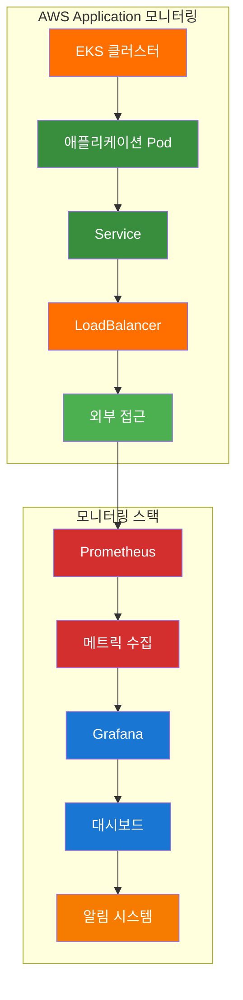
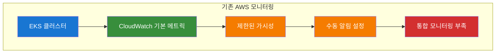
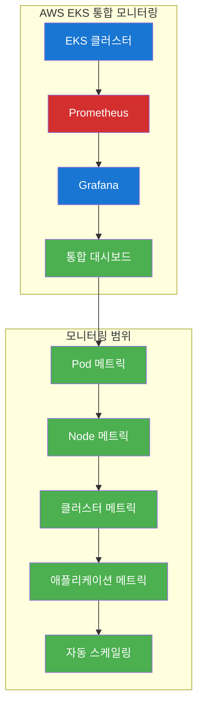
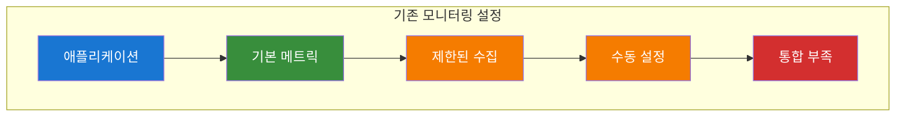
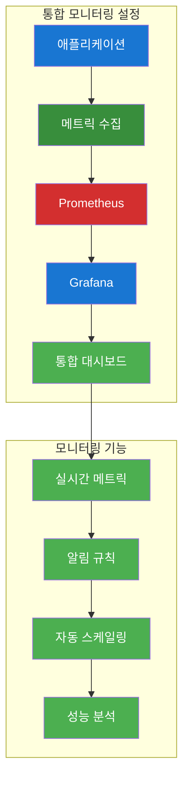
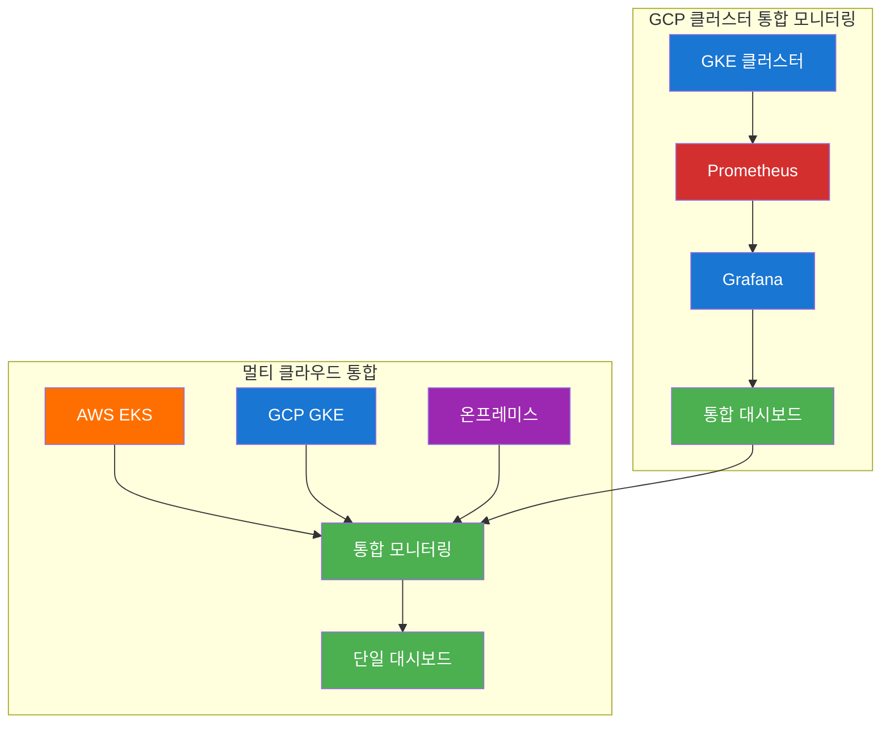
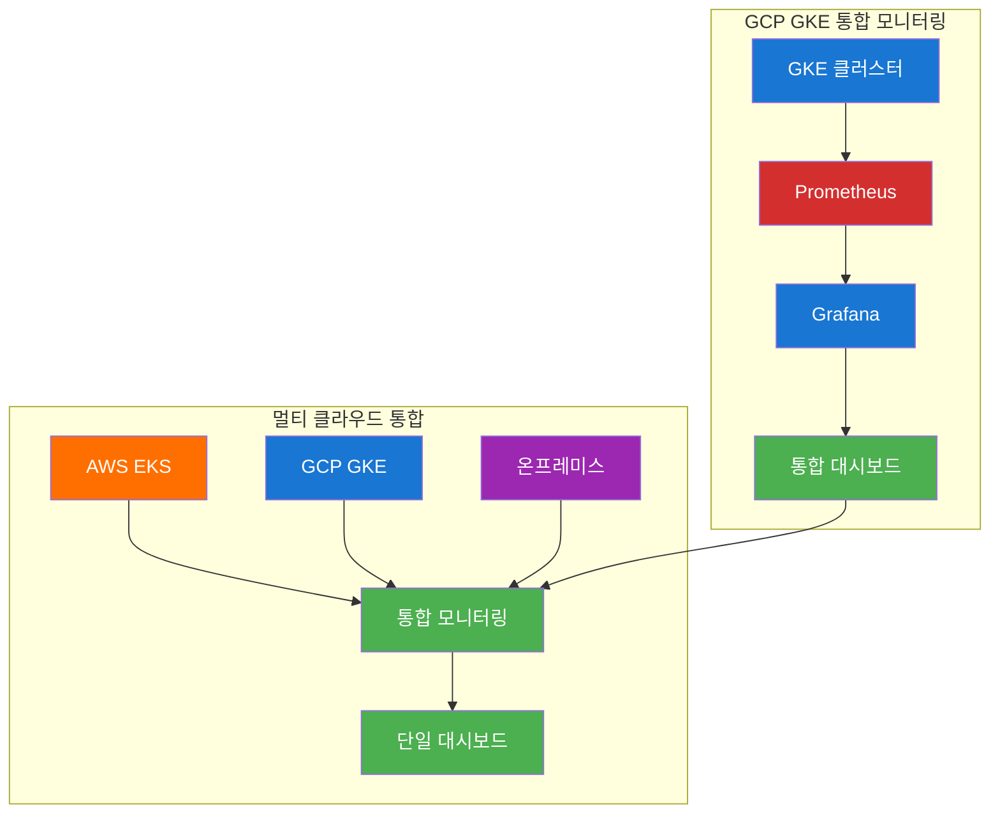
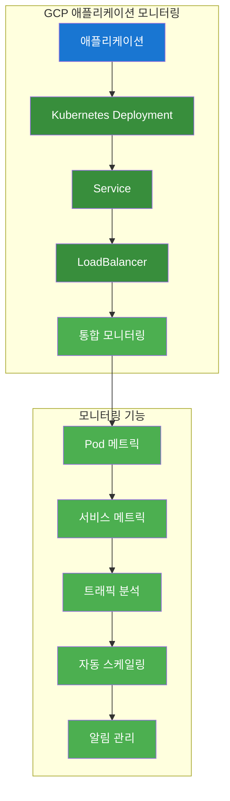
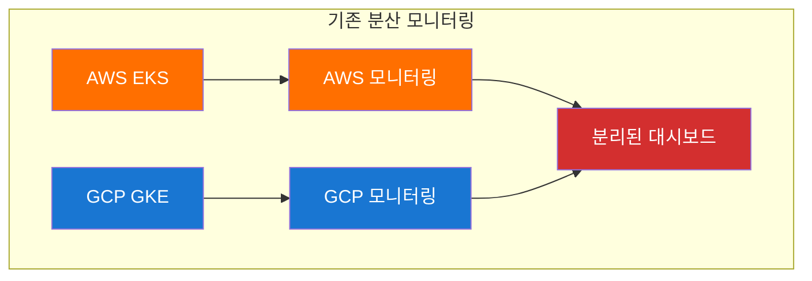
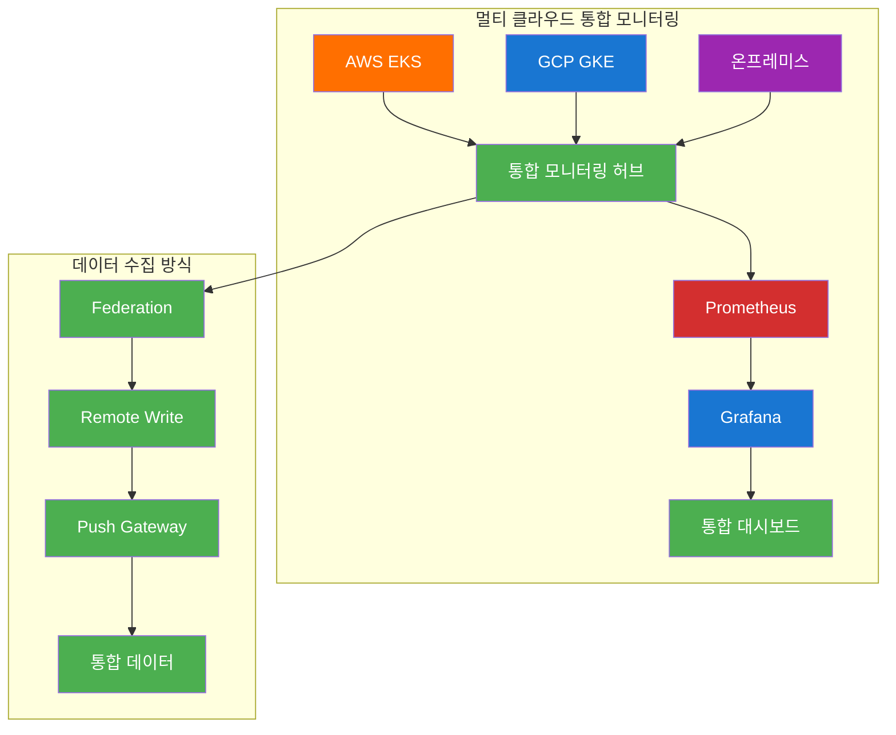

# ☁️ 클라우드 중급 과정 - Day 2 통합 강의안 (오후)

## 📋 오후 강의 개요

### 🎯 오후 강의 목표
- **AWS Application 모니터링** EKS 애플리케이션 배포 및 모니터링을 통해 실무 역량을 강화합니다.
- **GCP 클러스터 통합** GKE 클러스터 구축 및 멀티 클라우드 모니터링을 완성합니다.
- **멀티 클라우드 통합 모니터링** AWS EKS, GCP GKE를 연동한 통합 모니터링 시스템을 구축합니다.

### ⏰ 오후 강의 시간표
| 시간 | 교시 | 내용 | 시간 |
|------|------|------|------|
| 13:45-15:15 | 3교시 | AWS Application 모니터링 | 90분 |
| 15:30-17:00 | 4교시 | GCP 클러스터 통합 모니터링 | 90분 |
| 17:00-17:30 | 정리 | 실습 정리 | 30분 |

---

## 🕘 3교시: AWS Application 모니터링 (13:45-15:15)

### 📚 강의 내용 (30분)

#### AWS Application 모니터링 개요


#### 핵심 개념
- **EKS 클러스터**: AWS 관리형 Kubernetes 서비스
- **애플리케이션 배포**: Pod, Service, LoadBalancer 구성
- **모니터링 통합**: Prometheus + Grafana 연동
- **실무 모니터링**: 실제 운영 환경 모니터링 패턴

### 🛠️ 실습 진행 (60분)

#### 실습 1: EKS 클러스터 생성 (20분)

**변경 전 시스템 아키텍처**:


**🔧 실행 전 AWS EKS 환경 확인**:
```bash
# AWS CLI 설정 확인
aws sts get-caller-identity
# 예상 결과: AWS 계정 정보 출력

# EKS 클러스터 목록 확인
aws eks list-clusters
# 예상 결과: 기존 EKS 클러스터 목록 (없을 수도 있음)

# kubectl 설정 확인
kubectl version --client
# 예상 결과: kubectl 버전 정보

# eksctl 설치 확인
eksctl version
# 예상 결과: eksctl 버전 정보

# IAM 역할 확인
aws iam list-roles --query 'Roles[?contains(RoleName, `eks`)]'
# 예상 결과: EKS 관련 IAM 역할 목록
```

**자동화 도구 실행**:
```bash
# 실습 스크립트 실행
./day2-practice.sh
# 메뉴 선택: 3. AWS Application 모니터링

# 자동화 도구: ./tools/cloud/aws-eks-monitoring-helper.sh --action create-cluster
```

**변경 후 시스템 아키텍처**:


**📊 실행 후 AWS EKS 변화 확인**:
```bash
# EKS 클러스터 생성 확인
aws eks describe-cluster --name aws-monitoring-cluster
# 예상 결과: 클러스터 상태 ACTIVE

# 클러스터 노드 확인
kubectl get nodes
# 예상 결과: EKS 노드 목록 (Ready 상태)

# 클러스터 정보 확인
kubectl cluster-info
# 예상 결과: 클러스터 API 서버 정보

# 네임스페이스 확인
kubectl get namespaces
# 예상 결과: 기본 네임스페이스 목록

# Prometheus 설치 확인
kubectl get pods -n monitoring
# 예상 결과: Prometheus 관련 Pod 목록
```

**🌐 웹브라우저 접속 가이드**:
1. **AWS EKS 콘솔**:
   - URL: `https://console.aws.amazon.com/eks/`
   - 확인 사항: 클러스터 상태, 노드 그룹, 서비스

2. **Prometheus 대시보드**:
   - URL: `http://[EKS-ENDPOINT]:9090`
   - 확인 사항: 메트릭 수집 상태, 타겟 상태

3. **Grafana 대시보드**:
   - URL: `http://[EKS-ENDPOINT]:3000`
   - 확인 사항: 대시보드, 알림 설정

**실습 명령어**:
```bash
# EKS 클러스터 생성
aws eks create-cluster \
    --name aws-monitoring-cluster \
    --role-arn arn:aws:iam::ACCOUNT:role/eks-cluster-role \
    --resources-vpc-config subnetIds=subnet-12345,subnet-67890,securityGroupIds=sg-12345

# 클러스터 상태 확인
aws eks describe-cluster --name aws-monitoring-cluster

# kubectl 설정
aws eks update-kubeconfig --name aws-monitoring-cluster --region us-west-2
```

**실습 내용**:
- EKS 클러스터 생성
- 클러스터 상태 확인
- kubectl 설정

#### 실습 2: 애플리케이션 배포 (20분)

**변경 전 시스템 아키텍처**:


**자동화 도구 실행**:
```bash
# 자동화 도구: ./tools/cloud/aws-app-monitoring-helper.sh --action deploy-app
```

**변경 후 시스템 아키텍처**:


**실습 명령어**:
```bash
# 애플리케이션 Deployment 생성
cat > aws-app-deployment.yaml << 'EOF'
apiVersion: apps/v1
kind: Deployment
metadata:
  name: aws-monitoring-app
  labels:
    app: aws-monitoring-app
spec:
  replicas: 3
  selector:
    matchLabels:
      app: aws-monitoring-app
  template:
    metadata:
      labels:
        app: aws-monitoring-app
    spec:
      containers:
      - name: app
        image: nginx:1.21
        ports:
        - containerPort: 80
        resources:
          requests:
            memory: "64Mi"
            cpu: "250m"
          limits:
            memory: "128Mi"
            cpu: "500m"
EOF

# Service 생성
cat > aws-app-service.yaml << 'EOF'
apiVersion: v1
kind: Service
metadata:
  name: aws-monitoring-app-service
  labels:
    app: aws-monitoring-app
spec:
  selector:
    app: aws-monitoring-app
  ports:
  - port: 80
    targetPort: 80
  type: LoadBalancer
EOF

# ServiceMonitor 생성
cat > aws-app-servicemonitor.yaml << 'EOF'
apiVersion: monitoring.coreos.com/v1
kind: ServiceMonitor
metadata:
  name: aws-monitoring-app
  labels:
    team: frontend
spec:
  selector:
    matchLabels:
      app: aws-monitoring-app
  endpoints:
  - port: http
    interval: 30s
EOF

# 리소스 배포
kubectl apply -f aws-app-deployment.yaml
kubectl apply -f aws-app-service.yaml
kubectl apply -f aws-app-servicemonitor.yaml
```

**실습 내용**:
- 애플리케이션 Deployment 생성
- Service 및 LoadBalancer 구성
- ServiceMonitor 설정

#### 실습 3: 모니터링 설정 (20분)

**변경 전 시스템 아키텍처**:


**자동화 도구 실행**:
```bash
# 자동화 도구: ./tools/cloud/aws-app-monitoring-helper.sh --action setup-monitoring
```

**변경 후 시스템 아키텍처**:


**실습 명령어**:
```bash
# 애플리케이션 모니터링 확인
kubectl get pods -l app=aws-monitoring-app
kubectl get services
kubectl get servicemonitors

# 애플리케이션 로그 확인
kubectl logs -l app=aws-monitoring-app

# Prometheus 타겟 확인
kubectl port-forward svc/prometheus 9090:9090
curl http://localhost:9090/api/v1/targets

# Grafana 대시보드 접속
kubectl port-forward svc/grafana 3000:3000
```

**실습 내용**:
- 애플리케이션 모니터링 확인
- Prometheus 타겟 설정
- Grafana 대시보드 구성

### 📊 실습 결과
- [ ] EKS 클러스터 생성 완료
- [ ] 애플리케이션 배포 완료
- [ ] 모니터링 설정 완료
- [ ] 통합 대시보드 구성 완료

---

## 🕘 4교시: GCP 클러스터 통합 모니터링 (15:30-17:00)

### 📚 강의 내용 (30분)

#### GCP 클러스터 통합 모니터링 개요


#### 핵심 개념
- **GKE 클러스터**: GCP 관리형 Kubernetes 서비스
- **멀티 클라우드 통합**: AWS와 GCP 환경 통합 모니터링
- **데이터 수집 전략**: Federation, Remote Write, Push Gateway
- **실무 모니터링**: 실제 운영 환경 모니터링 패턴

### 🛠️ 실습 진행 (60분)

#### 실습 1: GKE 클러스터 생성 (20분)

**변경 전 시스템 아키텍처**:


**자동화 도구 실행**:
```bash
# 실습 스크립트 실행
./day2-practice.sh
# 메뉴 선택: 4. GCP 클러스터 통합 모니터링

# 자동화 도구: ./tools/cloud/gcp-gke-monitoring-helper.sh --action create-cluster
```

**변경 후 시스템 아키텍처**:


**실습 명령어**:
```bash
# GKE 클러스터 생성
gcloud container clusters create gcp-monitoring-cluster \
    --zone us-central1-a \
    --num-nodes 3 \
    --machine-type e2-medium \
    --enable-ip-alias \
    --enable-autoscaling \
    --min-nodes 1 \
    --max-nodes 5

# 클러스터 연결
gcloud container clusters get-credentials gcp-monitoring-cluster --zone us-central1-a

# 클러스터 상태 확인
kubectl get nodes
kubectl cluster-info
```

**실습 내용**:
- GKE 클러스터 생성
- 클러스터 연결 및 상태 확인
- 자동 스케일링 설정

#### 실습 2: GCP 애플리케이션 배포 (20분)

**변경 전 시스템 아키텍처**:


**자동화 도구 실행**:
```bash
# 자동화 도구: ./tools/cloud/gcp-app-monitoring-helper.sh --action deploy-app
```

**변경 후 시스템 아키텍처**:


**실습 명령어**:
```bash
# GCP 애플리케이션 Deployment 생성
cat > gcp-app-deployment.yaml << 'EOF'
apiVersion: apps/v1
kind: Deployment
metadata:
  name: gcp-monitoring-app
  labels:
    app: gcp-monitoring-app
spec:
  replicas: 3
  selector:
    matchLabels:
      app: gcp-monitoring-app
  template:
    metadata:
      labels:
        app: gcp-monitoring-app
    spec:
      containers:
      - name: app
        image: nginx:1.21
        ports:
        - containerPort: 80
        resources:
          requests:
            memory: "64Mi"
            cpu: "250m"
          limits:
            memory: "128Mi"
            cpu: "500m"
EOF

# Service 생성
cat > gcp-app-service.yaml << 'EOF'
apiVersion: v1
kind: Service
metadata:
  name: gcp-monitoring-app-service
  labels:
    app: gcp-monitoring-app
spec:
  selector:
    app: gcp-monitoring-app
  ports:
  - port: 80
    targetPort: 80
  type: LoadBalancer
EOF

# ServiceMonitor 생성
cat > gcp-app-servicemonitor.yaml << 'EOF'
apiVersion: monitoring.coreos.com/v1
kind: ServiceMonitor
metadata:
  name: gcp-monitoring-app
  labels:
    team: frontend
spec:
  selector:
    matchLabels:
      app: gcp-monitoring-app
  endpoints:
  - port: http
    interval: 30s
EOF

# 리소스 배포
kubectl apply -f gcp-app-deployment.yaml
kubectl apply -f gcp-app-service.yaml
kubectl apply -f gcp-app-servicemonitor.yaml
```

**실습 내용**:
- GCP 애플리케이션 Deployment 생성
- Service 및 LoadBalancer 구성
- ServiceMonitor 설정

#### 실습 3: 멀티 클라우드 통합 모니터링 (20분)

**변경 전 시스템 아키텍처**:


**자동화 도구 실행**:
```bash
# 자동화 도구: ./tools/cloud/multi-cloud-monitoring-helper.sh --action setup-integration
```

**변경 후 시스템 아키텍처**:


**실습 명령어**:
```bash
# 멀티 클라우드 통합 모니터링 설정
cat > multi-cloud-monitoring.yaml << 'EOF'
apiVersion: v1
kind: ConfigMap
metadata:
  name: prometheus-config
data:
  prometheus.yml: |
    global:
      scrape_interval: 15s
    
    scrape_configs:
      - job_name: 'aws-eks'
        static_configs:
          - targets: ['aws-prometheus:9090']
        scrape_interval: 30s
        metrics_path: '/federate'
        params:
          'match[]':
            - '{job=~".*"}'
      
      - job_name: 'gcp-gke'
        static_configs:
          - targets: ['gcp-prometheus:9090']
        scrape_interval: 30s
        metrics_path: '/federate'
        params:
          'match[]':
            - '{job=~".*"}'
      
      - job_name: 'pushgateway'
        static_configs:
          - targets: ['pushgateway:9091']
        scrape_interval: 15s
EOF

kubectl apply -f multi-cloud-monitoring.yaml

# 통합 모니터링 확인
kubectl get configmap prometheus-config
kubectl get pods -l app=prometheus
kubectl get services -l app=prometheus
```

**실습 내용**:
- 멀티 클라우드 통합 모니터링 설정
- Federation 구성
- 통합 대시보드 확인

### 📊 실습 결과
- [ ] GKE 클러스터 생성 완료
- [ ] GCP 애플리케이션 배포 완료
- [ ] 멀티 클라우드 통합 모니터링 완료
- [ ] 통합 대시보드 구성 완료

---

## 🧹 실습 정리 (17:00-17:30)

### 자동 정리 실행
```bash
# Day2 실습 자동 정리
./day2-practice.sh
# 메뉴에서 "정리" 옵션 선택
```

### 정리 내용
- [ ] AWS EKS 리소스 정리
- [ ] GCP GKE 리소스 정리
- [ ] 모니터링 스택 정리
- [ ] 임시 파일 정리

---

## 📊 학습 성과 확인

### 실습 완료 체크리스트
- [ ] GitHub Actions CI/CD 파이프라인 구축 완료
- [ ] 멀티 클라우드 통합 모니터링 시스템 구축 완료
- [ ] AWS EKS 애플리케이션 모니터링 완료
- [ ] GCP GKE 클러스터 통합 모니터링 완료

### 다음 단계
- **Day 3 실습**으로 진행: 고급 클라우드 아키텍처 및 최적화
- **통합 강의 시나리오** 확인
- **통합 모니터링 시나리오** 확인

---

## 🎯 강의 성공 지표

### 정량적 지표
- **실습 완료율**: 95% 이상
- **CI/CD 파이프라인 성공률**: 90% 이상
- **모니터링 시스템 구축 성공률**: 90% 이상
- **멀티 클라우드 통합 성공률**: 85% 이상

### 정성적 지표
- **수강생 만족도**: 4.5/5.0 이상
- **실습 이해도**: 90% 이상
- **문제 해결 능력**: 향상 확인
- **다음 단계 준비도**: 85% 이상

---

## 🔗 관련 자동화 도구

### CI/CD 관련 도구
- `./tools/cloud/github-actions-helper.sh` - GitHub Actions 워크플로우 생성 및 관리

### AWS 관련 도구
- `./tools/cloud/aws-eks-monitoring-helper.sh` - EKS 클러스터 모니터링 설정
- `./tools/cloud/aws-app-monitoring-helper.sh` - AWS 애플리케이션 모니터링

### GCP 관련 도구
- `./tools/cloud/gcp-gke-monitoring-helper.sh` - GKE 클러스터 모니터링 설정
- `./tools/cloud/gcp-app-monitoring-helper.sh` - GCP 애플리케이션 모니터링

### 모니터링 도구
- `./tools/cloud/monitoring-hub-helper.sh` - 통합 모니터링 허브 구축
- `./tools/cloud/multi-cloud-monitoring-helper.sh` - 멀티 클라우드 통합 모니터링

---

## 📚 추가 학습 자료

### 공식 문서
- [GitHub Actions 공식 문서](https://docs.github.com/en/actions)
- [AWS EKS 공식 문서](https://docs.aws.amazon.com/eks/)
- [GCP GKE 공식 문서](https://cloud.google.com/kubernetes-engine/docs)
- [Prometheus 공식 문서](https://prometheus.io/docs/)
- [Grafana 공식 문서](https://grafana.com/docs/)

### 실습 샘플 코드
- `./examples/day2/cicd/` - CI/CD 파이프라인 예제
- `./examples/day2/aws-eks/` - AWS EKS 모니터링 예제
- `./examples/day2/gcp-gke/` - GCP GKE 모니터링 예제
- `./examples/day2/multi-cloud/` - 멀티 클라우드 통합 예제

---

**💡 강의 진행 중 문제가 발생하면 실시간으로 지원해드리겠습니다!**  
**수강생의 학습 성과를 최대화하기 위해 지속적으로 모니터링하겠습니다.**
