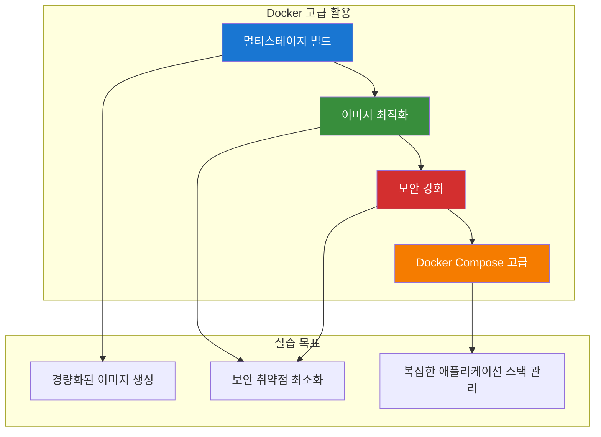
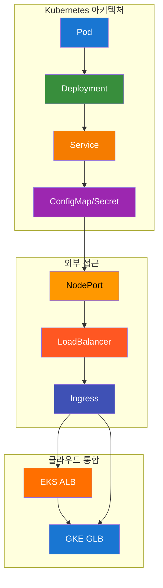
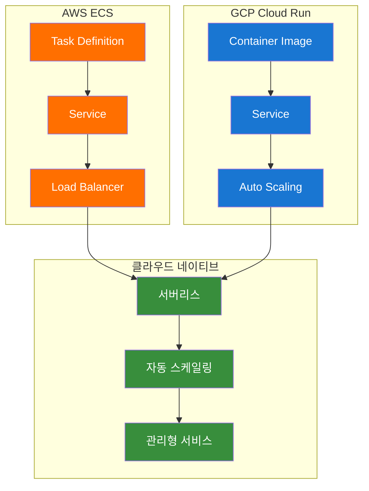
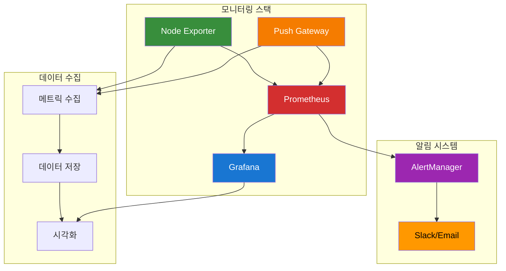

# ☁️ 클라우드 중급 과정 - Day 1 강의 시나리오

## 📋 강의 개요

### 🎯 강의 목표
- **Docker 고급 활용**: 멀티스테이지 빌드, 이미지 최적화 기법을 이해하고 적용
- **Kubernetes 기초**: Pod, Service, Deployment 등 Kubernetes 핵심 리소스를 이해하고 관리
- **클라우드 컨테이너 서비스**: AWS ECS, GCP Cloud Run을 활용하여 클라우드 환경에 컨테이너 애플리케이션 배포
- **통합 모니터링 허브**: AWS VM 기반 Prometheus + Grafana를 구축하여 모니터링 인프라 준비

### ⏰ 강의 시간
- **총 강의 시간**: 8시간 (480분)
- **1교시**: Docker 고급 활용 (90분)
- **2교시**: Kubernetes 기초 (120분)
- **3교시**: 클라우드 컨테이너 서비스 (90분)
- **4교시**: 통합 모니터링 허브 (90분)
- **점심 시간**: 60분
- **실습 정리**: 30분

### 👥 대상 수강생
- **선수 학습**: Docker 기초, 컨테이너 개념 이해
- **수강생 수**: 20-30명
- **실습 환경**: 개인별 클라우드 환경 (AWS/GCP)

---

## 🕘 1교시: Docker 고급 활용 (09:00-10:30)

### 📚 강의 내용 (30분)

#### Docker 고급 개념 소개


#### 핵심 개념 설명
- **멀티스테이지 빌드**: 빌드 도구와 런타임 환경 분리
- **이미지 최적화**: 레이어 최적화, 불필요한 파일 제거
- **보안 강화**: non-root 사용자, 최소 권한 원칙
- **Docker Compose**: 복잡한 애플리케이션 스택 관리

### 🛠️ 실습 진행 (60분)

#### 실습 1: 멀티스테이지 빌드 (20분)
```bash
# 실습 스크립트 실행
cd /home/ec2-user/mcp-cloud-workspace/mcp_cloud/mcp_knowledge_base/cloud_intermediate/repo/automation/day1
./day1-practice.sh

# 메뉴 선택: 1. Docker 고급 활용
# 1. 멀티스테이지 빌드 실습
```

**실습 내용**:
- Node.js 애플리케이션 멀티스테이지 빌드
- 빌드 도구와 런타임 환경 분리
- 이미지 크기 비교 (단일 스테이지 vs 멀티스테이지)

#### 실습 2: 이미지 최적화 (20분)
```bash
# 2. 이미지 최적화 실습
```

**실습 내용**:
- Alpine Linux 기반 경량 이미지 생성
- 불필요한 패키지 제거
- 레이어 최적화

#### 실습 3: 보안 강화 (20분)
```bash
# 3. 보안 강화 실습
```

**실습 내용**:
- non-root 사용자 설정
- 최소 권한 원칙 적용
- 보안 스캔 도구 활용

### 📊 실습 결과 확인
- [ ] 멀티스테이지 빌드 성공
- [ ] 이미지 크기 최적화 확인
- [ ] 보안 취약점 최소화
- [ ] Docker Compose 스택 관리

---

## 🕘 2교시: Kubernetes 기초 (10:45-12:45)

### 📚 강의 내용 (30분)

#### Kubernetes 핵심 개념 소개


#### 핵심 개념 설명
- **Pod**: Kubernetes의 최소 배포 단위
- **Deployment**: Pod의 선언적 관리
- **Service**: Pod 그룹에 대한 네트워크 접근
- **ConfigMap/Secret**: 설정 및 보안 정보 관리
- **LoadBalancer**: 외부 접근을 위한 로드 밸런서

### 🛠️ 실습 진행 (90분)

#### 실습 1: 클러스터 Context 구성 (15분)
```bash
# 실습 스크립트 실행
./day1-practice.sh

# 메뉴 선택: 2. Kubernetes 기초 실습
# 1. K8s 클러스터 컨텍스트 구성 및 체크
# 2. 클러스터 전환 (EKS ↔ GKE)
```

**실습 내용**:
- AWS EKS 클러스터 연결
- GCP GKE 클러스터 연결
- 클러스터 간 전환

#### 실습 2: Workload 배포 (30분)
```bash
# 3. Pod 생성 및 관리
# 4. Deployment 생성 및 관리
# 5. Service 생성 및 관리
# 6. ConfigMap 및 Secret 관리
# 7. 전체 K8s 리소스 배포
```

**실습 내용**:
- Pod, Deployment, Service 생성
- ConfigMap과 Secret을 활용한 설정 관리
- 리소스 상태 모니터링

#### 실습 3: 외부 접근 구성 (30분)
```bash
# 8. LoadBalancer 서비스 배포 (EKS ALB / GKE GLB)
# 9. NodePort 서비스 배포
# 10. Ingress 설정
# 11. 포트 포워딩 테스트
```

**실습 내용**:
- NodePort를 통한 외부 접근
- EKS ALB LoadBalancer 배포
- GKE GLB LoadBalancer 배포
- Ingress를 통한 고급 라우팅

#### 실습 4: 문제 해결 (15분)
```bash
# 12. 리소스 상태 확인
```

**실습 내용**:
- LoadBalancer 문제 진단
- 네트워크 연결 테스트
- 성능 최적화

### 📊 실습 결과 확인
- [ ] Kubernetes 클러스터 Context 구성 완료
- [ ] Pod, Deployment, Service 배포 성공
- [ ] ConfigMap과 Secret 설정 완료
- [ ] LoadBalancer 외부 접근 구성 완료
- [ ] 문제 해결 및 최적화 완료

---

## 🕘 점심 시간 (12:45-13:45)

### 🍽️ 점심 및 휴식
- **시간**: 60분
- **활동**: 점심 식사, 개인 휴식
- **준비사항**: 실습 환경 유지

---

## 🕘 3교시: 클라우드 컨테이너 서비스 (13:45-15:15)

### 📚 강의 내용 (30분)

#### 클라우드 컨테이너 서비스 소개


#### 핵심 개념 설명
- **AWS ECS**: 컨테이너 오케스트레이션 서비스
- **GCP Cloud Run**: 서버리스 컨테이너 플랫폼
- **클라우드 네이티브**: 클라우드 환경에 최적화된 배포 전략

### 🛠️ 실습 진행 (60분)

#### 실습 1: AWS ECS 배포 (30분)
```bash
# 실습 스크립트 실행
./day1-practice.sh

# 메뉴 선택: 3. 클라우드 컨테이너 서비스
# 1. AWS ECS 태스크 정의 및 서비스 생성
```

**실습 내용**:
- ECS 태스크 정의 생성
- ECS 서비스 생성
- Application Load Balancer 연결
- 자동 스케일링 설정

#### 실습 2: GCP Cloud Run 배포 (30분)
```bash
# 2. GCP Cloud Run 서비스 배포
```

**실습 내용**:
- Cloud Run 서비스 배포
- 자동 스케일링 설정
- 트래픽 관리
- 보안 설정

### 📊 실습 결과 확인
- [ ] AWS ECS 컨테이너 서비스 배포 완료
- [ ] GCP Cloud Run 서버리스 배포 완료
- [ ] 자동 스케일링 설정 완료
- [ ] 로드 밸런서 연결 완료

---

## 🕘 4교시: 통합 모니터링 허브 (15:30-17:00)

### 📚 강의 내용 (30분)

#### 모니터링 시스템 소개


#### 핵심 개념 설명
- **Prometheus**: 메트릭 수집 및 저장
- **Grafana**: 데이터 시각화 및 대시보드
- **Node Exporter**: 시스템 메트릭 수집
- **AlertManager**: 알림 관리

### 🛠️ 실습 진행 (60분)

#### 실습 1: Prometheus 설치 (20분)
```bash
# 실습 스크립트 실행
./day1-practice.sh

# 메뉴 선택: 4. 통합 모니터링 허브
# 1. Prometheus 설치 및 설정
```

**실습 내용**:
- Prometheus 서버 설치
- 설정 파일 구성
- 서비스 시작 및 확인

#### 실습 2: Grafana 설치 (20분)
```bash
# 2. Grafana 설치 및 설정
```

**실습 내용**:
- Grafana 서버 설치
- Prometheus 데이터 소스 연결
- 기본 대시보드 생성

#### 실습 3: Node Exporter 설정 (20분)
```bash
# 3. Node Exporter 및 Push Gateway 설정
```

**실습 내용**:
- Node Exporter 설치
- Push Gateway 설정
- 메트릭 수집 확인

### 📊 실습 결과 확인
- [ ] Prometheus 서버 정상 작동
- [ ] Grafana 대시보드 접근 가능
- [ ] Node Exporter 메트릭 수집 확인
- [ ] AlertManager 알림 설정 완료

---

## 🕘 실습 정리 (17:00-17:30)

### 🧹 실습 정리 (30분)

#### 자동 정리 실행
```bash
# Day1 실습 자동 정리
./day1-practice.sh

# 메뉴에서 "정리" 옵션 선택
```

#### 정리 내용
- [ ] Docker 이미지 정리
- [ ] Kubernetes 리소스 정리
- [ ] 클라우드 리소스 정리
- [ ] 모니터링 스택 정리

### 📊 학습 성과 확인

#### 실습 완료 체크리스트
- [ ] Docker 멀티스테이지 빌드 실습 완료
- [ ] Kubernetes 기본 리소스 생성 및 관리 완료
- [ ] AWS ECS 컨테이너 서비스 배포 완료
- [ ] GCP Cloud Run 서버리스 배포 완료
- [ ] Prometheus + Grafana 모니터링 시스템 구축 완료

#### 다음 단계 안내
- **Day 2 실습**으로 진행: CI/CD 및 고급 클라우드 배포
- **통합 강의 시나리오** 확인
- **통합 모니터링 시나리오** 확인

---

## 📋 강의 진행 체크리스트

### ✅ 강의 준비
- [ ] 실습 환경 설정 완료
- [ ] 강의 자료 준비 완료
- [ ] 실습 스크립트 테스트 완료
- [ ] 클라우드 리소스 준비 완료

### ✅ 강의 진행
- [ ] 1교시: Docker 고급 활용 (90분)
- [ ] 2교시: Kubernetes 기초 (120분)
- [ ] 점심 시간 (60분)
- [ ] 3교시: 클라우드 컨테이너 서비스 (90분)
- [ ] 4교시: 통합 모니터링 허브 (90분)
- [ ] 실습 정리 (30분)

### ✅ 강의 마무리
- [ ] 학습 성과 확인
- [ ] 다음 단계 안내
- [ ] 질문 및 답변
- [ ] 피드백 수집

---

## 🎯 강의 성공 지표

### 📊 정량적 지표
- **실습 완료율**: 95% 이상
- **환경 설정 성공률**: 90% 이상
- **LoadBalancer 접근 성공률**: 85% 이상
- **모니터링 시스템 구축 성공률**: 90% 이상

### 📊 정성적 지표
- **수강생 만족도**: 4.5/5.0 이상
- **실습 이해도**: 90% 이상
- **문제 해결 능력**: 향상 확인
- **다음 단계 준비도**: 85% 이상

---

## 🔗 관련 문서

- [Day 1 강의안](../Day1_강의안.md)
- [학습 경로](../learning-path.md)
- [과정 개요](../README.md)
- [통합 강의 시나리오](../통합강의시나리오.md)
- [통합 모니터링 시나리오](../통합모니터링시나리오.md)

---

**💡 강의 진행 중 문제가 발생하면 실시간으로 지원해드리겠습니다!**  
**수강생의 학습 성과를 최대화하기 위해 지속적으로 모니터링하겠습니다.**

