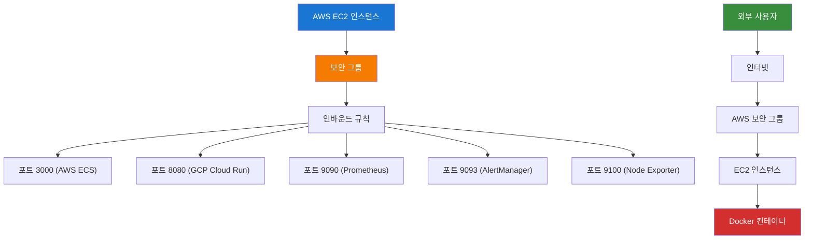

# 🌐 외부 접속 및 보안 설정 가이드

## 📋 개요

이 가이드는 AWS EC2 환경에서 실습한 컨테이너 애플리케이션과 모니터링 시스템을 외부에서 접속할 수 있도록 하는 방법을 설명합니다.

## 🎯 학습 목표

- AWS 보안 그룹 설정 방법 이해
- 외부 IP 주소 확인 및 접속 URL 생성
- 외부 접속 테스트 및 검증 방법
- 실습 결과 외부 공유 방법

## 🔧 AWS 보안 그룹 자동 설정

### 보안 그룹 설정 원리



### 자동 설정 스크립트

```bash
#!/bin/bash
# AWS 보안 그룹 자동 설정

# 현재 인스턴스 ID 가져오기
INSTANCE_ID=$(curl -s http://169.254.169.254/latest/meta-data/instance-id)

# 보안 그룹 ID 가져오기
SECURITY_GROUP_ID=$(aws ec2 describe-instances \
    --instance-ids "$INSTANCE_ID" \
    --query 'Reservations[0].Instances[0].SecurityGroups[0].GroupId' \
    --output text)

# 필요한 포트들 설정
PORTS=(3000 8080 9090 9093 9100)

for port in "${PORTS[@]}"; do
    echo "포트 $port 인바운드 규칙 설정 중..."
    
    # 기존 규칙 확인
    existing_rule=$(aws ec2 describe-security-groups \
        --group-ids "$SECURITY_GROUP_ID" \
        --query "SecurityGroups[0].IpPermissions[?FromPort==\`$port\` && ToPort==\`$port\` && IpProtocol==\`tcp\`]" \
        --output text)
    
    if [ -z "$existing_rule" ]; then
        # 새 규칙 추가
        aws ec2 authorize-security-group-ingress \
            --group-id "$SECURITY_GROUP_ID" \
            --protocol tcp \
            --port "$port" \
            --cidr 0.0.0.0/0
        echo "✅ 포트 $port 규칙 추가 완료"
    else
        echo "ℹ️ 포트 $port 규칙이 이미 존재합니다"
    fi
done
```

## 🌍 외부 IP 주소 확인

### AWS EC2 메타데이터 사용

```bash
# AWS EC2 퍼블릭 IP 가져오기
curl -s http://169.254.169.254/latest/meta-data/public-ipv4
```

### 외부 서비스 사용 (Fallback)

```bash
# 외부 서비스에서 IP 확인
curl -s https://ipinfo.io/ip
curl -s https://ifconfig.me
curl -s https://api.ipify.org
```

### 자동 IP 감지 스크립트

```bash
#!/bin/bash
# 외부 IP 자동 감지

get_external_ip() {
    # AWS EC2 메타데이터에서 퍼블릭 IP 가져오기
    if curl -s --max-time 2 http://169.254.169.254/latest/meta-data/public-ipv4 2>/dev/null; then
        return 0
    fi
    
    # 외부 서비스에서 IP 가져오기 (fallback)
    curl -s --max-time 5 https://ipinfo.io/ip 2>/dev/null || \
    curl -s --max-time 5 https://ifconfig.me 2>/dev/null || \
    curl -s --max-time 5 https://api.ipify.org 2>/dev/null || \
    echo "localhost"
}

EXTERNAL_IP=$(get_external_ip)
echo "외부 IP: $EXTERNAL_IP"
```

## 🐳 Docker 컨테이너 외부 바인딩

### 컨테이너 외부 접속 설정

```bash
# AWS ECS 테스트 앱 (외부 접속 가능)
docker run -d --name test-app \
    -p 0.0.0.0:3000:3000 \
    cloud-intermediate-app:test

# GCP Cloud Run 테스트 앱 (외부 접속 가능)
docker run -d --name test-app-gcp \
    -p 0.0.0.0:8080:8080 \
    cloud-intermediate-app-gcp:test
```

### Docker Compose 외부 바인딩

```yaml
# docker-compose-simple.yml
version: '3.8'

services:
  prometheus:
    image: prom/prometheus:latest
    container_name: prometheus
    ports:
      - "0.0.0.0:9090:9090"  # 외부 접속 가능
    
  grafana:
    image: grafana/grafana:latest
    container_name: grafana
    ports:
      - "0.0.0.0:3000:3000"  # 외부 접속 가능
    
  node-exporter:
    image: prom/node-exporter:latest
    container_name: node-exporter
    ports:
      - "0.0.0.0:9100:9100"  # 외부 접속 가능
    
  alertmanager:
    image: prom/alertmanager:latest
    container_name: alertmanager
    ports:
      - "0.0.0.0:9093:9093"  # 외부 접속 가능
```

## 🧪 외부 접속 테스트

### 자동 테스트 스크립트

```bash
#!/bin/bash
# 외부 접속 테스트 자동화

EXTERNAL_IP="3.38.192.99"  # 실제 외부 IP로 변경

# 테스트할 URL들
declare -A test_urls=(
    ["AWS ECS 앱"]="http://$EXTERNAL_IP:3000/health"
    ["GCP Cloud Run 앱"]="http://$EXTERNAL_IP:8080/health"
    ["Prometheus"]="http://$EXTERNAL_IP:9090/api/v1/status/config"
    ["Grafana"]="http://$EXTERNAL_IP:3000/api/health"
    ["AlertManager"]="http://$EXTERNAL_IP:9093/api/v1/status"
    ["Node Exporter"]="http://$EXTERNAL_IP:9100/metrics"
)

# 각 URL 테스트
for service in "${!test_urls[@]}"; do
    url="${test_urls[$service]}"
    echo "🔍 $service 외부 접속 테스트: $url"
    
    # 최대 3번 재시도
    for i in {1..3}; do
        if curl -f -s --max-time 10 "$url" >/dev/null 2>&1; then
            echo "✅ $service 외부 접속 성공 (${i}번째 시도)"
            break
        else
            echo "⚠️ $service 외부 접속 실패 (${i}/3 시도)"
            if [ $i -eq 3 ]; then
                echo "❌ $service 외부 접속 최종 실패"
            else
                sleep 2
            fi
        fi
    done
done
```

## 🌐 외부 접속 URL 생성

### 접속 URL 템플릿

```bash
#!/bin/bash
# 외부 접속 URL 자동 생성

EXTERNAL_IP=$(curl -s https://ipinfo.io/ip)

echo "🌐 외부에서 접속 가능한 URL:"
echo ""
echo "AWS ECS 테스트 앱:"
echo "   http://$EXTERNAL_IP:3000"
echo "   - 헬스체크: http://$EXTERNAL_IP:3000/health"
echo "   - API 상태: http://$EXTERNAL_IP:3000/api/status"
echo "   - 메트릭: http://$EXTERNAL_IP:3000/metrics"
echo ""
echo "GCP Cloud Run 테스트 앱:"
echo "   http://$EXTERNAL_IP:8080"
echo "   - 헬스체크: http://$EXTERNAL_IP:8080/health"
echo "   - API 상태: http://$EXTERNAL_IP:8080/api/status"
echo "   - 메트릭: http://$EXTERNAL_IP:8080/metrics"
echo ""
echo "통합 모니터링 허브:"
echo "   - Prometheus: http://$EXTERNAL_IP:9090"
echo "   - Grafana: http://$EXTERNAL_IP:3000 (admin/admin)"
echo "   - AlertManager: http://$EXTERNAL_IP:9093"
echo "   - Node Exporter: http://$EXTERNAL_IP:9100/metrics"
```

## 🔍 문제 해결

### 일반적인 문제들

#### 1. 보안 그룹 규칙이 적용되지 않음
```bash
# 보안 그룹 규칙 확인
aws ec2 describe-security-groups \
    --group-ids sg-037c23cab8693a6ba \
    --query 'SecurityGroups[0].IpPermissions'

# 수동으로 규칙 추가
aws ec2 authorize-security-group-ingress \
    --group-id sg-037c23cab8693a6ba \
    --protocol tcp \
    --port 3000 \
    --cidr 0.0.0.0/0
```

#### 2. 컨테이너가 외부에서 접속되지 않음
```bash
# 컨테이너 포트 바인딩 확인
docker ps

# 올바른 바인딩으로 재시작
docker stop test-app
docker rm test-app
docker run -d --name test-app -p 0.0.0.0:3000:3000 cloud-intermediate-app:test
```

#### 3. 외부 IP를 가져올 수 없음
```bash
# 여러 방법으로 IP 확인
curl -s http://169.254.169.254/latest/meta-data/public-ipv4
curl -s https://ipinfo.io/ip
curl -s https://ifconfig.me
curl -s https://api.ipify.org
```

## 📊 모니터링 및 검증

### 실시간 상태 확인

```bash
# 모든 서비스 상태 확인
curl -f http://3.38.192.99:3000/health && echo "AWS ECS: OK"
curl -f http://3.38.192.99:8080/health && echo "GCP Cloud Run: OK"
curl -f http://3.38.192.99:9090/api/v1/status/config && echo "Prometheus: OK"
curl -f http://3.38.192.99:3000/api/health && echo "Grafana: OK"
curl -f http://3.38.192.99:9093/api/v1/status && echo "AlertManager: OK"
curl -f http://3.38.192.99:9100/metrics && echo "Node Exporter: OK"
```

### 성능 테스트

```bash
# 응답 시간 측정
time curl -s http://3.38.192.99:3000/health
time curl -s http://3.38.192.99:8080/health
time curl -s http://3.38.192.99:9090/api/v1/status/config
```

## 🎯 실습 완료 체크리스트

- [ ] AWS 보안 그룹 자동 설정 완료
- [ ] 외부 IP 주소 확인 완료
- [ ] Docker 컨테이너 외부 바인딩 완료
- [ ] 모든 서비스 외부 접속 테스트 성공
- [ ] 외부 접속 URL 생성 및 공유 완료
- [ ] 실습 결과 외부에서 확인 가능

## 📚 추가 학습 자료

- [AWS 보안 그룹 가이드](https://docs.aws.amazon.com/ec2/latest/userguide/working-with-security-groups.html)
- [Docker 포트 바인딩 가이드](https://docs.docker.com/engine/reference/run/#expose-incoming-ports)
- [외부 접속 테스트 도구](https://httpie.io/)

---

이 가이드를 통해 실습한 모든 서비스를 외부에서 접속하여 확인할 수 있습니다! 🚀
