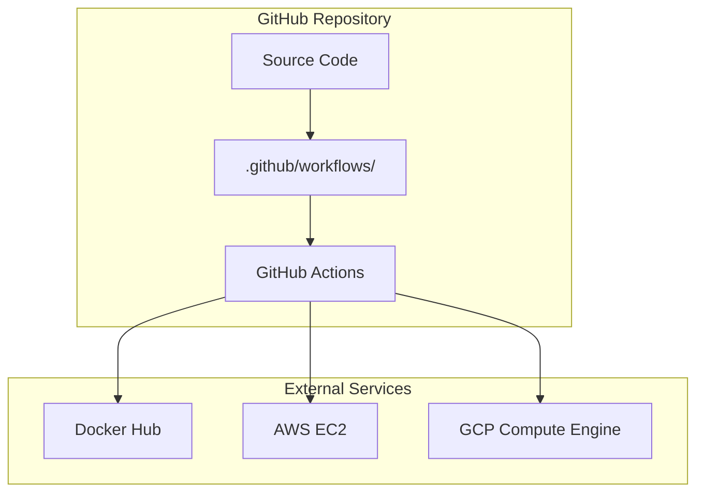

# GitHub Actions 기초 실습 가이드

<details>
<summary>📋 목차</summary>

1. [🎯 학습 목표](#-학습-목표)
2. [📚 실습 개요](#-실습-개요)
3. [🔧 실습 환경 준비](#-실습-환경-준비)
4. [🚀 GitHub Actions 기본 개념](#-github-actions-기본-개념)
5. [📝 워크플로우 작성 실습](#-워크플로우-작성-실습)
6. [🐳 Docker 이미지 자동 빌드](#-docker-이미지-자동-빌드)
7. [☁️ VM 기반 배포 자동화](#-vm-기반-배포-자동화)
8. [📚 문제 해결 및 참고 자료](#-문제-해결-및-참고-자료)

</details>

---

## 🎯 학습 목표

<details>
<summary>📖 이번 실습에서 배우게 될 내용</summary>

### 핵심 학습 목표
- **GitHub Actions 개념** 이해 및 워크플로우 작성법
- **자동화된 CI/CD 파이프라인** 구축
- **Docker 이미지 자동 빌드** 및 레지스트리 푸시
- **VM 기반 배포 자동화** 구현

### 실습 후 달성할 수 있는 능력
- ✅ GitHub Actions 워크플로우 작성 및 관리
- ✅ 자동화된 CI/CD 파이프라인 구축
- ✅ Docker 이미지 자동 빌드 및 배포
- ✅ VM 기반 웹 애플리케이션 배포 자동화

### 예상 소요 시간
- **GitHub Actions 기초**: 60-90분
- **워크플로우 작성**: 90-120분
- **Docker 자동 빌드**: 60-90분
- **VM 배포 자동화**: 90-120분
- **전체 과정**: 5-7시간

</details>

---

## 📚 실습 개요

<details>
<summary>📖 실습 개요</summary>

### 실습 목적
**Cloud Intermediate 과정을 위한 GitHub Actions 기초 실습**

### 실습 범위
- GitHub Actions 개념 및 워크플로우 구조
- 자동화된 테스트, 빌드, 배포 파이프라인
- Docker 이미지 자동 빌드 및 레지스트리 푸시
- VM 기반 웹 애플리케이션 배포 자동화

### 실습 환경
- **GitHub 계정**: 저장소 생성 및 Actions 사용
- **Docker Hub 계정**: 이미지 저장소
- **AWS/GCP 계정**: VM 배포용
- **로컬 환경**: Git, Docker, VS Code

### 실습 결과물
- GitHub Actions 워크플로우
- 자동화된 CI/CD 파이프라인
- Docker 이미지 자동 빌드
- VM 기반 웹 애플리케이션 배포

</details>

---

## 🔧 실습 환경 준비

<details>
<summary>📋 필수 요구사항</summary>

### 필수 계정
- **GitHub 계정**: 저장소 생성 및 Actions 사용
- **Docker Hub 계정**: 이미지 저장소
- **AWS/GCP 계정**: VM 배포용 (Cloud Basic 과정 완료)

### 필수 도구
- **Git**: 버전 관리
- **Docker**: 컨테이너 빌드
- **VS Code**: 코드 편집
- **터미널/명령 프롬프트**: CLI 명령어 실행

### 도구 설치
```bash
# Git 설치 확인
git --version

# Docker 설치 확인
docker --version

# VS Code 설치 (선택사항)
# https://code.visualstudio.com/
```

</details>

<details>
<summary>📋 실습 전 체크리스트</summary>

### 환경 확인
- [ ] GitHub 계정이 생성되어 있는가?
- [ ] Docker Hub 계정이 생성되어 있는가?
- [ ] AWS/GCP 계정이 설정되어 있는가?
- [ ] Git이 설치되어 있는가?
- [ ] Docker가 설치되어 있는가?

### 계정 준비
- [ ] GitHub Personal Access Token이 준비되어 있는가?
- [ ] Docker Hub 로그인이 완료되었는가?
- [ ] AWS/GCP CLI가 설정되어 있는가?

</details>

---

## 🚀 GitHub Actions 기본 개념

### 1. GitHub Actions 아키텍처



### 2. 핵심 구성 요소

| 구성 요소 | 설명 | 용도 |
|-----------|------|------|
| **Workflow** | 자동화된 프로세스 | CI/CD 파이프라인 |
| **Job** | 워크플로우 내 작업 단위 | 테스트, 빌드, 배포 |
| **Step** | Job 내 실행 단위 | 명령어, 액션 실행 |
| **Action** | 재사용 가능한 단위 | 공통 작업 자동화 |
| **Runner** | 워크플로우 실행 환경 | GitHub 호스팅 또는 자체 호스팅 |

---

## 📝 기본 워크플로우 작성

### 1. 워크플로우 파일 생성

```yaml
# .github/workflows/ci-cd.yml
name: CI/CD Pipeline

# 워크플로우 트리거 조건
on:
  push:
    branches: [ main, develop ]
  pull_request:
    branches: [ main ]

# 환경 변수
env:
  NODE_VERSION: '18'
  DOCKER_IMAGE: 'my-web-app'
  DOCKER_TAG: 'latest'

# 워크플로우 실행
jobs:
  # 테스트 Job
  test:
    runs-on: ubuntu-latest
    steps:
    - name: Checkout code
      uses: actions/checkout@v4
      
    - name: Setup Node.js
      uses: actions/setup-node@v4
      with:
        node-version: ${{ env.NODE_VERSION }}
        cache: 'npm'
        
    - name: Install dependencies
      run: npm install
      
    - name: Run tests
      run: npm test
      
    - name: Run linting
      run: npm run lint

  # 빌드 Job
  build:
    needs: test
    runs-on: ubuntu-latest
    steps:
    - name: Checkout code
      uses: actions/checkout@v4
      
    - name: Setup Docker Buildx
      uses: docker/setup-buildx-action@v3
      
    - name: Login to Docker Hub
      uses: docker/login-action@v3
      with:
        username: ${{ secrets.DOCKER_USERNAME }}
        password: ${{ secrets.DOCKER_PASSWORD }}
        
    - name: Build and push Docker image
      uses: docker/build-push-action@v5
      with:
        context: .
        push: true
        tags: ${{ secrets.DOCKER_USERNAME }}/${{ env.DOCKER_IMAGE }}:${{ env.DOCKER_TAG }}

  # 배포 Job
  deploy:
    needs: build
    runs-on: ubuntu-latest
    if: github.ref == 'refs/heads/main'
    steps:
    - name: Deploy to AWS EC2
      uses: appleboy/ssh-action@v1.0.0
      with:
        host: ${{ secrets.AWS_EC2_HOST }}
        username: ${{ secrets.AWS_EC2_USERNAME }}
        key: ${{ secrets.AWS_EC2_SSH_KEY }}
        script: |
          docker pull ${{ secrets.DOCKER_USERNAME }}/${{ env.DOCKER_IMAGE }}:${{ env.DOCKER_TAG }}
          docker stop my-web-app || true
          docker rm my-web-app || true
          docker run -d --name my-web-app -p 80:3000 ${{ secrets.DOCKER_USERNAME }}/${{ env.DOCKER_IMAGE }}:${{ env.DOCKER_TAG }}
```

### 2. 워크플로우 파일 구조

```yaml
# 워크플로우 메타데이터
name: 워크플로우 이름
on: 트리거 조건
env: 환경 변수

# 실행할 작업들
jobs:
  job-name:
    runs-on: 실행 환경
    steps:
    - name: 단계 이름
      uses: 액션 또는 run: 명령어
```

---

## 🐳 Docker 이미지 자동 빌드

### 1. Dockerfile 최적화

```dockerfile
# Dockerfile
FROM node:18-alpine AS builder

WORKDIR /app
COPY package*.json ./
RUN npm ci --only=production

FROM node:18-alpine AS runtime

WORKDIR /app
COPY --from=builder /app/node_modules ./node_modules
COPY . .

EXPOSE 3000
USER node

CMD ["npm", "start"]
```

### 2. Docker 이미지 빌드 워크플로우

```yaml
# .github/workflows/docker-build.yml
name: Docker Build and Push

on:
  push:
    branches: [ main ]
    tags: [ 'v*' ]

jobs:
  build:
    runs-on: ubuntu-latest
    steps:
    - name: Checkout
      uses: actions/checkout@v4
      
    - name: Set up Docker Buildx
      uses: docker/setup-buildx-action@v3
      
    - name: Login to Docker Hub
      uses: docker/login-action@v3
      with:
        username: ${{ secrets.DOCKER_USERNAME }}
        password: ${{ secrets.DOCKER_PASSWORD }}
        
    - name: Extract metadata
      id: meta
      uses: docker/metadata-action@v5
      with:
        images: ${{ secrets.DOCKER_USERNAME }}/my-web-app
        tags: |
          type=ref,event=branch
          type=ref,event=pr
          type=semver,pattern={{version}}
          type=semver,pattern={{major}}.{{minor}}
          type=raw,value=latest,enable={{is_default_branch}}
          
    - name: Build and push
      uses: docker/build-push-action@v5
      with:
        context: .
        platforms: linux/amd64,linux/arm64
        push: true
        tags: ${{ steps.meta.outputs.tags }}
        labels: ${{ steps.meta.outputs.labels }}
        cache-from: type=gha
        cache-to: type=gha,mode=max
```

---

## 🚀 VM 기반 배포 자동화

### 1. AWS EC2 배포 워크플로우

```yaml
# .github/workflows/deploy-aws.yml
name: Deploy to AWS EC2

on:
  push:
    branches: [ main ]

jobs:
  deploy:
    runs-on: ubuntu-latest
    steps:
    - name: Deploy to AWS EC2
      uses: appleboy/ssh-action@v1.0.0
      with:
        host: ${{ secrets.AWS_EC2_HOST }}
        username: ${{ secrets.AWS_EC2_USERNAME }}
        key: ${{ secrets.AWS_EC2_SSH_KEY }}
        script: |
          # Docker 이미지 풀
          docker pull ${{ secrets.DOCKER_USERNAME }}/my-web-app:latest
          
          # 기존 컨테이너 중지 및 제거
          docker stop my-web-app || true
          docker rm my-web-app || true
          
          # 새 컨테이너 실행
          docker run -d \
            --name my-web-app \
            --restart unless-stopped \
            -p 80:3000 \
            -e NODE_ENV=production \
            ${{ secrets.DOCKER_USERNAME }}/my-web-app:latest
          
          # 헬스 체크
          sleep 10
          curl -f http://localhost:3000/health || exit 1
          
          # 로그 확인
          docker logs my-web-app
```

### 2. GCP Compute Engine 배포 워크플로우

```yaml
# .github/workflows/deploy-gcp.yml
name: Deploy to GCP Compute Engine

on:
  push:
    branches: [ main ]

jobs:
  deploy:
    runs-on: ubuntu-latest
    steps:
    - name: Checkout
      uses: actions/checkout@v4
      
    - name: Setup Google Cloud CLI
      uses: google-github-actions/setup-gcloud@v1
      with:
        service_account_key: ${{ secrets.GCP_SA_KEY }}
        project_id: ${{ secrets.GCP_PROJECT_ID }}
        
    - name: Deploy to GCP
      run: |
        gcloud compute ssh ${{ secrets.GCP_INSTANCE_NAME }} \
          --zone=${{ secrets.GCP_ZONE }} \
          --command="
            docker pull ${{ secrets.DOCKER_USERNAME }}/my-web-app:latest
            docker stop my-web-app || true
            docker rm my-web-app || true
            docker run -d \
              --name my-web-app \
              --restart unless-stopped \
              -p 80:3000 \
              -e NODE_ENV=production \
              ${{ secrets.DOCKER_USERNAME }}/my-web-app:latest
          "
```

---

## 🔐 시크릿 설정

### 1. GitHub Repository Secrets

```markdown
# GitHub Repository → Settings → Secrets and variables → Actions

DOCKER_USERNAME: your-dockerhub-username
DOCKER_PASSWORD: your-dockerhub-password
AWS_EC2_HOST: your-ec2-public-ip
AWS_EC2_USERNAME: ec2-user
AWS_EC2_SSH_KEY: your-ssh-private-key
GCP_SA_KEY: your-service-account-key
GCP_PROJECT_ID: your-gcp-project-id
GCP_INSTANCE_NAME: your-instance-name
GCP_ZONE: asia-northeast3-a
```

### 2. SSH 키 생성 및 설정

```bash
# SSH 키 생성
ssh-keygen -t rsa -b 4096 -C "github-actions@example.com"

# 공개키를 EC2 인스턴스에 추가
ssh-copy-id -i ~/.ssh/id_rsa.pub ec2-user@your-ec2-ip

# 개인키를 GitHub Secrets에 추가
cat ~/.ssh/id_rsa
```

---

## 🧪 실습 프로젝트

### 1. 프로젝트 구조

```
my-web-app/
├── .github/
│   └── workflows/
│       ├── ci-cd.yml
│       ├── docker-build.yml
│       ├── deploy-aws.yml
│       └── deploy-gcp.yml
├── src/
│   ├── app.js
│   ├── package.json
│   └── tests/
│       └── app.test.js
├── Dockerfile
├── docker-compose.yml
└── README.md
```

### 2. 기본 웹 애플리케이션

```javascript
// src/app.js
const express = require('express');
const app = express();
const port = process.env.PORT || 3000;

app.get('/', (req, res) => {
  res.json({
    message: 'Hello from GitHub Actions!',
    timestamp: new Date().toISOString(),
    environment: process.env.NODE_ENV || 'development'
  });
});

app.get('/health', (req, res) => {
  res.json({
    status: 'healthy',
    uptime: process.uptime(),
    memory: process.memoryUsage()
  });
});

app.listen(port, '0.0.0.0', () => {
  console.log(`Server running on port ${port}`);
});
```

### 3. package.json

```json
{
  "name": "my-web-app",
  "version": "1.0.0",
  "description": "Web app for GitHub Actions practice",
  "main": "src/app.js",
  "scripts": {
    "start": "node src/app.js",
    "test": "jest",
    "lint": "eslint src/",
    "dev": "nodemon src/app.js"
  },
  "dependencies": {
    "express": "^4.18.2"
  },
  "devDependencies": {
    "jest": "^29.5.0",
    "eslint": "^8.40.0",
    "nodemon": "^2.0.22"
  }
}
```

---

## ✅ 실습 완료 체크리스트

- [ ] GitHub Actions 워크플로우 작성법 숙지
- [ ] Docker 이미지 자동 빌드 및 푸시
- [ ] AWS EC2 자동 배포 구현
- [ ] GCP Compute Engine 자동 배포 구현
- [ ] 시크릿 설정 및 보안 관리
- [ ] 워크플로우 로그 및 디버깅

---

## 🚀 다음 단계

GitHub Actions 기초를 완료했다면 Cloud Master 과정에서 다음 고급 주제로 진행하세요:

### 고급 주제
- **고급 워크플로우**: 조건부 실행, 매트릭스 빌드
- **커스텀 액션**: 재사용 가능한 액션 개발
- **환경별 배포**: Staging, Production 환경 분리
- **모니터링**: 배포 상태 및 알림 설정

### 실무 적용
- **팀 협업**: 브랜치 전략 및 코드 리뷰
- **품질 관리**: 자동화된 테스트 및 코드 품질 검사
- **보안**: 시크릿 관리 및 보안 스캔
- **성능**: 빌드 최적화 및 캐싱 전략

---

## 📚 문제 해결 및 참고 자료

<details>
<summary>🐛 자주 발생하는 문제</summary>

### GitHub Actions 관련 문제
<details>
<summary>❌ 워크플로우 실행 실패</summary>

**원인**: 
- YAML 문법 오류
- 시크릿 설정 누락
- 권한 부족

**해결방법**:
1. YAML 문법 검증
2. 시크릿 설정 확인
3. 권한 설정 확인

</details>

<details>
<summary>❌ Docker 빌드 실패</summary>

**원인**:
- Dockerfile 문법 오류
- 의존성 설치 실패
- 이미지 태그 오류

**해결방법**:
```bash
# 1. Dockerfile 문법 확인
docker build -t test-image .

# 2. 의존성 확인
docker run --rm -v $(pwd):/app -w /app node:18 npm install

# 3. 이미지 태그 확인
docker images
```

</details>

### 배포 관련 문제
<details>
<summary>❌ SSH 접속 실패</summary>

**원인**:
- SSH 키 설정 오류
- 보안 그룹 설정 오류
- 인스턴스 상태 문제

**해결방법**:
```bash
# 1. SSH 키 확인
ssh-keygen -l -f ~/.ssh/id_rsa.pub

# 2. SSH 접속 테스트
ssh -i ~/.ssh/id_rsa ec2-user@your-ec2-ip

# 3. 보안 그룹 확인
aws ec2 describe-security-groups --group-ids sg-xxxxxxxx
```

</details>

<details>
<summary>❌ Docker 이미지 푸시 실패</summary>

**원인**:
- Docker Hub 로그인 실패
- 이미지 태그 오류
- 권한 부족

**해결방법**:
```bash
# 1. Docker Hub 로그인
docker login

# 2. 이미지 태그 확인
docker images

# 3. 이미지 푸시
docker push username/image-name:tag
```

</details>

</details>

<details>
<summary>📖 추가 학습 자료</summary>

### 공식 문서
- [GitHub Actions 공식 문서](https://docs.github.com/en/actions)
- [Docker 공식 문서](https://docs.docker.com/)
- [AWS EC2 공식 문서](https://docs.aws.amazon.com/ec2/)
- [GCP Compute Engine 공식 문서](https://cloud.google.com/compute/docs)

### 유용한 리소스
- [GitHub Actions Marketplace](https://github.com/marketplace?type=actions)
- [Docker Hub](https://hub.docker.com/)
- [AWS Workshop](https://workshops.aws/)
- [GCP Workshop](https://cloud.google.com/training)

### 관련 프로젝트
- [GitHub Actions 샘플](https://github.com/actions/starter-workflows)
- [Docker 샘플](https://github.com/docker/awesome-compose)
- [AWS 샘플](https://github.com/aws-samples)
- [GCP 샘플](https://github.com/GoogleCloudPlatform)

</details>

<details>
<summary>🚀 다음 단계</summary>

### Cloud Master 과정 준비
1. **고급 CI/CD**: 복잡한 파이프라인 구축
2. **컨테이너 오케스트레이션**: Docker Compose, Kubernetes
3. **로드 밸런싱**: 고가용성 아키텍처
4. **모니터링**: 로그 및 메트릭 수집

### Cloud Container 과정 준비
1. **Kubernetes**: 컨테이너 오케스트레이션
2. **ECS/Fargate**: AWS 컨테이너 서비스
3. **GKE**: Google Kubernetes Engine
4. **서비스 메시**: Istio, Linkerd

</details>

---

## 🎉 실습 완료!

축하합니다! GitHub Actions 기초 실습을 완료했습니다.

### 📚 학습 요약

이번 실습을 통해 다음을 배웠습니다:

1. **🚀 GitHub Actions**: 워크플로우 작성 및 관리
2. **🐳 Docker**: 이미지 자동 빌드 및 배포
3. **☁️ VM 배포**: AWS/GCP 자동 배포
4. **🔧 CI/CD**: 자동화된 파이프라인 구축

### 🚀 다음 단계

- **Cloud Master 과정**: 고급 CI/CD 및 컨테이너 배포
- **Cloud Container 과정**: Kubernetes 및 오케스트레이션
- **실무 적용**: 팀 프로젝트에 CI/CD 적용

### 💡 추가 학습 아이디어

1. **고급 워크플로우**: 조건부 실행, 매트릭스 빌드
2. **커스텀 액션**: 재사용 가능한 액션 개발
3. **환경별 배포**: Staging, Production 환경 분리
4. **모니터링**: 배포 상태 및 알림 설정

---

**🎯 이제 GitHub Actions의 기본기를 갖추었습니다! Cloud Master 과정으로 진행하세요.**
