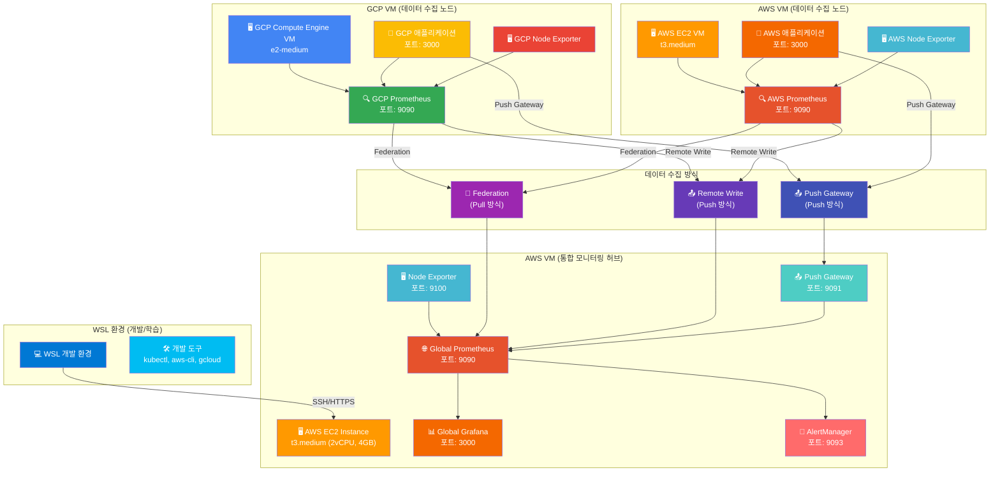

# 📊 멀티 클라우드 통합 모니터링 시나리오

## 🎯 시나리오 개요

### 현재 문제점
- **단일 환경 가정**: 로컬 Docker Compose 환경만 고려
- **실제 환경 미고려**: GCP와 AWS가 별도 네트워크에 있는 현실 무시
- **설치 중심**: Prometheus + Grafana 설치만 하고 실제 모니터링 활용 부족
- **네트워크 분리**: 멀티 클라우드 환경에서의 데이터 수집 방법 부재

### 해결 방안
- **AWS VM 기반 통합 모니터링 허브** 구축
- **단계별 점진적 모니터링** 구축 (Infrastructure → Platform → Application)
- **실제 모니터링 활용** 중심의 실습 구성
- **멀티 클라우드 데이터 수집** 전략 수립

---

## 🏗️ 아키텍처 설계

### 📊 전체 아키텍처



### 🔄 데이터 수집 전략

#### 1. Federation (Pull 방식)
```yaml
# Global Prometheus 설정
scrape_configs:
  - job_name: 'federated-prometheus'
    scrape_interval: 15s
    honor_labels: true
    metrics_path: '/federate'
    params:
      'match[]':
        - '{job=~".*"}'
    static_configs:
      - targets:
        - 'gcp-prometheus:9090'
        - 'aws-prometheus:9090'
```

#### 2. Remote Write (Push 방식)
```yaml
# 클러스터별 Prometheus 설정
remote_write:
  - url: 'http://aws-vm:9090/api/v1/write'
    queue_config:
      max_samples_per_send: 1000
      batch_send_deadline: 5s
```

#### 3. Push Gateway (Push 방식)
```yaml
# 애플리케이션 메트릭 전송
pushgateway:
  url: 'http://aws-vm:9091'
  job: 'application-metrics'
  instance: 'app-instance'
```

---

## 🚀 단계별 구축 계획

### **Phase 1: AWS VM 기반 통합 모니터링 허브 구축**

#### 1.1 AWS EC2 인스턴스 생성
```bash
# EC2 인스턴스 생성
aws ec2 run-instances \
  --image-id ami-0c02fb55956c7d316 \
  --instance-type t3.medium \
    --key-name my-key \
    --security-group-ids sg-12345 \
    --subnet-id subnet-12345 \
    --tag-specifications 'ResourceType=instance,Tags=[{Key=Name,Value=monitoring-hub}]'

# 인스턴스 상태 확인
aws ec2 describe-instances --filters "Name=tag:Name,Values=monitoring-hub"
```

#### 1.2 Prometheus 설치 및 설정
```bash
# Prometheus 설치
wget https://github.com/prometheus/prometheus/releases/download/v2.40.0/prometheus-2.40.0.linux-amd64.tar.gz
tar xzf prometheus-2.40.0.linux-amd64.tar.gz
sudo mv prometheus-2.40.0.linux-amd64 /opt/prometheus

# Prometheus 설정 파일 생성
cat > /opt/prometheus/prometheus.yml << 'EOF'
global:
  scrape_interval: 15s
  evaluation_interval: 15s

scrape_configs:
  - job_name: 'prometheus'
    static_configs:
      - targets: ['localhost:9090']

  - job_name: 'node-exporter'
    static_configs:
      - targets: ['localhost:9100']
  
  - job_name: 'pushgateway'
    static_configs:
      - targets: ['localhost:9091']

  # Federation 설정
  - job_name: 'federated-prometheus'
    scrape_interval: 15s
    honor_labels: true
    metrics_path: '/federate'
    params:
      'match[]':
        - '{job=~".*"}'
    static_configs:
      - targets:
        - 'gcp-prometheus:9090'
        - 'aws-prometheus:9090'

# Remote Write 설정
remote_write:
  - url: 'http://localhost:9090/api/v1/write'
    queue_config:
      max_samples_per_send: 1000
      batch_send_deadline: 5s
EOF

# Prometheus 서비스 시작
sudo systemctl start prometheus
sudo systemctl enable prometheus
```

#### 1.3 Grafana 설치 및 설정
```bash
# Grafana 설치
wget https://dl.grafana.com/oss/release/grafana-9.3.0.linux-amd64.tar.gz
tar xzf grafana-9.3.0.linux-amd64.tar.gz
sudo mv grafana-9.3.0 /opt/grafana

# Grafana 서비스 시작
sudo systemctl start grafana-server
sudo systemctl enable grafana-server

# Grafana 접속 확인
curl http://localhost:3000
```

#### 1.4 Node Exporter 설치
```bash
# Node Exporter 설치
wget https://github.com/prometheus/node_exporter/releases/download/v1.5.0/node_exporter-1.5.0.linux-amd64.tar.gz
tar xzf node_exporter-1.5.0.linux-amd64.tar.gz
sudo mv node_exporter-1.5.0.linux-amd64/node_exporter /usr/local/bin/

# Node Exporter 서비스 시작
sudo systemctl start node_exporter
sudo systemctl enable node_exporter
```

#### 1.5 Push Gateway 설치
```bash
# Push Gateway 설치
wget https://github.com/prometheus/pushgateway/releases/download/v1.5.1/pushgateway-1.5.1.linux-amd64.tar.gz
tar xzf pushgateway-1.5.1.linux-amd64.tar.gz
sudo mv pushgateway-1.5.1.linux-amd64/pushgateway /usr/local/bin/

# Push Gateway 서비스 시작
sudo systemctl start pushgateway
sudo systemctl enable pushgateway
```

### **Phase 2: AWS EC2 VM 모니터링**

#### 2.1 AWS EC2 VM 생성
```bash
# EC2 인스턴스 생성
aws ec2 run-instances \
  --image-id ami-0c02fb55956c7d316 \
  --instance-type t3.medium \
    --key-name my-key \
    --security-group-ids sg-12345 \
    --subnet-id subnet-12345 \
    --tag-specifications 'ResourceType=instance,Tags=[{Key=Name,Value=aws-monitoring-vm}]'

# 인스턴스 상태 확인
aws ec2 describe-instances --filters "Name=tag:Name,Values=aws-monitoring-vm"

# SSH 접속
ssh -i ~/.ssh/my-key.pem ubuntu@AWS_VM_IP
```

#### 2.2 Docker 기반 모니터링 스택 배포
```bash
# Docker 설치
sudo apt-get update
sudo apt-get install -y docker.io docker-compose

# Docker 서비스 시작
sudo systemctl start docker
sudo systemctl enable docker

# 사용자를 docker 그룹에 추가
sudo usermod -aG docker $USER

# 모니터링 스택 Docker Compose 파일 생성
cat > docker-compose.yml << 'EOF'
version: '3.8'
services:
  prometheus:
    image: prom/prometheus:latest
    ports:
      - "9090:9090"
    volumes:
      - ./prometheus.yml:/etc/prometheus/prometheus.yml
    command:
      - '--config.file=/etc/prometheus/prometheus.yml'
      - '--storage.tsdb.path=/prometheus'
      - '--web.console.libraries=/etc/prometheus/console_libraries'
      - '--web.console.templates=/etc/prometheus/consoles'

  grafana:
    image: grafana/grafana:latest
    ports:
      - "3000:3000"
    environment:
      - GF_SECURITY_ADMIN_PASSWORD=admin
    volumes:
      - grafana-storage:/var/lib/grafana

  node-exporter:
    image: prom/node-exporter:latest
    ports:
      - "9100:9100"
    volumes:
      - /proc:/host/proc:ro
      - /sys:/host/sys:ro
      - /:/rootfs:ro
    command:
      - '--path.procfs=/host/proc'
      - '--path.sysfs=/host/sys'
      - '--collector.filesystem.mount-points-exclude=^/(sys|proc|dev|host|etc)($$|/)'

volumes:
  grafana-storage:
EOF

# Docker Compose 실행
docker-compose up -d
```

#### 2.3 Infrastructure/Platform 모니터링 설정
```bash
# Prometheus 설정 파일 생성
cat > prometheus.yml << 'EOF'
global:
  scrape_interval: 15s
  evaluation_interval: 15s

scrape_configs:
  - job_name: 'prometheus'
    static_configs:
      - targets: ['localhost:9090']

  - job_name: 'node-exporter'
    static_configs:
      - targets: ['node-exporter:9100']

  - job_name: 'grafana'
    static_configs:
      - targets: ['grafana:3000']
EOF

# 모니터링 스택 상태 확인
docker-compose ps
curl http://localhost:9090/api/v1/targets
curl http://localhost:3000/api/health
```

### **Phase 3: AWS EC2 VM 애플리케이션 모니터링**

#### 3.1 애플리케이션 배포
```bash
# 애플리케이션 Docker 이미지 생성
cat > Dockerfile << 'EOF'
FROM nginx:1.21
COPY index.html /usr/share/nginx/html/
EXPOSE 80
EOF

# 애플리케이션 HTML 파일 생성
cat > index.html << 'EOF'
<!DOCTYPE html>
<html>
<head>
    <title>AWS EC2 VM 애플리케이션</title>
</head>
<body>
    <h1>AWS EC2 VM 애플리케이션</h1>
    <p>현재 시간: <span id="time"></span></p>
    <script>
        document.getElementById('time').textContent = new Date().toLocaleString();
    </script>
</body>
</html>
EOF

# Docker 이미지 빌드 및 실행
docker build -t aws-monitoring-app .
docker run -d -p 3000:80 --name aws-monitoring-app aws-monitoring-app

# 애플리케이션 상태 확인
curl http://localhost:3000
docker ps
```

#### 3.2 Application 모니터링 확인
```bash
# 애플리케이션 상태 확인
docker ps
docker logs aws-monitoring-app

# 애플리케이션 메트릭 확인
curl http://localhost:3000/metrics

# Prometheus 타겟 확인
curl http://localhost:9090/api/v1/targets

# Grafana 대시보드 확인
curl http://localhost:3000/api/health
```

### **Phase 4: GCP Compute Engine VM 통합 모니터링**

#### 4.1 GCP Compute Engine VM 생성
```bash
# GCP Compute Engine VM 생성
gcloud compute instances create gcp-monitoring-vm \
    --zone=us-central1-a \
    --machine-type=e2-medium \
    --image-family=ubuntu-2004-lts \
    --image-project=ubuntu-os-cloud \
    --boot-disk-size=20GB \
    --boot-disk-type=pd-standard \
    --tags=monitoring-vm

# VM 상태 확인
gcloud compute instances list

# SSH 접속
gcloud compute ssh gcp-monitoring-vm --zone=us-central1-a
```

#### 4.2 GCP VM 모니터링 스택 배포
```bash
# Docker 설치
sudo apt-get update
sudo apt-get install -y docker.io docker-compose

# Docker 서비스 시작
sudo systemctl start docker
sudo systemctl enable docker

# 사용자를 docker 그룹에 추가
sudo usermod -aG docker $USER

# 모니터링 스택 Docker Compose 파일 생성
cat > docker-compose.yml << 'EOF'
version: '3.8'
services:
  prometheus:
    image: prom/prometheus:latest
    ports:
      - "9090:9090"
    volumes:
      - ./prometheus.yml:/etc/prometheus/prometheus.yml
    command:
      - '--config.file=/etc/prometheus/prometheus.yml'
      - '--storage.tsdb.path=/prometheus'

  grafana:
    image: grafana/grafana:latest
    ports:
      - "3000:3000"
    environment:
      - GF_SECURITY_ADMIN_PASSWORD=admin
    volumes:
      - grafana-storage:/var/lib/grafana

  node-exporter:
    image: prom/node-exporter:latest
    ports:
      - "9100:9100"
    volumes:
      - /proc:/host/proc:ro
      - /sys:/host/sys:ro
      - /:/rootfs:ro
    command:
      - '--path.procfs=/host/proc'
      - '--path.sysfs=/host/sys'

volumes:
  grafana-storage:
EOF

# Docker Compose 실행
docker-compose up -d
```

#### 4.3 Global Prometheus에 GCP VM 연동
```bash
# GCP VM 메트릭 수집 설정
cat > prometheus.yml << 'EOF'
global:
  scrape_interval: 15s
  evaluation_interval: 15s

scrape_configs:
  - job_name: 'prometheus'
    static_configs:
      - targets: ['localhost:9090']

  - job_name: 'node-exporter'
    static_configs:
      - targets: ['node-exporter:9100']

  - job_name: 'grafana'
    static_configs:
      - targets: ['grafana:3000']

  # GCP VM 애플리케이션 모니터링
  - job_name: 'gcp-vm-app'
    static_configs:
      - targets: ['gcp-monitoring-vm:3000']
EOF

# 모니터링 스택 상태 확인
docker-compose ps
curl http://localhost:9090/api/v1/targets
curl http://localhost:3000/api/health
```

---

## 💰 비용 최적화

### **AWS 리소스 비용**
- **EC2 t3.medium**: 월 $30-40
- **데이터 전송**: 월 $5-10

### **GCP 리소스 비용**
- **Compute Engine e2-medium**: 월 $25-35
- **데이터 전송**: 월 $5-10

### **총 예상 비용**
- **월 총 비용**: $70-100
- **실습 기간 (2일)**: $5-10

---

## 🧪 테스트 및 검증

### **통합 테스트 스크립트**
```bash
#!/bin/bash
# 통합 모니터링 시스템 테스트

echo "🔍 통합 모니터링 시스템 테스트 시작"

# 1. AWS VM 연결 테스트
echo "1. AWS VM 연결 테스트"
ssh -i ~/.ssh/my-key.pem ubuntu@AWS_VM_IP "curl -s http://localhost:9090/api/v1/status/config"

# 2. Prometheus 타겟 확인
echo "2. Prometheus 타겟 확인"
curl -s http://AWS_VM_IP:9090/api/v1/targets | jq '.data.activeTargets[] | {job: .labels.job, health: .health}'

# 3. Grafana 대시보드 확인
echo "3. Grafana 대시보드 확인"
curl -s http://AWS_VM_IP:3000/api/health

# 4. AWS 클러스터 모니터링 확인
echo "4. AWS 클러스터 모니터링 확인"
kubectl get pods -n monitoring
kubectl get servicemonitors

# 5. GCP 클러스터 모니터링 확인
echo "5. GCP 클러스터 모니터링 확인"
kubectl get pods -n monitoring
kubectl get servicemonitors

echo "✅ 통합 모니터링 시스템 테스트 완료"
```

### **성능 테스트**
```bash
# 메트릭 수집 성능 테스트
curl -s http://AWS_VM_IP:9090/api/v1/query?query=rate(prometheus_tsdb_head_samples_appended_total[5m])

# 대시보드 로딩 성능 테스트
time curl -s http://AWS_VM_IP:3000/api/dashboards/home

# 알림 시스템 테스트
curl -s http://AWS_VM_IP:9093/api/v1/alerts
```

---

## 📋 체크리스트

### **Phase 1 완료 확인**
- [ ] AWS EC2 인스턴스 생성 및 접속
- [ ] Prometheus 설치 및 설정
- [ ] Grafana 설치 및 설정
- [ ] Node Exporter 설치 및 설정
- [ ] Push Gateway 설치 및 설정

### **Phase 2 완료 확인**
- [ ] AWS EC2 VM 생성
- [ ] Docker 기반 모니터링 스택 배포
- [ ] Infrastructure 모니터링 설정
- [ ] Platform 모니터링 설정

### **Phase 3 완료 확인**
- [ ] AWS EC2 VM 애플리케이션 배포
- [ ] VM 기반 Application 모니터링 설정
- [ ] 메트릭 수집 확인
- [ ] 대시보드 구성

### **Phase 4 완료 확인**
- [ ] GCP Compute Engine VM 생성
- [ ] GCP VM 모니터링 설정
- [ ] 멀티 클라우드 VM 통합 모니터링
- [ ] Global Dashboard 구성

### **최종 검증**
- [ ] 모든 VM에서 메트릭 수집 확인
- [ ] 통합 대시보드 정상 동작
- [ ] 알림 시스템 정상 동작
- [ ] 비용 최적화 확인

---

## 🚀 다음 단계

### **고급 모니터링 기능**
- **VM 기반 배포**: 실제 프로덕션 환경과 유사한 VM 기반 배포 경험
- **Service Mesh 모니터링**: Istio, Linkerd 모니터링
- **APM (Application Performance Monitoring)**: Jaeger, Zipkin 연동
- **로그 통합**: ELK Stack (Elasticsearch, Logstash, Kibana) 연동
- **AI/ML 기반 모니터링**: 이상 탐지 및 예측 분석

### **실무 적용**
- **프로덕션 환경**: 실제 운영 환경에 적용
- **팀 협업**: 모니터링 대시보드 공유 및 알림 설정
- **지속적 개선**: 모니터링 정책 및 알림 규칙 최적화

---

**🎯 멀티 클라우드 통합 모니터링 시스템을 통해 현대적인 DevOps 역량을 완성하세요!**