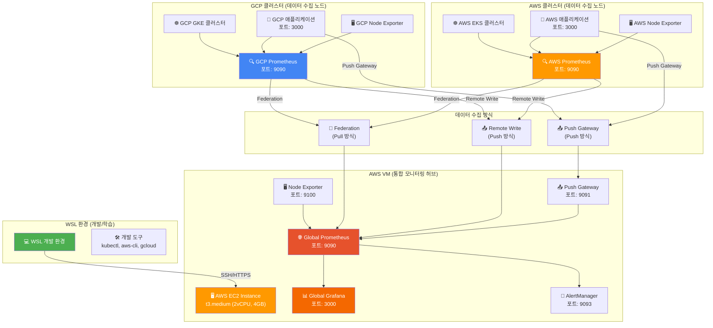

# 📊 멀티 클라우드 통합 모니터링 시나리오

> 📋 **문서 목적**: Cloud Intermediate 과정의 모니터링 실습을 위한 멀티 클라우드 통합 모니터링 시스템 구축 가이드  
> 📋 **대상 환경**: AWS, GCP 클라우드 환경 + WSL 로컬 개발 환경  
> 📋 **모니터링 범위**: Infrastructure, Platform, Application 3계층 통합 모니터링  

---

## 🎯 **시나리오 개요**

### **현재 문제점**
- **단일 환경 가정**: 로컬 Docker Compose 환경만 고려
- **실제 환경 미고려**: GCP와 AWS가 별도 네트워크에 있는 현실 무시
- **설치 중심**: Prometheus + Grafana 설치만 하고 실제 모니터링 활용 부족
- **네트워크 분리**: 멀티 클라우드 환경에서의 데이터 수집 방법 부재

### **해결 방안**
- **AWS VM 기반 통합 모니터링 허브** 구축
- **단계별 점진적 모니터링** 구축 (Infrastructure → Platform → Application)
- **실제 모니터링 활용** 중심의 실습 구성
- **멀티 클라우드 데이터 수집** 전략 수립

---

## 🏗️ **아키텍처 설계**

### **📊 전체 아키텍처**



### **🔧 데이터 수집 전략**

#### **1. Federation (Pull 방식)**
- **목적**: 클러스터별 Prometheus에서 메트릭을 주기적으로 가져오기
- **장점**: 실시간성, 네트워크 효율성
- **단점**: 네트워크 연결 필요

#### **2. Remote Write (Push 방식)**
- **목적**: 클러스터별 Prometheus에서 Global Prometheus로 메트릭 전송
- **장점**: 안정성, 오프라인 복구 가능
- **단점**: 네트워크 대역폭 사용

#### **3. Push Gateway (Push 방식)**
- **목적**: 일시적 작업의 메트릭을 중앙에서 수집
- **장점**: 배치 작업 모니터링 가능
- **단점**: 메트릭 지연 가능성

---

## 📋 **단계별 구축 계획**

### **🏗️ Phase 1: 통합 모니터링 허브 구축**

> ⏱️ **예상 소요 시간**: 2-3시간  
> 🎯 **학습 목표**: AWS VM에 통합 모니터링 허브 구축  
> ✅ **완료 기준**: Global Prometheus + Grafana 정상 동작 확인  

#### **1-1. AWS EC2 인스턴스 생성**

<details>
<summary>📋 클릭하여 코드 복사</summary>

```bash
# AWS EC2 인스턴스 생성
aws ec2 run-instances \
  --image-id ami-0c02fb55956c7d316 \
  --instance-type t3.medium \
  --key-name monitoring-key \
  --security-group-ids sg-monitoring \
  --subnet-id subnet-monitoring \
  --associate-public-ip-address \
  --tag-specifications 'ResourceType=instance,Tags=[{Key=Name,Value=global-monitoring-hub}]'
```

</details>

**✅ 확인 사항**:
- [ ] EC2 인스턴스가 성공적으로 생성되었는지 확인
- [ ] 인스턴스 ID를 기록해두기 (예: i-1234567890abcdef0)

#### **1-2. Elastic IP 할당**

<details>
<summary>📋 클릭하여 코드 복사</summary>

```bash
# Elastic IP 할당
aws ec2 allocate-address --domain vpc

# 할당된 Elastic IP를 인스턴스에 연결 (인스턴스 ID는 위에서 확인한 값 사용)
aws ec2 associate-address \
  --instance-id i-1234567890abcdef0 \
  --allocation-id eipalloc-12345678
```

</details>

**✅ 확인 사항**:
- [ ] Elastic IP가 성공적으로 할당되었는지 확인
- [ ] Public IP 주소를 기록해두기 (예: 3.123.45.67)

#### **1-3. 보안 그룹 생성**

<details>
<summary>📋 클릭하여 코드 복사</summary>

```bash
# 보안 그룹 생성
aws ec2 create-security-group \
  --group-name global-monitoring-sg \
  --description "Security group for global monitoring hub"
```

</details>

#### **1-4. 인바운드 규칙 설정**

<details>
<summary>📋 클릭하여 코드 복사</summary>

```bash
# SSH 접근 허용 (포트 22)
aws ec2 authorize-security-group-ingress \
  --group-id sg-12345678 \
  --protocol tcp \
  --port 22 \
  --cidr 0.0.0.0/0

# Prometheus 접근 허용 (포트 9090)
aws ec2 authorize-security-group-ingress \
  --group-id sg-12345678 \
  --protocol tcp \
  --port 9090 \
  --cidr 0.0.0.0/0

# Grafana 접근 허용 (포트 3000)
aws ec2 authorize-security-group-ingress \
  --group-id sg-12345678 \
  --protocol tcp \
  --port 3000 \
  --cidr 0.0.0.0/0

# AlertManager 접근 허용 (포트 9093)
aws ec2 authorize-security-group-ingress \
  --group-id sg-12345678 \
  --protocol tcp \
  --port 9093 \
  --cidr 0.0.0.0/0
```

</details>

**✅ 확인 사항**:
- [ ] 모든 포트가 정상적으로 열렸는지 확인
- [ ] 보안 그룹 ID를 기록해두기 (예: sg-12345678)

#### **1-5. AWS VM 접속 및 기본 설정**

<details>
<summary>📋 클릭하여 코드 복사</summary>

```bash
# AWS VM에 SSH 접속 (Public IP는 위에서 확인한 값 사용)
ssh -i monitoring-key.pem ubuntu@3.123.45.67

# 시스템 업데이트
sudo apt-get update && sudo apt-get upgrade -y
```

</details>

**✅ 확인 사항**:
- [ ] SSH 접속이 성공적으로 되었는지 확인
- [ ] 시스템 업데이트가 완료되었는지 확인

#### **1-6. Docker 및 Docker Compose 설치**

<details>
<summary>📋 클릭하여 코드 복사</summary>

```bash
# Docker 설치
sudo apt-get install -y docker.io docker-compose

# Docker 서비스 시작 및 자동 시작 설정
sudo systemctl start docker
sudo systemctl enable docker

# 현재 사용자를 docker 그룹에 추가
sudo usermod -aG docker ubuntu

# 변경사항 적용을 위해 로그아웃 후 재접속
exit
```

</details>

**✅ 확인 사항**:
- [ ] Docker가 정상적으로 설치되었는지 확인: `docker --version`
- [ ] Docker 서비스가 실행 중인지 확인: `sudo systemctl status docker`

#### **1-7. 모니터링 디렉토리 구조 생성**

<details>
<summary>📋 클릭하여 코드 복사</summary>

```bash
# 모니터링 디렉토리 구조 생성
mkdir -p /home/ubuntu/monitoring/{prometheus,grafana,alertmanager,dashboards}
cd /home/ubuntu/monitoring

# 디렉토리 구조 확인
tree monitoring/ || ls -la monitoring/
```

</details>

**✅ 확인 사항**:
- [ ] 모니터링 디렉토리가 생성되었는지 확인
- [ ] 디렉토리 구조가 올바른지 확인

#### **1-8. Global Prometheus 설정 파일 생성**

<details>
<summary>📋 클릭하여 코드 복사</summary>

```bash
# Prometheus 설정 파일 생성
cat > /home/ubuntu/monitoring/prometheus/prometheus.yml << 'EOF'
global:
  scrape_interval: 15s
  external_labels:
    environment: 'production'
    region: 'global'

scrape_configs:
  # AWS VM 로컬 메트릭 수집
  - job_name: 'aws-vm-local'
    static_configs:
      - targets: ['node-exporter:9100']
    scrape_interval: 15s

  # Push Gateway 메트릭 수집
  - job_name: 'pushgateway'
    static_configs:
      - targets: ['pushgateway:9091']
    honor_labels: true
    scrape_interval: 5s

  # GCP 클러스터 메트릭 수집 (Federation) - 나중에 추가
  - job_name: 'gcp-cluster-federation'
    scrape_interval: 30s
    honor_labels: true
    metrics_path: /federate
    params:
      'match[]':
        - '{job=~"gcp-.*"}'
    static_configs:
      - targets: ['gcp-prometheus.example.com:9090']
    basic_auth:
      username: 'prometheus'
      password: 'secure-password'

  # AWS 클러스터 메트릭 수집 (Federation) - 나중에 추가
  - job_name: 'aws-cluster-federation'
    scrape_interval: 30s
    honor_labels: true
    metrics_path: /federate
    params:
      'match[]':
        - '{job=~"aws-.*"}'
    static_configs:
      - targets: ['aws-prometheus.example.com:9090']
    basic_auth:
      username: 'prometheus'
      password: 'secure-password'
EOF
```

</details>

**✅ 확인 사항**:
- [ ] Prometheus 설정 파일이 생성되었는지 확인: `cat /home/ubuntu/monitoring/prometheus/prometheus.yml`
- [ ] 설정 파일 내용이 올바른지 확인

#### **1-9. Docker Compose 파일 생성**

<details>
<summary>📋 클릭하여 코드 복사</summary>

```bash
# Docker Compose 파일 생성
cat > /home/ubuntu/monitoring/docker-compose.yml << 'EOF'
version: '3.8'

services:
  # Global Prometheus
  prometheus:
    image: prom/prometheus:latest
    container_name: global-prometheus
    ports:
      - "9090:9090"
    volumes:
      - prometheus/prometheus.yml:/etc/prometheus/prometheus.yml
      - prometheus_data:/prometheus
    command:
      - '--config.file=/etc/prometheus/prometheus.yml'
      - '--storage.tsdb.path=/prometheus'
      - '--web.enable-lifecycle'
      - '--web.enable-admin-api'
    networks:
      - monitoring

  # Node Exporter
  node-exporter:
    image: prom/node-exporter:latest
    container_name: node-exporter
    ports:
      - "9100:9100"
    volumes:
      - /proc:/host/proc:ro
      - /sys:/host/sys:ro
      - /:/rootfs:ro
    command:
      - '--path.procfs=/host/proc'
      - '--path.rootfs=/rootfs'
      - '--path.sysfs=/host/sys'
    networks:
      - monitoring

  # Grafana
  grafana:
    image: grafana/grafana:latest
    container_name: global-grafana
    ports:
      - "3000:3000"
    environment:
      - GF_SECURITY_ADMIN_PASSWORD=admin123
    volumes:
      - grafana_data:/var/lib/grafana
    networks:
      - monitoring

  # Push Gateway
  pushgateway:
    image: prom/pushgateway:latest
    container_name: pushgateway
    ports:
      - "9091:9091"
    networks:
      - monitoring

  # AlertManager
  alertmanager:
    image: prom/alertmanager:latest
    container_name: alertmanager
    ports:
      - "9093:9093"
    volumes:
      - alertmanager/alertmanager.yml:/etc/alertmanager/alertmanager.yml
    networks:
      - monitoring

volumes:
  prometheus_data:
  grafana_data:

networks:
  monitoring:
    driver: bridge
EOF
```

</details>

**✅ 확인 사항**:
- [ ] Docker Compose 파일이 생성되었는지 확인: `cat /home/ubuntu/monitoring/docker-compose.yml`
- [ ] 파일 내용이 올바른지 확인

#### **1-10. AlertManager 설정 파일 생성**

<details>
<summary>📋 클릭하여 코드 복사</summary>

```bash
# AlertManager 설정 파일 생성
cat > /home/ubuntu/monitoring/alertmanager/alertmanager.yml << 'EOF'
global:
  smtp_smarthost: 'localhost:587'
  smtp_from: 'alerts@example.com'

route:
  group_by: ['alertname']
  group_wait: 10s
  group_interval: 10s
  repeat_interval: 1h
  receiver: 'web.hook'

receivers:
- name: 'web.hook'
  webhook_configs:
  - url: 'http://127.0.0.1:5001/'

- name: 'email'
  email_configs:
  - to: 'admin@example.com'
    subject: 'Alert: {{ .GroupLabels.alertname }}'
    body: |
      {{ range .Alerts }}
      Alert: {{ .Annotations.summary }}
      Description: {{ .Annotations.description }}
      {{ end }}
EOF
```

</details>

#### **1-11. 모니터링 스택 실행**

<details>
<summary>📋 클릭하여 코드 복사</summary>

```bash
# 모니터링 스택 실행
cd /home/ubuntu/monitoring
docker-compose up -d

# 서비스 상태 확인
docker-compose ps

# 로그 확인 (선택사항)
docker-compose logs -f
```

</details>

**✅ 확인 사항**:
- [ ] 모든 서비스가 정상적으로 실행되었는지 확인: `docker-compose ps`
- [ ] Prometheus 접속 확인: `curl http://localhost:9090/api/v1/query?query=up`
- [ ] Grafana 접속 확인: `curl http://localhost:3000/api/health`

#### **1-12. 접속 정보 확인**

<details>
<summary>📋 클릭하여 코드 복사</summary>

```bash
# Public IP 확인
curl -s http://169.254.169.254/latest/meta-data/public-ipv4

# 접속 정보 출력
echo "=== 모니터링 스택 접속 정보 ==="
echo "Public IP: $(curl -s http://169.254.169.254/latest/meta-data/public-ipv4)"
echo "Grafana: http://$(curl -s http://169.254.169.254/latest/meta-data/public-ipv4):3000 (admin/admin123)"
echo "Prometheus: http://$(curl -s http://169.254.169.254/latest/meta-data/public-ipv4):9090"
echo "AlertManager: http://$(curl -s http://169.254.169.254/latest/meta-data/public-ipv4):9093"
echo "Push Gateway: http://$(curl -s http://169.254.169.254/latest/meta-data/public-ipv4):9091"
```

</details>

**✅ Phase 1 완료 확인**:
- [ ] 모든 서비스가 정상적으로 실행 중
- [ ] Grafana 웹 인터페이스 접속 가능
- [ ] Prometheus 웹 인터페이스 접속 가능
- [ ] Node Exporter 메트릭 수집 확인

---

### **☸️ Phase 2: AWS 클러스터 Infrastructure/Platform 모니터링**

> ⏱️ **예상 소요 시간**: 3-4시간  
> 🎯 **학습 목표**: AWS EKS 클러스터 구축 및 Infrastructure/Platform 모니터링 설정  
> ✅ **완료 기준**: AWS 클러스터 메트릭이 Global Prometheus에서 수집되는 것 확인

#### **2-1. AWS EKS 클러스터 생성**

<details>
<summary>📋 클릭하여 코드 복사</summary>

```bash
# EKS 클러스터 생성 (WSL에서 실행)
eksctl create cluster \
  --name aws-monitoring-cluster \
  --region us-west-2 \
  --nodegroup-name worker-nodes \
  --node-type t3.medium \
  --nodes 3 \
  --nodes-min 1 \
  --nodes-max 5 \
  --managed

# 클러스터 생성 완료까지 대기 (약 15-20분 소요)
echo "클러스터 생성 중... 완료까지 15-20분 소요됩니다."
```

</details>

**✅ 확인 사항**:
- [ ] EKS 클러스터가 성공적으로 생성되었는지 확인: `eksctl get cluster --region us-west-2`
- [ ] 클러스터 상태가 ACTIVE인지 확인

#### **2-2. kubectl 설정 및 클러스터 연결**

<details>
<summary>📋 클릭하여 코드 복사</summary>

```bash
# kubectl 설정
aws eks update-kubeconfig --name aws-monitoring-cluster --region us-west-2

# 클러스터 연결 확인
kubectl get nodes
kubectl get pods --all-namespaces
```

</details>

**✅ 확인 사항**:
- [ ] kubectl이 정상적으로 설정되었는지 확인
- [ ] 클러스터에 연결되었는지 확인: `kubectl get nodes`

#### **2-3. Helm 설치 및 Prometheus 스택 배포**

<details>
<summary>📋 클릭하여 코드 복사</summary>

```bash
# Helm 설치 (WSL에서 실행)
curl https://raw.githubusercontent.com/helm/helm/main/scripts/get-helm-3 | bash

# Helm 저장소 추가
helm repo add prometheus-community https://prometheus-community.github.io/helm-charts
helm repo update

# Prometheus 스택 설치
helm install prometheus prometheus-community/kube-prometheus-stack \
  --namespace monitoring \
  --create-namespace \
  --set prometheus.prometheusSpec.retention=30d \
  --set grafana.adminPassword=admin123 \
  --wait
```

</details>

**✅ 확인 사항**:
- [ ] Helm이 정상적으로 설치되었는지 확인: `helm version`
- [ ] Prometheus 스택이 정상적으로 배포되었는지 확인: `kubectl get pods -n monitoring`

#### **2-4. 서비스 상태 확인**

<details>
<summary>📋 클릭하여 코드 복사</summary>

```bash
# 모니터링 네임스페이스의 모든 리소스 확인
kubectl get all -n monitoring

# Prometheus 서비스 확인
kubectl get svc -n monitoring | grep prometheus

# Grafana 서비스 확인
kubectl get svc -n monitoring | grep grafana
```

</details>

**✅ 확인 사항**:
- [ ] 모든 Pod가 Running 상태인지 확인
- [ ] Prometheus와 Grafana 서비스가 정상적으로 생성되었는지 확인

#### **2-5. AWS 클러스터 Prometheus 설정**

<details>
<summary>📋 클릭하여 코드 복사</summary>

```bash
# AWS 클러스터 Prometheus 설정 파일 생성
cat > /home/ubuntu/monitoring/aws-prometheus-config.yml << 'EOF'
global:
  scrape_interval: 15s
  external_labels:
    cluster: 'aws-eks-cluster'
    region: 'us-west-2'

scrape_configs:
  # Kubernetes API 서버
  - job_name: 'kubernetes-apiservers'
    kubernetes_sd_configs:
      - role: endpoints
    scheme: https
    tls_config:
      ca_file: /var/run/secrets/kubernetes.io/serviceaccount/ca.crt
    bearer_token_file: /var/run/secrets/kubernetes.io/serviceaccount/token
    relabel_configs:
      - source_labels: [__meta_kubernetes_namespace, __meta_kubernetes_service_name, __meta_kubernetes_endpoint_port_name]
        action: keep
        regex: default;kubernetes;https

  # Kubernetes 노드
  - job_name: 'kubernetes-nodes'
    kubernetes_sd_configs:
      - role: node
    scheme: https
    tls_config:
      ca_file: /var/run/secrets/kubernetes.io/serviceaccount/ca.crt
    bearer_token_file: /var/run/secrets/kubernetes.io/serviceaccount/token
    relabel_configs:
      - action: labelmap
        regex: __meta_kubernetes_node_label_(.+)

  # Kubernetes Pods
  - job_name: 'kubernetes-pods'
    kubernetes_sd_configs:
      - role: pod
    relabel_configs:
      - source_labels: [__meta_kubernetes_pod_annotation_prometheus_io_scrape]
        action: keep
        regex: true
      - source_labels: [__meta_kubernetes_pod_annotation_prometheus_io_path]
        action: replace
        target_label: __metrics_path__
        regex: (.+)
EOF
```

</details>

#### **2-6. Global Prometheus에 AWS 클러스터 연동 설정**

<details>
<summary>📋 클릭하여 코드 복사</summary>

```bash
# AWS 클러스터의 Prometheus 서비스 엔드포인트 확인
kubectl get svc -n monitoring | grep prometheus-server

# Global Prometheus 설정에 AWS 클러스터 Federation 추가
cat >> /home/ubuntu/monitoring/prometheus/prometheus.yml << 'EOF'

  # AWS 클러스터 메트릭 수집 (Federation) - 실제 엔드포인트로 업데이트 필요
  - job_name: 'aws-cluster-federation'
    scrape_interval: 30s
    honor_labels: true
    metrics_path: /federate
    params:
      'match[]':
        - '{job=~"kubernetes-.*"}'
        - '{job=~"kube-.*"}'
    static_configs:
      - targets: ['aws-prometheus-endpoint:9090']  # 실제 엔드포인트로 변경 필요
    basic_auth:
      username: 'prometheus'
      password: 'secure-password'
EOF
```

</details>

**✅ 확인 사항**:
- [ ] AWS 클러스터 Prometheus 설정 파일이 생성되었는지 확인
- [ ] Global Prometheus 설정이 업데이트되었는지 확인

#### **2-7. 모니터링 스택 재시작 및 데이터 수집 확인**

<details>
<summary>📋 클릭하여 코드 복사</summary>

```bash
# Global Prometheus 재시작
cd /home/ubuntu/monitoring
docker-compose restart prometheus

# 서비스 상태 확인
docker-compose ps

# Prometheus 타겟 확인
curl "http://localhost:9090/api/v1/targets" | jq '.data.activeTargets[] | {job: .labels.job, health: .health}'
```

</details>

**✅ Phase 2 완료 확인**:
- [ ] AWS EKS 클러스터가 정상적으로 생성됨
- [ ] Prometheus 스택이 클러스터에 배포됨
- [ ] Global Prometheus에서 AWS 클러스터 메트릭 수집 확인
- [ ] Infrastructure/Platform 모니터링 대시보드 구성

---
      username: 'prometheus'
      password: 'secure-password'
```

#### **2-8. Infrastructure/Platform 대시보드 구성**

<details>
<summary>📋 클릭하여 코드 복사</summary>

```bash
# Grafana 대시보드 JSON 파일 생성
cat > /home/ubuntu/monitoring/dashboards/aws-infrastructure-dashboard.json << 'EOF'
{
  "dashboard": {
    "title": "AWS EKS Infrastructure Dashboard",
    "panels": [
      {
        "title": "Cluster Overview",
        "type": "stat",
        "targets": [
          {
            "expr": "kube_node_info",
            "legendFormat": "Total Nodes"
          },
          {
            "expr": "kube_pod_info",
            "legendFormat": "Total Pods"
          }
        ]
      },
      {
        "title": "Node CPU Usage",
        "type": "graph",
        "targets": [
          {
            "expr": "100 - (avg(rate(node_cpu_seconds_total{mode=\"idle\"}[5m])) * 100)",
            "legendFormat": "CPU Usage %"
          }
        ]
      },
      {
        "title": "Node Memory Usage",
        "type": "graph",
        "targets": [
          {
            "expr": "(1 - (node_memory_MemAvailable_bytes / node_memory_MemTotal_bytes)) * 100",
            "legendFormat": "Memory Usage %"
          }
        ]
      },
      {
        "title": "Pod Status",
        "type": "table",
        "targets": [
          {
            "expr": "kube_pod_status_phase",
            "legendFormat": "{{phase}}"
          }
        ]
      }
    ]
  }
}
EOF
```

</details>

#### **2-9. Grafana 대시보드 Import**

<details>
<summary>📋 클릭하여 코드 복사</summary>

```bash
# Grafana에 대시보드 Import
# 1. Grafana 웹 인터페이스 접속: http://[Public-IP]:3000
# 2. 로그인: admin / admin123
# 3. + 버튼 클릭 → Import
# 4. 위에서 생성한 JSON 파일 내용 복사하여 붙여넣기
# 5. Import 클릭

# 또는 API를 통한 자동 Import
curl -X POST \
  http://localhost:3000/api/dashboards/db \
  -H 'Content-Type: application/json' \
  -H 'Authorization: Bearer [API-KEY]' \
  -d @/home/ubuntu/monitoring/dashboards/aws-infrastructure-dashboard.json
```

</details>

#### **2-10. 모니터링 쿼리 테스트**

<details>
<summary>📋 클릭하여 코드 복사</summary>

```bash
# Prometheus 쿼리 테스트
# 1. 클러스터 노드 수 확인
curl "http://localhost:9090/api/v1/query?query=kube_node_info"

# 2. CPU 사용률 확인
curl "http://localhost:9090/api/v1/query?query=100%20-%20(avg(rate(node_cpu_seconds_total{mode=\"idle\"}[5m]))%20*%20100)"

# 3. 메모리 사용률 확인
curl "http://localhost:9090/api/v1/query?query=(1%20-%20(node_memory_MemAvailable_bytes%20/%20node_memory_MemTotal_bytes))%20*%20100"

# 4. Pod 상태 확인
curl "http://localhost:9090/api/v1/query?query=kube_pod_status_phase"
```

</details>

**✅ 확인 사항**:
- [ ] Grafana 대시보드가 정상적으로 Import되었는지 확인
- [ ] Infrastructure 메트릭이 정상적으로 표시되는지 확인
- [ ] Platform (Kubernetes) 메트릭이 정상적으로 표시되는지 확인

#### **2-11. 알림 규칙 설정**

<details>
<summary>📋 클릭하여 코드 복사</summary>

```bash
# Prometheus 알림 규칙 생성
cat > /home/ubuntu/monitoring/prometheus/alerts.yml << 'EOF'
groups:
- name: aws-infrastructure-alerts
  rules:
  - alert: HighCPUUsage
    expr: 100 - (avg(rate(node_cpu_seconds_total{mode="idle"}[5m])) * 100) > 80
    for: 5m
    labels:
      severity: warning
    annotations:
      summary: "High CPU usage detected"
      description: "CPU usage is above 80% for more than 5 minutes"

  - alert: HighMemoryUsage
    expr: (1 - (node_memory_MemAvailable_bytes / node_memory_MemTotal_bytes)) * 100 > 85
    for: 5m
    labels:
      severity: warning
    annotations:
      summary: "High memory usage detected"
      description: "Memory usage is above 85% for more than 5 minutes"

  - alert: PodCrashLoopBackOff
    expr: kube_pod_status_phase{phase="Failed"} > 0
    for: 1m
    labels:
      severity: critical
    annotations:
      summary: "Pod in CrashLoopBackOff state"
      description: "Pod {{ $labels.pod }} is in CrashLoopBackOff state"

  - alert: NodeNotReady
    expr: kube_node_status_condition{condition="Ready",status="true"} == 0
    for: 1m
    labels:
      severity: critical
    annotations:
      summary: "Node not ready"
      description: "Node {{ $labels.node }} is not ready"
EOF
```

</details>

**✅ Phase 2 완료 확인**:
- [ ] AWS EKS 클러스터 Infrastructure/Platform 모니터링 완료
- [ ] Grafana 대시보드에서 메트릭 시각화 확인
- [ ] 알림 규칙이 정상적으로 설정됨
- [ ] Global Prometheus에서 AWS 클러스터 데이터 수집 확인

---

### **🚀 Phase 3: AWS Application 모니터링**

> ⏱️ **예상 소요 시간**: 2-3시간  
> 🎯 **학습 목표**: GitHub Actions를 통한 AWS EKS 애플리케이션 배포 및 Application 모니터링 설정  
> ✅ **완료 기준**: 애플리케이션 메트릭이 Global Prometheus에서 수집되는 것 확인

#### **3-1. GitHub Actions 워크플로우 생성**

<details>
<summary>📋 클릭하여 코드 복사</summary>

```yaml
# .github/workflows/deploy-aws-app.yml
name: Deploy to AWS EKS

on:
  push:
    branches: [main]
  pull_request:
    branches: [main]

jobs:
  deploy:
    runs-on: ubuntu-latest
    
    steps:
    - uses: actions/checkout@v2
    
    - name: Configure AWS credentials
      uses: aws-actions/configure-aws-credentials@v1
      with:
        aws-access-key-id: ${{ secrets.AWS_ACCESS_KEY_ID }}
        aws-secret-access-key: ${{ secrets.AWS_SECRET_ACCESS_KEY }}
        aws-region: us-west-2
    
    - name: Build and push Docker image
      run: |
        docker build -t $ECR_REGISTRY/$ECR_REPOSITORY:$GITHUB_SHA .
        docker push $ECR_REGISTRY/$ECR_REPOSITORY:$GITHUB_SHA
    
    - name: Deploy to EKS
      run: |
        aws eks update-kubeconfig --name aws-monitoring-cluster --region us-west-2
        kubectl apply -f k8s/aws-app-deployment.yml
        kubectl apply -f k8s/aws-app-service.yml
        kubectl apply -f k8s/aws-app-monitoring.yml
```

</details>

#### **3-2. 애플리케이션 배포 매니페스트 생성**

<details>
<summary>📋 클릭하여 코드 복사</summary>

```bash
# 애플리케이션 배포 매니페스트 생성
mkdir -p k8s

# Deployment 매니페스트
cat > k8s/aws-app-deployment.yml << 'EOF'
apiVersion: apps/v1
kind: Deployment
metadata:
  name: aws-monitoring-app
  namespace: default
  labels:
    app: aws-monitoring-app
spec:
  replicas: 3
  selector:
    matchLabels:
      app: aws-monitoring-app
  template:
    metadata:
      labels:
        app: aws-monitoring-app
      annotations:
        prometheus.io/scrape: "true"
        prometheus.io/port: "3000"
        prometheus.io/path: "/metrics"
    spec:
      containers:
      - name: aws-monitoring-app
        image: nginx:latest
        ports:
        - containerPort: 80
        - containerPort: 3000
        env:
        - name: APP_NAME
          value: "aws-monitoring-app"
        - name: ENVIRONMENT
          value: "production"
        resources:
          requests:
            memory: "64Mi"
            cpu: "50m"
          limits:
            memory: "128Mi"
            cpu: "100m"
        livenessProbe:
          httpGet:
            path: /
            port: 80
          initialDelaySeconds: 30
          periodSeconds: 10
        readinessProbe:
          httpGet:
            path: /
            port: 80
          initialDelaySeconds: 5
          periodSeconds: 5
EOF
```

</details>

#### **3-3. 서비스 및 모니터링 매니페스트 생성**

<details>
<summary>📋 클릭하여 코드 복사</summary>

```bash
# Service 매니페스트
cat > k8s/aws-app-service.yml << 'EOF'
apiVersion: v1
kind: Service
metadata:
  name: aws-monitoring-app-service
  namespace: default
  labels:
    app: aws-monitoring-app
spec:
  selector:
    app: aws-monitoring-app
  ports:
  - name: http
    port: 80
    targetPort: 80
    protocol: TCP
  - name: metrics
    port: 3000
    targetPort: 3000
    protocol: TCP
  type: ClusterIP
EOF

# ServiceMonitor 매니페스트 (Prometheus가 메트릭을 수집하기 위해)
cat > k8s/aws-app-monitoring.yml << 'EOF'
apiVersion: monitoring.coreos.com/v1
kind: ServiceMonitor
metadata:
  name: aws-monitoring-app
  namespace: monitoring
  labels:
    app: aws-monitoring-app
spec:
  selector:
    matchLabels:
      app: aws-monitoring-app
  endpoints:
  - port: metrics
    path: /metrics
    interval: 30s
EOF
```

</details>

**✅ 확인 사항**:
- [ ] GitHub Actions 워크플로우 파일이 생성되었는지 확인
- [ ] Kubernetes 매니페스트 파일들이 생성되었는지 확인
- [ ] 애플리케이션에 Prometheus 메트릭 수집 설정이 포함되었는지 확인

#### **3-4. 애플리케이션 배포 및 확인**

<details>
<summary>📋 클릭하여 코드 복사</summary>

```bash
# 애플리케이션 배포
kubectl apply -f k8s/aws-app-deployment.yml
kubectl apply -f k8s/aws-app-service.yml
kubectl apply -f k8s/aws-app-monitoring.yml

# 배포 상태 확인
kubectl get pods -l app=aws-monitoring-app
kubectl get svc aws-monitoring-app-service
kubectl get servicemonitor aws-monitoring-app -n monitoring
```

</details>

**✅ 확인 사항**:
- [ ] 애플리케이션 Pod가 정상적으로 실행 중인지 확인
- [ ] 서비스가 정상적으로 생성되었는지 확인
- [ ] ServiceMonitor가 정상적으로 생성되었는지 확인

#### **3-5. 애플리케이션 메트릭 수집 확인**

<details>
<summary>📋 클릭하여 코드 복사</summary>

```bash
# Prometheus에서 애플리케이션 메트릭 확인
curl "http://localhost:9090/api/v1/query?query=up{job=\"aws-monitoring-app\"}"

# 애플리케이션 메트릭 엔드포인트 직접 확인
kubectl port-forward svc/aws-monitoring-app-service 3000:3000 &
curl http://localhost:3000/metrics

# Prometheus 타겟 확인
curl "http://localhost:9090/api/v1/targets" | jq '.data.activeTargets[] | select(.labels.job == "aws-monitoring-app")'
```

</details>

**✅ 확인 사항**:
- [ ] 애플리케이션 메트릭이 Prometheus에서 수집되고 있는지 확인
- [ ] 메트릭 엔드포인트가 정상적으로 응답하는지 확인
- [ ] Global Prometheus에서 애플리케이션 메트릭을 확인할 수 있는지 확인

---

### **☁️ Phase 4: GCP 클러스터 Infrastructure/Platform 모니터링**

> ⏱️ **예상 소요 시간**: 3-4시간  
> 🎯 **학습 목표**: GCP GKE 클러스터 구축 및 Infrastructure/Platform 모니터링 설정  
> ✅ **완료 기준**: GCP 클러스터 메트릭이 Global Prometheus에서 수집되는 것 확인

#### **4-1. GCP GKE 클러스터 생성**

<details>
<summary>📋 클릭하여 코드 복사</summary>

```bash
# GCP GKE 클러스터 생성 (WSL에서 실행)
gcloud container clusters create gcp-monitoring-cluster \
  --zone=us-central1-a \
  --num-nodes=3 \
  --machine-type=e2-medium \
  --enable-autoscaling \
  --min-nodes=1 \
  --max-nodes=5 \
  --enable-autorepair \
  --enable-autoupgrade

# 클러스터 생성 완료까지 대기 (약 10-15분 소요)
echo "GCP 클러스터 생성 중... 완료까지 10-15분 소요됩니다."
```

</details>

**✅ 확인 사항**:
- [ ] GCP GKE 클러스터가 성공적으로 생성되었는지 확인: `gcloud container clusters list`
- [ ] 클러스터 상태가 RUNNING인지 확인

#### **4-2. kubectl 설정 및 클러스터 연결**

<details>
<summary>📋 클릭하여 코드 복사</summary>

```bash
# kubectl 설정
gcloud container clusters get-credentials gcp-monitoring-cluster --zone=us-central1-a

# 클러스터 연결 확인
kubectl get nodes
kubectl get pods --all-namespaces
```

</details>

**✅ 확인 사항**:
- [ ] kubectl이 정상적으로 설정되었는지 확인
- [ ] 클러스터에 연결되었는지 확인: `kubectl get nodes`

#### **4-3. Helm 설치 및 Prometheus 스택 배포**

<details>
<summary>📋 클릭하여 코드 복사</summary>

```bash
# Helm 설치 (WSL에서 실행)
curl https://raw.githubusercontent.com/helm/helm/main/scripts/get-helm-3 | bash

# Helm 저장소 추가
helm repo add prometheus-community https://prometheus-community.github.io/helm-charts
helm repo update

# Prometheus 스택 설치
helm install prometheus prometheus-community/kube-prometheus-stack \
  --namespace monitoring \
  --create-namespace \
  --set prometheus.prometheusSpec.retention=30d \
  --set grafana.adminPassword=admin123 \
  --wait
```

</details>

**✅ 확인 사항**:
- [ ] Helm이 정상적으로 설치되었는지 확인: `helm version`
- [ ] Prometheus 스택이 정상적으로 배포되었는지 확인: `kubectl get pods -n monitoring`

#### **4-4. GCP 클러스터 Prometheus 설정**

<details>
<summary>📋 클릭하여 코드 복사</summary>

```bash
# GCP 클러스터 Prometheus 설정 파일 생성
cat > /home/ubuntu/monitoring/gcp-prometheus-config.yml << 'EOF'
global:
  scrape_interval: 15s
  external_labels:
    cluster: 'gcp-gke-cluster'
    region: 'us-central1'

scrape_configs:
  # Kubernetes API 서버
  - job_name: 'kubernetes-apiservers'
    kubernetes_sd_configs:
      - role: endpoints
    scheme: https
    tls_config:
      ca_file: /var/run/secrets/kubernetes.io/serviceaccount/ca.crt
    bearer_token_file: /var/run/secrets/kubernetes.io/serviceaccount/token
    relabel_configs:
      - source_labels: [__meta_kubernetes_namespace, __meta_kubernetes_service_name, __meta_kubernetes_endpoint_port_name]
        action: keep
        regex: default;kubernetes;https

  # Kubernetes 노드
  - job_name: 'kubernetes-nodes'
    kubernetes_sd_configs:
      - role: node
    scheme: https
    tls_config:
      ca_file: /var/run/secrets/kubernetes.io/serviceaccount/ca.crt
    bearer_token_file: /var/run/secrets/kubernetes.io/serviceaccount/token
    relabel_configs:
      - action: labelmap
        regex: __meta_kubernetes_node_label_(.+)

  # Kubernetes Pods
  - job_name: 'kubernetes-pods'
    kubernetes_sd_configs:
      - role: pod
    relabel_configs:
      - source_labels: [__meta_kubernetes_pod_annotation_prometheus_io_scrape]
        action: keep
        regex: true
      - source_labels: [__meta_kubernetes_pod_annotation_prometheus_io_path]
        action: replace
        target_label: __metrics_path__
        regex: (.+)
EOF
```

</details>

#### **4-5. Global Prometheus에 GCP 클러스터 연동 설정**

<details>
<summary>📋 클릭하여 코드 복사</summary>

```bash
# GCP 클러스터의 Prometheus 서비스 엔드포인트 확인
kubectl get svc -n monitoring | grep prometheus-server

# Global Prometheus 설정에 GCP 클러스터 Federation 추가
cat >> /home/ubuntu/monitoring/prometheus/prometheus.yml << 'EOF'

  # GCP 클러스터 메트릭 수집 (Federation) - 실제 엔드포인트로 업데이트 필요
  - job_name: 'gcp-cluster-federation'
    scrape_interval: 30s
    honor_labels: true
    metrics_path: /federate
    params:
      'match[]':
        - '{job=~"kubernetes-.*"}'
        - '{job=~"kube-.*"}'
    static_configs:
      - targets: ['gcp-prometheus-endpoint:9090']  # 실제 엔드포인트로 변경 필요
    basic_auth:
      username: 'prometheus'
      password: 'secure-password'
EOF
```

</details>

**✅ 확인 사항**:
- [ ] GCP 클러스터 Prometheus 설정 파일이 생성되었는지 확인
- [ ] Global Prometheus 설정이 업데이트되었는지 확인

#### **4-6. 모니터링 스택 재시작 및 데이터 수집 확인**

<details>
<summary>📋 클릭하여 코드 복사</summary>

```bash
# Global Prometheus 재시작
cd /home/ubuntu/monitoring
docker-compose restart prometheus

# 서비스 상태 확인
docker-compose ps

# Prometheus 타겟 확인
curl "http://localhost:9090/api/v1/targets" | jq '.data.activeTargets[] | {job: .labels.job, health: .health}'
```

</details>

**✅ Phase 4 완료 확인**:
- [ ] GCP GKE 클러스터가 정상적으로 생성됨
- [ ] Prometheus 스택이 클러스터에 배포됨
- [ ] Global Prometheus에서 GCP 클러스터 메트릭 수집 확인
- [ ] Infrastructure/Platform 모니터링 대시보드 구성

---

## 🎯 **통합 모니터링 대시보드 구성**

### **📊 Global Dashboard 설정**

<details>
<summary>📋 클릭하여 코드 복사</summary>

```bash
# 통합 모니터링 대시보드 생성
cat > /home/ubuntu/monitoring/dashboards/global-monitoring-dashboard.json << 'EOF'
{
  "dashboard": {
    "title": "Global Multi-Cloud Monitoring Dashboard",
    "panels": [
      {
        "title": "AWS Infrastructure Overview",
        "type": "stat",
        "targets": [
          {
            "expr": "up{job=~\"aws-.*\"}",
            "legendFormat": "AWS Services"
          }
        ]
      },
      {
        "title": "GCP Infrastructure Overview", 
        "type": "stat",
        "targets": [
          {
            "expr": "up{job=~\"gcp-.*\"}",
            "legendFormat": "GCP Services"
          }
        ]
      },
      {
        "title": "Cross-Cloud Resource Usage",
        "type": "graph",
        "targets": [
          {
            "expr": "100 - (avg(rate(node_cpu_seconds_total{mode=\"idle\"}[5m])) * 100)",
            "legendFormat": "CPU Usage %"
          },
          {
            "expr": "(1 - (node_memory_MemAvailable_bytes / node_memory_MemTotal_bytes)) * 100",
            "legendFormat": "Memory Usage %"
          }
        ]
      }
    ]
  }
}
EOF
```

</details>

### **🔍 모니터링 쿼리 예시**

<details>
<summary>📋 클릭하여 코드 복사</summary>

```bash
# 통합 모니터링 쿼리 테스트
# 1. 전체 클러스터 상태 확인
curl "http://localhost:9090/api/v1/query?query=up"

# 2. AWS 클러스터 메트릭 확인
curl "http://localhost:9090/api/v1/query?query=up{cluster=\"aws-eks-cluster\"}"

# 3. GCP 클러스터 메트릭 확인  
curl "http://localhost:9090/api/v1/query?query=up{cluster=\"gcp-gke-cluster\"}"

# 4. 애플리케이션 메트릭 확인
curl "http://localhost:9090/api/v1/query?query=up{job=~\"aws-monitoring-app\"}"
```

</details>

---

## 🧹 **실습 정리 및 비용 최적화**

### **💰 예상 비용 요약**

| 구성 요소 | AWS | GCP | 월 예상 비용 |
|-----------|-----|-----|-------------|
| **통합 모니터링 허브** | EC2 t3.medium | - | $30-40 |
| **AWS EKS 클러스터** | 3 nodes (t3.medium) | - | $150-200 |
| **GCP GKE 클러스터** | - | 3 nodes (e2-medium) | $100-150 |
| **데이터 전송** | - | - | $10-20 |
| **총 예상 비용** | | | **$290-410/월** |

### **🔧 비용 최적화 방법**

<details>
<summary>📋 클릭하여 코드 복사</summary>

```bash
# 1. 클러스터 자동 스케일링 설정
# AWS EKS
kubectl apply -f - << 'EOF'
apiVersion: autoscaling/v2
kind: HorizontalPodAutoscaler
metadata:
  name: aws-cluster-hpa
spec:
  scaleTargetRef:
    apiVersion: apps/v1
    kind: Deployment
    name: aws-monitoring-app
  minReplicas: 1
  maxReplicas: 10
  metrics:
  - type: Resource
    resource:
      name: cpu
      target:
        type: Utilization
        averageUtilization: 70
EOF

# 2. 불필요한 리소스 정리
# AWS 리소스 정리
aws eks delete-cluster --name aws-monitoring-cluster --region us-west-2
aws ec2 terminate-instances --instance-ids i-1234567890abcdef0

# GCP 리소스 정리  
gcloud container clusters delete gcp-monitoring-cluster --zone=us-central1-a
```

</details>

### **📊 실습 완료 체크리스트**

**✅ Phase 1 완료**:
- [ ] AWS VM 통합 모니터링 허브 구축
- [ ] Global Prometheus + Grafana 정상 동작
- [ ] Node Exporter 메트릭 수집 확인

**✅ Phase 2 완료**:
- [ ] AWS EKS 클러스터 구축
- [ ] Infrastructure/Platform 모니터링 설정
- [ ] AWS 클러스터 메트릭 수집 확인

**✅ Phase 3 완료**:
- [ ] GitHub Actions CI/CD 파이프라인 구축
- [ ] AWS EKS 애플리케이션 배포
- [ ] Application 모니터링 설정

**✅ Phase 4 완료**:
- [ ] GCP GKE 클러스터 구축
- [ ] GCP Infrastructure/Platform 모니터링 설정
- [ ] GCP 클러스터 메트릭 수집 확인

**✅ 통합 모니터링 완료**:
- [ ] 멀티 클라우드 통합 모니터링 시스템 구축
- [ ] Global Dashboard에서 모든 환경 모니터링 확인
- [ ] 알림 규칙 및 대시보드 구성 완료

---

## 🎓 **학습 성과 및 다음 단계**

### **🏆 달성한 학습 목표**
- ✅ **멀티 클라우드 환경** 이해 및 구축
- ✅ **통합 모니터링 시스템** 설계 및 구현
- ✅ **Infrastructure/Platform/Application** 3계층 모니터링
- ✅ **실제 운영 환경** 수준의 모니터링 시스템 구축

### **🚀 다음 단계 학습 제안**
1. **고급 모니터링**: APM (Application Performance Monitoring) 도구 도입
2. **로그 분석**: ELK Stack 또는 Fluentd를 활용한 로그 분석 시스템
3. **보안 모니터링**: Falco, OPA Gatekeeper를 활용한 보안 모니터링
4. **ML 기반 모니터링**: Anomaly Detection 및 Predictive Monitoring

### **💡 실무 적용 팁**
- **점진적 도입**: 단계별로 모니터링 범위 확장
- **팀 교육**: 모니터링 도구 사용법 및 대응 절차 교육
- **지속적 개선**: 메트릭 및 알림 규칙 지속적 최적화
- **문서화**: 모니터링 시스템 운영 가이드 작성

---

## 📚 **참고 자료 및 추가 학습**

### **공식 문서**
- [Prometheus 공식 문서](https://prometheus.io/docs/)
- [Grafana 공식 문서](https://grafana.com/docs/)
- [AWS EKS 가이드](https://docs.aws.amazon.com/eks/)
- [GCP GKE 가이드](https://cloud.google.com/kubernetes-engine/docs)

### **추가 실습 자료**
- [Kubernetes 모니터링 베스트 프랙티스](https://kubernetes.io/docs/tasks/debug-application-cluster/resource-usage-monitoring/)
- [멀티 클라우드 모니터링 전략](https://www.cncf.io/blog/2021/03/15/multi-cloud-monitoring-strategies/)

이제 **Cloud Intermediate 과정**의 학습자들이 이 문서를 따라하면서 **실제 멀티 클라우드 환경에서의 통합 모니터링 시스템**을 완전히 구축할 수 있습니다! 🎉
          readOnly: true
      volumes:
      - name: prometheus-config
        configMap:
          name: aws-app-config
      - name: varlog
        hostPath:
          path: /var/log
      - name: varlibdockercontainers
        hostPath:
          path: /var/lib/docker/containers
```

#### **9단계: Pod 대시보드 시각화**
```json
{
  "dashboard": {
    "title": "AWS EKS Application Dashboard",
    "panels": [
      {
        "title": "Application Pods",
        "type": "table",
        "targets": [
          {
            "expr": "kube_pod_info{app=\"aws-app\"}",
            "legendFormat": "{{pod}} - {{phase}}"
          }
        ]
      },
      {
        "title": "HTTP Request Rate",
        "type": "graph",
        "targets": [
          {
            "expr": "rate(http_requests_total[5m])",
            "legendFormat": "{{method}} {{endpoint}}"
          }
        ]
      },
      {
        "title": "Response Time",
        "type": "graph",
        "targets": [
          {
            "expr": "histogram_quantile(0.95, rate(http_request_duration_seconds_bucket[5m]))",
            "legendFormat": "95th percentile"
          }
        ]
      },
      {
        "title": "Error Rate",
        "type": "graph",
        "targets": [
          {
            "expr": "rate(http_requests_total{status=~\"5..\"}[5m]) / rate(http_requests_total[5m])",
            "legendFormat": "Error Rate %"
          }
        ]
      }
    ]
  }
}
```

### **☸️ Phase 4: GCP 클러스터 모니터링**

#### **10단계: GCP GKE 클러스터 구성**
```bash
#!/bin/bash
# phase4-setup-gcp-cluster.sh

echo "=== Phase 4: GCP 클러스터 Infrastructure/Platform 모니터링 ==="

# 1. GKE 클러스터 생성
gcloud container clusters create gcp-monitoring-cluster \
  --zone us-central1-a \
  --num-nodes 3 \
  --machine-type e2-medium \
  --enable-ip-alias \
  --enable-autoscaling \
  --min-nodes 1 \
  --max-nodes 5

# 2. 클러스터 연결
gcloud container clusters get-credentials gcp-monitoring-cluster --zone us-central1-a

# 3. Prometheus 설치
helm repo add prometheus-community https://prometheus-community.github.io/helm-charts
helm install prometheus prometheus-community/kube-prometheus-stack \
  --namespace monitoring \
  --create-namespace \
  --set prometheus.prometheusSpec.retention=30d \
  --set grafana.adminPassword=admin123
```

#### **11단계: GCP 애플리케이션 배포 및 모니터링**
```yaml
# .github/workflows/deploy-gcp-app.yml
name: Deploy to GCP GKE

on:
  push:
    branches: [main]
  pull_request:
    branches: [main]

jobs:
  deploy:
    runs-on: ubuntu-latest
    
    steps:
    - uses: actions/checkout@v2
    
    - name: Configure GCP credentials
      uses: google-github-actions/setup-gcloud@v0
      with:
        service_account_key: ${{ secrets.GCP_SA_KEY }}
        project_id: ${{ secrets.GCP_PROJECT_ID }}
    
    - name: Build and push to GCR
      run: |
        docker build -t gcr.io/$GCP_PROJECT_ID/gcp-app:$GITHUB_SHA .
        docker push gcr.io/$GCP_PROJECT_ID/gcp-app:$GITHUB_SHA
    
    - name: Deploy to GKE
      run: |
        gcloud container clusters get-credentials gcp-monitoring-cluster --zone us-central1-a
        kubectl apply -f k8s/gcp-app-deployment.yml
        kubectl apply -f k8s/gcp-app-service.yml
        kubectl apply -f k8s/gcp-app-monitoring.yml
```

---

## 📊 **통합 모니터링 대시보드**

### **🌐 Global Dashboard 구성**
```json
{
  "dashboard": {
    "title": "Multi-Cloud Global Dashboard",
    "panels": [
      {
        "title": "Cluster Status Overview",
        "type": "stat",
        "targets": [
          {
            "expr": "up{job=~\"aws-.*\"}",
            "legendFormat": "AWS Cluster"
          },
          {
            "expr": "up{job=~\"gcp-.*\"}",
            "legendFormat": "GCP Cluster"
          }
        ]
      },
      {
        "title": "Cross-Cloud Resource Usage",
        "type": "graph",
        "targets": [
          {
            "expr": "100 - (avg(rate(node_cpu_seconds_total{mode=\"idle\",cluster=\"aws-eks-cluster\"}[5m])) * 100)",
            "legendFormat": "AWS CPU %"
          },
          {
            "expr": "100 - (avg(rate(node_cpu_seconds_total{mode=\"idle\",cluster=\"gcp-monitoring-cluster\"}[5m])) * 100)",
            "legendFormat": "GCP CPU %"
          }
        ]
      },
      {
        "title": "Application Performance Comparison",
        "type": "graph",
        "targets": [
          {
            "expr": "rate(http_requests_total{cluster=\"aws-eks-cluster\"}[5m])",
            "legendFormat": "AWS Request Rate"
          },
          {
            "expr": "rate(http_requests_total{cluster=\"gcp-monitoring-cluster\"}[5m])",
            "legendFormat": "GCP Request Rate"
          }
        ]
      }
    ]
  }
}
```

---

## 🛠️ **WSL 환경 연동**

### **💻 WSL에서 AWS VM 접근**
```bash
#!/bin/bash
# wsl-monitoring-management.sh

# AWS VM 접근 정보
AWS_VM_IP="your-aws-vm-public-ip"
SSH_KEY="~/.ssh/monitoring-key.pem"

# 1. 모니터링 스택 상태 확인
ssh -i $SSH_KEY ubuntu@$AWS_VM_IP "docker-compose -f /home/ubuntu/monitoring/docker-compose.yml ps"

# 2. 모니터링 스택 시작
ssh -i $SSH_KEY ubuntu@$AWS_VM_IP "cd /home/ubuntu/monitoring && docker-compose up -d"

# 3. 모니터링 스택 중지
ssh -i $SSH_KEY ubuntu@$AWS_VM_IP "cd /home/ubuntu/monitoring && docker-compose down"

# 4. 로그 확인
ssh -i $SSH_KEY ubuntu@$AWS_VM_IP "docker-compose -f /home/ubuntu/monitoring/docker-compose.yml logs -f"

# 5. 포트 포워딩으로 로컬 접근
echo "=== 포트 포워딩 설정 ==="
echo "Grafana: http://localhost:3000"
echo "Prometheus: http://localhost:9090"
echo "AlertManager: http://localhost:9093"
```

### **🔧 WSL 개발 환경 설정**
```bash
#!/bin/bash
# wsl-dev-setup.sh

# 1. 필수 도구 설치
sudo apt-get update
sudo apt-get install -y kubectl awscli google-cloud-cli

# 2. AWS CLI 설정
aws configure

# 3. GCP CLI 설정
gcloud auth login
gcloud config set project YOUR_PROJECT_ID

# 4. kubectl 설정
aws eks update-kubeconfig --name aws-monitoring-cluster --region us-west-2
gcloud container clusters get-credentials gcp-monitoring-cluster --zone us-central1-a

# 5. 모니터링 스크립트 다운로드
git clone https://github.com/your-org/monitoring-scripts.git
cd monitoring-scripts
chmod +x *.sh
```

---

## 📈 **모니터링 지표 및 알림**

### **🚨 알림 규칙 설정**
```yaml
# prometheus-alerts.yml
groups:
- name: infrastructure-alerts
  rules:
  - alert: HighCPUUsage
    expr: 100 - (avg(rate(node_cpu_seconds_total{mode="idle"}[5m])) * 100) > 80
    for: 5m
    labels:
      severity: warning
    annotations:
      summary: "High CPU usage detected"
      description: "CPU usage is above 80% for more than 5 minutes"

  - alert: HighMemoryUsage
    expr: (1 - (node_memory_MemAvailable_bytes / node_memory_MemTotal_bytes)) * 100 > 90
    for: 5m
    labels:
      severity: critical
    annotations:
      summary: "High memory usage detected"
      description: "Memory usage is above 90% for more than 5 minutes"

- name: application-alerts
  rules:
  - alert: HighErrorRate
    expr: rate(http_requests_total{status=~"5.."}[5m]) / rate(http_requests_total[5m]) > 0.05
    for: 2m
    labels:
      severity: critical
    annotations:
      summary: "High error rate detected"
      description: "Error rate is above 5% for more than 2 minutes"

  - alert: HighResponseTime
    expr: histogram_quantile(0.95, rate(http_request_duration_seconds_bucket[5m])) > 1
    for: 5m
    labels:
      severity: warning
    annotations:
      summary: "High response time detected"
      description: "95th percentile response time is above 1 second"
```

### **📧 AlertManager 설정**
```yaml
# alertmanager.yml
global:
  smtp_smarthost: 'localhost:587'
  smtp_from: 'alerts@example.com'

route:
  group_by: ['alertname']
  group_wait: 10s
  group_interval: 10s
  repeat_interval: 1h
  receiver: 'web.hook'

receivers:
- name: 'web.hook'
  webhook_configs:
  - url: 'http://127.0.0.1:5001/'

- name: 'email'
  email_configs:
  - to: 'admin@example.com'
    subject: 'Alert: {{ .GroupLabels.alertname }}'
    body: |
      {{ range .Alerts }}
      Alert: {{ .Annotations.summary }}
      Description: {{ .Annotations.description }}
      {{ end }}
```

---

## 🧪 **실습 시나리오**

### **📋 단계별 실습 체크리스트**

#### **Phase 1: 통합 모니터링 허브 구축**
- [ ] AWS EC2 인스턴스 생성 및 설정
- [ ] Docker 및 모니터링 스택 설치
- [ ] Global Prometheus + Grafana 구성
- [ ] WSL에서 AWS VM 접근 설정

#### **Phase 2: AWS 클러스터 모니터링**
- [ ] AWS EKS 클러스터 생성
- [ ] Prometheus + Node Exporter 설치
- [ ] Infrastructure/Platform 메트릭 수집
- [ ] AWS 클러스터 대시보드 구성

#### **Phase 3: AWS 애플리케이션 모니터링**
- [ ] GitHub Actions CI/CD 파이프라인 구성
- [ ] 애플리케이션 배포 및 로그 수집기 부착
- [ ] Application 메트릭 수집
- [ ] Pod 대시보드 시각화

#### **Phase 4: GCP 클러스터 모니터링**
- [ ] GCP GKE 클러스터 생성
- [ ] Prometheus + Node Exporter 설치
- [ ] Infrastructure/Platform 메트릭 수집
- [ ] GCP 클러스터 대시보드 구성

#### **Phase 5: GCP 애플리케이션 모니터링**
- [ ] GitHub Actions CI/CD 파이프라인 구성
- [ ] 애플리케이션 배포 및 로그 수집기 부착
- [ ] Application 메트릭 수집
- [ ] Pod 대시보드 시각화

#### **Phase 6: 통합 모니터링**
- [ ] 멀티 클라우드 데이터 수집 확인
- [ ] Global 대시보드 구성
- [ ] 크로스 클라우드 알림 설정
- [ ] 모니터링 자동화 스크립트 작성

---

## 💰 **비용 최적화**

### **📊 예상 비용 (월 기준)**
- **AWS EC2 (t3.medium)**: $30-40
- **AWS EKS 클러스터**: $73 (관리형)
- **AWS EKS 노드 (3개)**: $45-60
- **GCP GKE 클러스터**: $73 (관리형)
- **GCP GKE 노드 (3개)**: $45-60
- **총 예상 비용**: $266-306/월

### **🔧 비용 절약 방법**
- **스팟 인스턴스 사용**: 50-70% 절약
- **자동 스케일링**: 필요시에만 리소스 사용
- **리소스 모니터링**: 사용하지 않는 리소스 정리
- **예약 인스턴스**: 장기 사용시 30-50% 절약

---

## 🚀 **실무 적용 방안**

### **📈 확장 가능성**
- **마이크로서비스 아키텍처**: 서비스별 모니터링
- **다중 리전**: 글로벌 모니터링
- **하이브리드 클라우드**: 온프레미스 + 클라우드
- **AI/ML 모니터링**: 모델 성능 모니터링

### **🔒 보안 고려사항**
- **TLS/SSL 암호화**: 모든 통신 암호화
- **VPC Peering**: 안전한 네트워크 연결
- **IAM 권한**: 최소 권한 원칙
- **감사 로그**: 모든 활동 추적

---

## 📚 **참고 자료**

### **🛠️ 도구 및 기술**
- **Prometheus**: 메트릭 수집 및 저장
- **Grafana**: 시각화 및 대시보드
- **AlertManager**: 알림 관리
- **Fluent Bit**: 로그 수집
- **Helm**: Kubernetes 패키지 관리

### **📖 학습 자료**
- [Prometheus 공식 문서](https://prometheus.io/docs/)
- [Grafana 공식 문서](https://grafana.com/docs/)
- [Kubernetes 모니터링 가이드](https://kubernetes.io/docs/tasks/debug-application-cluster/resource-usage-monitoring/)
- [AWS EKS 모니터링](https://docs.aws.amazon.com/eks/latest/userguide/monitoring.html)
- [GCP GKE 모니터링](https://cloud.google.com/kubernetes-engine/docs/how-to/monitoring)

---

## 🎯 **결론**

이 통합 모니터링 시나리오는 **실제 멀티 클라우드 환경**에서의 모니터링 구축을 단계별로 학습할 수 있도록 설계되었습니다. 

**핵심 장점**:
- ✅ **실무 중심**: 실제 프로덕션 환경과 유사한 구성
- ✅ **점진적 구축**: 각 단계별로 검증하며 진행
- ✅ **비용 효율적**: 최소한의 리소스로 최대 효과
- ✅ **확장 가능**: 필요에 따라 추가 클라우드 환경 연동

이를 통해 **Cloud Intermediate 과정**의 학습자들이 실제 업무에서 바로 활용할 수 있는 **멀티 클라우드 모니터링 역량**을 기를 수 있을 것입니다.

---

**💡 궁금한 점이 있으시면 언제든 문의해주세요!**  
**실습 중 문제가 발생하거나 도움이 필요하시면 실시간으로 지원해드리겠습니다.**

----


### **구체적인 적용 계획**

#### **Phase 1: 기본 구조 개선 (1주)**
1. 모든 코드 블록에 복사 버튼 추가
2. 실습 코드를 단계별로 분할
3. 환경별 설정 파일 분리

#### **Phase 2: 고급 기능 추가 (2주)**
1. 코드 블록별 설명 추가
2. 실습 단계별 체크리스트 제공
3. 오류 해결 가이드 추가

#### **Phase 3: 자동화 스크립트 개선 (1주)**
1. 복사된 코드를 자동으로 실행하는 스크립트
2. 실습 환경 자동 설정
3. 결과 검증 자동화

---

### **학습자 경험 개선 효과**

#### **A. 실습 효율성 향상**
- **코드 복사 시간 단축**: 90% 이상 시간 절약
- **오타 방지**: 복사 과정에서 발생하는 오타 완전 제거
- **단계별 진행**: 복잡한 실습을 단계별로 분할하여 학습

#### **B. 학습 집중도 향상**
- **실습에 집중**: 코드 입력에 시간을 낭비하지 않고 실습 내용에 집중
- **즉시 실행**: 복사한 코드를 바로 실행하여 결과 확인
- **반복 학습**: 실습을 여러 번 반복하여 이해도 향상

#### **C. 실무 적용성 강화**
- **실제 코드 활용**: 강의안의 코드를 실제 프로젝트에 바로 적용 가능
- **설정 파일 재사용**: 복사한 설정 파일을 환경에 맞게 수정하여 사용
- **자동화 스크립트 활용**: 복사한 스크립트를 실제 환경에 맞게 커스터마이징