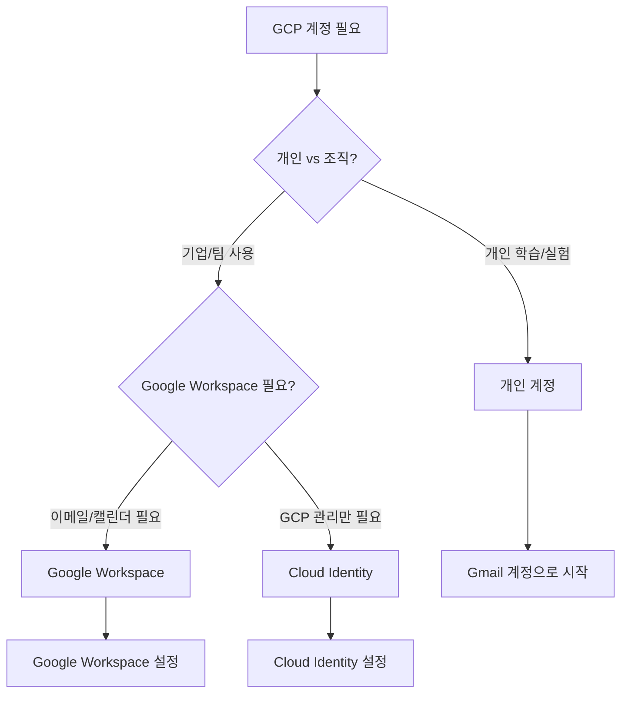

# GCP 계정 유형 비교 가이드

<div align="center">

[← 이전: Cloud Master 메인](../README.md) | [📚 전체 커리큘럼](/curriculum.md) | [🏠 학습 경로로 돌아가기](/index.md) | [📋 학습 경로](../../../../learning-path.md)

</div>

## 📋 개요

이 문서는 GCP의 개인 계정과 조직 계정의 차이점을 상세히 비교하고, 각 상황에 맞는 최적의 선택을 도와주는 가이드입니다.

---

## 1️⃣ 계정 유형 개요

### 1.1 개인 계정 (Personal Account)
- **Gmail 계정** 또는 **Google 계정** 사용
- **개인 사용자** 대상
- **프로젝트 레벨** 관리만 가능

### 1.2 조직 계정 (Organization Account)
- **Google Workspace** 또는 **Cloud Identity** 사용
- **기업/조직** 대상
- **조직 레벨** + **프로젝트 레벨** 관리 가능

---

## 2️⃣ 상세 비교표

| 구분 | 개인 계정 | 조직 계정 |
|------|-----------|-----------|
| **계정 유형** | Gmail/Google 계정 | Google Workspace/Cloud Identity |
| **비용** | 무료 | Google Workspace: 유료, Cloud Identity: 무료 |
| **사용자 관리** | 제한적 | 완전한 사용자/그룹 관리 |
| **조직 구조** | 없음 | 조직 → 폴더 → 프로젝트 |
| **정책 관리** | 프로젝트 레벨만 | 조직 레벨 + 프로젝트 레벨 |
| **감사 로그** | 기본적 | 고급 감사 및 규정 준수 |
| **보안 정책** | 기본 | 고급 보안 정책 |
| **비용 관리** | 개인 수준 | 조직 수준 비용 할당 |
| **API 제한** | 개인 할당량 | 조직 할당량 |

---

## 3️⃣ 기능별 상세 비교

### 3.1 사용자 관리

#### 개인 계정
```yaml
사용자 관리:
  - 개인 Google 계정 1개
  - 프로젝트 멤버 초대 가능
  - IAM 역할 할당 가능
  - 그룹 관리: 없음
  - 사용자 프로비저닝: 수동
```

#### 조직 계정
```yaml
사용자 관리:
  - 무제한 사용자 관리
  - 그룹 기반 권한 관리
  - 자동 사용자 프로비저닝
  - SSO 통합 가능
  - 사용자 생명주기 관리
```

### 3.2 권한 관리

#### 개인 계정
- **프로젝트 레벨** IAM만 가능
- **Owner**, **Editor**, **Viewer** 역할
- **서비스 계정** 생성 가능
- **사용자 정의 역할** 생성 가능

#### 조직 계정
- **조직 레벨** + **프젝트 레벨** IAM
- **조직 관리자**, **폴더 관리자** 등 추가 역할
- **조직 정책** 설정 가능
- **조건부 IAM** 설정 가능

### 3.3 비용 관리

#### 개인 계정
```yaml
비용 관리:
  - 개인 결제 계정
  - 프로젝트별 비용 추적
  - 기본 예산 알림
  - $300 무료 크레딧
```

#### 조직 계정
```yaml
비용 관리:
  - 조직 결제 계정
  - 폴더별 비용 할당
  - 고급 예산 관리
  - 비용 할당 라벨
  - 정부/기업 할인
```

### 3.4 보안 기능

#### 개인 계정
- **2단계 인증**
- **API 키** 관리
- **서비스 계정** 키 관리
- **기본 감사 로그**

#### 조직 계정
- **고급 보안 정책**
- **VPC 서비스 제어**
- **Cloud Identity-Aware Proxy**
- **Workload Identity**
- **고급 감사 로그**
- **규정 준수 도구**

---

## 4️⃣ 사용 시나리오별 권장사항

### 4.1 개인 계정이 적합한 경우

#### ✅ 권장 상황
- **개인 학습** 및 **실험**
- **소규모 프로젝트** (1-2명)
- **비용 최소화** 필요
- **빠른 시작** 필요

#### 📝 사용 사례
```yaml
개인 계정 사용 사례:
  - 개인 포트폴리오 웹사이트
  - 학습용 프로젝트
  - 프로토타입 개발
  - 개인 데이터 분석
```

### 4.2 조직 계정이 적합한 경우

#### ✅ 권장 상황
- **기업/조직** 환경
- **여러 사용자** 관리 필요
- **보안 정책** 적용 필요
- **비용 할당** 및 **감사** 필요

#### 📝 사용 사례
```yaml
조직 계정 사용 사례:
  - 기업 애플리케이션
  - 팀 협업 프로젝트
  - 규정 준수 요구사항
  - 대규모 인프라 관리
```

---

## 5️⃣ 마이그레이션 가이드

### 5.1 개인 계정 → 조직 계정 마이그레이션

#### 1단계: 조직 계정 설정
```bash
# 1. Google Workspace 또는 Cloud Identity 설정
# 2. 도메인 소유권 확인
# 3. 조직 생성
gcloud organizations create --display-name="My Organization"
```

#### 2단계: 프로젝트 이전
```bash
# 1. 기존 프로젝트를 조직으로 이전
gcloud projects move PROJECT_ID --organization=ORGANIZATION_ID

# 2. 폴더 구조 생성
gcloud resource-manager folders create \
  --display-name="Production" \
  --parent="organizations/ORGANIZATION_ID"
```

#### 3단계: 사용자 및 권한 이전
```bash
# 1. 사용자를 조직에 초대
gcloud organizations add-iam-policy-binding ORGANIZATION_ID \
  --member="user:user@domain.com" \
  --role="roles/resourcemanager.projectCreator"

# 2. 기존 권한 재할당
gcloud projects add-iam-policy-binding PROJECT_ID \
  --member="user:user@domain.com" \
  --role="roles/editor"
```

### 5.2 마이그레이션 시 주의사항

#### ⚠️ 주의사항
- **결제 계정** 연결 확인
- **API 키** 재생성 필요
- **서비스 계정** 권한 재할당
- **네트워크 설정** 재구성

#### 🔄 마이그레이션 체크리스트
```yaml
마이그레이션 체크리스트:
  - [ ] 조직 계정 설정 완료
  - [ ] 도메인 소유권 확인
  - [ ] 프로젝트 이전 완료
  - [ ] 사용자 권한 재할당
  - [ ] 결제 계정 연결
  - [ ] API 키 재생성
  - [ ] 서비스 계정 권한 확인
  - [ ] 네트워크 설정 확인
  - [ ] 보안 정책 적용
  - [ ] 테스트 완료
```

---

## 6️⃣ 비용 비교

### 6.1 개인 계정 비용
```yaml
개인 계정 비용:
  - GCP 계정: 무료
  - $300 무료 크레딧 (12개월)
  - Always Free 서비스: 무료
  - 사용량 기반 과금
```

### 6.2 조직 계정 비용
```yaml
Google Workspace:
  - Business Starter: $6/사용자/월
  - Business Standard: $12/사용자/월
  - Business Plus: $18/사용자/월
  - Enterprise: $25/사용자/월

Cloud Identity:
  - Cloud Identity Free: 무료
  - Cloud Identity Premium: $6/사용자/월
```

### 6.3 비용 최적화 팁

#### 개인 계정
- **Always Free** 서비스 우선 사용
- **사전 가능한 인스턴스** 사용
- **정기적인 리소스 정리**

#### 조직 계정
- **할인 프로그램** 활용
- **커밋 사용 할인** 적용
- **리전별 가격** 비교
- **리소스 최적화** 도구 사용

---

## 7️⃣ 보안 비교

### 7.1 개인 계정 보안
```yaml
개인 계정 보안:
  - 2단계 인증
  - API 키 관리
  - 서비스 계정 키 관리
  - 기본 감사 로그
  - 개인 수준 보안
```

### 7.2 조직 계정 보안
```yaml
조직 계정 보안:
  - 고급 보안 정책
  - VPC 서비스 제어
  - Cloud Identity-Aware Proxy
  - Workload Identity
  - 고급 감사 로그
  - 규정 준수 도구
  - 조직 수준 보안
```

---

## 8️⃣ 선택 가이드

### 8.1 의사결정 트리



### 8.2 상황별 권장사항

#### 🎓 학습자/개발자
- **개인 계정** 권장
- **무료 크레딧** 활용
- **Always Free** 서비스 사용

#### 🏢 소규모 기업 (1-10명)
- **Cloud Identity** 권장
- **무료** 사용자 관리
- **기본 보안 정책** 적용

#### 🏭 중대규모 기업 (10명 이상)
- **Google Workspace** 권장
- **완전한 사용자 관리**
- **고급 보안 정책** 적용

#### 🏛️ 대기업/정부기관
- **Google Workspace Enterprise** 권장
- **규정 준수** 도구 활용
- **고급 보안** 및 **감사** 기능

---

## 9️⃣ FAQ - 자주 묻는 질문

### Q1: 개인 계정에서 조직 계정으로 언제 마이그레이션해야 하나요?
**A**: 다음 상황에서 마이그레이션을 고려하세요:
- 팀원이 3명 이상
- 보안 정책이 필요
- 비용 할당이 필요
- 감사 로그가 필요

### Q2: Google Workspace와 Cloud Identity 중 어떤 것을 선택해야 하나요?
**A**: 
- **Google Workspace**: 이메일, 캘린더 등 G Suite 기능이 필요한 경우
- **Cloud Identity**: GCP 관리만 필요한 경우 (무료)

### Q3: 개인 계정으로도 팀 협업이 가능한가요?
**A**: 제한적입니다. 프로젝트 멤버로 초대는 가능하지만, 그룹 관리나 조직 정책은 불가능합니다.

### Q4: 마이그레이션 시 데이터 손실이 있나요?
**A**: 없습니다. 프로젝트와 리소스는 그대로 유지되며, 권한만 재할당하면 됩니다.

---

## 🔐 보안 권장사항

### 개인 계정 보안
- **2단계 인증** 필수 설정
- **API 키** 안전한 보관
- **정기적인 권한 리뷰**

### 조직 계정 보안
- **조직 정책** 설정
- **최소 권한** 원칙 적용
- **정기적인 보안 감사**
- **사용자 교육** 실시

---

## 🚀 다음 단계

### 개인 계정 사용자
- [GCP 개인 계정 가입 가이드](GCP_개인계정가입.md) 참조
- **Always Free** 서비스 활용
- **개인 프로젝트** 포트폴리오 구축

### 조직 계정 사용자
- [GCP 조직 계정 가입 가이드](GCP_조직계정가입.md) 참조
- **조직 정책** 설정
- **팀 협업** 워크플로 구축

---

## 📞 지원 및 문의

### 공식 지원
- [GCP 지원 센터](https://cloud.google.com/support/)
- [Google Workspace 지원](https://support.google.com/a/)
- [Cloud Identity 지원](https://support.google.com/cloudidentity/)

### 커뮤니티 지원
- [GCP 커뮤니티](https://cloud.google.com/community/)
- [Stack Overflow](https://stackoverflow.com/questions/tagged/google-cloud-platform)
- [Reddit r/googlecloud](https://www.reddit.com/r/googlecloud/)
