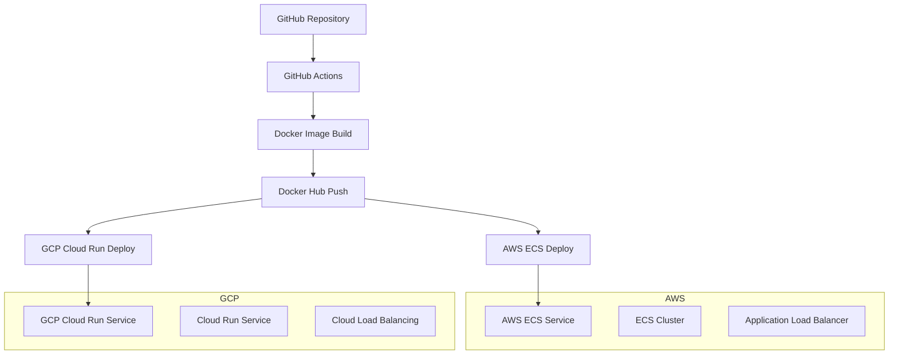
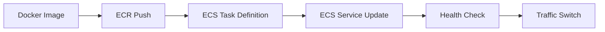
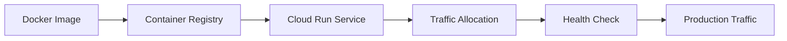

# AWS & GCP 멀티클라우드 배포 가이드

<div align="center">

[← 이전: Cloud Master 메인](../../README.md) | [📚 전체 커리큘럼](../../../curriculum.md) | [🏠 학습 경로로 돌아가기](../../../index.md) | [📋 학습 경로](../../../learning-path.md)

</div>

<div align="center">

[← 이전: Cloud Master 1일차 메인](../README.md) | [📚 전체 커리큘럼](../../../curriculum.md) | [🏠 학습 경로로 돌아가기](../../../index.md)

</div>

## 📋 목차
1. [개요](#개요)
2. [AWS 배포 시나리오](#aws-배포-시나리오)
3. [GCP 배포 시나리오](#gcp-배포-시나리오)
4. [권한 설정](#권한-설정)
5. [워크플로우 구성](#워크플로우-구성)
6. [실습 절차](#실습-절차)
7. [문제 해결](#문제-해결)

---

## 🎯 개요

이 가이드는 GitHub Actions를 사용하여 **AWS ECS**와 **GCP Cloud Run**에 동시에 애플리케이션을 배포하는 멀티클라우드 시나리오를 다룹니다.

### 배포 아키텍처



---

## 🚀 AWS 배포 시나리오

### AWS ECS (Elastic Container Service) 배포

#### 1. AWS ECS란?
- **완전 관리형 컨테이너 오케스트레이션 서비스**
- Docker 컨테이너를 AWS에서 쉽게 실행, 중지, 관리
- 자동 스케일링, 로드 밸런싱, 서비스 디스커버리 제공

#### 2. AWS ECS 배포 장점
- **고가용성**: 여러 AZ에 컨테이너 배포
- **자동 스케일링**: 트래픽에 따라 자동 확장/축소
- **로드 밸런싱**: ALB/NLB와 통합
- **보안**: IAM 역할 기반 접근 제어

#### 3. AWS ECS 배포 흐름


---

## ☁️ GCP 배포 시나리오

### GCP Cloud Run 배포

#### 1. GCP Cloud Run이란?
- **완전 관리형 서버리스 컨테이너 플랫폼**
- HTTP 요청에 따라 자동으로 컨테이너 시작/중지
- 사용한 만큼만 비용 지불 (Pay-per-use)

#### 2. GCP Cloud Run 배포 장점
- **서버리스**: 인프라 관리 불필요
- **자동 스케일링**: 0에서 수천 인스턴스까지 자동 확장
- **빠른 배포**: 몇 초 내에 새 버전 배포
- **비용 효율성**: 요청이 없으면 0으로 스케일링

#### 3. GCP Cloud Run 배포 흐름


---

## 🔐 권한 설정

### AWS 권한 설정

#### 1. AWS IAM 사용자 생성
```bash
# AWS CLI로 IAM 사용자 생성
aws iam create-user --user-name github-actions-deploy

# 액세스 키 생성
aws iam create-access-key --user-name github-actions-deploy
```

#### 2. 필요한 IAM 정책
```json
{
    "Version": "2012-10-17",
    "Statement": [
        {
            "Effect": "Allow",
            "Action": [
                "ecs:UpdateService",
                "ecs:DescribeServices",
                "ecs:DescribeTaskDefinition",
                "ecs:RegisterTaskDefinition",
                "ecr:GetAuthorizationToken",
                "ecr:BatchCheckLayerAvailability",
                "ecr:GetDownloadUrlForLayer",
                "ecr:BatchGetImage"
            ],
            "Resource": "*"
        }
    ]
}
```

#### 3. GitHub 시크릿 설정
```
AWS_ACCESS_KEY_ID: AKIA...
AWS_SECRET_ACCESS_KEY: ...
AWS_REGION: ap-northeast-2
AWS_ECS_CLUSTER: my-cluster
AWS_ECS_SERVICE: my-service
```

### GCP 권한 설정

#### 1. GCP 서비스 계정 생성
```bash
# 서비스 계정 생성
gcloud iam service-accounts create github-actions-deploy \
    --display-name="GitHub Actions Deploy"

# 필요한 권한 부여
gcloud projects add-iam-policy-binding PROJECT_ID \
    --member="serviceAccount:github-actions-deploy@PROJECT_ID.iam.gserviceaccount.com" \
    --role="roles/run.admin"

gcloud projects add-iam-policy-binding PROJECT_ID \
    --member="serviceAccount:github-actions-deploy@PROJECT_ID.iam.gserviceaccount.com" \
    --role="roles/storage.admin"
```

#### 2. 서비스 계정 키 생성
```bash
# JSON 키 파일 생성
gcloud iam service-accounts keys create key.json \
    --iam-account=github-actions-deploy@PROJECT_ID.iam.gserviceaccount.com
```

#### 3. GitHub 시크릿 설정
```
GCP_PROJECT_ID: your-project-id
GCP_SA_KEY: {"type":"service_account",...}
GCP_REGION: asia-northeast1
GCP_SERVICE_NAME: actions-demo
```

---

## ⚙️ 워크플로우 구성

### 멀티클라우드 배포 워크플로우

```yaml
name: Multi-Cloud Deployment

on:
  push:
    branches: [ main ]
    tags: [ 'v*' ]

env:
  REGISTRY: docker.io
  IMAGE_NAME: ${{ github.actor }}/actions-demo

jobs:
  # Docker 이미지 빌드 및 푸시
  build:
    name: Build and Push Docker Image
    runs-on: ubuntu-latest
    
    steps:
      - name: Checkout code
        uses: actions/checkout@v4
      
      - name: Set up Docker Buildx
        uses: docker/setup-buildx-action@v3
      
      - name: Log in to Docker Hub
        uses: docker/login-action@v3
        with:
          username: ${{ github.actor }}
          password: ${{ secrets.DOCKERHUB_TOKEN }}
      
      - name: Build and push Docker image
        uses: docker/build-push-action@v5
        with:
          context: .
          push: true
          tags: ${{ env.REGISTRY }}/${{ env.IMAGE_NAME }}:${{ github.sha }}

  # AWS ECS 배포
  deploy-aws:
    name: Deploy to AWS ECS
    runs-on: ubuntu-latest
    needs: build
    if: github.ref == 'refs/heads/main'
    
    steps:
      - name: Configure AWS credentials
        uses: aws-actions/configure-aws-credentials@v4
        with:
          aws-access-key-id: ${{ secrets.AWS_ACCESS_KEY_ID }}
          aws-secret-access-key: ${{ secrets.AWS_SECRET_ACCESS_KEY }}
          aws-region: ${{ secrets.AWS_REGION }}
      
      - name: Deploy to ECS
        run: |
          aws ecs update-service \
            --cluster ${{ secrets.AWS_ECS_CLUSTER }} \
            --service ${{ secrets.AWS_ECS_SERVICE }} \
            --force-new-deployment
          
          echo "AWS ECS deployment initiated"
          echo "Service: ${{ secrets.AWS_ECS_SERVICE }}"
          echo "Cluster: ${{ secrets.AWS_ECS_CLUSTER }}"

  # GCP Cloud Run 배포
  deploy-gcp:
    name: Deploy to GCP Cloud Run
    runs-on: ubuntu-latest
    needs: build
    if: github.ref == 'refs/heads/main'
    
    steps:
      - name: Authenticate to Google Cloud
        uses: google-github-actions/auth@v2
        with:
          credentials_json: ${{ secrets.GCP_SA_KEY }}
      
      - name: Set up Cloud SDK
        uses: google-github-actions/setup-gcloud@v2
      
      - name: Deploy to Cloud Run
        run: |
          gcloud run deploy ${{ secrets.GCP_SERVICE_NAME }} \
            --image ${{ env.REGISTRY }}/${{ env.IMAGE_NAME }}:${{ github.sha }} \
            --region ${{ secrets.GCP_REGION }} \
            --platform managed \
            --allow-unauthenticated
          
          echo "GCP Cloud Run deployment completed"
          echo "Service: ${{ secrets.GCP_SERVICE_NAME }}"
          echo "Region: ${{ secrets.GCP_REGION }}"

  # 배포 상태 확인
  health-check:
    name: Health Check
    runs-on: ubuntu-latest
    needs: [deploy-aws, deploy-gcp]
    if: always()
    
    steps:
      - name: Check AWS ECS Health
        if: needs.deploy-aws.result == 'success'
        run: |
          echo "AWS ECS deployment successful"
          # 실제 헬스체크 로직 추가 가능
      
      - name: Check GCP Cloud Run Health
        if: needs.deploy-gcp.result == 'success'
        run: |
          echo "GCP Cloud Run deployment successful"
          # 실제 헬스체크 로직 추가 가능
      
      - name: Deployment Summary
        run: |
          echo "=== Deployment Summary ==="
          echo "AWS ECS: ${{ needs.deploy-aws.result }}"
          echo "GCP Cloud Run: ${{ needs.deploy-gcp.result }}"
          echo "Docker Image: ${{ env.REGISTRY }}/${{ env.IMAGE_NAME }}:${{ github.sha }}"
```

---

## 📝 실습 절차

### 1단계: AWS 환경 준비

#### ECS 클러스터 생성
```bash
# ECS 클러스터 생성
aws ecs create-cluster --cluster-name actions-demo-cluster

# 태스크 정의 생성
aws ecs register-task-definition \
    --family actions-demo \
    --network-mode awsvpc \
    --requires-compatibilities FARGATE \
    --cpu 256 \
    --memory 512 \
    --execution-role-arn arn:aws:iam::ACCOUNT:role/ecsTaskExecutionRole \
    --container-definitions '[
        {
            "name": "actions-demo",
            "image": "nginx:latest",
            "portMappings": [
                {
                    "containerPort": 3000,
                    "protocol": "tcp"
                }
            ],
            "essential": true
        }
    ]'

# ECS 서비스 생성
aws ecs create-service \
    --cluster actions-demo-cluster \
    --service-name actions-demo-service \
    --task-definition actions-demo:1 \
    --desired-count 1 \
    --launch-type FARGATE \
    --network-configuration "awsvpcConfiguration={subnets=[subnet-12345],securityGroups=[sg-12345],assignPublicIp=ENABLED}"
```

### 2단계: GCP 환경 준비

#### Cloud Run 서비스 생성
```bash
# 첫 번째 배포 (초기 서비스 생성)
gcloud run deploy actions-demo \
    --image nginx:latest \
    --region asia-northeast1 \
    --platform managed \
    --allow-unauthenticated \
    --port 3000
```

### 3단계: GitHub 시크릿 설정

#### AWS 시크릿
```
AWS_ACCESS_KEY_ID: AKIA...
AWS_SECRET_ACCESS_KEY: ...
AWS_REGION: ap-northeast-2
AWS_ECS_CLUSTER: actions-demo-cluster
AWS_ECS_SERVICE: actions-demo-service
```

#### GCP 시크릿
```
GCP_PROJECT_ID: your-project-id
GCP_SA_KEY: {"type":"service_account",...}
GCP_REGION: asia-northeast1
GCP_SERVICE_NAME: actions-demo
```

#### Docker Hub 시크릿
```
DOCKERHUB_TOKEN: your-dockerhub-token
```

### 4단계: 워크플로우 파일 생성

`.github/workflows/multi-cloud-deploy.yml` 파일을 생성하고 위의 워크플로우 코드를 복사합니다.

### 5단계: 배포 테스트

```bash
# main 브랜치에 푸시하여 배포 테스트
git add .
git commit -m "Add multi-cloud deployment workflow"
git push origin main
```

---

## 🔧 문제 해결

### AWS 배포 문제

#### 1. ECS 서비스 업데이트 실패
```bash
# 서비스 상태 확인
aws ecs describe-services \
    --cluster actions-demo-cluster \
    --services actions-demo-service

# 태스크 정의 확인
aws ecs describe-task-definition \
    --task-definition actions-demo
```

#### 2. 권한 문제
```bash
# IAM 정책 확인
aws iam list-attached-user-policies --user-name github-actions-deploy
aws iam get-policy --policy-arn arn:aws:iam::ACCOUNT:policy/ECSAccess
```

### GCP 배포 문제

#### 1. Cloud Run 배포 실패
```bash
# 서비스 상태 확인
gcloud run services describe actions-demo \
    --region asia-northeast1

# 로그 확인
gcloud logging read "resource.type=cloud_run_revision" \
    --limit 50
```

#### 2. 인증 문제
```bash
# 서비스 계정 권한 확인
gcloud projects get-iam-policy PROJECT_ID \
    --flatten="bindings[].members" \
    --format="table(bindings.role)" \
    --filter="bindings.members:github-actions-deploy@PROJECT_ID.iam.gserviceaccount.com"
```

### 일반적인 문제들

| 문제 | 원인 | 해결 방법 |
|------|------|-----------|
| Docker 이미지 푸시 실패 | Docker Hub 토큰 누락 | `DOCKERHUB_TOKEN` 시크릿 설정 |
| AWS ECS 업데이트 실패 | IAM 권한 부족 | ECS 관련 권한 추가 |
| GCP Cloud Run 배포 실패 | 서비스 계정 권한 부족 | Cloud Run Admin 권한 추가 |
| 워크플로우 실행 안됨 | 시크릿 설정 누락 | 모든 필요한 시크릿 확인 |

---

## 📊 모니터링 및 로그

### AWS CloudWatch
```bash
# ECS 서비스 로그 확인
aws logs describe-log-groups --log-group-name-prefix /ecs/actions-demo
aws logs tail /ecs/actions-demo --follow
```

### GCP Cloud Logging
```bash
# Cloud Run 로그 확인
gcloud logging read "resource.type=cloud_run_revision AND resource.labels.service_name=actions-demo" \
    --limit 100 \
    --format json
```

---

## 🎯 다음 단계

1. **고급 배포 전략**: Blue-Green, Canary 배포 구현
2. **모니터링 강화**: Prometheus, Grafana 연동
3. **보안 강화**: VPC, 보안 그룹, IAM 정책 세분화
4. **비용 최적화**: 스팟 인스턴스, 자동 스케일링 정책 조정

---

## 📚 참고 자료

- [AWS ECS 공식 문서](https://docs.aws.amazon.com/ecs/)
- [GCP Cloud Run 공식 문서](https://cloud.google.com/run/docs)
- [GitHub Actions 공식 문서](https://docs.github.com/en/actions)
- [Docker Hub 공식 문서](https://docs.docker.com/docker-hub/)

---

<div align="center">

[← 이전: GitHub Actions 가이드](./github-actions-guide) | [📚 전체 커리큘럼](../../../curriculum) | [다음: CI/CD 파이프라인 가이드 →](./cicd-pipeline-guide)

</div>