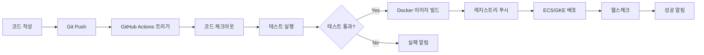
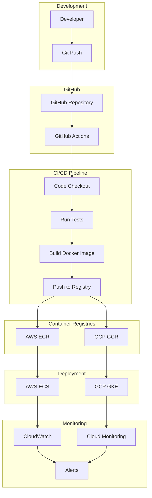

<div align="center">

[← 이전: Cloud Master 1일차 메인](../README.md) | [📚 전체 커리큘럼](/curriculum.md) | [🏠 학습 경로로 돌아가기](/index.md) | [📋 학습 경로](../learning-path.md) | [← 이전: AWS & GCP 배포 가이드](./aws-gcp-deployment-guide) | [다음: Cloud Master 2일차 →](../Day2/README)

</div>

# 4교시: 전체 자동 배포 파이프라인 구성 실습


## 📋 목차
1. [전체 파이프라인 개념](#전체-파이프라인-개념)
2. [파이프라인 아키텍처](#파이프라인-아키텍처)
3. [GitHub Secrets 설정](#github-secrets-설정)
4. [실습 목표](#실습-목표)
5. [실습 절차](#실습-절차)
6. [실습 코드 예시](#실습-코드-예시)
7. [예상 결과](#예상-결과)
8. [혼자 해보기](#혼자-해보기)

---

## 🔄 전체 파이프라인 개념

### 전체 자동 배포 파이프라인이란?

전체 자동 배포 파이프라인(CI/CD 파이프라인)은 **코드 커밋부터 빌드, 테스트, 컨테이너 이미지 배포, 실제 환경(클러스터) 배포까지 모든 단계를 자동화**한 흐름입니다.

### 파이프라인의 핵심 단계



### 파이프라인의 장점

| 장점 | 설명 |
|------|------|
| **완전 자동화** | 코드 푸시부터 배포까지 수동 개입 없음 |
| **일관성** | 모든 환경에서 동일한 배포 과정 |
| **빠른 피드백** | 문제 발생 시 즉시 알림 |
| **롤백 용이** | 이전 버전으로 빠른 복구 |
| **멀티 클라우드** | AWS와 GCP 동시 배포 |

---

## 🏗️ 파이프라인 아키텍처

### 전체 아키텍처 다이어그램



### 파이프라인 구성요소

#### 1. **소스 코드 관리**
- GitHub 저장소
- 브랜치 전략 (main, develop, feature)
- Pull Request 워크플로우

#### 2. **CI/CD 엔진**
- GitHub Actions
- 워크플로우 정의 (.github/workflows/)
- 환경별 배포 전략

#### 3. **컨테이너 레지스트리**
- AWS ECR (Elastic Container Registry)
- GCP GCR (Google Container Registry)
- 이미지 태깅 및 버전 관리

#### 4. **배포 대상**
- AWS ECS (Elastic Container Service)
- GCP GKE (Google Kubernetes Engine)
- 환경별 설정 (staging, production)

#### 5. **모니터링 및 알림**
- CloudWatch (AWS)
- Cloud Monitoring (GCP)
- Slack/Email 알림

---

## 🔐 GitHub Secrets 설정

### AWS 관련 Secrets

#### 1. AWS 자격증명 설정
```bash
# AWS IAM 사용자 생성
aws iam create-user --user-name github-actions-user

# 정책 연결
aws iam attach-user-policy \
  --user-name github-actions-user \
  --policy-arn arn:aws:iam::aws:policy/AmazonECS_FullAccess

aws iam attach-user-policy \
  --user-name github-actions-user \
  --policy-arn arn:aws:iam::aws:policy/AmazonEC2ContainerRegistryFullAccess

# 액세스 키 생성
aws iam create-access-key --user-name github-actions-user
```

#### 2. GitHub Secrets 등록
GitHub 저장소 → Settings → Secrets and variables → Actions에서 다음 Secrets 추가:

| Secret Name | Value | 설명 |
|-------------|-------|------|
| `AWS_ACCESS_KEY_ID` | AKIA... | AWS 액세스 키 ID |
| `AWS_SECRET_ACCESS_KEY` | ... | AWS 시크릿 액세스 키 |
| `AWS_REGION` | us-west-1 | AWS 리전 |
| `AWS_ECR_REGISTRY` | 123456789012.dkr.ecr.us-west-1.amazonaws.com | ECR 레지스트리 URL |
| `AWS_ECS_CLUSTER` | my-cluster | ECS 클러스터 이름 |
| `AWS_ECS_SERVICE` | my-app-service | ECS 서비스 이름 |

### GCP 관련 Secrets

#### 1. GCP 서비스 계정 생성
```bash
# 서비스 계정 생성
gcloud iam service-accounts create github-actions-sa \
  --display-name="GitHub Actions Service Account"

# 권한 부여
gcloud projects add-iam-policy-binding YOUR_PROJECT_ID \
  --member="serviceAccount:github-actions-sa@YOUR_PROJECT_ID.iam.gserviceaccount.com" \
  --role="roles/container.developer"

gcloud projects add-iam-policy-binding YOUR_PROJECT_ID \
  --member="serviceAccount:github-actions-sa@YOUR_PROJECT_ID.iam.gserviceaccount.com" \
  --role="roles/storage.admin"

# 키 파일 생성
gcloud iam service-accounts keys create key.json \
  --iam-account=github-actions-sa@YOUR_PROJECT_ID.iam.gserviceaccount.com
```

#### 2. GitHub Secrets 등록
GitHub 저장소 → Settings → Secrets and variables → Actions에서 다음 Secrets 추가:

| Secret Name | Value | 설명 |
|-------------|-------|------|
| `GCP_PROJECT_ID` | your-project-id | GCP 프로젝트 ID |
| `GCP_SA_KEY` | {...} | 서비스 계정 JSON 키 |
| `GCP_GKE_CLUSTER` | my-cluster | GKE 클러스터 이름 |
| `GCP_GKE_ZONE` | us-central1-a | GKE 클러스터 존 |

### 알림 관련 Secrets

| Secret Name | Value | 설명 |
|-------------|-------|------|
| `SLACK_WEBHOOK` | https://hooks.slack.com/... | Slack 웹훅 URL |
| `DISCORD_WEBHOOK` | https://discord.com/api/webhooks/... | Discord 웹훅 URL |

---

## 🎯 실습 목표

이 실습을 통해 다음을 달성합니다:

1. **완전 자동화**: GitHub Actions로 코드 푸시부터 배포까지 전체 과정을 자동화합니다.

2. **멀티 클라우드 배포**: AWS ECS와 GCP GKE에 동시 배포되는 파이프라인을 구축합니다.

3. **환경별 배포**: staging과 production 환경을 분리하여 배포합니다.

4. **모니터링 및 알림**: 배포 성공/실패 시 적절한 알림을 설정합니다.

---

## 📝 실습 절차

### 1단계: GitHub Secrets 설정

#### AWS Secrets 설정
1. GitHub 저장소 → Settings → Secrets and variables → Actions
2. "New repository secret" 클릭
3. 위의 AWS 관련 Secrets 모두 추가

#### GCP Secrets 설정
1. GCP 서비스 계정 키 파일 내용을 복사
2. GitHub Secrets에 `GCP_SA_KEY`로 추가
3. 기타 GCP 관련 Secrets 추가

### 2단계: AWS ECS 배포 워크플로우 작성

#### .github/workflows/deploy-aws.yml
```yaml
name: Deploy to AWS ECS

on:
  push:
    branches: [ main ]
  workflow_dispatch:
    inputs:
      environment:
        description: 'Deployment environment'
        required: true
        default: 'staging'
        type: choice
        options:
          - staging
          - production

env:
  AWS_REGION: ${{ secrets.AWS_REGION }}
  ECR_REGISTRY: ${{ secrets.AWS_ECR_REGISTRY }}
  ECS_CLUSTER: ${{ secrets.AWS_ECS_CLUSTER }}
  ECS_SERVICE: ${{ secrets.AWS_ECS_SERVICE }}

jobs:
  deploy:
    name: Deploy to AWS ECS
    runs-on: ubuntu-latest
    environment: ${{ github.event.inputs.environment || 'staging' }}
    
    steps:
      - name: Checkout code
        uses: actions/checkout@v4
      
      - name: Configure AWS credentials
        uses: aws-actions/configure-aws-credentials@v4
        with:
          aws-access-key-id: ${{ secrets.AWS_ACCESS_KEY_ID }}
          aws-secret-access-key: ${{ secrets.AWS_SECRET_ACCESS_KEY }}
          aws-region: ${{ env.AWS_REGION }}
      
      - name: Login to Amazon ECR
        id: login-ecr
        uses: aws-actions/amazon-ecr-login@v2
      
      - name: Build, tag, and push image to Amazon ECR
        id: build-image
        env:
          ECR_REGISTRY: ${{ steps.login-ecr.outputs.registry }}
          IMAGE_TAG: ${{ github.sha }}
        run: |
          # Build a docker container and push it to ECR
          docker build -t $ECR_REGISTRY/$ECR_REPOSITORY:$IMAGE_TAG .
          docker push $ECR_REGISTRY/$ECR_REPOSITORY:$IMAGE_TAG
          echo "image=$ECR_REGISTRY/$ECR_REPOSITORY:$IMAGE_TAG" >> $GITHUB_OUTPUT
      
      - name: Fill in the new image ID in the Amazon ECS task definition
        id: task-def
        uses: aws-actions/amazon-ecs-render-task-definition@v1
        with:
          task-definition: task-definition.json
          container-name: my-app
          image: ${{ steps.build-image.outputs.image }}
      
      - name: Deploy Amazon ECS task definition
        uses: aws-actions/amazon-ecs-deploy-task-definition@v1
        with:
          task-definition: ${{ steps.task-def.outputs.task-definition }}
          service: ${{ env.ECS_SERVICE }}
          cluster: ${{ env.ECS_CLUSTER }}
          wait-for-service-stability: true
      
      - name: Notify deployment status
        uses: 8398a7/action-slack@v3
        with:
          status: ${{ job.status }}
          channel: '#deployments'
          webhook_url: ${{ secrets.SLACK_WEBHOOK }}
          fields: repo,message,commit,author,action,eventName,ref,workflow
        if: always()
```

### 3단계: GCP GKE 배포 워크플로우 작성

#### .github/workflows/deploy-gcp.yml
```yaml
name: Deploy to GCP GKE

on:
  push:
    branches: [ main ]
  workflow_dispatch:
    inputs:
      environment:
        description: 'Deployment environment'
        required: true
        default: 'staging'
        type: choice
        options:
          - staging
          - production

env:
  GCP_PROJECT_ID: ${{ secrets.GCP_PROJECT_ID }}
  GKE_CLUSTER: ${{ secrets.GCP_GKE_CLUSTER }}
  GKE_ZONE: ${{ secrets.GCP_GKE_ZONE }}

jobs:
  deploy:
    name: Deploy to GCP GKE
    runs-on: ubuntu-latest
    environment: ${{ github.event.inputs.environment || 'staging' }}
    
    steps:
      - name: Checkout code
        uses: actions/checkout@v4
      
      - name: Setup Google Cloud SDK
        uses: google-github-actions/setup-gcloud@v1
        with:
          project_id: ${{ env.GCP_PROJECT_ID }}
          service_account_key: ${{ secrets.GCP_SA_KEY }}
          export_default_credentials: true
      
      - name: Configure Docker to use gcloud as a credential helper
        run: gcloud auth configure-docker
      
      - name: Build and push Docker image
        run: |
          docker build -t gcr.io/${{ env.GCP_PROJECT_ID }}/my-app:${{ github.sha }} .
          docker push gcr.io/${{ env.GCP_PROJECT_ID }}/my-app:${{ github.sha }}
      
      - name: Get GKE credentials
        uses: google-github-actions/get-gke-credentials@v1
        with:
          cluster_name: ${{ env.GKE_CLUSTER }}
          location: ${{ env.GKE_ZONE }}
          credentials: ${{ secrets.GCP_SA_KEY }}
      
      - name: Deploy to GKE
        run: |
          # Update deployment with new image
          kubectl set image deployment/my-app-deployment \
            my-app=gcr.io/${{ env.GCP_PROJECT_ID }}/my-app:${{ github.sha }}
          
          # Wait for rollout to complete
          kubectl rollout status deployment/my-app-deployment
          
          # Verify deployment
          kubectl get services
          kubectl get pods
      
      - name: Notify deployment status
        uses: 8398a7/action-slack@v3
        with:
          status: ${{ job.status }}
          channel: '#deployments'
          webhook_url: ${{ secrets.SLACK_WEBHOOK }}
          fields: repo,message,commit,author,action,eventName,ref,workflow
        if: always()
```

### 4단계: 통합 워크플로우 작성

#### .github/workflows/full-pipeline.yml
```yaml
name: Full CI/CD Pipeline

on:
  push:
    branches: [ main, develop ]
  pull_request:
    branches: [ main ]
  workflow_dispatch:
    inputs:
      deploy_aws:
        description: 'Deploy to AWS'
        required: false
        default: true
        type: boolean
      deploy_gcp:
        description: 'Deploy to GCP'
        required: false
        default: true
        type: boolean

env:
  NODE_VERSION: '18'

jobs:
  # 코드 품질 검사
  quality:
    name: Code Quality
    runs-on: ubuntu-latest
    
    steps:
      - name: Checkout code
        uses: actions/checkout@v4
      
      - name: Setup Node.js
        uses: actions/setup-node@v4
        with:
          node-version: ${{ env.NODE_VERSION }}
          cache: 'npm'
      
      - name: Install dependencies
        run: npm ci
      
      - name: Run ESLint
        run: npm run lint
      
      - name: Run tests
        run: npm test

  # AWS 배포
  deploy-aws:
    name: Deploy to AWS ECS
    runs-on: ubuntu-latest
    needs: quality
    if: github.ref == 'refs/heads/main' && (github.event.inputs.deploy_aws == 'true' || github.event.inputs.deploy_aws == null)
    environment: production
    
    steps:
      - name: Checkout code
        uses: actions/checkout@v4
      
      - name: Configure AWS credentials
        uses: aws-actions/configure-aws-credentials@v4
        with:
          aws-access-key-id: ${{ secrets.AWS_ACCESS_KEY_ID }}
          aws-secret-access-key: ${{ secrets.AWS_SECRET_ACCESS_KEY }}
          aws-region: ${{ secrets.AWS_REGION }}
      
      - name: Login to Amazon ECR
        id: login-ecr
        uses: aws-actions/amazon-ecr-login@v2
      
      - name: Build and push to ECR
        run: |
          docker build -t ${{ steps.login-ecr.outputs.registry }}/my-app:${{ github.sha }} .
          docker push ${{ steps.login-ecr.outputs.registry }}/my-app:${{ github.sha }}
      
      - name: Deploy to ECS
        run: |
          # Update ECS service with new image
          aws ecs update-service \
            --cluster ${{ secrets.AWS_ECS_CLUSTER }} \
            --service ${{ secrets.AWS_ECS_SERVICE }} \
            --force-new-deployment

  # GCP 배포
  deploy-gcp:
    name: Deploy to GCP GKE
    runs-on: ubuntu-latest
    needs: quality
    if: github.ref == 'refs/heads/main' && (github.event.inputs.deploy_gcp == 'true' || github.event.inputs.deploy_gcp == null)
    environment: production
    
    steps:
      - name: Checkout code
        uses: actions/checkout@v4
      
      - name: Setup Google Cloud SDK
        uses: google-github-actions/setup-gcloud@v1
        with:
          project_id: ${{ secrets.GCP_PROJECT_ID }}
          service_account_key: ${{ secrets.GCP_SA_KEY }}
          export_default_credentials: true
      
      - name: Configure Docker
        run: gcloud auth configure-docker
      
      - name: Build and push to GCR
        run: |
          docker build -t gcr.io/${{ secrets.GCP_PROJECT_ID }}/my-app:${{ github.sha }} .
          docker push gcr.io/${{ secrets.GCP_PROJECT_ID }}/my-app:${{ github.sha }}
      
      - name: Deploy to GKE
        run: |
          gcloud container clusters get-credentials ${{ secrets.GCP_GKE_CLUSTER }} --zone ${{ secrets.GCP_GKE_ZONE }}
          kubectl set image deployment/my-app-deployment my-app=gcr.io/${{ secrets.GCP_PROJECT_ID }}/my-app:${{ github.sha }}
          kubectl rollout status deployment/my-app-deployment

  # 배포 완료 알림
  notify:
    name: Notify Deployment
    runs-on: ubuntu-latest
    needs: [deploy-aws, deploy-gcp]
    if: always()
    
    steps:
      - name: Notify Slack
        uses: 8398a7/action-slack@v3
        with:
          status: ${{ job.status }}
          channel: '#deployments'
          webhook_url: ${{ secrets.SLACK_WEBHOOK }}
          fields: repo,message,commit,author,action,eventName,ref,workflow
```

### 5단계: 워크플로우 파일 커밋 및 배포

```bash
# 워크플로우 파일 추가
git add .github/workflows/

# 커밋
git commit -m "Add full CI/CD pipeline for AWS ECS and GCP GKE"

# 푸시
git push origin main
```

### 6단계: 배포 확인

#### GitHub Actions 탭에서 확인
1. GitHub 저장소 → Actions 탭
2. 워크플로우 실행 상태 확인
3. 각 Job의 실행 로그 확인

#### AWS ECS에서 확인
1. AWS 콘솔 → ECS → Clusters
2. 서비스 상태 확인
3. 태스크 실행 상태 확인

#### GCP GKE에서 확인
1. GCP 콘솔 → Kubernetes Engine
2. 워크로드 상태 확인
3. 서비스 엔드포인트 확인

---

## 💻 실습 코드 예시

### 고급 워크플로우 예시

#### 환경별 배포 전략
```yaml
name: Environment-based Deployment

on:
  push:
    branches: [ main, develop ]
  workflow_dispatch:
    inputs:
      environment:
        description: 'Target environment'
        required: true
        default: 'staging'
        type: choice
        options:
          - staging
          - production

jobs:
  deploy:
    name: Deploy to ${{ github.event.inputs.environment || (github.ref == 'refs/heads/main' && 'production' || 'staging') }}
    runs-on: ubuntu-latest
    environment: ${{ github.event.inputs.environment || (github.ref == 'refs/heads/main' && 'production' || 'staging') }}
    
    steps:
      - name: Checkout code
        uses: actions/checkout@v4
      
      - name: Set environment variables
        run: |
          if [ "${{ github.event.inputs.environment || (github.ref == 'refs/heads/main' && 'production' || 'staging') }}" = "production" ]; then
            echo "REPLICAS=3" >> $GITHUB_ENV
            echo "RESOURCES_CPU=500m" >> $GITHUB_ENV
            echo "RESOURCES_MEMORY=512Mi" >> $GITHUB_ENV
          else
            echo "REPLICAS=1" >> $GITHUB_ENV
            echo "RESOURCES_CPU=250m" >> $GITHUB_ENV
            echo "RESOURCES_MEMORY=256Mi" >> $GITHUB_ENV
          fi
      
      - name: Deploy with environment-specific config
        run: |
          echo "Deploying with $REPLICAS replicas"
          echo "CPU: $RESOURCES_CPU, Memory: $RESOURCES_MEMORY"
```

#### 롤백 워크플로우
```yaml
name: Rollback Deployment

on:
  workflow_dispatch:
    inputs:
      platform:
        description: 'Platform to rollback'
        required: true
        type: choice
        options:
          - aws
          - gcp
          - both
      previous_version:
        description: 'Previous version to rollback to'
        required: true
        type: string

jobs:
  rollback-aws:
    name: Rollback AWS ECS
    runs-on: ubuntu-latest
    if: github.event.inputs.platform == 'aws' || github.event.inputs.platform == 'both'
    
    steps:
      - name: Configure AWS credentials
        uses: aws-actions/configure-aws-credentials@v4
        with:
          aws-access-key-id: ${{ secrets.AWS_ACCESS_KEY_ID }}
          aws-secret-access-key: ${{ secrets.AWS_SECRET_ACCESS_KEY }}
          aws-region: ${{ secrets.AWS_REGION }}
      
      - name: Rollback ECS service
        run: |
          aws ecs update-service \
            --cluster ${{ secrets.AWS_ECS_CLUSTER }} \
            --service ${{ secrets.AWS_ECS_SERVICE }} \
            --task-definition my-app-task:${{ github.event.inputs.previous_version }}

  rollback-gcp:
    name: Rollback GCP GKE
    runs-on: ubuntu-latest
    if: github.event.inputs.platform == 'gcp' || github.event.inputs.platform == 'both'
    
    steps:
      - name: Setup Google Cloud SDK
        uses: google-github-actions/setup-gcloud@v1
        with:
          project_id: ${{ secrets.GCP_PROJECT_ID }}
          service_account_key: ${{ secrets.GCP_SA_KEY }}
          export_default_credentials: true
      
      - name: Rollback GKE deployment
        run: |
          gcloud container clusters get-credentials ${{ secrets.GCP_GKE_CLUSTER }} --zone ${{ secrets.GCP_GKE_ZONE }}
          kubectl rollout undo deployment/my-app-deployment --to-revision=${{ github.event.inputs.previous_version }}
```

---

## ✅ 예상 결과

### 파이프라인 실행 결과
- 코드 푸시 시 GitHub Actions에서 자동으로 워크플로우 시작
- 코드 품질 검사, 테스트, 빌드, 배포 단계가 순차적으로 실행
- AWS ECS와 GCP GKE에 동시 배포 완료

### 배포 확인
- AWS ECS 콘솔에서 서비스가 새 이미지로 업데이트됨
- GCP GKE 콘솔에서 Deployment가 새 이미지로 업데이트됨
- 두 플랫폼 모두에서 애플리케이션이 정상 실행

### 알림
- 배포 성공/실패 시 Slack 알림 수신
- 배포 상태와 관련 정보가 포함된 상세 알림

---

## 🚀 혼자 해보기

### 기본 과제
1. **환경별 배포**: staging과 production 환경을 분리하여 각각 다른 설정으로 배포해 보세요.

2. **조건부 배포**: 특정 브랜치나 태그에만 배포되도록 조건을 추가해 보세요.

3. **알림 설정**: 배포 성공/실패 시 다양한 채널(Slack, Discord, Email)로 알림을 설정해 보세요.

### 고급 과제
1. **Blue-Green 배포**: 무중단 배포를 위한 Blue-Green 배포 전략을 구현해 보세요.

2. **Canary 배포**: 점진적 배포를 위한 Canary 배포를 구현해 보세요.

3. **자동 롤백**: 배포 후 헬스체크 실패 시 자동으로 이전 버전으로 롤백하는 기능을 구현해 보세요.

---

## ❓ 퀴즈

1. **GitHub Actions에서 Secret을 사용하는 이유는 무엇인가요?**

2. **aws-actions/configure-aws-credentials 액션은 어떤 역할을 하나요?**

3. **GKE에 배포할 때 어떤 정보(환경변수)를 설정해야 하나요?**

4. **멀티 클라우드 배포의 장점은 무엇인가요?**

---

## ✅ 체크리스트

- [ ] GitHub Secrets에 AWS/GCP 자격증명이 올바르게 등록되었나요?
- [ ] 워크플로우 파일이 .github/workflows에 저장되었나요?
- [ ] 코드 푸시 후 GitHub Actions가 정상 실행되었나요?
- [ ] AWS ECS 서비스가 최신 이미지로 업데이트되었나요?
- [ ] GCP GKE 파드가 최신 이미지로 업데이트되었나요?
- [ ] 두 플랫폼에서 애플리케이션이 정상 접속되나요?
- [ ] 배포 완료 알림이 정상 수신되나요?

---

## 📚 추가 학습 자료

- [GitHub Actions 공식 문서](https://docs.github.com/en/actions)
- [AWS ECS 배포 가이드](https://docs.github.com/en/actions/how-tos/deploy/deploy-to-third-party-platforms/amazon-elastic-container-service)
- [GCP GKE 배포 가이드](https://docs.github.com/ko/actions/how-tos/managing-workflow-runs-and-deployments/deploying-to-third-party-platforms/deploying-to-google-kubernetes-engine)
- [CI/CD 모범 사례](https://docs.github.com/en/actions/learn-github-actions)

다음 단계: [트러블슈팅 가이드](./troubleshooting-guide.md)

---

