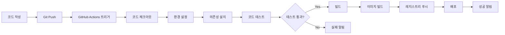

<div align="center">

[← 이전: Cloud Master 1일차 메인](../README.md) | [📚 전체 커리큘럼](/curriculum.md) | [🏠 학습 경로로 돌아가기](/index.md) | [📋 학습 경로](../learning-path.md) | [← 이전: Docker 고급 가이드](./docker-advanced-guide) | [다음: 클라우드 배포 가이드 →](./cloud-deployment-guide)

</div>

# 2교시: GitHub Actions로 CI/CD 구성


## 📋 목차
1. [CI/CD 개념 이해](#cicd-개념-이해)
2. [GitHub Actions 소개](#github-actions-소개)
3. [GitHub Actions 구성요소](#github-actions-구성요소)
4. [CI/CD 파이프라인 플로우](#cicd-파이프라인-플로우)
5. [실습 목표](#실습-목표)
6. [실습 절차](#실습-절차)
7. [실습 코드 예시](#실습-코드-예시)
8. [예상 결과](#예상-결과)
9. [혼자 해보기](#혼자-해보기)

---

## 🔄 CI/CD 개념 이해

### CI/CD란?

**CI/CD**는 **지속적 통합(Continuous Integration)** 및 **지속적 배포/전달(Continuous Deployment/Delivery)**를 뜻합니다.

#### CI (Continuous Integration) - 지속적 통합
- 코드 변경을 공유 저장소에 자주 머지(통합)
- 자동으로 빌드·테스트하는 과정
- 버그를 조기에 발견하고 코드 품질 보장

#### CD (Continuous Deployment/Delivery) - 지속적 배포/전달
- **Continuous Delivery**: 테스트가 통과된 코드를 배포 준비 상태로 유지
- **Continuous Deployment**: 테스트가 통과된 코드를 자동으로 프로덕션에 배포

### CI/CD의 장점

| 장점 | 설명 |
|------|------|
| **빠른 피드백** | 코드 변경 시 즉시 테스트 결과 확인 |
| **품질 보장** | 자동화된 테스트로 버그 조기 발견 |
| **배포 자동화** | 수동 배포로 인한 실수 방지 |
| **개발 생산성** | 반복 작업 자동화로 개발에 집중 |
| **일관성** | 모든 환경에서 동일한 배포 과정 |

---

## ⚡ GitHub Actions 소개

### GitHub Actions란?

GitHub Actions는 GitHub 저장소 내에서 **이벤트(예: push, pull_request 등)를 트리거로 하여 자동으로 워크플로우를 실행**하는 CI/CD 플랫폼입니다.

### GitHub Actions의 특징

- **무료 사용량**: Public 저장소는 무제한, Private 저장소는 월 2,000분 무료
- **GitHub 통합**: 별도 설정 없이 GitHub 저장소와 완벽 연동
- **풍부한 마켓플레이스**: 수천 개의 미리 만들어진 Actions 활용 가능
- **다양한 환경**: Ubuntu, Windows, macOS 등 다양한 실행 환경 지원
- **간편한 설정**: YAML 파일로 간단하게 워크플로우 정의

---

## 🏗️ GitHub Actions 구성요소

### 핵심 구성요소

#### 1. **Workflow (워크플로우)**
- 하나 이상의 Job으로 구성된 자동화된 프로세스
- `.github/workflows/` 폴더에 YAML 파일로 정의

#### 2. **Event (이벤트)**
- 워크플로우를 실행시키는 특정 활동
- 예: `push`, `pull_request`, `schedule`

#### 3. **Job (작업)**
- 워크플로우 내에서 실행되는 단위
- 병렬 또는 순차적으로 실행 가능

#### 4. **Step (단계)**
- Job 내에서 실행되는 개별 작업
- 명령어 실행 또는 Action 사용

#### 5. **Action (액션)**
- 재사용 가능한 작업 단위
- GitHub 마켓플레이스에서 제공

#### 6. **Runner (러너)**
- 워크플로우를 실행하는 서버
- GitHub 호스팅 또는 Self-hosted

### GitHub Actions 이벤트 종류

| 이벤트 | 설명 | 사용 예시 |
|--------|------|-----------|
| **push** | 코드 푸시 시 | 자동 빌드/테스트 |
| **pull_request** | PR 생성/업데이트 시 | 코드 리뷰 전 테스트 |
| **schedule** | 정기 실행 | 일일 빌드 |
| **workflow_dispatch** | 수동 실행 | 배포 |
| **release** | 릴리스 생성 시 | 자동 배포 |
| **issues** | 이슈 생성/수정 시 | 자동 라벨링 |

---

## 🔄 CI/CD 파이프라인 플로우



### 파이프라인 단계별 설명

#### 1. **코드 체크아웃**
```yaml
- name: Checkout code
  uses: actions/checkout@v4
```

#### 2. **환경 설정**
```yaml
- name: Setup Node.js
  uses: actions/setup-node@v3
  with:
    node-version: '18'
```

#### 3. **의존성 설치**
```yaml
- name: Install dependencies
  run: npm ci
```

#### 4. **코드 테스트**
```yaml
- name: Run tests
  run: npm test
```

#### 5. **빌드**
```yaml
- name: Build application
  run: npm run build
```

#### 6. **배포**
```yaml
- name: Deploy to production
  run: echo "Deploying..."
```

---

## 🎯 실습 목표

이 실습을 통해 다음을 달성합니다:

1. **GitHub Actions 이해**: GitHub Actions의 기본 개념과 구성요소를 이해합니다.

2. **워크플로우 작성**: YAML 파일을 통해 CI/CD 워크플로우를 작성합니다.

3. **자동화 구현**: 코드 푸시 시 자동으로 빌드, 테스트, 배포가 실행되도록 설정합니다.

4. **실행 결과 확인**: GitHub Actions 탭에서 워크플로우 실행 결과를 확인합니다.

---

## 📝 실습 절차

### 1단계: GitHub 저장소 준비

#### 새 저장소 생성
1. GitHub에 로그인
2. 오른쪽 상단 '+' 버튼 클릭
3. 'New repository' 선택
4. 저장소 이름: `actions-demo`
5. Public/Private 선택
6. 'Create repository' 클릭

#### 로컬 프로젝트 초기화
```bash
# 프로젝트 디렉토리 생성
mkdir actions-demo
cd actions-demo

# Git 저장소 초기화
git init
git branch -M main

# 원격 저장소 연결
git remote add origin git@github.com:<YOUR_USERNAME>/actions-demo.git
```

### 2단계: 프로젝트 코드 작성

#### package.json 생성
```json
{
  "name": "actions-demo",
  "version": "1.0.0",
  "description": "GitHub Actions Demo Project",
  "main": "app.js",
  "scripts": {
    "start": "node app.js",
    "test": "jest",
    "build": "echo 'Building application...'",
    "lint": "eslint .",
    "format": "prettier --write .",
    "format:check": "prettier --check .",
    "docker:build": "docker build -t actions-demo .",
    "docker:run": "docker run -p 3000:3000 actions-demo",
    "docker:run:prod": "docker run -d -p 80:3000 --name actions-demo-prod actions-demo"
  },
  "dependencies": {
    "express": "^4.18.2"
  },
  "devDependencies": {
    "jest": "^29.5.0",
    "eslint": "^8.40.0",
    "supertest": "^6.3.3",
    "prettier": "^2.8.8",
    "typescript": "^5.0.0",
    "@types/node": "^20.0.0",
    "jest-junit": "^16.0.0"
  }
}
```

#### app.js 생성
```javascript
const express = require('express');
const app = express();
const port = process.env.PORT || 3000;

// 간단한 API 엔드포인트
app.get('/', (req, res) => {
  res.json({
    message: 'Hello GitHub Actions!',
    timestamp: new Date().toISOString(),
    version: '1.0.0'
  });
});

app.get('/health', (req, res) => {
  res.json({ status: 'OK', uptime: process.uptime() });
});

// 서버 시작 (테스트 환경이 아닐 때만)
if (process.env.NODE_ENV !== 'test') {
  app.listen(port, () => {
    console.log(`Server running on port ${port}`);
  });
}

module.exports = app;
```

#### 테스트 파일 생성 (tests/app.test.js)
```javascript
const request = require('supertest');
const app = require('../app');

describe('App Tests', () => {
  // 테스트 환경 설정
  beforeAll(() => {
    process.env.NODE_ENV = 'test';
  });

  test('GET / should return welcome message', async () => {
    const response = await request(app).get('/');
    expect(response.status).toBe(200);
    expect(response.body.message).toBe('Hello GitHub Actions!');
  });

  test('GET /health should return health status', async () => {
    const response = await request(app).get('/health');
    expect(response.status).toBe(200);
    expect(response.body.status).toBe('OK');
  });
});
```

#### ESLint 설정 (.eslintrc.js)
```javascript
module.exports = {
  env: {
    node: true,
    es2021: true,
    jest: true
  },
  extends: ['eslint:recommended'],
  parserOptions: {
    ecmaVersion: 12,
    sourceType: 'module'
  },
  rules: {
    'no-console': 'warn',
    'no-unused-vars': 'error'
  }
};
```

#### Jest 설정 파일 생성 (jest.config.js)
```javascript
module.exports = {
  testEnvironment: 'node',
  collectCoverage: true,
  coverageDirectory: 'coverage',
  testResultsProcessor: 'jest-junit',
  reporters: [
    'default',
    ['jest-junit', { 
      outputDirectory: 'test-results',
      outputName: 'junit.xml'
    }]
  ],
  testMatch: [
    '**/tests/**/*.test.js',
    '**/__tests__/**/*.js'
  ],
  collectCoverageFrom: [
    'app.js',
    '!**/node_modules/**',
    '!**/coverage/**'
  ]
};
```

#### Prettier 설정 파일 생성 (.prettierrc)
```json
{
  "semi": true,
  "trailingComma": "es5",
  "singleQuote": true,
  "printWidth": 80,
  "tabWidth": 2
}
```

#### Package Lock 파일 생성 (package-lock.json)
```bash
npm install
echo "*/node_modules/*" > .gitignore
```

### 3단계: GitHub Actions 워크플로우 작성

#### 워크플로우 디렉토리 생성
```bash
# .github/workflows 디렉토리 생성
mkdir -p .github/workflows
```

#### CI 워크플로우 작성 (.github/workflows/ci.yml)
```yaml
name: CI Pipeline

# 워크플로우 트리거 설정
on:
  push:
    branches: [ main, develop ]
  pull_request:
    branches: [ main ]

# 환경 변수 설정
env:
  NODE_VERSION: '18'

# 작업 정의
jobs:
  # 코드 품질 검사
  lint:
    name: Code Linting
    runs-on: ubuntu-latest
    
    steps:
      - name: Checkout code
        uses: actions/checkout@v4
      
      - name: Setup Node.js
        uses: actions/setup-node@v4
        with:
          node-version: ${{ env.NODE_VERSION }}
          cache: 'npm'
      
      - name: Install dependencies
        run: npm ci
      
      - name: Run ESLint
        run: npm run lint

  # 테스트 실행
  test:
    name: Run Tests
    runs-on: ubuntu-latest
    
    # 여러 Node.js 버전에서 테스트
    strategy:
      matrix:
        node-version: [16, 18, 20]
    
    steps:
      - name: Checkout code
        uses: actions/checkout@v4
      
      - name: Setup Node.js ${{ matrix.node-version }}
        uses: actions/setup-node@v4
        with:
          node-version: ${{ matrix.node-version }}
          cache: 'npm'
      
      - name: Install dependencies
        run: npm ci
      
      - name: Run tests
        run: npm test
      
      - name: Upload coverage reports
        uses: codecov/codecov-action@v3
        if: matrix.node-version == 18
        with:
          token: ${{ secrets.CODECOV_TOKEN }}

  # 빌드 테스트
  build:
    name: Build Application
    runs-on: ubuntu-latest
    needs: [lint, test]
    
    steps:
      - name: Checkout code
        uses: actions/checkout@v4
      
      - name: Setup Node.js
        uses: actions/setup-node@v4
        with:
          node-version: ${{ env.NODE_VERSION }}
          cache: 'npm'
      
      - name: Install dependencies
        run: npm ci
      
      - name: Build application
        run: npm run build
      
      - name: Upload build artifacts
        uses: actions/upload-artifact@v3
        with:
          name: build-files
          path: |
            package.json
            app.js
          retention-days: 7

  # 보안 스캔
  security:
    name: Security Scan
    runs-on: ubuntu-latest
    
    steps:
      - name: Checkout code
        uses: actions/checkout@v4
      
      - name: Run security audit
        run: npm audit --audit-level moderate
      
      - name: Check for vulnerabilities
        uses: actions/dependency-review-action@v3
        if: github.event_name == 'pull_request'
```

#### 배포 워크플로우 작성 (.github/workflows/deploy.yml)
```yaml
name: Deploy to Production

# main 브랜치에 푸시될 때만 실행
on:
  push:
    branches: [ main ]
    tags: [ 'v*' ]

# 환경별 배포 설정
jobs:
  deploy:
    name: Deploy Application
    runs-on: ubuntu-latest
    environment: production
    
    steps:
      - name: Checkout code
        uses: actions/checkout@v4
      
      - name: Setup Node.js
        uses: actions/setup-node@v4
        with:
          node-version: '18'
          cache: 'npm'
      
      - name: Install dependencies
        run: npm ci
      
      - name: Run tests
        run: npm test
      
      - name: Build application
        run: npm run build
      
      - name: Deploy to staging
        if: github.ref == 'refs/heads/main'
        run: |
          echo "Deploying to staging environment..."
          echo "Application version: ${{ github.sha }}"
      
      - name: Deploy to production
        if: startsWith(github.ref, 'refs/tags/v')
        run: |
          echo "Deploying to production environment..."
          echo "Release version: ${{ github.ref_name }}"
      
      - name: Notify deployment
        uses: 8398a7/action-slack@v3
        with:
          status: ${{ job.status }}
          channel: '#deployments'
          webhook_url: ${{ secrets.SLACK_WEBHOOK }}
        if: always()
```

### 4단계: 코드 커밋 및 푸시

```bash
# 모든 파일 추가
git add .

# 커밋
git commit -m "Initial commit: Add GitHub Actions CI/CD pipeline"

# main 브랜치로 푸시
git push -u origin main
```

### 5단계: GitHub Actions 실행 확인

#### Actions 탭에서 확인
1. GitHub 저장소 페이지에서 'Actions' 탭 클릭
2. 'CI Pipeline' 워크플로우 실행 확인
3. 각 Job의 실행 상태 확인 (lint, test, build, security)

#### 실행 로그 확인
1. 실행 중인 워크플로우 클릭
2. 각 Job 클릭하여 상세 로그 확인
3. 실패한 경우 로그를 통해 원인 파악

#### Docker Hub 배포 확인
1. 'Deploy to Docker Hub' 워크플로우 실행 확인
2. Docker Hub에서 이미지 확인: `https://hub.docker.com/r/YOUR_USERNAME/actions-demo`
3. 로컬에서 테스트: `docker run -p 3000:3000 YOUR_USERNAME/actions-demo:main-COMMIT_SHA`

**📖 Docker Hub 설정이 필요하다면**: [Docker Hub 가입 및 토큰 설정 가이드](./docker-hub-setup-guide)

---

## 📁 워크플로우 파일 구조

### ✅ **기본 워크플로우 (활성화됨)**

#### 1. **CI Pipeline** (`.github/workflows/ci.yml`)
```yaml
name: CI Pipeline
on:
  push:
    branches: [ main, develop ]
  pull_request:
    branches: [ main ]
```
- **기능**: 코드 품질 검사, 테스트, 빌드
- **실행 시간**: 약 2-3분
- **목적**: 코드 변경 시 자동으로 품질 검증

#### 2. **Docker Hub 배포** (`.github/workflows/deploy.yml`)
```yaml
name: Deploy to Docker Hub
on:
  push:
    branches: [ main ]
    tags: [ 'v*' ]
```
- **기능**: Docker 이미지 빌드 및 Docker Hub 푸시
- **실행 시간**: 약 3-5분
- **목적**: main 브랜치 푸시 시 자동 배포

### 🔧 **고급 워크플로우 (비활성화됨)**

고급 워크플로우들은 현재 **비활성화**되어 있습니다. 사용하려면 파일명에서 `.disabled`를 제거하세요.

| 워크플로우 | 설명 | 활성화 방법 |
|-----------|------|-------------|
| `advanced-ci.yml.disabled` | 고급 CI/CD 기능 | `advanced-ci.yml`로 이름 변경 |
| `aws-deploy.yml.disabled` | AWS ECS 배포 | `aws-deploy.yml`로 이름 변경 |
| `gcp-deploy.yml.disabled` | GCP Cloud Run 배포 | `gcp-deploy.yml`로 이름 변경 |
| `multi-cloud-deploy.yml.disabled` | 멀티클라우드 배포 | `multi-cloud-deploy.yml`로 이름 변경 |
| `vm-docker-deploy.yml.disabled` | VM Docker 배포 | `vm-docker-deploy.yml`로 이름 변경 |

### 🎯 **워크플로우 활성화 방법**

#### Windows (CMD)
```cmd
ren advanced-ci.yml.disabled advanced-ci.yml
ren aws-deploy.yml.disabled aws-deploy.yml
```

#### Linux/Mac
```bash
mv advanced-ci.yml.disabled advanced-ci.yml
mv aws-deploy.yml.disabled aws-deploy.yml
```

---

## 💻 실습 코드 예시

### 고급 워크플로우 예시 (.github/workflows/advanced-ci.yml)
```yaml
name: Advanced CI/CD Pipeline

on:
  push:
    branches: [ main, develop ]
  pull_request:
    branches: [ main ]
  schedule:
    - cron: '0 2 * * *'  # 매일 오전 2시 실행
  workflow_dispatch:
    inputs:
      environment:
        description: 'Deployment environment'
        required: true
        default: 'staging'
        type: choice
        options:
          - staging
          - production

env:
  NODE_VERSION: '18'
  REGISTRY: docker.io
  IMAGE_NAME: ${{ github.actor }}/actions-demo

jobs:
  # 코드 품질 검사
  quality:
    name: Code Quality
    runs-on: ubuntu-latest
    
    steps:
      - name: Checkout code
        uses: actions/checkout@v4
        with:
          fetch-depth: 0  # 전체 히스토리 가져오기
      
      - name: Setup Node.js
        uses: actions/setup-node@v4
        with:
          node-version: ${{ env.NODE_VERSION }}
          cache: 'npm'
      
      - name: Install dependencies
        run: npm ci
      
      - name: Run ESLint
        run: npm run lint
      
      - name: Run Prettier
        run: npx prettier --check .
      
      - name: Type checking
        run: npx tsc --noEmit
        continue-on-error: true

  # 테스트 실행
  test:
    name: Test Suite
    runs-on: ubuntu-latest
    
    strategy:
      matrix:
        node-version: [16, 18, 20]
        os: [ubuntu-latest, windows-latest, macos-latest]
    
    steps:
      - name: Checkout code
        uses: actions/checkout@v4
      
      - name: Setup Node.js ${{ matrix.node-version }}
        uses: actions/setup-node@v4
        with:
          node-version: ${{ matrix.node-version }}
          cache: 'npm'
      
      - name: Install dependencies
        run: npm ci
      
      - name: Run tests
        run: npm test
        env:
          CI: true
      
      - name: Upload test results
        uses: actions/upload-artifact@v4
        if: always()
        with:
          name: test-results-${{ matrix.os }}-${{ matrix.node-version }}
          path: test-results/
          retention-days: 7

  # 보안 검사
  security:
    name: Security Scan
    runs-on: ubuntu-latest
    
    steps:
      - name: Checkout code
        uses: actions/checkout@v4
      
      - name: Run Trivy vulnerability scanner
        uses: aquasecurity/trivy-action@master
        with:
          scan-type: 'fs'
          scan-ref: '.'
          format: 'sarif'
          output: 'trivy-results.sarif'
      
      - name: Upload Trivy scan results
        uses: github/codeql-action/upload-sarif@v2
        with:
          sarif_file: 'trivy-results.sarif'

  # Docker 이미지 빌드
  build:
    name: Build Docker Image
    runs-on: ubuntu-latest
    needs: [quality, test, security]
    if: github.event_name == 'push'
    
    steps:
      - name: Checkout code
        uses: actions/checkout@v4
      
      - name: Set up Docker Buildx
        uses: docker/setup-buildx-action@v3
      
      - name: Log in to Container Registry
        uses: docker/login-action@v3
        with:
          registry: ${{ env.REGISTRY }}
          username: ${{ github.actor }}
          password: ${{ secrets.DOCKERHUB_TOKEN }}
        continue-on-error: true
      
      - name: Extract metadata
        id: meta
        uses: docker/metadata-action@v5
        with:
          images: ${{ env.REGISTRY }}/${{ env.IMAGE_NAME }}
          tags: |
            type=ref,event=branch
            type=ref,event=pr
            type=semver,pattern={{version}}
            type=semver,pattern={{major}}.{{minor}}
            type=sha,prefix={{branch}}-
      
      - name: Build and push Docker image
        uses: docker/build-push-action@v5
        with:
          context: .
          push: ${{ secrets.DOCKERHUB_TOKEN != '' }}
          tags: ${{ steps.meta.outputs.tags }}
          labels: ${{ steps.meta.outputs.labels }}
          cache-from: type=gha
          cache-to: type=gha,mode=max
        continue-on-error: true

  # 배포
  deploy:
    name: Deploy Application
    runs-on: ubuntu-latest
    needs: [build]
    if: github.event_name == 'push' && github.ref == 'refs/heads/main'
    environment: ${{ github.event.inputs.environment || 'staging' }}
    
    steps:
      - name: Checkout code
        uses: actions/checkout@v4
      
      - name: Deploy to ${{ github.event.inputs.environment || 'staging' }}
        run: |
          echo "Deploying to ${{ github.event.inputs.environment || 'staging' }} environment"
          echo "Image: ${{ env.REGISTRY }}/${{ env.IMAGE_NAME }}:${{ github.sha }}"
          # 실제 배포 스크립트 실행
          # docker run -d -p 3000:3000 --name actions-demo-staging ${{ env.REGISTRY }}/${{ env.IMAGE_NAME }}:${{ github.sha }}
      
      - name: Health check
        run: |
          echo "Performing health check..."
          # 헬스체크 스크립트 실행
      
      - name: Check Slack webhook
        id: check-slack
        run: |
          if [ -n "${{ secrets.SLACK_WEBHOOK_URL }}" ]; then
            echo "slack_enabled=true" >> $GITHUB_OUTPUT
          else
            echo "slack_enabled=false" >> $GITHUB_OUTPUT
          fi

      - name: Notify deployment
        uses: 8398a7/action-slack@v3
        with:
          status: ${{ job.status }}
          channel: '#deployments'
          webhook_url: ${{ secrets.SLACK_WEBHOOK_URL }}
        if: always() && steps.check-slack.outputs.slack_enabled == 'true'
        continue-on-error: true
```

---

## 🔧 문제 해결

### Jest 경고 해결

테스트 실행 시 다음과 같은 경고가 나타날 수 있습니다:

```
Jest did not exit one second after the test run has completed.
This usually means that there are asynchronous operations that weren't stopped in your tests.
```

**원인**: Express 서버가 테스트 후에도 계속 실행되어 Jest가 종료되지 않음

**해결 방법**:

1. **app.js 수정**: 테스트 환경에서는 서버를 자동 시작하지 않도록 수정
2. **테스트 파일 수정**: `beforeAll` 훅에서 `NODE_ENV=test` 설정

이미 위의 코드 예시에 해결책이 포함되어 있습니다.

### CI vs CD 환경에서의 서버 실행

**CI (Continuous Integration)**:
- 테스트만 실행하므로 서버가 시작되지 않아도 됨
- `NODE_ENV=test`로 설정하여 서버 자동 시작 방지

**CD (Continuous Deployment)**:
- 실제 서비스로 배포되므로 서버가 실행되어야 함
- **Docker 컨테이너**를 통해 서버 실행 (권장)
- 컨테이너화로 일관된 배포 환경 보장

### 일반적인 문제들

| 문제 | 원인 | 해결 방법 |
|------|------|-----------|
| `ModuleNotFoundError: supertest` | 의존성 누락 | `package.json`에 `supertest` 추가 |
| Jest 경고 | 서버가 종료되지 않음 | `NODE_ENV=test` 조건부 서버 시작 |
| ESLint 에러 | 코드 스타일 문제 | `npm run lint` 실행 후 수정 |
| CD에서 서버가 실행되지 않음 | 배포 환경 설정 누락 | Docker 컨테이너 설정 추가 |
| `actions/upload-artifact: v3` deprecated 에러 | GitHub Actions 버전 업데이트 필요 | v4로 업데이트 |
| `installation not allowed to Create organization package` | GitHub Container Registry 권한 부족 | 권한 설정 또는 Docker Hub 사용 |
| Slack 웹훅 에러 | `webhook_url` 파라미터 또는 시크릿 누락 | 올바른 파라미터명과 시크릿 설정 |

### GitHub Container Registry 권한 설정

#### 문제: `installation not allowed to Create organization package`

**원인**: GitHub Container Registry (ghcr.io)에 패키지를 푸시할 권한이 없음

**해결 방법**:

1. **GitHub 설정에서 권한 확인**:
   - GitHub → Settings → Developer settings → Personal access tokens
   - `write:packages` 권한이 있는지 확인

2. **조직 설정 확인** (조직 저장소인 경우):
   - Organization → Settings → Actions → General
   - "Allow GitHub Actions to create and approve pull requests" 활성화

3. **대안: Docker Hub 사용** (권장):
   ```yaml
   env:
     REGISTRY: docker.io
     IMAGE_NAME: ${{ github.actor }}/actions-demo
   ```
   
   **Docker Hub 설정**:
   1. https://hub.docker.com 에서 계정 생성
   2. Access Token 생성 (Account Settings → Security → New Access Token)
   3. GitHub 시크릿에 `DOCKERHUB_TOKEN` 추가

4. **로컬에서만 빌드** (푸시 없이):
   ```yaml
   - name: Build Docker image
     uses: docker/build-push-action@v5
     with:
       context: .
       push: false  # 푸시하지 않고 빌드만
   ```

### Slack 알림 설정

#### 문제: Slack 웹훅 에러

**해결 방법**:

1. **Slack 웹훅 URL 생성**:
   - Slack → Apps → Incoming Webhooks
   - 웹훅 URL 복사

2. **GitHub 시크릿 설정**:
   - Repository → Settings → Secrets and variables → Actions
   - `SLACK_WEBHOOK_URL` 시크릿 추가

3. **워크플로우에서 조건부 실행**:
   ```yaml
   - name: Check Slack webhook
     id: check-slack
     run: |
       if [ -n "${{ secrets.SLACK_WEBHOOK_URL }}" ]; then
         echo "slack_enabled=true" >> $GITHUB_OUTPUT
       else
         echo "slack_enabled=false" >> $GITHUB_OUTPUT
       fi

   - name: Notify deployment
     uses: 8398a7/action-slack@v3
     with:
       status: ${{ job.status }}
       channel: '#deployments'
       webhook_url: ${{ secrets.SLACK_WEBHOOK_URL }}
     if: always() && steps.check-slack.outputs.slack_enabled == 'true'
     continue-on-error: true
   ```

---

## 🐳 Docker 배포 가이드

### Docker 파일 구조

#### Dockerfile
```dockerfile
# Node.js 18 Alpine 이미지 사용
FROM node:18-alpine

# 작업 디렉토리 설정
WORKDIR /app

# package.json과 package-lock.json 복사
COPY package*.json ./

# 의존성 설치 (프로덕션만)
RUN npm ci --omit=dev && npm cache clean --force

# 애플리케이션 코드 복사
COPY . .

# 포트 노출
EXPOSE 3000

# 헬스체크 추가
HEALTHCHECK --interval=30s --timeout=3s --start-period=5s --retries=3 \
  CMD node -e "require('http').get('http://localhost:3000/health', (res) => { process.exit(res.statusCode === 200 ? 0 : 1) })"

# 애플리케이션 실행
CMD ["node", "app.js"]
```

#### .dockerignore
```
node_modules
npm-debug.log
.git
.gitignore
README.md
.env
.nyc_output
coverage
.github
tests
.eslintrc.js
jest.config.js
test-results
*.md
.DS_Store
```

### 로컬 Docker 테스트

```bash
# Docker 이미지 빌드
npm run docker:build

# 개발 환경에서 실행
npm run docker:run

# 프로덕션 환경에서 실행
npm run docker:run:prod
```

### Docker 명령어 참고

```bash
# 이미지 빌드
docker build -t actions-demo .

# 컨테이너 실행 (개발)
docker run -p 3000:3000 actions-demo

# 컨테이너 실행 (프로덕션)
docker run -d -p 80:3000 --name actions-demo-prod actions-demo

# 실행 중인 컨테이너 확인
docker ps

# 컨테이너 로그 확인
docker logs actions-demo-prod

# 컨테이너 중지
docker stop actions-demo-prod

# 컨테이너 제거
docker rm actions-demo-prod
```

---

## ✅ 예상 결과

### 워크플로우 실행
- 코드 푸시 시 GitHub Actions에서 자동으로 워크플로우가 시작
- lint, test, build, security 단계가 성공적으로 완료

### 로그 확인
- 각 스텝 옆에 초록색 체크(성공) 표시
- 콘솔 로그를 통해 npm install, npm test 등의 출력 결과 확인

### 아티팩트 생성
- 빌드된 파일들이 아티팩트로 업로드
- 테스트 결과가 아티팩트로 저장

### 알림
- 배포 완료 시 Slack 알림 (설정된 경우)
- 이메일 알림 (GitHub 설정에 따라)

---

## 🚀 혼자 해보기

### 기본 과제
1. **워크플로우 수정**: Pull Request 이벤트에도 빌드가 실행되도록 워크플로우를 수정해 보세요.

2. **Lint 추가**: ESLint나 Prettier 같은 코드 스타일 검사를 추가로 수행하도록 새로운 스텝을 추가해 보세요.

3. **알림 설정**: 워크플로우 성공/실패 시 이메일이나 Slack 알림을 설정해 보세요.

### 고급 과제
1. **매트릭스 전략**: 여러 Node.js 버전과 운영체제에서 테스트를 실행하도록 매트릭스 전략을 구현해 보세요.

2. **조건부 실행**: 특정 파일이 변경되었을 때만 특정 Job을 실행하도록 조건부 실행을 구현해 보세요.

3. **환경별 배포**: staging과 production 환경을 분리하여 각각 다른 배포 전략을 적용해 보세요.

---

## ❓ 퀴즈

1. **GitHub Actions 워크플로우는 어디에 저장해야 하나요?**

2. **`runs-on` 옵션은 무슨 역할을 하나요?**

3. **워크플로우를 트리거할 수 있는 이벤트 종류 3가지를 말해보세요.**

4. **`needs` 키워드는 어떤 용도로 사용되나요?**

---

## ✅ 체크리스트

- [ ] .github/workflows 디렉터리를 만들었나요?
- [ ] 워크플로우 파일이 main 브랜치에 푸시되었나요?
- [ ] Actions 탭에서 워크플로우가 실행되었음을 확인했나요?
- [ ] 빌드/테스트가 성공적으로 완료되었나요?
- [ ] 실패한 경우 로그를 확인하여 문제를 해결했나요?

---

## 📚 추가 학습 자료

- [GitHub Actions 공식 문서](https://docs.github.com/en/actions)
- [Actions 마켓플레이스](https://github.com/marketplace?type=actions)
- [워크플로우 예제 모음](https://github.com/actions/starter-workflows)
- [YAML 문법 가이드](https://docs.github.com/en/actions/using-workflows/workflow-syntax-for-github-actions)

다음 단계: [3교시: 클라우드 배포 기초 실습](./cloud-deployment-guide)

---


