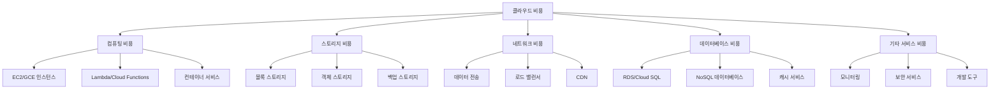
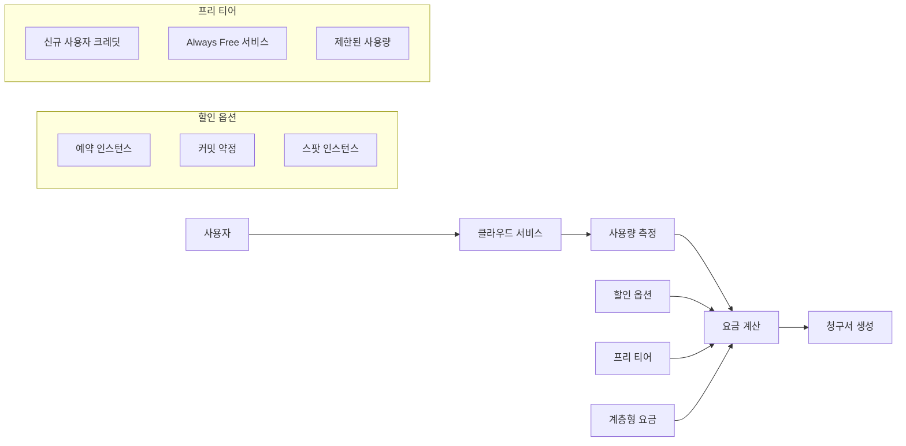

<div align="center">

[← 이전: Cloud Master 2일차 메인](/mcp_knowledge_base/cloud_master/README.md) | [📚 전체 커리큘럼](/mcp_knowledge_base/curriculum.md) | [🏠 학습 경로로 돌아가기](/mcp_knowledge_base/index.md) | [← 이전: Cloud Master 메인](/mcp_knowledge_base/cloud_master/README.md) | [📋 학습 경로](/mcp_knowledge_base/cloud_master/learning-path.md) | [← 이전: Cloud Master 1일차](/mcp_knowledge_base/cloud_master/textbook/Day1/README.md) | [다음: 비용 최적화 가이드 →](/mcp_knowledge_base/cloud_master/textbook/Day2/cost-optimization-guide.md)

</div>

# 1교시: 클라우드 비용 구조와 서비스 과금 체계 이해


## 📋 목차
1. [클라우드 비용 구조 이해](#클라우드-비용-구조-이해)
2. [AWS vs GCP 과금 모델 비교](#aws-vs-gcp-과금-모델-비교)
3. [프리 티어 및 할인 옵션](#프리-티어-및-할인-옵션)
4. [비용 계산기 활용](#비용-계산기-활용)
5. [실습 목표](#실습-목표)
6. [실습 절차](#실습-절차)
7. [실습 코드 예시](#실습-코드-예시)
8. [예상 결과](#예상-결과)
9. [혼자 해보기](#혼자-해보기)

---

## 💰 클라우드 비용 구조 이해

### 클라우드 비용의 특징

클라우드 서비스는 **종량제(Pay-as-you-go)** 요금 체계를 채택하여 사용한 만큼만 비용을 지불합니다. 이는 전통적인 온프레미스 인프라와는 다른 혁신적인 비용 모델입니다.

#### 1. **종량제(Pay-as-you-go)**
- 사용한 서비스에 대해서만 과금
- 서비스 중단 시 추가 요금이나 해지 비용 없음
- 유연한 리소스 확장/축소 가능

#### 2. **계층형 요금(Tiered Pricing)**
- 사용량이 많아질수록 GB당 요금이 낮아짐
- 대량 사용 시 할인 혜택 제공
- 예: AWS S3, 데이터 전송 비용

#### 3. **지역별 차등 요금**
- 리전별로 다른 요금 체계
- 데이터 전송 비용의 지역별 차이
- 통화별 요금 표시

### 클라우드 비용 구성 요소



---

## ⚖️ AWS vs GCP 과금 모델 비교

### 기본 과금 체계 비교

| 구분 | AWS | GCP |
|------|-----|-----|
| **기본 모델** | 종량제 (Pay-as-you-go) | 종량제 (Pay-as-you-go) |
| **최소 과금 단위** | 초 단위 (일부 서비스) | 초 단위 (일부 서비스) |
| **할인 옵션** | Reserved Instances, Savings Plans | Committed Use Discounts |
| **프리 티어** | $200 크레딧 + Always Free | $300 크레딧 + Always Free |
| **계층형 요금** | ✅ (S3, 데이터 전송) | ✅ (Cloud Storage, 데이터 전송) |

### 주요 서비스별 비용 비교

#### 컴퓨팅 서비스
| 서비스 | AWS | GCP | 비고 |
|--------|-----|-----|------|
| **가상 머신** | EC2 | Compute Engine | 인스턴스 타입별 차등 요금 |
| **서버리스** | Lambda | Cloud Functions | 요청 수 및 실행 시간 기반 |
| **컨테이너** | ECS, EKS | GKE, Cloud Run | 클러스터 및 노드 기반 |
| **배치 처리** | Batch | Cloud Batch | 작업 단위 과금 |

#### 스토리지 서비스
| 서비스 | AWS | GCP | 비고 |
|--------|-----|-----|------|
| **블록 스토리지** | EBS | Persistent Disk | GB당 월 요금 |
| **객체 스토리지** | S3 | Cloud Storage | GB당 월 요금 + 요청 수 |
| **백업** | Backup | Cloud Backup | 백업 용량 기반 |
| **아카이브** | Glacier | Archive Storage | 장기 보관용 저렴한 요금 |

#### 네트워크 서비스
| 서비스 | AWS | GCP | 비고 |
|--------|-----|-----|------|
| **데이터 전송** | Data Transfer | Network Egress | 리전별 차등 요금 |
| **로드 밸런서** | ELB | Cloud Load Balancing | 시간당 요금 + 데이터 처리량 |
| **CDN** | CloudFront | Cloud CDN | 데이터 전송량 기반 |
| **DNS** | Route 53 | Cloud DNS | 쿼리 수 기반 |

### 과금 모델 다이어그램



---

## 🎁 프리 티어 및 할인 옵션

### AWS 프리 티어

#### 1. **신규 사용자 혜택**
- **$200 크레딧**: 12개월간 유효
- **6개월 무료 체험**: 일부 서비스
- **Always Free**: 월별 사용 한도 내 무료

#### 2. **Always Free 서비스**
| 서비스 | 무료 한도 | 기간 |
|--------|-----------|------|
| **EC2** | t2.micro 750시간/월 | 12개월 |
| **S3** | 5GB 스토리지 | 12개월 |
| **RDS** | db.t2.micro 750시간/월 | 12개월 |
| **Lambda** | 100만 요청/월 | 영구 |
| **CloudWatch** | 10개 메트릭, 1GB 로그 | 영구 |

#### 3. **할인 옵션**
- **Reserved Instances**: 1년/3년 약정 시 최대 75% 할인
- **Savings Plans**: 컴퓨팅 사용량 기반 할인
- **Spot Instances**: 미사용 인스턴스 최대 90% 할인

### GCP 프리 티어

#### 1. **신규 사용자 혜택**
- **$300 크레딧**: 90일간 유효
- **Always Free**: 월별 사용 한도 내 무료

#### 2. **Always Free 서비스**
| 서비스 | 무료 한도 | 기간 |
|--------|-----------|------|
| **Compute Engine** | f1-micro 1개 | 영구 |
| **Cloud Storage** | 5GB 스토리지 | 영구 |
| **Cloud SQL** | db-f1-micro 1개 | 영구 |
| **Cloud Functions** | 200만 요청/월 | 영구 |
| **Cloud Monitoring** | 150MB 로그/월 | 영구 |

#### 3. **할인 옵션**
- **Committed Use Discounts**: 1년/3년 약정 시 최대 57% 할인
- **Sustained Use Discounts**: 자동 할인 (최대 30%)
- **Preemptible Instances**: 미사용 인스턴스 최대 80% 할인

### 할인 옵션 비교표

| 할인 유형 | AWS | GCP | 할인율 | 약정 기간 |
|-----------|-----|-----|--------|-----------|
| **예약 인스턴스** | Reserved Instances | Committed Use | 최대 75% | 1년/3년 |
| **컴퓨팅 할인** | Savings Plans | Sustained Use | 최대 30% | 자동 |
| **스팟 인스턴스** | Spot Instances | Preemptible | 최대 90% | 즉시 |
| **볼륨 할인** | Volume Discounts | Volume Discounts | 사용량 기반 | 자동 |

---

## 🧮 비용 계산기 활용

### AWS Pricing Calculator

#### 1. **기본 사용법**
- 웹 기반 인터페이스
- 서비스별 상세 설정 가능
- 예약 인스턴스 할인 적용 가능
- CSV 내보내기 지원

#### 2. **주요 기능**
- **서비스 선택**: EC2, RDS, S3, Lambda 등
- **리전 선택**: 전 세계 리전별 요금 비교
- **할인 적용**: Reserved Instances, Savings Plans
- **비용 분석**: 월별/연별 비용 예측

### Google Cloud Pricing Calculator

#### 1. **기본 사용법**
- 웹 기반 인터페이스
- 서비스별 상세 설정 가능
- 커밋 약정 할인 적용 가능
- PDF 내보내기 지원

#### 2. **주요 기능**
- **서비스 선택**: Compute Engine, Cloud SQL, Cloud Storage 등
- **리전 선택**: 전 세계 리전별 요금 비교
- **할인 적용**: Committed Use, Sustained Use
- **비용 분석**: 월별/연별 비용 예측

### 비용 계산기 비교

| 기능 | AWS Pricing Calculator | Google Cloud Pricing Calculator |
|------|------------------------|----------------------------------|
| **인터페이스** | 웹 기반 | 웹 기반 |
| **서비스 수** | 100+ 서비스 | 50+ 서비스 |
| **할인 옵션** | Reserved, Savings Plans | Committed Use, Sustained Use |
| **내보내기** | CSV | PDF |
| **API 지원** | ❌ | ❌ |
| **모바일 지원** | ✅ | ✅ |

---

## 🎯 실습 목표

이 실습을 통해 다음을 달성합니다:

1. **비용 구조 이해**: AWS와 GCP의 과금 정책을 이해합니다.

2. **비용 계산기 활용**: 클라우드 비용 계산기를 사용하여 비용을 예측합니다.

3. **할인 옵션 비교**: 다양한 할인 옵션의 효과를 비교합니다.

4. **예산 관리**: 비용 관리 도구를 사용하여 예산을 설정합니다.

---

## 📝 실습 절차

### 1단계: 비용 계산기 접속 및 기본 설정

#### AWS Pricing Calculator 접속
```bash
# AWS Pricing Calculator 웹사이트 접속
# https://calculator.aws/

# 기본 설정
# - 리전: Asia Pacific (Seoul) - ap-northeast-2
# - 통화: USD
# - 시간 단위: 월별
```

#### Google Cloud Pricing Calculator 접속
```bash
# Google Cloud Pricing Calculator 웹사이트 접속
# https://cloud.google.com/products/calculator

# 기본 설정
# - 리전: asia-northeast1 (Seoul)
# - 통화: USD
# - 시간 단위: 월별
```

### 2단계: 웹 서비스 구성 시나리오 설정

#### 시나리오: 스타트업 웹 서비스
- **웹 서버**: 2대 (고가용성)
- **데이터베이스**: 1대 (관계형)
- **스토리지**: 100GB (웹 콘텐츠)
- **로드 밸런서**: 1개
- **모니터링**: 기본 모니터링

#### AWS 구성
```bash
# EC2 인스턴스 2대
# - 인스턴스 타입: t3.medium
# - 운영체제: Amazon Linux 2
# - 스토리지: 20GB GP3

# RDS 데이터베이스 1대
# - 엔진: MySQL
# - 인스턴스 클래스: db.t3.micro
# - 스토리지: 20GB

# S3 스토리지
# - 스토리지 클래스: Standard
# - 용량: 100GB

# Application Load Balancer
# - 타입: Application Load Balancer
# - 시간: 24시간/일
```

#### GCP 구성
```bash
# Compute Engine 인스턴스 2대
# - 머신 타입: e2-medium
# - 운영체제: Debian 11
# - 스토리지: 20GB SSD

# Cloud SQL 데이터베이스 1대
# - 엔진: MySQL
# - 머신 타입: db-f1-micro
# - 스토리지: 20GB

# Cloud Storage
# - 스토리지 클래스: Standard
# - 용량: 100GB

# HTTP(S) Load Balancer
# - 타입: HTTP(S) Load Balancer
# - 시간: 24시간/일
```

### 3단계: 기본 비용 계산

#### AWS 기본 비용 계산
```bash
# AWS Pricing Calculator에서 다음 항목 추가:
# 1. EC2 인스턴스 2대 (t3.medium)
# 2. RDS 인스턴스 1대 (db.t3.micro)
# 3. S3 스토리지 100GB
# 4. Application Load Balancer 1개

# 예상 월별 비용: $150-200
```

#### GCP 기본 비용 계산
```bash
# Google Cloud Pricing Calculator에서 다음 항목 추가:
# 1. Compute Engine 인스턴스 2대 (e2-medium)
# 2. Cloud SQL 인스턴스 1대 (db-f1-micro)
# 3. Cloud Storage 100GB
# 4. HTTP(S) Load Balancer 1개

# 예상 월별 비용: $120-180
```

### 4단계: 할인 옵션 적용

#### AWS 할인 옵션 적용
```bash
# Reserved Instances 적용
# - EC2 t3.medium 2대, 1년 약정
# - 할인율: 약 30-40%
# - 예상 절약: $50-70/월

# Savings Plans 적용
# - 컴퓨팅 사용량 기반
# - 할인율: 약 20-30%
# - 예상 절약: $30-50/월
```

#### GCP 할인 옵션 적용
```bash
# Committed Use Discounts 적용
# - Compute Engine e2-medium 2대, 1년 약정
# - 할인율: 약 25-35%
# - 예상 절약: $40-60/월

# Sustained Use Discounts 적용
# - 자동 할인
# - 할인율: 약 15-25%
# - 예상 절약: $20-40/월
```

### 5단계: 비용 관리 도구 설정

#### AWS Budgets 설정
```bash
# AWS CLI를 통한 예산 생성
aws budgets create-budget \
  --account-id 123456789012 \
  --budget '{
    "BudgetName": "MonthlyWebServiceBudget",
    "BudgetLimit": {
      "Amount": "200",
      "Unit": "USD"
    },
    "TimeUnit": "MONTHLY",
    "BudgetType": "COST",
    "CostFilters": {
      "Service": ["Amazon Elastic Compute Cloud - Compute", "Amazon Relational Database Service"]
    }
  }'

# 예산 알림 설정
aws budgets create-notification \
  --account-id 123456789012 \
  --budget-name "MonthlyWebServiceBudget" \
  --notification '{
    "NotificationType": "ACTUAL",
    "ComparisonOperator": "GREATER_THAN",
    "Threshold": 80,
    "ThresholdType": "PERCENTAGE"
  }' \
  --subscribers '[
    {
      "SubscriptionType": "EMAIL",
      "Address": "admin@example.com"
    }
  ]'
```

#### GCP Budgets 설정
```bash
# gcloud CLI를 통한 예산 생성
gcloud alpha billing budgets create \
  --billing-account=BILLING_ACCOUNT_ID \
  --display-name="Monthly Web Service Budget" \
  --budget-amount=200 \
  --threshold-rule=percent=0.8 \
  --threshold-rule=percent=1.0 \
  --filter-projects="projects/PROJECT_ID"

# 예산 알림 설정
gcloud alpha billing budgets create \
  --billing-account=BILLING_ACCOUNT_ID \
  --display-name="Monthly Web Service Budget" \
  --budget-amount=200 \
  --threshold-rule=percent=0.8,spend-basis=FORECASTED \
  --threshold-rule=percent=1.0,spend-basis=ACTUAL \
  --notification-rule=pubsub-topic=projects/PROJECT_ID/topics/budget-alerts
```

---

## 💻 실습 코드 예시

### AWS 비용 분석 스크립트

#### 비용 및 사용량 조회
```bash
#!/bin/bash
# aws-cost-analysis.sh

# 현재 월 비용 조회
aws ce get-cost-and-usage \
  --time-period Start=2024-01-01,End=2024-01-31 \
  --granularity MONTHLY \
  --metrics BlendedCost \
  --group-by Type=DIMENSION,Key=SERVICE

# 서비스별 비용 분석
aws ce get-cost-and-usage \
  --time-period Start=2024-01-01,End=2024-01-31 \
  --granularity MONTHLY \
  --metrics BlendedCost \
  --group-by Type=DIMENSION,Key=SERVICE \
  --query "ResultsByTime[0].Groups[].{Service:Keys[0],Cost:Metrics.BlendedCost.Amount}"

# 예약 인스턴스 사용률 조회
aws ce get-reservation-coverage \
  --time-period Start=2024-01-01,End=2024-01-31 \
  --granularity MONTHLY

# 비용 예측
aws ce get-cost-forecast \
  --time-period Start=2024-02-01,End=2024-02-28 \
  --metric BLENDED_COST \
  --granularity MONTHLY
```

#### 예산 관리 스크립트
```bash
#!/bin/bash
# aws-budget-management.sh

# 예산 목록 조회
aws budgets describe-budgets \
  --account-id 123456789012

# 예산 사용률 조회
aws budgets describe-budget-performance-history \
  --account-id 123456789012 \
  --budget-name "MonthlyWebServiceBudget" \
  --time-period Start=2024-01-01,End=2024-01-31

# 예산 알림 설정
aws budgets create-notification \
  --account-id 123456789012 \
  --budget-name "MonthlyWebServiceBudget" \
  --notification '{
    "NotificationType": "FORECASTED",
    "ComparisonOperator": "GREATER_THAN",
    "Threshold": 90,
    "ThresholdType": "PERCENTAGE"
  }' \
  --subscribers '[
    {
      "SubscriptionType": "EMAIL",
      "Address": "admin@example.com"
    }
  ]'
```

### GCP 비용 분석 스크립트

#### 비용 및 사용량 조회
```bash
#!/bin/bash
# gcp-cost-analysis.sh

# 현재 월 비용 조회
gcloud alpha billing budgets list \
  --billing-account=BILLING_ACCOUNT_ID

# 프로젝트별 비용 분석
gcloud alpha billing projects list \
  --billing-account=BILLING_ACCOUNT_ID

# 서비스별 사용량 조회
gcloud logging read "resource.type=gce_instance" \
  --limit=100 \
  --format="table(timestamp,resource.labels.instance_name,severity)"

# 비용 권장사항 조회
gcloud recommender recommendations list \
  --project=PROJECT_ID \
  --recommender=google.compute.instance.MachineTypeRecommender
```

#### 예산 관리 스크립트
```bash
#!/bin/bash
# gcp-budget-management.sh

# 예산 목록 조회
gcloud alpha billing budgets list \
  --billing-account=BILLING_ACCOUNT_ID

# 예산 생성
gcloud alpha billing budgets create \
  --billing-account=BILLING_ACCOUNT_ID \
  --display-name="Monthly Web Service Budget" \
  --budget-amount=200 \
  --threshold-rule=percent=0.8 \
  --threshold-rule=percent=1.0 \
  --filter-projects="projects/PROJECT_ID"

# 예산 알림 설정
gcloud alpha billing budgets create \
  --billing-account=BILLING_ACCOUNT_ID \
  --display-name="Monthly Web Service Budget" \
  --budget-amount=200 \
  --threshold-rule=percent=0.8,spend-basis=FORECASTED \
  --threshold-rule=percent=1.0,spend-basis=ACTUAL \
  --notification-rule=pubsub-topic=projects/PROJECT_ID/topics/budget-alerts
```

---

## ✅ 예상 결과

### 비용 계산기 결과
- AWS Pricing Calculator: 월별 예상 비용 $150-200
- Google Cloud Pricing Calculator: 월별 예상 비용 $120-180
- 할인 옵션 적용 시 20-40% 비용 절감

### 할인 옵션 효과
- **AWS Reserved Instances**: 30-40% 할인
- **GCP Committed Use**: 25-35% 할인
- **자동 할인**: 15-30% 할인

### 예산 관리
- 월별 예산 한도 설정 완료
- 80% 초과 시 알림 설정 완료
- 100% 초과 시 알림 설정 완료

---

## 🚀 혼자 해보기

### 기본 과제
1. **다른 시나리오 계산**: 마이크로서비스 아키텍처로 비용을 계산해 보세요.

2. **할인 옵션 비교**: 다양한 할인 옵션의 효과를 비교해 보세요.

3. **리전별 비용 비교**: 다른 리전의 비용을 비교해 보세요.

### 고급 과제
1. **비용 최적화**: 비용을 최적화할 수 있는 방법을 찾아보세요.

2. **예산 관리**: 더 정교한 예산 관리 시스템을 구축해 보세요.

3. **비용 모니터링**: 실시간 비용 모니터링 시스템을 구축해 보세요.

---

## ❓ 퀴즈

1. **AWS의 Savings Plans와 GCP의 Committed Use Discount 차이는 무엇인가요?**

2. **클라우드 프리 티어(Free Tier)의 조건은 각각 어떻게 되나요?**

3. **계층형 요금(Tiered Pricing)이 적용되는 서비스들은 무엇인가요?**

4. **예약 인스턴스와 스팟 인스턴스의 차이점은 무엇인가요?**

---

## ✅ 체크리스트

- [ ] 클라우드 서비스 과금 방식(pay-as-you-go, 예약 요금제, 프리 티어)을 이해했나요?
- [ ] 비용 계산기 및 비용 관리 도구(예산, 경고)를 실습해 보았나요?
- [ ] 할인 옵션과 자동 스케일링이 비용에 미치는 영향을 확인했나요?
- [ ] AWS와 GCP의 비용 구조를 비교 분석했나요?
- [ ] 예산 설정 및 알림 기능을 테스트했나요?

---

## 📚 추가 학습 자료

- [AWS 비용 관리 공식 문서](https://docs.aws.amazon.com/cost-management/)
- [GCP 비용 관리 공식 문서](https://cloud.google.com/cost-management/docs)
- [AWS Pricing Calculator](https://calculator.aws/)
- [Google Cloud Pricing Calculator](https://cloud.google.com/products/calculator)

다음 단계: [2교시: 클라우드 과금 예측 및 리소스 비용 최적화](/mcp_knowledge_base/cloud_master/textbook/Day2/cost-optimization-guide.md)

---

