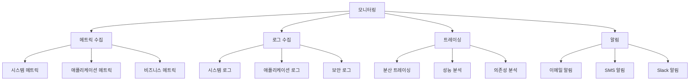
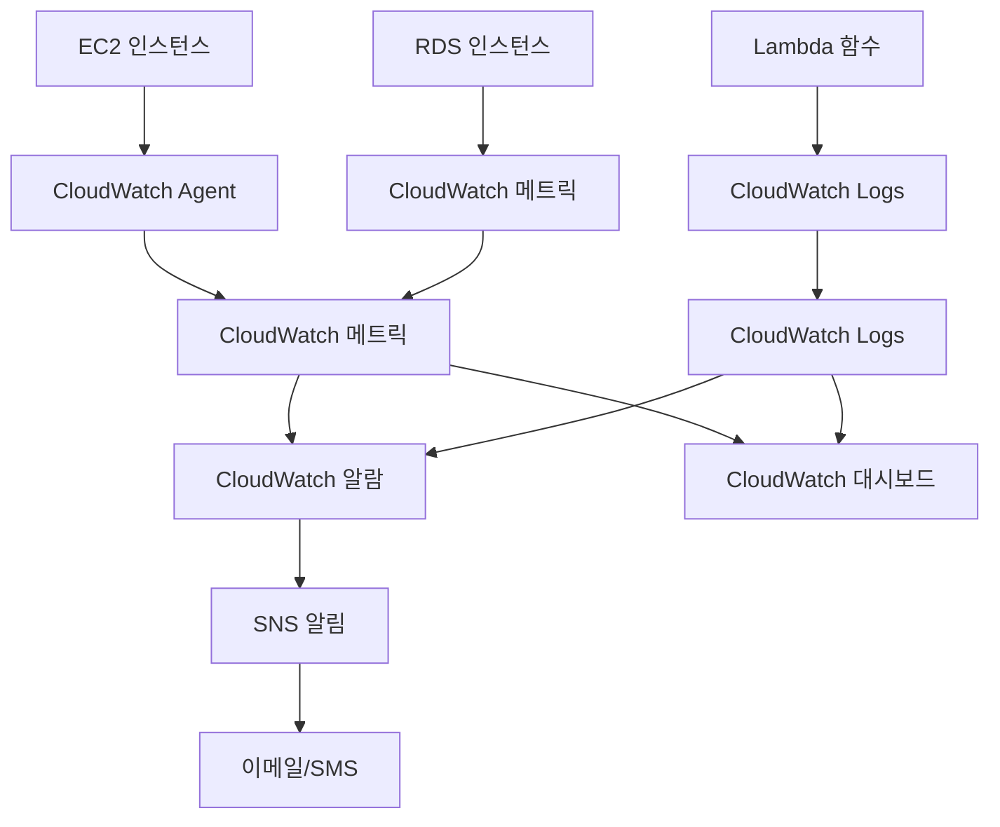
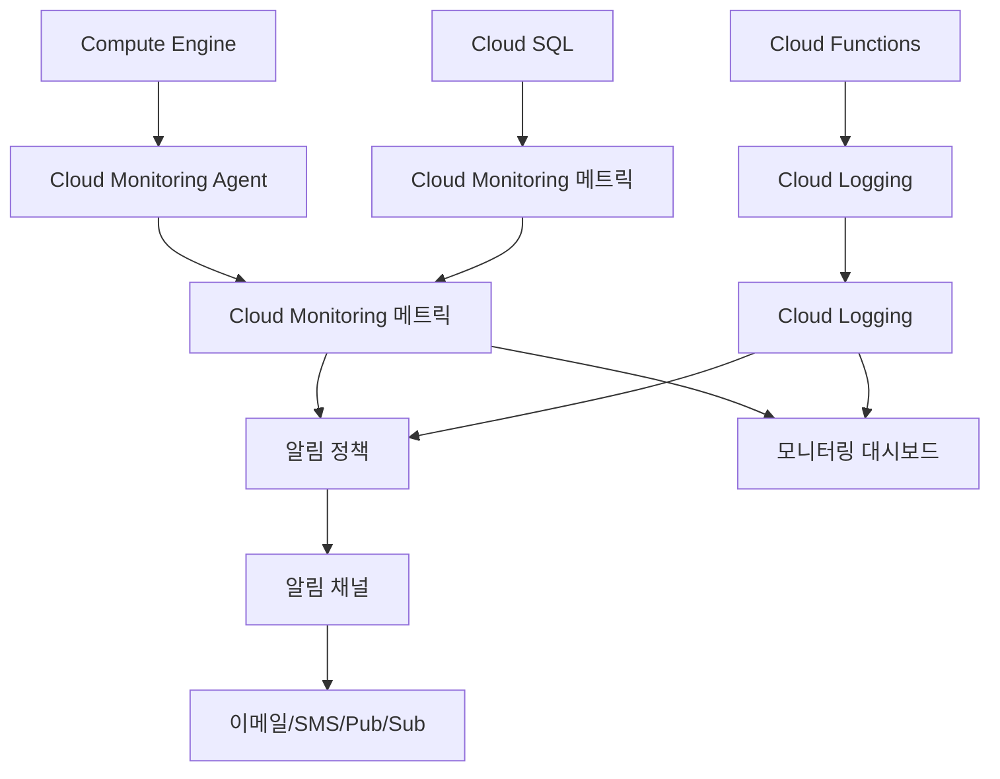
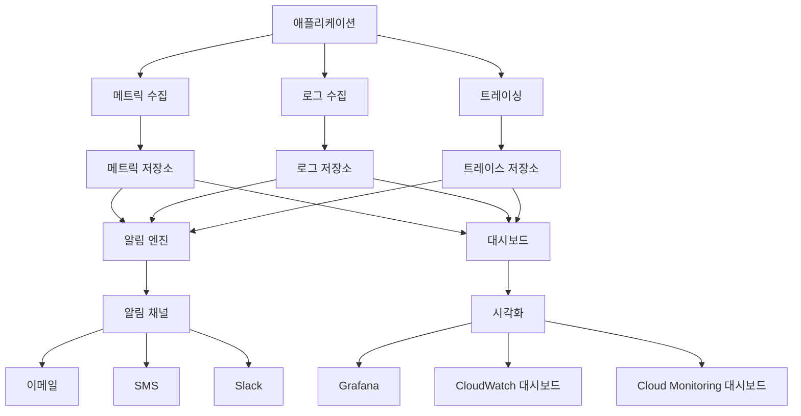

# 3교시: CloudWatch / Cloud Monitoring을 활용한 서비스 모니터링 실습


## 📋 목차

[📋 목차](#목차)
1. [모니터링 개념 이해](#모니터링-개념-이해)
2. [AWS CloudWatch vs GCP Cloud Monitoring 비교](#aws-cloudwatch-vs-gcp-cloud-monitoring-비교)
3. [모니터링 아키텍처](#모니터링-아키텍처)
4. [메트릭 및 로그 관리](#메트릭-및-로그-관리)
5. [알림 및 대시보드](#알림-및-대시보드)
6. [실습 목표](#실습-목표)
7. [실습 절차](#실습-절차)
8. [실습 코드 예시](#실습-코드-예시)
9. [예상 결과](#예상-결과)
10. [혼자 해보기](#혼자-해보기)

---

## 📊 모니터링 개념 이해

### 모니터링의 중요성

[모니터링의 중요성](#모니터링의-중요성)

서비스 안정성과 성능 유지를 위해 **모니터링은 필수**입니다. 클라우드 환경에서는 다양한 리소스와 서비스가 동시에 운영되므로 체계적인 모니터링이 더욱 중요합니다.

#### 1. **서비스 가용성 보장**

[1. **서비스 가용성 보장**](#1-서비스-가용성-보장)
- 장애 조기 감지 및 대응
- 서비스 중단 시간 최소화
- 사용자 경험 향상

#### 2. **성능 최적화**

[2. **성능 최적화**](#2-성능-최적화)
- 병목 지점 식별
- 리소스 사용률 최적화
- 응답 시간 개선

#### 3. **비용 관리**

[3. **비용 관리**](#3-비용-관리)
- 리소스 사용량 모니터링
- 비효율적인 리소스 식별
- 비용 최적화 기회 발견

#### 4. **보안 강화**

[4. **보안 강화**](#4-보안-강화)
- 비정상적인 활동 감지
- 보안 위협 조기 발견
- 컴플라이언스 준수

### 모니터링의 핵심 요소

[모니터링의 핵심 요소](#모니터링의-핵심-요소)



---

## ⚖️ AWS CloudWatch vs GCP Cloud Monitoring 비교

### 기본 기능 비교

[기본 기능 비교](#기본-기능-비교)

| 구분 | AWS CloudWatch | GCP Cloud Monitoring |
|------|----------------|---------------------|
| **메트릭 수집** | ✅ | ✅ |
| **로그 수집** | ✅ | ✅ |
| **알림** | ✅ | ✅ |
| **대시보드** | ✅ | ✅ |
| **트레이싱** | X-Ray | Cloud Trace |
| **에러 리포팅** | ❌ | Error Reporting |
| **프로파일링** | ❌ | Cloud Profiler |

### 메트릭 관리 비교

[메트릭 관리 비교](#메트릭-관리-비교)

#### AWS CloudWatch 메트릭

[AWS CloudWatch 메트릭](#aws-cloudwatch-메트릭)
- **네임스페이스**: AWS/EC2, AWS/RDS, Custom 등
- **메트릭 이름**: CPUUtilization, NetworkIn 등
- **차원**: InstanceId, AutoScalingGroupName 등
- **통계**: Average, Sum, Maximum, Minimum
- **보관 기간**: 15개월

#### GCP Cloud Monitoring 메트릭

[GCP Cloud Monitoring 메트릭](#gcp-cloud-monitoring-메트릭)
- **메트릭 타입**: compute.googleapis.com/instance/cpu/utilization
- **리소스 타입**: gce_instance, gke_container 등
- **라벨**: instance_name, zone 등
- **집계**: mean, sum, max, min
- **보관 기간**: 6주 (기본), 24개월 (확장)

### 로그 관리 비교

[로그 관리 비교](#로그-관리-비교)

#### AWS CloudWatch Logs

[AWS CloudWatch Logs](#aws-cloudwatch-logs)
- **로그 그룹**: 애플리케이션별 로그 그룹
- **로그 스트림**: 인스턴스별 로그 스트림
- **로그 필터**: CloudWatch Logs Insights
- **보관**: S3, Glacier로 아카이브

#### GCP Cloud Logging

[GCP Cloud Logging](#gcp-cloud-logging)
- **로그 이름**: 프로젝트별 로그
- **로그 엔트리**: 구조화된 로그 엔트리
- **로그 필터**: Cloud Logging 쿼리
- **보관**: Cloud Storage로 아카이브

### 모니터링 아키텍처 비교

[모니터링 아키텍처 비교](#모니터링-아키텍처-비교)

#### AWS CloudWatch 아키텍처

[AWS CloudWatch 아키텍처](#aws-cloudwatch-아키텍처)


#### GCP Cloud Monitoring 아키텍처

[GCP Cloud Monitoring 아키텍처](#gcp-cloud-monitoring-아키텍처)


---

## 🏗️ 모니터링 아키텍처

### 전체 모니터링 아키텍처

[전체 모니터링 아키텍처](#전체-모니터링-아키텍처)



### 모니터링 계층

[모니터링 계층](#모니터링-계층)

#### 1. **인프라 모니터링**

[1. **인프라 모니터링**](#1-인프라-모니터링)
- **시스템 메트릭**: CPU, 메모리, 디스크, 네트워크
- **가상 머신 상태**: 인스턴스 상태, 헬스체크
- **네트워크 모니터링**: 대역폭, 지연시간, 패킷 손실

#### 2. **애플리케이션 모니터링**

[2. **애플리케이션 모니터링**](#2-애플리케이션-모니터링)
- **애플리케이션 메트릭**: 응답 시간, 처리량, 에러율
- **비즈니스 메트릭**: 사용자 수, 주문 수, 매출
- **성능 모니터링**: APM, 트레이싱

#### 3. **보안 모니터링**

[3. **보안 모니터링**](#3-보안-모니터링)
- **보안 이벤트**: 로그인 시도, 권한 변경
- **위협 감지**: 비정상적인 활동, 침입 시도
- **컴플라이언스**: 규정 준수 모니터링

---

## 📈 메트릭 및 로그 관리

### 메트릭 수집

[메트릭 수집](#메트릭-수집)

#### AWS CloudWatch 메트릭

[AWS CloudWatch 메트릭](#aws-cloudwatch-메트릭)
```bash
# 기본 메트릭 (자동 수집)
- CPUUtilization
- NetworkIn/NetworkOut
- DiskReadOps/DiskWriteOps
- StatusCheckFailed

# 커스텀 메트릭 (수동 수집)
aws cloudwatch put-metric-data /
  --namespace "MyApp" /
  --metric-data MetricName=ActiveUsers,Value=150,Unit=Count
```

#### GCP Cloud Monitoring 메트릭

[GCP Cloud Monitoring 메트릭](#gcp-cloud-monitoring-메트릭)
```bash
# 기본 메트릭 (자동 수집)
- compute.googleapis.com/instance/cpu/utilization
- compute.googleapis.com/instance/disk/read_bytes_count
- compute.googleapis.com/instance/network/received_bytes_count

# 커스텀 메트릭 (수동 수집)
gcloud logging write my-app-log /
  --payload-type=json /
  '{"message": "Active users: 150", "severity": "INFO"}'
```

### 로그 수집

[로그 수집](#로그-수집)

#### AWS CloudWatch Logs

[AWS CloudWatch Logs](#aws-cloudwatch-logs)
```bash
# 로그 그룹 생성
aws logs create-log-group --log-group-name /aws/ec2/my-app

# 로그 스트림 생성
aws logs create-log-stream /
  --log-group-name /aws/ec2/my-app /
  --log-stream-name i-1234567890abcdef0

# 로그 이벤트 전송
aws logs put-log-events /
  --log-group-name /aws/ec2/my-app /
  --log-stream-name i-1234567890abcdef0 /
  --log-events timestamp=1640995200000,message="Application started"
```

#### GCP Cloud Logging

[GCP Cloud Logging](#gcp-cloud-logging)
```bash
# 로그 전송
gcloud logging write my-app-log /
  --payload-type=json /
  '{"message": "Application started", "severity": "INFO", "timestamp": "2024-01-01T00:00:00Z"}'

# 로그 쿼리
gcloud logging read "resource.type=gce_instance AND severity>=ERROR" /
  --limit=100 /
  --format="table(timestamp,resource.labels.instance_name,severity,textPayload)"
```

---

## 🚨 알림 및 대시보드

### 알림 설정

[알림 설정](#알림-설정)

#### AWS CloudWatch 알람

[AWS CloudWatch 알람](#aws-cloudwatch-알람)
```bash
# CPU 사용률 알람 생성
aws cloudwatch put-metric-alarm /
  --alarm-name "HighCPUAlarm" /
  --alarm-description "High CPU usage detected" /
  --metric-name CPUUtilization /
  --namespace AWS/EC2 /
  --statistic Average /
  --period 300 /
  --threshold 80 /
  --comparison-operator GreaterThanThreshold /
  --evaluation-periods 2 /
  --alarm-actions arn:aws:sns:us-east-1:123456789012:MyTopic

# SNS 토픽 생성
aws sns create-topic --name MyTopic

# 이메일 구독
aws sns subscribe /
  --topic-arn arn:aws:sns:us-east-1:123456789012:MyTopic /
  --protocol email /
  --notification-endpoint admin@example.com
```

#### GCP Cloud Monitoring 알림

[GCP Cloud Monitoring 알림](#gcp-cloud-monitoring-알림)
```bash
# 알림 정책 생성
gcloud monitoring policies create /
  --notification-channels=projects/my-project/notificationChannels/123 /
  --display-name="High CPU Alert" /
  --conditions='displayName=High CPU, conditionThreshold={filter="metric.type=/"compute.googleapis.com/instance/cpu/utilization/"", comparison=COMPARISON_GT, thresholdValue=0.8, duration="300s"}'

# 알림 채널 생성
gcloud monitoring channels create /
  --display-name="Email Alert" /
  --type=email /
  --channel-labels=email_address=admin@example.com
```

### 대시보드 생성

[대시보드 생성](#대시보드-생성)

#### AWS CloudWatch 대시보드

[AWS CloudWatch 대시보드](#aws-cloudwatch-대시보드)
```bash
# 대시보드 생성
aws cloudwatch put-dashboard /
  --dashboard-name "MyAppDashboard" /
  --dashboard-body '{
    "widgets": [
      {
        "type": "metric",
        "properties": {
          "metrics": [
            ["AWS/EC2", "CPUUtilization"],
            ["AWS/EC2", "NetworkIn"],
            ["AWS/EC2", "NetworkOut"]
          ],
          "period": 300,
          "stat": "Average",
          "region": "us-east-1",
          "title": "EC2 Metrics"
        }
      }
    ]
  }'
```

#### GCP Cloud Monitoring 대시보드

[GCP Cloud Monitoring 대시보드](#gcp-cloud-monitoring-대시보드)
```bash
# 대시보드 생성
gcloud monitoring dashboards create /
  --config-from-file=dashboard-config.yaml

# 대시보드 설정 파일
cat > dashboard-config.yaml << 'EOF'
displayName: "My App Dashboard"
mosaicLayout:
  tiles:
    - width: 6
      height: 4
      widget:
        title: "CPU Utilization"
        xyChart:
          dataSets:
            - timeSeriesQuery:
                timeSeriesFilter:
                  filter: "metric.type=/"compute.googleapis.com/instance/cpu/utilization/""
                  aggregation:
                    alignmentPeriod: "300s"
                    perSeriesAligner: ALIGN_MEAN
EOF
```

---

## 🎯 실습 목표

이 실습을 통해 다음을 달성합니다:

1. **모니터링 설정**: AWS CloudWatch와 GCP Cloud Monitoring을 설정합니다.

2. **메트릭 수집**: 시스템 및 애플리케이션 메트릭을 수집합니다.

3. **알림 구성**: 임계값 기반 알림을 설정합니다.

4. **대시보드 구축**: 실시간 모니터링 대시보드를 구축합니다.

---

## 📝 실습 절차

### 1단계: 모니터링 환경 준비

[1단계: 모니터링 환경 준비](#1단계-모니터링-환경-준비)

#### AWS CloudWatch Agent 설치

[AWS CloudWatch Agent 설치](#aws-cloudwatch-agent-설치)
```bash
# CloudWatch Agent 다운로드 및 설치
wget https:///s3.amazonaws.com/amazoncloudwatch-agent/amazon_linux/amd64/latest/amazon-cloudwatch-agent.rpm
sudo rpm -U ./amazon-cloudwatch-agent.rpm

# CloudWatch Agent 설정
sudo /opt/aws/amazon-cloudwatch-agent/bin/amazon-cloudwatch-agent-config-wizard

# CloudWatch Agent 시작
sudo systemctl start amazon-cloudwatch-agent
sudo systemctl enable amazon-cloudwatch-agent
```

#### GCP Cloud Monitoring Agent 설치

[GCP Cloud Monitoring Agent 설치](#gcp-cloud-monitoring-agent-설치)
```bash
# Cloud Monitoring Agent 설치
curl -sSO https:///dl.google.com/cloudagents/add-google-cloud-ops-agent-repo.sh
sudo bash add-google-cloud-ops-agent-repo.sh --also-install

# Ops Agent 시작
sudo systemctl start google-cloud-ops-agent
sudo systemctl enable google-cloud-ops-agent
```

### 2단계: 기본 메트릭 확인

[2단계: 기본 메트릭 확인](#2단계-기본-메트릭-확인)

#### AWS CloudWatch 메트릭 확인

[AWS CloudWatch 메트릭 확인](#aws-cloudwatch-메트릭-확인)
```bash
# EC2 인스턴스 메트릭 조회
aws cloudwatch get-metric-statistics /
  --namespace AWS/EC2 /
  --metric-name CPUUtilization /
  --dimensions Name=InstanceId,Value=i-1234567890abcdef0 /
  --start-time 2024-01-01T00:00:00Z /
  --end-time 2024-01-01T23:59:59Z /
  --period 300 /
  --statistics Average

# 메트릭 목록 조회
aws cloudwatch list-metrics /
  --namespace AWS/EC2 /
  --query "Metrics[].{MetricName:MetricName,Dimensions:Dimensions}"
```

#### GCP Cloud Monitoring 메트릭 확인

[GCP Cloud Monitoring 메트릭 확인](#gcp-cloud-monitoring-메트릭-확인)
```bash
# VM 인스턴스 메트릭 조회
gcloud monitoring metrics list /
  --filter="metric.type:compute.googleapis.com/instance/cpu/utilization" /
  --format="table(metric.type,metric.labels)"

# 메트릭 데이터 조회
gcloud monitoring metrics list /
  --filter="resource.type=gce_instance" /
  --limit=50
```

### 3단계: 커스텀 메트릭 생성

[3단계: 커스텀 메트릭 생성](#3단계-커스텀-메트릭-생성)

#### AWS 커스텀 메트릭

[AWS 커스텀 메트릭](#aws-커스텀-메트릭)
```bash
# 커스텀 메트릭 전송
aws cloudwatch put-metric-data /
  --namespace "MyApp" /
  --metric-data MetricName=ActiveUsers,Value=150,Unit=Count

# 커스텀 메트릭 조회
aws cloudwatch get-metric-statistics /
  --namespace MyApp /
  --metric-name ActiveUsers /
  --start-time 2024-01-01T00:00:00Z /
  --end-time 2024-01-01T23:59:59Z /
  --period 300 /
  --statistics Sum
```

#### GCP 커스텀 메트릭

[GCP 커스텀 메트릭](#gcp-커스텀-메트릭)
```bash
# 커스텀 메트릭 전송
gcloud logging write my-app-log /
  --payload-type=json /
  '{"message": "Active users: 150", "severity": "INFO", "custom_metric": {"name": "active_users", "value": 150}}'

# 커스텀 메트릭 조회
gcloud logging read "resource.type=gce_instance AND jsonPayload.custom_metric.name=/"active_users/"" /
  --limit=100 /
  --format="table(timestamp,jsonPayload.custom_metric.value)"
```

### 4단계: 알림 설정

[4단계: 알림 설정](#4단계-알림-설정)

#### AWS CloudWatch 알람 설정

[AWS CloudWatch 알람 설정](#aws-cloudwatch-알람-설정)
```bash
# SNS 토픽 생성
aws sns create-topic --name MyAppAlerts

# 이메일 구독
aws sns subscribe /
  --topic-arn arn:aws:sns:us-east-1:123456789012:MyAppAlerts /
  --protocol email /
  --notification-endpoint admin@example.com

# CPU 사용률 알람 생성
aws cloudwatch put-metric-alarm /
  --alarm-name "HighCPUAlarm" /
  --alarm-description "High CPU usage detected" /
  --metric-name CPUUtilization /
  --namespace AWS/EC2 /
  --statistic Average /
  --period 300 /
  --threshold 80 /
  --comparison-operator GreaterThanThreshold /
  --evaluation-periods 2 /
  --alarm-actions arn:aws:sns:us-east-1:123456789012:MyAppAlerts

# 메모리 사용률 알람 생성
aws cloudwatch put-metric-alarm /
  --alarm-name "HighMemoryAlarm" /
  --alarm-description "High memory usage detected" /
  --metric-name MemoryUtilization /
  --namespace System/Linux /
  --statistic Average /
  --period 300 /
  --threshold 85 /
  --comparison-operator GreaterThanThreshold /
  --evaluation-periods 2 /
  --alarm-actions arn:aws:sns:us-east-1:123456789012:MyAppAlerts
```

#### GCP Cloud Monitoring 알림 설정

[GCP Cloud Monitoring 알림 설정](#gcp-cloud-monitoring-알림-설정)
```bash
# 알림 채널 생성
gcloud monitoring channels create /
  --display-name="Email Alert" /
  --type=email /
  --channel-labels=email_address=admin@example.com

# CPU 사용률 알림 정책 생성
gcloud monitoring policies create /
  --notification-channels=projects/my-project/notificationChannels/123 /
  --display-name="High CPU Alert" /
  --conditions='displayName=High CPU, conditionThreshold={filter="metric.type=/"compute.googleapis.com/instance/cpu/utilization/"", comparison=COMPARISON_GT, thresholdValue=0.8, duration="300s"}'

# 메모리 사용률 알림 정책 생성
gcloud monitoring policies create /
  --notification-channels=projects/my-project/notificationChannels/123 /
  --display-name="High Memory Alert" /
  --conditions='displayName=High Memory, conditionThreshold={filter="metric.type=/"compute.googleapis.com/instance/memory/utilization/"", comparison=COMPARISON_GT, thresholdValue=0.85, duration="300s"}'
```

### 5단계: 대시보드 구축

[5단계: 대시보드 구축](#5단계-대시보드-구축)

#### AWS CloudWatch 대시보드

[AWS CloudWatch 대시보드](#aws-cloudwatch-대시보드)
```bash
# 대시보드 생성
aws cloudwatch put-dashboard /
  --dashboard-name "MyAppDashboard" /
  --dashboard-body '{
    "widgets": [
      {
        "type": "metric",
        "properties": {
          "metrics": [
            ["AWS/EC2", "CPUUtilization"],
            ["AWS/EC2", "NetworkIn"],
            ["AWS/EC2", "NetworkOut"]
          ],
          "period": 300,
          "stat": "Average",
          "region": "us-east-1",
          "title": "EC2 Metrics"
        }
      },
      {
        "type": "metric",
        "properties": {
          "metrics": [
            ["MyApp", "ActiveUsers"]
          ],
          "period": 300,
          "stat": "Sum",
          "region": "us-east-1",
          "title": "Application Metrics"
        }
      }
    ]
  }'
```

#### GCP Cloud Monitoring 대시보드

[GCP Cloud Monitoring 대시보드](#gcp-cloud-monitoring-대시보드)
```bash
# 대시보드 생성
gcloud monitoring dashboards create /
  --config-from-file=dashboard-config.yaml

# 대시보드 설정 파일
cat > dashboard-config.yaml << 'EOF'
displayName: "My App Dashboard"
mosaicLayout:
  tiles:
    - width: 6
      height: 4
      widget:
        title: "CPU Utilization"
        xyChart:
          dataSets:
            - timeSeriesQuery:
                timeSeriesFilter:
                  filter: "metric.type=/"compute.googleapis.com/instance/cpu/utilization/""
                  aggregation:
                    alignmentPeriod: "300s"
                    perSeriesAligner: ALIGN_MEAN
    - width: 6
      height: 4
      widget:
        title: "Memory Utilization"
        xyChart:
          dataSets:
            - timeSeriesQuery:
                timeSeriesFilter:
                  filter: "metric.type=/"compute.googleapis.com/instance/memory/utilization/""
                  aggregation:
                    alignmentPeriod: "300s"
                    perSeriesAligner: ALIGN_MEAN
EOF
```

---

## 💻 실습 코드 예시

### AWS 모니터링 스크립트

[AWS 모니터링 스크립트](#aws-모니터링-스크립트)

#### 메트릭 수집 및 알림 스크립트

[메트릭 수집 및 알림 스크립트](#메트릭-수집-및-알림-스크립트)
```bash
#!/bin/bash
# aws-monitoring-setup.sh

echo "=== AWS 모니터링 설정 시작 ==="

# 1. SNS 토픽 생성
echo "1. SNS 토픽 생성"
TOPIC_ARN=$(aws sns create-topic --name MyAppAlerts --query 'TopicArn' --output text)
echo "SNS Topic ARN: $TOPIC_ARN"

# 2. 이메일 구독
echo "2. 이메일 구독"
aws sns subscribe /
  --topic-arn $TOPIC_ARN /
  --protocol email /
  --notification-endpoint admin@example.com

# 3. CPU 사용률 알람 생성
echo "3. CPU 사용률 알람 생성"
aws cloudwatch put-metric-alarm /
  --alarm-name "HighCPUAlarm" /
  --alarm-description "High CPU usage detected" /
  --metric-name CPUUtilization /
  --namespace AWS/EC2 /
  --statistic Average /
  --period 300 /
  --threshold 80 /
  --comparison-operator GreaterThanThreshold /
  --evaluation-periods 2 /
  --alarm-actions $TOPIC_ARN

# 4. 메모리 사용률 알람 생성
echo "4. 메모리 사용률 알람 생성"
aws cloudwatch put-metric-alarm /
  --alarm-name "HighMemoryAlarm" /
  --alarm-description "High memory usage detected" /
  --metric-name MemoryUtilization /
  --namespace System/Linux /
  --statistic Average /
  --period 300 /
  --threshold 85 /
  --comparison-operator GreaterThanThreshold /
  --evaluation-periods 2 /
  --alarm-actions $TOPIC_ARN

# 5. 대시보드 생성
echo "5. 대시보드 생성"
aws cloudwatch put-dashboard /
  --dashboard-name "MyAppDashboard" /
  --dashboard-body '{
    "widgets": [
      {
        "type": "metric",
        "properties": {
          "metrics": [
            ["AWS/EC2", "CPUUtilization"],
            ["AWS/EC2", "NetworkIn"],
            ["AWS/EC2", "NetworkOut"]
          ],
          "period": 300,
          "stat": "Average",
          "region": "us-east-1",
          "title": "EC2 Metrics"
        }
      }
    ]
  }'

echo "=== AWS 모니터링 설정 완료 ==="
```

#### 커스텀 메트릭 전송 스크립트

[커스텀 메트릭 전송 스크립트](#커스텀-메트릭-전송-스크립트)
```bash
#!/bin/bash
# aws-custom-metrics.sh

echo "=== AWS 커스텀 메트릭 전송 시작 ==="

# 1. 활성 사용자 수 메트릭 전송
ACTIVE_USERS=$(curl -s http://localhost/api/users/active | jq '.count')
aws cloudwatch put-metric-data /
  --namespace "MyApp" /
  --metric-data MetricName=ActiveUsers,Value=$ACTIVE_USERS,Unit=Count

# 2. 응답 시간 메트릭 전송
RESPONSE_TIME=$(curl -s -w "%{time_total}" -o /dev/null http://localhost/api/health)
aws cloudwatch put-metric-data /
  --namespace "MyApp" /
  --metric-data MetricName=ResponseTime,Value=$RESPONSE_TIME,Unit=Seconds

# 3. 에러율 메트릭 전송
ERROR_RATE=$(curl -s http://localhost/api/metrics/errors | jq '.rate')
aws cloudwatch put-metric-data /
  --namespace "MyApp" /
  --metric-data MetricName=ErrorRate,Value=$ERROR_RATE,Unit=Percent

echo "=== AWS 커스텀 메트릭 전송 완료 ==="
```

### GCP 모니터링 스크립트

[GCP 모니터링 스크립트](#gcp-모니터링-스크립트)

#### 메트릭 수집 및 알림 스크립트

[메트릭 수집 및 알림 스크립트](#메트릭-수집-및-알림-스크립트)
```bash
#!/bin/bash
# gcp-monitoring-setup.sh

echo "=== GCP 모니터링 설정 시작 ==="

# 1. 알림 채널 생성
echo "1. 알림 채널 생성"
CHANNEL_ID=$(gcloud monitoring channels create /
  --display-name="Email Alert" /
  --type=email /
  --channel-labels=email_address=admin@example.com /
  --format="value(name)" | cut -d'/' -f4)
echo "Notification Channel ID: $CHANNEL_ID"

# 2. CPU 사용률 알림 정책 생성
echo "2. CPU 사용률 알림 정책 생성"
gcloud monitoring policies create /
  --notification-channels=projects/$PROJECT_ID/notificationChannels/$CHANNEL_ID /
  --display-name="High CPU Alert" /
  --conditions='displayName=High CPU, conditionThreshold={filter="metric.type=/"compute.googleapis.com/instance/cpu/utilization/"", comparison=COMPARISON_GT, thresholdValue=0.8, duration="300s"}'

# 3. 메모리 사용률 알림 정책 생성
echo "3. 메모리 사용률 알림 정책 생성"
gcloud monitoring policies create /
  --notification-channels=projects/$PROJECT_ID/notificationChannels/$CHANNEL_ID /
  --display-name="High Memory Alert" /
  --conditions='displayName=High Memory, conditionThreshold={filter="metric.type=/"compute.googleapis.com/instance/memory/utilization/"", comparison=COMPARISON_GT, thresholdValue=0.85, duration="300s"}'

# 4. 대시보드 생성
echo "4. 대시보드 생성"
gcloud monitoring dashboards create /
  --config-from-file=dashboard-config.yaml

echo "=== GCP 모니터링 설정 완료 ==="
```

#### 커스텀 메트릭 전송 스크립트

[커스텀 메트릭 전송 스크립트](#커스텀-메트릭-전송-스크립트)
```bash
#!/bin/bash
# gcp-custom-metrics.sh

echo "=== GCP 커스텀 메트릭 전송 시작 ==="

# 1. 활성 사용자 수 메트릭 전송
ACTIVE_USERS=$(curl -s http://localhost/api/users/active | jq '.count')
gcloud logging write my-app-log /
  --payload-type=json /
  "{/"message/": /"Active users: $ACTIVE_USERS/", /"severity/": /"INFO/", /"custom_metric/": {/"name/": /"active_users/", /"value/": $ACTIVE_USERS}}"

# 2. 응답 시간 메트릭 전송
RESPONSE_TIME=$(curl -s -w "%{time_total}" -o /dev/null http://localhost/api/health)
gcloud logging write my-app-log /
  --payload-type=json /
  "{/"message/": /"Response time: $RESPONSE_TIME/", /"severity/": /"INFO/", /"custom_metric/": {/"name/": /"response_time/", /"value/": $RESPONSE_TIME}}"

# 3. 에러율 메트릭 전송
ERROR_RATE=$(curl -s http://localhost/api/metrics/errors | jq '.rate')
gcloud logging write my-app-log /
  --payload-type=json /
  "{/"message/": /"Error rate: $ERROR_RATE/", /"severity/": /"INFO/", /"custom_metric/": {/"name/": /"error_rate/", /"value/": $ERROR_RATE}}"

echo "=== GCP 커스텀 메트릭 전송 완료 ==="
```

---

## ✅ 예상 결과

### 모니터링 설정 결과

[모니터링 설정 결과](#모니터링-설정-결과)
- CloudWatch/Cloud Monitoring에서 시스템 메트릭이 실시간으로 수집됨
- 커스텀 메트릭이 정상적으로 전송되고 표시됨
- 알림 정책이 설정되어 임계값 초과 시 알림 발송

### 알림 테스트 결과

[알림 테스트 결과](#알림-테스트-결과)
- CPU 사용률 80% 초과 시 이메일 알림 발송
- 메모리 사용률 85% 초과 시 이메일 알림 발송
- 알림 내용에 상세한 메트릭 정보 포함

### 대시보드 결과

[대시보드 결과](#대시보드-결과)
- 실시간 메트릭 그래프가 대시보드에 표시
- 여러 메트릭을 한 화면에서 모니터링 가능
- 과거 데이터와 현재 데이터 비교 가능

---

## 🚀 혼자 해보기

### 기본 과제

[기본 과제](#기본-과제)
1. **다양한 메트릭 추가**: 애플리케이션별 커스텀 메트릭을 추가해 보세요.

2. **알림 정책 세분화**: 더 정교한 알림 정책을 설정해 보세요.

3. **대시보드 커스터마이징**: 비즈니스 요구사항에 맞는 대시보드를 구축해 보세요.

### 고급 과제

[고급 과제](#고급-과제)
1. **로그 기반 알림**: 로그 패턴을 기반으로 한 알림을 설정해 보세요.

2. **멀티 클라우드 모니터링**: AWS와 GCP를 통합 모니터링하는 시스템을 구축해 보세요.

3. **자동화된 응답**: 알림 발생 시 자동으로 대응하는 시스템을 구축해 보세요.

---

## ❓ 퀴즈

[❓ 퀴즈](#퀴즈)

1. **AWS CloudWatch와 GCP Cloud Monitoring의 가장 큰 차이점은 무엇인가요?**

2. **각 서비스에서 기본 제공되는 모니터링 지표와 커스텀 지표 수집 방식을 비교해 보세요.**

3. **알림 정책에서 임계값과 평가 기간을 설정하는 이유는 무엇인가요?**

4. **대시보드에서 여러 메트릭을 동시에 모니터링하는 장점은 무엇인가요?**

---

## ✅ 체크리스트

[✅ 체크리스트](#체크리스트)

- [ ] 모니터링할 리소스(EC2/GCE)를 생성했나요?
- [ ] CloudWatch/Monitoring에서 지표를 확인했나요?
- [ ] 임계치 알람을 생성하고 테스트했나요?
- [ ] 로그 기반 알람도 설정해 보셨나요?
- [ ] 대시보드를 구축하고 실시간 모니터링을 확인했나요?
- [ ] 커스텀 메트릭을 전송하고 표시했나요?

---

## 📚 추가 학습 자료

[📚 추가 학습 자료](#추가-학습-자료)

- [AWS CloudWatch 공식 문서](https:///docs.aws.amazon.com/cloudwatch/)
- [GCP Cloud Monitoring 공식 문서](https:///cloud.google.com/monitoring/docs)
- [모니터링 모범 사례](https:///aws.amazon.com/architecture/well-architected/)
- [알림 및 대시보드 가이드](https:///cloud.google.com/monitoring/alerts)

다음 단계: [4교시: 종합 실습 - 컨테이너 자동 배포 + 로드밸런싱 + 오토스케일링](/mcp_knowledge_base/cloud_container/textbook/Day1/comprehensive-practice-guide.md)

---


---


### 📧 연락처

[📧 연락처](#연락처)
- **이메일**: inhwan.jung@gmail.com
- **GitHub**: [프로젝트 저장소](https:///github.com/jungfrau70/aws_gcp.git)

---


<div align="center">

[← 이전: Cloud Master 2일차 메인](/mcp_knowledge_base/README.md) | [📚 전체 커리큘럼](/mcp_knowledge_base/curriculum.md) | [🏠 학습 경로로 돌아가기](/mcp_knowledge_base/index.md) | [📋 학습 경로](/mcp_knowledge_base/learning-path.md) | [다음: 종합 실습 가이드 →](/mcp_knowledge_base/cloud_container/textbook/Day1/comprehensive-practice-guide.md)

</div>