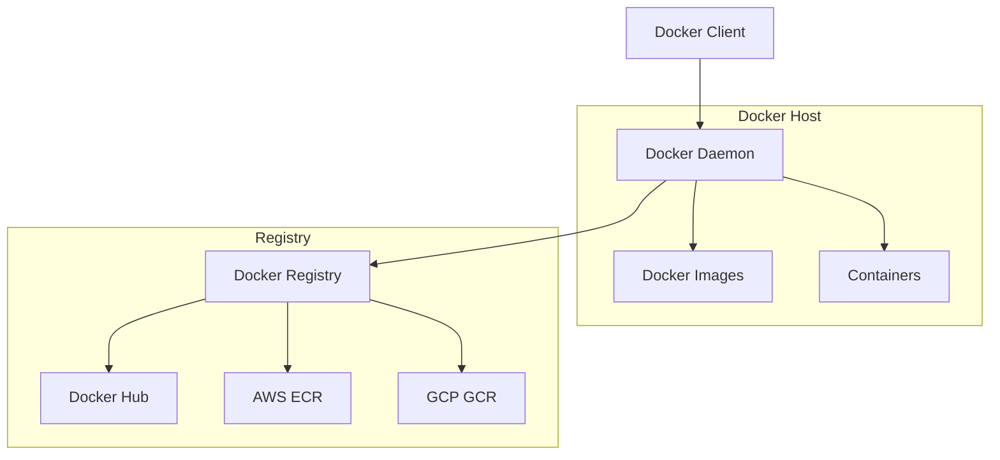

# 1교시: Docker 개념과 Compose 실습

<div align="center">

[← 이전: Cloud Master 메인](../../README.md) | [📚 전체 커리큘럼](../../curriculum.md) | [🏠 학습 경로로 돌아가기](../../index.md) | [📋 학습 경로](../../learning-path.md)

</div>

## 📋 목차
1. [Docker 개념 이해](#docker-개념-이해)
2. [Docker vs VM 비교](#docker-vs-vm-비교)
3. [Docker 아키텍처](#docker-아키텍처)
4. [Docker Compose 이해](#docker-compose-이해)
5. [실습 목표](#실습-목표)
6. [실습 절차](#실습-절차)
7. [실습 코드 예시](#실습-코드-예시)
8. [예상 결과](#예상-결과)
9. [혼자 해보기](#혼자-해보기)

---

## 🐳 Docker 개념 이해

### Docker란?

Docker는 **컨테이너 기반의 가상화 플랫폼**으로, 애플리케이션을 실행하는 데 필요한 코드와 라이브러리, 설정 등을 하나의 경량 패키지(컨테이너)로 묶습니다.

### 컨테이너의 특징

- **경량화**: 호스트 OS의 커널을 공유하여 VM보다 훨씬 적은 리소스로 동작
- **격리**: 애플리케이션 간 완전한 격리된 실행 환경 제공
- **이식성**: "어디서든 동일하게 실행" - 개발, 테스트, 프로덕션 환경에서 동일한 결과
- **확장성**: 마이크로서비스 아키텍처에 최적화

### Docker의 핵심 구성요소

- **Docker 데몬(Docker Daemon)**: 컨테이너 실행, 이미지 관리 등을 수행
- **Docker 클라이언트(Docker CLI)**: 사용자 명령어를 데몬에 전달
- **Docker 레지스트리**: 컨테이너 이미지를 저장·배포 (Docker Hub, AWS ECR, GCP GCR)

---

## 🔄 Docker vs VM 비교

| 구분 | Docker (컨테이너) | VM (가상머신) |
|------|------------------|---------------|
| **리소스 사용량** | 적음 (호스트 OS 공유) | 많음 (독립 OS) |
| **시작 시간** | 빠름 (초 단위) | 느림 (분 단위) |
| **격리 수준** | 프로세스 레벨 | 하드웨어 레벨 |
| **이식성** | 높음 | 낮음 |
| **보안** | 중간 | 높음 |
| **관리 복잡도** | 낮음 | 높음 |
| **확장성** | 높음 | 중간 |

### 장단점 비교

#### Docker (컨테이너) 장점
- ✅ 빠른 시작 시간
- ✅ 낮은 리소스 사용량
- ✅ 높은 이식성
- ✅ 마이크로서비스에 적합

#### Docker (컨테이너) 단점
- ❌ 호스트 OS에 의존
- ❌ 보안 격리가 VM보다 약함
- ❌ Windows/Mac에서 성능 오버헤드

#### VM 장점
- ✅ 완전한 격리
- ✅ 높은 보안성
- ✅ 다양한 OS 지원

#### VM 단점
- ❌ 높은 리소스 사용량
- ❌ 느린 시작 시간
- ❌ 복잡한 관리

---

## 🏗️ Docker 아키텍처



### 구성요소 설명

#### 1. Docker Client
- 사용자가 Docker 명령어를 입력하는 인터페이스
- `docker run`, `docker build` 등의 명령어 실행

#### 2. Docker Daemon
- Docker 엔진의 핵심 구성요소
- 컨테이너 생성, 실행, 관리
- 이미지 빌드, 저장, 관리

#### 3. Docker Images
- 컨테이너를 생성하기 위한 템플릿
- 읽기 전용 레이어들의 집합
- Dockerfile로 생성

#### 4. Containers
- 이미지를 실행한 인스턴스
- 실행 중인 애플리케이션
- 독립적인 실행 환경

#### 5. Docker Registry
- Docker 이미지를 저장하고 배포하는 서비스
- 공개: Docker Hub
- 사설: AWS ECR, GCP GCR, Azure ACR

---

## 🎼 Docker Compose 이해

### Docker Compose란?

Docker Compose는 **다중 컨테이너 애플리케이션을 간편하게 관리**해 주는 도구입니다. 여러 서비스(컨테이너)로 구성된 애플리케이션을 하나의 YAML 파일(`docker-compose.yml`)에 정의하고, 단일 명령으로 모든 컨테이너를 동시에 시작/중지할 수 있습니다.

### Docker Compose의 장점

- **간편한 관리**: 복잡한 설정을 간단한 파일로 관리
- **일괄 처리**: `docker-compose up/down`으로 모든 서비스 관리
- **환경 일관성**: 개발, 테스트, 프로덕션 환경에서 동일한 설정
- **의존성 관리**: 서비스 간 의존성 자동 처리

### Docker Compose vs Docker 명령어

| 작업 | Docker 명령어 | Docker Compose |
|------|---------------|----------------|
| **서비스 시작** | `docker run` (각각) | `docker-compose up` (일괄) |
| **서비스 중지** | `docker stop` (각각) | `docker-compose down` (일괄) |
| **네트워크 설정** | 복잡한 명령어 | YAML 파일에 간단 정의 |
| **볼륨 마운트** | `-v` 옵션 | YAML 파일에 정의 |
| **환경변수** | `-e` 옵션 | YAML 파일에 정의 |

---

## 🎯 실습 목표

이 실습을 통해 다음을 달성합니다:

1. **Docker 컨테이너 이해**: Docker 이미지와 컨테이너의 개념을 익히고, 간단한 컨테이너를 실행해 봅니다.

2. **Docker Compose 이해**: Docker Compose로 다중 컨테이너 서비스를 정의하고, `docker-compose up/down` 명령으로 애플리케이션을 기동/종료해 봅니다.

3. **실제 애플리케이션 배포**: 웹 애플리케이션과 데이터베이스를 포함한 완전한 스택을 Docker로 배포해 봅니다.

---

## 📝 실습 절차

### 1단계: Docker 설치 확인

#### Docker 설치 상태 확인
```bash
# Docker 버전 확인
docker --version

# Docker 데몬 상태 확인
docker info

# 간단한 컨테이너 실행 테스트
docker run hello-world
```

**예상 결과:**
```
Hello from Docker!
This message shows that your installation appears to be working correctly.
```

### 2단계: 간단한 컨테이너 실행

#### Nginx 웹 서버 실행
```bash
# Nginx 컨테이너 실행 (백그라운드)
docker run -d -p 80:80 --name my-nginx nginx

# 실행 중인 컨테이너 확인
docker ps

# 웹 브라우저에서 http://localhost 접속 확인
```

#### 컨테이너 관리 명령어
```bash
# 컨테이너 중지
docker stop my-nginx

# 컨테이너 시작
docker start my-nginx

# 컨테이너 삭제
docker rm my-nginx
```

### 3단계: Dockerfile 작성 및 이미지 빌드

#### 프로젝트 구조 생성
```bash
# 프로젝트 디렉토리 생성
mkdir my-app
cd my-app

# 간단한 Node.js 애플리케이션 생성
```

#### package.json 생성
```json
{
  "name": "my-app",
  "version": "1.0.0",
  "description": "Simple Node.js app",
  "main": "app.js",
  "scripts": {
    "start": "node app.js"
  },
  "dependencies": {
    "express": "^4.18.2"
  }
}
```

#### app.js 생성
```javascript
const express = require('express');
const app = express();
const port = 3000;

app.get('/', (req, res) => {
  res.send(`
    <h1>Hello Docker!</h1>
    <p>This is a simple Node.js app running in a Docker container.</p>
    <p>Current time: ${new Date().toISOString()}</p>
  `);
});

app.listen(port, () => {
  console.log(`App running at http://localhost:${port}`);
});
```

#### Dockerfile 작성
```dockerfile
# Node.js 18 버전을 베이스 이미지로 사용
FROM node:18

# 작업 디렉토리 설정
WORKDIR /app

# 패키지 파일 복사 (캐시 최적화를 위해 의존성 설치를 먼저)
COPY package*.json ./

# 의존성 설치
RUN npm install

# 소스 코드 복사
COPY . .

# 포트 3000 노출
EXPOSE 3000

# 애플리케이션 시작
CMD ["npm", "start"]
```

#### 이미지 빌드 및 실행
```bash
# 이미지 빌드
docker build -t my-app:latest .

# 이미지 확인
docker images

# 컨테이너 실행
docker run -d -p 3000:3000 --name my-app-container my-app:latest

# 실행 확인
docker ps
```

### 4단계: Docker Compose 설정

#### docker-compose.yml 생성
```yaml
version: '3.8'

services:
  # 웹 애플리케이션 서비스
  web:
    build: .
    ports:
      - "3000:3000"
    volumes:
      - ./:/app
      - /app/node_modules
    environment:
      - NODE_ENV=development
    depends_on:
      - db
    restart: unless-stopped

  # MongoDB 데이터베이스 서비스
  db:
    image: mongo:6.0
    ports:
      - "27017:27017"
    environment:
      - MONGO_INITDB_ROOT_USERNAME=admin
      - MONGO_INITDB_ROOT_PASSWORD=secret
    volumes:
      - mongodb_data:/data/db
    restart: unless-stopped

  # Redis 캐시 서비스
  redis:
    image: redis:7-alpine
    ports:
      - "6379:6379"
    volumes:
      - redis_data:/data
    restart: unless-stopped

# 볼륨 정의
volumes:
  mongodb_data:
  redis_data:
```

#### Docker Compose 명령어 실행
```bash
# 모든 서비스 시작 (백그라운드)
docker-compose up -d

# 서비스 상태 확인
docker-compose ps

# 로그 확인
docker-compose logs web
docker-compose logs db

# 특정 서비스 로그 실시간 확인
docker-compose logs -f web
```

### 5단계: 애플리케이션 테스트

#### 웹 애플리케이션 접속
- 브라우저에서 `http://localhost:3000` 접속
- "Hello Docker!" 메시지 확인

#### 데이터베이스 연결 테스트
```bash
# MongoDB 컨테이너에 접속
docker-compose exec db mongosh -u admin -p secret --authenticationDatabase admin

# MongoDB 쿼리 실행
use test
db.users.insertOne({name: "John", email: "john@example.com"})
db.users.find()
exit
```

#### Redis 연결 테스트
```bash
# Redis 컨테이너에 접속
docker-compose exec redis redis-cli

# Redis 명령어 실행
set mykey "Hello Redis"
get mykey
exit
```

### 6단계: 리소스 정리

```bash
# 모든 서비스 중지 및 삭제
docker-compose down

# 볼륨까지 삭제 (데이터 손실 주의!)
docker-compose down -v

# 사용하지 않는 이미지 삭제
docker image prune -f

# 사용하지 않는 컨테이너 삭제
docker container prune -f
```

---

## 💻 실습 코드 예시

### 완전한 프로젝트 구조
```
my-app/
├── app.js
├── package.json
├── Dockerfile
├── docker-compose.yml
├── .dockerignore
└── README.md
```

### .dockerignore 파일
```
node_modules
npm-debug.log
.git
.gitignore
README.md
.env
.nyc_output
coverage
.nyc_output
.coverage
```

### 향상된 app.js (데이터베이스 연결 포함)
```javascript
const express = require('express');
const { MongoClient } = require('mongodb');
const redis = require('redis');

const app = express();
const port = 3000;

// MongoDB 연결
const mongoUrl = 'mongodb://admin:secret@db:27017';
const client = new MongoClient(mongoUrl);

// Redis 연결
const redisClient = redis.createClient({
  url: 'redis://redis:6379'
});

// Redis 연결 시작
redisClient.connect().catch(console.error);

app.get('/', async (req, res) => {
  try {
    // Redis에서 방문자 수 증가
    const visits = await redisClient.incr('visits');
    
    // MongoDB에서 사용자 수 조회
    await client.connect();
    const db = client.db('test');
    const userCount = await db.collection('users').countDocuments();
    
    res.send(`
      <h1>Hello Docker!</h1>
      <p>This is a simple Node.js app running in a Docker container.</p>
      <p>Current time: ${new Date().toISOString()}</p>
      <p>Total visits: ${visits}</p>
      <p>Users in database: ${userCount}</p>
    `);
  } catch (error) {
    res.status(500).send(`Error: ${error.message}`);
  }
});

app.listen(port, () => {
  console.log(`App running at http://localhost:${port}`);
});
```

---

## ✅ 예상 결과

### Docker 컨테이너 실행
- `docker run hello-world` 시 "Hello from Docker!" 메시지 출력
- Nginx 컨테이너의 경우 `docker ps`에 Nginx가 실행중임이 표시

### Dockerfile 빌드/실행
- 앱 이미지 빌드 후 컨테이너가 정상 기동
- `http://localhost:3000`에서 애플리케이션 환영 메시지 표시

### Docker Compose
- `docker-compose up -d` 실행 시 web, db, redis 세 개의 컨테이너가 생성되고 실행
- `docker-compose ps` 명령 출력에서 세 서비스가 "Up" 상태로 표시
- `docker-compose logs` 명령으로 웹, DB, Redis 로그 확인 가능

---

## 🚀 혼자 해보기

### 기본 과제
1. **새로운 서비스 추가**: PostgreSQL 컨테이너를 docker-compose.yml에 추가하고, 웹 애플리케이션에서 연결 테스트를 수행해 보세요.

2. **환경변수 활용**: Compose 파일에 다양한 환경변수를 추가하여 설정이 적용되는지 확인합니다.

3. **볼륨 마운트**: 소스 코드 변경 시 자동으로 반영되도록 볼륨 마운트를 설정해 보세요.

### 고급 과제
1. **멀티 스테이지 빌드**: Dockerfile을 멀티 스테이지 빌드로 최적화해 보세요.

2. **헬스체크 추가**: 각 서비스에 헬스체크를 추가하여 서비스 상태를 모니터링해 보세요.

3. **네트워크 설정**: 사용자 정의 네트워크를 생성하고 서비스 간 통신을 제한해 보세요.

---

## ❓ 퀴즈

1. **컨테이너(Container)와 가상머신(VM)의 차이점은 무엇인가요?**

2. **Docker Compose를 사용하면 어떤 장점이 있나요?**

3. **`docker-compose up`과 `docker-compose down` 명령은 각각 어떤 역할을 하나요?**

4. **Dockerfile에서 `COPY package*.json ./`를 `COPY . .`보다 먼저 하는 이유는 무엇인가요?**

---

## ✅ 체크리스트

- [ ] Docker/Docker Compose가 설치되어 있는지 확인했나요?
- [ ] Dockerfile을 작성하고 이미지를 성공적으로 빌드했나요?
- [ ] docker-compose.yml 파일을 작성하고 서비스가 정상 실행되었나요?
- [ ] 웹 애플리케이션이 브라우저에서 정상 접속되나요?
- [ ] 데이터베이스와 Redis 연결이 정상 작동하나요?
- [ ] docker-compose down으로 리소스를 정리했나요?

---

## 📚 추가 학습 자료

- [Docker 공식 문서](https://docs.docker.com/)
- [Docker Compose 공식 문서](https://docs.docker.com/compose/)
- [Docker Hub](https://hub.docker.com/)
- [Dockerfile 모범 사례](https://docs.docker.com/develop/dev-best-practices/)

다음 단계: [2교시: GitHub Actions로 CI/CD 구성](./github-actions-guide)
