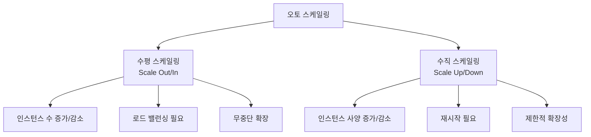
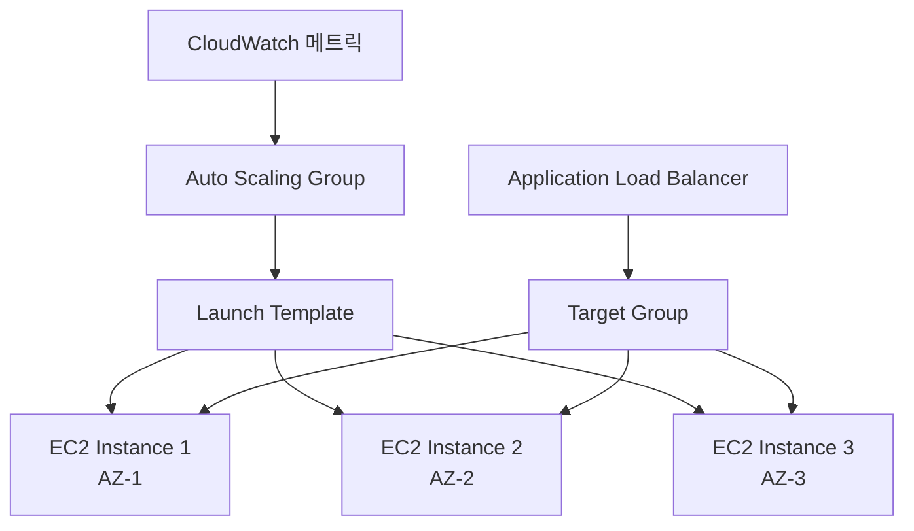

# 2교시: 오토 스케일링 기본 개념 및 실습

<div align="center">

[← 이전: Cloud Master 3일차 메인](../README.md) | [📚 전체 커리큘럼](../../../curriculum.md) | [🏠 학습 경로로 돌아가기](../../../index.md)

</div>

## 📋 목차
1. [오토 스케일링 개념 이해](#오토-스케일링-개념-이해)
2. [스케일링 전략](#스케일링-전략)
3. [AWS ASG vs GCP MIG 비교](#aws-asg-vs-gcp-mig-비교)
4. [스케일링 메트릭](#스케일링-메트릭)
5. [실습 목표](#실습-목표)
6. [실습 절차](#실습-절차)
7. [실습 코드 예시](#실습-코드-예시)
8. [예상 결과](#예상-결과)
9. [혼자 해보기](#혼자-해보기)

---

## 📈 오토 스케일링 개념 이해

### 오토 스케일링(Auto Scaling)이란?

오토 스케일링은 **서버 부하나 트래픽 변화에 따라 필요한 인스턴스 수를 자동으로 증감시켜 주는 클라우드의 핵심 기능**입니다.

### 오토 스케일링의 필요성

#### 1. **트래픽 변동성**
- 갑작스러운 트래픽 증가 (블랙프라이데이, 이벤트 등)
- 시간대별 트래픽 변화 (업무시간 vs 야간)
- 계절별 트래픽 변화

#### 2. **비용 효율성**
- 필요할 때만 리소스 사용
- 사용하지 않는 시간에 리소스 자동 해제
- 과도한 리소스 프로비저닝 방지

#### 3. **성능 보장**
- 트래픽 증가 시 자동으로 서버 추가
- 응답 시간 및 처리량 유지
- 사용자 경험 향상

### 스케일링 유형



---

## 🔄 스케일링 전략

### 스케일 아웃 vs 스케일 인

#### **스케일 아웃 (Scale Out)**
- **정의**: 인스턴스 수를 증가시키는 것
- **트리거**: CPU 사용률 증가, 메모리 사용률 증가, 요청 수 증가
- **장점**: 무중단 확장, 높은 가용성
- **단점**: 로드 밸런싱 필요, 관리 복잡도 증가

#### **스케일 인 (Scale In)**
- **정의**: 인스턴스 수를 감소시키는 것
- **트리거**: CPU 사용률 감소, 메모리 사용률 감소, 요청 수 감소
- **장점**: 비용 절약, 리소스 효율성
- **단점**: 세션 손실 가능성, 서비스 중단 위험

### 스케일링 정책

#### 1. **예측적 스케일링 (Predictive Scaling)**
- 과거 데이터를 기반으로 미래 트래픽 예측
- 사전에 리소스 확보
- 예: 매일 오전 9시에 인스턴스 수 증가

#### 2. **반응적 스케일링 (Reactive Scaling)**
- 현재 메트릭을 기반으로 즉시 대응
- 실시간 트래픽 변화에 대응
- 예: CPU 사용률 70% 초과 시 인스턴스 추가

#### 3. **스케줄 기반 스케일링 (Scheduled Scaling)**
- 미리 정의된 시간에 스케일링 실행
- 예측 가능한 트래픽 패턴에 적합
- 예: 업무시간에 인스턴스 수 증가

---

## ⚖️ AWS ASG vs GCP MIG 비교

### 기능 비교표

| 구분 | AWS Auto Scaling Group (ASG) | GCP Managed Instance Group (MIG) |
|------|------------------------------|-----------------------------------|
| **기본 기능** | 인스턴스 자동 관리 | 인스턴스 자동 관리 |
| **스케일링 정책** | CloudWatch 메트릭 기반 | Cloud Monitoring 메트릭 기반 |
| **인스턴스 템플릿** | Launch Template/Configuration | Instance Template |
| **다중 AZ 지원** | ✅ | ✅ |
| **다중 리전 지원** | ❌ | ✅ (Regional MIG) |
| **자동 복구** | ✅ | ✅ |
| **롤링 업데이트** | ✅ | ✅ |
| **Canary 배포** | ❌ | ✅ |
| **Blue-Green 배포** | ❌ | ✅ |

### 아키텍처 비교

#### AWS ASG 아키텍처


#### GCP MIG 아키텍처
```mermaid
graph TB
    A[Cloud Monitoring 메트릭] --> B[Managed Instance Group]
    B --> C[Instance Template]
    C --> D[VM Instance 1<br/>Zone-1]
    C --> E[VM Instance 2<br/>Zone-2]
    C --> F[VM Instance 3<br/>Zone-3]
    
    G[Backend Service] --> D
    G --> E
    G --> F
    
    H[HTTP(S) Load Balancer] --> G
```

### 스케일링 정책 비교

| 정책 유형 | AWS ASG | GCP MIG |
|-----------|---------|---------|
| **CPU 기반** | ✅ | ✅ |
| **메모리 기반** | ✅ | ✅ |
| **네트워크 기반** | ✅ | ✅ |
| **요청 수 기반** | ✅ | ✅ |
| **커스텀 메트릭** | ✅ | ✅ |
| **스케줄 기반** | ✅ | ✅ |
| **예측적 스케일링** | ✅ | ❌ |

---

## 📊 스케일링 메트릭

### 기본 메트릭

#### 1. **CPU 사용률**
- **임계값**: 70-80%
- **스케일 아웃**: CPU > 70%
- **스케일 인**: CPU < 30%
- **적용 사례**: CPU 집약적 애플리케이션

#### 2. **메모리 사용률**
- **임계값**: 80-90%
- **스케일 아웃**: Memory > 80%
- **스케일 인**: Memory < 50%
- **적용 사례**: 메모리 집약적 애플리케이션

#### 3. **네트워크 사용률**
- **임계값**: 80%
- **스케일 아웃**: Network > 80%
- **스케일 인**: Network < 30%
- **적용 사례**: 네트워크 집약적 애플리케이션

#### 4. **요청 수 (Request Count)**
- **임계값**: 1000 req/min
- **스케일 아웃**: Requests > 1000
- **스케일 인**: Requests < 300
- **적용 사례**: 웹 애플리케이션

### 커스텀 메트릭

#### AWS CloudWatch 커스텀 메트릭
```bash
# 커스텀 메트릭 발송
aws cloudwatch put-metric-data \
  --namespace "MyApp" \
  --metric-data MetricName=ActiveUsers,Value=150,Unit=Count
```

#### GCP Cloud Monitoring 커스텀 메트릭
```bash
# 커스텀 메트릭 발송
gcloud logging write my-app-log \
  --payload-type=json \
  '{"message": "Active users: 150", "severity": "INFO"}'
```

---

## 🎯 실습 목표

이 실습을 통해 다음을 달성합니다:

1. **오토 스케일링 이해**: AWS ASG와 GCP MIG의 기본 개념을 이해합니다.

2. **스케일링 정책 설정**: CPU 사용률 기반으로 스케일링 정책을 설정합니다.

3. **부하 테스트**: 인위적으로 부하를 생성하여 스케일링이 작동하는지 확인합니다.

4. **비용 최적화**: 스케일 인/아웃을 통해 비용 효율성을 체험합니다.

---

## 📝 실습 절차

### 1단계: 인스턴스 템플릿 준비

#### AWS Launch Template 생성
```bash
# Launch Template 생성
aws ec2 create-launch-template \
  --launch-template-name web-server-template \
  --launch-template-data '{
    "ImageId": "ami-0abcdef1234567890",
    "InstanceType": "t2.micro",
    "SecurityGroupIds": ["sg-12345"],
    "UserData": "'$(base64 -w 0 user-data.sh)'",
    "TagSpecifications": [{
      "ResourceType": "instance",
      "Tags": [{"Key": "Name", "Value": "web-server"}]
    }]
  }'
```

#### GCP Instance Template 생성
```bash
# Instance Template 생성
gcloud compute instance-templates create web-server-template \
  --machine-type=e2-micro \
  --image-family=debian-11 \
  --image-project=debian-cloud \
  --metadata-from-file startup-script=startup-script.sh \
  --tags=web-server \
  --metadata=enable-oslogin=true
```

#### 부하 생성 스크립트

**user-data.sh (AWS)**
```bash
#!/bin/bash
yum update -y
yum install -y httpd stress
systemctl start httpd
systemctl enable httpd

# 웹 서버 설정
echo "<h1>Hello from AWS Server $(hostname)</h1>" > /var/www/html/index.html
echo "<p>Server IP: $(curl -s http://169.254.169.254/latest/meta-data/local-ipv4)</p>" >> /var/www/html/index.html
echo "<p>CPU Usage: <span id='cpu'>0%</span></p>" >> /var/www/html/index.html

# CPU 사용률 모니터링 페이지 생성
cat > /var/www/html/cpu.html << 'EOF'
<!DOCTYPE html>
<html>
<head>
    <title>CPU Monitor</title>
    <meta http-equiv="refresh" content="5">
</head>
<body>
    <h1>CPU Usage Monitor</h1>
    <p>Current CPU Usage: <span id="cpu">0%</span></p>
    <script>
        fetch('/cpu-api')
            .then(response => response.json())
            .then(data => {
                document.getElementById('cpu').textContent = data.cpu + '%';
            });
    </script>
</body>
</html>
EOF

# CPU API 엔드포인트 생성
cat > /var/www/html/cpu-api << 'EOF'
#!/bin/bash
echo "Content-Type: application/json"
echo ""
cpu_usage=$(top -bn1 | grep "Cpu(s)" | awk '{print $2}' | cut -d'%' -f1)
echo "{\"cpu\": \"$cpu_usage\"}"
EOF

chmod +x /var/www/html/cpu-api

# 부하 생성 스크립트
cat > /home/ec2-user/load-generator.sh << 'EOF'
#!/bin/bash
while true; do
    # CPU 부하 생성 (60초간)
    stress --cpu 1 --timeout 60
    sleep 30
done
EOF

chmod +x /home/ec2-user/load-generator.sh
nohup /home/ec2-user/load-generator.sh &
```

**startup-script.sh (GCP)**
```bash
#!/bin/bash
apt-get update
apt-get install -y apache2 stress-ng
systemctl start apache2
systemctl enable apache2

# 웹 서버 설정
echo "<h1>Hello from GCP Server $(hostname)</h1>" > /var/www/html/index.html
echo "<p>Server IP: $(curl -s http://metadata.google.internal/computeMetadata/v1/instance/network-interfaces/0/ip -H "Metadata-Flavor: Google")</p>" >> /var/www/html/index.html
echo "<p>CPU Usage: <span id='cpu'>0%</span></p>" >> /var/www/html/index.html

# CPU 사용률 모니터링 페이지 생성
cat > /var/www/html/cpu.html << 'EOF'
<!DOCTYPE html>
<html>
<head>
    <title>CPU Monitor</title>
    <meta http-equiv="refresh" content="5">
</head>
<body>
    <h1>CPU Usage Monitor</h1>
    <p>Current CPU Usage: <span id="cpu">0%</span></p>
    <script>
        fetch('/cpu-api')
            .then(response => response.json())
            .then(data => {
                document.getElementById('cpu').textContent = data.cpu + '%';
            });
    </script>
</body>
</html>
EOF

# CPU API 엔드포인트 생성
cat > /var/www/html/cpu-api << 'EOF'
#!/bin/bash
echo "Content-Type: application/json"
echo ""
cpu_usage=$(top -bn1 | grep "Cpu(s)" | awk '{print $2}' | cut -d'%' -f1)
echo "{\"cpu\": \"$cpu_usage\"}"
EOF

chmod +x /var/www/html/cpu-api

# 부하 생성 스크립트
cat > /home/load-generator.sh << 'EOF'
#!/bin/bash
while true; do
    # CPU 부하 생성 (60초간)
    stress-ng --cpu 1 --timeout 60
    sleep 30
done
EOF

chmod +x /home/load-generator.sh
nohup /home/load-generator.sh &
```

### 2단계: AWS Auto Scaling Group 생성

#### ASG 생성
```bash
# Auto Scaling Group 생성
aws autoscaling create-auto-scaling-group \
  --auto-scaling-group-name web-servers-asg \
  --launch-template LaunchTemplateName=web-server-template,Version='$Latest' \
  --min-size 1 \
  --max-size 5 \
  --desired-capacity 2 \
  --vpc-zone-identifier "subnet-12345,subnet-67890" \
  --health-check-type EC2 \
  --health-check-grace-period 300

# 스케일 아웃 정책 생성
aws autoscaling put-scaling-policy \
  --auto-scaling-group-name web-servers-asg \
  --policy-name scale-out-policy \
  --policy-type TargetTrackingScaling \
  --target-tracking-configuration '{
    "TargetValue": 70.0,
    "PredefinedMetricSpecification": {
      "PredefinedMetricType": "ASGAverageCPUUtilization"
    },
    "ScaleOutCooldown": 300,
    "ScaleInCooldown": 300
  }'
```

### 3단계: GCP Managed Instance Group 생성

#### MIG 생성
```bash
# Managed Instance Group 생성
gcloud compute instance-groups managed create web-servers-mig \
  --base-instance-name web-server \
  --template web-server-template \
  --size 2 \
  --zone us-central1-a

# 자동 확장 정책 설정
gcloud compute instance-groups managed set-autoscaling web-servers-mig \
  --zone us-central1-a \
  --max-num-replicas 5 \
  --min-num-replicas 1 \
  --target-cpu-utilization 0.7 \
  --cool-down-period 300
```

### 4단계: 부하 테스트 및 스케일링 확인

#### 부하 테스트 실행
```bash
# Apache Bench를 사용한 부하 테스트
# 여러 인스턴스에 동시 요청
for i in {1..5}; do
  ab -n 1000 -c 50 http://<LOAD_BALANCER_IP>/ &
done

# CPU 모니터링
watch -n 5 'curl -s http://<LOAD_BALANCER_IP>/cpu-api | jq .cpu'
```

#### 스케일링 상태 확인
```bash
# AWS ASG 상태 확인
aws autoscaling describe-auto-scaling-groups \
  --auto-scaling-group-names web-servers-asg

# GCP MIG 상태 확인
gcloud compute instance-groups managed describe web-servers-mig \
  --zone us-central1-a
```

### 5단계: 스케일 인 확인

#### 부하 제거
```bash
# 부하 테스트 중지
pkill ab

# 인스턴스에서 부하 생성 스크립트 중지
# AWS
aws ssm send-command \
  --instance-ids $(aws autoscaling describe-auto-scaling-groups \
    --auto-scaling-group-names web-servers-asg \
    --query "AutoScalingGroups[0].Instances[].InstanceId" \
    --output text) \
  --document-name "AWS-RunShellScript" \
  --parameters 'commands=["pkill stress"]'

# GCP
gcloud compute ssh web-server-0001 --zone=us-central1-a --command="pkill stress-ng"
```

#### 스케일 인 확인
```bash
# 5분 후 인스턴스 수 확인
sleep 300

# AWS ASG 인스턴스 수 확인
aws autoscaling describe-auto-scaling-groups \
  --auto-scaling-group-names web-servers-asg \
  --query "AutoScalingGroups[0].Instances | length(@)"

# GCP MIG 인스턴스 수 확인
gcloud compute instance-groups managed list-instances web-servers-mig \
  --zone us-central1-a
```

---

## 💻 실습 코드 예시

### 고급 스케일링 정책

#### AWS 다중 메트릭 스케일링
```bash
# CPU와 메모리 기반 스케일링 정책
aws autoscaling put-scaling-policy \
  --auto-scaling-group-name web-servers-asg \
  --policy-name multi-metric-scale-out \
  --policy-type TargetTrackingScaling \
  --target-tracking-configuration '{
    "TargetValue": 70.0,
    "PredefinedMetricSpecification": {
      "PredefinedMetricType": "ASGAverageCPUUtilization"
    },
    "CustomizedMetricSpecification": {
      "MetricName": "MemoryUtilization",
      "Namespace": "AWS/EC2",
      "Statistic": "Average",
      "Unit": "Percent"
    },
    "ScaleOutCooldown": 300,
    "ScaleInCooldown": 300
  }'
```

#### GCP 커스텀 메트릭 스케일링
```bash
# 커스텀 메트릭 기반 스케일링
gcloud compute instance-groups managed set-autoscaling web-servers-mig \
  --zone us-central1-a \
  --max-num-replicas 10 \
  --min-num-replicas 1 \
  --custom-metric-utilization metric=custom.googleapis.com/active_users,target=100 \
  --cool-down-period 300
```

### 스케줄 기반 스케일링

#### AWS 스케줄 기반 스케일링
```bash
# 업무시간 스케일링 (오전 9시)
aws autoscaling put-scheduled-update-group-action \
  --auto-scaling-group-name web-servers-asg \
  --scheduled-action-name scale-up-business-hours \
  --start-time "2024-01-01T09:00:00Z" \
  --recurrence "0 9 * * MON-FRI" \
  --desired-capacity 5

# 야간 스케일링 (오후 6시)
aws autoscaling put-scheduled-update-group-action \
  --auto-scaling-group-name web-servers-asg \
  --scheduled-action-name scale-down-night \
  --start-time "2024-01-01T18:00:00Z" \
  --recurrence "0 18 * * MON-FRI" \
  --desired-capacity 1
```

#### GCP 스케줄 기반 스케일링
```bash
# 업무시간 스케일링
gcloud compute instance-groups managed set-autoscaling web-servers-mig \
  --zone us-central1-a \
  --max-num-replicas 10 \
  --min-num-replicas 1 \
  --target-cpu-utilization 0.7 \
  --schedule "scale-up-business-hours" \
  --schedule-cron "0 9 * * MON-FRI" \
  --schedule-timezone "Asia/Seoul" \
  --schedule-desired-capacity 5
```

---

## ✅ 예상 결과

### 스케일 아웃 동작
- CPU 사용률 70% 초과 시 인스턴스 수 증가
- AWS ASG: DesiredCapacity가 2 → 3 → 4로 증가
- GCP MIG: 인스턴스 수가 2 → 3 → 4로 증가
- 새 인스턴스가 자동으로 로드 밸런서에 등록

### 스케일 인 동작
- CPU 사용률 30% 미만 시 인스턴스 수 감소
- AWS ASG: DesiredCapacity가 4 → 3 → 2로 감소
- GCP MIG: 인스턴스 수가 4 → 3 → 2로 감소
- 불필요한 인스턴스가 자동으로 종료

### 비용 절약
- 부하가 없는 시간에 인스턴스 수 최소화
- 필요한 만큼만 리소스 사용
- 자동으로 비용 최적화

---

## 🚀 혼자 해보기

### 기본 과제
1. **다른 메트릭 실험**: CPU 대신 메모리 사용률이나 네트워크 사용률로 스케일링 정책을 설정해 보세요.

2. **임계값 조정**: 스케일 아웃/인 임계값을 조정하여 스케일링 민감도를 변경해 보세요.

3. **쿨다운 시간 조정**: 스케일링 쿨다운 시간을 조정하여 스케일링 빈도를 제어해 보세요.

### 고급 과제
1. **예측적 스케일링**: AWS의 예측적 스케일링을 설정하여 미래 트래픽을 예측해 보세요.

2. **커스텀 메트릭**: 애플리케이션별 커스텀 메트릭을 생성하여 스케일링 정책을 설정해 보세요.

3. **다중 리전 스케일링**: GCP의 Regional MIG를 사용하여 여러 리전에 걸친 스케일링을 구현해 보세요.

---

## ❓ 퀴즈

1. **Auto Scaling의 스케일 아웃과 스케일 인이 의미하는 바를 설명해 보세요.**

2. **스케일링 정책에서 쿨다운 시간을 설정하는 이유는 무엇인가요?**

3. **AWS ASG와 GCP MIG의 주요 차이점 3가지를 말해보세요.**

4. **예측적 스케일링과 반응적 스케일링의 차이점은 무엇인가요?**

---

## ✅ 체크리스트

- [ ] ASG/MIG가 생성되어 최소/최대 용량이 올바르게 설정되었나요?
- [ ] 스케일링 정책이 CPU 사용률 기반으로 설정되었나요?
- [ ] 부하 테스트를 통해 인스턴스 수가 증가했나요?
- [ ] 부하 해제 후 인스턴스 수가 줄어들었나요?
- [ ] 콘솔/CLI로 현재 인스턴스 상태와 원하는 수를 확인했나요?
- [ ] 새 인스턴스가 자동으로 로드 밸런서에 등록되었나요?

---

## 📚 추가 학습 자료

- [AWS Auto Scaling 공식 문서](https://docs.aws.amazon.com/autoscaling/)
- [GCP Managed Instance Groups 공식 문서](https://cloud.google.com/compute/docs/instance-groups)
- [오토 스케일링 모범 사례](https://aws.amazon.com/architecture/well-architected/)
- [스케일링 전략 가이드](https://cloud.google.com/architecture/scaling-web-applications)

다음 단계: [3교시: 로드 밸런서 + 오토스케일링 연동](./integration-guide.md)

---

<div align="center">

[← 이전: 로드 밸런싱 가이드](./load-balancing-guide) | [📚 전체 커리큘럼](../../../curriculum) | [다음: 통합 가이드 →](./integration-guide)

</div>