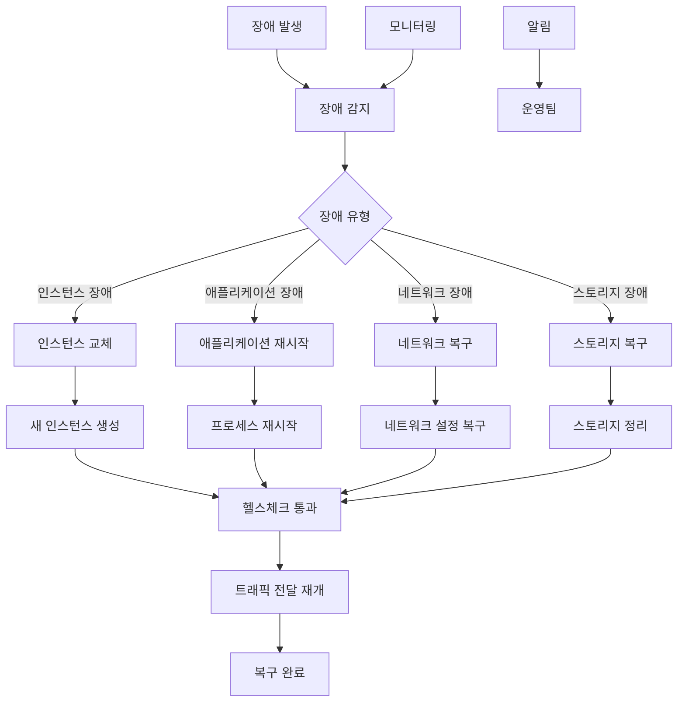

# 4교시: 장애 시뮬레이션 및 복구 실습


## 📋 목차
1. [장애 시뮬레이션 개념](#장애-시뮬레이션-개념.md
2. [장애 유형별 시나리오](#장애-유형별-시나리오.md
3. [복구 과정 시각화](#복구-과정-시각화.md
4. [실습 목표](#실습-목표)
5. [실습 절차](#실습-절차)
6. [실습 코드 예시](#실습-코드-예시)
7. [예상 결과](#예상-결과)
8. [혼자 해보기](#혼자-해보기)

---

## 🚨 장애 시뮬레이션 개념

### 장애 시뮬레이션이란?

장애 시뮬레이션은 **의도적으로 시스템 장애를 발생시켜 자동 복구 시스템이 정상 작동하는지 확인하는 테스트**입니다.

### 장애 시뮬레이션의 목적

#### 1. **시스템 신뢰성 검증**
- 자동 복구 시스템의 정상 작동 확인
- 장애 대응 시간 측정
- 복구 프로세스 검증

#### 2. **운영팀 훈련**
- 장애 상황 대응 경험 축적
- 복구 절차 숙련도 향상
- 비상 상황 대응 능력 향상

#### 3. **시스템 개선**
- 장애 지점 식별
- 복구 시간 단축 방안 모색
- 모니터링 시스템 개선

### 장애 시뮬레이션 원칙

| 원칙 | 설명 |
|------|------|
| **점진적 접근** | 단순한 장애부터 복잡한 장애까지 단계적 진행 |
| **안전한 환경** | 프로덕션 환경이 아닌 테스트 환경에서 실행 |
| **문서화** | 모든 과정과 결과를 상세히 기록 |
| **복구 계획** | 장애 시뮬레이션 전 복구 계획 수립 |

---

## 🔥 장애 유형별 시나리오

### 1. 인스턴스 장애

#### 하드웨어 장애 시뮬레이션
```bash
# AWS: 인스턴스 강제 종료
aws ec2 terminate-instances --instance-ids i-1234567890abcdef0

# GCP: 인스턴스 강제 삭제
gcloud compute instances delete web-server-0001 --zone us-central1-a --quiet
```

#### 운영체제 크래시 시뮬레이션
```bash
# 시스템 크래시 시뮬레이션
sudo echo c > /proc/sysrq-trigger

# 또는 커널 패닉 유발
sudo sysctl kernel.panic=1
```

### 2. 애플리케이션 장애

#### 웹 서버 프로세스 종료
```bash
# Apache/Nginx 프로세스 종료
sudo systemctl stop httpd
sudo systemctl stop nginx

# 또는 프로세스 강제 종료
sudo pkill -9 httpd
sudo pkill -9 nginx
```

#### 애플리케이션 메모리 부족
```bash
# 메모리 부족 시뮬레이션
stress --vm 1 --vm-bytes 2G --timeout 60s

# 또는 메모리 할당 실패
dd if=/dev/zero of=/tmp/memory_hog bs=1M count=2048
```

### 3. 네트워크 장애

#### 네트워크 인터페이스 비활성화
```bash
# 네트워크 인터페이스 비활성화
sudo ifconfig eth0 down

# 또는 방화벽 규칙 차단
sudo iptables -A INPUT -p tcp --dport 80 -j DROP
```

#### DNS 해석 실패
```bash
# DNS 설정 변경
echo "127.0.0.1 invalid.domain.com" >> /etc/hosts

# 또는 DNS 서버 변경
echo "nameserver 127.0.0.1" > /etc/resolv.conf
```

### 4. 스토리지 장애

#### 디스크 공간 부족
```bash
# 디스크 공간 부족 시뮬레이션
dd if=/dev/zero of=/tmp/disk_hog bs=1M count=10240

# 또는 로그 파일 크기 증가
yes "log message" | head -1000000 >> /var/log/app.log
```

#### 디스크 I/O 오류
```bash
# 디스크 I/O 오류 시뮬레이션
echo 1 > /proc/sys/kernel/sysrq
echo u > /proc/sysrq-trigger
```

---

## 🔄 복구 과정 시각화

### 복구 프로세스 플로우



### 복구 시간 분석

| 장애 유형 | 감지 시간 | 복구 시간 | 총 복구 시간 |
|-----------|-----------|-----------|--------------|
| **인스턴스 장애** | 30초 | 2-3분 | 3-4분 |
| **애플리케이션 장애** | 30초 | 30초 | 1분 |
| **네트워크 장애** | 30초 | 1-2분 | 2-3분 |
| **스토리지 장애** | 30초 | 1-5분 | 2-6분 |

### 복구 단계별 상세 과정

#### 1. **장애 감지 단계**
```bash
# 헬스체크 실패 감지
curl -f http://instance-ip/health || echo "Health check failed"

# 로그 모니터링
tail -f /var/log/app.log | grep -i error
```

#### 2. **장애 분석 단계**
```bash
# 시스템 상태 확인
top
htop
iostat
netstat -tulpn

# 로그 분석
journalctl -u httpd -f
tail -f /var/log/messages
```

#### 3. **복구 실행 단계**
```bash
# 자동 복구 스크립트 실행
./auto-recovery.sh

# 수동 복구 절차 실행
./manual-recovery.sh
```

#### 4. **복구 검증 단계**
```bash
# 서비스 상태 확인
systemctl status httpd
curl -f http://instance-ip/health

# 트래픽 전달 확인
ab -n 100 -c 10 http://load-balancer-ip/
```

---

## 🎯 실습 목표

이 실습을 통해 다음을 달성합니다:

1. **다양한 장애 시뮬레이션**: 여러 유형의 장애를 시뮬레이션합니다.

2. **자동 복구 확인**: 시스템이 자동으로 장애를 감지하고 복구하는 과정을 관찰합니다.

3. **복구 시간 측정**: 각 장애 유형별 복구 시간을 측정합니다.

4. **모니터링 개선**: 장애 감지 및 복구 과정에서 모니터링 시스템을 개선합니다.

---

## 📝 실습 절차

### 1단계: 장애 시뮬레이션 환경 준비

#### 모니터링 대시보드 설정
```bash
# AWS CloudWatch 대시보드 생성
aws cloudwatch put-dashboard \
  --dashboard-name "Disaster-Recovery-Monitor" \
  --dashboard-body '{
    "widgets": [
      {
        "type": "metric",
        "properties": {
          "metrics": [
            ["AWS/EC2", "CPUUtilization"],
            ["AWS/ApplicationELB", "TargetResponseTime"],
            ["AWS/ApplicationELB", "HealthyHostCount"]
          ],
          "period": 300,
          "stat": "Average",
          "region": "us-west-2",
          "title": "System Health Metrics"
        }
      }
    ]
  }'

# GCP Monitoring 대시보드 생성
gcloud monitoring dashboards create \
  --config-from-file=dashboard-config.yaml
```

#### 알림 설정
```bash
# AWS SNS 알림 설정
aws sns create-topic --name disaster-recovery-alerts

aws sns subscribe \
  --topic-arn arn:aws:sns:region:account:disaster-recovery-alerts \
  --protocol email \
  --notification-endpoint admin@example.com

# GCP 알림 채널 설정
gcloud alpha monitoring channels create \
  --display-name="Disaster Recovery Alerts" \
  --type=email \
  --channel-labels=email_address=admin@example.com
```

### 2단계: 인스턴스 장애 시뮬레이션

#### 하드웨어 장애 시뮬레이션
```bash
# 현재 인스턴스 상태 확인
aws autoscaling describe-auto-scaling-groups \
  --auto-scaling-group-names web-servers-asg \
  --query "AutoScalingGroups[0].Instances[].{InstanceId:InstanceId,HealthStatus:HealthStatus,LifecycleState:LifecycleState}" \
  --output table

# 인스턴스 강제 종료
INSTANCE_ID=$(aws autoscaling describe-auto-scaling-groups \
  --auto-scaling-group-names web-servers-asg \
  --query "AutoScalingGroups[0].Instances[0].InstanceId" \
  --output text)

echo "Terminating instance: $INSTANCE_ID"
aws ec2 terminate-instances --instance-ids $INSTANCE_ID

# 복구 과정 모니터링
watch -n 10 'aws autoscaling describe-auto-scaling-groups \
  --auto-scaling-group-names web-servers-asg \
  --query "AutoScalingGroups[0].Instances[].{InstanceId:InstanceId,HealthStatus:HealthStatus,LifecycleState:LifecycleState}" \
  --output table'
```

#### 복구 시간 측정
```bash
# 복구 시작 시간 기록
START_TIME=$(date +%s)

# 복구 완료까지 대기
while true; do
  HEALTHY_COUNT=$(aws autoscaling describe-auto-scaling-groups \
    --auto-scaling-group-names web-servers-asg \
    --query "AutoScalingGroups[0].Instances[?HealthStatus=='Healthy'] | length(@)")
  
  if [ $HEALTHY_COUNT -eq 2 ]; then
    END_TIME=$(date +%s)
    RECOVERY_TIME=$((END_TIME - START_TIME))
    echo "Recovery completed in $RECOVERY_TIME seconds"
    break
  fi
  
  echo "Waiting for recovery... Current healthy instances: $HEALTHY_COUNT"
  sleep 10
done
```

### 3단계: 애플리케이션 장애 시뮬레이션

#### 웹 서버 프로세스 종료
```bash
# 인스턴스에 접속하여 웹 서버 종료
INSTANCE_IP=$(aws ec2 describe-instances \
  --instance-ids $INSTANCE_ID \
  --query "Reservations[0].Instances[0].PublicIpAddress" \
  --output text)

# SSH를 통한 웹 서버 종료
ssh -i key.pem ec2-user@$INSTANCE_IP "sudo systemctl stop httpd"

# 헬스체크 실패 확인
curl -f http://$INSTANCE_IP/health || echo "Health check failed"

# 로드 밸런서에서 인스턴스 상태 확인
aws elbv2 describe-target-health \
  --target-group-arn $TARGET_GROUP_ARN
```

#### 자동 복구 확인
```bash
# 웹 서버 재시작 (자동 복구 스크립트)
ssh -i key.pem ec2-user@$INSTANCE_IP "sudo systemctl start httpd"

# 헬스체크 통과 확인
sleep 30
curl -f http://$INSTANCE_IP/health && echo "Health check passed"

# 로드 밸런서에서 인스턴스 상태 확인
aws elbv2 describe-target-health \
  --target-group-arn $TARGET_GROUP_ARN
```

### 4단계: 네트워크 장애 시뮬레이션

#### 네트워크 인터페이스 비활성화
```bash
# 네트워크 인터페이스 비활성화
ssh -i key.pem ec2-user@$INSTANCE_IP "sudo ifconfig eth0 down"

# 네트워크 연결 확인
ping -c 3 $INSTANCE_IP || echo "Network unreachable"

# 로드 밸런서에서 인스턴스 상태 확인
aws elbv2 describe-target-health \
  --target-group-arn $TARGET_GROUP_ARN
```

#### 네트워크 복구
```bash
# 네트워크 인터페이스 활성화
ssh -i key.pem ec2-user@$INSTANCE_IP "sudo ifconfig eth0 up"

# 네트워크 연결 확인
ping -c 3 $INSTANCE_IP && echo "Network restored"

# 헬스체크 통과 확인
sleep 30
curl -f http://$INSTANCE_IP/health && echo "Health check passed"
```

### 5단계: 스토리지 장애 시뮬레이션

#### 디스크 공간 부족 시뮬레이션
```bash
# 디스크 공간 부족 시뮬레이션
ssh -i key.pem ec2-user@$INSTANCE_IP "dd if=/dev/zero of=/tmp/disk_hog bs=1M count=10240"

# 디스크 사용량 확인
ssh -i key.pem ec2-user@$INSTANCE_IP "df -h"

# 애플리케이션 동작 확인
curl -f http://$INSTANCE_IP/health || echo "Application failed due to disk space"

# 자동 복구 스크립트 실행
ssh -i key.pem ec2-user@$INSTANCE_IP "sudo rm -f /tmp/disk_hog"

# 복구 확인
curl -f http://$INSTANCE_IP/health && echo "Application recovered"
```

---

## 💻 실습 코드 예시

### 자동 복구 스크립트

#### AWS 자동 복구 스크립트
```bash
#!/bin/bash
# auto-recovery.sh

LOG_FILE="/var/log/auto-recovery.log"
HEALTH_CHECK_URL="http://localhost/health"

log_message() {
    echo "$(date): $1" >> $LOG_FILE
}

check_health() {
    curl -f $HEALTH_CHECK_URL > /dev/null 2>&1
    return $?
}

recover_httpd() {
    log_message "Attempting to recover HTTP service"
    sudo systemctl restart httpd
    sleep 10
    
    if check_health; then
        log_message "HTTP service recovered successfully"
        return 0
    else
        log_message "HTTP service recovery failed"
        return 1
    fi
}

recover_disk_space() {
    log_message "Attempting to recover disk space"
    
    # 임시 파일 정리
    sudo rm -rf /tmp/*
    sudo rm -rf /var/tmp/*
    
    # 로그 파일 정리
    sudo find /var/log -name "*.log" -mtime +7 -delete
    
    # 패키지 캐시 정리
    sudo yum clean all
    
    # 디스크 사용량 확인
    DISK_USAGE=$(df / | awk 'NR==2 {print $5}' | sed 's/%//')
    log_message "Disk usage after cleanup: ${DISK_USAGE}%"
    
    if [ $DISK_USAGE -lt 80 ]; then
        log_message "Disk space recovered successfully"
        return 0
    else
        log_message "Disk space recovery failed"
        return 1
    fi
}

recover_memory() {
    log_message "Attempting to recover memory"
    
    # 메모리 사용량 확인
    MEMORY_USAGE=$(free | awk 'NR==2{printf "%.0f", $3*100/$2}')
    
    if [ $MEMORY_USAGE -gt 90 ]; then
        # 메모리 집약적 프로세스 종료
        sudo pkill -f stress
        sudo pkill -f memory_hog
        
        # 메모리 정리
        echo 3 | sudo tee /proc/sys/vm/drop_caches
        
        log_message "Memory recovered successfully"
        return 0
    else
        log_message "Memory usage is normal: ${MEMORY_USAGE}%"
        return 0
    fi
}

# 메인 복구 로직
main() {
    log_message "Starting auto-recovery process"
    
    if ! check_health; then
        log_message "Health check failed, starting recovery"
        
        # HTTP 서비스 복구
        if ! recover_httpd; then
            # 디스크 공간 복구
            if ! recover_disk_space; then
                # 메모리 복구
                recover_memory
            fi
            
            # HTTP 서비스 재시도
            recover_httpd
        fi
        
        if check_health; then
            log_message "Auto-recovery completed successfully"
        else
            log_message "Auto-recovery failed, manual intervention required"
            # 알림 발송
            aws sns publish \
                --topic-arn arn:aws:sns:region:account:disaster-recovery-alerts \
                --message "Auto-recovery failed for instance $(hostname)"
        fi
    else
        log_message "System is healthy, no recovery needed"
    fi
}

# 스크립트 실행
main
```

#### GCP 자동 복구 스크립트
```bash
#!/bin/bash
# auto-recovery-gcp.sh

LOG_FILE="/var/log/auto-recovery.log"
HEALTH_CHECK_URL="http://localhost/health"

log_message() {
    echo "$(date): $1" >> $LOG_FILE
}

check_health() {
    curl -f $HEALTH_CHECK_URL > /dev/null 2>&1
    return $?
}

recover_apache() {
    log_message "Attempting to recover Apache service"
    sudo systemctl restart apache2
    sleep 10
    
    if check_health; then
        log_message "Apache service recovered successfully"
        return 0
    else
        log_message "Apache service recovery failed"
        return 1
    fi
}

recover_disk_space() {
    log_message "Attempting to recover disk space"
    
    # 임시 파일 정리
    sudo rm -rf /tmp/*
    sudo rm -rf /var/tmp/*
    
    # 로그 파일 정리
    sudo find /var/log -name "*.log" -mtime +7 -delete
    
    # 패키지 캐시 정리
    sudo apt-get clean
    
    # 디스크 사용량 확인
    DISK_USAGE=$(df / | awk 'NR==2 {print $5}' | sed 's/%//')
    log_message "Disk usage after cleanup: ${DISK_USAGE}%"
    
    if [ $DISK_USAGE -lt 80 ]; then
        log_message "Disk space recovered successfully"
        return 0
    else
        log_message "Disk space recovery failed"
        return 1
    fi
}

# 메인 복구 로직
main() {
    log_message "Starting auto-recovery process"
    
    if ! check_health; then
        log_message "Health check failed, starting recovery"
        
        # Apache 서비스 복구
        if ! recover_apache; then
            # 디스크 공간 복구
            recover_disk_space
            
            # Apache 서비스 재시도
            recover_apache
        fi
        
        if check_health; then
            log_message "Auto-recovery completed successfully"
        else
            log_message "Auto-recovery failed, manual intervention required"
            # 알림 발송
            gcloud logging write my-app-log \
                --payload-type=json \
                '{"message": "Auto-recovery failed for instance '$(hostname)'", "severity": "ERROR"}'
        fi
    else
        log_message "System is healthy, no recovery needed"
    fi
}

# 스크립트 실행
main
```

### 모니터링 및 알림 설정

#### CloudWatch 알람 설정
```bash
# 인스턴스 상태 알람
aws cloudwatch put-metric-alarm \
  --alarm-name "Instance-Health-Check-Failed" \
  --alarm-description "Instance health check failed" \
  --metric-name HealthyHostCount \
  --namespace AWS/ApplicationELB \
  --statistic Average \
  --period 300 \
  --threshold 1 \
  --comparison-operator LessThanThreshold \
  --evaluation-periods 2 \
  --alarm-actions arn:aws:sns:region:account:disaster-recovery-alerts

# 응답 시간 알람
aws cloudwatch put-metric-alarm \
  --alarm-name "High-Response-Time" \
  --alarm-description "High response time detected" \
  --metric-name TargetResponseTime \
  --namespace AWS/ApplicationELB \
  --statistic Average \
  --period 300 \
  --threshold 5 \
  --comparison-operator GreaterThanThreshold \
  --evaluation-periods 2 \
  --alarm-actions arn:aws:sns:region:account:disaster-recovery-alerts
```

#### GCP Monitoring 알람 설정
```bash
# 인스턴스 상태 알람
gcloud alpha monitoring policies create \
  --policy-from-file=instance-health-policy.yaml

# 인스턴스 상태 정책 파일
cat > instance-health-policy.yaml << 'EOF'
displayName: "Instance Health Check Failed"
conditions:
  - displayName: "Instance health check failed"
    conditionThreshold:
      filter: 'resource.type="gce_instance"'
      comparison: COMPARISON_LESS_THAN
      thresholdValue: 1
      duration: 300s
      aggregations:
        - alignmentPeriod: 300s
          perSeriesAligner: ALIGN_MEAN
          crossSeriesReducer: REDUCE_MEAN
          groupByFields:
            - resource.label.instance_id
notificationChannels:
  - projects/PROJECT_ID/notificationChannels/CHANNEL_ID
EOF
```

---

## ✅ 예상 결과

### 장애 시뮬레이션 결과
- 인스턴스 강제 종료 시 ASG/MIG가 자동으로 새 인스턴스 생성
- 애플리케이션 장애 시 자동 복구 스크립트가 서비스 재시작
- 네트워크 장애 시 네트워크 복구 후 서비스 정상화
- 스토리지 장애 시 디스크 공간 정리 후 서비스 복구

### 복구 시간 측정
- 인스턴스 장애: 3-4분 (새 인스턴스 생성 시간)
- 애플리케이션 장애: 1-2분 (서비스 재시작 시간)
- 네트워크 장애: 2-3분 (네트워크 복구 시간)
- 스토리지 장애: 1-5분 (디스크 정리 시간)

### 모니터링 및 알림
- 장애 발생 시 즉시 알림 발송
- 복구 완료 시 복구 완료 알림 발송
- 복구 시간 및 과정 상세 로그 기록

---

## 🚀 혼자 해보기

### 기본 과제
1. **다양한 장애 시나리오**: 다른 유형의 장애를 시뮬레이션해 보세요.

2. **복구 시간 최적화**: 복구 시간을 단축할 수 있는 방법을 찾아보세요.

3. **모니터링 개선**: 더 정확한 장애 감지를 위한 모니터링을 개선해 보세요.

### 고급 과제
1. **연쇄 장애 시뮬레이션**: 여러 장애가 동시에 발생하는 상황을 시뮬레이션해 보세요.

2. **예측적 복구**: 머신러닝을 활용한 예측적 복구 시스템을 구현해 보세요.

3. **다중 리전 복구**: 여러 리전에 걸친 복구 시스템을 구축해 보세요.

---

## ❓ 퀴즈

1. **ASG/MIG가 비정상 인스턴스를 교체할 때 어떤 순서로 진행될까요?**

2. **장애 시뮬레이션을 수행할 때 고려해야 할 사항들은 무엇인가요?**

3. **자동 복구 시스템의 장점과 한계점은 무엇인가요?**

4. **복구 시간을 단축하기 위한 방법들은 무엇인가요?**

---

## ✅ 체크리스트

- [ ] 강제로 인스턴스를 종료했나요?
- [ ] ASG/MIG에서 새로운 인스턴스가 생성되었나요?
- [ ] 로드 밸런서에 새로운 인스턴스가 정상 등록되었나요?
- [ ] 서비스는 장애 중에도 계속 응답하나요?
- [ ] 복구 시간을 측정하고 기록했나요?
- [ ] 모니터링 및 알림이 정상 작동하나요?

---

## 📚 추가 학습 자료

- [AWS Well-Architected Framework](https://aws.amazon.com/architecture/well-architected/)
- [GCP Reliability 가이드](https://cloud.google.com/architecture/reliability)
- [장애 시뮬레이션 모범 사례](https://www.gremlin.com/chaos-engineering/)
- [자가 치유 시스템 설계](https://cloud.google.com/architecture/self-healing-applications)

다음 단계: [트러블슈팅 가이드](/mcp_knowledge_base/cloud_master/textbook/Day3/troubleshooting-guide.md)

---


---

<div align="center">

[🏠 홈](/mcp_knowledge_base/index.md) | [📚 전체 커리큘럼](/mcp_knowledge_base/curriculum.md) | [🔗 학습 경로](/mcp_knowledge_base/cloud_master/learning-path.md)

</div>

### 📧 연락처
- **이메일**: inhwan.jung@gmail.com
- **GitHub**: [프로젝트 저장소](https://github.com/jungfrau70/aws_gcp.git)
