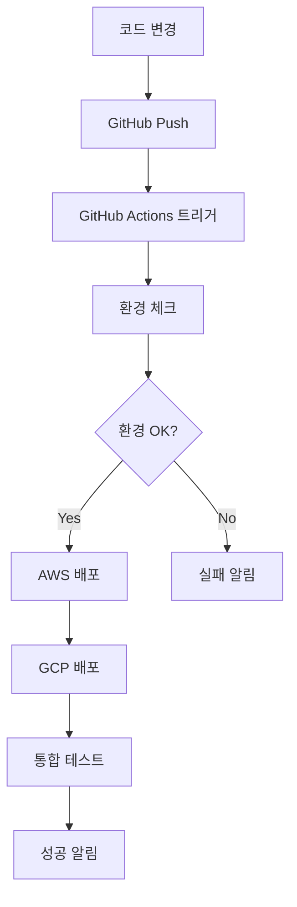

# Cloud Scripts 동작 원리 상세 가이드

## 🎯 학습 목표

- **스크립트 동작 원리**: 각 스크립트가 어떻게 작동하는지 이해
- **클라우드 통합**: AWS, GCP와의 연동 방식 이해
- **WSL 환경**: Windows Subsystem for Linux에서의 동작 원리
- **자동화 프로세스**: 전체 CI/CD 파이프라인 동작 방식

## 📚 참고 자료

- [GitHub Actions 공식 자습서](https://docs.github.com/ko/actions/tutorials)
- [AWS CLI 공식 문서](https://docs.aws.amazon.com/cli/)
- [GCP CLI 공식 문서](https://cloud.google.com/sdk/docs)
- [Docker WSL2 가이드](https://docs.docker.com/desktop/wsl/)

## 🚀 전체 시스템 아키텍처

### **1. 시스템 구성도**
```
┌─────────────────────────────────────────────────────────────┐
│                    Windows 11 Host                         │
├─────────────────────────────────────────────────────────────┤
│  ┌─────────────────┐  ┌─────────────────┐  ┌─────────────┐  │
│  │   Docker        │  │   AWS CLI       │  │   GCP CLI   │  │
│  │   Desktop       │  │   (Windows)     │  │  (Windows)  │  │
│  └─────────────────┘  └─────────────────┘  └─────────────┘  │
├─────────────────────────────────────────────────────────────┤
│                    WSL2 (Ubuntu 24.04)                     │
├─────────────────────────────────────────────────────────────┤
│  ┌─────────────────┐  ┌─────────────────┐  ┌─────────────┐  │
│  │   Cloud         │  │   Environment   │  │   GitHub    │  │
│  │   Scripts       │  │   Check         │  │   Actions   │  │
│  └─────────────────┘  └─────────────────┘  └─────────────┘  │
├─────────────────────────────────────────────────────────────┤
│                    Cloud Providers                         │
├─────────────────────────────────────────────────────────────┤
│  ┌─────────────────┐  ┌─────────────────┐  ┌─────────────┐  │
│  │   AWS           │  │   GCP           │  │   GitHub    │  │
│  │   (EC2, S3)     │  │   (Compute)     │  │   (CI/CD)   │  │
│  └─────────────────┘  └─────────────────┘  └─────────────┘  │
└─────────────────────────────────────────────────────────────┘
```

### **2. 데이터 흐름**
```
1. 코드 변경 → GitHub Push
2. GitHub Actions 트리거
3. WSL2 환경에서 스크립트 실행
4. AWS/GCP API 호출
5. 클라우드 리소스 생성
6. 결과 보고 및 알림
```

## 🔧 스크립트별 동작 원리

### **1. environment-check-wsl.sh**

#### **동작 원리**
```bash
# 1. 환경 감지
detect_wsl_environment() {
    # WSL 버전 확인
    if [ -f /proc/version ] && grep -q Microsoft /proc/version; then
        log_success "✅ WSL 환경 감지됨"
    fi
}

# 2. 도구 확인
check_command() {
    local tool_name="$1"
    local command="$2"
    local expected_output="$3"
    
    # Linux 바이너리 확인
    if command -v "$command" &> /dev/null; then
        log_success "✅ $tool_name: 설치됨 (Linux)"
    # Windows 바이너리 확인
    elif command -v "${command}.exe" &> /dev/null; then
        log_success "✅ $tool_name: 설치됨 (Windows)"
    else
        log_error "❌ $tool_name: 설치되지 않음"
    fi
}
```

#### **핵심 기능**
- **WSL 환경 감지**: `/proc/version` 파일로 WSL 환경 확인
- **이중 바이너리 체크**: Linux와 Windows 바이너리 모두 확인
- **PATH 최적화**: Windows 도구 경로를 WSL PATH에 추가
- **서비스 상태 확인**: Docker, AWS, GCP 서비스 상태 검증

#### **실행 과정**
1. **환경 초기화**: WSL 버전, 배포판 정보 수집
2. **PATH 설정**: Windows 도구 경로를 WSL PATH에 추가
3. **도구 체크**: 각 도구의 설치 상태 및 버전 확인
4. **서비스 검증**: 클라우드 서비스 연결 상태 확인
5. **결과 보고**: 체크 결과 요약 및 권장사항 제시

### **2. aws-ec2-create.sh**

#### **동작 원리**
```bash
# 1. AWS 자격 증명 확인
check_aws_credentials() {
    if aws sts get-caller-identity &> /dev/null; then
        log_success "✅ AWS 자격 증명: 유효함"
        return 0
    else
        log_error "❌ AWS 자격 증명: 유효하지 않음"
        return 1
    fi
}

# 2. SSH 키 생성 및 권한 설정
create_ssh_key() {
    local key_name="$1"
    local key_file="$2"
    
    # SSH 키 생성
    ssh-keygen -t rsa -b 4096 -f "$key_file" -N ""
    
    # WSL 환경에서 권한 설정
    fix_key_permissions "$key_file"
}

# 3. EC2 인스턴스 생성
create_ec2_instance() {
    local instance_id=$(aws ec2 run-instances \
        --image-id ami-0c02fb55956c7d316 \
        --instance-type t2.micro \
        --key-name "$KEY_NAME" \
        --security-group-ids "$SECURITY_GROUP_ID" \
        --subnet-id "$SUBNET_ID" \
        --tag-specifications 'ResourceType=instance,Tags=[{Key=Name,Value=CloudMaster}]' \
        --query 'Instances[0].InstanceId' \
        --output text)
    
    log_success "✅ EC2 인스턴스 생성: $instance_id"
}
```

#### **핵심 기능**
- **자격 증명 검증**: AWS CLI를 통한 인증 상태 확인
- **SSH 키 관리**: RSA 4096비트 키 생성 및 권한 설정
- **보안 그룹 생성**: 필요한 포트(SSH, HTTP, HTTPS) 열기
- **인스턴스 생성**: AMI 기반 EC2 인스턴스 자동 생성
- **태그 관리**: 리소스 식별을 위한 태그 자동 설정

#### **실행 과정**
1. **환경 검증**: AWS CLI 설치 및 자격 증명 확인
2. **리소스 준비**: VPC, 서브넷, 보안 그룹 생성
3. **SSH 키 생성**: EC2 접속용 SSH 키 쌍 생성
4. **인스턴스 생성**: 지정된 AMI로 EC2 인스턴스 생성
5. **연결 정보 제공**: SSH 접속 명령어 및 인스턴스 정보 출력

### **3. gcp-compute-create.sh**

#### **동작 원리**
```bash
# 1. GCP 프로젝트 설정
setup_gcp_project() {
    gcloud config set project "$PROJECT_ID"
    gcloud config set compute/region "$REGION"
    gcloud config set compute/zone "$ZONE"
}

# 2. 서비스 계정 생성
create_service_account() {
    gcloud iam service-accounts create "$SERVICE_ACCOUNT_NAME" \
        --display-name="Cloud Master Service Account" \
        --description="Service account for Cloud Master automation"
}

# 3. Compute Engine 인스턴스 생성
create_compute_instance() {
    gcloud compute instances create "$INSTANCE_NAME" \
        --zone="$ZONE" \
        --machine-type="$MACHINE_TYPE" \
        --image-family="$IMAGE_FAMILY" \
        --image-project="$IMAGE_PROJECT" \
        --boot-disk-size="$BOOT_DISK_SIZE" \
        --boot-disk-type="$BOOT_DISK_TYPE" \
        --tags="$TAGS" \
        --metadata-from-file startup-script="$STARTUP_SCRIPT"
}
```

#### **핵심 기능**
- **프로젝트 설정**: GCP 프로젝트 및 리전 설정
- **서비스 계정**: 자동화를 위한 서비스 계정 생성
- **방화벽 규칙**: 필요한 포트에 대한 방화벽 규칙 생성
- **인스턴스 생성**: Compute Engine 인스턴스 자동 생성
- **시작 스크립트**: 인스턴스 부팅 시 자동 실행 스크립트 설정

#### **실행 과정**
1. **프로젝트 초기화**: GCP 프로젝트 및 리전 설정
2. **서비스 계정 생성**: 자동화용 서비스 계정 생성
3. **방화벽 설정**: 필요한 포트에 대한 방화벽 규칙 생성
4. **인스턴스 생성**: Compute Engine 인스턴스 생성
5. **시작 스크립트**: 인스턴스 초기화 스크립트 설정

### **4. GitHub Actions CI/CD**

#### **동작 원리**
```yaml
# .github/workflows/cloud-master-ci-cd.yml
name: Cloud Master CI/CD Pipeline

on:
  push:
    branches: [ main, develop ]
  pull_request:
    branches: [ main ]

jobs:
  environment-check:
    runs-on: ubuntu-latest
    steps:
      - name: Checkout code
        uses: actions/checkout@v4
      
      - name: Run environment check
        run: ./environment-check-wsl.sh
  
  aws-deploy:
    needs: environment-check
    runs-on: ubuntu-latest
    steps:
      - name: Configure AWS credentials
        uses: aws-actions/configure-aws-credentials@v4
        with:
          aws-access-key-id: ${{ secrets.AWS_ACCESS_KEY_ID }}
          aws-secret-access-key: ${{ secrets.AWS_SECRET_ACCESS_KEY }}
          aws-region: ap-northeast-2
      
      - name: Deploy to AWS
        run: ./aws-ec2-create.sh
```

#### **핵심 기능**
- **자동 트리거**: 코드 푸시 시 자동 실행
- **환경 검증**: 배포 전 환경 상태 확인
- **클라우드 배포**: AWS, GCP 자동 배포
- **보안 관리**: GitHub Secrets를 통한 자격 증명 관리
- **결과 보고**: 배포 결과 및 상태 알림

#### **실행 과정**
1. **트리거 감지**: 코드 변경 시 워크플로우 시작
2. **환경 체크**: 필요한 도구 및 서비스 상태 확인
3. **자격 증명 설정**: AWS, GCP 자격 증명 주입
4. **리소스 배포**: 클라우드 리소스 자동 생성
5. **결과 검증**: 배포된 리소스 상태 확인

## 🔧 WSL 환경에서의 동작 원리

### **1. 파일 시스템 통합**
```
Windows 파일 시스템 (C:\) ←→ WSL 파일 시스템 (/mnt/c/)
├── /mnt/c/Program Files/Amazon/AWSCLIV2/     (AWS CLI)
├── /mnt/c/Program Files/Docker/Docker/       (Docker Desktop)
└── /mnt/c/Users/JIH/githubs/mcp_cloud/       (프로젝트)
```

### **2. 네트워킹 통합**
```
WSL2 ←→ Windows Host ←→ Internet
├── localhost:3000 (WSL) → localhost:3000 (Windows)
├── Docker Desktop 통합
└── Windows 방화벽 통과
```

### **3. 프로세스 통합**
```bash
# Windows 프로세스 실행
powershell.exe -Command "Get-Process"
cmd.exe /c "dir C:\\"

# WSL 프로세스 실행
bash -c "ls -la /home/jih"
```

## 🔧 스크립트 실행 흐름

### **1. 전체 실행 순서**


### **2. 개별 스크립트 실행**
```bash
# 1. 환경 체크
./environment-check-wsl.sh
# → WSL 환경 확인
# → 도구 설치 상태 확인
# → 클라우드 서비스 연결 확인

# 2. AWS 설정
./aws-setup-helper.sh
# → AWS CLI 설정
# → 자격 증명 확인
# → 리전 설정

# 3. AWS 인스턴스 생성
./aws-ec2-create.sh
# → VPC 생성
# → 보안 그룹 생성
# → SSH 키 생성
# → EC2 인스턴스 생성

# 4. GCP 설정
./gcp-setup-helper.sh
# → GCP CLI 설정
# → 프로젝트 설정
# → 서비스 계정 생성

# 5. GCP 인스턴스 생성
./gcp-compute-create.sh
# → 방화벽 규칙 생성
# → Compute Engine 인스턴스 생성
# → 시작 스크립트 설정
```

## 🔧 오류 처리 및 복구

### **1. 일반적인 오류 상황**

#### **SSH 키 권한 오류**
```bash
# 문제: Permissions 0555 for 'key.pem' are too open
# 원인: Windows 파일 시스템에서 chmod 제한
# 해결: WSL 내부에서 권한 설정
wsl chmod 400 ~/.ssh/key.pem
```

#### **Docker 연결 오류**
```bash
# 문제: Cannot connect to the Docker daemon
# 원인: Docker Desktop WSL2 통합 비활성화
# 해결: Docker Desktop 설정에서 WSL2 통합 활성화
```

#### **클라우드 자격 증명 오류**
```bash
# AWS: aws configure
# GCP: gcloud auth login
# GitHub: gh auth login
```

### **2. 자동 복구 메커니즘**

#### **체크포인트 시스템**
```bash
# 스크립트 중단 시 재시작 가능
if [ -f "$CHECKPOINT_FILE" ]; then
    log_info "이전 실행에서 중단된 지점을 찾았습니다."
    source "$CHECKPOINT_FILE"
fi
```

#### **자동 재시도**
```bash
# 네트워크 오류 시 자동 재시도
for attempt in {1..3}; do
    if aws ec2 describe-instances &> /dev/null; then
        log_success "AWS 연결 성공"
        break
    else
        log_warning "AWS 연결 실패 (시도 $attempt/3)"
        sleep 5
    fi
done
```

## 🔧 성능 최적화

### **1. 병렬 실행**
```bash
# 여러 인스턴스 동시 생성
aws ec2 run-instances --count 3 --instance-type t2.micro &
gcloud compute instances create instance-{1..3} &
wait
```

### **2. 캐싱 활용**
```bash
# AWS CLI 결과 캐싱
aws ec2 describe-instances --query 'Reservations[].Instances[].InstanceId' --output text > /tmp/instances.txt
```

### **3. 리소스 정리**
```bash
# 사용하지 않는 리소스 자동 정리
cleanup_resources() {
    aws ec2 terminate-instances --instance-ids $(cat /tmp/instances.txt)
    gcloud compute instances delete $(gcloud compute instances list --format="value(name)") --quiet
}
```

## 📊 모니터링 및 로깅

### **1. 로그 시스템**
```bash
# 구조화된 로깅
log_info() { echo "[$(date '+%Y-%m-%d %H:%M:%S')] [INFO] $1" | tee -a "$LOG_FILE"; }
log_success() { echo "[$(date '+%Y-%m-%d %H:%M:%S')] [SUCCESS] $1" | tee -a "$LOG_FILE"; }
log_error() { echo "[$(date '+%Y-%m-%d %H:%M:%S')] [ERROR] $1" | tee -a "$LOG_FILE"; }
```

### **2. 상태 모니터링**
```bash
# 실시간 상태 확인
monitor_deployment() {
    while true; do
        aws ec2 describe-instances --instance-ids "$INSTANCE_ID" --query 'Reservations[].Instances[].State.Name' --output text
        sleep 30
    done
}
```

## 🎯 실습 완료 체크리스트

- [ ] 환경 체크 스크립트 동작 원리 이해
- [ ] AWS EC2 생성 스크립트 동작 원리 이해
- [ ] GCP Compute Engine 생성 스크립트 동작 원리 이해
- [ ] GitHub Actions CI/CD 파이프라인 동작 원리 이해
- [ ] WSL 환경에서의 통합 동작 원리 이해
- [ ] 오류 처리 및 복구 메커니즘 이해
- [ ] 성능 최적화 방법 이해
- [ ] 모니터링 및 로깅 시스템 이해

## 🔗 추가 학습 자료

- [WSL2 공식 문서](https://docs.microsoft.com/ko-kr/windows/wsl/)
- [Docker Desktop WSL2 가이드](https://docs.docker.com/desktop/wsl/)
- [AWS CLI 사용법](https://docs.aws.amazon.com/cli/latest/userguide/)
- [GCP CLI 사용법](https://cloud.google.com/sdk/docs)
- [GitHub Actions 워크플로우](https://docs.github.com/ko/actions/using-workflows)

이 가이드를 통해 Cloud Scripts의 동작 원리를 깊이 있게 이해하고, 실무에서 효과적으로 활용할 수 있습니다.
