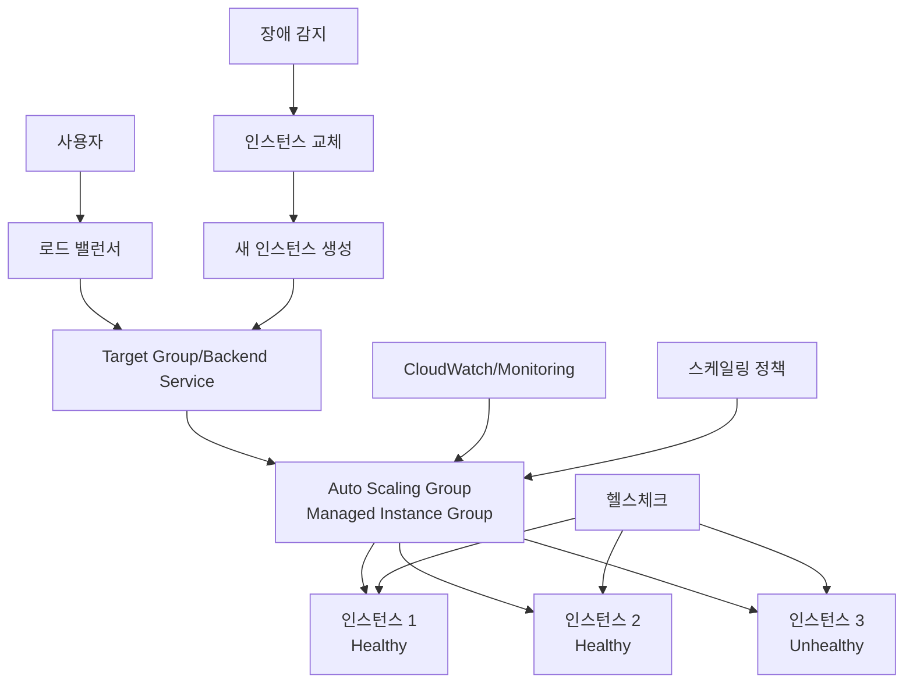
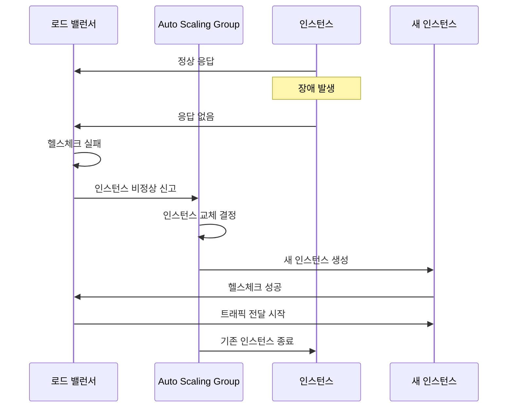

<div align="center">

## 🏠 최상위 네비게이션
[🏠 홈](/mcp_knowledge_base/index.md) | [📚 전체 커리큘럼](/mcp_knowledge_base/curriculum.md) | [🔗 학습 경로](/mcp_knowledge_base/cloud_master/learning-path.md)

## 📖 현재 위치
**Cloud Master** > **3일차** > **3교시: 로드 밸런서 + 오토스케일링 연동 및 상태 점검**

## ⬅️ 이전/다음 네비게이션
[← 이전: Cloud Master 메인](/mcp_knowledge_base/cloud_master/README.md) | [다음: Cloud Master 3일차 →](/mcp_knowledge_base/cloud_master/textbook/Day3/README.md)

</div>

<div align="center">

[← 이전: Cloud Master 3일차 메인](/mcp_knowledge_base/cloud_master/README.md) | [📚 전체 커리큘럼](/mcp_knowledge_base/curriculum.md) | [🏠 학습 경로로 돌아가기](/mcp_knowledge_base/index.md) | [← 이전: Cloud Master 메인](/mcp_knowledge_base/cloud_master/README.md) | [📋 학습 경로](/mcp_knowledge_base/cloud_master/learning-path.md) | [← 이전: 오토 스케일링 가이드](/mcp_knowledge_base/cloud_master/textbook/Day3/auto-scaling-guide.md) | [다음: 장애 복구 가이드 →](/mcp_knowledge_base/cloud_master/textbook/Day3/disaster-recovery-guide.md)

</div>

# 3교시: 로드 밸런서 + 오토스케일링 연동 및 상태 점검


## 📋 목차
1. [연동 아키텍처 이해](#연동-아키텍처-이해)
2. [헬스체크 메커니즘](#헬스체크-메커니즘)
3. [자가 치유(Self-Healing) 시스템](#자가-치유selfhealing-시스템)-시스템)
4. [실습 목표](#실습-목표)
5. [실습 절차](#실습-절차)
6. [실습 코드 예시](#실습-코드-예시)
7. [예상 결과](#예상-결과)
8. [혼자 해보기](#혼자-해보기)

---

## 🔗 연동 아키텍처 이해

### 로드 밸런서 + 오토스케일링 연동의 중요성

고가용성을 극대화하기 위해 **로드 밸런서와 오토스케일링을 함께 사용**합니다. 이 연동을 통해 다음과 같은 이점을 얻을 수 있습니다:

#### 1. **자동 트래픽 분산**
- 인스턴스 확장 시 자동으로 로드 밸런서에 등록
- 인스턴스 축소 시 자동으로 로드 밸런서에서 제거
- 수동 개입 없이 트래픽 분산 관리

#### 2. **장애 자동 복구**
- 비정상 인스턴스 자동 감지
- 새로운 인스턴스로 자동 교체
- 서비스 중단 최소화

#### 3. **동적 확장성**
- 트래픽 증가 시 자동 확장
- 트래픽 감소 시 자동 축소
- 비용 효율성과 성능의 균형

### 전체 아키텍처



---

## 🏥 헬스체크 메커니즘

### 헬스체크의 역할

헬스체크는 **인스턴스의 상태를 지속적으로 모니터링하여 정상/비정상을 판단하는 메커니즘**입니다.

#### 1. **로드 밸런서 헬스체크**
- **목적**: 트래픽 전달 대상 인스턴스 식별
- **동작**: 비정상 인스턴스로 트래픽 전달 중단
- **주기**: 30초마다 체크 (기본값)

#### 2. **오토스케일링 헬스체크**
- **목적**: 인스턴스 교체 필요성 판단
- **동작**: 비정상 인스턴스 자동 교체
- **주기**: 60초마다 체크 (기본값)

### 헬스체크 유형

#### 1. **HTTP/HTTPS 헬스체크**
```bash
# HTTP 헬스체크 설정
curl -f http://instance-ip/health || exit 1
```

#### 2. **TCP 헬스체크**
```bash
# TCP 포트 연결 확인
nc -z instance-ip 80 || exit 1
```

#### 3. **커스텀 헬스체크**
```bash
# 애플리케이션별 커스텀 체크
curl -f http://instance-ip/api/health/database || exit 1
```

### 헬스체크 설정 비교

| 구분 | AWS ELB | GCP Load Balancer |
|------|---------|-------------------|
| **체크 주기** | 30초 (기본) | 30초 (기본) |
| **타임아웃** | 5초 (기본) | 5초 (기본) |
| **건강 임계값** | 2회 성공 | 2회 성공 |
| **비건강 임계값** | 3회 실패 | 3회 실패 |
| **지연 시간** | 300초 (기본) | 300초 (기본) |

---

## 🔄 자가 치유(Self-Healing) 시스템

### 자가 치유의 개념

자가 치유는 **장애가 발생한 인스턴스를 자동으로 감지하고 새로운 인스턴스로 교체하여 서비스 연속성을 유지하는 시스템**입니다.

### 자가 치유 프로세스



### 자가 치유 시나리오

#### 1. **인스턴스 장애**
- 하드웨어 장애
- 운영체제 크래시
- 네트워크 연결 끊김

#### 2. **애플리케이션 장애**
- 애플리케이션 프로세스 종료
- 메모리 부족
- 데이터베이스 연결 실패

#### 3. **자동 복구 과정**
- 장애 감지 (헬스체크 실패)
- 새 인스턴스 생성
- 애플리케이션 배포
- 헬스체크 통과
- 트래픽 전달 재개

---

## 🎯 실습 목표

이 실습을 통해 다음을 달성합니다:

1. **연동 설정**: 로드 밸런서와 오토스케일링 그룹을 연동합니다.

2. **헬스체크 설정**: 다양한 헬스체크 옵션을 설정하고 테스트합니다.

3. **자가 치유 확인**: 인스턴스 장애 시 자동 복구 과정을 관찰합니다.

4. **모니터링 설정**: 시스템 상태를 실시간으로 모니터링합니다.

---

## 📝 실습 절차

### 1단계: 로드 밸런서와 오토스케일링 그룹 연동

#### AWS ELB와 ASG 연동
```bash
# Target Group 생성
aws elbv2 create-target-group \
  --name web-servers-tg \
  --protocol HTTP \
  --port 80 \
  --vpc-id vpc-12345 \
  --health-check-path /health \
  --health-check-interval-seconds 30 \
  --health-check-timeout-seconds 5 \
  --healthy-threshold-count 2 \
  --unhealthy-threshold-count 3

# ALB 생성
aws elbv2 create-load-balancer \
  --name web-alb \
  --subnets subnet-12345 subnet-67890 \
  --security-groups sg-12345

# ASG에 Target Group 연결
aws autoscaling attach-load-balancer-target-groups \
  --auto-scaling-group-name web-servers-asg \
  --target-group-arns arn:aws:elasticloadbalancing:region:account:targetgroup/web-servers-tg/1234567890123456

# ASG 헬스체크 설정
aws autoscaling update-auto-scaling-group \
  --auto-scaling-group-name web-servers-asg \
  --health-check-type ELB \
  --health-check-grace-period 300
```

#### GCP Load Balancer와 MIG 연동
```bash
# 백엔드 서비스 생성
gcloud compute backend-services create web-backend-service \
  --protocol=HTTP \
  --health-checks=web-health-check \
  --global

# MIG를 백엔드 서비스에 추가
gcloud compute backend-services add-backend web-backend-service \
  --instance-group=web-servers-mig \
  --instance-group-zone=us-central1-a \
  --global

# MIG 자동 복구 설정
gcloud compute instance-groups managed set-autohealing web-servers-mig \
  --zone us-central1-a \
  --health-check web-health-check \
  --initial-delay 300
```

### 2단계: 고급 헬스체크 설정

#### 애플리케이션 헬스체크 엔드포인트 생성

**health-check.sh (AWS/GCP 공통)**
```bash
#!/bin/bash
# 애플리케이션 헬스체크 스크립트

# 기본 헬스체크
if ! systemctl is-active --quiet httpd; then
    echo "HTTP service is not running"
    exit 1
fi

# 데이터베이스 연결 확인 (예시)
if ! curl -f http://localhost/health/database > /dev/null 2>&1; then
    echo "Database connection failed"
    exit 1
fi

# 디스크 공간 확인
DISK_USAGE=$(df / | awk 'NR==2 {print $5}' | sed 's/%//')
if [ $DISK_USAGE -gt 90 ]; then
    echo "Disk usage is too high: ${DISK_USAGE}%"
    exit 1
fi

# 메모리 사용량 확인
MEMORY_USAGE=$(free | awk 'NR==2{printf "%.0f", $3*100/$2}')
if [ $MEMORY_USAGE -gt 90 ]; then
    echo "Memory usage is too high: ${MEMORY_USAGE}%"
    exit 1
fi

echo "Health check passed"
exit 0
```

#### 헬스체크 웹 페이지 생성

**health.html**
```html
<!DOCTYPE html>
<html>
<head>
    <title>Health Check</title>
    <meta http-equiv="refresh" content="10">
</head>
<body>
    <h1>System Health Status</h1>
    <div id="status">
        <p>HTTP Service: <span id="http-status">Checking...</span></p>
        <p>Database: <span id="db-status">Checking...</span></p>
        <p>Disk Usage: <span id="disk-status">Checking...</span></p>
        <p>Memory Usage: <span id="memory-status">Checking...</span></p>
    </div>
    
    <script>
        function updateStatus() {
            fetch('/api/health')
                .then(response => response.json())
                .then(data => {
                    document.getElementById('http-status').textContent = data.http ? 'OK' : 'FAIL';
                    document.getElementById('db-status').textContent = data.database ? 'OK' : 'FAIL';
                    document.getElementById('disk-status').textContent = data.disk + '%';
                    document.getElementById('memory-status').textContent = data.memory + '%';
                })
                .catch(error => {
                    console.error('Health check failed:', error);
                });
        }
        
        updateStatus();
        setInterval(updateStatus, 10000);
    </script>
</body>
</html>
```

### 3단계: 모니터링 및 알림 설정

#### AWS CloudWatch 알림 설정
```bash
# CloudWatch 알람 생성
aws cloudwatch put-metric-alarm \
  --alarm-name "ASG-High-CPU" \
  --alarm-description "High CPU usage in ASG" \
  --metric-name CPUUtilization \
  --namespace AWS/EC2 \
  --statistic Average \
  --period 300 \
  --threshold 80 \
  --comparison-operator GreaterThanThreshold \
  --evaluation-periods 2 \
  --alarm-actions arn:aws:sns:region:account:alerts

# SNS 토픽 생성
aws sns create-topic --name alerts

# 이메일 구독
aws sns subscribe \
  --topic-arn arn:aws:sns:region:account:alerts \
  --protocol email \
  --notification-endpoint admin@example.com
```

#### GCP Cloud Monitoring 알림 설정
```bash
# 알림 정책 생성
gcloud alpha monitoring policies create \
  --policy-from-file=alert-policy.yaml

# 알림 정책 파일 (alert-policy.yaml)
cat > alert-policy.yaml << 'EOF'
displayName: "High CPU Usage"
conditions:
  - displayName: "CPU usage is high"
    conditionThreshold:
      filter: 'resource.type="gce_instance"'
      comparison: COMPARISON_GREATER_THAN
      thresholdValue: 0.8
      duration: 300s
      aggregations:
        - alignmentPeriod: 300s
          perSeriesAligner: ALIGN_MEAN
          crossSeriesReducer: REDUCE_MEAN
          groupByFields:
            - resource.label.instance_id
notificationChannels:
  - projects/PROJECT_ID/notificationChannels/CHANNEL_ID
EOF
```

### 4단계: 장애 시뮬레이션 및 복구 확인

#### 인스턴스 장애 시뮬레이션
```bash
# AWS: 인스턴스 강제 종료
INSTANCE_ID=$(aws autoscaling describe-auto-scaling-groups \
  --auto-scaling-group-names web-servers-asg \
  --query "AutoScalingGroups[0].Instances[0].InstanceId" \
  --output text)

aws ec2 terminate-instances --instance-ids $INSTANCE_ID

# GCP: 인스턴스 강제 삭제
gcloud compute instances delete web-server-0001 \
  --zone us-central1-a \
  --quiet
```

#### 복구 과정 모니터링
```bash
# AWS: ASG 상태 모니터링
watch -n 10 'aws autoscaling describe-auto-scaling-groups \
  --auto-scaling-group-names web-servers-asg \
  --query "AutoScalingGroups[0].Instances[].{InstanceId:InstanceId,HealthStatus:HealthStatus,LifecycleState:LifecycleState}" \
  --output table'

# GCP: MIG 상태 모니터링
watch -n 10 'gcloud compute instance-groups managed list-instances web-servers-mig \
  --zone us-central1-a \
  --format="table(instance,status,currentAction)"'
```

### 5단계: 애플리케이션 장애 시뮬레이션

#### 애플리케이션 프로세스 종료
```bash
# AWS: HTTP 서비스 중지
aws ssm send-command \
  --instance-ids $(aws autoscaling describe-auto-scaling-groups \
    --auto-scaling-group-names web-servers-asg \
    --query "AutoScalingGroups[0].Instances[0].InstanceId" \
    --output text) \
  --document-name "AWS-RunShellScript" \
  --parameters 'commands=["sudo systemctl stop httpd"]'

# GCP: HTTP 서비스 중지
gcloud compute ssh web-server-0001 \
  --zone us-central1-a \
  --command="sudo systemctl stop apache2"
```

#### 헬스체크 실패 및 복구 확인
```bash
# 헬스체크 상태 확인
curl -f http://<LOAD_BALANCER_IP>/health

# 로드 밸런서에서 인스턴스 상태 확인
# AWS
aws elbv2 describe-target-health \
  --target-group-arn arn:aws:elasticloadbalancing:region:account:targetgroup/web-servers-tg/1234567890123456

# GCP
gcloud compute backend-services get-health web-backend-service \
  --global
```

---

## 💻 실습 코드 예시

### 고급 헬스체크 설정

#### AWS Target Group 고급 설정
```bash
# 고급 헬스체크 설정
aws elbv2 modify-target-group \
  --target-group-arn arn:aws:elasticloadbalancing:region:account:targetgroup/web-servers-tg/1234567890123456 \
  --health-check-path /health \
  --health-check-interval-seconds 15 \
  --health-check-timeout-seconds 3 \
  --healthy-threshold-count 3 \
  --unhealthy-threshold-count 2 \
  --health-check-enabled

# 헬스체크 응답 코드 설정
aws elbv2 modify-target-group \
  --target-group-arn arn:aws:elasticloadbalancing:region:account:targetgroup/web-servers-tg/1234567890123456 \
  --matcher HttpCode=200,201
```

#### GCP 백엔드 서비스 고급 설정
```bash
# 고급 헬스체크 설정
gcloud compute health-checks create http web-health-check \
  --port=80 \
  --request-path=/health \
  --check-interval=15s \
  --timeout=3s \
  --healthy-threshold=3 \
  --unhealthy-threshold=2 \
  --response=200

# 백엔드 서비스 설정
gcloud compute backend-services update web-backend-service \
  --global \
  --timeout=30s \
  --connection-draining-timeout=300s
```

### 자동 복구 설정

#### AWS ASG 자동 복구
```bash
# ASG 자동 복구 설정
aws autoscaling update-auto-scaling-group \
  --auto-scaling-group-name web-servers-asg \
  --health-check-type ELB \
  --health-check-grace-period 300 \
  --termination-policies "OldestInstance"

# 인스턴스 보호 설정
aws autoscaling set-instance-protection \
  --auto-scaling-group-name web-servers-asg \
  --instance-ids $INSTANCE_ID \
  --protected-from-scale-in
```

#### GCP MIG 자동 복구
```bash
# MIG 자동 복구 설정
gcloud compute instance-groups managed set-autohealing web-servers-mig \
  --zone us-central1-a \
  --health-check web-health-check \
  --initial-delay 300

# 인스턴스 템플릿 업데이트
gcloud compute instance-templates update web-server-template \
  --update-disks=auto-delete=yes
```

---

## ✅ 예상 결과

### 연동 동작
- ASG/MIG에서 인스턴스 생성 시 자동으로 로드 밸런서에 등록
- ASG/MIG에서 인스턴스 삭제 시 자동으로 로드 밸런서에서 제거
- 트래픽이 정상 인스턴스로만 전달

### 헬스체크 동작
- 정상 인스턴스는 Healthy 상태로 표시
- 비정상 인스턴스는 Unhealthy 상태로 표시
- 비정상 인스턴스로는 트래픽 전달 중단

### 자가 치유 동작
- 인스턴스 장애 감지 후 자동으로 새 인스턴스 생성
- 새 인스턴스가 헬스체크 통과 후 트래픽 전달 시작
- 기존 비정상 인스턴스 자동 종료
- 서비스 중단 없이 복구 완료

---

## 🚀 혼자 해보기

### 기본 과제
1. **다양한 장애 시뮬레이션**: 네트워크 장애, 디스크 공간 부족, 메모리 부족 등을 시뮬레이션해 보세요.

2. **헬스체크 임계값 조정**: 헬스체크 임계값을 조정하여 민감도를 변경해 보세요.

3. **알림 설정**: 다양한 알림 채널(SMS, Slack, Email)을 설정해 보세요.

### 고급 과제
1. **커스텀 헬스체크**: 애플리케이션별 커스텀 헬스체크를 구현해 보세요.

2. **다중 리전 복구**: 여러 리전에 걸친 자동 복구 시스템을 구축해 보세요.

3. **예측적 복구**: 머신러닝을 활용한 예측적 복구 시스템을 구현해 보세요.

---

## ❓ 퀴즈

1. **ASG와 ELB의 헬스체크는 어떤 차이가 있나요?**

2. **AWS에서 ELB 상태 체크를 활성화하면 어떤 이점이 있나요?**

3. **자가 치유 시스템이 작동하는 과정을 단계별로 설명해 보세요.**

4. **헬스체크 임계값을 조정할 때 고려해야 할 요소들은 무엇인가요?**

---

## ✅ 체크리스트

- [ ] ASG/MIG가 로드 밸런서에 정상적으로 연결되었나요?
- [ ] 헬스체크 기능이 활성화되었나요?
- [ ] 인스턴스 강제 종료 시 새로운 인스턴스가 기동되었나요?
- [ ] 로드 밸런서에서 비정상 인스턴스가 자동으로 제외되었나요?
- [ ] 애플리케이션 장애 시 자동 복구가 작동했나요?
- [ ] 모니터링 및 알림이 정상 설정되었나요?

---

## 📚 추가 학습 자료

- [AWS Auto Scaling 헬스체크 가이드](https://docs.aws.amazon.com/autoscaling/ec2/userguide/ec2-auto-scaling-health-checks.html)
- [GCP Managed Instance Groups 가이드](https://cloud.google.com/compute/docs/instance-groups)
- [로드 밸런싱 모범 사례](https://aws.amazon.com/architecture/well-architected/)
- [자가 치유 시스템 설계](https://cloud.google.com/architecture/self-healing-applications)

다음 단계: [4교시: 장애 시뮬레이션 및 복구](/mcp_knowledge_base/cloud_master/textbook/Day3/disaster-recovery-guide.md)

---


## 🔄 자가 치유(Self-healing) 시스템

## 자가 치유(Self-healing) 시스템


---

<div align="center">

## 🔗 관련 과정 및 네비게이션
[🏠 홈](/mcp_knowledge_base/index.md) | [📚 전체 커리큘럼](/mcp_knowledge_base/curriculum.md) | [🔗 학습 경로](/mcp_knowledge_base/cloud_master/learning-path.md)

## 📖 현재 위치
**Cloud Master** > **3일차** > **3교시: 로드 밸런서 + 오토스케일링 연동 및 상태 점검**

## ⬅️ 이전/다음 네비게이션
[← 이전: Cloud Master 메인](/mcp_knowledge_base/cloud_master/README.md) | [다음: Cloud Master 3일차 →](/mcp_knowledge_base/cloud_master/textbook/Day3/README.md)

## 🔗 관련 과정
[Cloud Basic 2일차](/mcp_knowledge_base/cloud_basic/textbook/Day2/README.md) | [Cloud Container 1일차](/mcp_knowledge_base/cloud_container/textbook/Day1/README.md)

</div>

### 📧 연락처
- **이메일**: inhwan.jung@gmail.com
- **GitHub**: [프로젝트 저장소](https://github.com/jungfrau70/aws_gcp.git)
