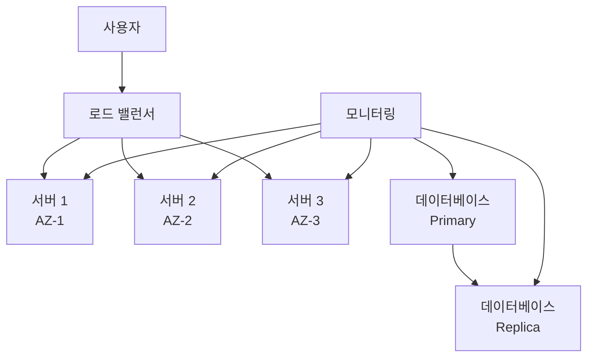
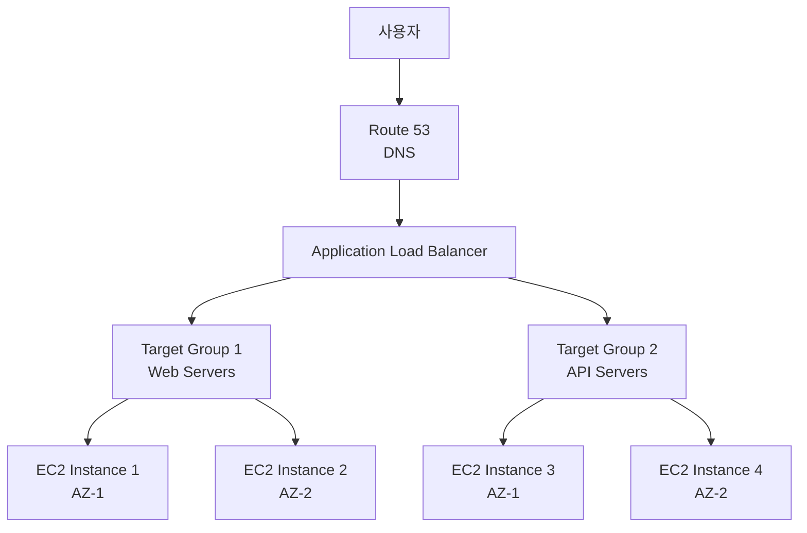

# 1교시: 고가용성 및 로드 밸런싱

<div align="center">

[← 이전: Cloud Master 3일차 메인](../README.md) | [📚 전체 커리큘럼](../../../curriculum.md) | [🏠 학습 경로로 돌아가기](../../../index.md)

</div>

## 📋 목차
1. [고가용성 개념 이해](#고가용성-개념-이해)
2. [로드 밸런싱 개념](#로드-밸런싱-개념)
3. [AWS ELB vs GCP Cloud Load Balancing 비교](#aws-elb-vs-gcp-cloud-load-balancing-비교)
4. [로드 밸런싱 알고리즘](#로드-밸런싱-알고리즘)
5. [실습 목표](#실습-목표)
6. [실습 절차](#실습-절차)
7. [실습 코드 예시](#실습-코드-예시)
8. [예상 결과](#예상-결과)
9. [혼자 해보기](#혼자-해보기)

---

## 🏗️ 고가용성 개념 이해

### 고가용성(High Availability)이란?

고가용성은 **시스템이 장애 발생 시에도 서비스를 계속 제공할 수 있도록 여러 구성 요소를 중복 배치하는 설계 원칙**입니다.

### 고가용성의 핵심 요소

#### 1. **다중화(Redundancy)**
- 여러 서버, 데이터베이스, 네트워크 경로를 중복 배치
- 단일 장애점(Single Point of Failure) 제거

#### 2. **장애 감지(Failure Detection)**
- 헬스체크를 통한 서비스 상태 모니터링
- 자동 장애 감지 및 대응

#### 3. **자동 복구(Automatic Recovery)**
- 장애 발생 시 자동으로 정상 서비스로 전환
- 사용자 개입 없이 서비스 연속성 유지

### 고가용성 구현 방법



### 가용성 수준

| 가용성 수준 | 다운타임/년 | 다운타임/월 | 설명 |
|-------------|-------------|-------------|------|
| **99%** | 3.65일 | 7.2시간 | 기본적인 고가용성 |
| **99.9%** | 8.76시간 | 43.2분 | 일반적인 클라우드 서비스 |
| **99.99%** | 52.56분 | 4.32분 | 높은 가용성 요구사항 |
| **99.999%** | 5.26분 | 25.9초 | 매우 높은 가용성 요구사항 |

---

## ⚖️ 로드 밸런싱 개념

### 로드 밸런싱이란?

로드 밸런싱은 **사용자 요청을 여러 백엔드 서버에 고르게 분산시켜 특정 서버의 과부하를 방지하고 시스템 안정성을 높이는 기술**입니다.

### 로드 밸런싱의 장점

| 장점 | 설명 |
|------|------|
| **성능 향상** | 트래픽 분산으로 응답 시간 단축 |
| **가용성 향상** | 서버 장애 시 다른 서버로 자동 전환 |
| **확장성** | 트래픽 증가에 따른 서버 추가 용이 |
| **보안** | 백엔드 서버 직접 노출 방지 |

### 로드 밸런싱 계층

#### 1. **L4 (Transport Layer)**
- TCP/UDP 레벨에서 로드 밸런싱
- 빠른 처리 속도, 단순한 로직
- 예: AWS NLB, GCP Network Load Balancer

#### 2. **L7 (Application Layer)**
- HTTP/HTTPS 레벨에서 로드 밸런싱
- 고급 라우팅, SSL 종료, 콘텐츠 기반 라우팅
- 예: AWS ALB, GCP HTTP(S) Load Balancer

---

## ☁️ AWS ELB vs GCP Cloud Load Balancing 비교

### 로드 밸런서 유형 비교

| 구분 | AWS ELB | GCP Cloud Load Balancing |
|------|---------|--------------------------|
| **Application Load Balancer** | ALB (L7) | HTTP(S) Load Balancer (L7) |
| **Network Load Balancer** | NLB (L4) | Network Load Balancer (L4) |
| **Classic Load Balancer** | CLB (L4/L7) | TCP/UDP Load Balancer (L4) |
| **Global Load Balancer** | CloudFront | Global HTTP(S) Load Balancer |

### 기능 비교표

| 기능 | AWS ALB | AWS NLB | GCP HTTP(S) LB | GCP Network LB |
|------|---------|---------|----------------|----------------|
| **계층** | L7 | L4 | L7 | L4 |
| **SSL 종료** | ✅ | ❌ | ✅ | ❌ |
| **Path 기반 라우팅** | ✅ | ❌ | ✅ | ❌ |
| **Host 기반 라우팅** | ✅ | ❌ | ✅ | ❌ |
| **WebSocket 지원** | ✅ | ✅ | ✅ | ✅ |
| **고정 IP** | ❌ | ✅ | ✅ | ✅ |
| **Global Anycast** | ❌ | ❌ | ✅ | ❌ |
| **가격** | 중간 | 낮음 | 중간 | 낮음 |

### 아키텍처 비교

#### AWS ELB 아키텍처


#### GCP Cloud Load Balancing 아키텍처
```mermaid
graph TB
    A[사용자] --> B[Global HTTP(S) Load Balancer]
    B --> C[Backend Service 1<br/>Web Servers]
    B --> D[Backend Service 2<br/>API Servers]
    
    C --> E[Instance Group 1<br/>Region 1]
    C --> F[Instance Group 2<br/>Region 2]
    
    D --> G[Instance Group 3<br/>Region 1]
    D --> H[Instance Group 4<br/>Region 2]
```

---

## 🔄 로드 밸런싱 알고리즘

### 주요 알고리즘

#### 1. **Round Robin (라운드 로빈)**
- 요청을 순서대로 각 서버에 분배
- 가장 기본적이고 단순한 방식
- 서버 성능이 동일할 때 효과적

#### 2. **Least Connections (최소 연결)**
- 현재 연결 수가 가장 적은 서버에 요청 전달
- 세션이 오래 지속되는 경우에 효과적
- 서버 부하를 고려한 분산

#### 3. **Weighted Round Robin (가중 라운드 로빈)**
- 서버별로 가중치를 부여하여 분배
- 성능이 다른 서버들에 적합
- 가중치에 비례하여 요청 분배

#### 4. **IP Hash (IP 해시)**
- 클라이언트 IP를 기반으로 서버 선택
- 동일한 클라이언트는 항상 같은 서버로 연결
- 세션 유지가 필요한 경우에 사용

### 알고리즘 선택 가이드

| 상황 | 권장 알고리즘 | 이유 |
|------|---------------|------|
| **서버 성능 동일** | Round Robin | 단순하고 효과적 |
| **서버 성능 상이** | Weighted Round Robin | 성능에 맞는 분배 |
| **장시간 세션** | Least Connections | 부하 고려 |
| **세션 유지 필요** | IP Hash | 일관된 서버 연결 |

---

## 🎯 실습 목표

이 실습을 통해 다음을 달성합니다:

1. **고가용성 구현**: 여러 가용 영역에 웹 서버를 배치하고 로드 밸런서로 연결합니다.

2. **로드 밸런싱 체험**: 트래픽이 여러 서버에 분산되는 것을 확인합니다.

3. **장애 대응**: 서버 장애 시 자동으로 다른 서버로 전환되는 것을 확인합니다.

4. **플랫폼 비교**: AWS와 GCP의 로드 밸런싱 서비스를 비교해봅니다.

---

## 📝 실습 절차

### 1단계: 웹 서버 인스턴스 준비

#### AWS EC2 인스턴스 생성
```bash
# 보안 그룹 생성 (HTTP 포트 80 개방)
aws ec2 create-security-group \
  --group-name web-servers-sg \
  --description "Security group for web servers"

aws ec2 authorize-security-group-ingress \
  --group-name web-servers-sg \
  --protocol tcp \
  --port 80 \
  --cidr 0.0.0.0/0

# EC2 인스턴스 2대 생성 (서로 다른 AZ)
aws ec2 run-instances \
  --image-id ami-0abcdef1234567890 \
  --count 2 \
  --instance-type t2.micro \
  --security-groups web-servers-sg \
  --subnet-id subnet-12345 \
  --user-data file://user-data.sh
```

#### GCP Compute Engine 인스턴스 생성
```bash
# 방화벽 규칙 생성
gcloud compute firewall-rules create allow-http \
  --allow tcp:80 \
  --source-ranges 0.0.0.0/0 \
  --description "Allow HTTP traffic"

# 인스턴스 2대 생성 (서로 다른 존)
gcloud compute instances create web-server-1 \
  --zone=us-central1-a \
  --machine-type=e2-micro \
  --image-family=debian-11 \
  --image-project=debian-cloud \
  --metadata-from-file startup-script=startup-script.sh

gcloud compute instances create web-server-2 \
  --zone=us-central1-b \
  --machine-type=e2-micro \
  --image-family=debian-11 \
  --image-project=debian-cloud \
  --metadata-from-file startup-script=startup-script.sh
```

#### 웹 서버 설정 스크립트

**user-data.sh (AWS)**
```bash
#!/bin/bash
yum update -y
yum install -y httpd
systemctl start httpd
systemctl enable httpd

# 서버 식별을 위한 HTML 페이지 생성
echo "<h1>Hello from AWS Server $(hostname)</h1>" > /var/www/html/index.html
echo "<p>Server IP: $(curl -s http://169.254.169.254/latest/meta-data/local-ipv4)</p>" >> /var/www/html/index.html
echo "<p>Availability Zone: $(curl -s http://169.254.169.254/latest/meta-data/placement/availability-zone)</p>" >> /var/www/html/index.html
```

**startup-script.sh (GCP)**
```bash
#!/bin/bash
apt-get update
apt-get install -y apache2
systemctl start apache2
systemctl enable apache2

# 서버 식별을 위한 HTML 페이지 생성
echo "<h1>Hello from GCP Server $(hostname)</h1>" > /var/www/html/index.html
echo "<p>Server IP: $(curl -s http://metadata.google.internal/computeMetadata/v1/instance/network-interfaces/0/ip -H "Metadata-Flavor: Google")</p>" >> /var/www/html/index.html
echo "<p>Zone: $(curl -s http://metadata.google.internal/computeMetadata/v1/instance/zone -H "Metadata-Flavor: Google")</p>" >> /var/www/html/index.html
```

### 2단계: AWS Application Load Balancer 생성

#### ALB 생성
```bash
# Target Group 생성
aws elbv2 create-target-group \
  --name web-servers-tg \
  --protocol HTTP \
  --port 80 \
  --vpc-id vpc-12345 \
  --health-check-path / \
  --health-check-interval-seconds 30 \
  --health-check-timeout-seconds 5 \
  --healthy-threshold-count 2 \
  --unhealthy-threshold-count 3

# ALB 생성
aws elbv2 create-load-balancer \
  --name my-web-alb \
  --subnets subnet-12345 subnet-67890 \
  --security-groups sg-12345

# Target Group에 인스턴스 등록
aws elbv2 register-targets \
  --target-group-arn arn:aws:elasticloadbalancing:region:account:targetgroup/web-servers-tg/1234567890123456 \
  --targets Id=i-1234567890abcdef0 Id=i-0fedcba9876543210

# Listener 생성
aws elbv2 create-listener \
  --load-balancer-arn arn:aws:elasticloadbalancing:region:account:loadbalancer/app/my-web-alb/1234567890123456 \
  --protocol HTTP \
  --port 80 \
  --default-actions Type=forward,TargetGroupArn=arn:aws:elasticloadbalancing:region:account:targetgroup/web-servers-tg/1234567890123456
```

### 3단계: GCP HTTP(S) Load Balancer 생성

#### HTTP Load Balancer 생성
```bash
# 인스턴스 그룹 생성
gcloud compute instance-groups unmanaged create web-servers-ig \
  --zone=us-central1-a

gcloud compute instance-groups unmanaged add-instances web-servers-ig \
  --instances=web-server-1,web-server-2 \
  --zone=us-central1-a

# 헬스체크 생성
gcloud compute health-checks create http web-health-check \
  --port=80 \
  --request-path=/ \
  --check-interval=30s \
  --timeout=5s \
  --healthy-threshold=2 \
  --unhealthy-threshold=3

# 백엔드 서비스 생성
gcloud compute backend-services create web-backend-service \
  --protocol=HTTP \
  --health-checks=web-health-check \
  --global

# 백엔드 서비스에 인스턴스 그룹 추가
gcloud compute backend-services add-backend web-backend-service \
  --instance-group=web-servers-ig \
  --instance-group-zone=us-central1-a \
  --global

# URL 맵 생성
gcloud compute url-maps create web-url-map \
  --default-service=web-backend-service

# 타겟 프록시 생성
gcloud compute target-http-proxies create web-http-proxy \
  --url-map=web-url-map

# 전달 규칙 생성
gcloud compute forwarding-rules create web-forwarding-rule \
  --global \
  --target-http-proxy=web-http-proxy \
  --ports=80
```

### 4단계: 로드 밸런싱 테스트

#### 부하 테스트 실행
```bash
# Apache Bench를 사용한 부하 테스트
# AWS ALB 테스트
ab -n 100 -c 10 http://my-web-alb-1234567890.us-west-2.elb.amazonaws.com/

# GCP Load Balancer 테스트
ab -n 100 -c 10 http://<GCP_LOAD_BALANCER_IP>/

# 여러 번 요청하여 분산 확인
for i in {1..10}; do
  curl http://my-web-alb-1234567890.us-west-2.elb.amazonaws.com/
  echo "---"
done
```

#### 헬스체크 확인
```bash
# AWS Target Group 상태 확인
aws elbv2 describe-target-health \
  --target-group-arn arn:aws:elasticloadbalancing:region:account:targetgroup/web-servers-tg/1234567890123456

# GCP 백엔드 서비스 상태 확인
gcloud compute backend-services get-health web-backend-service \
  --global
```

### 5단계: 장애 시뮬레이션

#### 인스턴스 중지
```bash
# AWS 인스턴스 중지
aws ec2 stop-instances --instance-ids i-1234567890abcdef0

# GCP 인스턴스 중지
gcloud compute instances stop web-server-1 --zone=us-central1-a
```

#### 로드 밸런서 동작 확인
```bash
# 중지된 인스턴스가 Unhealthy로 표시되는지 확인
# 다른 인스턴스로만 트래픽이 전달되는지 확인
curl http://my-web-alb-1234567890.us-west-2.elb.amazonaws.com/
```

---

## 💻 실습 코드 예시

### 고급 ALB 설정

#### Path 기반 라우팅
```bash
# API 서버용 Target Group 생성
aws elbv2 create-target-group \
  --name api-servers-tg \
  --protocol HTTP \
  --port 8080 \
  --vpc-id vpc-12345

# Path 기반 라우팅 규칙 추가
aws elbv2 create-rule \
  --listener-arn arn:aws:elasticloadbalancing:region:account:listener/app/my-web-alb/1234567890123456/1234567890123456 \
  --priority 100 \
  --conditions Field=path-pattern,Values='/api/*' \
  --actions Type=forward,TargetGroupArn=arn:aws:elasticloadbalancing:region:account:targetgroup/api-servers-tg/1234567890123456
```

#### Host 기반 라우팅
```bash
# Host 기반 라우팅 규칙 추가
aws elbv2 create-rule \
  --listener-arn arn:aws:elasticloadbalancing:region:account:listener/app/my-web-alb/1234567890123456/1234567890123456 \
  --priority 200 \
  --conditions Field=host-header,Values='api.example.com' \
  --actions Type=forward,TargetGroupArn=arn:aws:elasticloadbalancing:region:account:targetgroup/api-servers-tg/1234567890123456
```

### 고급 GCP Load Balancer 설정

#### 다중 백엔드 서비스
```bash
# API 서버용 백엔드 서비스 생성
gcloud compute backend-services create api-backend-service \
  --protocol=HTTP \
  --health-checks=web-health-check \
  --global

# URL 맵에 경로 규칙 추가
gcloud compute url-maps add-path-matcher web-url-map \
  --path-matcher-name=api-matcher \
  --default-service=web-backend-service \
  --path-rules="/api/*=api-backend-service"
```

#### SSL 인증서 설정
```bash
# SSL 인증서 생성
gcloud compute ssl-certificates create web-ssl-cert \
  --domains=example.com,www.example.com

# HTTPS 타겟 프록시 생성
gcloud compute target-https-proxies create web-https-proxy \
  --url-map=web-url-map \
  --ssl-certificates=web-ssl-cert

# HTTPS 전달 규칙 생성
gcloud compute forwarding-rules create web-https-forwarding-rule \
  --global \
  --target-https-proxy=web-https-proxy \
  --ports=443
```

---

## ✅ 예상 결과

### 로드 밸런싱 동작
- 로드 밸런서 DNS/IP로 접속 시 두 서버가 번갈아 응답
- 각 서버의 응답 비율이 약 50:50으로 분산
- 서버 식별 정보(호스트명, IP, AZ)가 번갈아 표시

### 헬스체크 동작
- 정상 인스턴스는 Healthy 상태로 표시
- 중지된 인스턴스는 Unhealthy 상태로 표시
- Unhealthy 인스턴스로는 트래픽 전달 중단

### 장애 대응
- 인스턴스 중지 시 다른 인스턴스로만 트래픽 전달
- 서비스 중단 없이 계속 응답
- 인스턴스 재시작 시 자동으로 트래픽 전달 재개

---

## 🚀 혼자 해보기

### 기본 과제
1. **HTTPS 설정**: SSL 인증서를 추가하여 HTTPS 로드 밸런싱을 구현해 보세요.

2. **다중 백엔드**: 웹 서버와 API 서버를 분리하여 Path 기반 라우팅을 설정해 보세요.

3. **고정 IP**: GCP에서 고정 IP를 할당하여 로드 밸런서에 연결해 보세요.

### 고급 과제
1. **Cross-Region 로드 밸런싱**: 여러 리전에 서버를 배치하고 Global Load Balancer를 설정해 보세요.

2. **CDN 연동**: CloudFront(AWS) 또는 Cloud CDN(GCP)을 연동하여 정적 콘텐츠를 최적화해 보세요.

3. **모니터링 설정**: CloudWatch(AWS) 또는 Cloud Monitoring(GCP)을 설정하여 로드 밸런서 메트릭을 모니터링해 보세요.

---

## ❓ 퀴즈

1. **로드 밸런서가 인스턴스를 고르게 선택하는 대표적인 알고리즘 3가지를 말해보세요.**

2. **L4와 L7 로드 밸런서의 차이점은 무엇인가요?**

3. **고가용성을 구현하기 위한 핵심 요소 3가지는 무엇인가요?**

4. **AWS ALB와 GCP HTTP(S) Load Balancer의 주요 차이점은 무엇인가요?**

---

## ✅ 체크리스트

- [ ] 웹 서버 인스턴스 2대 이상이 생성되었나요?
- [ ] 각 인스턴스에 웹 서비스가 정상 동작하나요?
- [ ] 로드 밸런서가 생성되고 인스턴스가 대상으로 등록되었나요?
- [ ] 로드 밸런서의 IP/DNS를 통해 서비스가 정상 분산 응답되나요?
- [ ] 헬스체크가 정상 작동하나요?
- [ ] 인스턴스 중지 시 다른 인스턴스로 트래픽이 전환되나요?

---

## 📚 추가 학습 자료

- [AWS ELB 공식 문서](https://docs.aws.amazon.com/elasticloadbalancing/)
- [GCP Load Balancing 공식 문서](https://cloud.google.com/load-balancing/docs)
- [로드 밸런싱 알고리즘 가이드](https://www.nginx.com/resources/glossary/load-balancing/)
- [고가용성 설계 패턴](https://aws.amazon.com/architecture/well-architected/)

다음 단계: [2교시: 오토 스케일링](./auto-scaling-guide.md)

---

<div align="center">

[← 이전: Cloud Master 2일차](../Day2/README) | [📚 전체 커리큘럼](../../../curriculum) | [다음: 오토 스케일링 가이드 →](./auto-scaling-guide)

</div>