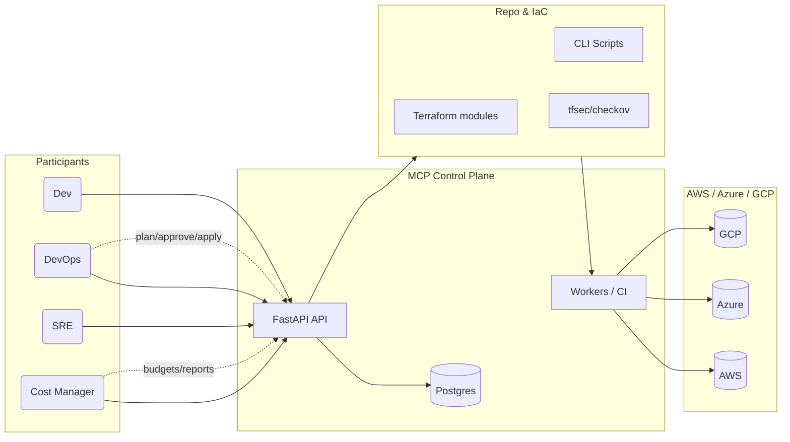

## MCP 기반 멀티클라우드 실습 아키텍처

```mermaid
flowchart LR
  subgraph User["Participants"]
    U1(Dev)
    U2(DevOps)
    U3(SRE)
    U4(Cost Manager)
  end

  subgraph MCP["MCP Control Plane"]
    API[FastAPI API]
    Queue[Workers / CI]
    DB[(Postgres)]
  end

  subgraph Repo["Repo & IaC"]
    IaC[Terraform modules]
    CLI[CLI Scripts]
    Scan[tfsec/checkov]
  end

  subgraph Clouds["AWS / Azure / GCP"]
    AWS[(AWS)]
    AZ[(Azure)]
    GCP[(GCP)]
  end

  U1 --> API
  U2 --> API
  U3 --> API
  U4 --> API
  API --> Repo
  Repo --> Queue
  Queue --> AWS
  Queue --> AZ
  Queue --> GCP
  Repo --> Scan
  API --> DB

  U4 -. budgets/reports .-> API
  U2 -. plan/approve/apply .-> API
```

설명:
- 사용자는 MCP/API를 통해 시나리오를 실행하고, IaC/CLI는 워커에서 실행됩니다.
- 보안 스캔(tfsec/checkov)과 비용(예산/리포트)은 파이프라인에 통합됩니다.
- 비용관리자 역할은 변경 권한 없이 예산/리포트만 수행합니다.

