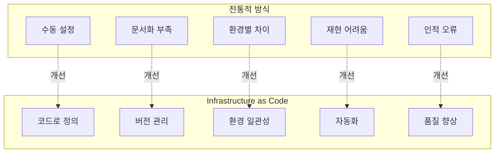
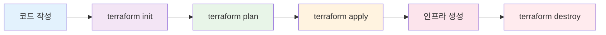
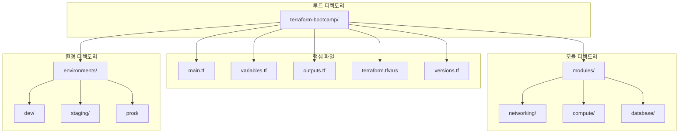
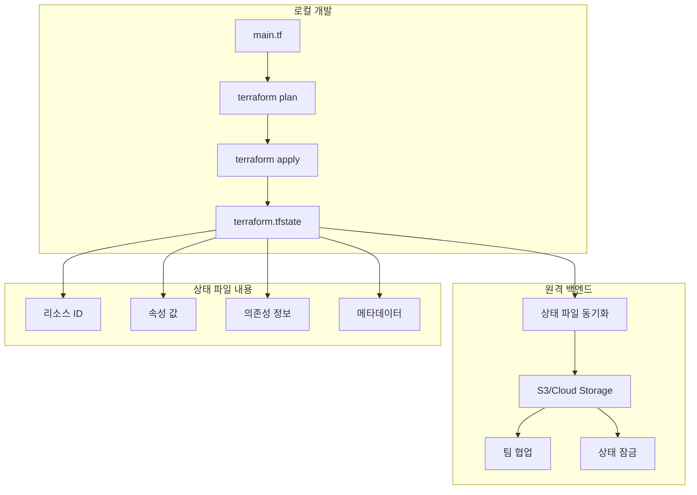
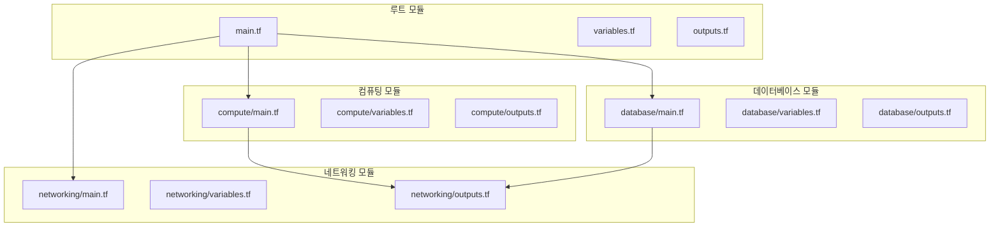
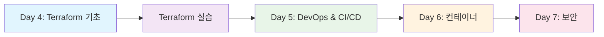

# 4-1. Terraform 소개 및 기본 사용법

**Infrastructure as Code로 클라우드 인프라를 코드로 관리하기**


---

## 학습 목표

**이번 강의를 통해 다음을 달성할 수 있습니다:**

- Terraform의 개념과 IaC(Infrastructure as Code) 이해
- Terraform 설치 및 초기 설정
- HCL(HashiCorp Configuration Language) 문법 학습
- 기본 리소스 생성 및 관리 방법
- 상태 관리 및 워크스페이스 개념 이해

---

## Terraform이란?

### Infrastructure as Code (IaC)
> **Terraform**은 HashiCorp에서 개발한 오픈소스 IaC 도구로, 클라우드 인프라를 코드로 정의하고 관리할 수 있게 해주는 도구

### 핵심 특징
- **멀티 클라우드 지원**: AWS, GCP, Azure 등 모든 주요 클라우드 지원
- **선언적 언어**: 원하는 상태를 선언하면 Terraform이 자동으로 구현
- **상태 관리**: 인프라의 현재 상태를 추적하고 관리
- **의존성 관리**: 리소스 간의 의존성을 자동으로 처리
- **버전 관리**: Git과 연동하여 인프라 변경 이력 추적

---

## IaC vs 전통적 인프라 관리



---

## Terraform 워크플로우



**워크플로우 단계:**
1. **코드 작성**: HCL로 인프라 정의
2. **초기화**: 프로바이더 및 백엔드 설정
3. **계획**: 변경 사항 미리보기
4. **적용**: 실제 인프라 생성/변경
5. **정리**: 리소스 삭제 (필요시)

---

## Terraform 설치 및 설정

### 운영체제별 설치 방법

| 운영체제 | 패키지 매니저 | 명령어 | 수동 설치 |
|----------|---------------|--------|-----------|
| **Windows** | Chocolatey | `choco install terraform` | [공식 다운로드](https://www.terraform.io/downloads.html) |
| **macOS** | Homebrew | `brew install terraform` | [공식 다운로드](https://www.terraform.io/downloads.html) |
| **Ubuntu/Debian** | APT | `curl -fsSL \| sudo apt-key add -` | [공식 다운로드](https://www.terraform.io/downloads.html) |
| **CentOS/RHEL** | YUM | `sudo yum install terraform` | [공식 다운로드](https://www.terraform.io/downloads.html) |

### 설치 확인
```bash
# 버전 확인
terraform --version

# 도움말 확인
terraform --help
```

---

## Terraform 프로젝트 구조

### 기본 디렉토리 구조

```
terraform-bootcamp/
├── 📁 main.tf          # 주요 리소스 정의
├── 📁 variables.tf     # 변수 정의
├── 📁 outputs.tf       # 출력 값 정의
├── 📁 terraform.tfvars # 변수 값 설정
├── 📁 versions.tf      # Terraform 및 프로바이더 버전
├── 📁 modules/         # 재사용 가능한 모듈
│   ├── 📁 networking/
│   ├── 📁 compute/
│   └── 📁 database/
├── 📁 environments/    # 환경별 설정
│   ├── 📁 dev/
│   ├── 📁 staging/
│   └── 📁 prod/
└── 📁 .gitignore      # Git 무시 파일
```

---

## 프로젝트 구조 시각화



---

## HCL 문법 기초

### 기본 문법 구조

```hcl
# 리소스 정의
resource "aws_instance" "web_server" {
  ami           = "ami-12345678"
  instance_type = "t2.micro"
  
  tags = {
    Name = "Web Server"
    Environment = "Production"
  }
}

# 변수 정의
variable "instance_type" {
  description = "EC2 인스턴스 타입"
  type        = string
  default     = "t2.micro"
}

# 출력 정의
output "public_ip" {
  description = "퍼블릭 IP 주소"
  value       = aws_instance.web_server.public_ip
}
```

---

## HCL 문법 요소

### 데이터 타입 및 구조

| 데이터 타입 | 예시 | 설명 |
|-------------|------|------|
| **string** | `"hello"` | 문자열 값 |
| **number** | `42` | 숫자 값 |
| **bool** | `true` | 불린 값 |
| **list** | `["a", "b", "c"]` | 리스트 |
| **map** | `{key = "value"}` | 키-값 쌍 |
| **object** | `{name = "test"}` | 구조화된 객체 |

### 변수 유효성 검사
```hcl
variable "instance_count" {
  description = "생성할 인스턴스 수"
  type        = number
  default     = 1
  
  validation {
    condition     = var.instance_count > 0 && var.instance_count <= 10
    error_message = "인스턴스 수는 1-10 사이여야 합니다."
  }
}
```

---

## Terraform 프로바이더

### 주요 클라우드 프로바이더

| 프로바이더 | 공식 이름 | 주요 서비스 | 설정 예시 |
|------------|-----------|-------------|-----------|
| **AWS** | `hashicorp/aws` | EC2, S3, RDS, VPC | `region = "ap-northeast-2"` |
| **GCP** | `hashicorp/google` | Compute Engine, Cloud Storage, Cloud SQL | `project = "my-project"` |
| **Azure** | `hashicorp/azurerm` | Virtual Machines, Blob Storage, SQL Database | `location = "East US"` |
| **Kubernetes** | `hashicorp/kubernetes` | Pods, Services, Deployments | `config_path = "~/.kube/config"` |

### 프로바이더 설정 예시
```hcl
# AWS 프로바이더
provider "aws" {
  region = "ap-northeast-2"
  
  default_tags {
    tags = {
      Environment = "Production"
      Project     = "Terraform Bootcamp"
    }
  }
}

# GCP 프로바이더
provider "google" {
  project = "my-gcp-project"
  region  = "asia-northeast3"
}
```

---

## Terraform 상태 관리

### 상태 파일의 역할

```
Terraform 상태 관리
┌─────────────────────────────────────┐
│  상태 파일 (terraform.tfstate)      │
│  ┌─────────────────────────────┐   │
│  │ • 리소스 메타데이터         │   │
│  │ • 리소스 간 의존성          │   │
│  │ • 현재 인프라 상태          │   │
│  │ • 변경 이력 추적            │   │
│  └─────────────────────────────┘   │
│                                     │
│  백엔드 저장소                      │
│  ┌─────────────────────────────┐   │
│  │ • S3 (AWS)                 │   │
│  │ • Cloud Storage (GCP)      │   │
│  │ • Azure Storage            │   │
│  │ • Terraform Cloud          │   │
│  └─────────────────────────────┘   │
└─────────────────────────────────────┘
```

---

## 상태 관리 시각화



---

## Terraform 명령어 체계

### 핵심 명령어

| 명령어 | 설명 | 사용 시기 | 예시 |
|--------|------|-----------|------|
| **terraform init** | 프로젝트 초기화 | 프로젝트 시작 시 | `terraform init` |
| **terraform plan** | 실행 계획 확인 | 변경 전 검토 | `terraform plan` |
| **terraform apply** | 인프라 생성/변경 | 실제 적용 | `terraform apply` |
| **terraform destroy** | 리소스 삭제 | 정리 시 | `terraform destroy` |
| **terraform validate** | 문법 검증 | 코드 검토 시 | `terraform validate` |
| **terraform fmt** | 코드 포맷팅 | 코드 정리 시 | `terraform fmt` |

### 명령어 실행 순서
```bash
# 1. 초기화
terraform init

# 2. 계획 확인
terraform plan

# 3. 적용
terraform apply

# 4. 상태 확인
terraform show

# 5. 정리 (필요시)
terraform destroy
```

---

## 실습: 간단한 EC2 인스턴스 생성

### 1단계: 프로젝트 생성
```bash
# 프로젝트 디렉토리 생성
mkdir terraform-ec2-demo
cd terraform-ec2-demo

# 기본 파일 생성
touch main.tf
touch variables.tf
touch outputs.tf
```

### 2단계: main.tf 작성
```hcl
# AWS 프로바이더 설정
provider "aws" {
  region = "ap-northeast-2"
}

# EC2 인스턴스 생성
resource "aws_instance" "web_server" {
  ami           = "ami-0c7c4e3c6b47be499"  # Amazon Linux 2023
  instance_type = "t2.micro"
  
  tags = {
    Name = "Terraform Demo Server"
    Environment = "Development"
  }
}
```

---

## 실습: 변수 및 출력 정의

### 3단계: variables.tf 작성
```hcl
variable "instance_type" {
  description = "EC2 인스턴스 타입"
  type        = string
  default     = "t2.micro"
}

variable "ami_id" {
  description = "AMI ID"
  type        = string
  default     = "ami-0c7c4e3c6b47be499"
}

variable "environment" {
  description = "환경 구분"
  type        = string
  default     = "Development"
  
  validation {
    condition     = contains(["Development", "Staging", "Production"], var.environment)
    error_message = "환경은 Development, Staging, Production 중 하나여야 합니다."
  }
}
```

### 4단계: outputs.tf 작성
```hcl
output "instance_id" {
  description = "생성된 EC2 인스턴스 ID"
  value       = aws_instance.web_server.id
}

output "public_ip" {
  description = "퍼블릭 IP 주소"
  value       = aws_instance.web_server.public_ip
}

output "instance_arn" {
  description = "인스턴스 ARN"
  value       = aws_instance.web_server.arn
}
```

---

## 실습: 실행 및 결과 확인

### 5단계: Terraform 실행
```bash
# 초기화
terraform init

# 계획 확인
terraform plan

# 적용
terraform apply
```

### 6단계: 결과 확인
```bash
# 상태 확인
terraform show

# 출력 값 확인
terraform output

# 특정 출력 값 확인
terraform output public_ip
```

### 7단계: 정리
```bash
# 리소스 삭제
terraform destroy
```

---

## 고급 기능: 모듈 사용

### 모듈 구조
```
modules/
├── networking/
│   ├── main.tf
│   ├── variables.tf
│   ├── outputs.tf
│   └── README.md
├── compute/
│   ├── main.tf
│   ├── variables.tf
│   ├── outputs.tf
│   └── README.md
└── database/
    ├── main.tf
    ├── variables.tf
    ├── outputs.tf
    └── README.md
```

### 모듈 호출 예시
```hcl
# 네트워킹 모듈 호출
module "networking" {
  source = "./modules/networking"
  
  vpc_cidr = "10.0.0.0/16"
  environment = var.environment
}

# 컴퓨팅 모듈 호출
module "compute" {
  source = "./modules/compute"
  
  subnet_id = module.networking.subnet_id
  instance_type = var.instance_type
}
```

---

## 모듈 아키텍처 시각화



---

## 퀴즈 및 체크포인트

### **💭 생각해보기**

**Q1. Terraform의 핵심 특징이 아닌 것은?**

- [ ] 선언적 언어
- [ ] 상태 관리
- [ ] 수동 인프라 구성
- [ ] 멀티 클라우드 지원

**Q2. 다음 중 Terraform 명령어의 올바른 순서는?**

- [ ] plan → init → apply
- [ ] init → plan → apply
- [ ] apply → plan → init
- [ ] plan → apply → init

**Q3. HCL에서 변수 유효성 검사를 위한 블록은?**

- [ ] `condition`
- [ ] `validation`
- [ ] `check`
- [ ] `verify`

---

## 실습 시나리오

### **🎯 실습 시나리오: 웹 애플리케이션 인프라 구축**

당신은 DevOps 엔지니어입니다. 다음 요구사항을 만족하는 인프라를 Terraform으로 구축해야 합니다:

**요구사항:**
- 고가용성 웹 서버 (Auto Scaling)
- 로드 밸런서
- 데이터베이스 (Multi-AZ)
- 보안 그룹 설정
- 모니터링 및 로깅

**고려사항:**
1. **환경**: 개발, 스테이징, 프로덕션
2. **비용**: 최적화된 리소스 사용
3. **보안**: 최소 권한 원칙
4. **확장성**: 트래픽 증가에 대응

**질문:**
- 어떤 모듈 구조를 설계하시겠습니까?
- 환경별 설정을 어떻게 관리하시겠습니까?
- 상태 관리는 어떤 방식으로 하시겠습니까?

---

## 다음 단계 로드맵



**다음 강의에서 다룰 내용:**
- Terraform으로 AWS/GCP 인프라 구축 실습
- 고가용성 웹 서비스 아키텍처 구현
- 모듈화된 인프라 코드 작성
- 상태 관리 및 협업 워크플로우

---

## 참고 자료 및 추가 학습

### **공식 문서**
- [Terraform 공식 문서](https://www.terraform.io/docs)
- [HashiCorp Learn](https://learn.hashicorp.com/terraform)
- [Terraform Registry](https://registry.terraform.io/)

### **추가 학습 자료**
- [AWS Terraform Provider](https://registry.terraform.io/providers/hashicorp/aws/latest/docs)
- [Google Cloud Terraform Provider](https://registry.terraform.io/providers/hashicorp/google/latest/docs)
- [Terraform Best Practices](https://www.terraform.io/docs/cloud/guides/recommended-practices/index.html)

### **실습 환경**
- [Terraform Cloud](https://cloud.hashicorp.com/products/terraform)
- [HashiCorp Learn Labs](https://learn.hashicorp.com/tutorials/terraform/cloud-get-started)
- [Terraform Playground](https://play.terraform.io/)

---

## 버전 정보 및 업데이트

> **📅 최종 업데이트**: 2024년 1월 15일
> **☁️ Terraform 버전**: 1.6.0 이상
> **📚 강의 버전**: v1.0.0

**호환성 확인:**
- Terraform 1.6.0 이상
- AWS Provider 5.0.0 이상
- Google Provider 4.0.0 이상

---

## 질문 및 토론

**이번 강의에 대한 질문이나 토론하고 싶은 주제가 있으시면 언제든 말씀해 주세요!**

- Terraform 모듈 설계 방법
- 상태 관리 전략
- 멀티 클라우드 환경에서의 Terraform 활용
- CI/CD 파이프라인과의 연동

---

## 감사합니다!

**Infrastructure as Code의 기초를 다지는 Terraform 강의를 완료했습니다!**

다음 강의에서 실제 인프라 구축 실습을 진행하겠습니다.


