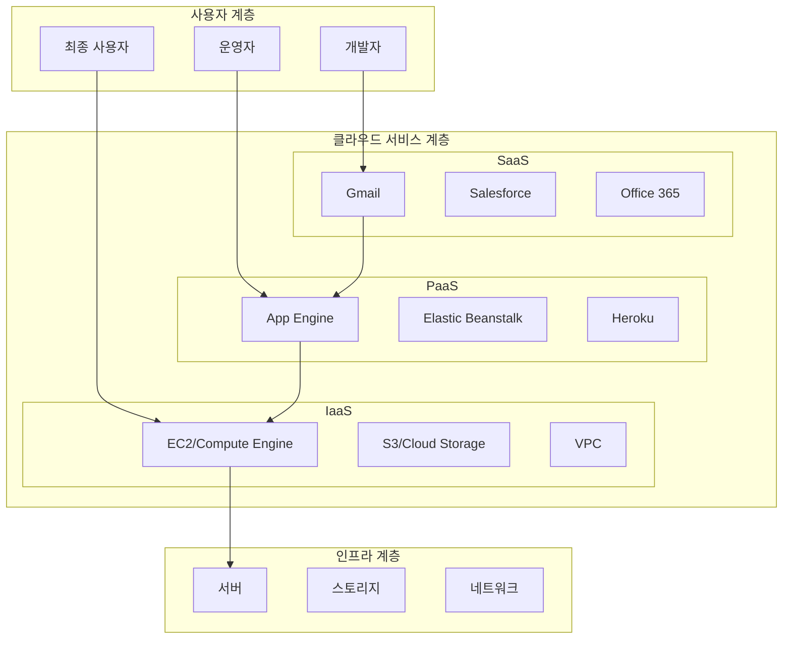
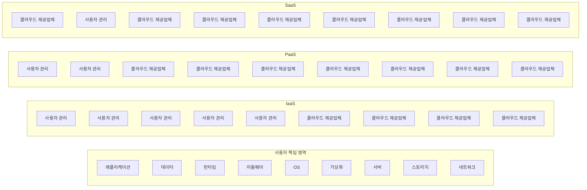
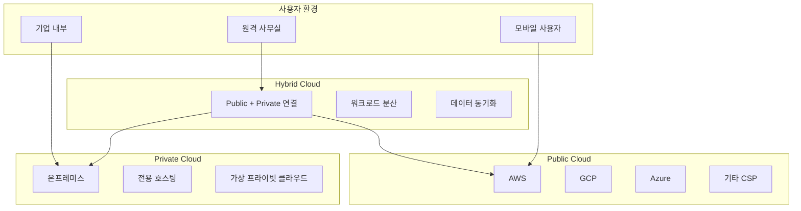
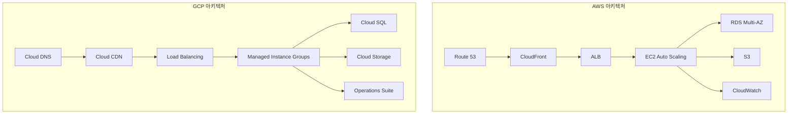
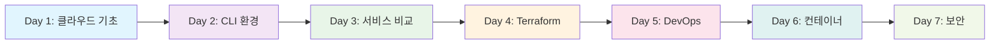

# 1-1. 클라우드 컴퓨팅 소개

**클라우드의 기본 개념부터 AWS vs GCP 비교까지**


---

## 학습 목표

**이번 강의를 통해 다음을 달성할 수 있습니다:**

- 클라우드 컴퓨팅의 정의와 특징 이해
- 클라우드 서비스 모델 (IaaS, PaaS, SaaS) 구분
- 클라우드 배포 모델 (Public, Private, Hybrid) 이해
- AWS와 GCP의 차이점과 특징 파악

---

## 클라우드 컴퓨팅이란?

### 정의
> **클라우드 컴퓨팅**은 인터넷을 통해 컴퓨팅 리소스(서버, 스토리지, 데이터베이스, 네트워킹, 소프트웨어 등)를 필요에 따라 제공하는 기술

### 핵심 특징
- **온디맨드 셀프 서비스**: 사용자가 필요할 때 자동으로 리소스 할당
- **광범위한 네트워크 접근**: 다양한 디바이스에서 접근 가능
- **리소스 풀링**: 다중 사용자를 위한 리소스 통합 관리
- **신속한 확장성**: 수요에 따른 빠른 확장/축소
- **측정 가능한 서비스**: 사용량 기반 과금

---

## 클라우드 컴퓨팅 아키텍처 개요



---

## 클라우드 서비스 모델 비교

| 서비스 모델 | 제공 범위 | 사용자 책임 | 예시 | 적합한 사용자 |
|-------------|-----------|-------------|------|---------------|
| **IaaS** | 가상 머신, 스토리지, 네트워킹 | OS, 런타임, 애플리케이션, 데이터 | AWS EC2, GCP Compute Engine | 인프라 엔지니어, DevOps |
| **PaaS** | 개발 환경, 런타임, 미들웨어 | 애플리케이션, 데이터 | AWS Elastic Beanstalk, GCP App Engine | 개발자, 개발팀 |
| **SaaS** | 완성된 애플리케이션 | 데이터만 관리 | Gmail, Salesforce, Office 365 | 최종 사용자, 비즈니스팀 |

---

## 클라우드 서비스 모델 시각화



---

## 클라우드 배포 모델

### Public Cloud
- **AWS, GCP, Azure** 등이 제공
- **장점**: 비용 효율성, 확장성, 관리 부담 없음
- **단점**: 보안 우려, 커스터마이징 제한

### Private Cloud
- **온프레미스** 또는 **전용 호스팅**
- **장점**: 보안, 커스터마이징, 규정 준수
- **단점**: 높은 비용, 관리 복잡성

### Hybrid Cloud
- **Public + Private** 조합
- **장점**: 유연성, 비용 최적화
- **단점**: 복잡한 관리, 보안 고려사항

---

## 클라우드 배포 모델 시각화



---

## AWS vs GCP 상세 비교

### 시장 점유율 및 성장성

```
클라우드 시장 점유율 (2024년 기준)
┌─────────────────────────────────────┐
│  AWS: 32%                          │
│  ┌─────────────────────────────┐   │
│  │ ████████████████████████████│   │
│  └─────────────────────────────┘   │
│                                     │
│  Azure: 22%                        │
│  ┌─────────────────────────────┐   │
│  │ ████████████████████████    │   │
│  └─────────────────────────────┘   │
│                                     │
│  GCP: 11%                          │
│  ┌─────────────────────────────┐   │
│  │ ████████████                │   │
│  └─────────────────────────────┘   │
└─────────────────────────────────────┘
```

---

## AWS vs GCP 서비스 비교표

| 서비스 카테고리 | AWS 서비스 | GCP 서비스 | 주요 차이점 |
|-----------------|------------|------------|-------------|
| **컴퓨팅** | EC2, Lambda, ECS | Compute Engine, Cloud Functions, GKE | 인스턴스 타입, 가격 정책, 관리 수준 |
| **스토리지** | S3, EBS, EFS | Cloud Storage, Persistent Disk, Filestore | 일관성 모델, 접근 제어, 가격 구조 |
| **데이터베이스** | RDS, DynamoDB, ElastiCache | Cloud SQL, Firestore, Memorystore | 관리 수준, 확장성, 통합성 |
| **네트워킹** | VPC, ALB, CloudFront | VPC, Load Balancing, Cloud CDN | 글로벌 vs 리전별, 설정 방식 |
| **AI/ML** | SageMaker, Rekognition | AI Platform, Vision API | 서비스 범위, 사용 편의성 |

---

## AWS vs GCP 아키텍처 비교



---

## 클라우드 컴퓨팅의 장단점 분석

### 장점

```
✅ 비용 효율성
   ┌─────────────────────────────┐
   │ 사용한 만큼만 지불          │
   │ 초기 투자 비용 없음         │
   │ 운영 비용 절감              │
   └─────────────────────────────┘

✅ 확장성
   ┌─────────────────────────────┐
   │ 수요에 따른 자동 확장       │
   │ 글로벌 서비스 확장          │
   │ 탄력적 리소스 관리          │
   └─────────────────────────────┘

✅ 접근성
   ┌─────────────────────────────┐
   │ 어디서든 접근 가능          │
   │ 다양한 디바이스 지원        │
   │ 24/7 서비스 가용성          │
   └─────────────────────────────┘
```

---

### 단점

```
❌ 인터넷 의존성
   ┌─────────────────────────────┐
   │ 네트워크 문제 시 서비스 중단 │
   │ 대역폭 제한                 │
   │ 지연시간 문제               │
   └─────────────────────────────┘

❌ 보안 우려
   ┌─────────────────────────────┐
   │ 데이터 외부 저장             │
   │ 공유 책임 모델              │
   │ 규정 준수 고려사항          │
   └─────────────────────────────┘

❌ 제어 제한
   ┌─────────────────────────────┐
   │ 하드웨어 직접 제어 불가      │
   │ 서비스 종속성               │
   │ 커스터마이징 제한           │
   └─────────────────────────────┘
```

---

## 실습 준비사항 체크리스트

### 필요한 도구

| 도구 유형 | Windows | macOS | Linux | 비고 |
|-----------|---------|-------|-------|------|
| **웹 브라우저** | Chrome, Firefox, Edge | Chrome, Firefox, Safari | Chrome, Firefox | 최신 버전 권장 |
| **SSH 클라이언트** | PuTTY, Windows Terminal | Terminal, iTerm2 | Terminal, GNOME Terminal | SSH 키 관리 필요 |
| **API 테스트 도구** | Postman, Insomnia | Postman, Insomnia | Postman, Insomnia | REST API 테스트용 |

### 계정 준비

```
계정 준비 체크리스트
┌─────────────────────────────────────┐
│  AWS 계정                          │
│  ┌─────────────────────────────┐   │
│  │ □ 이메일 주소               │   │
│  │ □ 신용카드 정보             │   │
│  │ □ 전화번호 인증             │   │
│  │ □ 무료 티어 활성화          │   │
│  └─────────────────────────────┘   │
│                                     │
│  GCP 계정                          │
│  ┌─────────────────────────────┐   │
│  │ □ Google 계정               │   │
│  │ □ 신용카드 정보             │   │
│  │ □ 프로젝트 생성             │   │
│  │ □ $300 크레딧 활성화        │   │
│  └─────────────────────────────┘   │
└─────────────────────────────────────┘
```

---

## 학습 진행 체크리스트

| 단계 | 항목 | 완료 여부 | 다음 단계 |
|------|------|-----------|-----------|
| **1** | 클라우드 개념 이해 | □ | AWS/GCP 계정 생성 |
| **2** | 서비스 모델 이해 | □ | 기본 서비스 탐색 |
| **3** | 배포 모델 이해 | □ | CLI 도구 설치 |
| **4** | AWS vs GCP 비교 | □ | 실습 환경 구축 |

---

## 퀴즈 및 체크포인트

### **💭 생각해보기**

**Q1. 다음 중 IaaS에 해당하는 서비스는 무엇일까요?**

- [ ] Gmail
- [ ] AWS EC2
- [ ] Google App Engine
- [ ] Salesforce

**Q2. 클라우드 컴퓨팅의 핵심 특징이 아닌 것은?**

- [ ] 온디맨드 셀프 서비스
- [ ] 광범위한 네트워크 접근
- [ ] 물리적 서버 직접 관리
- [ ] 신속한 확장성

**Q3. AWS와 GCP의 주요 차이점은?**

- [ ] 서비스 범위
- [ ] 가격 정책
- [ ] 관리 수준
- [ ] 모두 해당

---

## 실습 시나리오

### **🎯 실습 시나리오: 클라우드 서비스 선택**

당신은 스타트업의 CTO입니다. 다음 요구사항을 만족하는 클라우드 서비스를 선택해야 합니다:

**요구사항:**
- 빠른 개발 및 배포
- 비용 효율성
- 확장성
- 보안성

**고려사항:**
1. **개발팀 역량**: 클라우드 경험 부족
2. **예산**: 월 $1,000 이하
3. **규정**: 데이터 주권 준수 필요
4. **성장**: 6개월 내 사용자 10배 증가 예상

**질문:**
- 어떤 클라우드 서비스 모델을 선택하시겠습니까?
- AWS와 GCP 중 어떤 것을 선택하시겠습니까?
- 그 이유는 무엇입니까?

---

## 다음 단계 로드맵



**다음 강의에서 다룰 내용:**
- AWS/GCP 계정 생성 및 초기 설정
- 기본 서비스 탐색 및 사용법 학습
- CLI 도구 설치 및 인증 설정

---

## 참고 자료 및 추가 학습

### **공식 문서**
- [AWS 공식 문서](https://aws.amazon.com/ko/documentation/)
- [GCP 공식 문서](https://cloud.google.com/docs)
- [클라우드 컴퓨팅 백서](https://nvlpubs.nist.gov/nistpubs/Legacy/SP/nistspecialpublication800-145.pdf)

### **추가 학습 자료**
- [AWS Well-Architected Framework](https://aws.amazon.com/architecture/well-architected/)
- [Google Cloud Architecture Framework](https://cloud.google.com/architecture/framework)
- [클라우드 네이티브 컴퓨팅 재단](https://www.cncf.io/)

### **실습 환경**
- [AWS Free Tier](https://aws.amazon.com/free/)
- [Google Cloud Free Tier](https://cloud.google.com/free)
- [AWS Cloud9](https://aws.amazon.com/ko/cloud9/)
- [Google Cloud Shell](https://cloud.google.com/shell)

---

## 버전 정보 및 업데이트

> **📅 최종 업데이트**: 2024년 1월 15일
> **☁️ AWS 서비스 버전**: 2024년 1월 기준
> **☁️ GCP 서비스 버전**: 2024년 1월 기준
> **📚 강의 버전**: v1.0.0

**호환성 확인:**
- AWS CLI v2.15.0 이상
- gcloud CLI 450.0.0 이상
- Terraform 1.6.0 이상

---

## 질문 및 토론

**이번 강의에 대한 질문이나 토론하고 싶은 주제가 있으시면 언제든 말씀해 주세요!**

- 클라우드 서비스 모델의 선택 기준
- AWS vs GCP 선택 시 고려사항
- 클라우드 마이그레이션 전략
- 비용 최적화 방법

---

## 감사합니다!

**클라우드 컴퓨팅의 기초를 다지는 첫 번째 강의를 완료했습니다!**

다음 강의에서 AWS/GCP 계정 생성과 CLI 환경 구축을 진행하겠습니다.


