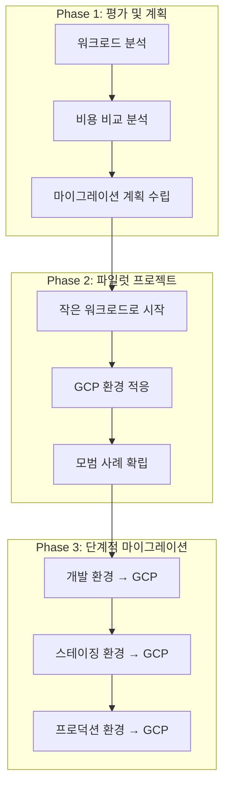

# 3-1. 컴퓨팅 서비스 비교 (EC2 vs Compute Engine, Lambda vs Cloud Functions)

## 학습 목표
- AWS EC2와 GCP Compute Engine의 차이점 이해
- AWS Lambda와 GCP Cloud Functions의 특징 비교
- 각 서비스의 적합한 사용 사례 파악
- 비용 구조와 성능 특성 분석
- 마이그레이션 전략 및 모범 사례 학습

---


## 가상 머신 서비스 비교

### AWS EC2 vs GCP Compute Engine

#### 1. 기본 특징
| 특징 | AWS EC2 | GCP Compute Engine |
|------|---------|-------------------|
| **가상화 기술** | Xen, Nitro | KVM |
| **인스턴스 타입** | 400+ 종류 | 200+ 종류 |
| **가용영역** | 3개/리전 | 3개/리전 |
| **스팟 인스턴스** | Spot Instances | Preemptible VMs |
| **전용 호스트** | Dedicated Hosts | Sole-tenant nodes |

#### 2. 인스턴스 패밀리 비교
| 워크로드 | AWS | GCP | 특징 |
|----------|-----|-----|------|
| **General Purpose** | t3, m5, m6 | e2, n2, n2d | 균형잡힌 성능 |
| **Compute Optimized** | c5, c6 | c2, c2d | 고성능 컴퓨팅 |
| **Memory Optimized** | r5, r6 | m2, m2-ultramem | 대용량 메모리 |
| **Storage Optimized** | i3, d2 | c2d | 고성능 스토리지 |
| **GPU** | p3, p4, g4 | a2, g2 | 머신러닝/그래픽 |

---

## AWS EC2 상세 분석

### EC2의 강점
✅ **다양한 인스턴스 타입**: 워크로드별 최적화
✅ **Spot 인스턴스**: 최대 90% 할인
✅ **Reserved Instances**: 장기 약정 할인
✅ **Dedicated Hosts**: 규정 준수 요구사항
✅ **Placement Groups**: 네트워크 성능 최적화

### EC2의 약점
❌ **복잡한 가격 구조**: 다양한 할인 옵션으로 인한 혼란
❌ **제한적인 커스터마이징**: 하드웨어 사양 고정
❌ **가용영역 제약**: 리전별 3개 AZ 제한

### EC2 사용 사례
- **전통적인 웹 애플리케이션**
- **엔터프라이즈 워크로드**
- **규정 준수가 중요한 환경**
- **복잡한 네트워크 구성**

---

## GCP Compute Engine 상세 분석

### Compute Engine의 강점
✅ **간단한 가격 구조**: Sustained Use Discounts
✅ **Live Migration**: 다운타임 없는 유지보수
✅ **Custom Machine Types**: 정확한 사양 맞춤
✅ **Preemptible VMs**: 비용 효율적인 배치 작업
✅ **Container-Optimized OS**: Docker 네이티브 지원

### Compute Engine의 약점
❌ **제한적인 인스턴스 타입**: AWS 대비 적은 선택지
❌ **Preemptible 제한**: 24시간 이내 종료
❌ **지역별 가용성**: 일부 서비스 제한적

### Compute Engine 사용 사례
- **Google 서비스와의 통합**
- **컨테이너 기반 워크로드**
- **데이터 분석 및 머신러닝**
- **비용 효율적인 개발 환경**

---

## 서버리스 컴퓨팅 비교

### AWS Lambda vs GCP Cloud Functions

#### 1. 기본 특징
| 특징 | AWS Lambda | GCP Cloud Functions |
|------|------------|---------------------|
| **런타임 지원** | 15+ 언어 | 8+ 언어 |
| **최대 실행 시간** | 15분 | 9분 (1세대), 60분 (2세대) |
| **메모리 범위** | 128MB - 10GB | 128MB - 32GB |
| **동시 실행** | 1000 (기본) | 무제한 |
| **Cold Start** | VPC 연결 시 느림 | 일반적으로 빠름 |

#### 2. 가격 구조 비교
| 서비스 | 요청당 비용 | GB-초당 비용 | 무료 티어 |
|--------|-------------|--------------|-----------|
| **AWS Lambda** | $0.20/100만 요청 | $0.0000166667 | 100만 요청/월 |
| **GCP Functions** | $0.40/100만 요청 | $0.0000025 | 200만 요청/월 |

---

## AWS Lambda 상세 분석

### Lambda의 강점
✅ **풍부한 통합**: 200+ AWS 서비스와 통합
✅ **계층화 아키텍처**: 공통 코드 재사용
✅ **VPC 지원**: 프라이빗 네트워크 접근
✅ **Step Functions**: 복잡한 워크플로우 관리
✅ **X-Ray**: 분산 추적 및 디버깅

### Lambda의 약점
❌ **Cold Start**: VPC 연결 시 지연
❌ **실행 시간 제한**: 15분 제한
❌ **메모리 제한**: 최대 10GB
❌ **VPC 제약**: ENI 제한으로 인한 확장성 문제

### Lambda 사용 사례
- **API 백엔드**
- **파일 처리**
- **실시간 데이터 처리**
- **마이크로서비스**
- **IoT 데이터 처리**

---

## GCP Cloud Functions 상세 분석

### Cloud Functions의 강점
✅ **빠른 Cold Start**: 일반적으로 AWS보다 빠름
✅ **Google 서비스 통합**: BigQuery, Pub/Sub 등
✅ **2세대 함수**: 더 긴 실행 시간, 더 많은 메모리
✅ **비용 효율성**: GB-초당 비용이 낮음
✅ **간단한 배포**: 소스 코드에서 직접 배포

### Cloud Functions의 약점
❌ **제한적인 언어 지원**: AWS 대비 적은 런타임
❌ **실행 시간 제한**: 1세대는 9분 제한
❌ **VPC 제한**: 2세대에서만 VPC 지원
❌ **통합 제한**: AWS 서비스와의 제한적 통합

### Cloud Functions 사용 사례
- **Google 서비스 연동**
- **웹훅 처리**
- **데이터 파이프라인**
- **이벤트 기반 처리**
- **API 게이트웨이 백엔드**

---

## 성능 및 확장성 비교

### 가상 머신 성능 비교

#### 1. CPU 성능
```
AWS c5.2xlarge (8 vCPU) vs GCP c2-standard-8 (8 vCPU)
├── AWS: Intel Xeon Platinum 8000 series
├── GCP: Intel Xeon Scalable 2nd generation
└── 벤치마크: GCP가 평균 5-10% 우수
```

#### 2. 네트워크 성능
```
AWS: 최대 10 Gbps (인스턴스 타입별)
GCP: 최대 32 Gbps (인스턴스 타입별)
네트워크 성능: GCP가 전반적으로 우수
```

#### 3. 스토리지 성능
```
AWS EBS: 최대 16,000 IOPS
GCP Persistent Disk: 최대 64,000 IOPS
스토리지 성능: GCP가 우수
```

---

## 서버리스 성능 비교

### Cold Start 성능
```
AWS Lambda (VPC 없음): 평균 100-200ms
AWS Lambda (VPC): 평균 1-3초
GCP Functions (1세대): 평균 200-500ms
GCP Functions (2세대): 평균 100-300ms

결론: GCP가 일반적으로 더 빠른 Cold Start
```

### 확장성 비교
```
AWS Lambda:
├── 동시 실행: 1000 (기본), 무제한 (요청)
├── 리전별 제한: 없음
└── 버스트 제한: 초당 500-3000 요청

GCP Functions:
├── 동시 실행: 무제한
├── 리전별 제한: 없음
└── 버스트 제한: 초당 1000 요청
```

---

## 비용 최적화 전략

### 가상 머신 비용 최적화

#### AWS EC2 최적화
```bash
# Spot 인스턴스 사용 (최대 90% 할인)
aws ec2 run-instances \
    --instance-type c5.large \
    --spot-price 0.05

# Reserved Instance 구매 (1-3년 약정)
aws ec2 describe-reserved-instances-offerings \
    --instance-type c5.large \
    --offering-type All Upfront

# Savings Plans (유연한 약정)
# AWS 콘솔에서 설정
```

#### GCP Compute Engine 최적화
```bash
# Preemptible 인스턴스 사용 (최대 80% 할인)
gcloud compute instances create preemptible-instance \
    --machine-type=e2-standard-2 \
    --preemptible

# Sustained Use Discounts (자동 할인)
# 25% 이상 사용 시 자동 적용

# Committed Use Discounts (1-3년 약정)
gcloud compute commitments create \
    --resources=machineType=e2-standard-2,count=1 \
    --region=asia-northeast3
```

---

## 마이그레이션 전략

### AWS에서 GCP로 마이그레이션

#### 1. 단계별 접근 (Infographic)



#### 2. 마이그레이션 도구
- **AWS Database Migration Service**: 데이터베이스 마이그레이션
- **AWS Server Migration Service**: 서버 마이그레이션
- **GCP Migrate for Compute Engine**: VM 마이그레이션
- **GCP Database Migration Service**: 데이터베이스 마이그레이션

---

## 모범 사례 및 권장사항

### 가상 머신 모범 사례

#### 1. AWS EC2
- [ ] **Auto Scaling Groups**: 자동 확장/축소 구성
- [ ] **Launch Templates**: 일관된 인스턴스 구성
- [ ] **Systems Manager**: 패치 및 구성 관리
- [ ] **CloudWatch**: 모니터링 및 알림 설정

#### 2. GCP Compute Engine
- [ ] **Instance Groups**: 관리형 인스턴스 그룹 사용
- [ ] **Instance Templates**: 표준화된 인스턴스 구성
- [ ] **OS Config**: 자동 패치 및 구성 관리
- [ ] **Cloud Monitoring**: 성능 모니터링 설정

### 서버리스 모범 사례

#### 1. AWS Lambda
- [ ] **함수 계층화**: 공통 코드를 레이어로 분리
- [ ] **비동 처리**: SQS, SNS 활용
- [ ] **VPC 최소화**: 필요한 경우에만 VPC 사용
- [ ] **메모리 최적화**: 적절한 메모리 할당

#### 2. GCP Cloud Functions
- [ ] **2세대 함수**: 긴 실행 시간이 필요한 경우
- [ ] **Pub/Sub 통합**: 이벤트 기반 아키텍처
- [ ] **Cloud Build**: 자동화된 배포
- [ ] **Error Reporting**: 오류 추적 및 모니터링

---

## 실습 과제

### 기본 실습
1. **EC2와 Compute Engine 인스턴스 생성 비교**
2. **Lambda와 Cloud Functions 함수 생성 및 테스트**
3. **비용 분석 및 최적화 전략 수립**

### 고급 실습
1. **Auto Scaling 그룹 구성 및 테스트**
2. **서버리스 아키텍처 구축**
3. **크로스 플랫폼 마이그레이션 계획 수립**

---

## 다음 단계
- 스토리지 서비스 비교 (S3 vs Cloud Storage)
- 네트워크 서비스 비교 (VPC)
- 데이터베이스 서비스 비교 (RDS vs Cloud SQL)

---

## 참고 자료
- [AWS EC2 사용자 가이드](https://docs.aws.amazon.com/ec2/latest/userguide/)
- [GCP Compute Engine 문서](https://cloud.google.com/compute/docs)
- [AWS Lambda 개발자 가이드](https://docs.aws.amazon.com/lambda/latest/dg/)
- [GCP Cloud Functions 문서](https://cloud.google.com/functions/docs)
- [AWS vs GCP 비용 비교](https://calculator.aws/)
- [GCP 가격 계산기](https://cloud.google.com/products/calculator)