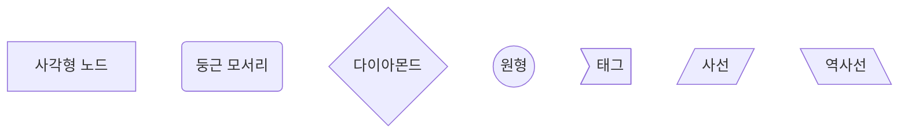
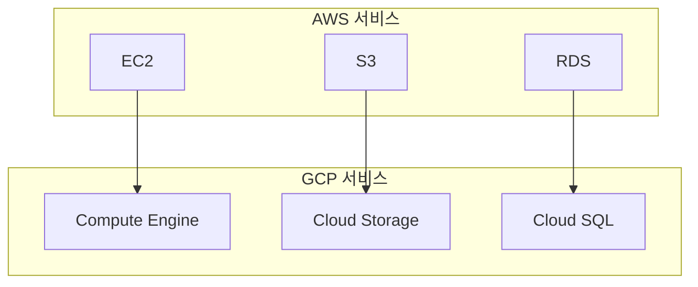
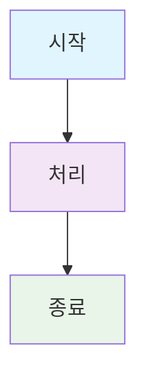
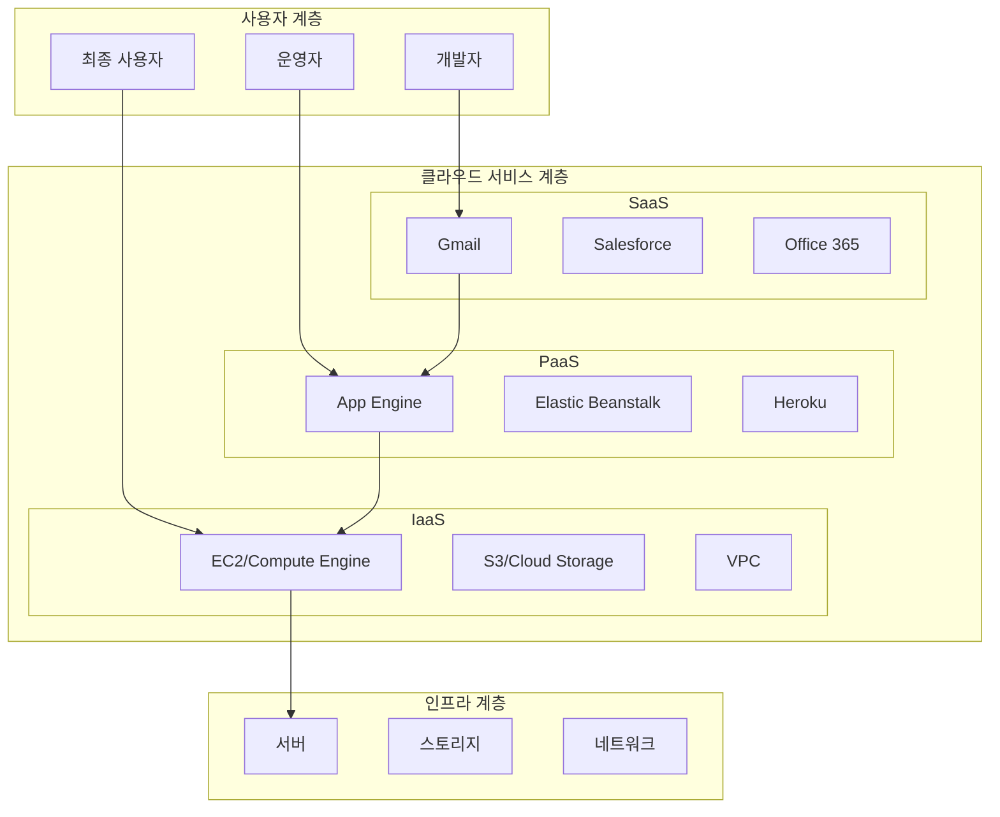

# 마크다운 슬라이드 시각화 구현 가이드

**`mcp_knowledge_base\slides` 디렉토리의 전달력을 높이는 시각화 요소 완벽 가이드**


---

## 📚 **목차**

1. [기본 시각화 요소](#기본-시각화-요소)
2. [Mermaid 다이어그램](#mermaid-다이어그램)
3. [인포그래픽 및 아스키 아트](#인포그래픽-및-아스키-아트)
4. [고급 테이블 및 비교표](#고급-테이블-및-비교표)
5. [커스텀 CSS 활용](#커스텀-css-활용)
6. [대화형 요소](#대화형-요소)
7. [애니메이션 및 효과](#애니메이션-및-효과)
8. [반응형 디자인](#반응형-디자인)
9. [구현 우선순위](#구현-우선순위)
10. [실습 예제](#실습-예제)

---

## 기본 시각화 요소

### 1. 이미지 및 다이어그램

#### 기본 이미지 삽입
```markdown


예시:

```

#### 이미지 크기 조정
```markdown


```

### 2. 구분선 및 섹션

#### 기본 구분선
```markdown
---

또는

***
```

#### 섹션 구분
```markdown
## 📚 **학습 목표**
## 🎯 **핵심 개념**
## 🏢 **실제 사례**
## 📝 **실습 가이드**
```

---

## Mermaid 다이어그램

### 1. 기본 문법

#### 그래프 타입
```markdown
```mermaid
graph TD    # Top-Down
graph LR    # Left-Right
graph TB    # Top-Bottom
graph BT    # Bottom-Top
```
```

### 2. 노드 및 엣지

#### 기본 노드
```markdown

```

#### 엣지 스타일
```markdown
```mermaid
graph LR
    A --> B        # 화살표
    C --- D        # 선
    E -.-> F       # 점선
    G ==> H        # 굵은 화살표
    I -.- J        # 점선
```
```

### 3. 서브그래프

#### 서브그래프 예시
```markdown

```

### 4. 스타일링

#### 노드 스타일
```markdown

```

#### 색상 팔레트
```css
/* 기본 색상 */
#e1f5fe  /* 연한 파랑 */
#f3e5f5  /* 연한 보라 */
#e8f5e8  /* 연한 초록 */
#fff3e0  /* 연한 주황 */
#fce4ec  /* 연한 분홍 */
#e0f2f1  /* 연한 청록 */
#f1f8e9  /* 연한 연두 */
```

---

## 인포그래픽 및 아스키 아트

### 1. 박스 형태 인포그래픽

#### 기본 박스
```
┌─────────────────────────────────────┐
│  제목                              │
│  ┌─────────────────────────────┐   │
│  │ 내용                        │   │
│  │ 내용                        │   │
│  └─────────────────────────────┘   │
└─────────────────────────────────────┘
```

#### 진행률 표시
```
완료율: 75%
┌─────────────────────────────────────┐
│ ████████████████████████            │
└─────────────────────────────────────┘
```

### 2. 통계 시각화

#### 막대 그래프
```
AWS: ████████████████████████████ 32%
GCP: ████████████               11%
Azure: ████████████████████     22%
```

#### 원형 차트 (ASCII)
```
클라우드 시장 점유율
    ╭─────────╮
   ╱    AWS    ╲
  ╱   (32%)     ╲
 ╱                ╲
╱                  ╲
╲                  ╱
 ╲                ╱
  ╲              ╱
   ╲            ╱
    ╰─────────╯
```

---

## 고급 테이블 및 비교표

### 1. 기본 테이블

#### 단순 테이블
```markdown
| 서비스 | AWS | GCP | 차이점 |
|--------|-----|-----|--------|
| 컴퓨팅 | EC2 | Compute Engine | 인스턴스 타입 |
| 스토리지 | S3 | Cloud Storage | 일관성 모델 |
```

#### 복합 테이블
```markdown
| 서비스 카테고리 | AWS 서비스 | GCP 서비스 | 주요 차이점 | 가격 비교 |
|-----------------|------------|------------|-------------|-----------|
| **컴퓨팅** | EC2, Lambda, ECS | Compute Engine, Cloud Functions, GKE | 인스턴스 타입, 가격 정책 | AWS 15% 비쌈 |
| **스토리지** | S3, EBS, EFS | Cloud Storage, Persistent Disk, Filestore | 일관성 모델, 접근 제어 | GCP 10% 저렴 |
```

### 2. 체크리스트 테이블

#### 진행 상황 체크
```markdown
| 단계 | 항목 | 완료 여부 | 다음 단계 |
|------|------|-----------|-----------|
| **1** | 클라우드 개념 이해 | ✅ | AWS/GCP 계정 생성 |
| **2** | CLI 환경 구축 | ✅ | 기본 서비스 탐색 |
| **3** | 서비스 비교 분석 | 🔄 | Terraform 학습 |
| **4** | 인프라 자동화 | ⏳ | DevOps 실습 |
```

---

## 커스텀 CSS 활용

### 1. CSS 파일 연결

#### Marp 설정
```markdown
---
marp: true
theme: default
paginate: true
backgroundColor: #fff
backgroundImage: url('https://marp.app/assets/hero-background.svg')
style: |
  @import url('./custom-theme.css');
---
```

### 2. 주요 CSS 클래스

#### 카드 레이아웃
```html
<div class="card hover-lift">
  <div class="card-header">
    <h4 class="card-title">제목</h4>
  </div>
  <div class="card-body">
    <p>내용</p>
  </div>
</div>
```

#### 그리드 시스템
```html
<div class="grid grid-2">
  <div class="card">내용 1</div>
  <div class="card">내용 2</div>
</div>

<div class="grid grid-3">
  <div class="card">내용 1</div>
  <div class="card">내용 2</div>
  <div class="card">내용 3</div>
</div>
```

#### 알림 시스템
```html
<div class="alert alert-info">
  <strong>정보:</strong> 중요한 정보입니다.
</div>

<div class="alert alert-success">
  <strong>성공:</strong> 작업이 완료되었습니다.
</div>

<div class="alert alert-warning">
  <strong>주의:</strong> 주의가 필요한 사항입니다.
</div>

<div class="alert alert-error">
  <strong>오류:</strong> 오류가 발생했습니다.
</div>
```

### 3. 배지 및 상태 표시

#### 배지 스타일
```html
<span class="badge badge-primary">Primary</span>
<span class="badge badge-secondary">Secondary</span>
<span class="badge badge-success">Success</span>
<span class="badge badge-warning">Warning</span>
<span class="badge badge-error">Error</span>
<span class="badge badge-info">Info</span>
```

#### 진행률 바
```html
<div class="progress-bar">
  <div class="progress-fill" style="width: 75%"></div>
</div>
```

---

## 대화형 요소

### 1. 퀴즈 및 체크포인트

#### 기본 퀴즈
```markdown
**Q1. 다음 중 AWS의 핵심 컴퓨팅 서비스는?**

- [ ] Cloud Functions
- [ ] EC2 (Elastic Compute Cloud)
- [ ] Compute Engine
- [ ] Virtual Machines

**Q2. 클라우드 컴퓨팅의 핵심 특징이 아닌 것은?**

- [ ] 온디맨드 셀프 서비스
- [ ] 광범위한 네트워크 접근
- [ ] 물리적 서버 직접 관리
- [ ] 신속한 확장성
```

#### 체크리스트
```html
<ul class="checklist">
  <li class="completed">완료된 항목</li>
  <li>진행 중인 항목</li>
  <li>예정된 항목</li>
</ul>
```

### 2. 실습 시나리오

#### 시나리오 템플릿
```markdown
### **🎯 실습 시나리오: [제목]**

당신은 [역할]입니다. 다음 요구사항을 만족하는 [목표]를 [도구]로 [작업]해야 합니다:

**요구사항:**
- [요구사항 1]
- [요구사항 2]
- [요구사항 3]

**고려사항:**
1. **[제약사항 1]**: [설명]
2. **[제약사항 2]**: [설명]
3. **[제약사항 3]**: [설명]

**질문:**
- [질문 1]
- [질문 2]
- [질문 3]
```

---

## 애니메이션 및 효과

### 1. CSS 애니메이션

#### 페이드 인
```html
<div class="animate-fade-in">
  <p>페이드 인 효과가 적용된 텍스트</p>
</div>
```

#### 슬라이드 인
```html
<div class="animate-slide-in">
  <p>왼쪽에서 슬라이드 인되는 텍스트</p>
</div>
```

#### 펄스 효과
```html
<div class="animate-pulse">
  <p>펄스 효과가 적용된 텍스트</p>
</div>
```

### 2. 호버 효과

#### 리프트 효과
```html
<div class="card hover-lift">
  <p>마우스 호버 시 위로 올라가는 카드</p>
</div>
```

#### 스케일 효과
```html
<div class="card hover-scale">
  <p>마우스 호버 시 확대되는 카드</p>
</div>
```

---

## 반응형 디자인

### 1. 그리드 시스템

#### 2열 그리드
```html
<div class="grid grid-2">
  <div class="card">왼쪽 카드</div>
  <div class="card">오른쪽 카드</div>
</div>
```

#### 3열 그리드
```html
<div class="grid grid-3">
  <div class="card">첫 번째 카드</div>
  <div class="card">두 번째 카드</div>
  <div class="card">세 번째 카드</div>
</div>
```

### 2. 플렉스 레이아웃

#### 기본 플렉스
```html
<div class="flex">
  <span class="badge badge-primary">Badge 1</span>
  <span class="badge badge-secondary">Badge 2</span>
  <span class="badge badge-info">Badge 3</span>
</div>
```

#### 세로 플렉스
```html
<div class="flex flex-col">
  <span class="badge badge-primary">Badge 1</span>
  <span class="badge badge-secondary">Badge 2</span>
  <span class="badge badge-info">Badge 3</span>
</div>
```

#### 중앙 정렬
```html
<div class="flex flex-center">
  <span class="badge badge-primary">중앙 정렬된 배지</span>
</div>
```

---

## 구현 우선순위

### 🟢 **높은 우선순위 (즉시 적용)**

1. **Mermaid 다이어그램 추가**
   - 아키텍처 다이어그램
   - 프로세스 플로우
   - 서비스 관계도

2. **테이블 및 비교표 활용**
   - AWS vs GCP 비교
   - 서비스별 특징
   - 가격 비교

3. **이미지 및 다이어그램**
   - 관련 이미지 추가
   - 스크린샷 활용
   - 아이콘 및 배지

### 🟡 **중간 우선순위 (단계적 적용)**

1. **인포그래픽 요소**
   - 통계 시각화
   - 진행률 표시
   - 상태 표시

2. **대화형 요소**
   - 퀴즈 및 체크포인트
   - 실습 시나리오
   - 학습 진행 체크

3. **커스텀 CSS 클래스**
   - 카드 레이아웃
   - 알림 시스템
   - 배지 및 상태

### 🔴 **낮은 우선순위 (향후 적용)**

1. **고급 애니메이션**
   - CSS 애니메이션
   - 호버 효과
   - 전환 효과

2. **반응형 디자인**
   - 그리드 시스템
   - 플렉스 레이아웃
   - 모바일 최적화

3. **대화형 기능**
   - 실시간 피드백
   - 인터랙티브 차트
   - 동적 콘텐츠

---

## 실습 예제

### 1. 기본 슬라이드 구조

```markdown
---
marp: true
theme: default
paginate: true
backgroundColor: #fff
backgroundImage: url('https://marp.app/assets/hero-background.svg')
style: |
  @import url('./custom-theme.css');
---

# [제목]

**[부제목]**


---

## 학습 목표

**이번 강의를 통해 다음을 달성할 수 있습니다:**

- [목표 1]
- [목표 2]
- [목표 3]

---

## [주제 1]

### [소제목]

[내용]

---

## [주제 2]

```mermaid
[다이어그램 코드]
```

---

## [주제 3]

| 항목 | 설명 | 비고 |
|------|------|------|
| [항목 1] | [설명 1] | [비고 1] |
| [항목 2] | [설명 2] | [비고 2] |

---

## 퀴즈 및 체크포인트

### **💭 생각해보기**

**Q1. [질문]**

- [ ] [선택지 1]
- [ ] [선택지 2]
- [ ] [선택지 3]

---

## 실습 시나리오

### **🎯 실습 시나리오: [제목]**

[시나리오 내용]

---

## 다음 단계

[다음 단계 설명]

---

## 참고 자료

- [참고 자료 1]
- [참고 자료 2]
- [참고 자료 3]

---

## 감사합니다!

[마무리 메시지]


```

### 2. 고급 시각화 예시

#### 복합 다이어그램
```markdown

```

#### 고급 테이블
```markdown
| 서비스 모델 | 제공 범위 | 사용자 책임 | 예시 | 적합한 사용자 |
|-------------|-----------|-------------|------|---------------|
| **IaaS** | 가상 머신, 스토리지, 네트워킹 | OS, 런타임, 애플리케이션, 데이터 | AWS EC2, GCP Compute Engine | 인프라 엔지니어, DevOps |
| **PaaS** | 개발 환경, 런타임, 미들웨어 | 애플리케이션, 데이터 | AWS Elastic Beanstalk, GCP App Engine | 개발자, 개발팀 |
| **SaaS** | 완성된 애플리케이션 | 데이터만 관리 | Gmail, Salesforce, Office 365 | 최종 사용자, 비즈니스팀 |
```

---

## 마무리

이 가이드를 통해 `mcp_knowledge_base\slides` 디렉토리의 모든 슬라이드에 고급 시각화 요소를 적용할 수 있습니다.

### **주요 포인트:**

1. **단계적 적용**: 높은 우선순위부터 순차적으로 적용
2. **일관성 유지**: 모든 슬라이드에 동일한 스타일 적용
3. **사용자 경험**: 학습 효과를 높이는 시각화 요소 선택
4. **유지보수**: 커스텀 CSS를 통한 중앙 집중식 스타일 관리

### **다음 단계:**

1. 기존 슬라이드에 기본 시각화 요소 적용
2. 커스텀 CSS 테마 완성
3. 고급 애니메이션 및 효과 추가
4. 반응형 디자인 최적화

**시각화를 통해 슬라이드의 전달력과 학습 효과를 크게 향상시킬 수 있습니다!** 🚀
